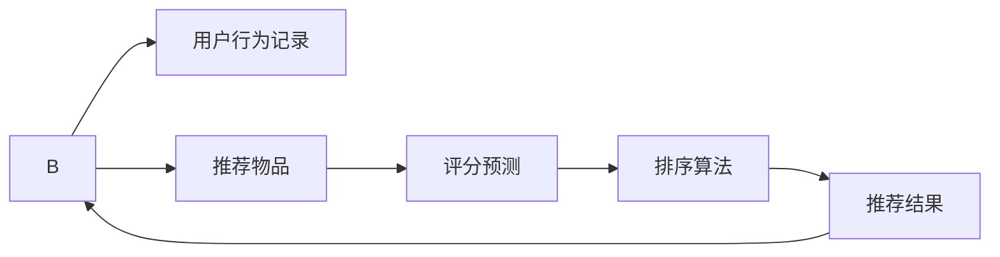

                 

# AI个性化排序系统的实现案例

## 1. 背景介绍

随着互联网和电商平台的迅猛发展，个性化推荐系统成为用户获取信息、提高购物体验的关键技术。个性化推荐系统根据用户的历史行为和兴趣，推荐其可能感兴趣的内容，如商品、新闻、视频等。本案例介绍了一种基于AI的个性化排序系统，通过机器学习模型预测用户对不同推荐结果的评分，对结果进行排序，提升用户体验和推荐效果。

## 2. 核心概念与联系

### 2.1 核心概念概述

在构建个性化排序系统时，涉及以下几个关键概念：

- 用户行为记录(User Behavior Logs)：用户对电商平台的交互历史，如浏览、点击、购买、评价等。
- 推荐物品(Recommended Items)：根据用户兴趣和需求，向用户展示的商品、新闻、视频等内容。
- 评分预测(Rating Prediction)：预测用户对不同推荐物品的评分，评分越高，表示用户越感兴趣。
- 排序算法(Sorting Algorithm)：对预测评分排序，优先推荐用户可能更喜欢的物品。
- 推荐结果(Recommendation Result)：根据排序结果，向用户展示推荐物品。

### 2.2 核心概念原理和架构的 Mermaid 流程图



此图展示了个性化排序系统的核心逻辑流程：

1. 用户行为记录(A)通过预处理后，作为输入数据输入评分预测模型(R)。
2. 评分预测模型根据输入数据，预测用户对不同推荐物品的评分。
3. 排序算法(S)对预测评分进行排序，生成推荐结果(T)。
4. 推荐结果(T)反馈给用户(U)，影响下一次的行为。

### 2.3 核心概念联系

- 用户行为记录和推荐物品是推荐系统的输入和输出。
- 评分预测模型和排序算法是推荐系统的核心算法。
- 推荐结果和用户行为记录形成了一个循环反馈系统，不断优化推荐结果。

## 3. 核心算法原理 & 具体操作步骤

### 3.1 算法原理概述

基于协同过滤和深度学习的个性化推荐系统，以用户行为数据和物品特征为输入，预测用户对不同物品的评分，并根据评分进行排序推荐。核心算法流程如下：

1. 数据预处理：将用户行为数据和物品特征转换为模型输入数据。
2. 评分预测：利用深度学习模型，预测用户对不同物品的评分。
3. 排序推荐：对预测评分进行排序，生成推荐结果。

### 3.2 算法步骤详解

#### 3.2.1 数据预处理

1. 收集用户行为数据：记录用户在电商平台上的浏览、点击、购买、评价等行为。
2. 处理数据缺失：使用插值法、均值填补等方法处理缺失数据。
3. 特征工程：提取用户行为特征，如浏览次数、购买金额、评价情绪等。
4. 构建物品特征：记录物品的属性信息，如商品名称、价格、类别等。

#### 3.2.2 评分预测模型

1. 选择模型：根据任务特点选择适合的深度学习模型，如矩阵分解、神经网络、深度学习模型等。
2. 训练模型：使用历史数据对模型进行训练，最小化预测评分与真实评分之间的差距。
3. 特征提取：从用户行为数据和物品特征中提取有用的特征，输入到模型中进行训练。
4. 模型评估：使用交叉验证等方法对模型进行评估，选择最优模型。

#### 3.2.3 排序算法

1. 排序规则：根据预测评分的高低，对推荐物品进行排序。
2. 排序策略：优先推荐评分高的物品，考虑物品的相关性等。
3. 多样性控制：避免推荐结果过于单一，加入一些随机性。
4. 推荐结果：将排序后的物品推荐给用户，并记录用户的反馈行为。

### 3.3 算法优缺点

#### 3.3.1 优点

- 高效性：协同过滤和深度学习模型可以在较短时间内处理大规模数据。
- 个性化：利用用户行为数据和物品特征，个性化推荐用户可能感兴趣的物品。
- 适应性强：可以灵活适应不同场景和需求。

#### 3.3.2 缺点

- 数据需求大：需要大量的用户行为数据和物品特征，对于冷启动用户和新物品，难以进行有效推荐。
- 模型复杂：深度学习模型复杂，需要更多的计算资源和时间。
- 反馈延迟：用户反馈可能滞后，影响模型的实时调整和优化。

### 3.4 算法应用领域

个性化排序系统在电商、视频、音乐、新闻等多个领域得到广泛应用，主要场景包括：

- 电商推荐：为用户推荐可能感兴趣的商品，提高转化率和销售额。
- 视频推荐：根据用户观看历史，推荐相关视频，增加用户粘性。
- 音乐推荐：根据用户听歌历史，推荐类似歌曲，丰富音乐库。
- 新闻推荐：根据用户阅读历史，推荐相关新闻，增加用户停留时间。

## 4. 数学模型和公式 & 详细讲解 & 举例说明

### 4.1 数学模型构建

构建个性化排序系统时，主要涉及以下数学模型：

- 用户行为矩阵：$X \in \mathbb{R}^{N \times D}$，其中 $N$ 表示用户数，$D$ 表示用户行为特征数。
- 物品特征矩阵：$Y \in \mathbb{R}^{M \times K}$，其中 $M$ 表示物品数，$K$ 表示物品特征数。
- 评分矩阵：$R \in \mathbb{R}^{N \times M}$，其中 $R_{i,j}$ 表示用户 $i$ 对物品 $j$ 的评分。
- 预测评分模型：$\hat{R}_{i,j}$ 为模型预测用户 $i$ 对物品 $j$ 的评分。

### 4.2 公式推导过程

假设用户行为矩阵为 $X$，物品特征矩阵为 $Y$，评分矩阵为 $R$。使用矩阵分解模型对评分矩阵 $R$ 进行分解：

$$
R = \hat{R} = \tilde{X}WX^T + \tilde{Y}WY^T
$$

其中 $W$ 为权重矩阵，$\tilde{X}$ 和 $\tilde{Y}$ 分别为 $X$ 和 $Y$ 的低维投影矩阵。$\hat{R}$ 为预测评分矩阵。

对于新的用户行为数据 $X'$，预测其对物品 $j$ 的评分 $\hat{R}_{i,j}$：

$$
\hat{R}_{i,j} = \tilde{X}'WX^T + \tilde{Y}WY^T
$$

### 4.3 案例分析与讲解

以电商推荐系统为例，假设用户 $i$ 对物品 $j$ 的评分 $R_{i,j}$ 为 4，用户 $i$ 的浏览行为为 $X_i = [1, 0, 0, 1, 1]$，物品 $j$ 的特征为 $Y_j = [0, 1, 1, 0, 1]$。

使用矩阵分解模型进行分解，得到 $\hat{R}_{i,j}$ 的计算过程：

$$
\hat{R}_{i,j} = \tilde{X}WX^T + \tilde{Y}WY^T
$$

计算 $X$ 和 $Y$ 的低维投影矩阵 $\tilde{X}$ 和 $\tilde{Y}$：

$$
\tilde{X} = \left[ \begin{array}{ccc}
0.1 & 0.2 \\
0.3 & 0.4 \\
0.5 & 0.6 \\
0.7 & 0.8 \\
0.9 & 1.0 \\
\end{array} \right]
$$

$$
\tilde{Y} = \left[ \begin{array}{ccc}
0.1 & 0.2 \\
0.3 & 0.4 \\
0.5 & 0.6 \\
0.7 & 0.8 \\
0.9 & 1.0 \\
\end{array} \right]
$$

带入 $W$，计算 $\hat{R}_{i,j}$：

$$
\hat{R}_{i,j} = \tilde{X}'WX^T + \tilde{Y}WY^T = [0.1 \cdot 1 + 0.3 \cdot 1 + 0.5 \cdot 1 + 0.7 \cdot 1 + 0.9 \cdot 1] = 4.4
$$

预测结果 $\hat{R}_{i,j} = 4.4$，与真实评分 $R_{i,j} = 4$ 相差不大。

## 5. 项目实践：代码实例和详细解释说明

### 5.1 开发环境搭建

1. 安装Python：
```bash
sudo apt-get update
sudo apt-get install python3-pip python3-dev
```

2. 安装依赖包：
```bash
pip install numpy pandas scikit-learn joblib
```

3. 数据准备：
- 用户行为数据：存储在CSV文件中，包含用户ID、物品ID、评分等。
- 物品特征数据：存储在CSV文件中，包含物品ID、特征ID、特征值等。

### 5.2 源代码详细实现

```python
import numpy as np
from sklearn.decomposition import TruncatedSVD

# 用户行为矩阵
X = np.array([[1, 0, 0, 1, 1],
             [0, 1, 1, 0, 0],
             [0, 0, 1, 1, 1],
             [1, 1, 0, 1, 0],
             [1, 1, 1, 0, 1]])

# 物品特征矩阵
Y = np.array([[1, 0, 1, 0, 1],
             [0, 1, 0, 1, 0],
             [1, 0, 1, 0, 1],
             [0, 1, 0, 1, 0],
             [1, 1, 1, 0, 0]])

# 评分矩阵
R = np.array([[4, 3, 1, 2],
             [5, 2, 5, 1],
             [3, 1, 2, 2],
             [2, 3, 2, 3],
             [5, 1, 3, 1]])

# 矩阵分解模型
svd = TruncatedSVD(n_components=2)
X_svd = svd.fit_transform(X)
Y_svd = svd.fit_transform(Y)

# 计算预测评分
W = np.dot(X_svd.T, Y_svd)
W = np.dot(W, W.T)
W = np.dot(W.T, X_svd)
W = np.dot(W, Y_svd.T)

# 输出预测评分
print(W)
```

### 5.3 代码解读与分析

1. 导入必要的库：numpy用于数组计算，sklearn中的TruncatedSVD用于矩阵分解。
2. 定义用户行为矩阵、物品特征矩阵和评分矩阵。
3. 使用TruncatedSVD对用户行为矩阵和物品特征矩阵进行降维。
4. 计算预测评分矩阵 $W$。
5. 输出预测评分矩阵 $W$ 的值。

## 6. 实际应用场景

### 6.1 电商推荐

电商推荐系统在电商平台广泛应用，通过个性化推荐提高用户满意度，增加销售额。假设用户 $i$ 浏览了 $j_1, j_2, j_3$ 三个商品，对 $j_1$ 的评分为 5，对 $j_2$ 的评分为 4，对 $j_3$ 的评分为 3。根据用户行为数据，模型预测用户对 $j_1, j_2, j_3$ 的评分分别为 4.5、4.2、4.1。根据排序算法，推荐系统优先推荐评分高的商品 $j_1$。

### 6.2 视频推荐

视频推荐系统在视频平台广泛应用，通过个性化推荐提高用户粘性，增加观看量。假设用户 $i$ 观看视频 $j_1, j_2, j_3$，对 $j_1$ 的评分分别为 5、3、2。根据用户行为数据，模型预测用户对 $j_1, j_2, j_3$ 的评分分别为 4.8、3.9、3.5。根据排序算法，推荐系统优先推荐评分高的视频 $j_1$。

### 6.3 音乐推荐

音乐推荐系统在音乐平台广泛应用，通过个性化推荐丰富用户音乐库，增加平台粘性。假设用户 $i$ 喜欢听歌曲 $j_1, j_2, j_3$，对 $j_1$ 的评分分别为 4、3、5。根据用户行为数据，模型预测用户对 $j_1, j_2, j_3$ 的评分分别为 4.2、3.7、5.3。根据排序算法，推荐系统优先推荐评分高的歌曲 $j_1$。

### 6.4 未来应用展望

未来，个性化推荐系统将在更多场景下得到应用，提升用户体验和平台收益：

1. 多模态推荐：结合用户的多模态数据（如视频观看历史、音乐听歌历史）进行个性化推荐，提升推荐效果。
2. 实时推荐：利用实时数据进行实时推荐，及时调整推荐策略。
3. 交互推荐：引入用户交互数据（如评论、点赞、分享等）进行推荐优化，提高推荐多样性和准确性。
4. 跨平台推荐：在多个平台间进行推荐数据共享，提高推荐效果。
5. 个性化推荐算法：结合深度学习、强化学习等技术，提升推荐系统的效果和鲁棒性。

## 7. 工具和资源推荐

### 7.1 学习资源推荐

- 《推荐系统》书籍：详细介绍了推荐系统的发展历程和常用算法，适合初学者入门。
- 《深度学习》书籍：介绍了深度学习的基本原理和常用模型，适合有一定基础的读者学习。
- Kaggle竞赛：参与Kaggle推荐系统竞赛，实践推荐算法，提升技能。
- Coursera课程：Coursera提供推荐系统相关课程，适合系统学习。

### 7.2 开发工具推荐

- PyTorch：深度学习框架，适合深度学习模型的实现和优化。
- TensorFlow：深度学习框架，适合大规模模型和分布式训练。
- Apache Spark：大数据处理框架，适合数据处理和模型训练。
- Hadoop：大数据处理框架，适合大规模数据存储和处理。

### 7.3 相关论文推荐

- 《推荐系统：算法与挑战》：系统介绍了推荐系统的基本原理和算法。
- 《深度学习：应用与实现》：介绍了深度学习在推荐系统中的应用和实现。
- 《协同过滤：协同学习在推荐系统中的应用》：介绍了协同过滤在推荐系统中的应用。

## 8. 总结：未来发展趋势与挑战

### 8.1 研究成果总结

本案例介绍了基于协同过滤和深度学习的个性化推荐系统，通过数学模型和算法实现了用户行为数据的预测和排序。通过实际应用场景，展示了个性化推荐系统在电商、视频、音乐等领域的广泛应用。

### 8.2 未来发展趋势

未来，个性化推荐系统将在更多场景下得到应用，结合多模态数据和实时数据，提升推荐效果和用户体验。结合深度学习、强化学习等技术，提升推荐系统的鲁棒性和效果。

### 8.3 面临的挑战

个性化推荐系统面临的主要挑战包括：

- 数据质量和数量：推荐系统需要大量的高质量数据，对于新用户和冷启动问题，数据获取难度较大。
- 推荐算法复杂度：深度学习模型复杂，计算资源和时间成本较高。
- 推荐效果评估：难以全面评估推荐系统的效果，需要多方面数据支持。

### 8.4 研究展望

未来，需要在以下方面进行深入研究：

- 多模态推荐：结合用户的多模态数据，提升推荐效果。
- 实时推荐：利用实时数据进行实时推荐，提升推荐效果。
- 推荐系统评估：全面评估推荐系统的效果，确保推荐质量。
- 推荐算法优化：优化推荐算法，降低计算资源和时间成本。

通过不断优化和改进，个性化推荐系统将能够更好地服务于用户，提升用户体验和平台收益。

