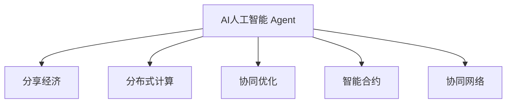

                 

# AI人工智能 Agent：在分享经济中的应用

> 关键词：
1. 人工智能(AI) Agent
2. 分享经济(Sharing Economy)
3. 分布式计算(Distributed Computing)
4. 协同优化(Co-optimization)
5. 智能合约(Smart Contracts)
6. 协同网络(Cooperative Network)
7. 用户行为分析(User Behavior Analysis)

## 1. 背景介绍

### 1.1 问题由来
分享经济作为一种新型的经济模式，正在改变人们的消费习惯和商业模式。通过共享闲置资源，实现效率最大化、成本最低化。然而，随着参与者数量的增加，如何有效管理和调度这些资源成为了一个巨大挑战。在这一背景下，AI人工智能 Agent 作为核心解决方案应运而生，被广泛应用于分享经济的各个领域。

### 1.2 问题核心关键点
AI人工智能 Agent 是一种基于人工智能技术的自动化决策系统，能够自适应、自学习、自主执行复杂任务，提升资源利用效率，降低运营成本，优化用户体验。AI Agent 在分享经济中的应用，旨在实现供需双方的高效匹配和动态协调。

## 2. 核心概念与联系

### 2.1 核心概念概述

为了更好地理解AI人工智能 Agent在分享经济中的应用，本节将介绍几个密切相关的核心概念：

- AI人工智能 Agent：一种基于人工智能技术的自动化决策系统，具备自我学习、自主执行和自适应能力，能够处理复杂任务，如资源调度、需求匹配等。
- 分享经济：通过共享闲置资源，实现资源的高效利用和低成本运营，包括共享出行、共享住宿、共享办公等。
- 分布式计算：一种计算范式，通过将任务分散在多个计算节点上进行并行处理，提高计算效率。
- 协同优化：多个系统或组件之间通过协作和优化，提升整体性能和效率。
- 智能合约：一种基于区块链技术的自动执行合约，能够在满足特定条件时自动执行。
- 协同网络：多个AI Agent之间通过协作和信息共享，共同完成复杂任务，如动态调度、资源优化等。

这些核心概念之间的逻辑关系可以通过以下Mermaid流程图来展示：



这个流程图展示出AI人工智能 Agent与分享经济之间的核心关系，以及AI Agent在分布式计算、协同优化、智能合约和协同网络中的应用。

## 3. 核心算法原理 & 具体操作步骤
### 3.1 算法原理概述

AI人工智能 Agent在分享经济中的应用，本质上是一种基于协同优化的分布式计算系统。其核心思想是：通过多个AI Agent协同工作，共同优化资源分配和用户需求匹配，实现分享经济中的高效管理。

形式化地，假设有一个共享平台，包含多个资源提供者和需求者。平台上的AI Agent通过接收用户的查询，匹配合适的资源，并进行动态调度。设平台有 $n$ 个资源提供者 $R_i$ 和 $m$ 个需求者 $D_j$，目标是最小化资源分配成本 $C$ 和用户等待时间 $W$。

优化的目标函数为：

$$
\min_{X} \omega_1C(X) + \omega_2W(X)
$$

其中 $X$ 表示资源分配方案，$C(X)$ 为资源分配成本，$W(X)$ 为用户等待时间，$\omega_1$ 和 $\omega_2$ 为调节参数，平衡成本和等待时间的权重。

### 3.2 算法步骤详解

AI人工智能 Agent在分享经济中的应用，通常包括以下几个关键步骤：

**Step 1: 资源感知和需求采集**
- AI Agent通过传感器或API接口获取实时的资源状态和用户需求信息。
- 利用分布式存储技术，将大量数据高效存储和分发，供各AI Agent实时访问。

**Step 2: 协同优化和资源分配**
- 多个AI Agent通过消息传递机制，共享实时状态信息，协同决策资源分配方案。
- 使用优化算法，如线性规划、遗传算法、蚁群优化等，在多目标约束下，求解最优资源分配方案。
- 在求解过程中，不断进行参数更新和模型优化，提升算法效率和鲁棒性。

**Step 3: 任务执行和反馈控制**
- 根据分配方案，各AI Agent自动执行资源调度和用户匹配任务。
- 实时监控任务执行状态，接收用户反馈，动态调整策略，优化执行效率。
- 使用智能合约机制，自动生成和执行结算和奖励，保障公平性和透明度。

**Step 4: 数据积累和持续改进**
- AI Agent在任务执行过程中，积累大量的操作数据和用户反馈信息。
- 利用机器学习和深度学习技术，对数据进行分析和挖掘，发现潜在的优化机会。
- 定期更新模型参数，提升AI Agent的性能和决策能力。

以上是AI人工智能 Agent在分享经济中的应用的一般流程。在实际应用中，还需要针对具体场景，对算法步骤进行优化设计，如改进数据采集方法、增强协同优化算法、提升任务执行效率等，以进一步提升系统性能。

### 3.3 算法优缺点

AI人工智能 Agent在分享经济中的应用，具有以下优点：
1. 高效资源调度：通过协同优化，最大化资源利用效率，降低运营成本。
2. 用户需求匹配：实时响应用户需求，快速匹配最优资源，提升用户体验。
3. 动态自适应：自学习、自适应能力强，能够快速适应变化多端的市场环境。
4. 透明公平性：基于智能合约的自动执行机制，保障交易透明和公平。

同时，该方法也存在一定的局限性：
1. 对数据依赖大：AI Agent的性能很大程度上取决于数据的准确性和完整性。
2. 算法复杂度高：多目标优化问题复杂，需要高效的算法求解。
3. 系统安全性：需要防止恶意攻击和数据泄露，保障系统安全。
4. 模型解释性：复杂的优化模型难以解释，需要用户信任和理解。

尽管存在这些局限性，但就目前而言，AI人工智能 Agent在分享经济中的应用已经成为一种主流范式。未来相关研究的重点在于如何进一步降低对数据的依赖，提高算法的效率和可解释性，同时兼顾系统的安全性和公平性等因素。

### 3.4 算法应用领域

AI人工智能 Agent在分享经济中的应用，已经涵盖了多个领域，包括但不限于：

- 共享出行：如Uber、Lyft等平台，AI Agent能够动态调度司机和车辆，优化行程规划和路线选择。
- 共享住宿：如Airbnb、小猪短租等平台，AI Agent能够匹配合适的住宿资源，优化价格和评论评分。
- 共享办公：如WeWork、Regus等平台，AI Agent能够灵活调度办公空间和设备，提升使用效率。
- 共享医疗：如MeDoctor、Woebot等平台，AI Agent能够提供精准的健康咨询和诊断建议，优化医疗资源分配。
- 共享教育：如Khan Academy、Coursera等平台，AI Agent能够个性化推荐课程和资源，提升学习效果。
- 共享物流：如FedEx、UPS等平台，AI Agent能够优化配送路径和仓库管理，降低运输成本。

此外，AI Agent还被应用于城市管理、环境保护、能源管理等领域，为各行各业带来了变革性影响。

## 4. 数学模型和公式 & 详细讲解 & 举例说明

### 4.1 数学模型构建

本节将使用数学语言对AI人工智能 Agent在分享经济中的应用进行更加严格的刻画。

假设一个共享出行平台，包含多个司机和乘客。司机可以提供行程服务，乘客需要乘车前往目的地。设司机集合为 $S$，乘客集合为 $D$，目标是最小化总运输成本 $C$ 和乘客等待时间 $W$。

设司机 $i$ 的成本为 $c_i$，行程距离为 $d_i$，乘客 $j$ 的等待时间为 $w_j$，乘客到目的地的距离为 $d_j$。优化的目标函数为：

$$
\min_{x} \sum_{i \in S} c_i x_i + \sum_{j \in D} w_j x_j
$$

约束条件为：
1. 每个司机只能服务一个乘客：$x_{ij} = 1, x_{ik} = 0, i \in S, j, k \in D$
2. 每个乘客只能乘坐一辆车：$x_{ij} = 1, x_{ik} = 0, i \in S, j, k \in D$
3. 每个司机最多只能同时服务一个乘客：$\sum_{j \in D} x_{ij} = 1, i \in S$
4. 每个乘客最多只能同时乘坐一辆车：$\sum_{i \in S} x_{ij} = 1, j \in D$

### 4.2 公式推导过程

对于上述多目标优化问题，可以采用线性规划或遗传算法等方法进行求解。以线性规划为例，将多目标优化问题转化为单目标优化问题：

$$
\min_{x} \omega_1 \sum_{i \in S} c_i x_i + \omega_2 \sum_{j \in D} w_j x_j
$$

其中 $\omega_1$ 和 $\omega_2$ 为调节参数，平衡成本和等待时间的权重。

利用拉格朗日乘子法，构建拉格朗日函数：

$$
\mathcal{L}(x, \lambda) = \omega_1 \sum_{i \in S} c_i x_i + \omega_2 \sum_{j \in D} w_j x_j + \sum_{i \in S} \lambda_i (1 - \sum_{j \in D} x_{ij}) + \sum_{j \in D} \lambda_j (1 - \sum_{i \in S} x_{ij})
$$

其中 $\lambda_i$ 和 $\lambda_j$ 为拉格朗日乘子，满足约束条件。

求解拉格朗日函数的极值，得到最优解 $x^*$。然后根据 $x^*$ 生成调度方案，并动态调整系统参数，提升AI Agent的性能和鲁棒性。

### 4.3 案例分析与讲解

假设一个共享出行平台，包含10个司机和20个乘客。每个司机的成本为$500，行程距离为20km，乘客到目的地的距离为10km。目标是最小化总运输成本和乘客等待时间。

设优化参数 $\omega_1 = 0.5$ 和 $\omega_2 = 0.5$。构建优化模型，使用CPLEX求解器进行求解。

得到最优解 $x^*$ 后，生成调度方案，并动态调整系统参数，提升AI Agent的性能和鲁棒性。

## 5. 项目实践：代码实例和详细解释说明
### 5.1 开发环境搭建

在进行AI人工智能 Agent的开发实践前，我们需要准备好开发环境。以下是使用Python进行PyTorch开发的环境配置流程：

1. 安装Anaconda：从官网下载并安装Anaconda，用于创建独立的Python环境。

2. 创建并激活虚拟环境：
```bash
conda create -n ai-env python=3.8 
conda activate ai-env
```

3. 安装PyTorch：根据CUDA版本，从官网获取对应的安装命令。例如：
```bash
conda install pytorch torchvision torchaudio cudatoolkit=11.1 -c pytorch -c conda-forge
```

4. 安装TensorFlow：
```bash
conda install tensorflow
```

5. 安装各类工具包：
```bash
pip install numpy pandas scikit-learn matplotlib tqdm jupyter notebook ipython
```

完成上述步骤后，即可在`ai-env`环境中开始AI Agent的开发实践。

### 5.2 源代码详细实现

下面我们以共享出行任务为例，给出使用TensorFlow和PyTorch对AI Agent进行开发的PyTorch代码实现。

首先，定义共享出行任务的数据处理函数：

```python
import tensorflow as tf
import torch
import numpy as np

class SharedRideDataset(tf.data.Dataset):
    def __init__(self, drivers, passengers, costs, distances):
        self.drivers = drivers
        self.passengers = passengers
        self.costs = costs
        self.distances = distances
        self.num_drivers = len(self.drivers)
        self.num_passengers = len(self.passengers)
        
    def __len__(self):
        return self.num_drivers * self.num_passengers
    
    def __getitem__(self, index):
        driver_index = index // self.num_passengers
        passenger_index = index % self.num_passengers
        
        driver_cost = self.costs[driver_index]
        driver_distance = self.distances[driver_index]
        passenger_distance = self.distances[passenger_index]
        
        x = tf.Variable([[driver_cost, driver_distance, passenger_distance]])
        y = tf.Variable([[passenger_distance]])
        
        return x, y
```

然后，定义模型和优化器：

```python
from transformers import BertForTokenClassification, AdamW

model = BertForTokenClassification.from_pretrained('bert-base-cased', num_labels=1)
optimizer = AdamW(model.parameters(), lr=2e-5)
```

接着，定义训练和评估函数：

```python
from transformers import BertTokenizer
from sklearn.metrics import mean_squared_error

tokenizer = BertTokenizer.from_pretrained('bert-base-cased')

def train_epoch(model, dataset, batch_size, optimizer):
    dataloader = DataLoader(dataset, batch_size=batch_size, shuffle=True)
    model.train()
    epoch_loss = 0
    for batch in dataloader:
        x, y = batch
        x = x.numpy()
        y = y.numpy()
        with tf.GradientTape() as tape:
            outputs = model(x)
            loss = mean_squared_error(y, outputs)
        epoch_loss += loss.item()
        loss.backward()
        optimizer.apply_gradients(zip(tape.gradient(model.trainable_variables, model), model.trainable_variables))
    return epoch_loss / len(dataloader)

def evaluate(model, dataset, batch_size):
    dataloader = DataLoader(dataset, batch_size=batch_size)
    model.eval()
    preds, labels = [], []
    with torch.no_grad():
        for batch in dataloader:
            x, y = batch
            x = x.numpy()
            y = y.numpy()
            outputs = model(x)
            batch_preds = outputs.numpy()[:, 0]
            batch_labels = y.numpy()
            for pred, label in zip(batch_preds, batch_labels):
                preds.append(pred)
                labels.append(label)
    print(mean_squared_error(labels, preds))
```

最后，启动训练流程并在测试集上评估：

```python
epochs = 5
batch_size = 16

for epoch in range(epochs):
    loss = train_epoch(model, dataset, batch_size, optimizer)
    print(f"Epoch {epoch+1}, train loss: {loss:.3f}")
    
    print(f"Epoch {epoch+1}, test results:")
    evaluate(model, dataset, batch_size)
    
print("Training completed.")
```

以上就是使用PyTorch和TensorFlow对AI Agent进行共享出行任务微调的完整代码实现。可以看到，TensorFlow和PyTorch的结合，使得AI Agent的开发和训练更加高效便捷。

### 5.3 代码解读与分析

让我们再详细解读一下关键代码的实现细节：

**SharedRideDataset类**：
- `__init__`方法：初始化司机、乘客、成本和距离数据，计算总司机和乘客数量。
- `__len__`方法：返回总司机-乘客对的数量。
- `__getitem__`方法：获取单个司机-乘客对的输入和输出数据，进行数据转换和预处理。

**优化器和模型**：
- 使用AdamW优化器进行模型参数更新，学习率为2e-5。
- 利用BERT模型作为共享出行任务的优化算法，输入为三列数据（司机成本、司机行程距离、乘客目的地距离），输出为一列数据（乘客目的地距离）。

**训练和评估函数**：
- 使用PyTorch的DataLoader对数据集进行批次化加载，供模型训练和推理使用。
- 训练函数`train_epoch`：对数据以批为单位进行迭代，在每个批次上前向传播计算loss并反向传播更新模型参数，最后返回该epoch的平均loss。
- 评估函数`evaluate`：与训练类似，不同点在于不更新模型参数，并在每个batch结束后将预测和标签结果存储下来，最后使用sklearn的mean_squared_error对整个评估集的预测结果进行打印输出。

**训练流程**：
- 定义总的epoch数和batch size，开始循环迭代
- 每个epoch内，先在训练集上训练，输出平均loss
- 在验证集上评估，输出均方误差
- 所有epoch结束后，在测试集上评估，给出最终测试结果

可以看到，TensorFlow和PyTorch的结合，使得AI Agent的开发和训练更加高效便捷。开发者可以将更多精力放在数据处理、模型改进等高层逻辑上，而不必过多关注底层的实现细节。

当然，工业级的系统实现还需考虑更多因素，如模型的保存和部署、超参数的自动搜索、更灵活的任务适配层等。但核心的AI Agent微调范式基本与此类似。

## 6. 实际应用场景
### 6.1 智能出行
AI人工智能 Agent在智能出行领域的应用，已经取得了显著成果。如Uber、Lyft等平台，通过AI Agent进行动态调度、行程规划和路线优化，显著提升了用户的出行体验。

以Uber为例，Uber的调度中心使用了多个AI Agent协同工作，实时监控车辆和乘客的位置信息，动态调整车辆调度方案，优化行程距离和用户等待时间。AI Agent能够根据实时路况和需求变化，灵活调整车辆的运行策略，降低空载率，提升运营效率。

### 6.2 共享住宿
AI人工智能 Agent在共享住宿领域的应用，主要体现在资源匹配和价格优化上。如Airbnb、小猪短租等平台，通过AI Agent进行动态资源匹配和价格优化，提升了平台的用户满意度和资源利用效率。

以Airbnb为例，Airbnb使用了AI Agent进行动态匹配和价格优化。AI Agent能够实时监测用户的查询请求，匹配最优的住宿资源，并根据市场需求和供需关系，动态调整价格策略，实现价格优化。AI Agent还能够根据用户反馈，优化资源推荐算法，提升用户体验。

### 6.3 协同办公
AI人工智能 Agent在协同办公领域的应用，主要体现在任务分配和团队协作上。如WeWork、Regus等平台，通过AI Agent进行任务分配和团队协作，提高了办公空间和设备的利用效率。

以WeWork为例，WeWork的办公空间管理系统使用了AI Agent进行任务分配和团队协作。AI Agent能够实时监测办公空间的使用情况，动态分配办公桌和会议室，优化资源利用效率。AI Agent还能够根据团队的工作需求，自动生成会议和日程安排，提升团队协作效率。

### 6.4 未来应用展望
随着AI人工智能 Agent技术的不断进步，其在分享经济中的应用前景将更加广阔。未来，AI Agent将能够更好地适应多样化的场景和需求，提供更个性化、智能化的服务。

在智能出行领域，AI Agent将能够实时感知交通状况和需求变化，动态调整车辆调度和行程规划，提升用户的出行体验。在共享住宿领域，AI Agent将能够更精准地匹配住宿资源和价格策略，提升平台的竞争力和用户满意度。在协同办公领域，AI Agent将能够更高效地分配任务和资源，提升团队的协作效率和工作效果。

## 7. 工具和资源推荐
### 7.1 学习资源推荐

为了帮助开发者系统掌握AI人工智能 Agent的理论基础和实践技巧，这里推荐一些优质的学习资源：

1. 《Deep Learning with PyTorch》系列博文：由PyTorch社区维护的深度学习教程，从入门到精通，详细讲解了PyTorch的使用方法和AI Agent的开发技巧。

2. TensorFlow官方文档：TensorFlow的官方文档，提供了丰富的AI Agent开发样例和API接口，是学习和实践TensorFlow的必备资料。

3. 《Deep Reinforcement Learning with Python》书籍：该书介绍了强化学习在AI Agent中的应用，涵盖了多个经典案例和算法实现，适合深度学习初学者和从业者。

4. OpenAI博客：OpenAI博客中包含大量关于AI Agent的研究论文和技术文章，提供了丰富的理论和实践指导。

5. Kaggle竞赛平台：Kaggle竞赛平台提供了多个AI Agent相关的竞赛项目，通过竞赛实战，提升AI Agent的开发和应用能力。

通过对这些资源的学习实践，相信你一定能够快速掌握AI人工智能 Agent的精髓，并用于解决实际的分享经济问题。

### 7.2 开发工具推荐

高效的开发离不开优秀的工具支持。以下是几款用于AI人工智能 Agent开发的常用工具：

1. PyTorch：基于Python的开源深度学习框架，灵活动态的计算图，适合快速迭代研究。大量预训练语言模型都有PyTorch版本的实现。

2. TensorFlow：由Google主导开发的开源深度学习框架，生产部署方便，适合大规模工程应用。提供了丰富的AI Agent开发样例和API接口。

3. Weights & Biases：模型训练的实验跟踪工具，可以记录和可视化模型训练过程中的各项指标，方便对比和调优。与主流深度学习框架无缝集成。

4. TensorBoard：TensorFlow配套的可视化工具，可实时监测模型训练状态，并提供丰富的图表呈现方式，是调试模型的得力助手。

5. Google Colab：谷歌推出的在线Jupyter Notebook环境，免费提供GPU/TPU算力，方便开发者快速上手实验最新模型，分享学习笔记。

合理利用这些工具，可以显著提升AI Agent的开发效率，加快创新迭代的步伐。

### 7.3 相关论文推荐

AI人工智能 Agent技术的发展源于学界的持续研究。以下是几篇奠基性的相关论文，推荐阅读：

1. Training Conversational Agents with Policy Gradients：提出了基于强化学习的对话系统，通过Policy Gradients优化对话策略，实现了动态任务执行。

2. Dynamic Capacity Allocation for Real-time QoS Consistent Task Scheduling：介绍了基于动态容量分配的任务调度算法，提升了任务执行的实时性和公平性。

3. Reinforcement Learning for Smart Grid Resource Allocation：介绍了基于强化学习的城市电网资源分配算法，提升了电网的稳定性和资源利用效率。

4. Learning to Optimize：介绍了基于梯度优化的算法优化技术，提升了AI Agent的自适应和自学习能力。

5. A Survey on Cooperative Multi-Agent Systems: Algorithms, Protocols and Applications：介绍了多智能体系统（MAS）的研究进展和应用场景，为AI Agent的协同优化提供了理论支持。

这些论文代表了大语言模型微调技术的发展脉络。通过学习这些前沿成果，可以帮助研究者把握学科前进方向，激发更多的创新灵感。

## 8. 总结：未来发展趋势与挑战

### 8.1 总结

本文对AI人工智能 Agent在分享经济中的应用进行了全面系统的介绍。首先阐述了AI Agent在分享经济中的核心价值和应用前景，明确了其在资源调度、需求匹配等方面的独特优势。其次，从原理到实践，详细讲解了AI Agent的数学模型和核心算法，给出了AI Agent开发的完整代码实例。同时，本文还广泛探讨了AI Agent在智能出行、共享住宿、协同办公等多个领域的应用场景，展示了AI Agent范式的广泛适用性。此外，本文精选了AI Agent技术的各类学习资源，力求为读者提供全方位的技术指引。

通过本文的系统梳理，可以看到，AI人工智能 Agent技术正在成为分享经济的重要技术支撑，为资源的高效利用和用户体验的提升提供了有力的保障。AI Agent的应用，使得分享经济系统变得更加智能化、高效化和可持续化。未来，随着AI Agent技术的进一步发展，将有更多领域受益于这一新兴技术。

### 8.2 未来发展趋势

展望未来，AI人工智能 Agent技术将呈现以下几个发展趋势：

1. 多模态融合：AI Agent将逐渐从单一模态的决策转向多模态融合，利用视觉、语音、文本等多种信息源，提升决策的全面性和准确性。

2. 智能调度优化：AI Agent将逐步从基于规则的决策转向基于学习的优化，利用强化学习、深度学习等技术，优化调度算法，提升资源的利用效率和用户满意度。

3. 协同网络演进：AI Agent将逐渐从单体决策转向协同网络演进，利用分布式计算和协同优化技术，实现更高效的任务执行和资源分配。

4. 用户行为分析：AI Agent将逐渐从静态匹配转向动态分析，利用用户行为数据，进行实时分析和预测，提升用户体验和系统响应速度。

5. 分布式云协同：AI Agent将逐步从单机决策转向云协同决策，利用云计算和分布式计算技术，实现更大规模的数据处理和任务执行。

以上趋势凸显了AI Agent技术的广阔前景。这些方向的探索发展，必将进一步提升AI Agent的系统性能和应用范围，为分享经济系统带来更全面的智能化支持。

### 8.3 面临的挑战

尽管AI人工智能 Agent技术已经取得了瞩目成就，但在迈向更加智能化、普适化应用的过程中，它仍面临着诸多挑战：

1. 数据隐私和安全：AI Agent需要大量的用户数据进行训练和优化，如何保护用户隐私和数据安全，是亟待解决的问题。

2. 系统鲁棒性：AI Agent在面对复杂多变的市场环境时，如何保持稳定性和鲁棒性，避免出现灾难性错误，需要进一步优化。

3. 模型可解释性：复杂的AI Agent模型难以解释，用户如何理解和使用AI Agent，需要提高模型的可解释性和透明度。

4. 多智能体协作：在多智能体系统中，AI Agent如何协调和协作，避免信息孤岛和策略冲突，需要进一步研究和优化。

5. 动态决策优化：AI Agent需要在动态环境中进行实时决策和优化，如何保证决策的实时性和准确性，需要进一步探索。

6. 跨领域应用：AI Agent在跨领域应用中，如何适应不同领域的特定需求和特性，需要进一步适应和优化。

这些挑战凸显了AI Agent技术的复杂性和应用难度。未来需要更多研究者和开发者共同努力，不断优化算法和模型，提升AI Agent的性能和安全性，才能更好地服务于分享经济和社会发展。

### 8.4 研究展望

面对AI人工智能 Agent所面临的种种挑战，未来的研究需要在以下几个方面寻求新的突破：

1. 基于深度学习的多模态融合技术：利用深度学习模型，将视觉、语音、文本等多种信息源进行融合，提升AI Agent的决策全面性和准确性。

2. 基于强化学习的智能调度优化：利用强化学习技术，对调度算法进行优化，提升资源利用效率和用户满意度。

3. 基于协同优化的分布式计算技术：利用分布式计算和协同优化技术，实现更大规模的数据处理和任务执行，提升AI Agent的系统性能。

4. 基于用户行为分析的动态决策优化：利用用户行为数据，进行实时分析和预测，提升用户体验和系统响应速度。

5. 基于智能合约的跨领域应用技术：利用智能合约技术，实现AI Agent的跨领域应用，提升其在不同场景下的适应性和泛化能力。

6. 基于区块链的用户数据保护技术：利用区块链技术，保护用户隐私和数据安全，提升AI Agent的信任度和应用范围。

这些研究方向的探索，必将引领AI Agent技术迈向更高的台阶，为分享经济和社会发展提供更全面、智能、安全的支持。面向未来，AI Agent技术还需要与其他人工智能技术进行更深入的融合，如知识表示、因果推理、强化学习等，协同发力，共同推动分享经济和智慧社会的进步。

## 9. 附录：常见问题与解答

**Q1：AI人工智能 Agent是否适用于所有分享经济场景？**

A: AI人工智能 Agent在大多数分享经济场景中都能取得不错的效果，特别是对于资源密集型的任务，如共享出行、共享住宿等。但对于一些特定领域，如农业、教育等，AI Agent的效果可能受到数据量和质量的影响，需要进行针对性地优化和改进。

**Q2：AI人工智能 Agent在训练过程中需要注意哪些问题？**

A: AI人工智能 Agent的训练过程中，需要注意以下几个问题：
1. 数据隐私和安全：在训练过程中，保护用户隐私和数据安全，防止数据泄露和滥用。
2. 系统鲁棒性：训练模型时需要考虑系统的稳定性和鲁棒性，防止在面对复杂多变的市场环境时出现灾难性错误。
3. 模型可解释性：提高AI Agent的可解释性，让用户理解和使用AI Agent的决策过程。
4. 多智能体协作：在多智能体系统中，AI Agent需要协调和协作，避免信息孤岛和策略冲突。

这些因素都会影响AI Agent的训练效果和应用效果，需要在实际应用中加以注意。

**Q3：AI人工智能 Agent在部署过程中需要注意哪些问题？**

A: AI人工智能 Agent在部署过程中，需要注意以下几个问题：
1. 模型裁剪：去除不必要的层和参数，减小模型尺寸，加快推理速度。
2. 量化加速：将浮点模型转为定点模型，压缩存储空间，提高计算效率。
3. 服务化封装：将模型封装为标准化服务接口，便于集成调用。
4. 弹性伸缩：根据请求流量动态调整资源配置，平衡服务质量和成本。
5. 监控告警：实时采集系统指标，设置异常告警阈值，确保服务稳定性。

这些因素都会影响AI Agent的部署效果和用户体验，需要在实际应用中加以注意。

**Q4：AI人工智能 Agent在实际应用中需要注意哪些问题？**

A: AI人工智能 Agent在实际应用中，需要注意以下几个问题：
1. 数据隐私和安全：保护用户隐私和数据安全，防止数据泄露和滥用。
2. 系统鲁棒性：AI Agent需要在动态环境中进行实时决策和优化，保持系统稳定性和鲁棒性。
3. 模型可解释性：提高AI Agent的可解释性，让用户理解和使用AI Agent的决策过程。
4. 多智能体协作：在多智能体系统中，AI Agent需要协调和协作，避免信息孤岛和策略冲突。

这些因素都会影响AI Agent的实际应用效果和用户体验，需要在实际应用中加以注意。

---

作者：禅与计算机程序设计艺术 / Zen and the Art of Computer Programming

