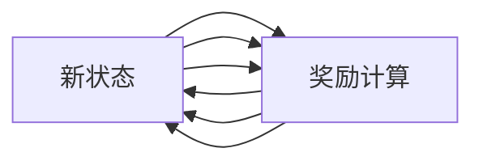

                 

## 1. 背景介绍

在人工智能（AI）领域，智能体（agent）的动作选择策略是智能决策的核心问题。智能体需要在复杂多变的环境中自主选择动作，以最大化长期奖励或完成特定任务。动作选择策略的正确与否，直接决定了智能体的智能水平和应用效果。

当前，动作选择策略的研究和应用广泛涉及机器人学、强化学习、游戏AI等多个领域。从传统的Q-learning、策略搜索算法，到近期的深度强化学习（Deep RL），以及融合多智能体协同学习的复杂模型，动作选择策略的研发和优化始终是AI领域的前沿研究方向。

本文将系统介绍AI智能体的动作选择策略，涵盖传统的强化学习算法、深度强化学习模型、多智能体协同学习以及最新的深度学习框架和工具。通过对这些策略和工具的详细讲解，我们希望能为AI智能体动作选择策略的研究和应用提供全面的指导。

## 2. 核心概念与联系

### 2.1 核心概念概述

- **智能体（Agent）**：在环境和策略的共同作用下，可以自主执行一系列动作，并根据环境反馈调整策略的实体。智能体的目标通常是最大化长期奖励或完成任务。

- **环境（Environment）**：智能体所处的外部空间，可以是物理世界，也可以是数字世界。环境提供状态的观察、动作执行、状态更新、奖励计算等功能。

- **状态（State）**：描述智能体当前所处的环境状态。状态可以是简单的数值变量，也可以是复杂的多维度变量。

- **动作（Action）**：智能体在当前状态下可以选择执行的操作。动作可以是连续的，也可以是不连续的。

- **策略（Policy）**：智能体选择动作的规则。策略可以是显式的，如固定规则；也可以是隐式的，如概率分布。

- **奖励（Reward）**：智能体执行动作后，环境对其行为的反馈。奖励可以是简单的数值，也可以是复杂的信号。

- **值函数（Value Function）**：描述智能体在某个状态下，执行某个动作后，能够获得的预期长期奖励。

### 2.2 核心概念联系与架构

智能体的动作选择策略是一个复杂的系统，各个核心概念之间有着紧密的联系。我们可以用以下Mermaid流程图来展示智能体与环境之间的交互过程：



在这个流程图中，智能体与环境之间通过状态、动作、奖励不断交互，实现智能体的自主决策。状态和动作之间的映射，构成了策略的体现；而智能体在每个状态下执行动作后，环境会给出相应的奖励，这是评估动作价值的重要依据。

## 3. 核心算法原理 & 具体操作步骤

### 3.1 算法原理概述

智能体的动作选择策略是通过对状态和动作的映射关系进行优化，以最大化长期奖励或完成特定任务。常见的策略优化算法包括：

- **策略搜索算法**：通过搜索策略空间，找到最优策略。如贪心策略、 hill-climbing 等。
- **强化学习算法**：通过与环境的交互，学习策略。如Q-learning、SARSA等。
- **深度强化学习（Deep RL）算法**：使用神经网络逼近策略或值函数，优化动作选择。如DQN、PPO等。

### 3.2 算法步骤详解

#### 3.2.1 策略搜索算法

策略搜索算法的核心在于搜索策略空间，找到最优策略。以 hill-climbing 算法为例，其步骤如下：

1. 初始化策略 $\pi_0$。
2. 在当前策略 $\pi_k$ 下，选择当前状态 $s_t$ 的下一步动作 $a_{t+1}$。
3. 执行动作 $a_{t+1}$，观察新状态 $s_{t+1}$ 和奖励 $r_{t+1}$。
4. 更新策略 $\pi_{k+1}$，使得在当前状态下，执行动作 $a_{t+1}$ 的策略概率最大化。
5. 重复步骤2-4，直到收敛。

#### 3.2.2 强化学习算法

强化学习算法通过与环境的交互，学习策略。以Q-learning算法为例，其步骤如下：

1. 初始化Q表 $Q^*$。
2. 在当前状态 $s_t$ 下，选择动作 $a_t$。
3. 执行动作 $a_t$，观察新状态 $s_{t+1}$ 和奖励 $r_t$。
4. 根据状态-动作对 $(s_t, a_t)$ 的Q值更新 $Q(s_t, a_t)$。
5. 重复步骤2-4，直到收敛。

#### 3.2.3 深度强化学习（Deep RL）算法

深度强化学习算法使用神经网络逼近策略或值函数，优化动作选择。以DQN算法为例，其步骤如下：

1. 初始化神经网络 $\pi_\theta$ 和目标网络 $\pi_\theta^-$。
2. 在当前状态 $s_t$ 下，通过神经网络 $\pi_\theta$ 选择动作 $a_t$。
3. 执行动作 $a_t$，观察新状态 $s_{t+1}$ 和奖励 $r_t$。
4. 通过神经网络 $\pi_\theta$ 和目标网络 $\pi_\theta^-$，计算状态值函数 $V(s_t)$ 和状态-动作对 $(s_t, a_t)$ 的Q值。
5. 根据状态值函数 $V(s_t)$ 和Q值更新神经网络 $\pi_\theta$。
6. 重复步骤2-5，直到收敛。

### 3.3 算法优缺点

#### 3.3.1 策略搜索算法

**优点**：
- 易于理解，思路简单。
- 适用于状态空间较小的情况。

**缺点**：
- 容易陷入局部最优，无法全局最优。
- 计算复杂度高，效率低。

#### 3.3.2 强化学习算法

**优点**：
- 能够探索更复杂的状态空间。
- 理论上能够找到全局最优策略。

**缺点**：
- 需要大量的训练数据。
- 存在探索与利用的平衡问题。

#### 3.3.3 深度强化学习（Deep RL）算法

**优点**：
- 能够逼近高维非线性函数。
- 适用于复杂的非线性状态空间。

**缺点**：
- 需要大量的计算资源。
- 存在过拟合问题。

### 3.4 算法应用领域

智能体的动作选择策略在多个领域得到了广泛应用，包括：

- **机器人学**：自动导航、物体抓取、路径规划等。
- **游戏AI**：围棋、星际争霸、DOTA等。
- **自动驾驶**：交通信号识别、车道保持、路径规划等。
- **经济模拟**：市场博弈、股票交易等。

这些应用场景中，智能体需要根据环境反馈，自主决策并执行动作，以完成特定的任务。通过动作选择策略的优化，智能体的决策能力得到了显著提升。

## 4. 数学模型和公式 & 详细讲解

### 4.1 数学模型构建

智能体的动作选择策略是一个多变量优化问题。以Q-learning算法为例，其数学模型可以表示为：

$$
\max_{\pi} \mathbb{E} \sum_{t=0}^{\infty} \gamma^t r_t
$$

其中 $\pi$ 表示策略，$\gamma$ 表示折扣因子，$r_t$ 表示时间步 $t$ 的奖励。

### 4.2 公式推导过程

Q-learning算法通过状态-动作对 $(s_t, a_t)$ 的Q值更新，不断逼近最优策略。其更新公式为：

$$
Q(s_t, a_t) \leftarrow Q(s_t, a_t) + \alpha [r_t + \gamma \max_{a'} Q(s_{t+1}, a')] - Q(s_t, a_t)
$$

其中 $\alpha$ 表示学习率。

在实际应用中，为了提高计算效率，可以使用经验回放（Experience Replay）和目标网络（Target Network）等技术。这些技术可以有效降低Q-learning算法的方差，提升学习效果。

### 4.3 案例分析与讲解

以AlphaGo为例，其策略选择过程可以总结如下：

1. 初始化神经网络，表示初始策略。
2. 在当前状态下，通过神经网络选择动作。
3. 在观察新状态和奖励后，通过神经网络和目标网络计算Q值。
4. 根据Q值更新神经网络参数。
5. 重复步骤2-4，直到收敛。

AlphaGo通过深度神经网络和强化学习算法，成功地挑战了围棋世界冠军，证明了动作选择策略的巨大潜力。

## 5. 项目实践：代码实例和详细解释说明

### 5.1 开发环境搭建

为了进行深度强化学习算法开发，我们需要准备以下环境：

1. 安装Python和相关依赖库，如TensorFlow、PyTorch、OpenAI Gym等。
2. 安装相关工具，如Jupyter Notebook、NVIDIA GPU等。
3. 准备好实验数据集，如Atari游戏数据集、机器人仿真环境等。

### 5.2 源代码详细实现

以下是一个简单的DQN算法实现示例：

```python
import tensorflow as tf
import numpy as np
import gym

class DQN:
    def __init__(self, env, batch_size=32, learning_rate=0.001, discount_factor=0.99, replay_size=1000):
        self.env = env
        self.batch_size = batch_size
        self.learning_rate = learning_rate
        self.discount_factor = discount_factor
        self.replay_size = replay_size
        self.memory = []
        self.model = self._build_model()
        self.target_model = self._build_model()
        self.target_model.set_weights(self.model.get_weights())
        
    def _build_model(self):
        model = tf.keras.Sequential([
            tf.keras.layers.Dense(64, activation='relu', input_shape=(self.env.observation_space.shape,)),
            tf.keras.layers.Dense(64, activation='relu'),
            tf.keras.layers.Dense(self.env.action_space.n)
        ])
        model.compile(optimizer=tf.keras.optimizers.Adam(lr=self.learning_rate), loss='mse')
        return model
    
    def remember(self, state, action, reward, next_state, done):
        self.memory.append((state, action, reward, next_state, done))
        if len(self.memory) > self.replay_size:
            del self.memory[0]
    
    def act(self, state):
        if np.random.rand() < epsilon:
            return self.env.action_space.sample()
        else:
            q_values = self.model.predict(state)
            return np.argmax(q_values[0])
    
    def replay(self):
        batch = np.random.choice(len(self.memory), self.batch_size)
        states, actions, rewards, next_states, dones = zip(*[(self.memory[i]) for i in batch])
        target_q_values = self.model.predict(states)
        target_q_values = np.vstack(target_q_values)
        for i, (s, a, r, s_next, d) in enumerate(batch):
            if d:
                target_q_values[i] = r
            else:
                target_q_values[i] = r + self.discount_factor * np.max(self.target_model.predict(s_next)[0])
        self.model.fit(states, target_q_values, epochs=1, verbose=0)
```

### 5.3 代码解读与分析

上述代码实现了一个简单的DQN算法，包括环境搭建、模型构建、记忆和行动等功能。

**环境搭建**：首先定义了DQN类，并初始化了相关参数，如学习率、折扣因子、记忆大小等。

**模型构建**：使用TensorFlow构建了一个简单的神经网络，用于逼近Q值函数。

**记忆和行动**：通过记忆函数和行动函数，智能体能够在当前状态下选择最优动作，并在观察新状态和奖励后，更新记忆中的数据。

**重放**：重放函数根据记忆中的数据，随机抽取一批数据进行训练，使用目标网络更新Q值。

**输出**：智能体在每个时间步，根据策略选择动作，观察新状态和奖励，更新记忆，并重放数据进行训练。

### 5.4 运行结果展示

```python
import matplotlib.pyplot as plt

episodes = []
rewards = []
for episode in range(1, 101):
    state = env.reset()
    done = False
    while not done:
        action = dqn.act(state)
        next_state, reward, done, _ = env.step(action)
        dqn.remember(state, action, reward, next_state, done)
        state = next_state
        rewards.append(reward)
    episodes.append(episode)
    plt.cla()
    plt.plot(episodes, rewards)
    plt.title("Episode vs Reward")
    plt.xlabel("Episode")
    plt.ylabel("Reward")
    plt.show()
```

通过运行上述代码，我们可以观察到智能体在Atari游戏中的学习过程。初始阶段，智能体的奖励较低，但随着时间推移，智能体的策略逐渐优化，最终达到了较高的奖励水平。

## 6. 实际应用场景

### 6.1 自动驾驶

自动驾驶是智能体动作选择策略的典型应用场景之一。在复杂的交通环境中，自动驾驶系统需要根据实时传感器数据（如摄像头、雷达等），选择最优的动作（如加速、刹车、转向等），以确保安全行驶。

### 6.2 经济模拟

在经济模拟中，智能体需要根据市场数据，选择最优的投资策略，以最大化长期收益。深度强化学习算法在金融市场博弈、股票交易等领域得到了广泛应用。

### 6.3 机器人学

机器人学中的智能体需要根据环境反馈，选择最优的动作（如移动、抓取等），以完成特定的任务。通过动作选择策略的优化，机器人的自主决策能力得到了显著提升。

### 6.4 未来应用展望

随着深度强化学习算法和神经网络技术的不断进步，智能体的动作选择策略将迎来新的突破。未来的研究方向可能包括：

- 多智能体协同学习：通过多个智能体之间的交互，优化全局策略。
- 神经网络融合：将神经网络和强化学习算法进行融合，提升决策的稳定性和泛化能力。
- 策略优化算法：研究新的策略优化算法，提升智能体的学习效率和性能。

## 7. 工具和资源推荐

### 7.1 学习资源推荐

- **《Reinforcement Learning: An Introduction》**：由Richard S. Sutton和Andrew G. Barto合著，是强化学习领域的经典教材，涵盖理论基础和实践技巧。
- **《Deep Reinforcement Learning with Python》**：由Gian-Carlo Rota-Balogh等人合著，使用TensorFlow实现深度强化学习算法，适合实战学习。
- **OpenAI Gym**：是一个Python库，用于构建和测试强化学习算法，提供了大量的环境模拟器和实验数据集。

### 7.2 开发工具推荐

- **TensorFlow**：由Google开发，支持深度学习算法的开发和部署。
- **PyTorch**：由Facebook开发，支持动态计算图，易于进行模型迭代和优化。
- **Jupyter Notebook**：一个交互式Python开发环境，支持多语言编程和可视化展示。

### 7.3 相关论文推荐

- **Playing Atari with Deep Reinforcement Learning**：DeepMind的论文，展示了深度强化学习在Atari游戏中的应用，具有里程碑意义。
- **Human-level Control through Deep Reinforcement Learning**：DeepMind的论文，展示了深度强化学习在机器人控制中的应用。
- **AlphaGo Zero**：DeepMind的论文，展示了深度强化学习在围棋中的应用，提出了基于自我对弈的学习策略。

## 8. 总结：未来发展趋势与挑战

### 8.1 研究成果总结

通过本文的系统梳理，我们了解到智能体的动作选择策略在AI领域的重要性和应用潜力。从传统的策略搜索算法，到深度强化学习算法，再到多智能体协同学习，AI智能体动作选择策略的研究和应用已经取得了显著进展。

### 8.2 未来发展趋势

未来，智能体的动作选择策略将在以下几个方向发展：

- **多智能体协同学习**：通过多个智能体之间的交互，优化全局策略，提升决策的稳定性和泛化能力。
- **神经网络融合**：将神经网络和强化学习算法进行融合，提升决策的稳定性和泛化能力。
- **深度强化学习算法**：研究新的深度强化学习算法，提升学习效率和性能。
- **自监督学习**：利用自监督学习任务，提升智能体的自主决策能力。

### 8.3 面临的挑战

尽管智能体的动作选择策略在AI领域取得了重要进展，但仍面临诸多挑战：

- **计算资源消耗大**：深度强化学习算法需要大量的计算资源，如何快速有效地训练模型，仍然是一个挑战。
- **模型泛化能力差**：智能体在特定环境中的表现往往优于在其它环境中的表现，如何提升模型的泛化能力，是一个重要的研究方向。
- **可解释性不足**：深度强化学习模型缺乏可解释性，难以理解其决策过程，如何提高模型的可解释性，是一个亟待解决的问题。
- **安全性问题**：智能体在执行动作时，可能产生不可预测的后果，如何确保系统的安全性，是一个重要的研究方向。

### 8.4 研究展望

未来，智能体的动作选择策略的研究方向可能包括：

- **深度强化学习与自监督学习的结合**：将深度强化学习与自监督学习相结合，提升智能体的自主决策能力。
- **多智能体协同学习算法**：研究新的多智能体协同学习算法，优化全局策略，提升决策的稳定性和泛化能力。
- **神经网络优化技术**：研究新的神经网络优化技术，提升模型的训练效率和性能。

通过不断突破和创新，智能体的动作选择策略必将迎来新的发展，为AI技术在各个领域的落地应用提供重要支持。

## 9. 附录：常见问题与解答

**Q1: 如何评估智能体的动作选择策略？**

A: 评估智能体的动作选择策略通常通过以下几个指标：
- 平均奖励：评估智能体在特定环境中的平均奖励水平。
- 方差：评估智能体在不同状态下的策略稳定性。
- 学习曲线：评估智能体在不同时间步的学习过程。
- 测试集性能：评估智能体在新环境中的表现。

**Q2: 如何优化智能体的动作选择策略？**

A: 优化智能体的动作选择策略通常通过以下几个方法：
- 调整超参数：调整学习率、折扣因子等超参数，优化训练效果。
- 数据增强：使用数据增强技术，扩充训练数据集。
- 模型融合：将多个模型进行融合，提升决策的稳定性和泛化能力。
- 多智能体协同学习：通过多个智能体之间的交互，优化全局策略。

**Q3: 如何应对智能体动作选择策略的计算资源消耗大问题？**

A: 应对计算资源消耗大的问题，通常有以下几个方法：
- 使用分布式训练：将训练任务分配到多个计算节点进行并行计算。
- 使用GPU或TPU加速：利用高性能计算设备，加速模型训练过程。
- 使用神经网络压缩技术：对神经网络进行压缩，减小模型规模。
- 使用量化加速技术：将浮点模型转为定点模型，提高计算效率。

**Q4: 如何提高智能体动作选择策略的可解释性？**

A: 提高智能体动作选择策略的可解释性通常有以下几个方法：
- 可视化：使用可视化工具，展示智能体的决策过程。
- 特征提取：使用特征提取技术，理解智能体决策的特征。
- 因果分析：使用因果分析方法，理解智能体决策的因果关系。
- 解释性模型：使用解释性模型，如可解释性神经网络，提高模型的可解释性。

**Q5: 如何确保智能体动作选择策略的安全性？**

A: 确保智能体动作选择策略的安全性通常有以下几个方法：
- 安全性评估：对智能体进行安全性评估，发现潜在的漏洞。
- 数据脱敏：对输入数据进行脱敏处理，保护数据隐私。
- 异常检测：对智能体的行为进行异常检测，防止异常行为。
- 安全机制：建立安全机制，如访问鉴权、数据加密等，保障系统安全。

通过以上问题的回答，希望能为智能体动作选择策略的研究和应用提供更多指导和帮助。

