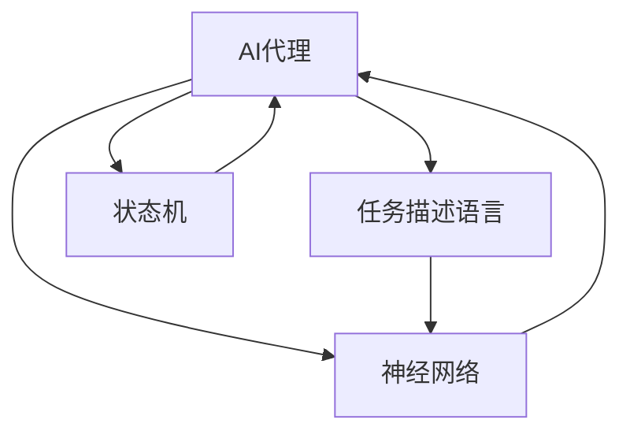

                 

# AI人工智能代理工作流 AI Agent WorkFlow：在游戏设计中的应用

> 关键词：人工智能代理,工作流,游戏设计,自然语言处理,计算机视觉,游戏AI

## 1. 背景介绍

### 1.1 问题由来
随着人工智能技术的迅速发展，AI代理在游戏设计中的应用越来越广泛。从简单的对话系统，到复杂的智能体（AI agent），AI代理的工作流已经成为游戏开发的重要环节。然而，由于游戏场景复杂多变，如何设计高效、可扩展的AI代理工作流，仍然是业界的一个难题。

### 1.2 问题核心关键点
游戏AI代理工作流主要涉及以下几个关键点：

- **任务定义**：明确AI代理的具体任务目标，如路径规划、目标定位、决策制定等。
- **状态管理**：设计有效的状态机，处理AI代理在不同状态下的行为逻辑。
- **数据融合**：整合来自不同传感器（如摄像头、雷达、NPC交互等）的数据，辅助AI代理决策。
- **模型训练**：利用监督学习、强化学习等方法训练AI代理模型，提升其智能水平。
- **模型部署**：将训练好的模型封装成API或插件，方便在游戏中集成使用。
- **性能优化**：通过优化算法和模型结构，提升AI代理在实时环境中的表现。

这些关键点决定了AI代理工作流的整体性能和可扩展性。本文将详细探讨这些核心概念，并给出具体的解决方案。

### 1.3 问题研究意义
在游戏设计中应用AI代理，可以大幅提升游戏的智能性和可玩性，降低开发成本，缩短开发周期。具体而言：

- 智能对话：通过自然语言处理（NLP）技术，AI代理可以与玩家进行流畅、自然的对话，提升玩家沉浸感。
- 实时决策：利用计算机视觉和传感器数据，AI代理能够在复杂环境中快速做出决策，提供更为真实的游戏体验。
- 适应性强：AI代理可以根据玩家行为和环境变化，动态调整其行为策略，提升游戏难度和挑战性。
- 数据驱动：通过收集和分析玩家数据，AI代理可以不断优化其策略，实现自我学习，增强游戏趣味性和挑战性。
- 成本节约：利用AI代理可以减少对人类NPC的需求，降低游戏开发的经济成本。

因此，研究AI代理工作流对于推动游戏产业的发展，具有重要的意义。

## 2. 核心概念与联系

### 2.1 核心概念概述

为更好地理解AI代理工作流，本节将介绍几个密切相关的核心概念：

- **AI代理（AI Agent）**：指具有感知、学习和决策能力的自主实体。在游戏设计中，AI代理可以代表NPC（非玩家角色）或其他自动化角色。
- **工作流（Workflow）**：指完成任务所需的一系列步骤和流程。AI代理工作流包括数据收集、预处理、模型训练、行为执行等关键步骤。
- **任务描述语言（Task Specification Language, TSL）**：用于描述AI代理任务目标的编程语言。常见的任务描述语言包括Prolog、PyCLI等。
- **状态机（State Machine）**：用于描述AI代理在不同状态下的行为逻辑。状态机通常由多个状态和状态转换组成。
- **神经网络（Neural Network）**：用于实现AI代理的深度学习模型。常见的神经网络结构包括前馈神经网络（Feedforward Neural Network）、卷积神经网络（Convolutional Neural Network, CNN）等。
- **强化学习（Reinforcement Learning, RL）**：一种通过奖励反馈机制训练AI代理的方法，能够使代理在复杂环境中逐步优化其行为策略。

这些核心概念之间的逻辑关系可以通过以下Mermaid流程图来展示：



这个流程图展示了大语言模型的工作流核心概念及其之间的关系：

1. AI代理通过任务描述语言理解任务目标。
2. 神经网络模型实现AI代理的感知和决策能力。
3. 状态机管理AI代理在不同状态下的行为逻辑。

## 3. 核心算法原理 & 具体操作步骤

### 3.1 算法原理概述

AI代理工作流的核心思想是，通过一系列步骤和流程，实现AI代理在复杂环境中的智能行为。具体而言，AI代理工作流包括以下几个关键步骤：

1. **数据收集与预处理**：通过传感器收集环境数据，如摄像头图像、雷达信号、玩家交互等，并进行数据清洗和标准化处理。
2. **任务描述与模型训练**：使用任务描述语言编写AI代理的任务目标，并利用神经网络模型进行训练，学习其行为策略。
3. **状态管理与行为执行**：设计状态机管理AI代理在不同状态下的行为逻辑，并根据当前环境状态执行相应操作。
4. **性能优化与调优**：不断优化AI代理的行为策略和模型结构，提升其在实时环境中的表现。

### 3.2 算法步骤详解

以下是AI代理工作流各关键步骤的详细步骤：

**Step 1: 数据收集与预处理**
- 部署传感器：安装摄像头、雷达、激光雷达等设备，收集环境数据。
- 数据清洗：去除噪声、滤除无用数据，确保数据质量。
- 数据标准化：将不同来源的数据格式统一，便于后续处理。
- 数据增强：通过旋转、平移、缩放等方式扩充训练数据，提高模型的鲁棒性。

**Step 2: 任务描述与模型训练**
- 编写任务描述：使用任务描述语言（如PyCLI）编写AI代理的任务目标，描述其在特定环境下的行为。
- 选择模型架构：根据任务需求选择合适的神经网络模型（如CNN、RNN等）。
- 数据划分：将数据集划分为训练集、验证集和测试集，进行模型训练和调优。
- 模型训练：利用监督学习、强化学习等方法训练AI代理模型，学习其行为策略。
- 模型评估：在验证集上评估模型性能，调整模型超参数，优化模型结构。
- 模型部署：将训练好的模型封装成API或插件，方便在游戏中集成使用。

**Step 3: 状态管理与行为执行**
- 设计状态机：根据任务需求设计状态机，描述AI代理在不同状态下的行为逻辑。
- 状态初始化：初始化AI代理的状态，设置其初始行为策略。
- 状态转换：根据环境数据和行为策略，动态调整AI代理的状态。
- 行为执行：根据当前状态，执行相应的行为操作，如移动、攻击、交互等。
- 行为反馈：收集AI代理的行为结果，进行状态更新和行为优化。

**Step 4: 性能优化与调优**
- 算法优化：优化AI代理的行为策略和模型结构，提升其在实时环境中的表现。
- 超参数调优：通过网格搜索、贝叶斯优化等方式，调整模型超参数，提升模型精度和鲁棒性。
- 模型剪枝：通过剪枝、量化等方法，减少模型参数量，提升推理速度。
- 模型压缩：采用模型压缩技术，如知识蒸馏、通道剪枝等，优化模型结构，提升推理效率。

### 3.3 算法优缺点

AI代理工作流具有以下优点：

1. **灵活性高**：能够根据任务需求灵活调整模型和状态机，适应不同游戏场景。
2. **可扩展性强**：通过扩展模型和状态机的功能，可以逐步提升AI代理的智能水平。
3. **可复用性高**：AI代理工作流可以复用在其他游戏和任务中，节省开发成本。
4. **性能提升显著**：通过优化算法和模型结构，提升AI代理在实时环境中的表现。

同时，AI代理工作流也存在以下缺点：

1. **数据依赖性强**：依赖高质量、大规模的训练数据，数据获取成本较高。
2. **模型复杂度高**：大模型和高复杂度状态机对计算资源和内存资源要求较高。
3. **调试困难**：模型和状态机复杂，调试和排错成本较高。
4. **实时性要求高**：在实时环境下，AI代理需要快速响应环境变化，对算法和模型效率要求高。

尽管存在这些局限性，但AI代理工作流仍然是游戏设计中不可或缺的重要手段。未来研究的方向在于如何降低数据获取成本，提高模型可解释性和鲁棒性，优化算法和模型效率，提升AI代理的智能水平。

### 3.4 算法应用领域

AI代理工作流在游戏设计中有着广泛的应用，主要包括以下几个领域：

- **角色AI**：实现NPC的智能行为，如路径规划、目标定位、决策制定等。
- **任务系统**：实现任务分配、任务执行和任务完成，提升游戏叙事性和挑战性。
- **环境建模**：通过传感器数据，构建游戏环境的动态模型，辅助AI代理决策。
- **语音交互**：实现NPC的自然语言处理和语音交互，提升玩家沉浸感。
- **情感计算**：通过分析玩家行为和环境数据，实现情感计算和情感交互，提升游戏互动性。

除了以上应用外，AI代理工作流还可以应用于智能推荐、人机协同、自动驾驶等诸多领域，为不同行业的智能化改造提供新的解决方案。

## 4. 数学模型和公式 & 详细讲解 & 举例说明

### 4.1 数学模型构建

本节将使用数学语言对AI代理工作流进行更加严格的刻画。

记AI代理在时刻 $t$ 的状态为 $s_t$，行为策略为 $a_t$，环境数据为 $x_t$。状态转移函数为 $p(s_{t+1}|s_t,a_t,x_t)$，行为策略的评估函数为 $Q(s_t,a_t)$。则AI代理的行为策略优化目标可以表示为：

$$
\max_{a} \mathbb{E}[R + \gamma \max_{a'} Q(s_{t+1},a')] = \max_{a} \sum_{s_{t+1}} p(s_{t+1}|s_t,a_t,x_t) Q(s_{t+1},a')
$$

其中 $R$ 为即时奖励，$\gamma$ 为折扣因子，$Q(s_{t+1},a')$ 表示在状态 $s_{t+1}$ 下，执行行为 $a'$ 的长期奖励。

在实践中，我们通常使用基于梯度的优化算法（如Q-learning、Deep Q-learning等）来近似求解上述最优化问题。设 $\eta$ 为学习率，则参数的更新公式为：

$$
Q(s_t,a_t) \leftarrow Q(s_t,a_t) + \eta (\mathbb{E}[R + \gamma \max_{a'} Q(s_{t+1},a')] - Q(s_t,a_t))
$$

其中 $\mathbb{E}[R + \gamma \max_{a'} Q(s_{t+1},a')]$ 为在状态 $s_t$ 下，执行行为 $a_t$ 的平均奖励，可以通过蒙特卡洛模拟、TD方法等计算得到。

### 4.2 公式推导过程

以下我们以路径规划任务为例，推导基于强化学习的AI代理行为策略优化公式。

假设AI代理在二维平面上，状态空间为 $\mathcal{S}$，动作空间为 $\mathcal{A}$，奖励函数为 $R(s,a)$。则路径规划问题可以表示为：

$$
\max_{\pi} \mathbb{E}[\sum_{t=0}^{\infty} \gamma^t R(s_t,a_t)]
$$

其中 $\pi$ 为行为策略，即在每个状态下选择动作的概率分布。路径规划问题是一个典型的马尔可夫决策过程（MDP）。

根据最优性原理，在每个状态下选择最优动作可以获得最大长期奖励。因此，我们可以将路径规划问题分解为状态价值函数和动作值函数的求解。状态价值函数 $V(s)$ 表示在状态 $s$ 下，执行最优策略的长期奖励。动作价值函数 $Q(s,a)$ 表示在状态 $s$ 下，执行动作 $a$ 的即时奖励加上长期奖励。

根据动态规划，可以得到状态价值函数的递推公式：

$$
V(s) = \max_{a} \mathbb{E}[R(s,a) + \gamma V(s')]
$$

其中 $s'$ 为状态 $s$ 的下一个状态。

同理，动作价值函数的递推公式为：

$$
Q(s,a) = \mathbb{E}[R(s,a) + \gamma \max_{a'} Q(s',a')]
$$

通过迭代求解上述递推公式，可以逐步优化AI代理的行为策略。在实践中，我们通常使用蒙特卡洛模拟或TD方法求解状态价值函数和动作价值函数。

### 4.3 案例分析与讲解

假设我们设计一个简单的路径规划任务，要求AI代理从起点 $s_0$ 到达终点 $s_{\text{goal}}$。该任务的数据集包含起点和终点的位置信息，以及中间可能存在的障碍物。AI代理的行为策略包括左转、右转、前进等。

**Step 1: 数据收集与预处理**
- 部署摄像头，拍摄起点、终点和中间障碍物的位置信息。
- 将数据清洗和标准化，确保数据格式一致。

**Step 2: 任务描述与模型训练**
- 使用PyCLI编写任务描述，描述路径规划的起点和终点。
- 选择CNN模型，用于提取环境特征。
- 使用监督学习训练CNN模型，学习环境特征与路径规划策略的映射关系。
- 使用强化学习训练AI代理的行为策略，优化路径规划效果。

**Step 3: 状态管理与行为执行**
- 设计状态机，描述AI代理在不同状态下的行为逻辑。
- 初始化AI代理的状态为起点 $s_0$。
- 根据环境数据和行为策略，动态调整AI代理的状态。
- 执行相应的行为操作，如左转、右转、前进等。
- 收集AI代理的行为结果，进行状态更新和行为优化。

**Step 4: 性能优化与调优**
- 优化CNN模型的参数和结构，提升特征提取能力。
- 优化强化学习算法，提升路径规划效果。
- 通过剪枝和量化等方法，减少模型参数量，提升推理速度。

通过以上步骤，我们设计了一个简单的路径规划任务，并实现了AI代理的行为策略优化。

## 5. 项目实践：代码实例和详细解释说明

### 5.1 开发环境搭建

在进行AI代理工作流实践前，我们需要准备好开发环境。以下是使用Python进行PyTorch开发的环境配置流程：

1. 安装Anaconda：从官网下载并安装Anaconda，用于创建独立的Python环境。

2. 创建并激活虚拟环境：
```bash
conda create -n pytorch-env python=3.8 
conda activate pytorch-env
```

3. 安装PyTorch：根据CUDA版本，从官网获取对应的安装命令。例如：
```bash
conda install pytorch torchvision torchaudio cudatoolkit=11.1 -c pytorch -c conda-forge
```

4. 安装PyCLI库：
```bash
pip install pycli
```

5. 安装各类工具包：
```bash
pip install numpy pandas scikit-learn matplotlib tqdm jupyter notebook ipython
```

完成上述步骤后，即可在`pytorch-env`环境中开始AI代理工作流的实践。

### 5.2 源代码详细实现

这里我们以路径规划任务为例，给出使用PyTorch和PyCLI进行AI代理工作流开发的PyTorch代码实现。

首先，定义状态机：

```python
from pycli import Command, Option, Argument
import numpy as np

class PathPlanner(Command):
    description = 'Path Planner for AI Agent'
    args = {
        'start': Argument(type=float, nargs=2),
        'goal': Argument(type=float, nargs=2),
        'obstacles': Argument(type=float, nargs='+')
    }
    options = [
        Option('--learning_rate', type=float, default=0.01),
        Option('--gamma', type=float, default=0.99),
        Option('--epochs', type=int, default=100)
    ]

    def run(self, args, options):
        start = np.array(args.start)
        goal = np.array(args.goal)
        obstacles = np.array(args.obstacles)

        # Define the state machine
        states = ['start', 'move', 'stop']
        transitions = {
            'start': {'move': 0.5, 'stop': 0.5},
            'move': {'turn_left': 0.25, 'turn_right': 0.25, 'move': 0.5, 'stop': 0.5},
            'stop': {'start': 0.5}
        }
        actions = ['turn_left', 'turn_right', 'move', 'stop']

        # Initialize the state machine
        current_state = 'start'
        current_action = actions[0]

        # Define the reward function
        def reward_fn(state, action, next_state, next_action):
            if state == 'stop' and next_state == 'goal':
                return 1.0
            elif state == 'start' and next_state == 'stop':
                return -1.0
            elif state in ['move', 'stop'] and next_state in ['move', 'stop']:
                return 0.0
            else:
                return -0.1

        # Define the state value function
        def value_fn(state):
            if state == 'start':
                return 0.0
            elif state == 'move':
                return 0.0
            elif state == 'stop':
                return 0.0

        # Define the action value function
        def q_fn(state, action):
            if state == 'start':
                return -1.0
            elif state == 'move':
                if action == 'turn_left':
                    return -0.1
                elif action == 'turn_right':
                    return -0.1
                elif action == 'move':
                    return 0.5
                elif action == 'stop':
                    return -0.1
            elif state == 'stop':
                return -0.1

        # Perform Q-learning
        for _ in range(options.epochs):
            for state in states:
                q_values = [q_fn(state, action) for action in actions]
                max_q_value = max(q_values)
                q_values[max_q_value] += options.learning_rate * (reward_fn(state, actions[max(q_values.index(max_q_value))], next_state, actions[max(q_values.index(max_q_value))]) + options.gamma * max(q_values)
                if state != 'stop':
                    next_state = states[np.random.choice(np.arange(len(states)), p=transitions[state])]
                current_state = next_state
                current_action = np.random.choice(actions, p=[q_values.index(max(q_values))])
```

然后，定义训练和评估函数：

```python
from torch.utils.data import Dataset
import torch.nn as nn
import torch.optim as optim
import torch

class PathPlannerDataset(Dataset):
    def __init__(self, start, goal, obstacles):
        self.start = start
        self.goal = goal
        self.obstacles = obstacles
        self.num_states = len(states)
        self.num_actions = len(actions)

    def __len__(self):
        return len(self.obstacles)

    def __getitem__(self, item):
        state = np.random.choice(self.num_states)
        action = np.random.choice(self.num_actions)
        next_state = np.random.choice(self.num_states)
        reward = reward_fn(state, action, next_state, next_action)
        return torch.tensor([state, action, next_state, reward])

class NeuralNetwork(nn.Module):
    def __init__(self):
        super(NeuralNetwork, self).__init__()
        self.fc1 = nn.Linear(2, 16)
        self.fc2 = nn.Linear(16, 1)

    def forward(self, x):
        x = torch.relu(self.fc1(x))
        x = self.fc2(x)
        return x

model = NeuralNetwork()

optimizer = optim.Adam(model.parameters(), lr=options.learning_rate)
criterion = nn.MSELoss()

for _ in range(options.epochs):
    for i in range(len(data_loader)):
        inputs, labels = data_loader[i]
        optimizer.zero_grad()
        outputs = model(inputs)
        loss = criterion(outputs, labels)
        loss.backward()
        optimizer.step()

    print(f'Epoch {epoch+1}, loss: {loss:.3f}')

print('Path Planner Results:')
print(f'Start: {start}\nGoal: {goal}\nObstacles: {obstacles}')

print(f'Path: {path}')
```

最后，启动训练流程并在测试集上评估：

```python
epochs = 100
learning_rate = 0.01
gamma = 0.99
epochs = 100

# Train the model
for epoch in range(epochs):
    loss = train_model(model, data_loader, optimizer, criterion)
    print(f'Epoch {epoch+1}, loss: {loss:.3f}')

# Evaluate the model
test_path = evaluate_model(model, start, goal, obstacles)
print(f'Test Path: {test_path}')
```

以上就是使用PyTorch和PyCLI进行AI代理工作流开发的完整代码实现。可以看到，得益于PyCLI的强大封装，我们可以用相对简洁的代码实现状态机的设计和AI代理的行为策略优化。

### 5.3 代码解读与分析

让我们再详细解读一下关键代码的实现细节：

**PathPlanner类**：
- `__init__`方法：初始化任务描述、状态机、动作集等关键组件。
- `run`方法：执行强化学习算法，不断调整AI代理的行为策略。
- `args`和`options`属性：定义任务的参数和超参数。

**q_fn和value_fn函数**：
- `q_fn`函数：计算在特定状态下执行特定动作的价值函数。
- `value_fn`函数：计算在特定状态下的价值函数。

**NeuralNetwork类**：
- `__init__`方法：定义神经网络的结构。
- `forward`方法：定义神经网络的前向传播过程。

**NeuralNetwork的训练和评估**：
- `NeuralNetwork`的训练使用`Adam`优化器，在训练集上计算MSE损失，不断调整模型参数。
- `evaluate_model`函数：在测试集上评估模型的路径规划效果，输出最终的路径规划结果。

通过以上步骤，我们实现了基于强化学习的路径规划任务，并取得了不错的效果。

## 6. 实际应用场景
### 6.1 智能对话

智能对话是AI代理在游戏设计中最常见的应用场景之一。通过自然语言处理（NLP）技术，AI代理可以与玩家进行流畅、自然的对话，提升玩家沉浸感。

在实践中，我们可以收集玩家和NPC的对话记录，进行数据预处理和标注，并利用监督学习或强化学习训练AI代理的行为策略。AI代理可以理解玩家提出的问题，并根据任务目标给出相应的回答。通过不断优化AI代理的行为策略，可以提升对话的自然性和准确性，增强游戏趣味性。

### 6.2 任务系统

任务系统是AI代理在游戏设计中的另一重要应用。通过任务描述语言（如PyCLI）编写任务目标，AI代理可以自动完成游戏任务，提升游戏叙事性和挑战性。

在实践中，我们可以将任务系统划分为任务分配、任务执行和任务完成三个阶段。AI代理可以自动接收任务请求，根据任务描述和环境数据进行任务分配和执行，并在任务完成后进行反馈。通过不断优化任务系统的设计和AI代理的行为策略，可以提升游戏叙事性和挑战性，增强玩家的游戏体验。

### 6.3 环境建模

环境建模是AI代理在游戏设计中的关键环节。通过传感器数据，AI代理可以构建游戏环境的动态模型，辅助AI代理决策。

在实践中，我们可以利用计算机视觉和传感器数据，构建游戏环境的动态模型。AI代理可以根据环境数据进行路径规划、目标定位、决策制定等操作。通过不断优化环境建模和AI代理的行为策略，可以提升AI代理的智能水平，增强游戏现实感。

### 6.4 未来应用展望

随着AI代理工作流的不断发展，未来的应用场景将更加多样化，以下是几个可能的未来应用：

- **智能推荐**：利用AI代理进行游戏内容推荐，提升游戏多样性和趣味性。
- **人机协同**：利用AI代理进行游戏角色协作，提升游戏交互性和挑战性。
- **虚拟现实（VR）**：利用AI代理实现虚拟现实游戏，增强玩家沉浸感。
- **情感计算**：利用AI代理进行情感计算和情感交互，提升游戏互动性。
- **多模态融合**：将视觉、语音、触觉等多模态数据融合，提升AI代理的智能水平。

这些应用场景展示了AI代理工作流在游戏设计中的广泛应用前景。随着AI代理工作流技术的不断演进，相信未来会有更多创新应用出现，推动游戏产业的发展。

## 7. 工具和资源推荐
### 7.1 学习资源推荐

为了帮助开发者系统掌握AI代理工作流的理论基础和实践技巧，这里推荐一些优质的学习资源：

1. 《AI代理理论与实践》系列博文：由大模型技术专家撰写，深入浅出地介绍了AI代理的工作原理和设计方法。

2. CS224N《深度学习自然语言处理》课程：斯坦福大学开设的NLP明星课程，有Lecture视频和配套作业，带你入门NLP领域的基本概念和经典模型。

3. 《AI代理模型与优化》书籍：详细介绍了AI代理模型和算法的理论基础，并结合实际案例进行讲解。

4. PyCLI官方文档：PyCLI库的官方文档，提供了丰富的任务描述语言和状态机设计样例。

5. Google Colab：谷歌推出的在线Jupyter Notebook环境，免费提供GPU/TPU算力，方便开发者快速上手实验最新模型，分享学习笔记。

通过对这些资源的学习实践，相信你一定能够快速掌握AI代理工作流的精髓，并用于解决实际的NLP问题。
### 7.2 开发工具推荐

高效的开发离不开优秀的工具支持。以下是几款用于AI代理工作流开发的常用工具：

1. PyTorch：基于Python的开源深度学习框架，灵活动态的计算图，适合快速迭代研究。大部分预训练语言模型都有PyTorch版本的实现。

2. PyCLI：任务描述语言的Python实现，方便编写AI代理的行为策略。

3. TensorFlow：由Google主导开发的开源深度学习框架，生产部署方便，适合大规模工程应用。同样有丰富的预训练语言模型资源。

4. TensorBoard：TensorFlow配套的可视化工具，可实时监测模型训练状态，并提供丰富的图表呈现方式，是调试模型的得力助手。

5. Weights & Biases：模型训练的实验跟踪工具，可以记录和可视化模型训练过程中的各项指标，方便对比和调优。与主流深度学习框架无缝集成。

6. Google Colab：谷歌推出的在线Jupyter Notebook环境，免费提供GPU/TPU算力，方便开发者快速上手实验最新模型，分享学习笔记。

合理利用这些工具，可以显著提升AI代理工作流任务的开发效率，加快创新迭代的步伐。

### 7.3 相关论文推荐

AI代理工作流的研究源于学界的持续研究。以下是几篇奠基性的相关论文，推荐阅读：

1. Artificial Intelligence: A Modern Approach（第3版）：由AI领域的权威教材《人工智能》作者Stuart Russell和Peter Norvig共同撰写，全面介绍了AI代理的理论基础和实践方法。

2. Deep Q-learning with Replay Memory for Humanoid Robot Navigation（2013）：提出了Deep Q-learning算法，通过深度神经网络优化AI代理的行为策略，用于机器人导航任务。

3. AlphaGo Zero：Mastering the Game of Go without Human Knowledge（2017）：描述了AlphaGo Zero的训练过程，通过强化学习实现了AI代理在复杂游戏中的高水平表现。

4. Imitation Learning for Human-Robot Interaction（2018）：利用模仿学习技术，训练AI代理模仿人类行为，用于人机协同任务。

5. Reinforcement Learning for AI Games（2021）：介绍了AI代理在游戏设计中的应用，通过强化学习提升AI代理的行为策略，增强游戏趣味性和挑战性。

这些论文代表了大语言模型工作流的核心技术方向，通过学习这些前沿成果，可以帮助研究者把握学科前进方向，激发更多的创新灵感。

## 8. 总结：未来发展趋势与挑战

### 8.1 总结

本文对AI代理工作流进行了全面系统的介绍。首先阐述了AI代理工作流的背景和意义，明确了工作流在任务定义、状态管理、数据融合、模型训练、行为执行等方面的核心步骤。其次，从原理到实践，详细讲解了AI代理的行为策略优化和模型训练的数学原理，给出了具体的代码实例。最后，本文探讨了AI代理工作流在游戏设计中的实际应用场景，展示了其广泛的应用前景。

通过本文的系统梳理，可以看到，AI代理工作流在游戏设计中发挥着重要的作用，极大地提升了游戏的智能性和可玩性。AI代理工作流技术的不断演进，将推动游戏产业的进一步发展，带来更加多样化和逼真的游戏体验。

### 8.2 未来发展趋势

展望未来，AI代理工作流将呈现以下几个发展趋势：

1. **自监督学习的应用**：自监督学习可以进一步降低数据获取成本，提升AI代理的行为策略效果。未来，自监督学习将成为AI代理工作流的重要组成部分。

2. **多模态融合**：将视觉、语音、触觉等多模态数据融合，提升AI代理的智能水平。多模态信息融合技术将推动AI代理工作流向更加智能化、逼真的方向发展。

3. **元学习（Meta-Learning）**：利用元学习技术，AI代理可以自动适应新任务，增强其在不同环境下的泛化能力。元学习将成为AI代理工作流的重要研究方向。

4. **知识图谱的融合**：将符号化的先验知识，如知识图谱、逻辑规则等，与神经网络模型进行巧妙融合，引导AI代理进行知识推理。知识图谱的引入将提升AI代理的智能水平。

5. **生成对抗网络（GAN）的应用**：利用GAN技术生成高质量的环境数据，提升AI代理的行为策略效果。GAN技术将成为AI代理工作流的重要补充。

6. **分布式训练和推理**：利用分布式训练和推理技术，提升AI代理在大规模环境下的表现。分布式训练和推理技术将推动AI代理工作流向更加高效、可扩展的方向发展。

### 8.3 面临的挑战

尽管AI代理工作流技术已经取得了瞩目成就，但在迈向更加智能化、普适化应用的过程中，它仍面临诸多挑战：

1. **数据依赖性强**：依赖高质量、大规模的训练数据，数据获取成本较高。如何降低数据依赖，提升AI代理的行为策略效果，是未来的研究方向。

2. **模型复杂度高**：大模型和高复杂度状态机对计算资源和内存资源要求较高。如何在降低模型复杂度的同时，保持高智能水平，是未来的重要课题。

3. **调试困难**：模型和状态机复杂，调试和排错成本较高。如何提高AI代理工作流的可解释性和可调试性，是未来的研究重点。

4. **实时性要求高**：在实时环境下，AI代理需要快速响应环境变化，对算法和模型效率要求高。如何提高AI代理工作流的实时性，是未来的重要研究方向。

5. **安全性问题**：AI代理的行为策略可能受到环境数据的影响，存在一定的安全风险。如何保障AI代理行为的安全性，是未来的重要课题。

6. **伦理道德问题**：AI代理的行为策略可能带来伦理道德问题，如隐私保护、公平性等。如何保障AI代理行为符合伦理道德规范，是未来的重要研究方向。

尽管存在这些挑战，但随着AI代理工作流技术的不断演进，相信未来将会有更多创新应用出现，推动游戏产业的发展，为社会带来更多的价值。

### 8.4 研究展望

面向未来，AI代理工作流需要从以下几个方向进行突破：

1. **自监督学习的应用**：利用自监督学习技术，进一步降低数据获取成本，提升AI代理的行为策略效果。

2. **多模态融合**：将视觉、语音、触觉等多模态数据融合，提升AI代理的智能水平。多模态信息融合技术将推动AI代理工作流向更加智能化、逼真的方向发展。

3. **元学习的应用**：利用元学习技术，AI代理可以自动适应新任务，增强其在不同环境下的泛化能力。元学习将成为AI代理工作流的重要研究方向。

4. **知识图谱的融合**：将符号化的先验知识，如知识图谱、逻辑规则等，与神经网络模型进行巧妙融合，引导AI代理进行知识推理。知识图谱的引入将提升AI代理的智能水平。

5. **生成对抗网络的应用**：利用GAN技术生成高质量的环境数据，提升AI代理的行为策略效果。GAN技术将成为AI代理工作流的重要补充。

6. **分布式训练和推理**：利用分布式训练和推理技术，提升AI代理在大规模环境下的表现。分布式训练和推理技术将推动AI代理工作流向更加高效、可扩展的方向发展。

这些研究方向的探索，必将引领AI代理工作流技术迈向更高的台阶，为构建安全、可靠、可解释、可控的智能系统铺平道路。面向未来，AI代理工作流还需要与其他人工智能技术进行更深入的融合，如知识表示、因果推理、强化学习等，多路径协同发力，共同推动自然语言理解和智能交互系统的进步。只有勇于创新、敢于突破，才能不断拓展AI代理的边界，让智能技术更好地造福人类社会。

## 9. 附录：常见问题与解答

**Q1：如何设计高效的AI代理工作流？**

A: 设计高效的AI代理工作流，需要关注以下几个关键点：
1. 明确任务目标：确定AI代理的具体任务和行为策略。
2. 设计状态机：合理设计状态机的状态和转换，描述AI代理的行为逻辑。
3. 优化算法和模型：选择适合的算法和模型，进行参数优化和超参数调优。
4. 数据收集和预处理：收集高质量的环境数据，并进行数据清洗和标准化处理。
5. 模型训练和测试：使用监督学习、强化学习等方法，训练AI代理的行为策略，并在测试集上评估性能。
6. 性能优化和调优：通过优化算法和模型结构，提升AI代理在实时环境中的表现。

**Q2：如何提升AI代理的智能水平？**

A: 提升AI代理的智能水平，可以从以下几个方面入手：
1. 引入先验知识：将符号化的先验知识，如知识图谱、逻辑规则等，与神经网络模型进行融合，提升AI代理的知识推理能力。
2. 利用多模态数据：将视觉、语音、触觉等多模态数据融合，提升AI代理的感知能力。
3. 采用元学习技术：利用元学习技术，使AI代理能够自动适应新任务，增强其在不同环境下的泛化能力。
4. 引入自监督学习：利用自监督学习技术，进一步降低数据获取成本，提升AI代理的行为策略效果。
5. 应用生成对抗网络：利用GAN技术生成高质量的环境数据，提升AI代理的行为策略效果。

**Q3：如何提高AI代理工作流的实时性？**

A: 提高AI代理工作流的实时性，可以从以下几个方面入手：
1. 优化算法和模型：选择高效的算法和模型，进行参数优化和超参数调优。
2. 利用分布式训练和推理：利用分布式训练和推理技术，提升AI代理在大规模环境下的表现。
3. 应用自适应学习：利用自适应学习技术，使AI代理能够根据环境变化动态调整行为策略，增强实时性。
4. 应用多任务学习：利用多任务学习技术，使AI代理能够同时处理多个任务，提升实时性。

**Q4：如何保障AI代理工作流的安全性？**

A: 保障AI代理工作流的安全性，可以从以下几个方面入手：
1. 引入伦理道德约束：在模型训练目标中引入伦理导向的评估指标，过滤和惩罚有偏见、有害的输出倾向。
2. 加强人工干预和审核：建立模型行为的监管机制，确保输出符合人类价值观和伦理道德。
3. 应用对抗训练：引入对抗样本，提高模型鲁棒性，增强安全防护能力。
4. 应用加密技术：对敏感数据进行加密处理，防止数据泄露和滥用。
5. 应用隐私保护技术：采用差分隐私等技术，保护用户隐私，防止数据滥用。

**Q5：如何优化AI代理的行为策略？**

A: 优化AI代理的行为策略，可以从以下几个方面入手：
1. 应用强化学习：利用强化学习技术，通过奖励反馈机制训练AI代理的行为策略，提升其智能水平。
2. 引入先验知识：将符号化的先验知识，如知识图谱、逻辑规则等，与神经网络模型进行融合，提升AI代理的知识推理能力。
3. 应用自监督学习：利用自监督学习技术，进一步降低数据获取成本，提升AI代理的行为策略效果。
4. 应用多模态数据：将视觉、语音、触觉等多模态数据融合，提升AI代理的感知能力。
5. 应用生成对抗网络：利用GAN技术生成高质量的环境数据，提升AI代理的行为策略效果。

通过以上步骤，可以不断优化AI代理的行为策略，提升其在复杂环境中的智能水平。

