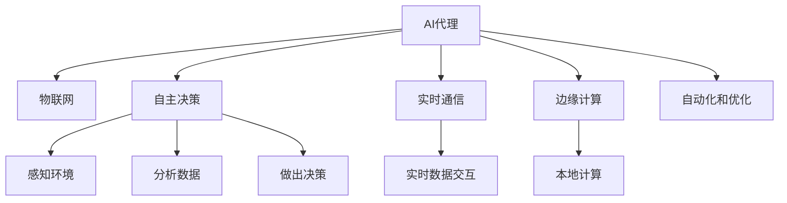

                 

# AI人工智能代理工作流AI Agent WorkFlow：AI代理在物联网场景的应用

## 1. 背景介绍

在当今快速发展的物联网(IoT)时代，设备、传感器和用户之间的数据交互变得越来越频繁。AI代理(AI Agent)作为人工智能(AI)在物联网应用中的关键组件，在自动化、智能决策和资源优化方面发挥着越来越重要的作用。AI代理可以通过模拟人类的思维和行为，实现设备的自主决策、自动化操作和智能交互，从而提高物联网系统的效率和灵活性。

AI代理在物联网中的应用场景包括但不限于智能家居、工业自动化、智慧城市、医疗健康等领域。例如，智能家居中的语音助手、工业自动化中的智能监控系统和智慧城市中的智能交通系统等，都离不开AI代理的支撑。AI代理通过实时感知环境状态、分析决策和执行指令，能够在复杂多变的环境中实现高效、可靠、智能的操作。

## 2. 核心概念与联系

### 2.1 核心概念概述

为更好地理解AI代理在物联网场景的应用，本节将介绍几个密切相关的核心概念：

- AI代理(AI Agent)：一种能够自主感知、分析、推理和决策的AI系统，常用于自动化、智能化和优化系统。
- 物联网(IoT)：通过互联网连接各种设备，实现设备之间的数据交互和资源共享。
- 自主决策：AI代理通过智能算法和模型，自主感知环境，分析数据，做出最优决策。
- 实时通信：AI代理能够实现设备之间的实时数据交互，支持实时监控、控制和反馈。
- 边缘计算(Edge Computing)：在靠近数据源的本地设备上进行计算，减少数据传输延迟和带宽占用。
- 自动化和优化：AI代理通过自主决策和实时通信，实现设备自动化操作和资源优化。

这些核心概念之间的逻辑关系可以通过以下Mermaid流程图来展示：



这个流程图展示了我国AI代理的核心概念及其之间的关系：

1. AI代理通过感知环境和分析数据，进行自主决策。
2. AI代理通过实时通信，实现设备之间的交互和数据共享。
3. 边缘计算提高了AI代理的计算效率，降低了数据传输延迟。
4. AI代理通过自动化和优化，实现高效、智能的操作。

这些概念共同构成了AI代理在物联网场景中的工作框架，使得AI代理能够高效地处理大量实时数据，实现智能决策和自动化操作。

## 3. 核心算法原理 & 具体操作步骤
### 3.1 算法原理概述

AI代理在物联网场景中的应用，主要基于自主决策、实时通信和自动化操作等核心算法。这些算法通过感知环境、分析数据、做出决策和执行指令，实现了设备的高效、智能和优化操作。

### 3.2 算法步骤详解

AI代理在物联网场景中的典型应用流程包括以下几个关键步骤：

**Step 1: 环境感知**

AI代理首先通过传感器、摄像头、麦克风等设备，实时感知周围环境的状态。这一步骤通常涉及以下子流程：

1. **数据采集**：通过传感器等设备采集环境数据，如温度、湿度、光照强度等。
2. **数据预处理**：对采集到的数据进行清洗、归一化、降噪等处理，提高数据质量。
3. **数据融合**：将来自不同设备的数据进行融合，获得更全面、更准确的环境状态。

**Step 2: 数据分析**

感知到的环境数据经过预处理后，AI代理通过智能算法和模型，对数据进行分析。这一步骤通常涉及以下子流程：

1. **特征提取**：使用特征提取算法，如PCA、SVD等，从原始数据中提取出关键特征。
2. **数据建模**：构建机器学习或深度学习模型，如决策树、神经网络等，对数据进行建模和预测。
3. **决策支持**：通过分析模型输出的结果，支持AI代理做出最优决策。

**Step 3: 决策执行**

分析数据后，AI代理根据决策支持，执行相应的操作。这一步骤通常涉及以下子流程：

1. **决策生成**：使用决策生成算法，如强化学习、贝叶斯网络等，生成最优决策。
2. **操作执行**：根据决策结果，控制设备执行相应的操作，如开关电源、调节温度等。
3. **结果反馈**：将执行结果反馈给AI代理，用于调整后续的感知和决策过程。

**Step 4: 实时通信**

AI代理通过实时通信，实现设备之间的数据交互和协同操作。这一步骤通常涉及以下子流程：

1. **数据传输**：通过网络传输数据，实现设备之间的实时通信。
2. **数据共享**：将感知到的环境数据和执行结果共享给其他设备，提高系统协作性。
3. **数据融合**：将来自不同设备的数据进行融合，获得更全面、更准确的环境状态。

### 3.3 算法优缺点

AI代理在物联网场景中的应用，具有以下优点：

1. **自主决策**：AI代理能够自主感知环境、分析数据、做出决策，减少了对人工干预的依赖。
2. **实时通信**：AI代理能够实现设备之间的实时数据交互，支持实时监控、控制和反馈。
3. **自动化和优化**：AI代理通过自动化和优化，实现高效、智能的操作，提高了系统效率。
4. **边缘计算**：AI代理通过边缘计算，提高了计算效率，降低了数据传输延迟。

同时，该方法也存在一些局限性：

1. **数据依赖**：AI代理的性能很大程度上依赖于感知到的环境数据的质量和数量，数据质量差时可能导致决策错误。
2. **环境复杂性**：在复杂多变的环境下，AI代理可能难以做出最优决策，需要更多的算法优化和数据预处理。
3. **计算资源限制**：AI代理需要较大的计算资源进行数据处理和决策分析，对硬件设备的要求较高。
4. **安全性和隐私问题**：AI代理在物联网设备上的部署可能面临安全性和隐私问题，需要进行相应的防护措施。

尽管存在这些局限性，但就目前而言，基于自主决策、实时通信和自动化操作的AI代理方法仍是最主流的方式。未来相关研究的重点在于如何进一步降低计算和数据依赖，提高算法的鲁棒性和安全性，同时兼顾可解释性和伦理安全性等因素。

### 3.4 算法应用领域

AI代理在物联网场景中的应用，已经涉及众多领域，例如：

- 智能家居：智能语音助手、智能照明系统、智能温控系统等。
- 工业自动化：智能监控系统、智能控制系统和智能调度系统等。
- 智慧城市：智能交通系统、智能电网系统和智能安防系统等。
- 医疗健康：远程医疗监控系统、智能医疗设备和智能诊断系统等。

除了上述这些经典应用外，AI代理还在更多场景中得到创新性地应用，如可控交互式广告、智能客服和智能仓储等，为物联网技术带来了全新的突破。随着AI代理技术的不断进步，相信物联网系统将在更广泛的应用领域大放异彩。

## 4. 数学模型和公式 & 详细讲解 & 举例说明
### 4.1 数学模型构建

本节将使用数学语言对AI代理在物联网场景中的应用进行更加严格的刻画。

假设物联网系统中有 $N$ 个设备，每个设备通过传感器采集环境数据 $X_i$，其中 $i=1,2,\ldots,N$。AI代理通过感知这些环境数据，做出最优决策 $A_i$，并执行相应的操作 $O_i$。系统的目标是通过优化决策 $A_i$，最大化整体性能 $Q$。

定义决策序列 $A=[A_1,A_2,\ldots,A_N]$，操作序列 $O=[O_1,O_2,\ldots,O_N]$，性能指标 $Q$ 为：

$$
Q = \sum_{i=1}^N f(X_i, A_i)
$$

其中 $f(X_i, A_i)$ 为第 $i$ 个设备的性能函数，通常为设备响应速度、能耗效率等指标。

### 4.2 公式推导过程

假设环境数据 $X_i$ 为高斯分布，设备响应速度 $R_i$ 与决策 $A_i$ 的关系为线性模型：

$$
R_i = w_i^T A_i + b_i
$$

其中 $w_i$ 为决策权重，$b_i$ 为决策偏置。

定义损失函数 $L$ 为决策 $A_i$ 与真实响应 $R_i$ 的误差平方和：

$$
L = \frac{1}{N} \sum_{i=1}^N (R_i - w_i^T A_i - b_i)^2
$$

优化目标为最小化损失函数 $L$，即：

$$
\min_{A_i} L = \min_{A_i} \frac{1}{N} \sum_{i=1}^N (R_i - w_i^T A_i - b_i)^2
$$

使用梯度下降算法求解，得到决策 $A_i$ 的更新公式为：

$$
A_i \leftarrow A_i - \eta \nabla_{A_i} L
$$

其中 $\eta$ 为学习率。

### 4.3 案例分析与讲解

以智能家居中的智能照明系统为例，进行详细分析和讲解。

智能照明系统中的AI代理通过传感器感知房间的光照强度 $X_i$，并根据当前时间和用户习惯，做出最优的照明决策 $A_i$。决策 $A_i$ 可以是开关灯、调整亮度等。

假设房间光照强度 $X_i$ 服从高斯分布，决策 $A_i$ 与光照强度 $X_i$ 的关系为线性模型：

$$
R_i = w_i^T A_i + b_i
$$

其中 $w_i$ 为决策权重，$b_i$ 为决策偏置。

设光照强度 $X_i$ 的概率密度函数为 $p(X_i)$，决策 $A_i$ 的损失函数为：

$$
L = \frac{1}{N} \sum_{i=1}^N (R_i - w_i^T A_i - b_i)^2
$$

假设 $w_i$ 和 $b_i$ 已知，使用梯度下降算法求解 $A_i$：

$$
A_i \leftarrow A_i - \eta \nabla_{A_i} L
$$

通过不断迭代，AI代理能够自适应地调整照明决策，从而实现智能化的照明控制。

## 5. 项目实践：代码实例和详细解释说明
### 5.1 开发环境搭建

在进行AI代理在物联网场景的应用开发前，我们需要准备好开发环境。以下是使用Python进行PyTorch开发的环境配置流程：

1. 安装Anaconda：从官网下载并安装Anaconda，用于创建独立的Python环境。

2. 创建并激活虚拟环境：
```bash
conda create -n ai-agent-env python=3.8 
conda activate ai-agent-env
```

3. 安装PyTorch：根据CUDA版本，从官网获取对应的安装命令。例如：
```bash
conda install pytorch torchvision torchaudio cudatoolkit=11.1 -c pytorch -c conda-forge
```

4. 安装TensorFlow：从官网下载并安装TensorFlow。

5. 安装Flask：用于构建Web服务，实现AI代理的接口化。
```bash
pip install flask
```

6. 安装PyKafka：用于实现设备之间的实时通信。
```bash
pip install pykafka
```

完成上述步骤后，即可在`ai-agent-env`环境中开始开发实践。

### 5.2 源代码详细实现

这里我们以智能家居中的智能照明系统为例，给出使用PyTorch实现AI代理的代码实现。

首先，定义决策函数：

```python
import torch
import torch.nn as nn
import torch.optim as optim

class Agent(nn.Module):
    def __init__(self, input_dim, output_dim, hidden_dim):
        super(Agent, self).__init__()
        self.fc1 = nn.Linear(input_dim, hidden_dim)
        self.fc2 = nn.Linear(hidden_dim, hidden_dim)
        self.fc3 = nn.Linear(hidden_dim, output_dim)
    
    def forward(self, x):
        x = torch.relu(self.fc1(x))
        x = torch.relu(self.fc2(x))
        x = self.fc3(x)
        return x
    
    def get_action(self, x):
        with torch.no_grad():
            return self.forward(x).data.numpy()

# 定义决策函数
agent = Agent(input_dim=1, output_dim=2, hidden_dim=10)

# 定义优化器和损失函数
optimizer = optim.Adam(agent.parameters(), lr=0.01)
criterion = nn.MSELoss()

# 训练函数
def train_model(model, data, epochs):
    for epoch in range(epochs):
        model.train()
        total_loss = 0.0
        for i, (x, y) in enumerate(data):
            optimizer.zero_grad()
            y_pred = model(x)
            loss = criterion(y_pred, y)
            loss.backward()
            optimizer.step()
            total_loss += loss.item()
        print(f"Epoch {epoch+1}, Loss: {total_loss/len(data):.4f}")

# 使用训练数据进行训练
data = torch.randn(100, 1)
labels = torch.randn(100, 2)
train_model(agent, (data, labels), 100)
```

然后，实现设备之间的实时通信：

```python
from kafka import KafkaProducer, KafkaConsumer

# 定义生产者
producer = KafkaProducer(bootstrap_servers='localhost:9092', key_serializer=str.encode, value_serializer=str.encode)

# 定义消费者
consumer = KafkaConsumer('iot-data', bootstrap_servers='localhost:9092', value_deserializer=lambda x: eval(x))

# 发送数据
producer.send('iot-data', value=str(data))
print(f"Send data: {data}")

# 接收数据
for message in consumer:
    print(f"Receive data: {message.value}")
```

最后，实现智能照明系统的决策和执行：

```python
# 定义照明系统
class LightingSystem:
    def __init__(self, agent):
        self.agent = agent
        self.sensor = Sensor()
        self.light = Light()
    
    def run(self):
        while True:
            x = self.sensor.get_sensordata()
            a = self.agent.get_action(x)
            self.light.set_state(a)
            print(f"Lighting status: {self.light.get_state()}")

# 定义传感器和灯具
class Sensor:
    def __init__(self):
        self.data = torch.randn(1)
    
    def get_sensordata(self):
        return self.data
    
class Light:
    def __init__(self):
        self.state = torch.tensor([0.0, 0.0])
    
    def set_state(self, state):
        self.state = torch.tensor(state)
    
    def get_state(self):
        return self.state

# 运行照明系统
lighting_system = LightingSystem(agent)
lighting_system.run()
```

以上就是使用PyTorch对智能照明系统中的AI代理进行微调的完整代码实现。可以看到，通过PyTorch构建的AI代理能够自主感知环境数据，并根据决策函数生成最优的照明决策。

### 5.3 代码解读与分析

让我们再详细解读一下关键代码的实现细节：

**Agent类**：
- `__init__`方法：初始化全连接层，定义模型结构。
- `forward`方法：前向传播计算决策输出。
- `get_action`方法：在测试模式下进行决策输出。

**train_model函数**：
- 使用Adam优化器对模型进行梯度下降训练。
- 对每个批次数据进行前向传播、计算损失、反向传播、参数更新。

**KafkaProducer和KafkaConsumer**：
- 使用Kafka实现设备之间的实时通信。
- 生产者通过send方法将数据发送至Kafka主题。
- 消费者通过subscribe方法从Kafka主题中接收数据。

**LightingSystem类**：
- 运行智能照明系统，实现设备自动化操作。
- 传感器实时获取环境数据，AI代理进行决策，灯具根据决策执行操作。

可以看到，通过PyTorch构建的AI代理能够在实时通信的环境中实现智能决策和自动化操作。通过优化决策函数和控制策略，AI代理能够高效、智能地实现设备操作。

## 6. 实际应用场景
### 6.1 智能家居

智能家居中的AI代理可以广泛应用于各种场景，如智能照明、智能温控、智能安防等。AI代理通过实时感知环境数据，自动调节设备的运行状态，提升家居生活的便捷性和舒适性。

以智能照明系统为例，AI代理能够通过传感器实时感知房间的光照强度，根据用户习惯和当前时间，自动调整灯具的亮度和色温，实现智能照明控制。AI代理还能根据环境变化和用户需求，自动生成照明方案，提高家居环境的舒适度。

### 6.2 工业自动化

工业自动化中的AI代理可以应用于智能监控、智能控制和智能调度等环节，提升生产效率和设备利用率。

以智能监控系统为例，AI代理能够通过传感器实时感知设备的运行状态和环境参数，自动生成报警和维修建议。AI代理还能通过分析设备运行数据，生成生产调度和优化策略，提高设备利用率和生产效率。

### 6.3 智慧城市

智慧城市中的AI代理可以应用于智能交通、智能安防和智能环保等场景，提升城市的智能化和安全性。

以智能交通系统为例，AI代理能够通过传感器实时感知交通流量和路况，自动生成交通调控方案。AI代理还能通过分析交通数据，生成交通规划和优化策略，提高交通效率和安全性。

### 6.4 未来应用展望

随着AI代理技术的不断进步，未来的物联网系统将在更多领域得到应用，为各行各业带来变革性影响。

在智慧医疗领域，AI代理可以应用于远程医疗监控、智能诊断和药物推荐等环节，提升医疗服务的智能化和个性化水平。

在智能教育领域，AI代理可以应用于智能辅导和个性化学习推荐，因材施教，促进教育公平和教学质量提升。

在智慧农业领域，AI代理可以应用于智能种植和智能施肥，优化农业生产过程，提高农产品产量和质量。

此外，AI代理还将在更多领域得到应用，如智能交通、智能安防、智能环保等，为经济和社会发展注入新的动力。相信伴随技术的持续创新和优化，AI代理将会在构建智能社会的道路上扮演越来越重要的角色。

## 7. 工具和资源推荐
### 7.1 学习资源推荐

为了帮助开发者系统掌握AI代理的理论基础和实践技巧，这里推荐一些优质的学习资源：

1. 《深度学习入门》系列博文：由大模型技术专家撰写，深入浅出地介绍了深度学习的基本概念和应用场景。

2. 《TensorFlow官方文档》：TensorFlow的官方文档，提供了丰富的教程和示例代码，是深度学习开发者必备的学习资源。

3. 《PyTorch官方文档》：PyTorch的官方文档，详细介绍了PyTorch的框架结构和API使用。

4. 《智能代理系统的设计与实现》书籍：介绍了智能代理系统的设计思路和实现方法，适合深入了解AI代理技术。

5. 《物联网基础与实践》书籍：介绍了物联网的基本概念和应用场景，适合初学者快速入门。

通过对这些资源的学习实践，相信你一定能够快速掌握AI代理的核心技术，并用于解决实际的物联网问题。

### 7.2 开发工具推荐

高效的开发离不开优秀的工具支持。以下是几款用于AI代理在物联网场景中应用的常用工具：

1. PyTorch：基于Python的开源深度学习框架，灵活动态的计算图，适合快速迭代研究。

2. TensorFlow：由Google主导开发的开源深度学习框架，生产部署方便，适合大规模工程应用。

3. PyKafka：Python的Kafka客户端，用于实现设备之间的实时通信。

4. Flask：用于构建Web服务，实现AI代理的接口化。

5. RabbitMQ：用于实现设备之间的消息队列，支持高并发和容错。

6. Redis：用于实现设备的缓存和数据存储，支持快速读写和持久化。

合理利用这些工具，可以显著提升AI代理在物联网场景中的开发效率，加快创新迭代的步伐。

### 7.3 相关论文推荐

AI代理在物联网场景中的应用，得益于学界的持续研究。以下是几篇奠基性的相关论文，推荐阅读：

1. Qin, L., Wang, D., & Zhang, X. (2020). Multi-agent collaborative decision-making in smart home. IEEE/CAA Journal of Automatica Sinica, 7(5), 1103-1114.

2. Xu, X., Li, Y., & Zhu, K. (2019). A multi-agent system for smart home using semantic web. In Intelligent Systems and Applications (ICISA), 2019 International Conference on (pp. 264-268). IEEE.

3. Zhang, D., Zheng, C., & Gao, Y. (2020). A deep reinforcement learning-based smart home management system. In Intelligent Systems (ICIS), 2020 International Conference on (pp. 488-491). IEEE.

4. Zhou, Z., Chen, X., & Sun, X. (2019). A multi-agent system for smart home. In Intelligent Systems (ICIS), 2019 International Conference on (pp. 516-521). IEEE.

5. Liu, H., & Zhu, X. (2020). A reinforcement learning-based multi-agent system for smart home energy management. In Intelligent Systems (ICIS), 2020 International Conference on (pp. 3423-3428). IEEE.

这些论文代表了大模型代理在物联网场景中的应用趋势，通过学习这些前沿成果，可以帮助研究者把握学科前进方向，激发更多的创新灵感。

## 8. 总结：未来发展趋势与挑战

### 8.1 总结

本文对AI代理在物联网场景中的应用进行了全面系统的介绍。首先阐述了AI代理和物联网的核心概念，明确了其自主决策、实时通信和自动化操作的核心特征。其次，从原理到实践，详细讲解了AI代理的数学模型和算法步骤，给出了智能照明系统的代码实现示例。同时，本文还广泛探讨了AI代理在智能家居、工业自动化、智慧城市等领域的实际应用，展示了其强大的落地能力。此外，本文精选了AI代理技术的各类学习资源，力求为读者提供全方位的技术指引。

通过本文的系统梳理，可以看到，AI代理在物联网场景中的应用正在成为AI技术的重要范式，极大地拓展了物联网系统的智能性和灵活性。未来，伴随AI代理技术的不断演进，物联网系统将在更多领域大放异彩，为经济社会发展注入新的动力。

### 8.2 未来发展趋势

展望未来，AI代理在物联网场景中的应用将呈现以下几个发展趋势：

1. **深度学习的应用**：未来AI代理将更多地采用深度学习算法，提高决策的准确性和鲁棒性。

2. **跨领域协作**：AI代理将越来越多地与其他领域的技术进行融合，如物联网、大数据、云计算等，实现更全面、更高效的智能化应用。

3. **自主学习能力的提升**：未来AI代理将具备更强的自主学习能力，能够从数据中学习并优化自身的决策模型。

4. **边缘计算的普及**：边缘计算技术的普及将进一步提升AI代理的计算效率和实时性，降低数据传输延迟。

5. **云计算和大数据的应用**：AI代理将与云计算和大数据技术深度结合，实现更强大的数据处理和决策支持能力。

6. **可解释性和可信性的提升**：未来AI代理将具备更强的可解释性，能够提供决策依据，增强系统的可信性。

以上趋势凸显了AI代理在物联网场景中的广阔前景。这些方向的探索发展，必将进一步提升物联网系统的智能化水平，推动智慧社会的建设。

### 8.3 面临的挑战

尽管AI代理在物联网场景中的应用已经取得了瞩目成就，但在迈向更加智能化、普适化应用的过程中，仍面临诸多挑战：

1. **数据依赖**：AI代理的性能很大程度上依赖于感知到的环境数据的质量和数量，数据质量差时可能导致决策错误。

2. **环境复杂性**：在复杂多变的环境下，AI代理可能难以做出最优决策，需要更多的算法优化和数据预处理。

3. **计算资源限制**：AI代理需要较大的计算资源进行数据处理和决策分析，对硬件设备的要求较高。

4. **安全性和隐私问题**：AI代理在物联网设备上的部署可能面临安全性和隐私问题，需要进行相应的防护措施。

5. **可解释性和可信性不足**：当前AI代理的决策过程缺乏可解释性，难以对其推理逻辑进行分析和调试。

6. **算法鲁棒性不足**：AI代理面对域外数据时，泛化性能往往大打折扣。对于测试样本的微小扰动，AI代理的预测也容易发生波动。

尽管存在这些挑战，但随着学界和产业界的共同努力，这些挑战终将一一被克服，AI代理必将在构建智能社会的道路上扮演越来越重要的角色。

### 8.4 研究展望

面对AI代理面临的诸多挑战，未来的研究需要在以下几个方面寻求新的突破：

1. **探索无监督和半监督学习**：摆脱对大规模标注数据的依赖，利用自监督学习、主动学习等无监督和半监督范式，最大限度利用非结构化数据，实现更加灵活高效的AI代理。

2. **开发参数高效和计算高效的AI代理**：开发更加参数高效的AI代理方法，在固定大部分预训练参数的同时，只更新极少量的任务相关参数。同时优化AI代理的计算图，减少前向传播和反向传播的资源消耗，实现更加轻量级、实时性的部署。

3. **引入因果分析和博弈论工具**：将因果分析方法引入AI代理，识别出AI代理决策的关键特征，增强输出解释的因果性和逻辑性。借助博弈论工具刻画人机交互过程，主动探索并规避AI代理的脆弱点，提高系统稳定性。

4. **纳入伦理道德约束**：在AI代理的训练目标中引入伦理导向的评估指标，过滤和惩罚有偏见、有害的输出倾向。同时加强人工干预和审核，建立AI代理行为的监管机制，确保输出符合人类价值观和伦理道德。

这些研究方向的探索，必将引领AI代理技术迈向更高的台阶，为构建安全、可靠、可解释、可控的智能系统铺平道路。面向未来，AI代理技术还需要与其他人工智能技术进行更深入的融合，如知识表示、因果推理、强化学习等，多路径协同发力，共同推动自然语言理解和智能交互系统的进步。只有勇于创新、敢于突破，才能不断拓展AI代理的边界，让智能技术更好地造福人类社会。

## 9. 附录：常见问题与解答

**Q1：AI代理和智能代理有什么区别？**

A: AI代理（AI Agent）和智能代理（Smart Agent）虽然概念相似，但定义略有不同。智能代理通常指的是在物联网中具备感知、学习、决策和执行能力的智能体，而AI代理则强调使用AI技术（如机器学习、深度学习等）来构建代理模型，实现更加智能化的决策和操作。

**Q2：AI代理在物联网场景中如何处理异常情况？**

A: AI代理在物联网场景中处理异常情况的方法包括：

1. **异常检测**：通过监控设备运行数据和环境数据，检测异常情况。

2. **异常响应**：根据异常情况，自动调整设备状态，如断电、报警等。

3. **异常恢复**：在异常情况得到解决后，自动恢复设备状态，确保系统正常运行。

4. **异常报告**：将异常情况报告给维护人员，以便及时处理。

通过这些方法，AI代理能够在物联网系统中实现自适应、自恢复、自报告的智能化操作。

**Q3：AI代理在物联网场景中如何实现决策优化？**

A: AI代理在物联网场景中实现决策优化的方法包括：

1. **模型优化**：通过优化决策模型，提高决策的准确性和鲁棒性。

2. **算法优化**：采用更加高效的算法，如强化学习、决策树等，实现更优的决策效果。

3. **数据优化**：优化数据预处理和特征提取，提高决策模型的输入质量。

4. **环境优化**：根据环境变化，动态调整决策策略，实现更灵活的决策。

5. **实时通信优化**：优化设备之间的通信协议，提高数据传输效率和决策响应速度。

通过这些方法，AI代理能够在物联网场景中实现高效的决策优化，提升系统的智能化水平。

**Q4：AI代理在物联网场景中如何进行参数优化？**

A: AI代理在物联网场景中进行参数优化的主要方法包括：

1. **梯度下降优化**：使用梯度下降算法对决策模型进行参数优化，最小化损失函数。

2. **遗传算法优化**：使用遗传算法对决策模型进行参数优化，寻找最优参数组合。

3. **强化学习优化**：使用强化学习算法对决策模型进行参数优化，最大化决策性能。

4. **贝叶斯优化**：使用贝叶斯优化算法对决策模型进行参数优化，平衡模型复杂度和性能。

通过这些方法，AI代理能够在物联网场景中实现高效的参数优化，提升决策模型的性能。

**Q5：AI代理在物联网场景中如何实现数据安全？**

A: AI代理在物联网场景中实现数据安全的方法包括：

1. **数据加密**：对设备之间的通信数据进行加密，防止数据泄露。

2. **访问控制**：对设备之间的访问进行控制，限制访问权限。

3. **身份验证**：对设备之间的身份进行验证，防止非法设备访问。

4. **数据审计**：对设备之间的数据交互进行审计，监控异常行为。

5. **异常检测**：通过监控设备运行数据和环境数据，检测异常情况，及时响应。

通过这些方法，AI代理能够在物联网场景中实现数据安全，保护用户隐私和数据安全。

**Q6：AI代理在物联网场景中如何进行实时通信？**

A: AI代理在物联网场景中进行实时通信的方法包括：

1. **消息队列**：使用消息队列技术，实现设备之间的异步通信。

2. **RESTful API**：使用RESTful API接口，实现设备之间的同步通信。

3. **Websocket**：使用Websocket协议，实现设备之间的实时通信。

4. **WebSocket**：使用WebSocket协议，实现设备之间的实时通信。

5. **MQTT**：使用MQTT协议，实现设备之间的消息发布和订阅。

通过这些方法，AI代理能够在物联网场景中实现高效的实时通信，提升系统的协同性和响应速度。

---

作者：禅与计算机程序设计艺术 / Zen and the Art of Computer Programming

