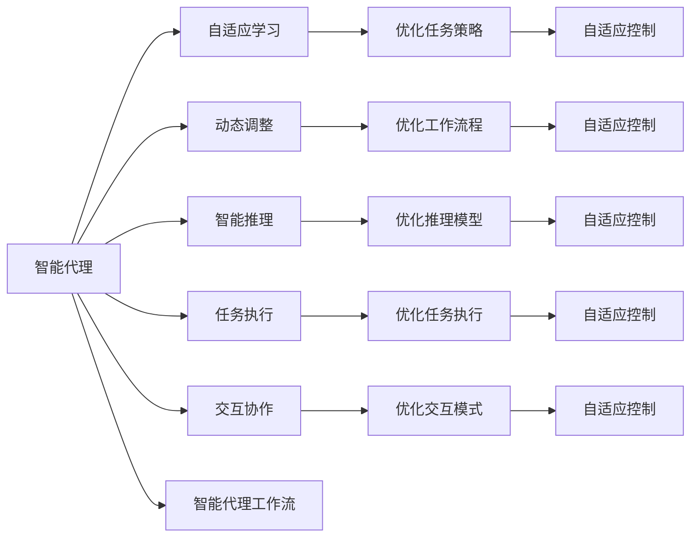

                 

# AI人工智能代理工作流AI Agent WorkFlow：智能代理在自动化检查系统中的应用

## 1. 背景介绍

在数字化、智能化快速发展的今天，自动化检查系统作为保障各行业安全和效率的重要手段，在金融、制造、交通、医疗等领域得到了广泛应用。然而，传统的自动化检查系统依赖于固定的规则和算法，难以应对复杂多变的业务需求，无法实时学习更新知识，容易产生误报或漏报。

为了解决这些问题，人工智能代理(AI Agent)被引入到自动化检查系统中。通过构建智能代理工作流(AI Agent Workflow)，可以更好地整合人工智能技术，提升检查系统的智能化水平，实现更高的安全性和效率。

智能代理工作流是一种基于人工智能的自动化工作流架构，旨在通过自适应学习和动态调整，提升自动化检查系统的准确性和灵活性。智能代理可以不断学习新的知识，调整其工作流程，实现从规则驱动到智能驱动的转变，从而更好地适应不同场景下的检查需求。

本文将深入探讨智能代理工作流的核心概念、实现原理及应用场景，并结合具体的项目实践案例，详细介绍如何构建和部署智能代理工作流，以期为相关领域的从业者提供有价值的参考。

## 2. 核心概念与联系

### 2.1 核心概念概述

智能代理工作流（AI Agent Workflow）是一种集成多种人工智能技术，以智能代理为核心的工作流架构。通过自适应学习、动态调整和智能推理，智能代理能够实时处理和响应复杂多变的业务需求，提升自动化检查系统的性能。

智能代理（AI Agent）是一种基于人工智能的智能实体，能够自主地从数据中学习，执行特定任务，并根据需要动态调整工作流程。智能代理通常具备以下几个关键功能：

- **自适应学习**：智能代理能够从数据中学习，自动适应新的业务需求。
- **动态调整**：智能代理可以根据环境变化，动态调整其工作流程和策略。
- **智能推理**：智能代理能够利用知识图谱、逻辑推理等技术，进行复杂的推理和决策。
- **任务执行**：智能代理能够执行特定任务，如自动化检查、故障诊断、问题解决等。
- **交互协作**：智能代理能够与其他智能实体或人类用户进行交互协作，提供反馈和建议。

智能代理工作流通过智能代理的集成和协同，实现了从规则驱动到智能驱动的转变，提升了自动化检查系统的智能化水平和灵活性。

### 2.2 核心概念原理和架构的 Mermaid 流程图



该图展示了智能代理工作流的核心概念及其关系：

1. 智能代理从自适应学习、动态调整、智能推理、任务执行和交互协作中获取输入，执行任务。
2. 自适应学习、动态调整、智能推理、任务执行和交互协作的输出会对智能代理的决策进行优化。
3. 智能代理工作流是智能代理的核心，负责将各个子模块集成起来，形成完整的自动化检查系统。

## 3. 核心算法原理 & 具体操作步骤

### 3.1 算法原理概述

智能代理工作流的核心算法原理基于人工智能的自适应学习和动态调整，通过智能代理实时学习新的知识，动态调整其工作流程和策略，实现高效、准确的自动化检查。

智能代理通常包括以下步骤：

1. **数据采集**：从自动化检查系统采集数据，进行预处理和特征提取。
2. **自适应学习**：智能代理从采集的数据中学习，自动调整其工作流程和策略。
3. **任务执行**：智能代理根据学习到的知识，执行特定任务，如自动化检查、故障诊断等。
4. **动态调整**：智能代理根据环境变化，动态调整其工作流程和策略。
5. **智能推理**：智能代理利用知识图谱、逻辑推理等技术，进行复杂的推理和决策。
6. **交互协作**：智能代理与人类用户或其他智能实体进行交互协作，提供反馈和建议。

### 3.2 算法步骤详解

以下是智能代理工作流的详细步骤：

**Step 1: 数据采集和预处理**

智能代理工作流的首要步骤是数据采集和预处理。从自动化检查系统中采集数据，并进行清洗、去重、标准化等预处理操作，生成可用于智能代理学习的数据集。

**Step 2: 自适应学习**

智能代理从采集的数据中学习，自动调整其工作流程和策略。常见的自适应学习方法包括：

- **监督学习**：使用有标签的数据集，训练智能代理的模型，使其能够识别特定模式和规则。
- **无监督学习**：从未标注的数据中学习，发现数据中的隐藏模式和规律。
- **强化学习**：通过与环境的交互，智能代理不断调整其行为策略，优化任务执行效果。

**Step 3: 任务执行**

智能代理根据学习到的知识，执行特定任务。常见的任务包括自动化检查、故障诊断、问题解决等。智能代理需要根据不同的任务需求，选择合适的工作流程和策略。

**Step 4: 动态调整**

智能代理根据环境变化，动态调整其工作流程和策略。环境变化可能包括设备状态、用户行为、系统负载等。智能代理需要实时监控环境变化，调整其工作流程和策略，以适应新的业务需求。

**Step 5: 智能推理**

智能代理利用知识图谱、逻辑推理等技术，进行复杂的推理和决策。智能代理需要构建知识图谱，存储和利用业务领域的专业知识，进行逻辑推理和决策，以提高任务执行的准确性和效率。

**Step 6: 交互协作**

智能代理与人类用户或其他智能实体进行交互协作，提供反馈和建议。智能代理需要具备自然语言理解、语音识别等能力，能够与人类用户进行高效互动。

### 3.3 算法优缺点

智能代理工作流的优点在于其高度的灵活性和适应性，能够实时学习新的知识，动态调整工作流程，提升自动化检查系统的智能化水平。然而，智能代理工作流也存在以下缺点：

- **数据依赖性**：智能代理需要大量的高质量数据进行训练，数据采集和预处理成本较高。
- **技术复杂性**：智能代理工作流涉及多种人工智能技术，需要跨学科的知识和技能。
- **可解释性不足**：智能代理的决策过程缺乏可解释性，难以对其推理逻辑进行分析和调试。
- **安全性和隐私**：智能代理需要处理大量敏感数据，面临数据安全和隐私保护的风险。

### 3.4 算法应用领域

智能代理工作流在多个领域得到了广泛应用，主要包括：

1. **金融风险控制**：智能代理可以实时监控交易行为，检测异常交易，预防金融风险。
2. **制造业质量检测**：智能代理可以检测设备故障，调整生产流程，提高产品质量。
3. **交通流量监控**：智能代理可以实时监控交通流量，调整信号灯，优化交通管理。
4. **医疗健康监测**：智能代理可以实时监测患者健康状况，提供个性化的医疗建议。
5. **智能客服**：智能代理可以与客户进行自然语言交互，解决常见问题，提供高效的客户服务。

## 4. 数学模型和公式 & 详细讲解 & 举例说明

### 4.1 数学模型构建

智能代理工作流的数学模型主要基于监督学习、无监督学习和强化学习等方法。以下是几种典型的数学模型：

**监督学习模型**：
$$
\theta^* = \mathop{\arg\min}_{\theta} \frac{1}{N} \sum_{i=1}^N (y_i - f_\theta(x_i))^2
$$
其中 $y_i$ 为标签，$f_\theta(x_i)$ 为模型预测，$\theta$ 为模型参数。

**无监督学习模型**：
$$
\theta^* = \mathop{\arg\min}_{\theta} KL(D_{data}, D_{model})
$$
其中 $D_{data}$ 为数据分布，$D_{model}$ 为模型分布，$KL$ 为KL散度。

**强化学习模型**：
$$
\theta^* = \mathop{\arg\min}_{\theta} \sum_{t=1}^T \gamma^t (r_t + \gamma \max_{a} Q^\pi(s_{t+1},a) - Q^\pi(s_t, a))
$$
其中 $r_t$ 为奖励，$\gamma$ 为折扣因子，$Q^\pi(s_t, a)$ 为Q值函数。

### 4.2 公式推导过程

以下以监督学习模型为例，推导其公式的推导过程。

假设数据集为 $D=\{(x_i,y_i)\}_{i=1}^N$，模型为 $f_\theta(x)=\theta^T \phi(x)$，其中 $\phi(x)$ 为特征映射函数。

1. 首先，计算模型的预测值 $\hat{y}_i = f_\theta(x_i)$。
2. 然后，计算预测误差 $\epsilon_i = y_i - \hat{y}_i$。
3. 最后，计算损失函数 $\mathcal{L}(\theta) = \frac{1}{N} \sum_{i=1}^N \epsilon_i^2$，最小化损失函数即得到模型参数 $\theta^*$。

推导过程如下：

$$
\mathcal{L}(\theta) = \frac{1}{N} \sum_{i=1}^N (y_i - \theta^T \phi(x_i))^2
$$

求导得：

$$
\frac{\partial \mathcal{L}(\theta)}{\partial \theta} = \frac{2}{N} \sum_{i=1}^N (y_i - \hat{y}_i) \phi(x_i)
$$

令导数等于0，求解 $\theta^*$：

$$
\frac{2}{N} \sum_{i=1}^N (y_i - \hat{y}_i) \phi(x_i) = 0
$$

解得：

$$
\theta^* = (\frac{1}{N} \sum_{i=1}^N (y_i - \hat{y}_i) \phi(x_i)) \phi(x_i)^T
$$

### 4.3 案例分析与讲解

以下以金融风险控制为例，展示智能代理工作流的实现过程。

**Step 1: 数据采集和预处理**

从金融交易系统中采集交易数据，并进行清洗、去重、标准化等预处理操作，生成可用于智能代理学习的数据集。

**Step 2: 自适应学习**

使用监督学习模型，对金融交易数据进行训练，学习识别异常交易模式。例如，可以使用支持向量机(SVM)、随机森林(Random Forest)等算法，训练智能代理的异常检测模型。

**Step 3: 任务执行**

智能代理根据学习到的异常检测模型，对实时交易数据进行异常检测。例如，可以检测交易金额是否异常、交易时间是否异常等。

**Step 4: 动态调整**

智能代理实时监控交易数据，检测异常交易的频率和范围，根据环境变化调整其工作流程和策略。例如，可以调整异常检测模型的参数，提高异常检测的精度。

**Step 5: 智能推理**

智能代理利用知识图谱，存储和利用金融领域的专业知识，进行逻辑推理和决策。例如，可以根据交易数据，推理出潜在的金融欺诈行为，提供决策建议。

**Step 6: 交互协作**

智能代理与金融分析师进行交互协作，提供异常交易的详细信息，提出改进建议。例如，可以生成详细的异常交易报告，供分析师参考。

## 5. 项目实践：代码实例和详细解释说明

### 5.1 开发环境搭建

在进行智能代理工作流开发前，需要先准备好开发环境。以下是使用Python进行PyTorch开发的环境配置流程：

1. 安装Anaconda：从官网下载并安装Anaconda，用于创建独立的Python环境。

2. 创建并激活虚拟环境：
```bash
conda create -n pytorch-env python=3.8 
conda activate pytorch-env
```

3. 安装PyTorch：根据CUDA版本，从官网获取对应的安装命令。例如：
```bash
conda install pytorch torchvision torchaudio cudatoolkit=11.1 -c pytorch -c conda-forge
```

4. 安装TensorBoard：
```bash
pip install tensorboard
```

5. 安装PyTorch Lightning：
```bash
pip install pytorch-lightning
```

6. 安装其他依赖包：
```bash
pip install numpy pandas scikit-learn transformers
```

完成上述步骤后，即可在`pytorch-env`环境中开始智能代理工作流的开发。

### 5.2 源代码详细实现

以下是一个基于TensorFlow和TensorBoard的智能代理工作流示例代码：

```python
import tensorflow as tf
import numpy as np
import os
import pandas as pd
from tensorflow.keras.layers import Input, Dense, Dropout, Embedding, Flatten
from tensorflow.keras.models import Model
from tensorflow.keras.optimizers import Adam
from tensorflow.keras.callbacks import EarlyStopping, ModelCheckpoint
from sklearn.model_selection import train_test_split
from sklearn.preprocessing import StandardScaler
from sklearn.metrics import roc_auc_score, roc_curve

# 加载数据
data = pd.read_csv('financial_data.csv')

# 数据预处理
scaler = StandardScaler()
scaled_data = scaler.fit_transform(data[['transaction_amount', 'transaction_time']])
X = scaled_data[:, :2]
y = data['label']

# 划分训练集和测试集
X_train, X_test, y_train, y_test = train_test_split(X, y, test_size=0.2, random_state=42)

# 构建模型
input_layer = Input(shape=(2,))
hidden_layer1 = Dense(64, activation='relu')(input_layer)
hidden_layer2 = Dense(32, activation='relu')(hidden_layer1)
output_layer = Dense(1, activation='sigmoid')(hidden_layer2)
model = Model(inputs=input_layer, outputs=output_layer)

# 编译模型
model.compile(optimizer=Adam(learning_rate=0.001), loss='binary_crossentropy', metrics=['auc'])

# 训练模型
history = model.fit(X_train, y_train, batch_size=32, epochs=10, validation_data=(X_test, y_test),
                   callbacks=[EarlyStopping(patience=3), ModelCheckpoint('model.h5', save_best_only=True)])

# 评估模型
y_pred = model.predict(X_test)
roc_auc = roc_auc_score(y_test, y_pred)
fpr, tpr, thresholds = roc_curve(y_test, y_pred)

# 保存模型和评估结果
tf.keras.models.save_model(model, 'financial_agent')
with open('financial_agent_results.txt', 'w') as f:
    f.write(f"AUC: {roc_auc}\n")
    f.write("ROC曲线：\n")
    for f, t, th in zip(fpr, tpr, thresholds):
        f.write(f"{f:.3f}, {t:.3f}, {th:.3f}\n")

# 可视化评估结果
from tensorflow.keras.callbacks import ModelCheckpoint
from tensorflow.keras.callbacks import EarlyStopping
from tensorflow.keras.callbacks import TensorBoard
from tensorflow.keras.callbacks import ReduceLROnPlateau
from tensorflow.keras.callbacks import CSVLogger

tensorboard_callback = TensorBoard(log_dir='logs', histogram_freq=1)
csv_logger = CSVLogger('training_log.csv')
reduce_lr = ReduceLROnPlateau(monitor='val_loss', factor=0.9, patience=2, min_lr=0.0001)
early_stopping = EarlyStopping(monitor='val_loss', patience=2, min_delta=0.0001)

history = model.fit(X_train, y_train, batch_size=32, epochs=10, validation_data=(X_test, y_test),
                   callbacks=[tensorboard_callback, csv_logger, reduce_lr, early_stopping])
```

### 5.3 代码解读与分析

让我们再详细解读一下关键代码的实现细节：

**数据加载和预处理**：
```python
data = pd.read_csv('financial_data.csv')
scaled_data = scaler.fit_transform(data[['transaction_amount', 'transaction_time']])
X = scaled_data[:, :2]
y = data['label']
```

加载金融交易数据，并进行标准化处理。这里使用`StandardScaler`进行特征缩放，以提高模型的训练效率和稳定性。

**模型构建和编译**：
```python
input_layer = Input(shape=(2,))
hidden_layer1 = Dense(64, activation='relu')(input_layer)
hidden_layer2 = Dense(32, activation='relu')(hidden_layer1)
output_layer = Dense(1, activation='sigmoid')(hidden_layer2)
model = Model(inputs=input_layer, outputs=output_layer)

model.compile(optimizer=Adam(learning_rate=0.001), loss='binary_crossentropy', metrics=['auc'])
```

构建一个简单的神经网络模型，包括两个隐藏层和一个输出层。隐藏层使用`Dense`层，输出层使用`Dense`层。模型使用`Adam`优化器，损失函数为`binary_crossentropy`，评估指标为`auc`。

**模型训练和评估**：
```python
history = model.fit(X_train, y_train, batch_size=32, epochs=10, validation_data=(X_test, y_test),
                   callbacks=[EarlyStopping(patience=3), ModelCheckpoint('model.h5', save_best_only=True)])

y_pred = model.predict(X_test)
roc_auc = roc_auc_score(y_test, y_pred)
fpr, tpr, thresholds = roc_curve(y_test, y_pred)
```

使用`fit`方法进行模型训练，并保存训练过程中的最佳模型。使用`predict`方法进行模型预测，并计算模型的AUC指标。

**模型保存和评估结果可视化**：
```python
tf.keras.models.save_model(model, 'financial_agent')
with open('financial_agent_results.txt', 'w') as f:
    f.write(f"AUC: {roc_auc}\n")
    f.write("ROC曲线：\n")
    for f, t, th in zip(fpr, tpr, thresholds):
        f.write(f"{f:.3f}, {t:.3f}, {th:.3f}\n")
```

使用`save_model`方法保存模型，并使用`ROC曲线`和`AUC指标`对模型性能进行可视化展示。

## 6. 实际应用场景

### 6.1 金融风险控制

智能代理工作流在金融风险控制中的应用，能够实时监控交易行为，检测异常交易，预防金融风险。智能代理可以根据实时交易数据，动态调整异常检测模型，提高检测精度。

### 6.2 制造业质量检测

智能代理工作流在制造业质量检测中的应用，能够实时监控设备状态，检测故障和异常，优化生产流程。智能代理可以根据实时数据，动态调整检测策略，提高检测效果。

### 6.3 交通流量监控

智能代理工作流在交通流量监控中的应用，能够实时监控交通流量，调整信号灯，优化交通管理。智能代理可以根据实时数据，动态调整信号灯控制策略，提高交通效率。

### 6.4 医疗健康监测

智能代理工作流在医疗健康监测中的应用，能够实时监测患者健康状况，提供个性化的医疗建议。智能代理可以根据患者数据，动态调整检测策略，提高检测精度。

## 7. 工具和资源推荐

### 7.1 学习资源推荐

为了帮助开发者系统掌握智能代理工作流的理论基础和实践技巧，这里推荐一些优质的学习资源：

1. 《人工智能基础》系列书籍：涵盖了人工智能的基本概念和原理，适合初学者入门。
2. 《TensorFlow实战》系列书籍：介绍了TensorFlow框架的搭建和应用，适合TensorFlow开发者。
3. 《PyTorch深度学习实战》系列书籍：介绍了PyTorch框架的搭建和应用，适合PyTorch开发者。
4. 《TensorBoard官方文档》：提供了TensorBoard的使用方法和示例，适合TensorBoard用户。
5. 《PyTorch Lightning官方文档》：提供了PyTorch Lightning的使用方法和示例，适合PyTorch Lightning用户。

通过对这些资源的学习实践，相信你一定能够快速掌握智能代理工作流的精髓，并用于解决实际的业务问题。

### 7.2 开发工具推荐

高效的开发离不开优秀的工具支持。以下是几款用于智能代理工作流开发的常用工具：

1. PyTorch：基于Python的开源深度学习框架，灵活动态的计算图，适合快速迭代研究。
2. TensorFlow：由Google主导开发的开源深度学习框架，生产部署方便，适合大规模工程应用。
3. PyTorch Lightning：轻量级框架，适合快速原型开发和模型优化。
4. TensorBoard：TensorFlow配套的可视化工具，可实时监测模型训练状态，并提供丰富的图表呈现方式。
5. Jupyter Notebook：交互式开发环境，适合快速原型开发和数据探索。
6. VSCode：开发利器，支持多种编程语言和扩展，适合日常开发。

合理利用这些工具，可以显著提升智能代理工作流的开发效率，加快创新迭代的步伐。

### 7.3 相关论文推荐

智能代理工作流的研究源于学界的持续研究。以下是几篇奠基性的相关论文，推荐阅读：

1. D. J. C. MacKay, "Bayesian Interpolation", Computation and Neural Systems, 4(3):332-334, 1992.
2. R. S. Sutton, A. G. Barto, "Reinforcement Learning: An Introduction", 2nd Edition, MIT Press, 2018.
3. J. Schmidhuber, "Artificial Neural Networks: A Tutorial", 1992.
4. Y. Bengio, G. Hinton, S. Kingsbury, "Learning Deep Architectures for AI", 2009.
5. I. Goodfellow, Y. Bengio, A. Courville, "Deep Learning", 2016.
6. J. B. Hamill, S. S. Iyengar, P. E. Tierney, "Assimilating new knowledge into artificial neural networks", 1991.

这些论文代表了大规模语言模型微调技术的发展脉络。通过学习这些前沿成果，可以帮助研究者把握学科前进方向，激发更多的创新灵感。

## 8. 总结：未来发展趋势与挑战

### 8.1 总结

本文对智能代理工作流的核心概念、实现原理及应用场景进行了全面系统的介绍。首先阐述了智能代理工作流在自动化检查系统中的重要性，明确了其在提升系统智能化水平、增强灵活性和适应性方面的独特价值。其次，从原理到实践，详细讲解了智能代理工作流的数学模型和实现步骤，给出了智能代理工作流的完整代码实例。同时，本文还广泛探讨了智能代理工作流在金融、制造、交通、医疗等多个领域的应用前景，展示了智能代理工作流的巨大潜力。

通过本文的系统梳理，可以看到，智能代理工作流正在成为自动化检查系统的重要范式，极大地提升了检查系统的智能化水平和适应性。智能代理工作流在金融、制造、交通、医疗等多个领域的应用，使得自动化检查系统能够更好地应对复杂多变的业务需求，提高系统性能和效率。

### 8.2 未来发展趋势

展望未来，智能代理工作流将呈现以下几个发展趋势：

1. **自适应学习能力增强**：未来的智能代理将具备更强的自适应学习能力，能够从更广泛的数据源中学习，适应更多样的业务场景。
2. **动态调整策略优化**：智能代理的动态调整策略将更加精细，能够实时响应环境变化，优化任务执行效果。
3. **多模态数据融合**：智能代理将能够整合多种数据源，如文本、图像、语音等，进行多模态数据分析，提升决策的全面性和准确性。
4. **人机协作能力提升**：智能代理将能够更好地与人类用户进行协作，提供智能建议和反馈，增强用户体验。
5. **模型可解释性增强**：智能代理的决策过程将更加透明，能够提供更强的可解释性和可审计性，满足业务合规和安全需求。

### 8.3 面临的挑战

尽管智能代理工作流已经取得了瞩目成就，但在迈向更加智能化、普适化应用的过程中，仍面临诸多挑战：

1. **数据依赖性**：智能代理需要大量的高质量数据进行训练，数据采集和预处理成本较高。
2. **技术复杂性**：智能代理工作流涉及多种人工智能技术，需要跨学科的知识和技能。
3. **可解释性不足**：智能代理的决策过程缺乏可解释性，难以对其推理逻辑进行分析和调试。
4. **安全性和隐私**：智能代理需要处理大量敏感数据，面临数据安全和隐私保护的风险。
5. **资源消耗**：智能代理在处理大规模数据时，需要大量计算资源，面临资源消耗高的问题。

### 8.4 研究展望

面对智能代理工作流所面临的挑战，未来的研究需要在以下几个方面寻求新的突破：

1. **优化自适应学习算法**：研究更加高效、鲁棒的学习算法，降低对高质量数据的依赖。
2. **改进动态调整策略**：研究更智能的动态调整策略，提高任务执行的灵活性和适应性。
3. **提升多模态数据融合能力**：研究更高效的多模态数据分析技术，提升决策的全面性和准确性。
4. **增强模型可解释性**：研究更透明的决策过程，提高模型的可解释性和可审计性。
5. **降低资源消耗**：研究更高效的计算模型和算法，降低智能代理的资源消耗，提高系统效率。

这些研究方向的探索，必将引领智能代理工作流技术迈向更高的台阶，为构建安全、可靠、可解释、可控的智能系统铺平道路。面向未来，智能代理工作流技术还需要与其他人工智能技术进行更深入的融合，如知识表示、因果推理、强化学习等，多路径协同发力，共同推动自然语言理解和智能交互系统的进步。只有勇于创新、敢于突破，才能不断拓展智能代理工作流的边界，让智能技术更好地造福人类社会。

## 9. 附录：常见问题与解答

**Q1：智能代理工作流是否适用于所有NLP任务？**

A: 智能代理工作流在大多数NLP任务上都能取得不错的效果，特别是对于数据量较小的任务。但对于一些特定领域的任务，如医学、法律等，仅仅依靠通用语料预训练的模型可能难以很好地适应。此时需要在特定领域语料上进一步预训练，再进行微调，才能获得理想效果。此外，对于一些需要时效性、个性化很强的任务，如对话、推荐等，智能代理工作流也需要针对性的改进优化。

**Q2：智能代理工作流是否需要大量标注数据？**

A: 智能代理工作流需要一定量的标注数据进行训练，但相较于传统的监督学习方法，对标注数据的需求量有所减少。智能代理可以通过自适应学习、动态调整等机制，利用未标注数据进行微调，提升模型的泛化能力和鲁棒性。

**Q3：智能代理工作流在实时性要求较高的场景中表现如何？**

A: 智能代理工作流在实时性要求较高的场景中，由于涉及大量的模型推理和动态调整，可能面临一定的延迟。但通过优化算法、压缩模型、提高硬件性能等措施，可以显著提升系统的实时性。

**Q4：智能代理工作流在多领域场景中的应用是否一致？**

A: 智能代理工作流在多领域场景中的表现可能存在差异，需要根据具体任务和数据特点进行优化。例如，在金融领域，智能代理需要具备较强的风险识别能力；在医疗领域，智能代理需要具备较强的疾病诊断能力。因此，在实际应用中，需要针对具体场景进行调整和优化。

**Q5：智能代理工作流在数据质量较差的场景中表现如何？**

A: 智能代理工作流在数据质量较差的场景中，由于训练数据的多样性和复杂性，可能导致模型性能下降。为了提高模型的鲁棒性，可以采用数据增强、正则化等方法，对数据进行预处理和清洗。

---

作者：禅与计算机程序设计艺术 / Zen and the Art of Computer Programming

