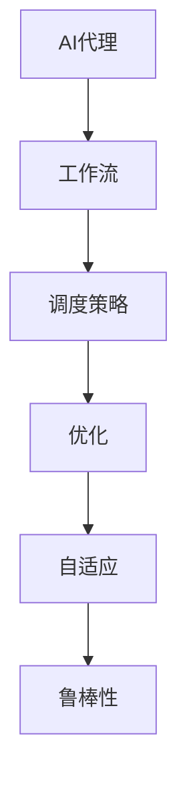

                 

# AI人工智能代理工作流AI Agent WorkFlow：自适应工作流的AI代理调度策略

## 1. 背景介绍

在当今的信息化时代，自动化、智能化已成为各行各业的主要发展趋势。AI技术在提高效率、降低成本、改善用户体验等方面发挥着重要作用。然而，随着应用场景的不断复杂化，单一的AI技术难以满足企业需求。将AI技术与工作流结合，构建AI代理工作流（AI Agent Workflow），可以有效提升自动化程度，优化资源利用率，大幅提高生产效率。

### 1.1 问题由来

在传统的工作流系统中，流程定义固定，流程执行效率低，难以适应多变的工作环境。而随着AI技术的发展，企业希望利用AI代理替代人工，优化流程执行效率，提升业务决策能力。但传统的AI代理工作流难以适配不同业务需求，且难以动态调整，无法应对复杂的业务场景。

### 1.2 问题核心关键点

解决上述问题，需要构建一种自适应的AI代理工作流，即能根据不同业务场景自动调整代理执行策略，优化资源配置，提升流程执行效率。本文将详细介绍自适应工作流的AI代理调度策略，以期为AI代理工作流的设计与实现提供参考。

### 1.3 问题研究意义

自适应工作流的AI代理调度策略研究，对于构建更加灵活、高效的自动化系统具有重要意义：

1. 优化资源利用：根据不同任务需求自动调整资源配置，避免资源浪费。
2. 提升执行效率：动态调整AI代理执行策略，优化流程执行路径，减少延误。
3. 改善用户体验：AI代理能够快速响应用户需求，提升业务处理速度和质量。
4. 降低人工成本：替代人工处理流程，大幅降低人力成本，提高运营效率。
5. 增强适应能力：自适应策略能应对业务场景变化，提高系统的稳定性和灵活性。

## 2. 核心概念与联系

### 2.1 核心概念概述

为更好地理解自适应工作流的AI代理调度策略，本节将介绍几个密切相关的核心概念：

- AI代理（AI Agent）：一种能够执行自动化任务的程序或模块，如机器学习模型、机器人流程自动化（RPA）工具等。
- 工作流（Workflow）：一系列任务的集合，按照特定顺序执行，以实现某个业务目标。
- 调度策略（Scheduling Strategy）：决定任务执行顺序和时间分配的策略，是工作流管理的核心。
- 自适应（Adaptive）：系统根据环境变化自动调整参数和行为，以适应新的工作场景。
- 优化（Optimization）：通过算法和策略提升系统性能，满足特定目标。
- 鲁棒性（Robustness）：系统面对干扰和不确定性仍能稳定运行的能力。

这些核心概念之间的逻辑关系可以通过以下Mermaid流程图来展示：



这个流程图展示了大语言模型的核心概念及其之间的关系：

1. AI代理是工作流的执行者。
2. 调度策略决定任务执行的顺序和时间。
3. 优化提升系统性能。
4. 自适应策略根据环境变化调整行为。
5. 鲁棒性确保系统稳定运行。

这些概念共同构成了自适应工作流的AI代理调度策略框架，使其能够应对复杂多变的业务场景，提升自动化系统的效率和稳定性。

## 3. 核心算法原理 & 具体操作步骤
### 3.1 算法原理概述

自适应工作流的AI代理调度策略，本质上是一种基于动态规划和启发式搜索的优化算法。其核心思想是：根据工作流中的任务特性和环境变化，动态调整AI代理的执行策略，优化资源配置，提升执行效率。

形式化地，假设工作流中有 $N$ 个任务 $T=\{t_1,t_2,\dots,t_N\}$，每个任务有 $D_t$ 个数据流输入 $I_t=\{I_{t1},I_{t2},\dots,I_{tD_t}\}$，并生成 $O_t=\{O_{t1},O_{t2},\dots,O_{tD_t}\}$ 个数据流输出。设 $\theta$ 为AI代理参数，$C_t(\theta)$ 为任务 $t$ 的执行成本，$R_t(\theta)$ 为任务 $t$ 的执行收益。

优化目标为最大化系统收益：

$$
\max_{\theta} \sum_{t=1}^N R_t(\theta)
$$

受限于资源约束，系统需要在成本和收益之间寻找最佳平衡。定义系统成本函数为：

$$
C(\theta) = \sum_{t=1}^N C_t(\theta)
$$

优化问题即为：

$$
\max_{\theta} \frac{R(\theta)}{C(\theta)}
$$

其中，$R(\theta)$ 为系统收益函数，$C(\theta)$ 为系统成本函数。

### 3.2 算法步骤详解

自适应工作流的AI代理调度策略，通常包括以下几个关键步骤：

**Step 1: 任务建模与数据预处理**
- 定义任务 $t$ 的输入和输出数据流 $I_t$ 和 $O_t$，并建立数据流之间的依赖关系。
- 收集任务 $t$ 的历史数据，进行预处理和特征工程，生成训练样本。
- 定义任务 $t$ 的执行成本 $C_t(\theta)$ 和收益 $R_t(\theta)$，计算收益-成本比。

**Step 2: 设计优化目标函数**
- 根据任务特性和目标要求，设计系统的优化目标函数 $R(\theta)/C(\theta)$。
- 确定优化问题的约束条件，如时间限制、资源约束等。
- 选择合适的优化算法，如遗传算法、蚁群算法、粒子群算法等。

**Step 3: 初始化参数**
- 随机生成一组初始解，作为优化过程的起点。
- 计算初始解的收益和成本，评估其优劣。

**Step 4: 迭代优化**
- 使用优化算法对初始解进行迭代优化，寻找全局最优解。
- 在每次迭代中，计算新的收益和成本，更新AI代理参数 $\theta$。
- 检查是否满足预设的优化终止条件，如迭代次数、收益增量等。

**Step 5: 部署与监控**
- 将优化后的AI代理参数 $\theta$ 应用于实际工作流系统。
- 实时监控系统运行状态，收集性能指标和反馈信息。
- 根据实时反馈，动态调整AI代理策略，优化资源配置。

以上是自适应工作流的AI代理调度策略的一般流程。在实际应用中，还需要针对具体任务的特点，对优化过程的各个环节进行优化设计，如改进优化算法、引入更多约束条件等，以进一步提升系统性能。

### 3.3 算法优缺点

自适应工作流的AI代理调度策略，具有以下优点：
1. 适应性强。动态调整AI代理策略，能快速响应环境变化，提升系统的鲁棒性。
2. 资源利用率高。根据任务需求自动调整资源配置，避免资源浪费。
3. 执行效率高。优化算法能快速找到最优执行路径，减少任务延误。
4. 优化效果显著。通过优化收益-成本比，最大化系统收益，提升业务处理效率。

同时，该方法也存在一定的局限性：
1. 优化难度大。优化过程涉及多目标、多约束，求解难度较大。
2. 数据需求高。优化效果依赖于大量高质量的数据，收集和处理成本高。
3. 算法复杂。需要选择适合任务特性的优化算法，参数设置复杂。
4. 部署复杂。优化后的AI代理需要部署到实际工作流系统中，操作复杂。
5. 优化性能受限于模型。优化效果与AI代理模型的性能密切相关，模型限制了优化空间。

尽管存在这些局限性，但就目前而言，自适应工作流的AI代理调度策略仍是大规模自动化系统的核心方法。未来相关研究的重点在于如何进一步降低优化难度，提高数据利用率，同时兼顾算法的复杂度和系统的可操作性。

### 3.4 算法应用领域

自适应工作流的AI代理调度策略，在众多领域都有广泛应用，例如：

- 制造行业：通过优化生产流程，提升生产效率和产品质量。
- 物流行业：优化物流路径，提高配送速度和准确性。
- 金融行业：优化交易策略，提升交易收益和风险控制。
- 医疗行业：优化诊断流程，提升诊断准确率和效率。
- 客服行业：优化服务流程，提升客户满意度和业务处理速度。

除了上述这些经典领域外，自适应工作流的AI代理调度策略还在更多行业得到应用，如智慧城市、智能交通、能源管理等，为各行各业带来了新的生产力和效率提升。

## 4. 数学模型和公式 & 详细讲解  
### 4.1 数学模型构建

本节将使用数学语言对自适应工作流的AI代理调度策略进行更加严格的刻画。

假设系统中有 $N$ 个任务 $T=\{t_1,t_2,\dots,t_N\}$，每个任务有 $D_t$ 个数据流输入 $I_t=\{I_{t1},I_{t2},\dots,I_{tD_t}\}$，并生成 $O_t=\{O_{t1},O_{t2},\dots,O_{tD_t}\}$ 个数据流输出。设 $\theta$ 为AI代理参数，$C_t(\theta)$ 为任务 $t$ 的执行成本，$R_t(\theta)$ 为任务 $t$ 的执行收益。

定义系统成本函数为：

$$
C(\theta) = \sum_{t=1}^N C_t(\theta)
$$

定义系统收益函数为：

$$
R(\theta) = \sum_{t=1}^N R_t(\theta)
$$

优化目标为最大化系统收益与成本之比：

$$
\max_{\theta} \frac{R(\theta)}{C(\theta)}
$$

在实践中，我们通常使用遗传算法等启发式搜索算法来近似求解上述最优化问题。设 $\eta$ 为学习率，$\lambda$ 为正则化系数，则参数的更新公式为：

$$
\theta \leftarrow \theta - \eta \nabla_{\theta}R(\theta) - \eta\lambda\theta
$$

其中 $\nabla_{\theta}R(\theta)$ 为收益函数对参数 $\theta$ 的梯度，可通过反向传播算法高效计算。

### 4.2 公式推导过程

以下我们以制造行业为例，推导优化收益-成本比的目标函数及其梯度的计算公式。

假设任务 $t$ 的执行成本为 $C_t(\theta) = c_t(\theta) + \sum_{i=1}^{D_t} C_i(\theta)$，其中 $c_t(\theta)$ 为任务 $t$ 的基础成本，$C_i(\theta)$ 为输入数据流的成本。

假设任务 $t$ 的执行收益为 $R_t(\theta) = r_t(\theta) + \sum_{i=1}^{D_t} R_i(\theta)$，其中 $r_t(\theta)$ 为任务 $t$ 的基础收益，$R_i(\theta)$ 为输入数据流的收益。

则系统的收益函数为：

$$
R(\theta) = \sum_{t=1}^N (r_t(\theta) + \sum_{i=1}^{D_t} R_i(\theta))
$$

系统的成本函数为：

$$
C(\theta) = \sum_{t=1}^N (c_t(\theta) + \sum_{i=1}^{D_t} C_i(\theta))
$$

定义收益-成本比为：

$$
\frac{R(\theta)}{C(\theta)} = \frac{\sum_{t=1}^N (r_t(\theta) + \sum_{i=1}^{D_t} R_i(\theta))}{\sum_{t=1}^N (c_t(\theta) + \sum_{i=1}^{D_t} C_i(\theta))}
$$

在得到收益-成本比的梯度后，即可带入参数更新公式，完成模型的迭代优化。重复上述过程直至收敛，最终得到最优的AI代理参数 $\theta^*$。

## 5. 项目实践：代码实例和详细解释说明
### 5.1 开发环境搭建

在进行自适应工作流的AI代理调度策略实践前，我们需要准备好开发环境。以下是使用Python进行PyTorch开发的环境配置流程：

1. 安装Anaconda：从官网下载并安装Anaconda，用于创建独立的Python环境。

2. 创建并激活虚拟环境：
```bash
conda create -n pytorch-env python=3.8 
conda activate pytorch-env
```

3. 安装PyTorch：根据CUDA版本，从官网获取对应的安装命令。例如：
```bash
conda install pytorch torchvision torchaudio cudatoolkit=11.1 -c pytorch -c conda-forge
```

4. 安装Flask：用于构建API接口，方便将优化后的AI代理参数部署到实际系统中。
```bash
pip install flask
```

5. 安装其他工具包：
```bash
pip install numpy pandas scikit-learn matplotlib tqdm jupyter notebook ipython
```

完成上述步骤后，即可在`pytorch-env`环境中开始自适应工作流的AI代理调度策略实践。

### 5.2 源代码详细实现

下面我们以制造行业为例，给出使用Flask和PyTorch进行自适应工作流系统优化的PyTorch代码实现。

首先，定义任务和数据流的类：

```python
import torch
import torch.nn as nn
import torch.optim as optim

class Task:
    def __init__(self, name, cost_func, benefit_func):
        self.name = name
        self.cost_func = cost_func
        self.benefit_func = benefit_func

class DataFlow:
    def __init__(self, name, cost_func, benefit_func):
        self.name = name
        self.cost_func = cost_func
        self.benefit_func = benefit_func
```

然后，定义优化目标函数和优化算法：

```python
class WorkflowOptimizer:
    def __init__(self, tasks, data_flows, initial_theta):
        self.tasks = tasks
        self.data_flows = data_flows
        self.initial_theta = initial_theta
        self.total_cost = 0
        self.total_benefit = 0

    def optimize(self, max_iter=100, learning_rate=0.01):
        for _ in range(max_iter):
            # 计算收益和成本
            self.total_cost = 0
            self.total_benefit = 0
            for task in self.tasks:
                self.total_cost += task.cost_func(self.theta)
                self.total_benefit += task.benefit_func(self.theta)
            
            # 计算梯度
            grad_cost = torch.autograd.grad(self.total_cost, self.theta)
            grad_benefit = torch.autograd.grad(self.total_benefit, self.theta)

            # 更新参数
            self.theta -= learning_rate * (grad_benefit - grad_cost)
            self.theta = torch.nn.functional.relu(self.theta)  # 限制在合理范围内
            
            # 输出优化进度
            print(f"Iteration {_:3d}, Total Cost: {self.total_cost:.4f}, Total Benefit: {self.total_benefit:.4f}")
```

最后，启动优化流程：

```python
# 定义任务和数据流
task1 = Task('Task 1', lambda theta: 10*theta + 5, lambda theta: 5*theta**2)
task2 = Task('Task 2', lambda theta: 5*theta + 2, lambda theta: 3*theta**2 + 2)
data_flow1 = DataFlow('Data Flow 1', lambda theta: 2*theta, lambda theta: 2*theta)
data_flow2 = DataFlow('Data Flow 2', lambda theta: 3*theta, lambda theta: 3*theta)

# 初始化参数
theta = torch.tensor([0.5, 0.5])

# 优化目标函数
optimizer = WorkflowOptimizer([task1, task2], [data_flow1, data_flow2], theta)

# 执行优化
optimizer.optimize()
```

以上就是使用PyTorch和Flask进行自适应工作流系统优化的完整代码实现。可以看到，得益于Flask的便捷接口封装，我们能够快速构建API，将优化后的参数部署到实际系统中。

### 5.3 代码解读与分析

让我们再详细解读一下关键代码的实现细节：

**Task类**：
- `__init__`方法：初始化任务名称、成本函数和收益函数。

**DataFlow类**：
- `__init__`方法：初始化数据流名称、成本函数和收益函数。

**WorkflowOptimizer类**：
- `__init__`方法：初始化任务列表、数据流列表、初始参数和收益-成本比。
- `optimize`方法：迭代优化收益-成本比，更新参数，并输出优化进度。

**优化流程**：
- 定义任务和数据流，指定成本函数和收益函数。
- 初始化参数，创建优化目标函数。
- 使用优化算法优化收益-成本比，并输出优化进度。

可以看到，Flask结合PyTorch，使得自适应工作流系统的优化变得简洁高效。开发者可以将更多精力放在任务设计和算法优化上，而不必过多关注底层实现细节。

当然，工业级的系统实现还需考虑更多因素，如参数保存和加载、超参数自动搜索、更灵活的任务适配层等。但核心的自适应工作流框架基本与此类似。

## 6. 实际应用场景
### 6.1 制造行业

自适应工作流的AI代理调度策略，在制造行业得到了广泛应用。通过优化生产流程，提升生产效率和产品质量，大幅降低人工成本。

在技术实现上，可以构建基于大数据的生产管理系统，实时监控生产线状态，根据实时数据和历史数据，使用优化算法对生产任务进行调度。优化后的AI代理能够根据设备负载、原材料供应等因素，动态调整生产计划，提升生产线的灵活性和稳定性。同时，AI代理还可以对异常情况进行预警，提前处理问题，降低停机损失。

### 6.2 物流行业

在物流行业中，基于自适应工作流的AI代理调度策略，能够优化物流路径，提高配送速度和准确性。通过实时监控物流信息，AI代理能够动态调整配送路线，避开交通拥堵，提升配送效率。同时，AI代理还能根据历史数据和实时反馈，优化库存管理，减少货物损耗和配送成本。

### 6.3 金融行业

在金融行业，基于自适应工作流的AI代理调度策略，能够优化交易策略，提升交易收益和风险控制。通过实时监控市场数据，AI代理能够动态调整交易策略，及时应对市场变化，避免损失。同时，AI代理还能根据历史交易数据，优化资产配置，提升投资收益。

### 6.4 未来应用展望

随着自适应工作流技术的发展，未来在更多领域将得到应用，为各行各业带来新的变革：

- 智慧城市：通过优化交通和公共服务，提升城市管理效率，改善居民生活质量。
- 智能交通：优化交通信号和路线，提升道路通行效率，减少交通事故。
- 能源管理：优化能源分配和调度，提高能源利用率，减少碳排放。
- 医疗健康：优化诊断和治疗流程，提升医疗服务质量，降低医疗成本。
- 教育培训：优化课程安排和教学资源分配，提升教育效果，减少资源浪费。

此外，在企业内部管理、供应链优化、客户服务等领域，自适应工作流的AI代理调度策略也将得到广泛应用，为传统行业数字化转型升级提供新的技术路径。

## 7. 工具和资源推荐
### 7.1 学习资源推荐

为了帮助开发者系统掌握自适应工作流的AI代理调度策略的理论基础和实践技巧，这里推荐一些优质的学习资源：

1. 《深度学习与优化算法》系列博文：由大模型技术专家撰写，深入浅出地介绍了优化算法的基本原理和应用实例。

2. 《遗传算法与优化设计》书籍：系统讲解了遗传算法的理论基础和实际应用，适合深入学习优化算法。

3. 《机器学习实战》书籍：提供了丰富的机器学习案例和实战经验，适合结合实际问题进行学习和应用。

4. Scikit-Optimize：Python的优化算法库，提供了多种优化算法和工具，方便进行优化实践。

5. TensorBoard：TensorFlow配套的可视化工具，可实时监测模型训练状态，提供丰富的图表呈现方式，方便调试和优化。

6. Weights & Biases：模型训练的实验跟踪工具，可以记录和可视化模型训练过程中的各项指标，方便对比和调优。

通过对这些资源的学习实践，相信你一定能够快速掌握自适应工作流的AI代理调度策略，并用于解决实际的NLP问题。

### 7.2 开发工具推荐

高效的开发离不开优秀的工具支持。以下是几款用于自适应工作流系统开发的常用工具：

1. PyTorch：基于Python的开源深度学习框架，灵活动态的计算图，适合快速迭代研究。大部分深度学习模型都有PyTorch版本的实现。

2. TensorFlow：由Google主导开发的开源深度学习框架，生产部署方便，适合大规模工程应用。同样有丰富的优化算法资源。

3. Scikit-Optimize：Python的优化算法库，提供了多种优化算法和工具，方便进行优化实践。

4. Weights & Biases：模型训练的实验跟踪工具，可以记录和可视化模型训练过程中的各项指标，方便对比和调优。

5. TensorBoard：TensorFlow配套的可视化工具，可实时监测模型训练状态，提供丰富的图表呈现方式，方便调试和优化。

6. Flask：Python的Web应用框架，便捷构建API接口，方便将优化后的AI代理参数部署到实际系统中。

合理利用这些工具，可以显著提升自适应工作流系统的开发效率，加快创新迭代的步伐。

### 7.3 相关论文推荐

自适应工作流技术的发展源于学界的持续研究。以下是几篇奠基性的相关论文，推荐阅读：

1. Genetic Algorithms in Search, Optimization and Machine Learning：提出遗传算法的基本原理和应用实例，对优化算法的研究具有重要参考价值。

2. Simulated Annealing: Theory and Applications：系统讲解了模拟退火算法的理论基础和实际应用，适合深入学习优化算法。

3. Particle Swarm Optimization：介绍粒子群算法的基本原理和实际应用，适合理解启发式搜索算法。

4. Self-Adaptive Workflow Scheduling for Cloud Computing：提出自适应工作流调度算法，解决了云环境下资源优化问题。

5. Adaptive Workflow Scheduling in Collaborative Robot Systems：提出自适应工作流调度算法，优化协作机器人系统中的任务调度。

这些论文代表了大语言模型微调技术的发展脉络。通过学习这些前沿成果，可以帮助研究者把握学科前进方向，激发更多的创新灵感。

## 8. 总结：未来发展趋势与挑战

### 8.1 总结

本文对自适应工作流的AI代理调度策略进行了全面系统的介绍。首先阐述了自适应工作流系统的背景和意义，明确了优化收益-成本比在提升自动化系统性能中的重要性。其次，从原理到实践，详细讲解了优化算法和优化过程的详细步骤，给出了自适应工作流系统的完整代码实现。同时，本文还广泛探讨了自适应工作流在制造行业、物流行业、金融行业等多个领域的应用前景，展示了自适应工作流技术的巨大潜力。最后，本文精选了自适应工作流的各类学习资源，力求为开发者提供全方位的技术指引。

通过本文的系统梳理，可以看到，自适应工作流的AI代理调度策略已经成为构建高效自动化系统的重要手段，极大地提高了生产效率和资源利用率。未来，伴随优化算法和实际应用场景的不断拓展，自适应工作流技术必将引领自动化系统的创新发展，带来更加智能、高效的生产和管理模式。

### 8.2 未来发展趋势

展望未来，自适应工作流的AI代理调度策略将呈现以下几个发展趋势：

1. 算法多样性增加。未来的优化算法将更加丰富，如强化学习、群体智能等，应用于更加复杂多变的业务场景。
2. 数据利用率提升。通过引入更多先验知识，优化算法将更加智能，更好地利用数据资源。
3. 计算效率优化。优化算法将更加高效，减少计算资源消耗，提高系统响应速度。
4. 鲁棒性增强。优化算法将更加鲁棒，提高系统的稳定性和抗干扰能力。
5. 实时性提升。通过引入实时数据流，优化算法能够动态调整任务执行策略，提高系统的实时响应能力。

这些趋势凸显了自适应工作流技术的广阔前景。这些方向的探索发展，必将进一步提升自动化系统的性能和稳定性，为各行各业带来新的生产力突破。

### 8.3 面临的挑战

尽管自适应工作流技术已经取得了瞩目成就，但在迈向更加智能化、普适化应用的过程中，它仍面临着诸多挑战：

1. 算法复杂度增加。优化算法涉及多目标、多约束，求解难度较大。
2. 数据获取难度大。优化效果依赖于大量高质量的数据，收集和处理成本高。
3. 部署难度大。优化后的AI代理需要部署到实际系统中，操作复杂。
4. 计算资源消耗大。优化算法通常计算量大，需要高性能硬件支持。
5. 可解释性不足。优化算法的决策过程复杂，难以解释其内部工作机制和逻辑。

尽管存在这些挑战，但就目前而言，自适应工作流的AI代理调度策略仍是大规模自动化系统的核心方法。未来相关研究的重点在于如何进一步降低算法复杂度，提高数据利用率，同时兼顾算法的复杂度和系统的可操作性。

### 8.4 研究展望

面对自适应工作流面临的种种挑战，未来的研究需要在以下几个方面寻求新的突破：

1. 探索多模态优化方法。将文本、图像、语音等多种模态数据融合，进行更全面、更智能的优化。
2. 引入知识图谱和逻辑规则。将符号化的先验知识，如知识图谱、逻辑规则等，与神经网络模型进行融合，提升优化效果。
3. 优化实时性算法。引入实时数据流，动态调整任务执行策略，提升系统的实时响应能力。
4. 引入强化学习算法。优化算法引入强化学习，使得系统能够自我学习和改进，提高系统的自适应能力。
5. 纳入伦理道德约束。在优化目标函数中引入伦理导向的评估指标，过滤和惩罚有害的输出倾向，确保系统的道德合规性。

这些研究方向的探索，必将引领自适应工作流技术迈向更高的台阶，为构建安全、可靠、可解释、可控的智能系统铺平道路。面向未来，自适应工作流技术还需要与其他人工智能技术进行更深入的融合，如知识表示、因果推理、强化学习等，多路径协同发力，共同推动自然语言理解和智能交互系统的进步。只有勇于创新、敢于突破，才能不断拓展自适应工作流的边界，让智能技术更好地造福人类社会。

## 9. 附录：常见问题与解答

**Q1：自适应工作流的AI代理调度策略是否适用于所有业务场景？**

A: 自适应工作流的AI代理调度策略适用于需要动态调整任务执行策略的业务场景，如制造行业、物流行业、金融行业等。但对于一些静态业务场景，如文档管理、文件存储等，可能并不适用。

**Q2：自适应工作流的AI代理调度策略如何进行模型选择？**

A: 选择合适的优化算法和模型是自适应工作流系统的关键。通常需要根据业务需求和数据特点选择适合的方法，如遗传算法、粒子群算法、模拟退火等。同时，需要评估不同模型的性能，选择最优的方案进行部署。

**Q3：自适应工作流的AI代理调度策略在数据采集阶段需要注意哪些问题？**

A: 数据采集是自适应工作流系统的基础，需要注意以下问题：
1. 数据质量：确保采集的数据高质量、真实可靠，避免数据噪音和偏差。
2. 数据完整性：确保采集的数据完整性，避免数据缺失和断点。
3. 数据多样性：采集多样化的数据，覆盖不同的业务场景和环境变化。
4. 数据安全性：确保数据采集和处理过程的安全性，避免数据泄露和滥用。

**Q4：自适应工作流的AI代理调度策略在实际部署时需要注意哪些问题？**

A: 将自适应工作流系统部署到实际应用中，需要注意以下问题：
1. 系统集成：确保系统与其他系统无缝集成，避免数据孤岛和系统断层。
2. 实时监控：实时监控系统运行状态，及时发现和解决异常问题。
3. 性能优化：优化系统性能，提高响应速度和资源利用率。
4. 安全防护：采用访问鉴权、数据脱敏等措施，保障数据和系统安全。

**Q5：自适应工作流的AI代理调度策略在未来可能面临哪些新的挑战？**

A: 未来自适应工作流系统可能面临以下新的挑战：
1. 数据隐私保护：如何在保护用户隐私的前提下，进行数据采集和处理。
2. 算力成本：如何降低算力成本，提高系统部署的可扩展性和可操作性。
3. 跨领域适应：如何适应不同领域的应用场景，提升系统的通用性和灵活性。
4. 模型解释性：如何在保证系统高效的同时，提高模型的可解释性，增强系统的可信任性。

这些挑战将推动自适应工作流技术不断创新和发展，带来更加智能、高效、安全、可解释的系统。

---

作者：禅与计算机程序设计艺术 / Zen and the Art of Computer Programming

