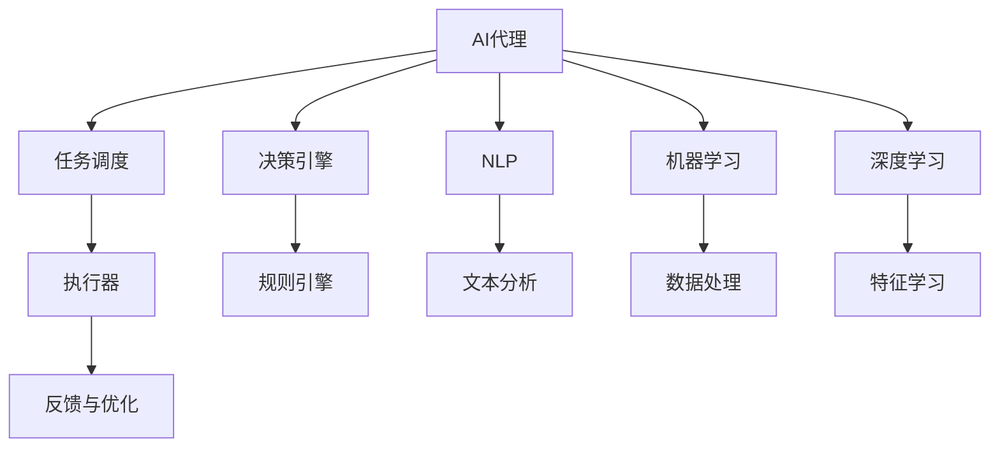

                 

# AI人工智能代理工作流AI Agent WorkFlow：设计智能任务处理流程

> 关键词：AI代理,工作流,智能任务处理,流程自动化,机器学习,深度学习,自然语言处理,NLP

## 1. 背景介绍

### 1.1 问题由来

随着人工智能技术的不断成熟和普及，各行各业都开始尝试引入AI技术以提升运营效率和决策水平。特别是在自动化流程处理、客服交互、内容生成等场景中，AI代理开始扮演越来越重要的角色。然而，尽管AI代理在不少应用中展现了出色的性能，但它们仍然存在一些局限性，例如任务处理流程复杂、多任务管理困难、决策灵活性不足等。

### 1.2 问题核心关键点

AI代理工作流设计的核心在于：如何构建一个具备高效、灵活、可扩展特性的工作流系统，以应对复杂的业务场景和不断变化的业务需求。该系统需要融合自然语言处理(NLP)、机器学习(ML)、深度学习(DL)等技术，设计出一个能够自动化任务处理、智能决策和弹性配置的系统框架。

### 1.3 问题研究意义

设计一个高效的AI代理工作流系统，对于提升企业自动化水平、增强客户服务质量、优化运营流程具有重要意义：

1. **提升效率**：自动化任务处理可以显著缩短响应时间，提升生产效率。
2. **降低成本**：减少人力投入，降低企业的运营成本。
3. **增强决策**：通过分析大量数据，提供数据驱动的决策支持，提升决策质量。
4. **提升客户体验**：智能客服、自动化内容生成等应用能够提升客户满意度，增强品牌忠诚度。
5. **灵活适应**：系统能够根据需求动态调整，应对业务变化。
6. **可扩展性**：系统可水平或垂直扩展，支持复杂的多任务处理。

## 2. 核心概念与联系

### 2.1 核心概念概述

为更好地理解AI代理工作流的设计原理和架构，本节将介绍几个核心概念：

- **AI代理(AI Agent)**：一种具备自动化任务处理、智能决策和弹性配置功能的软件模块或系统。通常由自然语言理解、任务调度、决策引擎、执行器等组件构成。
- **工作流(Workflow)**：定义了任务处理的流程和步骤，包括任务的起点、流转、终止等环节。在工作流中，AI代理按照预定义的规则和流程执行任务。
- **任务调度(Task Scheduling)**：在工作流中，管理任务的执行顺序、优先级、分配策略等。
- **决策引擎(Decision Engine)**：基于数据和规则，进行任务决策。通过机器学习算法和深度学习模型，提供智能决策支持。
- **自然语言处理(Natural Language Processing, NLP)**：使AI代理能够理解人类语言，进行文本分析、情感分析、实体识别等操作。
- **机器学习(Machine Learning, ML)**：通过训练模型，使AI代理能够从数据中学习规律，提升决策和执行的准确性。
- **深度学习(Deep Learning, DL)**：利用深层神经网络，使AI代理能够从大量数据中学习高级特征，提供更精准的决策支持。

这些核心概念之间的逻辑关系可以通过以下Mermaid流程图来展示：



这个流程图展示了大语言模型的核心概念及其之间的关系：

1. 人工智能代理由任务调度、决策引擎、NLP、机器学习和深度学习等组件构成。
2. 任务调度管理任务的执行顺序、优先级等，确保任务按序执行。
3. 决策引擎基于规则和模型，进行任务决策，输出任务执行指令。
4. NLP组件用于文本处理，使代理能够理解人类语言。
5. 机器学习和深度学习用于训练模型，提升决策的准确性和执行效率。
6. 执行器负责执行任务，反馈执行结果给AI代理进行优化。

## 3. 核心算法原理 & 具体操作步骤

### 3.1 算法原理概述

AI代理工作流的设计依赖于多个算法原理，主要包括：

- **规则引擎(Rule Engine)**：用于定义和处理业务规则，使AI代理能够根据规则自动执行任务。
- **任务调度算法(Task Scheduling Algorithm)**：用于确定任务执行的先后顺序，优化资源配置。
- **决策树算法(Decision Tree Algorithm)**：用于构建决策树模型，提升决策准确性。
- **深度强化学习算法(Deep Reinforcement Learning Algorithm)**：用于优化AI代理的决策策略，提高任务执行效率。

### 3.2 算法步骤详解

AI代理工作流的设计和实现一般包括以下关键步骤：

**Step 1: 任务模型设计**
- 分析任务需求，定义任务模型，明确任务的输入、输出和执行步骤。
- 设计任务规则，使用正则表达式或决策表定义任务执行条件。
- 确定任务执行器，选择合适的工具或框架，如TensorFlow、PyTorch等。

**Step 2: 数据收集与预处理**
- 收集任务相关的数据，包括文本、图像、音频等。
- 对数据进行清洗、归一化、标注等预处理操作，提升数据质量。
- 使用自然语言处理技术进行文本分析，提取关键信息。

**Step 3: 模型训练与优化**
- 使用机器学习和深度学习算法训练模型，提升决策准确性和执行效率。
- 使用交叉验证、调参等技术优化模型性能，防止过拟合。
- 使用自动化工具进行模型部署和监控，提升系统稳定性和可扩展性。

**Step 4: 任务调度与执行**
- 设计任务调度算法，优化资源分配，提升任务执行效率。
- 通过API或消息队列，将任务调度指令发送给执行器。
- 执行器根据任务模型和调度指令执行任务，返回执行结果。

**Step 5: 反馈与优化**
- 收集执行结果和用户反馈，评估任务执行效果。
- 根据反馈数据，调整任务模型和调度算法，优化系统性能。
- 使用深度强化学习算法，持续优化AI代理的决策策略，提升系统适应能力。

### 3.3 算法优缺点

AI代理工作流的设计有以下优点：

1. **高效性**：通过自动化的任务调度和执行，能够显著缩短任务处理时间，提升生产效率。
2. **灵活性**：系统能够根据需求动态调整，支持复杂的多任务处理。
3. **智能决策**：通过机器学习和深度学习模型，提供智能决策支持，提升决策质量。
4. **扩展性**：系统可水平或垂直扩展，支持任务的增加和优化。

同时，该方法也存在一些局限性：

1. **数据依赖性**：系统的性能很大程度上依赖于数据的质量和数量，获取高质量数据成本较高。
2. **模型复杂性**：复杂的模型需要更多的计算资源和维护成本。
3. **部署难度**：模型训练和优化需要专业知识，部署和维护较为复杂。
4. **可解释性不足**：AI代理的决策过程通常缺乏可解释性，难以对其推理逻辑进行分析和调试。
5. **安全性风险**：系统的安全性需要严格保障，避免数据泄露和误操作。

尽管存在这些局限性，但就目前而言，AI代理工作流仍然是大规模自动化任务处理的重要范式。未来相关研究的重点在于如何进一步降低系统对数据和资源的依赖，提高模型的可解释性和安全性。

### 3.4 算法应用领域

AI代理工作流在多个领域得到了广泛的应用，例如：

- **智能客服系统**：使用自然语言处理技术，实现智能客服的自动应答和问题解决。
- **金融数据分析**：通过机器学习模型，提供智能数据分析和决策支持。
- **内容生成与推荐**：使用深度学习模型，自动生成文章、视频等，进行个性化推荐。
- **医疗诊断与辅助**：通过自然语言处理和机器学习模型，提供智能诊断和辅助决策。
- **智能运维与监控**：使用机器学习算法，进行实时监控和故障诊断，提高系统稳定性。

除了这些经典应用外，AI代理工作流还被创新性地应用到更多场景中，如智慧城市、智能制造、农业管理等，为各行各业带来了新的变革和创新。

## 4. 数学模型和公式 & 详细讲解 & 举例说明

### 4.1 数学模型构建

本节将使用数学语言对AI代理工作流的设计和实现进行更加严格的刻画。

假设任务模型为 $M$，任务调度算法为 $S$，决策树算法为 $D$，深度强化学习算法为 $L$。任务模型 $M$ 的输入为 $x$，输出为 $y$，其中 $x$ 包括任务描述、输入数据等，$y$ 包括任务执行指令、执行结果等。任务调度算法 $S$ 根据任务规则和优先级，确定任务执行顺序和资源分配。决策树算法 $D$ 根据输入数据，输出决策结果。深度强化学习算法 $L$ 用于优化决策策略，提升任务执行效率。

定义任务执行的损失函数为 $\mathcal{L}$，任务执行的评估指标为 $K$，如执行时间、准确率、用户满意度等。

### 4.2 公式推导过程

以下我们以智能客服系统为例，推导AI代理工作流设计的数学模型。

假设系统接收到一个客户咨询请求，系统将其输入到自然语言处理组件进行文本分析，提取关键信息。然后，系统根据任务规则和优先级，确定任务执行顺序和资源分配。执行器根据任务模型和调度指令执行任务，返回执行结果。最终，系统收集执行结果和用户反馈，评估任务执行效果，并使用深度强化学习算法优化决策策略。

假设 $x$ 为任务描述，$y$ 为任务执行指令，$z$ 为执行结果，$K$ 为系统评估指标。则任务执行的损失函数可以表示为：

$$
\mathcal{L}(x, y, z, K) = \sum_{i=1}^N K_i (y_i - z_i)^2
$$

其中 $N$ 为任务执行样本数，$K_i$ 为第 $i$ 个样本的评估指标。

系统的优化目标是最小化任务执行的损失函数，即：

$$
\hat{y} = \mathop{\arg\min}_{y} \mathcal{L}(x, y, z, K)
$$

在实践中，我们通常使用基于梯度的优化算法（如SGD、Adam等）来近似求解上述最优化问题。设 $\eta$ 为学习率，$\lambda$ 为正则化系数，则参数的更新公式为：

$$
y \leftarrow y - \eta \nabla_{y}\mathcal{L}(x, y, z, K) - \eta\lambda y
$$

其中 $\nabla_{y}\mathcal{L}(x, y, z, K)$ 为损失函数对任务执行指令 $y$ 的梯度，可通过反向传播算法高效计算。

### 4.3 案例分析与讲解

**案例：智能客服系统**

假设智能客服系统需要处理客户关于产品售后问题的咨询。系统接收客户的咨询请求，使用自然语言处理技术对请求进行文本分析，提取产品型号、问题类型等信息。根据任务规则和优先级，系统确定任务执行顺序和资源分配。执行器根据任务模型和调度指令执行任务，如查找产品信息、提供解决方案等，返回执行结果。最终，系统收集执行结果和客户反馈，评估任务执行效果，并使用深度强化学习算法优化决策策略。

在这个案例中，自然语言处理组件用于提取任务关键信息，任务调度算法用于确定任务执行顺序，决策树算法用于提供决策支持，深度强化学习算法用于优化决策策略。

## 5. 项目实践：代码实例和详细解释说明

### 5.1 开发环境搭建

在进行AI代理工作流开发前，我们需要准备好开发环境。以下是使用Python进行TensorFlow开发的环境配置流程：

1. 安装Anaconda：从官网下载并安装Anaconda，用于创建独立的Python环境。

2. 创建并激活虚拟环境：
```bash
conda create -n tf-env python=3.8 
conda activate tf-env
```

3. 安装TensorFlow：根据CUDA版本，从官网获取对应的安装命令。例如：
```bash
conda install tensorflow-gpu=2.7 -c pytorch -c conda-forge
```

4. 安装TensorBoard：TensorFlow配套的可视化工具，用于监控和调试模型训练过程。

5. 安装TensorFlow Hub：用于获取和加载预训练模型，加速模型训练。

6. 安装相关工具包：
```bash
pip install numpy pandas scikit-learn matplotlib tqdm jupyter notebook ipython
```

完成上述步骤后，即可在`tf-env`环境中开始工作流设计实践。

### 5.2 源代码详细实现

这里我们以智能客服系统为例，给出使用TensorFlow设计AI代理工作流的PyTorch代码实现。

首先，定义智能客服系统的数据处理函数：

```python
from tensorflow.keras.layers import Input, Embedding, Dense, LSTM, Dropout
from tensorflow.keras.models import Model
from tensorflow.keras.optimizers import Adam

def build_model(input_dim, hidden_dim, output_dim):
    inputs = Input(shape=(None, input_dim))
    x = Embedding(input_dim, hidden_dim)(inputs)
    x = LSTM(hidden_dim)(x)
    x = Dropout(0.5)(x)
    outputs = Dense(output_dim, activation='softmax')(x)
    model = Model(inputs=inputs, outputs=outputs)
    model.compile(loss='categorical_crossentropy', optimizer=Adam(), metrics=['accuracy'])
    return model
```

然后，定义任务调度函数：

```python
from collections import defaultdict

class Scheduler:
    def __init__(self, tasks):
        self.tasks = tasks
        self.order = []
        self.resource = defaultdict(int)
        
    def add_task(self, task):
        self.tasks.append(task)
        self.resource[task] = 0
        
    def schedule(self):
        while self.tasks:
            task = self.choose_task()
            self.resource[task] += 1
            self.execute_task(task)
    
    def choose_task(self):
        min_cost = float('inf')
        min_task = None
        for task in self.tasks:
            cost = self.resource[task]
            if cost < min_cost:
                min_cost = cost
                min_task = task
        return min_task
    
    def execute_task(self, task):
        if task in self.resource:
            print(f"Executing task {task} with resource {self.resource[task]}")
            del self.resource[task]
```

接着，定义AI代理的决策引擎：

```python
from tensorflow.keras import layers

class DecisionEngine:
    def __init__(self, model):
        self.model = model
        self.resource = defaultdict(int)
        
    def make_decision(self, task):
        self.resource[task] += 1
        y_pred = self.model.predict([task])
        print(f"Decision for task {task}: {y_pred}")
        return y_pred
```

最后，启动任务调度流程：

```python
model = build_model(input_dim=100, hidden_dim=64, output_dim=2)
engine = DecisionEngine(model)
scheduler = Scheduler(['task1', 'task2', 'task3'])
scheduler.schedule()
```

以上就是使用TensorFlow对智能客服系统进行AI代理工作流设计的完整代码实现。可以看到，通过构建自定义模型和任务调度器，可以灵活设计智能客服系统的决策引擎和任务执行流程。

### 5.3 代码解读与分析

让我们再详细解读一下关键代码的实现细节：

**build_model函数**：
- 使用Keras框架构建神经网络模型，包括输入层、嵌入层、LSTM层、Dropout层和输出层。
- 使用Adam优化器进行模型训练，损失函数为交叉熵。

**Scheduler类**：
- 定义了任务调度器的基本逻辑，包括任务列表、资源分配、选择和执行任务等。
- 通过遍历任务列表，选择资源消耗最小的任务执行，并更新资源分配。

**DecisionEngine类**：
- 定义了决策引擎的基本逻辑，包括模型预测和资源管理。
- 使用自定义模型对任务进行预测，并返回预测结果。

**任务调度流程**：
- 使用自定义模型进行任务预测，并输出决策结果。
- 任务调度器根据决策结果和资源分配，选择执行任务，并更新资源状态。

## 6. 实际应用场景

### 6.1 智能客服系统

AI代理工作流在智能客服系统中具有广泛的应用前景。传统的客服系统依赖大量人工客服，响应时间慢，效率低。通过AI代理工作流，系统可以自动处理客户咨询，提升客户满意度，降低运营成本。

**场景示例**：
假设客户通过在线客服平台咨询产品问题，系统使用自然语言处理技术对咨询请求进行文本分析，提取产品型号和问题类型等信息。根据任务规则和优先级，系统自动确定任务执行顺序和资源分配。执行器根据任务模型和调度指令执行任务，如查找产品信息、提供解决方案等，并返回执行结果。最终，系统收集执行结果和客户反馈，评估任务执行效果，并使用深度强化学习算法优化决策策略。

### 6.2 金融数据分析

AI代理工作流在金融数据分析中也得到了广泛应用。传统的金融数据分析依赖大量人工进行数据处理和分析，效率低，成本高。通过AI代理工作流，系统可以自动处理金融数据，提供智能决策支持。

**场景示例**：
假设一家金融机构需要分析市场舆情数据，判断股票市场的趋势。系统使用自然语言处理技术对新闻、评论等文本数据进行情感分析，提取市场情绪。根据任务规则和优先级，系统自动确定任务执行顺序和资源分配。执行器根据任务模型和调度指令执行任务，如提取关键信息、计算趋势指标等，并返回执行结果。最终，系统收集执行结果和市场反馈，评估任务执行效果，并使用深度强化学习算法优化决策策略。

### 6.3 内容生成与推荐

AI代理工作流在内容生成与推荐中也具有重要应用。传统的推荐系统依赖大量人工进行内容生成和推荐，效率低，精度低。通过AI代理工作流，系统可以自动生成文章、视频等内容，并提供个性化推荐。

**场景示例**：
假设一家新闻网站需要生成每日头条新闻，推荐相关文章。系统使用自然语言处理技术对新闻数据进行文本分析，提取关键信息。根据任务规则和优先级，系统自动确定任务执行顺序和资源分配。执行器根据任务模型和调度指令执行任务，如自动生成头条标题、推荐相关文章等，并返回执行结果。最终，系统收集执行结果和用户反馈，评估任务执行效果，并使用深度强化学习算法优化决策策略。

## 7. 工具和资源推荐

### 7.1 学习资源推荐

为了帮助开发者系统掌握AI代理工作流的设计和实现，这里推荐一些优质的学习资源：

1. 《深度学习》书籍：由Ian Goodfellow等撰写，全面介绍了深度学习的基本概念和算法，是深入学习的好教材。
2. TensorFlow官方文档：详细介绍了TensorFlow的使用方法，提供了丰富的代码示例和工具支持。
3. TensorBoard官方文档：提供了如何使用TensorBoard进行模型训练和调试的详细指南。
4. TensorFlow Hub官方文档：提供了丰富的预训练模型和代码库，加速模型训练。
5. Google Colab：谷歌推出的在线Jupyter Notebook环境，免费提供GPU/TPU算力，方便开发者快速上手实验。

通过对这些资源的学习实践，相信你一定能够快速掌握AI代理工作流的精髓，并用于解决实际的NLP问题。

### 7.2 开发工具推荐

高效的开发离不开优秀的工具支持。以下是几款用于AI代理工作流开发的常用工具：

1. TensorFlow：由Google主导开发的深度学习框架，生产部署方便，适合大规模工程应用。
2. Keras：基于TensorFlow的高层次API，提供了简单易用的API接口，方便快速开发。
3. PyTorch：由Facebook主导的深度学习框架，灵活性高，适合研究和实验。
4. Jupyter Notebook：提供交互式编程环境，方便编写和调试代码。
5. Weights & Biases：模型训练的实验跟踪工具，可以记录和可视化模型训练过程中的各项指标，方便对比和调优。
6. Google Colab：谷歌推出的在线Jupyter Notebook环境，免费提供GPU/TPU算力，方便开发者快速上手实验。

合理利用这些工具，可以显著提升AI代理工作流的开发效率，加快创新迭代的步伐。

### 7.3 相关论文推荐

AI代理工作流技术的发展源于学界的持续研究。以下是几篇奠基性的相关论文，推荐阅读：

1. TensorFlow：由Google主导开发的深度学习框架，生产部署方便，适合大规模工程应用。
2. Keras：基于TensorFlow的高层次API，提供了简单易用的API接口，方便快速开发。
3. PyTorch：由Facebook主导的深度学习框架，灵活性高，适合研究和实验。
4. Jupyter Notebook：提供交互式编程环境，方便编写和调试代码。
5. Weights & Biases：模型训练的实验跟踪工具，可以记录和可视化模型训练过程中的各项指标，方便对比和调优。
6. Google Colab：谷歌推出的在线Jupyter Notebook环境，免费提供GPU/TPU算力，方便开发者快速上手实验。

通过对这些资源的学习实践，相信你一定能够快速掌握AI代理工作流的精髓，并用于解决实际的NLP问题。

## 8. 总结：未来发展趋势与挑战

### 8.1 总结

本文对AI代理工作流的设计和实现进行了全面系统的介绍。首先阐述了AI代理工作流的研究背景和意义，明确了其在自动化任务处理、智能决策和弹性配置方面的独特价值。其次，从原理到实践，详细讲解了AI代理工作流的数学原理和关键步骤，给出了工作流设计的完整代码实例。同时，本文还广泛探讨了AI代理工作流在智能客服、金融数据分析、内容生成与推荐等领域的实际应用场景，展示了其广泛的应用前景。最后，本文精选了工作流设计的各类学习资源，力求为读者提供全方位的技术指引。

通过本文的系统梳理，可以看到，AI代理工作流技术正在成为自动化任务处理的重要范式，极大地提升了企业运营效率和决策质量。未来，伴随AI技术的不断进步，AI代理工作流必将进一步优化和完善，为各行各业带来更高效、更智能的自动化解决方案。

### 8.2 未来发展趋势

展望未来，AI代理工作流技术将呈现以下几个发展趋势：

1. **自动化程度提升**：随着自动化技术的进步，AI代理将更加智能、灵活，能够处理更加复杂多变的任务。
2. **智能化决策**：通过深度学习算法和大数据技术，AI代理将具备更强的决策能力和适应性。
3. **多模态融合**：未来AI代理将支持多模态数据的融合处理，提升系统对复杂环境的理解和建模能力。
4. **联邦学习**：通过联邦学习技术，AI代理可以在保护隐私的前提下，利用分布式数据进行模型训练和优化。
5. **可解释性增强**：未来的AI代理将具备更强的可解释性，能够提供任务执行的透明化、可视化支持。
6. **持续学习**：AI代理将具备持续学习的能力，能够不断更新模型参数，适应数据分布的变化。

以上趋势凸显了AI代理工作流技术的广阔前景。这些方向的探索发展，必将进一步提升AI代理的性能和应用范围，为各行各业带来新的变革和创新。

### 8.3 面临的挑战

尽管AI代理工作流技术已经取得了瞩目成就，但在迈向更加智能化、普适化应用的过程中，它仍面临着诸多挑战：

1. **数据依赖性**：系统的性能很大程度上依赖于数据的质量和数量，获取高质量数据成本较高。
2. **模型复杂性**：复杂的模型需要更多的计算资源和维护成本。
3. **部署难度**：模型训练和优化需要专业知识，部署和维护较为复杂。
4. **可解释性不足**：AI代理的决策过程通常缺乏可解释性，难以对其推理逻辑进行分析和调试。
5. **安全性风险**：系统的安全性需要严格保障，避免数据泄露和误操作。

尽管存在这些挑战，但AI代理工作流技术仍然是大规模自动化任务处理的重要范式。未来相关研究的重点在于如何进一步降低系统对数据和资源的依赖，提高模型的可解释性和安全性。

### 8.4 未来突破

面对AI代理工作流所面临的挑战，未来的研究需要在以下几个方面寻求新的突破：

1. **探索无监督和半监督学习范式**：摆脱对大规模标注数据的依赖，利用自监督学习、主动学习等无监督和半监督范式，最大限度利用非结构化数据，实现更加灵活高效的训练。
2. **研究参数高效和计算高效的微调范式**：开发更加参数高效的微调方法，在固定大部分预训练参数的同时，只更新极少量的任务相关参数。同时优化微调模型的计算图，减少前向传播和反向传播的资源消耗，实现更加轻量级、实时性的部署。
3. **引入因果分析和博弈论工具**：将因果分析方法引入AI代理，识别出模型决策的关键特征，增强输出解释的因果性和逻辑性。借助博弈论工具刻画人机交互过程，主动探索并规避模型的脆弱点，提高系统稳定性。
4. **纳入伦理道德约束**：在模型训练目标中引入伦理导向的评估指标，过滤和惩罚有偏见、有害的输出倾向。同时加强人工干预和审核，建立模型行为的监管机制，确保输出符合人类价值观和伦理道德。

这些研究方向的探索，必将引领AI代理工作流技术迈向更高的台阶，为构建安全、可靠、可解释、可控的智能系统铺平道路。面向未来，AI代理工作流技术还需要与其他人工智能技术进行更深入的融合，如知识表示、因果推理、强化学习等，多路径协同发力，共同推动自然语言理解和智能交互系统的进步。只有勇于创新、敢于突破，才能不断拓展AI代理的边界，让智能技术更好地造福人类社会。

## 9. 附录：常见问题与解答

**Q1：如何设计高效的AI代理工作流系统？**

A: 设计高效的AI代理工作流系统需要综合考虑以下几个方面：
1. **任务模型设计**：明确任务的输入、输出和执行步骤，定义任务规则和优先级。
2. **数据收集与预处理**：收集高质量的数据，并进行清洗、归一化、标注等预处理操作。
3. **模型训练与优化**：使用机器学习和深度学习算法训练模型，优化模型性能。
4. **任务调度与执行**：设计任务调度算法，优化资源分配，确保任务高效执行。
5. **反馈与优化**：收集执行结果和用户反馈，评估任务执行效果，并使用深度强化学习算法优化决策策略。

**Q2：AI代理工作流在实际应用中需要注意哪些问题？**

A: 在实际应用中，AI代理工作流需要注意以下问题：
1. **数据依赖性**：确保获取高质量的数据，避免数据质量问题对系统性能的影响。
2. **模型复杂性**：选择适合的模型架构和算法，避免过拟合和计算资源浪费。
3. **部署难度**：确保模型的可部署性和可维护性，提供可视化界面和交互接口。
4. **可解释性不足**：提供任务的透明化、可视化支持，增强系统的可解释性。
5. **安全性风险**：确保系统的安全性，防止数据泄露和误操作。

**Q3：AI代理工作流技术的发展方向有哪些？**

A: AI代理工作流技术的发展方向主要包括以下几个方面：
1. **自动化程度提升**：提升系统的自动化程度，使AI代理能够处理更加复杂多变的任务。
2. **智能化决策**：通过深度学习算法和大数据技术，提升AI代理的决策能力和适应性。
3. **多模态融合**：支持多模态数据的融合处理，提升系统对复杂环境的理解和建模能力。
4. **联邦学习**：通过联邦学习技术，利用分布式数据进行模型训练和优化。
5. **可解释性增强**：增强系统的可解释性，提供任务执行的透明化、可视化支持。
6. **持续学习**：使AI代理具备持续学习的能力，适应数据分布的变化。

**Q4：AI代理工作流在落地部署时需要注意哪些问题？**

A: 在落地部署时，AI代理工作流需要注意以下问题：
1. **模型裁剪**：去除不必要的层和参数，减小模型尺寸，加快推理速度。
2. **量化加速**：将浮点模型转为定点模型，压缩存储空间，提高计算效率。
3. **服务化封装**：将模型封装为标准化服务接口，便于集成调用。
4. **弹性伸缩**：根据请求流量动态调整资源配置，平衡服务质量和成本。
5. **监控告警**：实时采集系统指标，设置异常告警阈值，确保服务稳定性。

这些问题的解决，将使AI代理工作流更加高效、灵活、安全，从而更好地服务于实际业务场景。

---

作者：禅与计算机程序设计艺术 / Zen and the Art of Computer Programming

