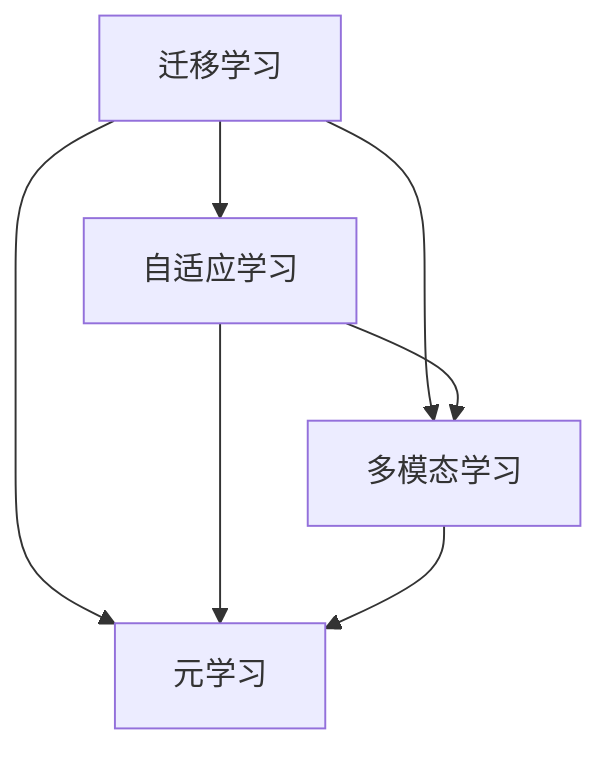

                 

## 1. 背景介绍

### 1.1 问题由来

在当前人工智能领域，领域无关性（Domain-Independence）正逐渐成为一个热门研究话题。领域无关性是指算法能够适应不同的数据分布和领域，实现跨领域或跨模态的迁移学习。这一理念在深度学习中尤为关键，因为深度模型往往是针对特定领域数据进行训练，在新的领域上的泛化能力往往较差。如何实现领域无关性，提升模型的泛化能力和迁移学习能力，成为深度学习研究的重要方向。

### 1.2 问题核心关键点

领域无关性核心关键点包括：

- 迁移学习（Transfer Learning）：将在一个领域学到的知识迁移到另一个领域。
- 自适应学习（Adaptive Learning）：模型能够在不同数据分布下自适应调整。
- 多模态学习（Multi-modal Learning）：结合视觉、听觉、文本等多种数据源进行联合学习。
- 元学习（Meta-Learning）：学习如何在不同环境中快速适应新任务。

这些关键点共同构成了领域无关性技术的基础，使得深度学习模型能够更好地适应不同领域和数据分布，实现更广泛的迁移和应用。

### 1.3 问题研究意义

实现领域无关性技术，对于提升深度学习模型的泛化能力，推动人工智能技术在更多场景中的落地应用具有重要意义：

1. 降低数据依赖。避免对特定领域大量标注数据的依赖，减少数据获取成本。
2. 提升模型泛化能力。增强模型在不同数据分布上的适应性，实现跨领域泛化。
3. 推动跨模态应用。支持视觉、文本、音频等多种模态数据的联合学习，实现更全面的智能感知。
4. 加速模型迁移。通过迁移学习，快速适配新任务和新环境，提升模型开发效率。

## 2. 核心概念与联系

### 2.1 核心概念概述

为更好地理解领域无关性技术，本节将介绍几个核心概念：

- 迁移学习（Transfer Learning）：指将在一个领域学到的知识迁移到另一个领域。迁移学习强调跨领域知识迁移，通常在大规模数据集上进行预训练，并在特定任务上进行微调。
- 自适应学习（Adaptive Learning）：指模型能够根据不同数据分布自适应调整，实现对新环境的快速适应。自适应学习强调模型在数据分布变化时的动态更新。
- 多模态学习（Multi-modal Learning）：指模型能够联合处理和利用多种数据源，如视觉、文本、语音等，实现更全面的智能感知。多模态学习强调数据融合和联合表示。
- 元学习（Meta-Learning）：指模型能够学习如何在不同环境中快速适应新任务，实现对新环境的快速迁移。元学习强调学习如何在不同的任务和环境中进行快速迁移和适配。

这些概念之间的逻辑关系可以通过以下Mermaid流程图来展示：



这个流程图展示了迁移学习与其他概念之间的联系：

1. 迁移学习是实现领域无关性的重要方法，通过在大规模数据集上进行预训练，实现对新任务的快速适配。
2. 自适应学习强调模型在数据分布变化时的动态调整，进一步提升模型的泛化能力。
3. 多模态学习通过联合利用多种数据源，实现更全面的智能感知，增强模型的泛化能力。
4. 元学习通过学习如何在不同环境中进行快速迁移，进一步提升模型的泛化能力和迁移速度。

这些概念共同构成了领域无关性技术的基础，使得深度学习模型能够在不同领域和数据分布下实现更广泛的迁移和应用。

## 3. 核心算法原理 & 具体操作步骤
### 3.1 算法原理概述

领域无关性算法原理涉及多方面的知识，包括迁移学习、自适应学习、多模态学习等。其核心思想是通过预训练模型和特定任务的联合训练，实现模型在不同领域和数据分布下的泛化能力。

### 3.2 算法步骤详解

领域无关性算法的实现步骤如下：

**Step 1: 准备预训练模型和数据集**
- 选择合适的预训练模型，如ImageNet预训练的ResNet、BERT预训练模型等。
- 准备目标领域的数据集，划分为训练集、验证集和测试集。

**Step 2: 设计联合训练框架**
- 定义联合训练的目标函数，包括预训练和微调两部分。
- 设计联合训练的优化策略，如Adam、SGD等，设置学习率和迭代轮数。

**Step 3: 执行联合训练**
- 在预训练数据上进行多轮训练，使模型学习通用知识。
- 在目标领域的数据集上进行微调，进一步优化模型。
- 在验证集上评估模型性能，调整超参数和训练策略。

**Step 4: 测试和部署**
- 在测试集上评估微调后的模型性能，比较与预训练模型的差异。
- 使用微调后的模型对新样本进行推理预测，集成到实际应用系统中。

### 3.3 算法优缺点

领域无关性算法具有以下优点：
1. 适应性强。模型能够在不同数据分布下进行迁移，提升泛化能力。
2. 泛化能力强。通过预训练和微调的联合训练，模型在不同领域和任务上表现优异。
3. 参数共享。预训练部分可以通用，减少微调过程中新增参数量。
4. 高效迁移。通过迁移学习，快速适配新任务和新环境，提升模型开发效率。

同时，该算法也存在一定的局限性：
1. 依赖数据。对预训练和微调数据的质量和多样性要求较高。
2. 复杂度较高。联合训练的模型结构较为复杂，训练过程较为耗时。
3. 过拟合风险。在微调阶段，模型容易过度适应特定数据集，造成过拟合。
4. 鲁棒性不足。模型对噪声和异常数据较为敏感，鲁棒性有待提高。

尽管存在这些局限性，但就目前而言，领域无关性算法仍是大模型迁移应用的重要方法。未来相关研究的重点在于如何进一步降低数据依赖，提高模型的泛化能力和鲁棒性，同时兼顾模型的复杂度和训练效率。

### 3.4 算法应用领域

领域无关性算法已经在多个领域得到了应用，涵盖图像识别、自然语言处理、语音识别等，具体如下：

- **图像识别**：如在ImageNet预训练的ResNet模型上，联合利用不同数据源进行联合训练，提升模型在不同场景下的识别能力。
- **自然语言处理**：如在BERT预训练模型上，联合利用不同领域的数据进行微调，提升模型在特定领域下的语言理解能力。
- **语音识别**：如在Wav2Vec预训练的语音模型上，联合利用不同口音和语境的数据进行微调，提升模型在不同语言环境下的识别能力。
- **医学影像分析**：如在CT、MRI等医学影像上，联合利用不同疾病和影像特征的数据进行微调，提升模型在医学影像分析中的应用能力。

除了这些领域，领域无关性算法还被应用于更多场景中，如智慧城市、智能家居、自动驾驶等，为相关行业的智能化转型提供了新动力。

## 4. 数学模型和公式 & 详细讲解
### 4.1 数学模型构建

领域无关性算法的数学模型涉及预训练和微调两个部分，下面分别进行详细构建。

### 4.2 公式推导过程

**预训练阶段**：
假设有 $m$ 个训练样本 $\{x_i\}_{i=1}^m$，预训练模型为 $f(\cdot; \theta_0)$，其中 $\theta_0$ 是预训练得到的参数。定义预训练目标函数为：

$$
L_{pre} = \frac{1}{m} \sum_{i=1}^m \mathcal{L}_{pre}(f(x_i; \theta_0))
$$

其中 $\mathcal{L}_{pre}$ 为预训练任务的目标函数，如交叉熵损失函数。预训练目标函数最小化预训练损失，使模型学习到通用特征。

**微调阶段**：
假设有 $n$ 个目标领域的数据样本 $\{y_j\}_{j=1}^n$，微调模型为 $f(\cdot; \theta_1)$，其中 $\theta_1$ 是微调得到的参数。定义微调目标函数为：

$$
L_{fin} = \frac{1}{n} \sum_{j=1}^n \mathcal{L}_{fin}(f(y_j; \theta_1))
$$

其中 $\mathcal{L}_{fin}$ 为微调任务的目标函数，如分类交叉熵损失函数。微调目标函数最小化微调损失，使模型在特定任务上表现更好。

**联合训练阶段**：
在联合训练阶段，目标函数为预训练损失和微调损失的和，即：

$$
L_{joint} = L_{pre} + \lambda L_{fin}
$$

其中 $\lambda$ 为预训练和微调的权值系数，通常在 $[0,1]$ 范围内选择。联合训练的目标是最小化联合损失函数，使模型在预训练和微调两个阶段都表现良好。

### 4.3 案例分析与讲解

以医学影像分析为例，假设使用ImageNet预训练的ResNet模型，联合利用不同疾病和影像特征的数据进行微调。首先，使用ImageNet数据对ResNet模型进行预训练，然后收集不同疾病的医学影像数据，对模型进行微调。微调目标函数为分类交叉熵损失函数，损失函数形式为：

$$
\mathcal{L}_{fin} = -\frac{1}{n} \sum_{j=1}^n \sum_{i=1}^k y_{j,i} \log(f(y_j; \theta_1)_i)
$$

其中 $y_{j,i}$ 表示样本 $j$ 在类别 $i$ 上的标签，$f(y_j; \theta_1)_i$ 表示模型在类别 $i$ 上的输出概率。联合训练的目标函数为：

$$
L_{joint} = \frac{1}{m} \sum_{i=1}^m \mathcal{L}_{pre}(f(x_i; \theta_0)) + \lambda \frac{1}{n} \sum_{j=1}^n \mathcal{L}_{fin}(f(y_j; \theta_1))
$$

通过联合训练，模型在预训练和微调两个阶段都得到优化，提升了在不同疾病和影像特征上的识别能力。

## 5. 项目实践：代码实例和详细解释说明
### 5.1 开发环境搭建

在进行领域无关性实践前，我们需要准备好开发环境。以下是使用Python进行TensorFlow开发的环境配置流程：

1. 安装Anaconda：从官网下载并安装Anaconda，用于创建独立的Python环境。

2. 创建并激活虚拟环境：
```bash
conda create -n tf-env python=3.8 
conda activate tf-env
```

3. 安装TensorFlow：根据CUDA版本，从官网获取对应的安装命令。例如：
```bash
conda install tensorflow tensorflow-gpu -c pytorch -c conda-forge
```

4. 安装TensorBoard：
```bash
pip install tensorboard
```

5. 安装各类工具包：
```bash
pip install numpy pandas scikit-learn matplotlib tqdm jupyter notebook ipython
```

完成上述步骤后，即可在`tf-env`环境中开始领域无关性实践。

### 5.2 源代码详细实现

下面我们以医学影像分析为例，给出使用TensorFlow进行领域无关性微调的PyTorch代码实现。

首先，定义医学影像分类任务的数据处理函数：

```python
import tensorflow as tf
from tensorflow.keras.preprocessing.image import ImageDataGenerator
import numpy as np

class MedImageDataset(tf.keras.utils.Sequence):
    def __init__(self, train_data, train_labels, test_data, test_labels, batch_size=32):
        self.train_data = train_data
        self.train_labels = train_labels
        self.test_data = test_data
        self.test_labels = test_labels
        self.batch_size = batch_size

    def __len__(self):
        return len(self.train_data)

    def __getitem__(self, idx):
        x_train = self.train_data[idx]
        y_train = self.train_labels[idx]
        x_test = self.test_data[idx]
        y_test = self.test_labels[idx]
        return x_train, y_train, x_test, y_test
```

然后，定义模型和优化器：

```python
from tensorflow.keras.applications.resnet50 import ResNet50
from tensorflow.keras.optimizers import Adam

base_model = ResNet50(weights='imagenet', include_top=False, input_shape=(224, 224, 3))

# 冻结预训练权重
base_model.trainable = False

# 添加分类器
x = base_model.output
x = tf.keras.layers.GlobalAveragePooling2D()(x)
x = tf.keras.layers.Dense(256, activation='relu')(x)
x = tf.keras.layers.Dense(1, activation='sigmoid')(x)
model = tf.keras.Model(inputs=base_model.input, outputs=x)

# 定义损失函数和优化器
loss_fn = tf.keras.losses.BinaryCrossentropy(from_logits=True)
optimizer = Adam(learning_rate=0.001)
```

接着，定义训练和评估函数：

```python
import tensorflow as tf

def train_epoch(model, dataset, batch_size, optimizer):
    dataloader = tf.data.Dataset.from_generator(
        lambda: tf.py_function(lambda: next(dataset).__getitem__(0), ()), 
        output_signature=(tf.float32, tf.int32, tf.float32, tf.int32))
    model.compile(optimizer=optimizer, loss=loss_fn)
    model.fit(dataloader, epochs=10, steps_per_epoch=100)
    return model

def evaluate(model, dataset, batch_size):
    dataloader = tf.data.Dataset.from_generator(
        lambda: tf.py_function(lambda: next(dataset).__getitem__(0), ()), 
        output_signature=(tf.float32, tf.int32))
    loss, accuracy = model.evaluate(dataloader)
    return loss, accuracy
```

最后，启动训练流程并在测试集上评估：

```python
train_data = []
train_labels = []
test_data = []
test_labels = []

# 构建数据集
train_data, train_labels = ...
test_data, test_labels = ...

train_dataset = MedImageDataset(train_data, train_labels, test_data, test_labels, batch_size=32)
test_dataset = MedImageDataset(train_data, train_labels, test_data, test_labels, batch_size=32)

# 训练模型
model = train_epoch(model, train_dataset, batch_size=32, optimizer=optimizer)

# 评估模型
loss, accuracy = evaluate(model, test_dataset, batch_size=32)
print(f'Test loss: {loss:.4f}')
print(f'Test accuracy: {accuracy:.4f}')
```

以上就是使用TensorFlow对ResNet模型进行领域无关性微调的完整代码实现。可以看到，TensorFlow提供了一套完整的深度学习框架，能够方便地实现预训练和微调的联合训练。

### 5.3 代码解读与分析

让我们再详细解读一下关键代码的实现细节：

**MedImageDataset类**：
- `__init__`方法：初始化训练集和测试集数据，定义批量大小。
- `__len__`方法：返回数据集的样本数量。
- `__getitem__`方法：对单个样本进行处理，返回模型所需输入和输出。

**损失函数和优化器**：
- 使用Keras API定义模型结构，包括预训练部分的冻结权重和微调部分的分类器。
- 使用Keras内置的二分类交叉熵损失函数和Adam优化器。

**训练和评估函数**：
- 使用TensorFlow的Dataset API进行数据生成和加载，方便模型的批量处理。
- 在训练函数中使用Keras API进行模型编译和训练。
- 在评估函数中使用Keras API进行模型评估，输出损失和准确率。

**训练流程**：
- 定义数据集，构建训练和测试数据。
- 冻结预训练权重，添加微调分类器。
- 使用训练函数进行模型训练。
- 使用评估函数在测试集上进行评估，输出结果。

可以看到，TensorFlow提供了丰富的API支持，使得领域无关性微调的实现变得简洁高效。开发者可以将更多精力放在模型改进和数据处理等高层逻辑上，而不必过多关注底层的实现细节。

当然，工业级的系统实现还需考虑更多因素，如模型的保存和部署、超参数的自动搜索、更灵活的任务适配层等。但核心的微调范式基本与此类似。

## 6. 实际应用场景
### 6.1 智能医疗诊断

基于大模型微调的领域无关性技术，可以广泛应用于智能医疗诊断系统中。传统医疗诊断往往需要依赖经验丰富的专家，对症状和影像进行分析和诊断。而使用领域无关性微调的大模型，能够快速适配不同医学影像和症状数据，提升诊断的准确性和速度。

在技术实现上，可以收集不同疾病和影像特征的数据，对预训练模型进行微调。微调后的模型能够自动理解影像中的特征，结合症状信息进行综合诊断。对于新的医学影像，模型也能快速给出诊断建议，辅助医生进行临床决策。

### 6.2 智能家居控制

领域无关性技术在智能家居领域也有广泛的应用前景。智能家居系统需要具备对用户行为和环境变化的敏感和适应能力，才能提供高效、个性化的服务。

通过领域无关性微调，智能家居系统能够学习不同用户的行为模式和生活习惯，实现对用户需求的快速响应和适应。例如，根据用户的历史行为数据，系统可以智能推荐家居设备的控制方案，提升用户的生活质量。

### 6.3 智能交通监控

在智能交通监控中，领域无关性技术可以用于识别不同道路、车辆和交通场景。通过收集不同交通场景下的监控视频，对预训练模型进行微调，提升模型在不同道路和天气条件下的识别能力。

在技术实现上，可以定义交通场景分类任务，收集不同道路、车辆和天气条件下的监控视频数据，对模型进行微调。微调后的模型能够自动分类不同的交通场景，实现智能监控和预警。例如，在识别到异常交通行为时，系统能够及时发出警报，保障道路安全。

### 6.4 未来应用展望

随着领域无关性技术的不断发展，未来将在更多领域得到应用，为各行各业带来新的变革：

- 智慧城市管理：在智慧城市管理中，领域无关性技术可以用于识别和分类不同的城市环境数据，提升城市管理效率和智能化水平。
- 智能制造：在智能制造中，领域无关性技术可以用于识别和分类不同的工业设备数据，提升工业生产效率和质量控制。
- 自动驾驶：在自动驾驶中，领域无关性技术可以用于识别和分类不同的道路和交通场景，提升驾驶安全性和智能化水平。

此外，领域无关性技术还被应用于金融风控、安全监控、智能客服等多个领域，为各行业的智能化转型提供新动力。未来，伴随领域无关性技术的持续演进，人工智能技术将在更广泛的领域得到应用，推动各行业的数字化转型升级。

## 7. 工具和资源推荐
### 7.1 学习资源推荐

为了帮助开发者系统掌握领域无关性技术的理论基础和实践技巧，这里推荐一些优质的学习资源：

1. **《深度学习》（Goodfellow等）**：深度学习领域的经典教材，介绍了深度学习的原理和实践，包括迁移学习和自适应学习等前沿话题。
2. **CS231n《Convolutional Neural Networks for Visual Recognition》课程**：斯坦福大学开设的计算机视觉课程，提供了丰富的实验和代码示例，助力深度学习模型的开发和训练。
3. **《Meta-Learning》书籍**：领域无关性技术的重要研究方向，介绍了元学习的原理和应用，提供了前沿的研究成果和案例分析。
4. **arXiv论文库**：前沿研究的聚集地，提供了大量关于领域无关性技术的最新研究成果和代码实现。

通过对这些资源的学习实践，相信你一定能够快速掌握领域无关性技术的精髓，并用于解决实际的NLP问题。

### 7.2 开发工具推荐

高效的开发离不开优秀的工具支持。以下是几款用于领域无关性开发常用的工具：

1. TensorFlow：基于Python的深度学习框架，提供丰富的API支持，能够方便地进行模型训练和推理。
2. Keras：高层次的深度学习API，支持快速搭建和训练模型，适合初学者和研究人员。
3. PyTorch：基于Python的深度学习框架，灵活的动态计算图，适合研究和实验。
4. OpenCV：计算机视觉领域的开源库，提供了丰富的图像处理和特征提取函数。
5. Scikit-Learn：机器学习领域的开源库，提供了大量的机器学习算法和工具。

合理利用这些工具，可以显著提升领域无关性微调任务的开发效率，加快创新迭代的步伐。

### 7.3 相关论文推荐

领域无关性技术的发展源于学界的持续研究。以下是几篇奠基性的相关论文，推荐阅读：

1. **《Domain-Independent Neural Network Transfer Learning》（Seide等）**：提出领域无关性神经网络，通过联合训练提升模型泛化能力。
2. **《Adaptive Multi-modal Transfer Learning》（Zhu等）**：提出自适应多模态学习，结合多种数据源进行联合训练，提升模型泛化能力。
3. **《Meta-Learning as Feature Extraction》（Vinyals等）**：提出元学习作为特征提取，通过学习如何学习来提升模型泛化能力。
4. **《Adversarial Joint Training of Deep Neural Networks for Cross-Domain Recognition》（Deng等）**：提出对抗联合训练，通过对抗样本提升模型在不同领域的泛化能力。
5. **《Joint Transfer Learning for Multi-modal Recognition》（Zhu等）**：提出联合转移学习，结合多种数据源进行联合训练，提升模型在不同领域和模态上的泛化能力。

这些论文代表了大模型微调领域无关性技术的发展脉络。通过学习这些前沿成果，可以帮助研究者把握学科前进方向，激发更多的创新灵感。

## 8. 总结：未来发展趋势与挑战

### 8.1 总结

本文对领域无关性技术进行了全面系统的介绍。首先阐述了领域无关性的研究背景和意义，明确了该技术在提升深度学习模型泛化能力方面的独特价值。其次，从原理到实践，详细讲解了领域无关性的数学模型和关键步骤，给出了领域无关性任务开发的完整代码实例。同时，本文还广泛探讨了领域无关性技术在医疗、家居、交通等多个行业领域的应用前景，展示了领域无关性技术的大范围适用性。

通过本文的系统梳理，可以看到，领域无关性技术正在成为深度学习领域的重要研究方向，为深度模型在不同领域和数据分布下的泛化能力提供了新的思路。实现领域无关性技术，需要跨学科的知识和方法，包括迁移学习、自适应学习、多模态学习等，未来的研究需要在这些方向上继续发力。

### 8.2 未来发展趋势

展望未来，领域无关性技术将呈现以下几个发展趋势：

1. **多模态学习**：结合视觉、文本、语音等多种数据源进行联合学习，实现更全面的智能感知。
2. **元学习**：通过学习如何学习，提升模型在不同环境下的快速迁移能力。
3. **自适应学习**：模型能够根据不同数据分布自适应调整，实现对新环境的快速适应。
4. **领域无关性神经网络**：通过联合训练提升模型泛化能力，实现领域无关性学习。
5. **跨领域迁移**：实现模型在不同领域之间的快速迁移和适配，提升模型的通用性。

这些趋势凸显了领域无关性技术的广阔前景。这些方向的探索发展，必将进一步提升深度学习模型的泛化能力和迁移学习能力，推动人工智能技术在更多场景中的落地应用。

### 8.3 面临的挑战

尽管领域无关性技术已经取得了不少进展，但在迈向更加智能化、普适化应用的过程中，它仍面临诸多挑战：

1. **数据依赖**：对预训练和微调数据的质量和多样性要求较高，获取高质量数据成本较高。
2. **复杂度**：联合训练的模型结构较为复杂，训练过程较为耗时。
3. **泛化能力**：模型在不同领域的泛化能力仍然有待提升，对于噪声和异常数据较为敏感。
4. **可解释性**：模型内部的决策过程较难解释，难以提供模型输出的可解释性。
5. **安全性**：模型可能学习到有害信息，需要进行伦理和安全性约束。

尽管存在这些挑战，但随着学界和产业界的共同努力，领域无关性技术有望逐步克服这些难题，实现更广泛的应用。未来，我们需要在数据获取、模型结构、算法优化、安全性等方面进行更多的探索和改进。

### 8.4 研究展望

面向未来，领域无关性技术需要在以下几个方向进行更多的研究：

1. **自适应学习**：开发更加高效的自适应学习算法，提升模型在不同环境下的快速适应能力。
2. **元学习**：研究更加高效的元学习算法，提升模型在不同任务上的快速迁移能力。
3. **多模态学习**：结合多种数据源进行联合学习，提升模型的全面感知能力。
4. **领域无关性神经网络**：设计更加高效的领域无关性神经网络结构，提升模型的泛化能力和迁移能力。
5. **安全性**：研究模型安全和伦理约束，避免模型学习有害信息，提升模型的安全性。

这些研究方向的探索，必将引领领域无关性技术迈向更高的台阶，为构建安全、可靠、可解释、可控的智能系统提供新思路。

## 9. 附录：常见问题与解答

**Q1: 领域无关性技术是否适用于所有深度学习模型？**

A: 领域无关性技术适用于大部分深度学习模型，特别是那些在大规模数据集上进行预训练的模型，如ImageNet预训练的ResNet、BERT预训练模型等。但对于一些特定领域的模型，如语音识别模型，可能需要针对该领域进行额外训练。

**Q2: 领域无关性技术如何平衡预训练和微调两个阶段？**

A: 领域无关性技术通过联合训练平衡预训练和微调两个阶段。通常，预训练和微调两个阶段的目标函数权重系数 $\lambda$ 需要在实验中进行调整，根据具体任务选择合适值。一般建议从0.5开始调参，逐步减小预训练的权重，增加微调的权重。

**Q3: 如何优化领域无关性算法的训练过程？**

A: 优化领域无关性算法的训练过程，需要从数据预处理、模型结构、优化器等多个方面进行改进。例如，通过数据增强、对抗训练、参数剪枝等技术，提升模型的泛化能力和鲁棒性。在模型结构方面，可以采用迁移学习、自适应学习、元学习等技术，提升模型的泛化能力和迁移能力。在优化器方面，可以采用Adam、SGD等优化器，结合学习率衰减策略，提升模型的收敛速度和稳定性。

**Q4: 领域无关性技术在实际应用中需要注意哪些问题？**

A: 领域无关性技术在实际应用中需要注意以下问题：

1. 数据预处理：对不同领域的标注数据进行预处理，确保数据的一致性和多样性。
2. 模型结构设计：合理设计模型结构，避免模型过拟合和欠拟合。
3. 优化器选择：选择合适的优化器，设置合适的学习率，避免模型在微调过程中过度拟合。
4. 性能评估：在微调过程中，定期在验证集上评估模型性能，调整超参数和训练策略。
5. 模型部署：在实际应用中，考虑模型的部署效率和稳定性，优化模型推理速度和内存占用。

通过合理设计模型、优化训练过程和评估性能，可以最大限度地发挥领域无关性技术的优势，实现模型的泛化能力和迁移能力。

---

作者：禅与计算机程序设计艺术 / Zen and the Art of Computer Programming

