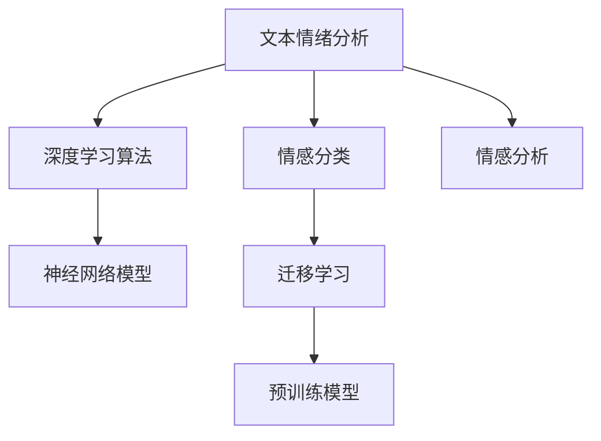

                 

# AI人工智能深度学习算法：在文本情绪分析中的应用

> 关键词：文本情绪分析,深度学习算法,情感分类,情感分析,深度神经网络

## 1. 背景介绍

### 1.1 问题由来
随着社交媒体和互联网技术的飞速发展，用户生成内容（User Generated Content, UGC）越来越多，文本情绪分析作为一种情感计算（Sentiment Analysis）技术，成为分析用户情绪、舆情走向的重要工具。在市场营销、产品研发、品牌管理、客户服务等多个领域，文本情绪分析应用广泛。例如，电商平台可以通过分析用户评论，了解产品反馈；企业可以通过分析社交媒体上的品牌提及，评估品牌形象；政府可以通过分析网络舆情，进行政策制定。因此，准确、高效地进行文本情绪分析，具有重要意义。

### 1.2 问题核心关键点
文本情绪分析的核心在于准确识别文本中的情绪极性，即文本是积极、消极还是中性。目前主流的方法包括基于词典的统计方法、基于规则的情感分类方法以及基于深度学习的情感分析方法。其中，基于深度学习的方法尤其是近年来发展迅速，以神经网络模型为基础的深度学习模型在文本情绪分类任务上取得了显著效果。

## 2. 核心概念与联系

### 2.1 核心概念概述

为更好地理解文本情绪分析中深度学习算法的应用，本节将介绍几个密切相关的核心概念：

- 文本情绪分析(Text Sentiment Analysis)：指使用自然语言处理技术，自动分析文本中的情感倾向，通常分为积极、消极和中性三类。
- 深度学习算法(Deep Learning)：利用多层神经网络进行复杂数据建模和预测的一种机器学习方法。
- 情感分类(Sentiment Classification)：指对文本中的情感极性进行分类。通常使用深度学习模型，将文本转化为向量表示，再输入到分类器中进行预测。
- 情感分析(Sentiment Analysis)：更广泛的概念，不仅包括情感分类，还包括情感强度、情感事件等分析。
- 神经网络模型(Neural Network Model)：深度学习中最常用的模型类型，如全连接神经网络、卷积神经网络(CNN)、循环神经网络(RNN)、长短时记忆网络(LSTM)等。
- 迁移学习(Transfer Learning)：指在已有模型的基础上，进行迁移学习，利用预训练模型的知识，提升新任务的性能。
- 预训练模型(Pre-trained Model)：通过大规模数据训练得到的模型，如BERT、GPT等，可以用于下游任务的微调。

这些核心概念之间的逻辑关系可以通过以下Mermaid流程图来展示：



这个流程图展示了一系列的文本情绪分析中的关键概念及其之间的关系：

1. 文本情绪分析通过自然语言处理技术，自动识别文本中的情感。
2. 深度学习算法利用多层神经网络进行复杂建模和预测。
3. 情感分类是文本情绪分析的一个子任务，使用深度学习模型进行分类。
4. 迁移学习指在已有模型基础上进行微调，提升新任务性能。
5. 预训练模型指通过大规模数据训练得到的模型，如BERT、GPT等。
6. 情感分析是文本情绪分析的更广泛概念，包括情感分类、情感强度、情感事件等。

这些概念共同构成了文本情绪分析的逻辑框架，为深度学习算法在文本情绪分析中的应用提供了理论基础。

## 3. 核心算法原理 & 具体操作步骤
### 3.1 算法原理概述

文本情绪分析的核心是构建一个高效的情感分类模型，利用深度学习算法对文本进行情感极性分类。基于深度学习的情感分类模型通常分为两种：基于卷积神经网络（CNN）和基于循环神经网络（RNN）或长短时记忆网络（LSTM）的模型。

卷积神经网络（CNN）主要用于文本的卷积特征提取，RNN/LSTM主要用于序列数据的建模。CNN在文本分类任务上表现优异，但由于其难以处理序列数据，因此不太适用于长文本的情感分析。而RNN/LSTM模型能够很好地处理序列数据，但存在梯度消失和计算复杂度高的问题。因此，通常使用混合模型（Hybrid Model），将CNN与RNN/LSTM结合起来，既保留CNN的局部特征提取能力，又具备RNN/LSTM的序列建模能力。

### 3.2 算法步骤详解

文本情绪分析的深度学习模型通常包括以下关键步骤：

**Step 1: 准备数据集**
- 收集标注好的情感数据集，如IMDb电影评论、Amazon产品评论等。
- 对数据集进行预处理，如去除停用词、标点符号等，统一文本格式。

**Step 2: 构建模型架构**
- 选择合适的神经网络模型架构，如卷积神经网络（CNN）、长短时记忆网络（LSTM）等。
- 设计输入层、隐藏层和输出层，确定各层的参数大小和激活函数。
- 定义损失函数和优化器，如交叉熵损失函数和Adam优化器。

**Step 3: 数据编码**
- 对文本进行编码，将文本转化为神经网络能够处理的数值表示。
- 常用的文本编码方式包括词嵌入（Word Embedding）和词袋模型（Bag of Words）。
- 使用预训练词嵌入，如GloVe、Word2Vec等，或者使用深度学习模型自动学习词嵌入。

**Step 4: 模型训练**
- 使用训练数据对模型进行前向传播和反向传播，不断调整模型参数。
- 在验证集上评估模型性能，防止过拟合。
- 选择合适的学习率、批量大小和训练轮数。

**Step 5: 模型评估**
- 使用测试数据对模型进行评估，计算准确率、召回率和F1值等指标。
- 对比不同模型性能，选择最优模型。

**Step 6: 模型应用**
- 将训练好的模型应用到新的文本数据上，进行情感极性分类。
- 提供API接口或集成到应用系统中，供其他系统调用。

### 3.3 算法优缺点

基于深度学习的文本情绪分析模型具有以下优点：

1. 准确性高：深度学习模型可以自动提取文本中的高层次特征，提高分类的准确性。
2. 自适应强：通过大量的标注数据进行训练，模型可以适应不同的文本风格和情感表达方式。
3. 泛化能力强：深度学习模型具有很强的泛化能力，可以在未见过的文本上进行情感分类。
4. 适应性强：深度学习模型可以适应不同的应用场景，如电影评论、产品评论、社交媒体等。

同时，该方法也存在一定的局限性：

1. 数据依赖性高：深度学习模型依赖大量的标注数据，数据获取和标注成本较高。
2. 计算资源消耗大：深度学习模型通常需要大规模的计算资源进行训练和推理。
3. 模型复杂度高：深度学习模型结构复杂，难以解释模型的内部机制。
4. 过度拟合风险：深度学习模型容易发生过拟合，需要采取正则化等技术进行缓解。
5. 模型鲁棒性差：深度学习模型对于噪声和干扰敏感，可能影响模型的鲁棒性。

尽管存在这些局限性，但深度学习模型在文本情绪分析中表现优异，成为当前最流行的解决方案之一。

### 3.4 算法应用领域

基于深度学习的文本情绪分析模型在多个领域得到了广泛应用，如：

- 市场营销：分析客户反馈，了解产品满意度。
- 品牌管理：监测社交媒体上品牌提及，评估品牌形象。
- 客户服务：分析客户投诉和建议，改进服务质量。
- 舆情分析：分析社交媒体上的舆情走向，进行政策制定。
- 内容推荐：分析用户评价，推荐相关产品或内容。

除了这些经典应用外，深度学习模型还在新闻监测、情感预测、社交网络分析等多个领域发挥重要作用。

## 4. 数学模型和公式 & 详细讲解
### 4.1 数学模型构建

文本情绪分析的深度学习模型通常采用卷积神经网络（CNN）或长短时记忆网络（LSTM）进行构建。这里以LSTM模型为例，介绍文本情绪分析的数学模型构建过程。

假设输入文本为 $x_1, x_2, \cdots, x_n$，其中 $x_i$ 为第 $i$ 个单词的词嵌入表示。LSTM模型的基本结构包括输入层、多个LSTM层和输出层。其中，输入层将输入文本映射为词嵌入矩阵 $\mathbf{X} \in \mathbb{R}^{n \times d}$，每个词嵌入表示为 $\mathbf{h}_1, \mathbf{h}_2, \cdots, \mathbf{h}_n \in \mathbb{R}^h$。

LSTM模型的前向传播过程如下：

1. 输入层将输入文本映射为词嵌入矩阵 $\mathbf{X} \in \mathbb{R}^{n \times d}$，每个词嵌入表示为 $\mathbf{h}_1, \mathbf{h}_2, \cdots, \mathbf{h}_n \in \mathbb{R}^h$。
2. 第一个LSTM层计算当前时刻的隐状态 $\mathbf{h}_1 = \mathbf{W}_h \mathbf{x}_1 + \mathbf{b}_h$，其中 $\mathbf{W}_h \in \mathbb{R}^{h \times d}$ 为权重矩阵，$\mathbf{b}_h \in \mathbb{R}^h$ 为偏置向量。
3. 每个LSTM层都包含遗忘门（Forget Gate）、输入门（Input Gate）和输出门（Output Gate），用于更新隐状态。

LSTM层的状态更新公式为：

$$
\begin{aligned}
f_t &= \sigma(\mathbf{W}_f \mathbf{h}_{t-1} + \mathbf{b}_f) \\
i_t &= \sigma(\mathbf{W}_i \mathbf{h}_{t-1} + \mathbf{b}_i) \\
o_t &= \sigma(\mathbf{W}_o \mathbf{h}_{t-1} + \mathbf{b}_o) \\
g_t &= \tanh(\mathbf{W}_g \mathbf{h}_{t-1} + \mathbf{b}_g) \\
\mathbf{h}_t &= f_t \odot \mathbf{h}_{t-1} + i_t \odot g_t \odot o_t
\end{aligned}
$$

其中，$\sigma$ 为 sigmoid 激活函数，$\tanh$ 为 tanh 激活函数，$\odot$ 为逐元素乘法。

最终，LSTM模型输出的隐状态 $\mathbf{h}_n$ 将作为情感分类器的输入。

### 4.2 公式推导过程

以LSTM模型为例，文本情绪分析的数学模型推导如下：

1. 输入层将输入文本映射为词嵌入矩阵 $\mathbf{X} \in \mathbb{R}^{n \times d}$，每个词嵌入表示为 $\mathbf{h}_1, \mathbf{h}_2, \cdots, \mathbf{h}_n \in \mathbb{R}^h$。

2. 第一个LSTM层计算当前时刻的隐状态 $\mathbf{h}_1 = \mathbf{W}_h \mathbf{x}_1 + \mathbf{b}_h$，其中 $\mathbf{W}_h \in \mathbb{R}^{h \times d}$ 为权重矩阵，$\mathbf{b}_h \in \mathbb{R}^h$ 为偏置向量。

3. 每个LSTM层都包含遗忘门（Forget Gate）、输入门（Input Gate）和输出门（Output Gate），用于更新隐状态。

4. 根据上述公式，计算LSTM模型输出的隐状态 $\mathbf{h}_n$。

5. 情感分类器将LSTM模型的输出隐状态 $\mathbf{h}_n$ 作为输入，进行情感分类。

### 4.3 案例分析与讲解

以LSTM模型为例，文本情绪分析的案例分析如下：

假设有一个简单的电影评论数据集，包含若干条电影评论和对应的情感极性标签（1表示正面，0表示中性，-1表示负面）。使用LSTM模型对评论进行情感分类。

1. 收集标注好的电影评论数据集，并对数据进行预处理，去除停用词和标点符号，统一文本格式。

2. 使用预训练的词嵌入模型，如GloVe或Word2Vec，将每个评论映射为词嵌入表示。

3. 设计LSTM模型架构，包括输入层、多个LSTM层和输出层。

4. 使用训练数据对LSTM模型进行前向传播和反向传播，不断调整模型参数。

5. 在验证集上评估模型性能，防止过拟合。

6. 使用测试数据对模型进行评估，计算准确率、召回率和F1值等指标。

7. 根据评估结果，优化模型参数和结构，进一步提高模型性能。

8. 将训练好的模型应用到新的电影评论数据上，进行情感分类。

## 5. 项目实践：代码实例和详细解释说明
### 5.1 开发环境搭建

在进行文本情绪分析的项目实践前，我们需要准备好开发环境。以下是使用Python进行Keras开发的环境配置流程：

1. 安装Anaconda：从官网下载并安装Anaconda，用于创建独立的Python环境。

2. 创建并激活虚拟环境：
```bash
conda create -n keras-env python=3.8 
conda activate keras-env
```

3. 安装Keras：
```bash
pip install keras
```

4. 安装TensorFlow和Keras后端：
```bash
pip install tensorflow==2.4
```

5. 安装各类工具包：
```bash
pip install numpy pandas scikit-learn matplotlib tqdm jupyter notebook ipython
```

完成上述步骤后，即可在`keras-env`环境中开始项目实践。

### 5.2 源代码详细实现

这里我们以情感分类为例，给出使用Keras实现LSTM模型的源代码实现。

```python
import numpy as np
import pandas as pd
from keras.models import Sequential
from keras.layers import Dense, LSTM, Embedding
from keras.preprocessing.text import Tokenizer
from keras.preprocessing.sequence import pad_sequences
from sklearn.model_selection import train_test_split

# 准备数据集
data = pd.read_csv('imdb_reviews.csv')
data['text'] = data['text'].apply(lambda x: x.lower())  # 转换为小写
data = data.dropna()  # 去除缺失值

# 数据预处理
tokenizer = Tokenizer(num_words=5000, lower=True)
tokenizer.fit_on_texts(data['text'])
sequences = tokenizer.texts_to_sequences(data['text'])
word_index = tokenizer.word_index

# 对文本进行填充，保证序列长度一致
max_len = 200
padded_sequences = pad_sequences(sequences, maxlen=max_len, padding='post', truncating='post')

# 划分训练集和测试集
X_train, X_test, y_train, y_test = train_test_split(padded_sequences, data['label'], test_size=0.2, random_state=42)

# 构建模型
model = Sequential()
model.add(Embedding(5000, 128, input_length=max_len))
model.add(LSTM(64))
model.add(Dense(1, activation='sigmoid'))

# 编译模型
model.compile(loss='binary_crossentropy', optimizer='adam', metrics=['accuracy'])

# 训练模型
model.fit(X_train, y_train, batch_size=64, epochs=10, validation_data=(X_test, y_test))

# 评估模型
scores = model.evaluate(X_test, y_test, verbose=0)
print("Accuracy: %.2f%%" % (scores[1]*100))
```

以上就是使用Keras实现LSTM模型进行情感分类的完整代码实现。可以看到，Keras提供了丰富的层和工具，使得模型构建和训练变得相对简单。

### 5.3 代码解读与分析

让我们再详细解读一下关键代码的实现细节：

**数据预处理**：
- 使用`Tokenizer`将文本转换为整数序列。
- 对文本进行填充，保证序列长度一致。
- 使用`train_test_split`将数据集划分为训练集和测试集。

**模型构建**：
- 使用`Sequential`定义模型顺序，包含嵌入层、LSTM层和输出层。
- 使用`Embedding`将整数序列转换为词嵌入矩阵。
- 使用`LSTM`进行序列建模。
- 使用`Dense`输出分类结果。

**模型编译和训练**：
- 使用`compile`方法定义模型损失函数、优化器和评估指标。
- 使用`fit`方法进行模型训练，并指定批量大小、训练轮数等超参数。
- 使用`evaluate`方法评估模型在测试集上的性能。

**模型应用**：
- 在新的文本数据上，进行情感分类。

## 6. 实际应用场景
### 6.1 社交媒体舆情分析

社交媒体是人们表达情感的重要平台，利用文本情绪分析技术，可以实时监测舆情动态，进行舆情预警。例如，对于突发事件，社交媒体上的舆情反应往往迅速，舆情分析可以帮助政府和企业及时了解公众情绪，采取有效应对措施。

在技术实现上，可以收集社交媒体上的评论、帖子等数据，使用LSTM等深度学习模型进行情感分类。对于负面舆情，可以实时进行预警，确保舆情不扩散。同时，可以利用情感分类结果，对舆情进行深度挖掘，分析舆论热点，提供决策支持。

### 6.2 客户服务情绪分析

客户服务是企业与用户互动的重要环节，利用文本情绪分析技术，可以实时监测用户的情绪状态，提升客户服务质量。例如，对于客户投诉，情感分类可以帮助企业快速识别客户情绪，提供针对性的解决方案，提高客户满意度。

在技术实现上，可以收集客户服务记录中的用户评论，使用LSTM等深度学习模型进行情感分类。对于负面情绪的评论，可以实时进行预警，并自动分配给相关部门处理。同时，可以利用情感分类结果，分析客户服务中的常见问题，优化服务流程，提高服务效率。

### 6.3 产品评价情绪分析

产品评价是用户对产品的主观反馈，利用文本情绪分析技术，可以了解用户对产品的满意度，指导产品研发和改进。例如，对于电商平台的商品评价，情感分类可以帮助企业了解用户对产品的情感倾向，优化产品设计和服务。

在技术实现上，可以收集电商平台上的用户评论，使用LSTM等深度学习模型进行情感分类。对于负面评价，可以及时进行反馈，改进产品质量。同时，可以利用情感分类结果，分析用户对产品的情感变化趋势，指导产品研发方向，提高产品竞争力。

### 6.4 未来应用展望

随着深度学习模型的不断发展，基于文本情绪分析的技术将得到更广泛的应用，为情感计算领域带来新的突破。

在智慧城市治理中，文本情绪分析可以用于实时监测市民情绪，进行舆情预警。例如，在重大事件发生时，通过社交媒体上的舆情分析，可以及时了解市民情绪，采取有效措施。

在医疗健康领域，文本情绪分析可以用于患者情绪监测，提升医疗服务质量。例如，在心理咨询中，可以通过分析患者描述的情绪状态，提供针对性的心理干预。

在教育领域，文本情绪分析可以用于学生情感监测，提升教育质量。例如，在在线教育中，可以通过分析学生的学习情绪，提供个性化的学习建议，提高学习效果。

## 7. 工具和资源推荐
### 7.1 学习资源推荐

为了帮助开发者系统掌握文本情绪分析的理论基础和实践技巧，这里推荐一些优质的学习资源：

1. 《Deep Learning with Python》书籍：由François Chollet著，详细介绍了深度学习在自然语言处理中的应用。

2. 《Neural Networks and Deep Learning》课程：由Michael Nielsen著，讲解了神经网络的基本原理和实现方法。

3. 《Sentiment Analysis with Deep Learning》博客系列：由Adam Coates等专家撰写，介绍了使用深度学习进行情感分析的方法。

4. Kaggle上的情感分析竞赛：Kaggle是一个数据科学竞赛平台，有许多情感分析相关的竞赛，可以学习其他参赛者的代码和经验。

5. TensorFlow官方文档：TensorFlow提供了丰富的API和教程，帮助你快速上手使用深度学习模型。

通过这些资源的学习实践，相信你一定能够快速掌握文本情绪分析的精髓，并用于解决实际的情感计算问题。
### 7.2 开发工具推荐

高效的开发离不开优秀的工具支持。以下是几款用于文本情绪分析开发的常用工具：

1. Keras：由François Chollet开发的深度学习框架，提供了丰富的API和工具，适合快速迭代研究。

2. PyTorch：由Facebook开发的深度学习框架，提供了灵活的动态计算图和丰富的模型库。

3. TensorFlow：由Google开发的深度学习框架，支持分布式计算和高效的模型部署。

4. Scikit-learn：用于数据预处理和模型评估的工具库，适合对数据集进行标准化、归一化等处理。

5. TensorBoard：TensorFlow配套的可视化工具，可以实时监测模型训练状态，提供丰富的图表。

6. Jupyter Notebook：在线Jupyter Notebook环境，方便编写和调试代码，并实时展示结果。

合理利用这些工具，可以显著提升文本情绪分析任务的开发效率，加快创新迭代的步伐。

### 7.3 相关论文推荐

文本情绪分析的研究始于20世纪90年代，近年来随着深度学习技术的发展，得到了快速推进。以下是几篇奠基性的相关论文，推荐阅读：

1. Sentiment Analysis with Recurrent Neural Networks：Rilrodx等提出的基于RNN的情感分析方法，使用LSTM模型对情感进行分类。

2. A Survey of Sentiment Analysis and Subjectivity Identification：由V.V. Lyu等总结的情感分析综述，介绍了常用的情感分析方法和评价指标。

3. Convolutional Neural Networks for Sentiment Analysis：由Kim提出的基于CNN的情感分析方法，使用卷积神经网络对情感进行分类。

4. Attention-Based Sentiment Analysis：由Nam等提出的基于注意力机制的情感分析方法，使用Transformer模型对情感进行分类。

5. Deep Sentiment Analysis on Movie Reviews with LSTM-CNN Hybrid Model：由Liu等提出的混合模型方法，使用LSTM和CNN的组合模型对情感进行分类。

这些论文代表了大语言模型微调技术的发展脉络。通过学习这些前沿成果，可以帮助研究者把握学科前进方向，激发更多的创新灵感。

## 8. 总结：未来发展趋势与挑战

### 8.1 总结

本文对基于深度学习的文本情绪分析方法进行了全面系统的介绍。首先阐述了文本情绪分析的研究背景和意义，明确了深度学习在情感分类中的核心地位。其次，从原理到实践，详细讲解了深度学习模型的构建和训练过程，给出了完整的代码实例。同时，本文还广泛探讨了文本情绪分析在多个领域的应用前景，展示了深度学习模型在情感计算领域的巨大潜力。

通过本文的系统梳理，可以看到，基于深度学习的文本情绪分析方法正在成为情感计算领域的重要范式，极大地拓展了情感分析的应用边界，催生了更多的落地场景。得益于大规模语料的预训练和深度学习模型的强泛化能力，深度学习模型在情感分类任务上表现优异，成为当前最流行的解决方案之一。未来，伴随深度学习模型的持续演进，文本情绪分析必将在更广阔的应用领域大放异彩，深刻影响人类的情感表达和认知智能。

### 8.2 未来发展趋势

展望未来，文本情绪分析的发展趋势将呈现以下几个方向：

1. 模型规模持续增大。随着算力成本的下降和数据规模的扩张，深度学习模型的参数量还将持续增长。超大模型的语言表征将更加丰富，情感分类性能将进一步提升。

2. 模型复杂度降低。未来将涌现更多高效、轻量级的情感分类模型，如Transformer-based模型，这些模型在保持高性能的同时，计算资源消耗也将大幅降低。

3. 任务多样化。除了情感分类，文本情绪分析将拓展到情感强度、情感事件等更复杂的任务，深度学习模型将更好地应用于多任务学习。

4. 多模态融合。未来的文本情绪分析将更多地融合多模态信息，如情感视频、语音、图像等，构建更加全面、准确的情绪模型。

5. 自动化。未来的文本情绪分析将更多地采用自动化方法，如预训练语言模型、迁移学习等，减少人工干预和标注成本。

6. 可解释性增强。深度学习模型在文本情绪分析中的应用将更加注重可解释性，开发更多可视化工具，解释模型的决策过程。

以上趋势凸显了文本情绪分析的发展前景，这些方向的探索发展，必将进一步提升情感计算技术的性能和应用范围，为人类情感表达和认知智能的进步提供有力支持。

### 8.3 面临的挑战

尽管文本情绪分析技术已经取得了显著进展，但在迈向更广泛应用的过程中，仍然面临诸多挑战：

1. 数据依赖性高。深度学习模型依赖大量的标注数据，数据获取和标注成本较高。如何降低数据依赖，提高模型鲁棒性，是一个重要研究方向。

2. 模型鲁棒性差。深度学习模型对于噪声和干扰敏感，可能影响模型的鲁棒性。如何提高模型的鲁棒性，增强抗干扰能力，是未来研究的重要课题。

3. 计算资源消耗大。深度学习模型通常需要大规模的计算资源进行训练和推理，如何优化计算资源使用，提高模型的计算效率，是一个重要挑战。

4. 可解释性不足。深度学习模型在情感分析中的应用往往难以解释其内部机制，如何增强模型的可解释性，提供透明的情感计算结果，是未来研究的方向。

5. 模型偏见问题。深度学习模型可能会学习到数据中的偏见，导致情感分析结果存在偏见。如何消除模型偏见，提升情感分析的公正性，是未来研究的重要任务。

6. 应用场景多样性。文本情绪分析在不同领域的应用场景各异，如何针对不同领域设计合适的情感分类模型，是一个重要挑战。

正视文本情绪分析面临的这些挑战，积极应对并寻求突破，将是大语言模型微调技术走向成熟的必由之路。相信随着学界和产业界的共同努力，这些挑战终将一一被克服，文本情绪分析技术必将在构建人机协同的智能系统、提升用户体验和决策支持等方面发挥更大的作用。

### 8.4 研究展望

面对文本情绪分析所面临的挑战，未来的研究需要在以下几个方面寻求新的突破：

1. 探索无监督和半监督学习。摆脱对大规模标注数据的依赖，利用自监督学习、主动学习等方法，最大限度利用非结构化数据，实现更加灵活高效的情感分类。

2. 研究轻量级情感分类模型。开发更加高效、轻量级的情感分类模型，在保持高性能的同时，计算资源消耗也将大幅降低。

3. 引入因果推理机制。将因果推理机制引入情感分类模型，增强模型的鲁棒性和可解释性，提供更加准确、合理的情感分类结果。

4. 融合多模态信息。将文本、图像、语音等多模态信息融合，构建更加全面、准确的情绪模型。

5. 开发自动化工具。开发更多自动化工具，如预训练语言模型、迁移学习等，减少人工干预和标注成本，提高情感计算的效率和准确性。

6. 注重模型可解释性。开发更多可视化工具，解释模型的决策过程，增强模型的可解释性，提供透明的情感计算结果。

这些研究方向将进一步推动文本情绪分析技术的发展，提升情感计算的性能和应用范围，为人类情感表达和认知智能的进步提供有力支持。

## 9. 附录：常见问题与解答

**Q1：文本情绪分析是否适用于所有文本数据？**

A: 文本情绪分析对于大多数文本数据都是适用的，但需要注意以下几点：

1. 文本质量：情绪分析需要高质量的标注数据，如果标注数据质量不高，会影响模型的性能。

2. 文本长度：对于较长的文本，深度学习模型可能需要更长的训练时间，同时计算资源消耗也会增加。

3. 文本风格：不同的文本风格和语言习惯，可能需要对模型进行微调，才能达到最佳的分类效果。

4. 文本领域：对于特定领域的数据，可能需要针对该领域的数据进行预训练，才能更好地适应该领域的情感分类任务。

**Q2：深度学习模型在情感分类中是否存在过拟合风险？**

A: 深度学习模型在情感分类中确实存在过拟合风险，特别是在训练数据较少的情况下。为了避免过拟合，可以采取以下措施：

1. 数据增强：通过数据增强方法，如回译、近义词替换等，扩充训练集。

2. 正则化：使用L2正则、Dropout等正则化方法，防止模型过拟合。

3. 模型剪枝：在训练完成后，对模型进行剪枝，减少冗余参数，提高模型的泛化能力。

4. 集成学习：通过集成多个模型的预测结果，降低单个模型的过拟合风险。

5. 早期停止：在验证集上设置早停阈值，一旦验证集性能不再提升，立即停止训练，防止过拟合。

**Q3：如何选择合适的深度学习模型进行情感分类？**

A: 选择合适的深度学习模型进行情感分类，需要考虑以下几个方面：

1. 数据规模：对于大规模的数据集，可以使用RNN、LSTM等模型进行序列建模。

2. 文本长度：对于较长的文本，可以使用CNN、RNN等模型进行特征提取和建模。

3. 任务复杂度：对于复杂的情感分类任务，可以使用Transformer-based模型，如BERT、GPT等。

4. 计算资源：对于计算资源有限的场景，可以选择轻量级的模型，如Keras等框架实现的模型。

5. 可解释性：对于需要解释模型决策过程的场景，可以选择可解释性更高的模型，如简单的神经网络模型。

通过合理选择深度学习模型，可以有效提升情感分类的性能和可解释性。

**Q4：文本情绪分析在实际应用中需要注意哪些问题？**

A: 文本情绪分析在实际应用中需要注意以下问题：

1. 数据获取：收集高质量的标注数据，是情感分类的基础。需要考虑数据的来源、质量和数量，确保数据集的多样性和代表性。

2. 数据预处理：对文本进行预处理，去除停用词、标点符号等，统一文本格式。

3. 模型训练：选择合适的深度学习模型和超参数，进行模型的训练和优化。

4. 模型评估：使用测试集对模型进行评估，计算准确率、召回率和F1值等指标，评估模型的性能。

5. 模型应用：将训练好的模型应用到新的文本数据上，进行情感分类。

6. 模型部署：将模型部署到实际应用中，提供API接口或集成到应用系统中。

7. 模型更新：定期更新模型，以适应新的数据和应用场景。

通过全面考虑这些问题，可以有效提升文本情绪分析的应用效果。

**Q5：文本情绪分析是否适用于不同语言的文本？**

A: 文本情绪分析在理论上适用于不同语言的文本，但需要注意以下几点：

1. 语言差异：不同语言的语言习惯、情感表达方式不同，需要对模型进行适应性调整。

2. 语言数据：需要收集对应语言的标注数据，进行模型的训练和优化。

3. 翻译工具：对于不同语言的文本，需要使用翻译工具将其转换为目标语言，才能进行情感分类。

4. 多语言模型：可以使用多语言模型，如BERT-multilingual等，直接进行多语言的情感分类。

通过合理处理语言差异，可以有效提升文本情绪分析在不同语言场景下的应用效果。

---

作者：禅与计算机程序设计艺术 / Zen and the Art of Computer Programming

