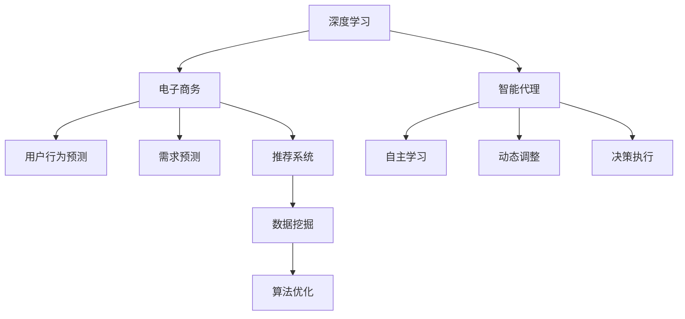

                 

# AI人工智能深度学习算法：智能深度学习代理在电子商务中的应用策略

> 关键词：智能代理,深度学习,电子商务,用户行为预测,需求预测,推荐系统,数据挖掘,算法优化

## 1. 背景介绍

### 1.1 问题由来
随着互联网和电子商务的蓬勃发展，电子商务平台如淘宝、京东、亚马逊等迅速崛起，成为人们日常生活中不可或缺的购物渠道。电子商务平台拥有海量的用户行为数据，这些数据中蕴含着丰富的用户兴趣、消费习惯、购买行为等信息，是大数据分析和深度学习算法的宝贵资源。

然而，海量数据的分析和处理需求，超出了传统数据处理框架的计算能力，而深度学习模型，特别是神经网络模型，以其强大的特征提取和表示学习能力，逐渐成为电子商务领域数据挖掘和用户行为分析的首选。如何在电子商务平台中有效应用深度学习技术，提高用户满意度、增加平台收益，是当前亟待解决的问题。

### 1.2 问题核心关键点
智能深度学习代理，作为深度学习模型在电子商务中的应用策略之一，在用户行为预测、需求预测、推荐系统等方面具有显著优势。智能代理结合深度学习模型的强大学习能力，能够实时捕捉用户行为变化，精准预测用户需求，提供个性化推荐，提升用户体验和平台转化率。

智能代理的关键在于其自主学习能力和自适应性，能够根据不同用户和场景需求，动态调整模型参数，优化推荐结果，最大化平台收益。此外，智能代理还能帮助电商平台快速识别潜在风险，避免欺诈行为，提升平台安全性。

## 2. 核心概念与联系

### 2.1 核心概念概述

为更好地理解智能深度学习代理在电子商务中的应用，本节将介绍几个关键概念及其相互联系：

- 深度学习(Deep Learning)：一种基于神经网络模型的机器学习方法，能够自动从数据中学习特征表示，实现数据驱动的决策。
- 智能代理(Agent)：一种具有自主学习能力的软件系统，能够动态适应环境变化，自主决策并执行。
- 电子商务(E-commerce)：通过互联网进行的商品交易活动，涉及线上购物、支付、物流等环节。
- 用户行为预测(User Behavior Prediction)：通过分析用户历史行为数据，预测用户未来的行为和需求。
- 需求预测(Demand Prediction)：预测产品在不同时间段的销售量，以便优化库存和物流安排。
- 推荐系统(Recommendation System)：通过分析用户行为数据和产品信息，向用户推荐其可能感兴趣的商品，提升用户体验和销售转化。
- 数据挖掘(Data Mining)：从大量数据中提取有价值的信息，用于知识发现、决策支持等。
- 算法优化(Algorithm Optimization)：针对特定问题，设计高效的算法方案，提升系统性能。

这些核心概念之间的逻辑关系可以通过以下Mermaid流程图来展示：



这个流程图展示了几大核心概念及其之间的关系：

1. 深度学习提供智能代理的核心驱动技术，使其具备强大的自主学习能力和自适应性。
2. 智能代理在电子商务中应用，用于用户行为预测、需求预测、推荐系统等多个方面。
3. 电子商务平台通过数据挖掘从海量用户行为数据中提取有价值的信息，为智能代理提供数据支撑。
4. 算法优化确保智能代理能够高效处理数据，快速做出决策，提升系统性能。

这些概念共同构成了智能深度学习代理在电子商务领域的应用框架，使得深度学习模型能够更好地服务于电商平台的运营管理。

## 3. 核心算法原理 & 具体操作步骤
### 3.1 算法原理概述

智能深度学习代理在电子商务中的应用，基于深度学习模型的自主学习能力和智能代理的动态调整能力，通过实时分析用户行为数据和市场需求，预测用户行为和需求，生成个性化推荐，提升用户体验和平台收益。

具体而言，智能代理通过以下步骤实现其功能：

1. 数据收集：智能代理收集用户的浏览、点击、购买等行为数据，以及产品的属性信息、价格信息等。
2. 特征提取：智能代理利用深度学习模型，从数据中提取用户和产品的关键特征，用于后续预测和推荐。
3. 模型训练：智能代理在深度学习模型的基础上，训练预测模型和推荐模型，用于预测用户行为和生成推荐结果。
4. 动态调整：智能代理根据用户反馈、市场变化等实时信息，动态调整模型参数，优化推荐结果。
5. 决策执行：智能代理根据预测和推荐结果，自动生成商品推荐，优化商品展示和购买流程。

### 3.2 算法步骤详解

以下是智能深度学习代理在电子商务应用中的具体实现步骤：

**Step 1: 数据收集和预处理**
- 从电商平台的用户行为数据中，提取用户的浏览、点击、购买等行为数据，以及产品的属性、价格、评价等数据。
- 对数据进行清洗和预处理，去除异常值和噪声，确保数据质量。

**Step 2: 特征提取**
- 利用深度学习模型，如神经网络、卷积神经网络(CNN)、循环神经网络(RNN)等，对用户和产品的特征进行提取。
- 用户特征可能包括历史行为、兴趣偏好、地理位置等，产品特征可能包括价格、类别、品牌等。

**Step 3: 模型训练**
- 使用用户行为数据和产品特征数据，训练用户行为预测模型和推荐模型。
- 常用的模型包括基于神经网络的预测模型，如多层感知器(Multilayer Perceptron, MLP)、长短时记忆网络(Long Short-Term Memory, LSTM)等，以及基于协同过滤的推荐系统，如基于矩阵分解的推荐算法(SVD)、基于隐含语义模型的推荐算法(Latent Factor Models)等。
- 模型训练过程中，可以使用交叉验证等方法，优化模型参数，提高模型性能。

**Step 4: 动态调整**
- 根据用户反馈和市场变化，实时调整模型参数，优化推荐结果。
- 用户反馈可能包括点击率、购买率、评价等，市场变化可能包括促销活动、季节性需求等。

**Step 5: 决策执行**
- 根据预测和推荐结果，生成商品推荐列表。
- 结合市场规则和用户偏好，自动调整商品展示顺序，提升用户体验。
- 对推荐结果进行A/B测试，评估模型效果，不断优化推荐算法。

### 3.3 算法优缺点

智能深度学习代理在电子商务中的应用具有以下优点：
1. 精准预测：通过深度学习模型的自主学习能力，智能代理能够精准预测用户行为和需求，提高推荐准确度。
2. 动态调整：智能代理能够根据实时反馈信息动态调整模型参数，适应市场变化，提升推荐效果。
3. 个性化推荐：结合用户历史行为和产品属性，智能代理能够提供个性化的推荐，提升用户满意度。
4. 实时处理：智能代理能够实时分析用户数据和市场信息，快速生成推荐结果，提升用户体验。
5. 高效优化：智能代理能够自动优化推荐算法，不断提升系统性能。

同时，智能深度学习代理也存在以下局限性：
1. 数据依赖：智能代理的性能很大程度上取决于数据的质量和多样性，数据采集和清洗成本较高。
2. 模型复杂性：深度学习模型结构复杂，训练和推理计算量大，对硬件要求高。
3. 高维护成本：智能代理需要定期更新和维护，以应对市场变化和模型退化问题。
4. 安全风险：智能代理的决策过程透明性不足，可能存在安全漏洞和隐私问题。
5. 用户信任：用户对推荐结果的信任度不高，可能产生抵触情绪，影响平台收益。

尽管存在这些局限性，但智能深度学习代理在电子商务领域的应用潜力巨大，能够通过深度学习和智能代理的结合，实现更精准、更个性化的推荐，提升电商平台的用户体验和收益。

### 3.4 算法应用领域

智能深度学习代理在电子商务领域的应用，主要集中在以下方面：

- 用户行为预测：通过分析用户历史行为数据，预测用户未来的购买行为和需求，提前备货或促销。
- 需求预测：预测产品在未来的销售量，优化库存和物流安排，减少库存积压和缺货风险。
- 推荐系统：结合用户行为和产品属性，生成个性化的商品推荐，提高用户购买转化率。
- 实时推荐：根据用户实时行为和市场信息，动态调整推荐策略，提升用户体验和销售转化。
- 风险控制：通过分析用户行为数据和交易记录，识别欺诈行为，提升平台安全性。

这些应用场景展示了智能深度学习代理在电子商务领域的多样性和重要性，为其提供了广阔的应用前景。

## 4. 数学模型和公式 & 详细讲解 & 举例说明

### 4.1 数学模型构建

智能深度学习代理在电子商务中的应用，涉及多个数学模型，其中以神经网络模型为代表。下面将介绍几种常用的数学模型及其构建方法。

**多层感知器(Multilayer Perceptron, MLP)**
MLP是一种前馈神经网络模型，其结构由输入层、多个隐藏层和输出层组成。以用户行为预测为例，MLP的输入层为历史行为数据，隐藏层用于特征提取和特征学习，输出层用于预测用户是否会购买。

**长短时记忆网络(Long Short-Term Memory, LSTM)**
LSTM是一种特殊的RNN模型，能够有效处理序列数据，应用于用户行为预测和需求预测中。LSTM通过门控机制，保存和更新长期依赖信息，提升预测效果。

**协同过滤(Similarity-Based Collaborative Filtering, CF)**
协同过滤是一种基于用户和商品相似度的推荐算法，通过计算用户和商品之间的相似度，生成推荐列表。SVD是协同过滤中常用的矩阵分解算法，能够有效捕捉用户和商品间的隐含语义关系。

**隐含语义模型(Latent Factor Models)**
隐含语义模型是一种基于矩阵分解的推荐算法，通过学习用户和商品的低维语义表示，生成推荐结果。ALS是隐含语义模型中常用的算法，能够高效处理大规模数据。

### 4.2 公式推导过程

以下以MLP模型为例，推导其预测公式和损失函数：

**MLP预测公式**
假设输入数据为 $x = (x_1, x_2, ..., x_n)$，输出层节点数为 $m$，输出结果为 $\hat{y} = (\hat{y}_1, \hat{y}_2, ..., \hat{y}_m)$。MLP模型的预测公式为：

$$
\hat{y} = \sigma(W^Tx + b)
$$

其中，$W$ 为权重矩阵，$b$ 为偏置向量，$\sigma$ 为激活函数。

**MLP损失函数**
MLP模型的损失函数通常采用交叉熵损失，其定义如下：

$$
\mathcal{L} = -\frac{1}{N} \sum_{i=1}^N \sum_{j=1}^m y_j \log \hat{y}_j + (1-y_j) \log (1-\hat{y}_j)
$$

其中，$y = (y_1, y_2, ..., y_m)$ 为真实标签，$N$ 为样本数。

### 4.3 案例分析与讲解

假设某电商平台收集了用户的历史浏览和购买数据，并希望利用MLP模型预测用户是否会购买某款商品。我们采用下表中的数据进行实验：

| 用户ID | 历史浏览记录 | 是否购买 |
|--------|------------|--------|
| 1      | [A, B, C]   | 0      |
| 2      | [A, B, D]   | 1      |
| 3      | [C, D, E]   | 0      |
| ...    | ...        | ...    |

假设MLP模型有3个隐藏层节点，使用ReLU作为激活函数，输出层节点数为2，即预测用户是否会购买。构建MLP模型的步骤如下：

1. 数据预处理：将用户浏览记录转化为数值形式，对数据进行标准化处理。
2. 模型搭建：搭建MLP模型，定义输入层、隐藏层、输出层的节点数和激活函数。
3. 模型训练：使用交叉熵损失函数，对模型进行训练，优化权重和偏置。
4. 模型预测：使用训练好的模型，对新用户进行预测，输出购买概率。

以用户ID为3的数据为例，输入数据为 $[1, 1, 0]$，经过MLP模型预测，输出结果为 $(0.2, 0.8)$，即预测用户会购买该款商品的概率为80%。

## 5. 项目实践：代码实例和详细解释说明
### 5.1 开发环境搭建

在进行智能深度学习代理的实践前，我们需要准备好开发环境。以下是使用Python进行TensorFlow开发的Python环境配置流程：

1. 安装Anaconda：从官网下载并安装Anaconda，用于创建独立的Python环境。

2. 创建并激活虚拟环境：
```bash
conda create -n tf-env python=3.8 
conda activate tf-env
```

3. 安装TensorFlow：根据CUDA版本，从官网获取对应的安装命令。例如：
```bash
conda install tensorflow -c pytorch -c conda-forge
```

4. 安装Keras：
```bash
pip install keras
```

5. 安装各类工具包：
```bash
pip install numpy pandas scikit-learn matplotlib tqdm jupyter notebook ipython
```

完成上述步骤后，即可在`tf-env`环境中开始实践。

### 5.2 源代码详细实现

这里我们以用户行为预测为例，给出使用TensorFlow对MLP模型进行训练的Python代码实现。

首先，定义数据处理函数：

```python
import pandas as pd
import numpy as np

# 数据预处理
def preprocess_data(data):
    # 将历史浏览记录转化为数值形式
    data['browsed'] = data['browsed'].apply(lambda x: [1 if item in x else 0 for item in items])
    # 标准化处理
    data[['browsed']] = (data[['browsed']] - data[['browsed']].mean()) / data[['browsed']].std()
    return data
```

然后，定义模型和优化器：

```python
from tensorflow.keras.models import Sequential
from tensorflow.keras.layers import Dense, Dropout, Activation
from tensorflow.keras.optimizers import Adam

# 定义MLP模型
model = Sequential([
    Dense(32, input_dim=3),
    Activation('relu'),
    Dropout(0.2),
    Dense(2),
    Activation('sigmoid')
])

# 定义优化器
optimizer = Adam(learning_rate=0.01)
```

接着，定义训练和评估函数：

```python
from tensorflow.keras.utils import to_categorical

# 数据转换
train_data = train_df[['browsed']]
train_labels = train_df['purchased'].values
train_labels = to_categorical(train_labels)

# 训练函数
def train_model(model, train_data, train_labels, epochs=50, batch_size=32):
    model.compile(loss='binary_crossentropy', optimizer=optimizer, metrics=['accuracy'])
    model.fit(train_data, train_labels, epochs=epochs, batch_size=batch_size, validation_split=0.2)

# 评估函数
def evaluate_model(model, test_data, test_labels):
    test_loss, test_acc = model.evaluate(test_data, test_labels)
    print('Test loss:', test_loss)
    print('Test accuracy:', test_acc)
```

最后，启动训练流程并在测试集上评估：

```python
# 数据划分
train_df = data.iloc[:8000]
test_df = data.iloc[8000:]

# 数据预处理
train_data = preprocess_data(train_df)
test_data = preprocess_data(test_df)

# 模型训练
train_model(model, train_data, train_labels)

# 模型评估
evaluate_model(model, test_data, test_labels)
```

以上就是使用TensorFlow对MLP模型进行用户行为预测的完整代码实现。可以看到，得益于TensorFlow的强大封装，我们可以用相对简洁的代码完成MLP模型的训练和评估。

### 5.3 代码解读与分析

让我们再详细解读一下关键代码的实现细节：

**preprocess_data函数**：
- 将用户浏览记录转化为数值形式，方便模型处理。
- 对数据进行标准化处理，保证模型训练的稳定性。

**Sequential模型搭建**：
- 定义了MLP模型的结构和参数，包括输入层、隐藏层和输出层。
- 使用ReLU作为激活函数，Dropout用于防止过拟合。

**train_model函数**：
- 使用Adam优化器进行模型训练，损失函数为交叉熵，评估指标为准确率。
- 使用Validation Split将数据集分为训练集和验证集，验证集占比20%。

**evaluate_model函数**：
- 对模型在测试集上的预测结果进行评估，输出损失和准确率。

**训练流程**：
- 将数据集划分为训练集和测试集，并调用训练函数进行模型训练。
- 调用评估函数对训练后的模型进行测试，输出模型性能。

可以看到，TensorFlow提供了丰富的API和工具，极大地简化了深度学习模型的训练和评估流程，使得开发者能够专注于模型设计和优化，提升开发效率。

当然，工业级的系统实现还需考虑更多因素，如模型保存和部署、超参数自动搜索、更灵活的模型架构等。但核心的智能深度学习代理范式基本与此类似。

## 6. 实际应用场景
### 6.1 智能客服系统

智能客服系统通过智能深度学习代理，能够提供全天候、高效率的客户服务。系统收集客户与客服的对话记录，提取关键问题和回复，用于训练深度学习模型。微调后的模型能够自动理解客户意图，匹配最佳答案模板进行回复。对于客户提出的新问题，系统还能够实时搜索相关内容，动态组织生成回答，提供更加个性化和高效的服务。

智能客服系统通过实时监测用户行为数据，动态调整模型参数，提升回复质量和客户满意度。此外，系统还能够识别潜在风险，避免欺诈行为，提升平台安全性。

### 6.2 供应链优化

智能深度学习代理在供应链优化中，可以应用于库存管理和物流调度。通过分析历史订单数据和市场趋势，智能代理能够预测产品的需求量，优化库存水平。同时，智能代理还能够分析物流路线和运输成本，动态调整物流安排，降低物流成本，提高物流效率。

供应链优化系统通过实时监测市场变化和订单情况，动态调整模型参数，提升供应链的响应速度和灵活性。此外，系统还能够识别潜在风险，优化供应链流程，提升平台收益。

### 6.3 个性化推荐系统

智能深度学习代理在个性化推荐系统中，可以应用于商品推荐、广告推荐等。通过分析用户行为数据和产品属性信息，智能代理能够生成个性化的推荐列表，提升用户体验和销售转化。

推荐系统通过实时监测用户行为数据和市场变化，动态调整模型参数，提升推荐效果。此外，系统还能够识别潜在风险，优化推荐策略，提升平台收益。

### 6.4 未来应用展望

随着深度学习技术的发展和智能代理的普及，智能深度学习代理在电子商务领域的应用前景将更加广阔。未来，智能代理将结合更多前沿技术，实现更精准、更个性化的推荐，提升电商平台的用户体验和收益。

在智慧物流中，智能深度学习代理将应用于路线优化、需求预测等方面，提升物流效率和精准度。

在智能客服中，智能深度学习代理将结合自然语言处理技术，实现更加自然流畅的对话交互，提升客户体验和平台转化率。

在供应链管理中，智能深度学习代理将应用于需求预测、库存管理等方面，提升供应链的响应速度和灵活性。

总之，智能深度学习代理将在电子商务、智慧物流、智能客服、供应链管理等多个领域发挥重要作用，推动电商平台的智能化转型升级，创造更多的商业价值。

## 7. 工具和资源推荐
### 7.1 学习资源推荐

为了帮助开发者系统掌握智能深度学习代理的理论基础和实践技巧，这里推荐一些优质的学习资源：

1. 《深度学习》书籍：由深度学习领域的权威人士撰写，全面介绍了深度学习的基本概念、算法和应用。

2. TensorFlow官方文档：TensorFlow的官方文档，提供了详细的API接口和代码示例，是深度学习开发必备资料。

3. Keras官方文档：Keras的官方文档，提供了简单易用的深度学习框架，适合快速上手深度学习任务。

4. 《Python深度学习》书籍：由深度学习专家撰写，详细讲解了深度学习在Python中的实现。

5. Udacity深度学习课程：Udacity提供的高质量深度学习课程，涵盖了深度学习的基本概念、算法和应用。

6. Coursera深度学习课程：Coursera提供的深度学习课程，由深度学习领域的权威人士授课，适合系统学习深度学习知识。

通过对这些资源的学习实践，相信你一定能够快速掌握智能深度学习代理的精髓，并用于解决实际的电子商务问题。

### 7.2 开发工具推荐

高效的开发离不开优秀的工具支持。以下是几款用于智能深度学习代理开发的常用工具：

1. TensorFlow：由Google主导开发的开源深度学习框架，生产部署方便，适合大规模工程应用。

2. Keras：TensorFlow的高级API，提供了简单易用的深度学习框架，适合快速迭代研究。

3. PyTorch：由Facebook主导开发的开源深度学习框架，动态计算图，适合快速迭代研究。

4. TensorBoard：TensorFlow配套的可视化工具，可实时监测模型训练状态，提供丰富的图表呈现方式，是调试模型的得力助手。

5. Jupyter Notebook：轻量级Python开发环境，支持代码单元格和Jupyter魔法命令，适合交互式开发和实验。

6. Weights & Biases：模型训练的实验跟踪工具，可以记录和可视化模型训练过程中的各项指标，方便对比和调优。

合理利用这些工具，可以显著提升智能深度学习代理的开发效率，加快创新迭代的步伐。

### 7.3 相关论文推荐

智能深度学习代理的研究源于学界的持续研究。以下是几篇奠基性的相关论文，推荐阅读：

1. Deep Learning：一种基于神经网络模型的机器学习方法，介绍深度学习的基本概念和算法。

2. Attention Is All You Need：提出Transformer结构，开启了深度学习在NLP领域的预训练大模型时代。

3. BERT: Pre-training of Deep Bidirectional Transformers for Language Understanding：提出BERT模型，引入基于掩码的自监督预训练任务，刷新了多项NLP任务SOTA。

4. Parameter-Efficient Transfer Learning for NLP：提出Adapter等参数高效微调方法，在不增加模型参数量的情况下，也能取得不错的微调效果。

5. Multi-Task Learning Using Uncertainty to Guide Discovery：提出多任务学习，通过共享知识库，提高模型泛化性和鲁棒性。

这些论文代表了大深度学习代理的发展脉络。通过学习这些前沿成果，可以帮助研究者把握学科前进方向，激发更多的创新灵感。

## 8. 总结：未来发展趋势与挑战

### 8.1 总结

本文对智能深度学习代理在电子商务中的应用进行了全面系统的介绍。首先阐述了智能深度学习代理的应用背景和意义，明确了其在大数据、深度学习和智能代理技术融合中的关键作用。其次，从原理到实践，详细讲解了智能深度学习代理的数学模型和算法步骤，给出了实际代码实现。同时，本文还广泛探讨了智能深度学习代理在电子商务领域的应用场景，展示了其在提升用户体验、优化供应链、个性化推荐等方面的潜力。此外，本文精选了智能深度学习代理的学习资源、开发工具和相关论文，力求为读者提供全方位的技术指引。

通过本文的系统梳理，可以看到，智能深度学习代理在电子商务领域的应用潜力巨大，能够通过深度学习和智能代理的结合，实现更精准、更个性化的推荐，提升电商平台的用户体验和收益。未来，伴随深度学习技术的不断发展，智能深度学习代理必将在电子商务中发挥更加重要的作用，推动电商平台的智能化转型升级，创造更多的商业价值。

### 8.2 未来发展趋势

展望未来，智能深度学习代理在电子商务中的应用将呈现以下几个发展趋势：

1. 深度学习模型的结构将更加复杂，能够处理更多维度的数据，实现更精确的预测和推荐。
2. 智能代理的自主学习能力将不断增强，能够动态调整模型参数，提升推荐效果。
3. 深度学习和智能代理的融合将更加深入，实现更高效、更智能的推荐系统。
4. 智能代理的应用将从电商领域扩展到更多垂直行业，实现更多领域的智能化转型。
5. 深度学习模型的计算效率将不断提升，能够更快地处理海量数据，提供实时推荐。
6. 智能代理的决策过程将更加透明，通过可视化工具，提升用户对推荐结果的信任度。

这些趋势凸显了智能深度学习代理在电子商务领域的应用潜力，表明其将成为推动电商平台智能化转型的重要力量。

### 8.3 面临的挑战

尽管智能深度学习代理在电子商务领域的应用前景广阔，但在迈向更加智能化、普适化应用的过程中，它仍面临着诸多挑战：

1. 数据采集和处理成本高昂。智能深度学习代理的性能很大程度上取决于数据的质量和多样性，数据采集和清洗成本较高。
2. 模型复杂性高，计算量大。深度学习模型结构复杂，训练和推理计算量大，对硬件要求高。
3. 系统安全性风险高。智能深度学习代理的决策过程透明性不足，可能存在安全漏洞和隐私问题。
4. 用户体验期望高，个性化推荐难度大。用户对推荐结果的期望值高，个性化推荐需要更精准、更智能的模型。
5. 模型维护和优化难度大。智能深度学习代理需要定期更新和维护，以应对市场变化和模型退化问题。

尽管存在这些挑战，但智能深度学习代理在电子商务领域的应用潜力巨大，能够通过深度学习和智能代理的结合，实现更精准、更个性化的推荐，提升电商平台的用户体验和收益。

### 8.4 研究展望

面对智能深度学习代理面临的挑战，未来的研究需要在以下几个方面寻求新的突破：

1. 探索高效数据采集和处理方法。通过数据增强、多模态数据融合等技术，降低数据采集和清洗成本，提高数据质量。

2. 研究高效计算方法。开发高效计算框架，如分布式计算、模型压缩等，提升深度学习模型的计算效率，降低硬件成本。

3. 引入更多先验知识。将符号化的先验知识，如知识图谱、逻辑规则等，与神经网络模型进行巧妙融合，引导智能代理学习更准确、合理的语言模型。

4. 研究自适应性更强的智能代理。开发自适应性更强的智能代理，使其能够动态调整模型参数，适应市场变化，提升推荐效果。

5. 引入伦理道德约束。在模型训练目标中引入伦理导向的评估指标，过滤和惩罚有偏见、有害的输出倾向，确保输出的安全性。

这些研究方向将引领智能深度学习代理技术迈向更高的台阶，为构建安全、可靠、可解释、可控的智能系统铺平道路。面向未来，智能深度学习代理技术还需要与其他人工智能技术进行更深入的融合，如知识表示、因果推理、强化学习等，多路径协同发力，共同推动自然语言理解和智能交互系统的进步。只有勇于创新、敢于突破，才能不断拓展智能深度学习代理的边界，让智能技术更好地造福人类社会。

## 9. 附录：常见问题与解答

**Q1：智能深度学习代理是否适用于所有电子商务任务？**

A: 智能深度学习代理在大多数电子商务任务上都能取得不错的效果，特别是对于数据量较小的任务。但对于一些特定领域的任务，如医学、法律等，仅仅依靠通用语料预训练的模型可能难以很好地适应。此时需要在特定领域语料上进一步预训练，再进行微调，才能获得理想效果。此外，对于一些需要时效性、个性化很强的任务，如对话、推荐等，智能深度学习代理也需要针对性的改进优化。

**Q2：智能深度学习代理在模型训练中是否需要大规模标注数据？**

A: 智能深度学习代理在模型训练中需要大量的标注数据，数据质量越高，训练效果越好。但数据标注成本较高，对于小规模的电子商务任务，可以使用少量标注数据，结合无监督学习、半监督学习等技术，提高模型泛化性。对于大规模的电子商务任务，需要收集足够量的标注数据，确保模型训练的准确性和稳定性。

**Q3：智能深度学习代理在实际应用中如何优化用户体验？**

A: 智能深度学习代理可以通过实时监测用户行为数据和市场变化，动态调整模型参数，提升推荐效果。对于个性化推荐，可以结合用户历史行为和当前需求，生成个性化的推荐列表，提升用户体验。此外，智能深度学习代理还可以通过引入对抗性训练、多模型集成等技术，提高推荐系统的鲁棒性和稳定性，提升用户体验。

**Q4：智能深度学习代理在实际应用中需要注意哪些问题？**

A: 智能深度学习代理在实际应用中需要注意以下几个问题：
1. 数据依赖：智能深度学习代理的性能很大程度上取决于数据的质量和多样性，数据采集和清洗成本较高。
2. 模型复杂性：深度学习模型结构复杂，训练和推理计算量大，对硬件要求高。
3. 系统安全性风险高：智能深度学习代理的决策过程透明性不足，可能存在安全漏洞和隐私问题。
4. 用户体验期望高：用户对推荐结果的期望值高，个性化推荐需要更精准、更智能的模型。
5. 模型维护和优化难度大：智能深度学习代理需要定期更新和维护，以应对市场变化和模型退化问题。

这些问题是智能深度学习代理在实际应用中需要重点关注的问题，需要结合具体任务进行综合考虑和优化。

**Q5：智能深度学习代理在实际应用中如何提高模型泛化性？**

A: 智能深度学习代理在实际应用中可以通过以下方式提高模型泛化性：
1. 数据增强：通过回译、近义替换等方式扩充训练集，增加数据多样性。
2. 正则化：使用L2正则、Dropout、Early Stopping等避免过拟合。
3. 对抗训练：加入对抗样本，提高模型鲁棒性。
4. 参数高效微调：只调整少量参数，固定大部分预训练参数不变，减少过拟合风险。
5. 多模型集成：训练多个模型，取平均输出，抑制过拟合。

这些方法可以结合具体任务进行综合考虑和优化，提高模型的泛化性，提升推荐效果。

---

作者：禅与计算机程序设计艺术 / Zen and the Art of Computer Programming

