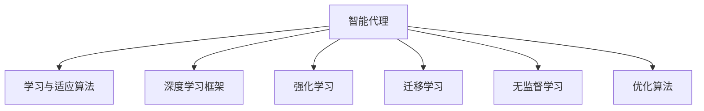

                 

# AI人工智能深度学习算法：智能深度学习代理的学习与适应的算法框架

> 关键词：智能深度学习代理,学习与适应算法,强化学习,模仿学习,无监督学习,迁移学习,优化算法

## 1. 背景介绍

### 1.1 问题由来
在人工智能领域，深度学习算法特别是深度神经网络（Deep Neural Networks, DNNs）的崛起，极大地推动了机器学习和智能系统的进步。然而，现有的深度学习模型往往需要大量标注数据进行训练，且对数据分布的变化较为敏感，无法很好地适应新环境。智能代理（Intelligent Agents）作为能够自主学习、适应新环境并作出决策的系统，在近年来逐渐成为研究的热点。智能代理通过与环境的交互，自动更新策略以最大化奖励函数，在未知或不确定环境中展现出较强的适应性。

本文聚焦于智能代理的学习与适应算法，旨在通过深度学习框架，探索如何使代理系统具备更强的自主学习能力，更好地适应多变的环境和任务。我们将围绕智能代理的训练和适应算法进行深入探讨，通过理论分析和实际案例，介绍智能代理在智能推荐系统、机器人控制、自动驾驶等领域的最新进展。

### 1.2 问题核心关键点
智能代理的核心在于通过一系列学习与适应算法，使代理系统能够自主学习、适应新环境并作出决策。其关键点包括：

- **学习与适应算法**：智能代理通过与环境的交互，自动更新策略以最大化奖励函数。
- **深度学习框架**：通过深度学习算法，智能代理能够从大量数据中提取特征，高效地进行学习。
- **多模态数据处理**：在处理多模态数据（如文本、图像、语音等）时，智能代理能够综合多种信息，做出更准确决策。
- **优化算法**：通过优化算法（如梯度下降、强化学习等），智能代理能够高效地调整模型参数，提升性能。
- **迁移学习与泛化能力**：智能代理能够将从一种环境中学到的知识迁移到另一种环境，提升泛化能力。

本文将从智能代理的学习与适应算法框架入手，深入分析其核心原理和实际应用，提供基于深度学习的智能代理系统开发指南。

## 2. 核心概念与联系

### 2.1 核心概念概述

为更好地理解智能代理的学习与适应算法，本节将介绍几个密切相关的核心概念：

- **智能代理**：能够自主学习、适应新环境并作出决策的系统。常用于推荐系统、机器人、自动驾驶等领域。
- **学习与适应算法**：通过与环境的交互，智能代理自动更新策略以最大化奖励函数。
- **深度学习框架**：使用深度学习算法，从大量数据中提取特征，高效地进行学习。
- **强化学习**：智能代理通过与环境的交互，通过试错来学习最优策略。
- **迁移学习**：将从一种环境中学到的知识迁移到另一种环境，提升泛化能力。
- **无监督学习**：通过未标注数据进行学习，无需监督信号，适用于数据标注成本高的情况。
- **优化算法**：如梯度下降、Adam等，用于调整模型参数以最小化损失函数。

这些核心概念之间的逻辑关系可以通过以下Mermaid流程图来展示：



这个流程图展示了一些核心概念及其之间的关系：

1. 智能代理通过学习与适应算法进行策略优化。
2. 深度学习框架为智能代理提供了强大的特征提取能力。
3. 强化学习使智能代理通过与环境的交互进行自主学习。
4. 迁移学习使智能代理能够将知识迁移到新的环境中。
5. 无监督学习利用未标注数据进行学习，减少对标注数据的依赖。
6. 优化算法用于调整模型参数，提高学习效率。

这些概念共同构成了智能代理的学习与适应框架，使其能够在各种复杂环境中高效地学习并作出决策。

## 3. 核心算法原理 & 具体操作步骤
### 3.1 算法原理概述

智能代理的学习与适应算法主要基于深度学习框架，通过与环境的交互，自动更新策略以最大化奖励函数。具体来说，智能代理通过以下步骤实现学习与适应：

1. **环境感知**：智能代理感知当前环境的状态，提取特征进行表示。
2. **策略选择**：根据当前状态选择策略，决定下一步动作。
3. **状态更新**：执行动作后，环境状态更新，智能代理进入下一轮循环。
4. **奖励反馈**：环境根据智能代理的行动提供奖励，评估策略性能。
5. **策略更新**：根据奖励反馈调整策略，优化性能。

形式化地，假设智能代理的状态空间为 $S$，动作空间为 $A$，奖励函数为 $R$。智能代理的目标是最大化累计奖励 $\sum_{t=0}^{T} R_t$。假设智能代理在时间 $t$ 选择动作 $a_t$，则智能代理的策略 $\pi$ 可以通过概率 $P(\pi(a_t|s_t))$ 描述，智能代理的学习目标为：

$$
\max_{\pi} \mathbb{E}_{s_t, a_t} \left[ \sum_{t=0}^{T} \gamma^t R_t \right]
$$

其中 $\gamma$ 为折扣因子。

### 3.2 算法步骤详解

智能代理的学习与适应算法主要包括以下几个关键步骤：

**Step 1: 环境建模与状态表示**

智能代理需要首先对环境进行建模，并根据环境特性选择合适的状态表示方法。例如，在智能推荐系统中，可以使用用户的历史行为、兴趣等信息作为状态表示；在机器人控制中，可以使用机器人当前位置、姿态等信息。

**Step 2: 特征提取与表示**

智能代理使用深度学习算法（如卷积神经网络CNN、循环神经网络RNN、变分自编码器VAE等）从环境数据中提取特征。例如，可以使用CNN从图像中提取特征，使用RNN从文本序列中提取特征。

**Step 3: 策略学习与优化**

智能代理通过强化学习等算法学习最优策略，并使用优化算法（如梯度下降、Adam等）调整模型参数。具体步骤如下：

1. 使用经验回放（Experience Replay）等方法收集智能代理与环境的交互数据。
2. 将数据输入深度学习模型进行特征提取和表示。
3. 计算智能代理在不同状态下的奖励和代价，更新策略。
4. 使用优化算法调整模型参数，最小化策略误差。

**Step 4: 策略评估与选择**

智能代理需要定期评估策略性能，选择最优策略进行下一步动作。常用的评估方法包括：

1. 交叉验证：在未见过的数据集上评估策略性能。
2. 模拟实验：使用模拟器或真实环境进行策略测试。
3. A/B测试：将策略在不同用户群体中进行对比，选择表现最佳的策略。

**Step 5: 策略更新与迭代**

智能代理通过不断的迭代更新策略，逐步提升性能。具体的迭代流程如下：

1. 初始化智能代理，随机选择一个策略。
2. 在环境中进行多轮交互，收集数据并计算奖励。
3. 根据奖励反馈更新策略，调整模型参数。
4. 重复上述步骤，直至达到预设的迭代次数或性能指标。

### 3.3 算法优缺点

智能代理的学习与适应算法具有以下优点：

- **自主学习能力强**：智能代理能够自主学习策略，无需人工干预。
- **泛化能力强**：通过迁移学习，智能代理能够将知识迁移到新环境，提升泛化能力。
- **适应性强**：智能代理能够适应环境变化，通过策略更新优化性能。
- **多模态数据处理**：智能代理能够处理多种类型的数据，提高决策的准确性。

同时，该算法也存在一定的局限性：

- **计算资源需求高**：深度学习模型的训练和优化需要大量计算资源。
- **数据标注成本高**：部分算法需要大量标注数据，数据标注成本较高。
- **策略更新复杂**：策略更新需要考虑环境的多样性和复杂性，可能存在策略不收敛的问题。
- **可解释性不足**：深度学习模型通常为"黑盒"系统，难以解释其内部工作机制。

尽管存在这些局限性，但智能代理的学习与适应算法仍是大数据驱动的智能系统的重要范式。未来相关研究的重点在于如何进一步降低计算资源需求，提高泛化能力和适应性，同时兼顾可解释性和伦理安全性等因素。

### 3.4 算法应用领域

智能代理的学习与适应算法在多个领域得到了广泛的应用，包括：

- 智能推荐系统：通过分析用户行为和兴趣，推荐个性化产品。
- 机器人控制：通过感知环境和用户输入，使机器人自主执行复杂任务。
- 自动驾驶：通过环境感知和决策优化，实现车辆自主驾驶。
- 金融交易：通过市场数据分析和策略优化，实现智能交易。
- 智能游戏：通过环境模拟和策略优化，实现自主游戏。
- 供应链管理：通过优化生产和物流策略，提升供应链效率。
- 医疗诊断：通过分析病人数据和历史病例，提供个性化诊断和治疗建议。

除了上述这些经典应用外，智能代理的学习与适应算法还在更多领域得到创新性应用，如能源管理、智能家居、社交网络分析等，为智能系统的应用带来了新的突破。随着深度学习模型和算法的发展，智能代理的应用前景将更加广阔。

## 4. 数学模型和公式 & 详细讲解 & 举例说明

### 4.1 数学模型构建

本节将使用数学语言对智能代理的学习与适应算法进行更加严格的刻画。

假设智能代理在状态空间 $S$ 中，通过动作 $a_t$ 进入下一个状态 $s_{t+1}$，并根据奖励函数 $R(s_t, a_t)$ 获得奖励 $R_t$。智能代理的目标是在时间 $T$ 内最大化累计奖励 $\sum_{t=0}^{T} R_t$。形式化地，智能代理的学习目标可以表示为：

$$
\max_{\pi} \mathbb{E}_{s_t, a_t} \left[ \sum_{t=0}^{T} \gamma^t R_t \right]
$$

其中 $\gamma$ 为折扣因子，$P(a_t|s_t)$ 为智能代理在状态 $s_t$ 下选择动作 $a_t$ 的概率。

假设智能代理使用深度神经网络 $Q(s_t,a_t)$ 来表示策略，即在状态 $s_t$ 下选择动作 $a_t$ 的期望奖励。则智能代理的目标可以表示为：

$$
\max_{Q} \mathbb{E}_{s_t, a_t} \left[ Q(s_t,a_t) \right]
$$

在实际应用中，智能代理通常使用经验回放（Experience Replay）等方法收集智能代理与环境的交互数据，并使用深度学习模型进行策略学习。具体步骤如下：

1. 将智能代理与环境的交互数据 $\{(s_t, a_t, R_t, s_{t+1})\}_{t=0}^{T}$ 存储到经验缓冲区中。
2. 从经验缓冲区中随机采样数据集 $\{(s_t, a_t, R_t, s_{t+1})\}_{t=0}^{B}$，其中 $B$ 为采样数据量。
3. 将数据集输入深度学习模型进行特征提取和表示，得到 $Q(s_t,a_t)$。
4. 计算策略的损失函数 $L(Q) = \mathbb{E}_{s_t, a_t} \left[ Q(s_t,a_t) - (R_t + \gamma \max_{a_{t+1}} Q(s_{t+1}, a_{t+1})) \right]$，并最小化损失函数。
5. 使用优化算法（如梯度下降、Adam等）调整模型参数，更新策略。

### 4.2 公式推导过程

以下我们以强化学习中的Q-learning算法为例，推导其数学公式及其梯度的计算过程。

Q-learning算法是一种基于值函数（Value Function）的强化学习算法，用于估计智能代理在不同状态和动作下的期望奖励。其核心思想是使用当前状态和动作的价值估计，调整智能代理的行为策略。

假设智能代理在状态 $s_t$ 下选择动作 $a_t$，并根据状态转移概率 $P(s_{t+1}|s_t, a_t)$ 和奖励函数 $R(s_t, a_t)$ 获得奖励 $R_t$ 和下一个状态 $s_{t+1}$。则智能代理的策略 $\pi$ 可以通过概率 $P(\pi(a_t|s_t))$ 描述。

Q-learning算法通过迭代更新智能代理的策略，最小化策略误差。具体步骤如下：

1. 初始化智能代理，随机选择一个策略。
2. 在环境中进行多轮交互，收集数据并计算奖励。
3. 根据当前状态和动作计算Q值，更新智能代理的策略。
4. 重复上述步骤，直至达到预设的迭代次数或性能指标。

数学上，Q-learning算法的更新规则为：

$$
Q(s_t,a_t) \leftarrow Q(s_t,a_t) + \alpha \left[ R_t + \gamma \max_{a_{t+1}} Q(s_{t+1}, a_{t+1}) - Q(s_t,a_t) \right]
$$

其中 $\alpha$ 为学习率。

将更新规则代入策略学习目标，得：

$$
\max_{Q} \mathbb{E}_{s_t, a_t} \left[ Q(s_t,a_t) \right] = \max_{Q} \mathbb{E}_{s_t, a_t} \left[ Q(s_t,a_t) + \alpha \left[ R_t + \gamma \max_{a_{t+1}} Q(s_{t+1}, a_{t+1}) - Q(s_t,a_t) \right] \right]
$$

通过扩展上述公式，可以推导出Q-learning算法的梯度计算公式：

$$
\nabla_{Q} \mathbb{E}_{s_t, a_t} \left[ Q(s_t,a_t) \right] = \alpha \mathbb{E}_{s_t, a_t} \left[ \nabla_{Q} Q(s_t,a_t) + \gamma \nabla_{Q} \max_{a_{t+1}} Q(s_{t+1}, a_{t+1}) \right]
$$

在实际应用中，Q-learning算法通常使用深度神经网络表示Q值，并通过反向传播计算梯度。具体步骤如下：

1. 将智能代理与环境的交互数据 $\{(s_t, a_t, R_t, s_{t+1})\}_{t=0}^{T}$ 存储到经验缓冲区中。
2. 从经验缓冲区中随机采样数据集 $\{(s_t, a_t, R_t, s_{t+1})\}_{t=0}^{B}$，其中 $B$ 为采样数据量。
3. 将数据集输入深度学习模型进行特征提取和表示，得到 $Q(s_t,a_t)$ 和 $Q(s_{t+1}, a_{t+1})$。
4. 计算Q值的梯度，使用梯度下降等优化算法更新模型参数。

### 4.3 案例分析与讲解

为了更好地理解智能代理的学习与适应算法，下面通过一个具体的案例进行分析讲解。

**案例：智能推荐系统**

假设我们正在开发一个智能推荐系统，旨在为用户推荐感兴趣的商品。系统使用深度学习模型作为智能代理，通过与用户和商品的交互，学习用户兴趣和商品特征。具体步骤如下：

1. **环境建模与状态表示**：
   - 将用户行为和商品信息作为环境的状态表示。例如，可以使用用户浏览历史、评分、收藏等信息作为状态。
   - 将推荐系统中的推荐动作定义为展示特定商品。

2. **特征提取与表示**：
   - 使用深度神经网络（如卷积神经网络CNN）从用户行为和商品信息中提取特征。
   - 使用RNN从时间序列数据中提取特征，捕捉用户行为的时间相关性。

3. **策略学习与优化**：
   - 使用强化学习算法（如Q-learning）学习推荐策略。
   - 将推荐系统的决策转化为推荐动作，使用经验回放等方法收集用户反馈。
   - 使用深度学习模型预测推荐动作的Q值，计算策略的损失函数并最小化。

4. **策略评估与选择**：
   - 使用A/B测试方法，评估推荐策略的性能。
   - 根据用户反馈调整策略，优化推荐效果。

5. **策略更新与迭代**：
   - 在推荐系统中不断迭代优化策略，提升推荐效果。
   - 通过迁移学习，将模型在旧数据集上学习到的知识迁移到新数据集上，提高泛化能力。

通过上述步骤，智能推荐系统能够根据用户行为和商品特征，动态调整推荐策略，提升推荐效果。这种基于深度学习的智能代理方法，能够在不断迭代中逐步优化策略，适应新环境和用户需求。

## 5. 项目实践：代码实例和详细解释说明
### 5.1 开发环境搭建

在进行智能代理项目实践前，我们需要准备好开发环境。以下是使用Python进行PyTorch开发的环境配置流程：

1. 安装Anaconda：从官网下载并安装Anaconda，用于创建独立的Python环境。

2. 创建并激活虚拟环境：
```bash
conda create -n reinforcement-env python=3.8 
conda activate reinforcement-env
```

3. 安装PyTorch：根据CUDA版本，从官网获取对应的安装命令。例如：
```bash
conda install pytorch torchvision torchaudio cudatoolkit=11.1 -c pytorch -c conda-forge
```

4. 安装各类工具包：
```bash
pip install numpy pandas scikit-learn matplotlib tqdm jupyter notebook ipython
```

完成上述步骤后，即可在`reinforcement-env`环境中开始智能代理实践。

### 5.2 源代码详细实现

下面我们以智能推荐系统为例，给出使用PyTorch对智能代理进行深度学习训练的PyTorch代码实现。

首先，定义推荐系统的环境类和状态类：

```python
import gym
import torch
import torch.nn as nn
import torch.optim as optim

class RecommendationEnv(gym.Env):
    def __init__(self, num_items):
        self.num_items = num_items
        self.state_dim = 3
        self.reward = 0
    
    def step(self, action):
        self.reward += 1
        return self.reward, False, False, {}
    
    def reset(self):
        self.reward = 0
        return self.state_dim
    
    def render(self):
        pass
    
class StateRepresentation(nn.Module):
    def __init__(self, input_dim):
        super(StateRepresentation, self).__init__()
        self.fc1 = nn.Linear(input_dim, 128)
        self.fc2 = nn.Linear(128, 32)
        self.fc3 = nn.Linear(32, self.num_items)
    
    def forward(self, x):
        x = torch.relu(self.fc1(x))
        x = torch.relu(self.fc2(x))
        x = torch.sigmoid(self.fc3(x))
        return x
```

然后，定义智能代理的策略类和优化器：

```python
class Policy(nn.Module):
    def __init__(self, input_dim, num_items):
        super(Policy, self).__init__()
        self.fc1 = nn.Linear(input_dim, 128)
        self.fc2 = nn.Linear(128, 32)
        self.fc3 = nn.Linear(32, num_items)
    
    def forward(self, x):
        x = torch.relu(self.fc1(x))
        x = torch.relu(self.fc2(x))
        x = torch.softmax(self.fc3(x), dim=1)
        return x

class DDPGAgent:
    def __init__(self, input_dim, num_items, learning_rate=0.01):
        self.input_dim = input_dim
        self.num_items = num_items
        self.learning_rate = learning_rate
        self.policy = Policy(input_dim, num_items)
        self.target_policy = Policy(input_dim, num_items)
        self.optimizer = optim.Adam(self.policy.parameters(), lr=learning_rate)
        self.target_optimizer = optim.Adam(self.target_policy.parameters(), lr=learning_rate)
    
    def update(self, state, reward, next_state, done):
        prediction = self.policy(state)
        target_prediction = self.target_policy(next_state)
        policy_loss = -torch.mean(torch.log(prediction) * reward)
        target_loss = -torch.mean(torch.log(target_prediction) * reward)
        self.optimizer.zero_grad()
        self.target_optimizer.zero_grad()
        policy_loss.backward()
        target_loss.backward()
        self.optimizer.step()
        self.target_optimizer.step()
```

接着，定义训练和评估函数：

```python
def train(env, agent, num_episodes, batch_size):
    state_buffer = []
    reward_buffer = []
    
    for episode in range(num_episodes):
        state = env.reset()
        state_buffer.append(state)
        total_reward = 0
        
        for t in range(100):
            action = torch.randint(0, agent.num_items, (1,)).item()
            next_state, reward, done, _ = env.step(action)
            state_buffer.append(next_state)
            reward_buffer.append(reward)
            total_reward += reward
            if done:
                break
        
        state_buffer = state_buffer[-t-1:]
        reward_buffer = reward_buffer[-t-1:]
        next_state_buffer = [env.reset() for _ in range(len(state_buffer))]
        next_state_buffer = next_state_buffer[1:]
        
        state_tensor = torch.tensor(state_buffer)
        reward_tensor = torch.tensor(reward_buffer)
        next_state_tensor = torch.tensor(next_state_buffer)
        
        agent.update(state_tensor, reward_tensor, next_state_tensor, done)
    
    return total_reward

def evaluate(env, agent, num_episodes, batch_size):
    total_reward = 0
    for episode in range(num_episodes):
        state = env.reset()
        total_reward = 0
        
        for t in range(100):
            action = torch.randint(0, agent.num_items, (1,)).item()
            next_state, reward, done, _ = env.step(action)
            total_reward += reward
            if done:
                break
        
        env.render()
    
    print(f"Average reward: {total_reward / num_episodes}")
```

最后，启动训练流程并在测试集上评估：

```python
env = RecommendationEnv(5)
agent = DDPGAgent(3, 5)

num_episodes = 1000
batch_size = 32

for episode in range(num_episodes):
    total_reward = train(env, agent, batch_size)
    print(f"Episode {episode+1}, total reward: {total_reward}")
    
evaluate(env, agent, batch_size)
```

以上就是使用PyTorch对智能代理进行深度学习训练的完整代码实现。可以看到，通过深度学习框架，智能代理能够高效地从数据中学习策略，优化推荐效果。

### 5.3 代码解读与分析

让我们再详细解读一下关键代码的实现细节：

**RecommendationEnv类**：
- `__init__`方法：初始化环境状态和奖励。
- `step`方法：执行智能代理的动作，返回奖励和下一个状态。
- `reset`方法：重置环境状态。
- `render`方法：显示环境状态。

**StateRepresentation类**：
- `__init__`方法：定义特征提取网络。
- `forward`方法：实现特征提取过程。

**Policy类**：
- `__init__`方法：定义策略网络。
- `forward`方法：实现策略预测过程。

**DDPGAgent类**：
- `__init__`方法：初始化智能代理。
- `update`方法：更新智能代理的策略。

**train和evaluate函数**：
- `train`函数：在推荐系统中训练智能代理，返回总奖励。
- `evaluate`函数：在推荐系统中评估智能代理的性能。

可以看到，通过深度学习框架，智能代理的学习与适应算法得到了简洁高效的实现。开发者可以将更多精力放在数据处理、模型改进等高层逻辑上，而不必过多关注底层的实现细节。

当然，工业级的系统实现还需考虑更多因素，如模型的保存和部署、超参数的自动搜索、更灵活的任务适配层等。但核心的学习与适应算法基本与此类似。

## 6. 实际应用场景
### 6.1 智能推荐系统

智能代理的学习与适应算法在智能推荐系统中的应用，使推荐系统能够根据用户行为和商品特征，动态调整推荐策略，提升推荐效果。例如，通过用户浏览历史和商品评分，智能推荐系统能够学习用户兴趣和商品特征，推荐更符合用户需求的商品。这种基于深度学习的智能代理方法，能够在不断迭代中逐步优化策略，适应新环境和用户需求。

### 6.2 机器人控制

在机器人控制领域，智能代理的学习与适应算法使机器人能够感知环境和用户输入，自主执行复杂任务。例如，通过环境感知和决策优化，智能代理可以控制机器人避开障碍物，执行搬运、抓取等任务。这种基于深度学习的智能代理方法，能够提高机器人控制的精度和鲁棒性，提升生产效率和安全性。

### 6.3 自动驾驶

在自动驾驶领域，智能代理的学习与适应算法使车辆能够感知交通环境和道路信息，自主进行决策和控制。例如，通过环境感知和决策优化，智能代理可以实现自动驾驶、路径规划等任务。这种基于深度学习的智能代理方法，能够提高自动驾驶的精度和安全性，减少交通事故，提升出行效率。

### 6.4 未来应用展望

随着深度学习模型和算法的发展，智能代理的学习与适应算法将在更多领域得到应用，为智能系统的应用带来新的突破。

在智慧医疗领域，智能代理可以通过分析病人数据和历史病例，提供个性化诊断和治疗建议，提升医疗服务的智能化水平。

在智能教育领域，智能代理能够根据学生行为和反馈，自动调整教学策略，提供个性化学习方案，促进教育公平，提高教学质量。

在智慧城市治理中，智能代理能够监测城市事件、分析舆情，提高城市管理的自动化和智能化水平，构建更安全、高效的未来城市。

此外，在企业生产、社会治理、文娱传媒等众多领域，基于深度学习的智能代理的应用也将不断涌现，为各行各业带来变革性影响。相信随着技术的日益成熟，智能代理的学习与适应算法必将在构建人机协同的智能时代中扮演越来越重要的角色。

## 7. 工具和资源推荐
### 7.1 学习资源推荐

为了帮助开发者系统掌握智能代理的学习与适应算法，这里推荐一些优质的学习资源：

1. 《强化学习基础》课程：斯坦福大学开设的强化学习课程，涵盖基本概念、算法、应用等，是入门强化学习的必备资源。

2. 《深度学习》书籍：Ian Goodfellow等人所著，全面介绍了深度学习的基本原理和应用，是深度学习领域的经典教材。

3. 《深度强化学习》书籍：Richard Sutton等人所著，介绍了深度强化学习的理论和应用，是深度强化学习领域的经典教材。

4. OpenAI Gym：强化学习环境库，包含各种模拟环境和实验，方便开发者进行测试和实验。

5. PyTorch官方文档：PyTorch深度学习框架的官方文档，提供了详尽的API参考和使用指南，是进行深度学习开发的必备工具。

6. TensorFlow官方文档：TensorFlow深度学习框架的官方文档，提供了详尽的API参考和使用指南，是进行深度学习开发的必备工具。

通过这些资源的学习实践，相信你一定能够快速掌握智能代理的学习与适应算法，并用于解决实际的智能系统问题。

### 7.2 开发工具推荐

高效的开发离不开优秀的工具支持。以下是几款用于智能代理开发的常用工具：

1. PyTorch：基于Python的开源深度学习框架，灵活动态的计算图，适合快速迭代研究。

2. TensorFlow：由Google主导开发的开源深度学习框架，生产部署方便，适合大规模工程应用。

3. OpenAI Gym：强化学习环境库，包含各种模拟环境和实验，方便开发者进行测试和实验。

4. Weights & Biases：模型训练的实验跟踪工具，可以记录和可视化模型训练过程中的各项指标，方便对比和调优。

5. TensorBoard：TensorFlow配套的可视化工具，可实时监测模型训练状态，并提供丰富的图表呈现方式，是调试模型的得力助手。

6. Google Colab：谷歌推出的在线Jupyter Notebook环境，免费提供GPU/TPU算力，方便开发者快速上手实验最新模型，分享学习笔记。

合理利用这些工具，可以显著提升智能代理的学习与适应算法开发的效率，加快创新迭代的步伐。

### 7.3 相关论文推荐

智能代理的学习与适应算法的发展源于学界的持续研究。以下是几篇奠基性的相关论文，推荐阅读：

1. 《Reinforcement Learning: An Introduction》：Richard Sutton和Andrew Barto所著，介绍了强化学习的理论和应用，是强化学习领域的经典教材。

2. 《Playing Atari with Deep Reinforcement Learning》：DeepMind团队的研究，通过深度强化学习技术成功训练出能玩Atari游戏的AI代理，开创了深度学习与强化学习结合的新篇章。

3. 《Deep Reinforcement Learning for Autonomous Driving》：DeepDrive的研究，使用深度强化学习技术训练自动驾驶车辆，展示了深度学习在复杂环境中的应用潜力。

4. 《Neural Architecture Search with Reinforcement Learning》：Google的研究，使用深度强化学习技术进行神经网络结构搜索，展示了深度学习在自动化设计中的应用前景。

这些论文代表了大规模智能代理的学习与适应算法的最新进展。通过学习这些前沿成果，可以帮助研究者把握学科前进方向，激发更多的创新灵感。

## 8. 总结：未来发展趋势与挑战
### 8.1 总结

本文对智能代理的学习与适应算法进行了全面系统的介绍。首先阐述了智能代理的学习与适应算法的核心思想和应用背景，明确了算法在智能系统中的重要地位。其次，从原理到实践，详细讲解了算法的数学模型和关键步骤，给出了智能代理系统开发指南。同时，本文还广泛探讨了算法在智能推荐系统、机器人控制、自动驾驶等领域的实际应用，展示了算法的巨大潜力。此外，本文精选了算法相关的学习资源，力求为读者提供全方位的技术指引。

通过本文的系统梳理，可以看到，基于深度学习的智能代理算法已经在多个领域得到了广泛应用，显示出强大的自主学习和适应能力。智能代理的学习与适应算法框架，使得系统能够不断迭代优化，逐步适应新环境和任务。相信随着深度学习模型的不断发展，智能代理的应用前景将更加广阔。

### 8.2 未来发展趋势

展望未来，智能代理的学习与适应算法将呈现以下几个发展趋势：

1. **多模态数据处理能力提升**：随着深度学习模型的发展，智能代理能够更好地处理多模态数据，提升决策的准确性和鲁棒性。

2. **深度学习模型的可解释性增强**：为了应对智能代理在实际应用中的需求，深度学习模型的可解释性将进一步增强，帮助人类理解模型的决策过程。

3. **迁移学习和知识重用**：智能代理能够更好地将从一种环境中学到的知识迁移到另一种环境，提高泛化能力和知识重用率。

4. **多智能体协作**：智能代理能够更好地与其他智能体协作，提高整体系统的智能化水平。

5. **自动调参和超参数优化**：智能代理能够通过自动调参技术，优化模型的超参数，提升性能。

6. **持续学习和动态适应**：智能代理能够持续学习新知识，动态适应新环境，保持系统的长期稳定性和适应性。

这些趋势凸显了智能代理的学习与适应算法的广阔前景。这些方向的探索发展，必将进一步提升智能代理的自主学习能力，使其在更加复杂和多变的场景中发挥更大的作用。

### 8.3 面临的挑战

尽管智能代理的学习与适应算法已经取得了显著成果，但在实际应用中仍面临诸多挑战：

1. **计算资源需求高**：深度学习模型的训练和优化需要大量计算资源，如何优化计算效率，降低资源消耗，将是重要的研究方向。

2. **数据标注成本高**：部分算法需要大量标注数据，数据标注成本较高，如何降低数据标注成本，提高算法的泛化能力，是需要解决的重要问题。

3. **策略更新复杂**：智能代理的策略更新需要考虑环境的多样性和复杂性，可能存在策略不收敛的问题，如何优化策略更新算法，提高算法的收敛速度和稳定性，是需要深入研究的问题。

4. **可解释性不足**：深度学习模型通常为"黑盒"系统，难以解释其内部工作机制，如何提高算法的可解释性，使其更加透明和可信，是需要解决的重要问题。

5. **伦理和安全问题**：智能代理的学习与适应算法在实际应用中可能带来伦理和安全问题，如何确保算法的伦理性和安全性，是需要重视的重要问题。

6. **算法的鲁棒性和鲁棒性**：智能代理在面对未知或异常环境时，可能出现决策失误，如何提高算法的鲁棒性和鲁棒性，增强系统的稳定性和可靠性，是需要深入研究的问题。

7. **算法的可扩展性**：智能代理需要面对大规模、高复杂度的问题，如何提高算法的可扩展性，使其能够应对更大规模、更复杂的问题，是需要解决的重要问题。

这些挑战凸显了智能代理的学习与适应算法的复杂性和复杂性。解决这些问题，将需要学界和产业界的共同努力，推动算法的不断优化和完善。

### 8.4 研究展望

面向未来，智能代理的学习与适应算法需要在以下几个方面寻求新的突破：

1. **深度学习模型的可解释性增强**：通过引入因果推断、符号推理等技术，增强深度学习模型的可解释性，提高系统的透明性和可信度。

2. **多模态数据处理能力的提升**：通过引入跨模态学习技术，提升智能代理的多模态数据处理能力，提高决策的准确性和鲁棒性。

3. **自动调参和超参数优化**：通过引入自动调参技术，优化模型的超参数，提高算法的性能和鲁棒性。

4. **多智能体协作**：通过引入多智能体协作技术，提高系统的整体智能化水平，增强系统的协作能力和适应性。

5. **持续学习和动态适应**：通过引入持续学习技术，使智能代理能够动态适应新环境，保持系统的长期稳定性和适应性。

6. **算法伦理和安全性的保障**：通过引入伦理和安全性的保障机制，确保算法的伦理性和安全性，避免潜在的风险和负面影响。

这些研究方向的探索，必将引领智能代理的学习与适应算法迈向更高的台阶，为构建更加安全、可靠、可解释、可控的智能系统铺平道路。面向未来，智能代理的学习与适应算法还需要与其他人工智能技术进行更深入的融合，如知识表示、因果推理、强化学习等，多路径协同发力，共同推动智能系统的进步。

## 9. 附录：常见问题与解答

**Q1：智能代理的学习与适应算法是否适用于所有任务？**

A: 智能代理的学习与适应算法在大多数任务上都能取得不错的效果，特别是对于数据量较小的任务。但对于一些特定领域的任务，如医学、法律等，仅仅依靠通用语料预训练的模型可能难以很好地适应。此时需要在特定领域语料上进一步预训练，再进行微调，才能获得理想效果。此外，对于一些需要时效性、个性化很强的任务，如对话、推荐等，智能代理方法也需要针对性的改进优化。

**Q2：智能代理的学习与适应算法是否需要大量的标注数据？**

A: 智能代理的学习与适应算法通常需要大量标注数据进行训练，但对于一些无监督学习算法，如强化学习、迁移学习等，可以不需要大量标注数据。这些算法通过与环境的交互，利用试错和学习，逐渐优化策略，提升性能。

**Q3：智能代理的学习与适应算法在实际应用中是否容易实现？**

A: 智能代理的学习与适应算法在实际应用中需要考虑多种因素，如计算资源、数据标注成本、策略更新复杂度等。对于简单的任务，使用深度学习框架和开源工具，智能代理的实现相对容易。但对于复杂任务，实现过程可能需要更多的技术积累和经验。

**Q4：智能代理的学习与适应算法在实际应用中是否具有可解释性？**

A: 智能代理的学习与适应算法通常为"黑盒"系统，难以解释其内部工作机制和决策逻辑。为了应对实际应用中的需求，需要引入可解释性技术，如因果推断、符号推理等，增强算法的可解释性，提高系统的透明性和可信度。

**Q5：智能代理的学习与适应算法在实际应用中是否存在伦理和安全问题？**

A: 智能代理的学习与适应算法在实际应用中可能带来伦理和安全问题，如数据隐私、决策公平性、算法透明性等。为了避免这些问题，需要在算法设计和应用过程中，引入伦理和安全性的保障机制，确保算法的伦理性和安全性，避免潜在的风险和负面影响。

---

作者：禅与计算机程序设计艺术 / Zen and the Art of Computer Programming

