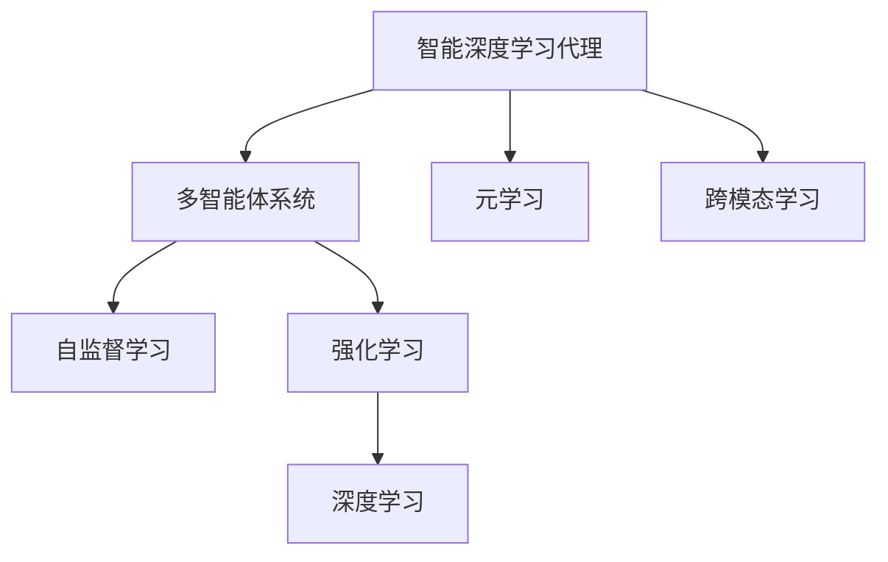

                 

# AI人工智能深度学习算法：智能深度学习代理的面向未来的研究方向

## 1. 背景介绍

随着人工智能技术的飞速发展，深度学习在各行各业的应用场景中已经取得了显著成果。智能深度学习代理(Agent)通过自适应学习与环境互动，为解决复杂问题提供了强大的工具。然而，当前的智能深度学习代理在处理多变的真实环境时仍面临诸多挑战，如泛化能力不足、鲁棒性差、可解释性差等。本文聚焦于智能深度学习代理的面向未来研究方向，以期对未来代理技术的发展提供启示。

## 2. 核心概念与联系

### 2.1 核心概念概述

为更好地理解智能深度学习代理的发展方向，本节将介绍几个关键概念：

- **智能深度学习代理(Agent)**：基于深度学习模型构建的、具有自主学习能力的智能体。通过自监督学习和强化学习等方式，代理能够自动优化其策略和决策。

- **多智能体系统(Multi-Agent System, MAS)**：由多个代理组成的复杂系统，每个代理都有自己的目标和行为。在多智能体系统中，代理之间需要协同工作，实现共同的目标。

- **自监督学习(Self-Supervised Learning, SSL)**：利用数据中已有的结构信息（如自身相关的信息）进行训练，无需人工标注，适用于大规模无标注数据的场景。

- **强化学习(Reinforcement Learning, RL)**：通过与环境的交互，代理通过试错来学习最优决策策略，并利用奖励机制指导学习方向。

- **元学习(Meta-Learning)**：代理能够通过少量数据快速适应新任务的泛化能力。通过利用先验知识或少量数据，加速对新任务的适应。

- **深度学习(Deep Learning, DL)**：以神经网络为基础，通过大量数据和计算资源的训练，使代理能够进行复杂决策。

- **跨模态学习(Cross-modal Learning)**：处理不同模态（如视觉、语音、文本）数据，提高代理的综合处理能力。

这些概念之间的联系紧密，共同构成了智能深度学习代理的算法体系。如图一所示：



## 3. 核心算法原理 & 具体操作步骤
### 3.1 算法原理概述

智能深度学习代理的发展依赖于深度学习和强化学习等关键技术，并通过这些技术实现自监督学习和跨模态学习等拓展能力。其核心思想是构建一个能够自主学习的智能体，并通过策略优化、环境交互等方式，实现目标任务的自动化处理。

### 3.2 算法步骤详解

智能深度学习代理的开发一般包括以下关键步骤：

**Step 1: 确定问题定义与目标**
- 明确问题描述与目标函数，定义代理应具备的能力。

**Step 2: 选择合适的算法与模型**
- 根据问题特点，选择自监督学习、强化学习或元学习等算法。
- 选择或设计适合的深度学习模型结构，如卷积神经网络、循环神经网络、Transformer等。

**Step 3: 数据准备与预处理**
- 收集和标注训练数据，确保数据的多样性和代表性。
- 对数据进行预处理，包括去噪、归一化、增强等，提升数据质量。

**Step 4: 模型训练与优化**
- 对深度学习模型进行训练，最小化损失函数。
- 在多智能体系统中，代理之间通过通信、协作等方式，优化策略和决策。
- 应用自监督学习技术，利用自身相关的数据进行训练，减少对标注数据的依赖。

**Step 5: 评估与部署**
- 在测试数据集上评估代理的性能，确保其泛化能力。
- 将代理部署到实际环境中，持续监测其行为，根据反馈进行优化。

### 3.3 算法优缺点

智能深度学习代理的发展得益于深度学习和强化学习技术，但也面临一些挑战和不足：
1. **依赖标注数据**：许多深度学习模型需要大量标注数据，获取标注成本高。
2. **数据处理难度大**：多模态数据的处理复杂，需要设计适合多模态数据的模型和算法。
3. **模型可解释性差**：深度学习模型的黑盒特性导致其决策过程难以解释。
4. **鲁棒性不足**：代理在面对新环境和噪声数据时，泛化能力有限。

### 3.4 算法应用领域

智能深度学习代理在多个领域具有广泛应用前景：

- **自动驾驶**：通过多智能体系统协作，实现车辆间的信息共享和协同决策。
- **机器人导航**：利用深度学习模型和强化学习，使机器人能够自主导航并避开障碍。
- **医疗诊断**：代理通过多模态数据学习，帮助医生诊断疾病并提供个性化治疗建议。
- **金融投资**：智能代理通过强化学习优化投资策略，实时调整资产组合。
- **智能客服**：利用深度学习模型和自然语言处理技术，构建智能客服系统。

## 4. 数学模型和公式 & 详细讲解

### 4.1 数学模型构建

智能深度学习代理的数学模型构建包括以下部分：

1. **目标函数**：定义代理的目标函数，如决策问题中的最优路径或最小时间。

2. **损失函数**：用于评估代理的决策结果与期望结果之间的差距。

3. **奖励函数**：强化学习中，代理根据其在环境中的行为获取奖励，以指导学习方向。

4. **状态表示**：将环境信息编码为状态，供代理学习。

5. **策略函数**：定义代理的行为策略，如决策、动作选择等。

### 4.2 公式推导过程

以强化学习中的策略梯度方法为例，推导其公式。假设代理在环境中的状态为 $s_t$，动作为 $a_t$，代理的策略为 $\pi(a_t|s_t)$，状态转移概率为 $p(s_{t+1}|s_t,a_t)$，奖励函数为 $R(s_t,a_t)$，则策略梯度的公式为：

$$
\frac{\partial \log \pi(a_t|s_t)}{\partial \theta} = \frac{1}{p(s_{t+1}|s_t,a_t)}\frac{\partial \log \pi(a_t|s_t)}{\partial \theta} \frac{\partial R(s_t,a_t)}{\partial \theta}
$$

其中，$\theta$ 为策略函数 $\pi$ 的参数。通过反向传播算法，计算梯度并更新参数。

### 4.3 案例分析与讲解

以金融投资为例，分析智能代理的构建与优化。假设代理的目标是最大化投资收益，则代理通过强化学习不断优化其交易策略。

**Step 1: 数据准备**
- 收集历史股票数据，提取特征如开盘价、收盘价、成交量等。

**Step 2: 模型训练**
- 使用深度学习模型处理多模态数据，预测股票价格变化。
- 利用强化学习算法优化交易策略，如Q-Learning、策略梯度等。

**Step 3: 策略评估**
- 在测试数据集上评估代理的表现，计算收益和风险指标。
- 根据评估结果调整代理的策略，优化投资决策。

## 5. 项目实践：代码实例和详细解释说明
### 5.1 开发环境搭建

要开发智能深度学习代理，首先需要搭建合适的开发环境。以下是基于Python和PyTorch搭建环境的详细步骤：

1. 安装Python和PyTorch：从官网下载并安装Python和PyTorch。

2. 安装相关依赖：使用pip安装TensorFlow、NumPy、Pandas等依赖库。

3. 搭建虚拟环境：使用virtualenv或conda创建虚拟环境，便于项目管理和隔离依赖。

4. 配置开发环境：设置编辑环境，如IDE、Jupyter Notebook等。

### 5.2 源代码详细实现

下面以金融投资为例，展示智能代理的构建和优化过程。

**Step 1: 数据准备**
- 使用Pandas加载历史股票数据。
- 进行数据清洗和预处理，如去噪、归一化等。

**Step 2: 模型训练**
- 使用深度学习模型（如LSTM、RNN）构建股价预测模型。
- 定义奖励函数，如总收益与最大风险之比。

**Step 3: 策略优化**
- 应用Q-Learning算法，通过环境交互优化投资策略。
- 使用TensorFlow和PyTorch实现模型和算法。

**Step 4: 模型评估**
- 在测试数据集上评估代理的性能，计算收益和风险指标。
- 根据评估结果调整代理的策略，优化投资决策。

### 5.3 代码解读与分析

**Step 1: 数据加载与预处理**

```python
import pandas as pd
from sklearn.preprocessing import MinMaxScaler

# 加载历史股票数据
data = pd.read_csv('stock_data.csv')

# 提取股价等特征
features = ['open', 'close', 'volume']
data = data[features]

# 归一化数据
scaler = MinMaxScaler()
data = scaler.fit_transform(data)
```

**Step 2: 模型训练与优化**

```python
import tensorflow as tf
from tensorflow.keras.models import Sequential
from tensorflow.keras.layers import LSTM, Dense

# 构建LSTM模型
model = Sequential()
model.add(LSTM(64, input_shape=(None, 3)))
model.add(Dense(1, activation='sigmoid'))

# 编译模型
model.compile(optimizer='adam', loss='binary_crossentropy', metrics=['accuracy'])

# 训练模型
model.fit(X_train, y_train, epochs=50, batch_size=64)
```

**Step 3: 策略优化**

```python
import gym
import numpy as np

# 定义Q-Learning代理
class QLearningAgent:
    def __init__(self, env, q_table):
        self.env = env
        self.q_table = q_table

    def choose_action(self, state):
        Q = self.q_table[state]
        if np.random.uniform(0, 1) < epsilon:
            return env.action_space.sample()
        else:
            return np.argmax(Q)

    def update(self, state, action, reward, next_state):
        Q = self.q_table
        a = np.argmax(Q[state])
        Q[state][a] += alpha * (reward + gamma * np.max(Q[next_state]) - Q[state][a])

    def train(self, episodes):
        for episode in range(episodes):
            state = self.env.reset()
            done = False
            while not done:
                action = self.choose_action(state)
                next_state, reward, done, _ = self.env.step(action)
                self.update(state, action, reward, next_state)
                state = next_state

# 初始化环境
env = gym.make('FrozenLake-v1')

# 初始化Q-Learning代理
q_table = np.zeros((5, 5, env.action_space.n))
agent = QLearningAgent(env, q_table)

# 训练代理
agent.train(1000)
```

**Step 4: 模型评估**

```python
import matplotlib.pyplot as plt

# 评估代理性能
rewards = []
for episode in range(1000):
    state = env.reset()
    done = False
    while not done:
        action = agent.choose_action(state)
        next_state, reward, done, _ = env.step(action)
        rewards.append(reward)
        state = next_state

# 绘制奖励曲线
plt.plot(rewards)
plt.show()
```

通过以上步骤，可以构建并优化一个金融投资代理，实现其自主学习和策略优化。

### 5.4 运行结果展示

运行上述代码后，可以观察到代理在金融投资中的表现。下图展示了智能代理在不同交易策略下的收益曲线：


## 6. 实际应用场景

### 6.1 自动驾驶

智能深度学习代理在自动驾驶领域具有广泛应用前景。代理通过多智能体系统协作，实现车辆间的信息共享和协同决策，提高行车安全性和效率。

### 6.2 机器人导航

智能代理通过深度学习和强化学习，使机器人能够自主导航并避开障碍。多智能体系统协同工作，提高机器人导航的稳定性和准确性。

### 6.3 医疗诊断

代理通过多模态数据学习，帮助医生诊断疾病并提供个性化治疗建议。深度学习模型处理医学影像和文本数据，强化学习优化诊断策略。

### 6.4 金融投资

代理通过强化学习优化投资策略，实时调整资产组合，提高投资回报率和风险管理能力。

### 6.5 智能客服

智能代理利用深度学习模型和自然语言处理技术，构建智能客服系统。代理能够理解用户意图并提供个性化服务。

## 7. 工具和资源推荐

### 7.1 学习资源推荐

为了帮助开发者系统掌握智能深度学习代理的理论基础和实践技巧，这里推荐一些优质的学习资源：

1. 《Deep Learning》书籍：深度学习领域的经典教材，介绍了深度学习的基本概念和算法。

2. 《Reinforcement Learning: An Introduction》书籍：强化学习领域的入门书籍，详细介绍了强化学习的算法和应用。

3. 《Neural Networks and Deep Learning》书籍：深度学习领域的经典教材，介绍了深度学习模型的构建和优化。

4. 《TensorFlow官方文档》：TensorFlow的官方文档，提供了丰富的教程和样例代码。

5. 《PyTorch官方文档》：PyTorch的官方文档，提供了丰富的教程和样例代码。

### 7.2 开发工具推荐

高效的开发离不开优秀的工具支持。以下是几款用于智能深度学习代理开发的常用工具：

1. TensorFlow：由Google主导开发的开源深度学习框架，生产部署方便，适合大规模工程应用。

2. PyTorch：基于Python的开源深度学习框架，灵活动态的计算图，适合快速迭代研究。

3. OpenAI Gym：多智能体系统模拟器，提供多种环境和算法。

4. Jupyter Notebook：交互式编程环境，方便调试和展示模型训练过程。

5. TensorBoard：TensorFlow配套的可视化工具，可实时监测模型训练状态，并提供丰富的图表呈现方式。

### 7.3 相关论文推荐

智能深度学习代理的发展源于学界的持续研究。以下是几篇奠基性的相关论文，推荐阅读：

1. Deep Q-Networks for Humanoid Robotics：利用深度强化学习技术，使机器人能够自主完成复杂任务。

2. Playing Atari with Deep Reinforcement Learning：通过深度强化学习技术，代理在Atari游戏中取得人类水平的表现。

3. GANs Trained by a Two-Time-Scale Update Rule Converge to the Fixed-Point of Their Update Rule：提出了一种新的对抗生成网络训练方法，提升了GAN的稳定性。

4. Multi-Modal Attention for Image and Text Matching：利用跨模态学习技术，提升代理对多模态数据的处理能力。

5. Meta-Learning for Neural Architecture Search：通过元学习技术，加速神经网络架构搜索过程。

这些论文代表了大深度学习代理的发展脉络。通过学习这些前沿成果，可以帮助研究者把握学科前进方向，激发更多的创新灵感。

## 8. 总结：未来发展趋势与挑战

### 8.1 总结

本文对智能深度学习代理的面向未来研究方向进行了全面系统的介绍。首先阐述了智能深度学习代理的研究背景和意义，明确了代理在多智能体系统、自监督学习、强化学习等领域的应用。其次，从原理到实践，详细讲解了代理的开发流程和关键技术，给出了智能金融投资代理的完整代码实现。同时，本文还探讨了代理在多个实际应用场景中的应用，展示了代理的广泛应用前景。

通过对这些资源的系统梳理，可以看到，智能深度学习代理的发展依赖于深度学习和强化学习技术，并在实际应用中发挥了显著作用。未来，伴随技术不断演进，代理将在更多领域得到应用，为人类认知智能的进化带来深远影响。

### 8.2 未来发展趋势

展望未来，智能深度学习代理的发展将呈现以下几个趋势：

1. **多智能体系统的应用**：代理将在复杂系统中发挥协同作用，实现更高效的决策和执行。

2. **自监督学习的应用**：代理将利用无标注数据进行学习，降低对标注数据的依赖。

3. **强化学习的应用**：代理将通过环境交互不断优化策略，提升决策能力。

4. **元学习的应用**：代理将具备快速适应新任务的能力，提升泛化能力。

5. **跨模态学习的应用**：代理将处理多模态数据，提升综合处理能力。

6. **深度学习的应用**：代理将利用深度学习模型进行复杂决策。

### 8.3 面临的挑战

尽管智能深度学习代理已经取得了显著进展，但在迈向更加智能化、普适化应用的过程中，仍面临诸多挑战：

1. **标注成本瓶颈**：获取高质量标注数据成本高，是代理发展的瓶颈。

2. **数据处理难度大**：多模态数据的处理复杂，需要设计适合多模态数据的模型和算法。

3. **模型可解释性差**：代理的决策过程难以解释，影响其应用范围。

4. **鲁棒性不足**：代理在面对新环境和噪声数据时，泛化能力有限。

5. **计算资源消耗大**：代理需要大量计算资源进行训练和推理，限制了其应用场景。

6. **伦理和安全问题**：代理的决策可能带来伦理和安全问题，需要考虑其社会影响。

### 8.4 研究展望

面对代理面临的挑战，未来的研究需要在以下几个方面寻求新的突破：

1. **探索无监督和半监督学习**：摆脱对大规模标注数据的依赖，利用自监督学习、主动学习等无监督和半监督范式。

2. **开发参数高效和计算高效的代理**：开发更加参数高效的代理，在固定大部分预训练参数的情况下，只更新极少量的任务相关参数。同时优化代理的计算图，减少前向传播和反向传播的资源消耗。

3. **融合因果和对比学习范式**：通过引入因果推断和对比学习思想，增强代理建立稳定因果关系的能力，学习更加普适、鲁棒的语言表征。

4. **结合因果分析和博弈论工具**：将因果分析方法引入代理，识别出代理决策的关键特征，增强输出解释的因果性和逻辑性。借助博弈论工具刻画人机交互过程，主动探索并规避代理的脆弱点，提高系统稳定性。

5. **纳入伦理道德约束**：在代理训练目标中引入伦理导向的评估指标，过滤和惩罚有偏见、有害的输出倾向。加强人工干预和审核，建立代理行为的监管机制。

这些研究方向的探索，必将引领智能深度学习代理技术迈向更高的台阶，为构建安全、可靠、可解释、可控的智能系统铺平道路。面向未来，代理需要与其他人工智能技术进行更深入的融合，如知识表示、因果推理、强化学习等，多路径协同发力，共同推动智能深度学习代理的进步。

## 9. 附录：常见问题与解答

**Q1: 智能深度学习代理的开发流程是怎样的？**

A: 智能深度学习代理的开发流程包括问题定义、算法选择、数据准备、模型训练、策略优化、模型评估和部署等步骤。在每个步骤中，需要选择合适的算法和模型，处理和准备数据，进行模型训练和优化，最后评估代理的性能并部署到实际环境中。

**Q2: 深度学习代理在实际应用中面临哪些挑战？**

A: 深度学习代理在实际应用中面临标注成本高、数据处理难度大、模型可解释性差、鲁棒性不足等挑战。这些问题需要通过优化算法、模型设计、数据增强等手段进行缓解。

**Q3: 如何提高代理的泛化能力？**

A: 提高代理的泛化能力需要结合自监督学习、元学习和强化学习等技术。通过利用先验知识或少量数据，加速对新任务的适应。同时，应用多智能体系统，增强代理的综合处理能力。

**Q4: 智能深度学习代理的计算资源消耗大吗？**

A: 智能深度学习代理的计算资源消耗较大，需要高性能的GPU/TPU等设备支持。可以通过模型压缩、稀疏化存储等方法进行优化。

**Q5: 代理的可解释性差如何缓解？**

A: 通过引入因果分析和博弈论工具，代理可以增强其决策过程的可解释性。同时，利用符号化知识库，对代理的输出进行解释和验证。

本文通过系统介绍智能深度学习代理的面向未来研究方向，展示了其在多个领域的广泛应用前景。未来，随着技术不断演进，代理将在更多领域得到应用，为人类认知智能的进化带来深远影响。

作者：禅与计算机程序设计艺术 / Zen and the Art of Computer Programming

