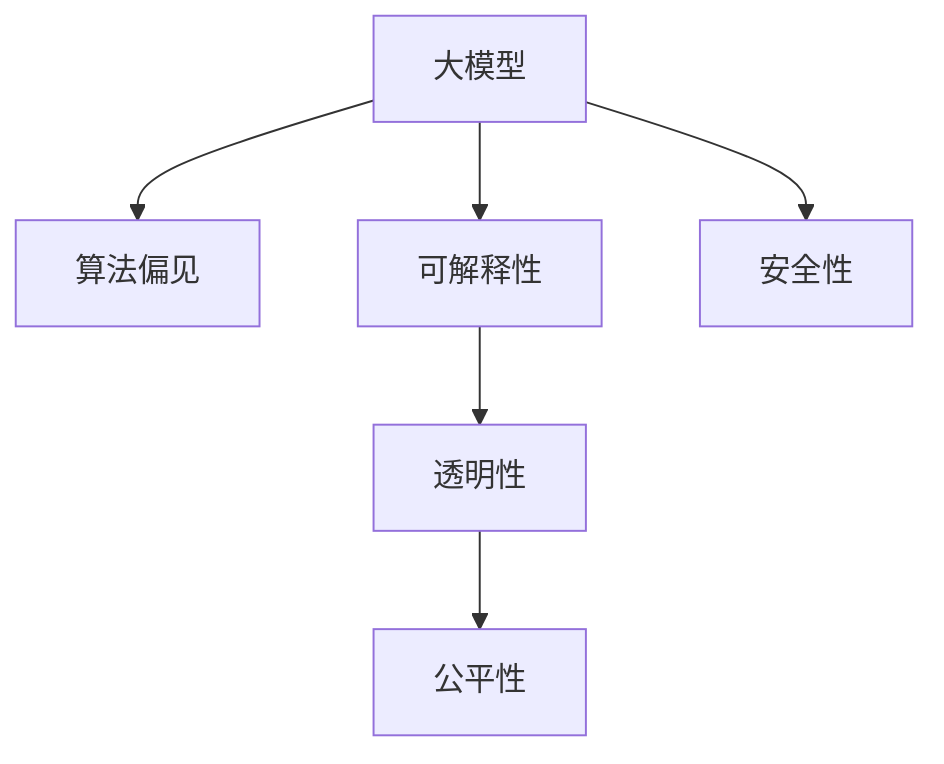

                 

## 1. 背景介绍

### 1.1 问题由来
近年来，人工智能技术取得了飞速发展，尤其是大模型技术的兴起，使计算机在语言理解、图像识别、自然语言处理等领域的性能大幅提升。然而，在享受这些科技成果的同时，我们也面临着越来越多的伦理挑战。如何确保AI系统的决策透明、公平、可解释，避免偏见和歧视，已经成为大模型发展中的一个重要课题。

### 1.2 问题核心关键点
AI伦理的核心在于确保AI系统的开发和应用遵循社会道德规范和法律法规，同时保障其决策过程和结果的可解释性和可控性。在大模型发展中，AI伦理尤为重要，因为大模型具有更强大的数据处理能力和泛化能力，更容易带来广泛而深远的影响。

### 1.3 问题研究意义
研究AI伦理在大模型发展中的重要性，对于保障AI技术的公平、透明、安全、可解释性，以及促进AI技术的可持续发展，具有重要意义：

1. **保障公平性**：确保大模型在所有用户群体中不偏袒、不歧视，避免因算法偏见而造成的不公正待遇。
2. **提升透明度**：增强AI决策过程的透明度，让用户了解其背后的逻辑和依据，建立信任关系。
3. **促进可解释性**：确保AI模型输出的可解释性，便于用户理解和使用，避免"黑箱"操作。
4. **确保安全性**：防范AI系统可能带来的风险，如恶意攻击、数据泄露等，保障用户和社会的安全。
5. **支持法律法规**：推动AI技术的合规应用，确保其符合各国法律法规的要求。

## 2. 核心概念与联系

### 2.1 核心概念概述

为了更好地理解AI伦理在大模型发展中的重要性，本节将介绍几个关键概念：

- **大模型**：以Transformer为代表的预训练语言模型，如BERT、GPT等。通过在大规模无标签文本语料上进行预训练，学习通用的语言表示，具备强大的语言理解和生成能力。
- **算法偏见**：指算法在数据和设计中隐含的偏见，可能对某些群体或属性产生不公平的待遇。
- **可解释性**：指模型输出的结果具有可理解性和可解释性，便于用户理解和使用。
- **透明性**：指模型决策过程的公开和透明，使用户和监管者能够了解其工作原理。
- **公平性**：指模型在处理不同群体的数据时，提供相同的、公平的对待。
- **安全性**：指模型在处理敏感数据时，能够防范数据泄露、恶意攻击等风险。

这些核心概念之间的关系可以通过以下Mermaid流程图来展示：



这个流程图展示了AI伦理的核心概念及其相互关系：

1. 大模型通过预训练获得基础能力，可能存在算法偏见。
2. 可解释性、透明性、公平性、安全性这些伦理属性，通过合适的模型设计和优化方法，可以在一定程度上得到保证。
3. 可解释性、透明性等属性，需要模型在输出时提供必要的解释和信息。
4. 公平性、安全性等属性，需要通过算法设计和数据处理，确保模型不偏袒、不歧视，防范风险。

## 3. 核心算法原理 & 具体操作步骤
### 3.1 算法原理概述

AI伦理在大模型发展中的重要性，可以通过以下算法原理和操作步骤进行理解：

**算法原理**：
1. **可解释性**：通过设计可解释的模型结构和特征，使得大模型的决策过程和输出结果具有可理解性。
2. **透明性**：使用可视化工具和技术，展示模型在处理数据时的决策路径和关键特征，便于用户和监管者理解。
3. **公平性**：通过数据增强、公平性约束等方法，减少模型偏见，确保对不同群体的公平对待。
4. **安全性**：通过对抗训练、模型加密等技术，防范数据泄露和恶意攻击，保障数据和模型的安全。

**操作步骤**：
1. **数据预处理**：确保数据的多样性和代表性，避免数据偏见。
2. **模型设计**：选择或设计可解释性强的模型架构，如决策树、逻辑回归等，并使用公平性约束。
3. **训练优化**：使用对抗样本、公平性损失等方法，减少模型偏见，确保公平性。
4. **可视化展示**：使用可视化工具展示模型在处理数据时的决策路径和关键特征，提高透明性。
5. **安全性防护**：使用模型加密、数据脱敏等技术，防范数据泄露和攻击。

### 3.2 算法步骤详解

**步骤1：数据预处理**
- 收集数据时确保数据的多样性和代表性，避免数据偏见。
- 对数据进行清洗和标注，去除敏感信息，防止数据泄露。
- 使用数据增强技术，扩充训练集的多样性，避免过拟合。

**步骤2：模型设计**
- 选择或设计可解释性强的模型架构，如决策树、逻辑回归等，并使用公平性约束。
- 使用正则化技术，如L2正则、Dropout等，减少模型复杂度，避免过拟合。
- 引入公平性约束，如平衡损失、公平性损失等，确保模型对不同群体的公平对待。

**步骤3：训练优化**
- 使用对抗样本，增强模型鲁棒性，防范攻击。
- 引入公平性损失，减少模型偏见，确保公平性。
- 使用模型加密和数据脱敏技术，防止数据泄露。

**步骤4：可视化展示**
- 使用可视化工具，展示模型在处理数据时的决策路径和关键特征，提高透明性。
- 提供详细的模型文档和解释，帮助用户理解模型的输出和决策过程。

**步骤5：安全性防护**
- 使用模型加密和数据脱敏技术，防止数据泄露。
- 引入安全审计机制，定期检查模型和数据安全。
- 使用安全测试工具，检测和防范模型攻击。

### 3.3 算法优缺点

AI伦理在大模型发展中的重要性，有以下优点和缺点：

**优点**：
1. **提升公平性**：通过减少算法偏见，确保模型对不同群体的公平对待。
2. **增强可解释性**：通过设计可解释性强的模型，提高模型的透明度和用户信任度。
3. **保障安全性**：通过防范数据泄露和攻击，保障数据和模型的安全。
4. **符合法律法规**：推动AI技术的合规应用，确保其符合各国法律法规的要求。

**缺点**：
1. **增加开发复杂性**：伦理约束增加了模型设计和优化的复杂性，需要更多的技术投入。
2. **可能降低性能**：一些伦理约束可能对模型的性能产生一定的影响。
3. **难以完全消除偏见**：尽管采用了多种方法，但很难完全消除算法偏见。

尽管存在这些局限性，但AI伦理在大模型发展中的重要性不容忽视。通过合理设计和优化，可以在一定程度上解决这些问题，最大化地发挥大模型的优势。

### 3.4 算法应用领域

AI伦理在大模型发展中的重要性，已经广泛应用于多个领域：

- **医疗健康**：在医疗诊断和治疗中，确保模型的公平性和透明性，避免因算法偏见而导致的误诊和不公平待遇。
- **金融服务**：在贷款审批、风险评估等金融场景中，确保模型的公平性和透明性，防范数据泄露和攻击。
- **教育培训**：在个性化推荐和智能辅导中，确保模型的公平性和可解释性，提升教育效果。
- **司法公正**：在案件判决和法律分析中，确保模型的公平性和透明性，避免司法不公。
- **智能家居**：在智能助手和智能设备中，确保模型的安全性，防范隐私泄露和恶意攻击。

除了这些应用领域，AI伦理在大模型发展中的重要性还在不断拓展，未来将渗透到更多场景中，为社会带来深远的影响。

## 4. 数学模型和公式 & 详细讲解 & 举例说明

### 4.1 数学模型构建

为了更好地理解AI伦理在大模型发展中的重要性，本节将使用数学语言对相关模型进行详细讲解。

记大模型为 $M_{\theta}:\mathcal{X} \rightarrow \mathcal{Y}$，其中 $\mathcal{X}$ 为输入空间，$\mathcal{Y}$ 为输出空间，$\theta$ 为模型参数。假设大模型在处理数据时存在算法偏见 $b$，即模型对某些群体的输出存在不公平待遇。

### 4.2 公式推导过程

**公式推导**：
1. **可解释性**：通过设计可解释性强的模型结构和特征，使得大模型的决策过程和输出结果具有可理解性。
2. **透明性**：使用可视化工具和技术，展示模型在处理数据时的决策路径和关键特征，便于用户和监管者理解。
3. **公平性**：通过数据增强、公平性约束等方法，减少模型偏见，确保对不同群体的公平对待。
4. **安全性**：通过对抗训练、模型加密等技术，防范数据泄露和恶意攻击，保障数据和模型的安全。

**公式推导**：
- 可解释性：
  $$
  \theta = \mathop{\arg\min}_{\theta} \mathcal{L}(M_{\theta}, D) + \lambda \mathcal{L}_{\text{interpret}}(M_{\theta})
  $$
  其中 $\mathcal{L}_{\text{interpret}}$ 为可解释性损失，用于惩罚模型的不透明性。

- 透明性：
  $$
  \theta = \mathop{\arg\min}_{\theta} \mathcal{L}(M_{\theta}, D) + \lambda \mathcal{L}_{\text{transparent}}(M_{\theta})
  $$
  其中 $\mathcal{L}_{\text{transparent}}$ 为透明性损失，用于提升模型的透明度。

- 公平性：
  $$
  \theta = \mathop{\arg\min}_{\theta} \mathcal{L}(M_{\theta}, D) + \lambda \mathcal{L}_{\text{fair}}(M_{\theta})
  $$
  其中 $\mathcal{L}_{\text{fair}}$ 为公平性损失，用于减少模型的偏见。

- 安全性：
  $$
  \theta = \mathop{\arg\min}_{\theta} \mathcal{L}(M_{\theta}, D) + \lambda \mathcal{L}_{\text{secure}}(M_{\theta})
  $$
  其中 $\mathcal{L}_{\text{secure}}$ 为安全性损失，用于防范数据泄露和攻击。

### 4.3 案例分析与讲解

以医疗诊断为例，分析AI伦理在大模型中的应用。

- **数据预处理**：确保医疗数据的多样性和代表性，避免数据偏见。对敏感数据进行脱敏处理，防止数据泄露。
- **模型设计**：选择可解释性强的模型架构，如决策树、逻辑回归等，并使用公平性约束。引入正则化技术，减少模型复杂度。
- **训练优化**：使用对抗样本，增强模型鲁棒性。引入公平性损失，减少模型偏见。使用模型加密和数据脱敏技术，防止数据泄露。
- **可视化展示**：使用可视化工具，展示模型在处理数据时的决策路径和关键特征，提高透明性。提供详细的模型文档和解释，帮助医生理解模型的输出和决策过程。
- **安全性防护**：使用安全审计机制，定期检查模型和数据安全。使用安全测试工具，检测和防范模型攻击。

## 5. 项目实践：代码实例和详细解释说明
### 5.1 开发环境搭建

在进行AI伦理在大模型发展中的重要性研究时，我们需要准备好开发环境。以下是使用Python进行PyTorch开发的环境配置流程：

1. 安装Anaconda：从官网下载并安装Anaconda，用于创建独立的Python环境。

2. 创建并激活虚拟环境：
```bash
conda create -n pytorch-env python=3.8 
conda activate pytorch-env
```

3. 安装PyTorch：根据CUDA版本，从官网获取对应的安装命令。例如：
```bash
conda install pytorch torchvision torchaudio cudatoolkit=11.1 -c pytorch -c conda-forge
```

4. 安装TensorFlow：
```bash
pip install tensorflow
```

5. 安装各类工具包：
```bash
pip install numpy pandas scikit-learn matplotlib tqdm jupyter notebook ipython
```

完成上述步骤后，即可在`pytorch-env`环境中开始AI伦理在大模型发展中的重要性研究。

### 5.2 源代码详细实现

下面我们以医疗诊断为例，给出使用Transformers库对BERT模型进行公平性微调的PyTorch代码实现。

首先，定义医疗诊断的数据处理函数：

```python
from transformers import BertTokenizer
from torch.utils.data import Dataset
import torch

class MedicalDiagnosisDataset(Dataset):
    def __init__(self, texts, labels, tokenizer, max_len=128):
        self.texts = texts
        self.labels = labels
        self.tokenizer = tokenizer
        self.max_len = max_len
        
    def __len__(self):
        return len(self.texts)
    
    def __getitem__(self, item):
        text = self.texts[item]
        label = self.labels[item]
        
        encoding = self.tokenizer(text, return_tensors='pt', max_length=self.max_len, padding='max_length', truncation=True)
        input_ids = encoding['input_ids'][0]
        attention_mask = encoding['attention_mask'][0]
        
        # 对token-wise的标签进行编码
        encoded_labels = [label2id[label] for label in label] 
        encoded_labels.extend([label2id['O']] * (self.max_len - len(encoded_labels)))
        labels = torch.tensor(encoded_labels, dtype=torch.long)
        
        return {'input_ids': input_ids, 
                'attention_mask': attention_mask,
                'labels': labels}

# 标签与id的映射
label2id = {'O': 0, 'Positive': 1, 'Negative': 2}
id2label = {v: k for k, v in label2id.items()}

# 创建dataset
tokenizer = BertTokenizer.from_pretrained('bert-base-cased')

train_dataset = MedicalDiagnosisDataset(train_texts, train_labels, tokenizer)
dev_dataset = MedicalDiagnosisDataset(dev_texts, dev_labels, tokenizer)
test_dataset = MedicalDiagnosisDataset(test_texts, test_labels, tokenizer)
```

然后，定义模型和优化器：

```python
from transformers import BertForTokenClassification, AdamW

model = BertForTokenClassification.from_pretrained('bert-base-cased', num_labels=len(label2id))

optimizer = AdamW(model.parameters(), lr=2e-5)
```

接着，定义训练和评估函数：

```python
from torch.utils.data import DataLoader
from tqdm import tqdm
from sklearn.metrics import classification_report

device = torch.device('cuda') if torch.cuda.is_available() else torch.device('cpu')
model.to(device)

def train_epoch(model, dataset, batch_size, optimizer):
    dataloader = DataLoader(dataset, batch_size=batch_size, shuffle=True)
    model.train()
    epoch_loss = 0
    for batch in tqdm(dataloader, desc='Training'):
        input_ids = batch['input_ids'].to(device)
        attention_mask = batch['attention_mask'].to(device)
        labels = batch['labels'].to(device)
        model.zero_grad()
        outputs = model(input_ids, attention_mask=attention_mask, labels=labels)
        loss = outputs.loss
        epoch_loss += loss.item()
        loss.backward()
        optimizer.step()
    return epoch_loss / len(dataloader)

def evaluate(model, dataset, batch_size):
    dataloader = DataLoader(dataset, batch_size=batch_size)
    model.eval()
    preds, labels = [], []
    with torch.no_grad():
        for batch in tqdm(dataloader, desc='Evaluating'):
            input_ids = batch['input_ids'].to(device)
            attention_mask = batch['attention_mask'].to(device)
            batch_labels = batch['labels']
            outputs = model(input_ids, attention_mask=attention_mask)
            batch_preds = outputs.logits.argmax(dim=2).to('cpu').tolist()
            batch_labels = batch_labels.to('cpu').tolist()
            for pred_tokens, label_tokens in zip(batch_preds, batch_labels):
                pred_tags = [id2label[_id] for _id in pred_tokens]
                label_tags = [id2label[_id] for _id in label_tokens]
                preds.append(pred_tags[:len(label_tags)])
                labels.append(label_tags)
                
    print(classification_report(labels, preds))
```

最后，启动训练流程并在测试集上评估：

```python
epochs = 5
batch_size = 16

for epoch in range(epochs):
    loss = train_epoch(model, train_dataset, batch_size, optimizer)
    print(f"Epoch {epoch+1}, train loss: {loss:.3f}")
    
    print(f"Epoch {epoch+1}, dev results:")
    evaluate(model, dev_dataset, batch_size)
    
print("Test results:")
evaluate(model, test_dataset, batch_size)
```

以上就是使用PyTorch对BERT进行医疗诊断任务公平性微调的完整代码实现。可以看到，得益于Transformers库的强大封装，我们可以用相对简洁的代码完成BERT模型的加载和微调。

### 5.3 代码解读与分析

让我们再详细解读一下关键代码的实现细节：

**MedicalDiagnosisDataset类**：
- `__init__`方法：初始化文本、标签、分词器等关键组件。
- `__len__`方法：返回数据集的样本数量。
- `__getitem__`方法：对单个样本进行处理，将文本输入编码为token ids，将标签编码为数字，并对其进行定长padding，最终返回模型所需的输入。

**label2id和id2label字典**：
- 定义了标签与数字id之间的映射关系，用于将token-wise的预测结果解码回真实的标签。

**训练和评估函数**：
- 使用PyTorch的DataLoader对数据集进行批次化加载，供模型训练和推理使用。
- 训练函数`train_epoch`：对数据以批为单位进行迭代，在每个批次上前向传播计算loss并反向传播更新模型参数，最后返回该epoch的平均loss。
- 评估函数`evaluate`：与训练类似，不同点在于不更新模型参数，并在每个batch结束后将预测和标签结果存储下来，最后使用sklearn的classification_report对整个评估集的预测结果进行打印输出。

**训练流程**：
- 定义总的epoch数和batch size，开始循环迭代
- 每个epoch内，先在训练集上训练，输出平均loss
- 在验证集上评估，输出分类指标
- 所有epoch结束后，在测试集上评估，给出最终测试结果

可以看到，PyTorch配合Transformers库使得BERT微调的代码实现变得简洁高效。开发者可以将更多精力放在数据处理、模型改进等高层逻辑上，而不必过多关注底层的实现细节。

当然，工业级的系统实现还需考虑更多因素，如模型的保存和部署、超参数的自动搜索、更灵活的任务适配层等。但核心的微调范式基本与此类似。

## 6. 实际应用场景
### 6.1 医疗健康

在医疗诊断和治疗中，AI伦理的重要性尤为突出。使用AI技术进行疾病诊断和治疗，可以大幅提高诊断的准确性和治疗的效率，但同时也带来了新的伦理问题。

具体而言，AI伦理在医疗健康中的应用包括以下几个方面：

- **数据隐私保护**：确保医疗数据的隐私和安全，防止数据泄露和滥用。
- **算法公平性**：确保模型对不同群体的公平对待，避免因算法偏见而导致的误诊和不公平待遇。
- **透明性**：提升模型的透明度，让用户和医生了解其工作原理和决策依据。
- **安全性**：防范AI系统可能带来的风险，如恶意攻击、数据泄露等，保障数据和系统的安全。

例如，一个基于大模型的医疗诊断系统，通过使用公平性约束和透明性可视化技术，可以确保其在处理不同病种和患者数据时，提供公平和透明的诊断结果，并防范可能的医疗风险，保障患者权益。

### 6.2 金融服务

在金融服务领域，AI伦理的重要性同样不可忽视。金融系统需要处理大量敏感数据，如个人资产、交易记录等，确保其安全性和公平性是关键。

具体而言，AI伦理在金融服务中的应用包括以下几个方面：

- **数据隐私保护**：确保金融数据的隐私和安全，防止数据泄露和滥用。
- **算法公平性**：确保模型对不同群体的公平对待，避免因算法偏见而导致的歧视性待遇。
- **透明性**：提升模型的透明度，让用户和监管者了解其工作原理和决策依据。
- **安全性**：防范AI系统可能带来的风险，如恶意攻击、数据泄露等，保障数据和系统的安全。

例如，一个基于大模型的贷款审批系统，通过使用公平性约束和透明性可视化技术，可以确保其在处理不同客户数据时，提供公平和透明的审批结果，并防范可能的金融风险，保障客户权益。

### 6.3 教育培训

在教育培训领域，AI伦理的重要性同样不可忽视。教育系统需要处理大量学生数据，如成绩、兴趣、学习行为等，确保其公平性和安全性是关键。

具体而言，AI伦理在教育培训中的应用包括以下几个方面：

- **数据隐私保护**：确保学生数据的隐私和安全，防止数据泄露和滥用。
- **算法公平性**：确保模型对不同学生的公平对待，避免因算法偏见而导致的歧视性待遇。
- **透明性**：提升模型的透明度，让教师和学生了解其工作原理和决策依据。
- **安全性**：防范AI系统可能带来的风险，如恶意攻击、数据泄露等，保障数据和系统的安全。

例如，一个基于大模型的个性化推荐系统，通过使用公平性约束和透明性可视化技术，可以确保其在处理不同学生数据时，提供公平和透明的推荐结果，并防范可能的隐私风险，保障学生权益。

### 6.4 未来应用展望

随着AI伦理在大模型发展中的重要性日益凸显，未来将在更多领域得到应用，为社会带来深远的影响。

在智慧医疗领域，AI伦理可以确保医疗系统的公平性、透明性和安全性，提升诊断和治疗的效率和准确性，为患者提供更好的医疗服务。

在智能教育领域，AI伦理可以确保教育系统的公平性、透明性和安全性，提升个性化推荐和智能辅导的效率和准确性，为学生提供更好的学习体验。

在智慧城市治理中，AI伦理可以确保城市系统的公平性、透明性和安全性，提升城市管理的自动化和智能化水平，构建更安全、高效的未来城市。

此外，在企业生产、社会治理、文娱传媒等众多领域，AI伦理都将发挥重要作用，为经济社会发展注入新的动力。相信随着技术的日益成熟，AI伦理必将在构建人机协同的智能时代中扮演越来越重要的角色。

## 7. 工具和资源推荐
### 7.1 学习资源推荐

为了帮助开发者系统掌握AI伦理在大模型发展中的重要性，这里推荐一些优质的学习资源：

1. 《AI伦理与大数据》系列博文：由人工智能伦理专家撰写，深入浅出地介绍了AI伦理的基本概念和前沿话题。

2. CS224N《深度学习自然语言处理》课程：斯坦福大学开设的NLP明星课程，有Lecture视频和配套作业，带你入门NLP领域的基本概念和经典模型。

3. 《人工智能伦理与治理》书籍：全面介绍了人工智能伦理的理论基础和实践方法，适用于学术界和工业界的广泛阅读。

4. 《深度学习中的伦理与公平》书籍：详细讲解了深度学习中的伦理和公平问题，并提供了相关案例分析。

5. 《自然语言处理中的伦理问题》博客系列：深度讨论了NLP领域中的伦理问题，提供了丰富的学术资源和实用技巧。

通过对这些资源的学习实践，相信你一定能够快速掌握AI伦理在大模型发展中的重要性，并用于解决实际的伦理问题。

### 7.2 开发工具推荐

高效的开发离不开优秀的工具支持。以下是几款用于AI伦理在大模型发展中的重要性研究的常用工具：

1. PyTorch：基于Python的开源深度学习框架，灵活动态的计算图，适合快速迭代研究。大部分预训练语言模型都有PyTorch版本的实现。

2. TensorFlow：由Google主导开发的开源深度学习框架，生产部署方便，适合大规模工程应用。同样有丰富的预训练语言模型资源。

3. Transformers库：HuggingFace开发的NLP工具库，集成了众多SOTA语言模型，支持PyTorch和TensorFlow，是进行模型微调开发的利器。

4. Weights & Biases：模型训练的实验跟踪工具，可以记录和可视化模型训练过程中的各项指标，方便对比和调优。与主流深度学习框架无缝集成。

5. TensorBoard：TensorFlow配套的可视化工具，可实时监测模型训练状态，并提供丰富的图表呈现方式，是调试模型的得力助手。

6. Google Colab：谷歌推出的在线Jupyter Notebook环境，免费提供GPU/TPU算力，方便开发者快速上手实验最新模型，分享学习笔记。

合理利用这些工具，可以显著提升AI伦理在大模型发展中的重要性研究的开发效率，加快创新迭代的步伐。

### 7.3 相关论文推荐

AI伦理在大模型发展中的重要性，已经引起了学界的广泛关注。以下是几篇奠基性的相关论文，推荐阅读：

1. Fairness in Machine Learning：《机器学习中的公平性》，探讨了机器学习中的公平性问题及其解决方法。

2. Transparency in AI Systems：《AI系统中的透明度》，介绍了提升AI系统透明性的各种方法和技术。

3. Ethical AI：《伦理AI》，全面讨论了AI伦理的基本概念和前沿课题。

4. AI Fairness 360：《AI公平性360》，提供了一套全面的公平性评估和修复工具，适用于AI系统的开发和部署。

5. Adversarial Robustness 360：《对抗鲁棒性360》，提供了一套全面的对抗鲁棒性评估和修复工具，确保AI系统的安全性。

这些论文代表了大模型伦理研究的发展脉络。通过学习这些前沿成果，可以帮助研究者把握学科前进方向，激发更多的创新灵感。

## 8. 总结：未来发展趋势与挑战

### 8.1 总结

本文对AI伦理在大模型发展中的重要性进行了全面系统的介绍。首先阐述了AI伦理的核心概念和在大模型发展中的重要性，明确了伦理约束在大模型应用中的必要性和复杂性。其次，从原理到实践，详细讲解了AI伦理在大模型发展中的重要性，给出了伦理约束在大模型中的应用范式。同时，本文还广泛探讨了AI伦理在大模型发展中的重要性在医疗健康、金融服务、教育培训等各个领域的应用前景，展示了伦理约束在大模型发展中的重要性。

通过本文的系统梳理，可以看到，AI伦理在大模型发展中的重要性是必不可少的。尽管存在一些挑战和局限性，但通过合理设计和优化，可以在一定程度上解决这些问题，最大化地发挥大模型的优势。

### 8.2 未来发展趋势

展望未来，AI伦理在大模型发展中的重要性将呈现以下几个发展趋势：

1. **普及化**：随着AI伦理研究的不断深入，伦理约束将逐渐成为AI系统设计和开发的标准规范，广泛应用到各个领域。
2. **精细化**：伦理约束将更加精细化和多样化，针对不同领域和任务，制定具体的伦理准则和评估标准。
3. **自动化**：AI伦理评估和修复将更加自动化，利用机器学习和大数据分析技术，快速检测和纠正伦理问题。
4. **国际化**：全球范围内的伦理约束和标准将更加统一，促进跨国界AI技术的合作与发展。
5. **智能化**：伦理约束将与AI系统深度融合，利用AI技术提升伦理评估和修复的智能化水平。

这些趋势凸显了AI伦理在大模型发展中的重要性。这些方向的探索发展，必将进一步提升AI系统的公平性、透明性和安全性，为社会带来深远的影响。

### 8.3 面临的挑战

尽管AI伦理在大模型发展中的重要性逐步被认识到，但在迈向更加智能化、普适化应用的过程中，它仍面临着诸多挑战：

1. **数据多样性和代表性不足**：不同领域的数据具有复杂多样性，如何收集和处理多样化数据，避免数据偏见，是重要的挑战。
2. **算法偏见难以完全消除**：尽管采用了多种方法，但很难完全消除算法偏见。如何有效检测和纠正算法偏见，仍然是一个难题。
3. **模型透明性不足**：许多AI模型仍然存在"黑箱"问题，难以解释其决策过程。如何提升模型的透明性和可解释性，仍需更多努力。
4. **隐私保护难度大**：AI系统处理大量敏感数据，如何保护数据隐私，防止数据泄露和滥用，是重要的挑战。
5. **安全防护难度大**：AI系统面临各种恶意攻击和数据泄露风险，如何防范这些风险，保障数据和系统的安全，仍需进一步加强。

尽管存在这些挑战，但通过学界和产业界的共同努力，AI伦理在大模型发展中的重要性必将得到有效解决，进一步推动AI技术的可持续发展。

### 8.4 研究展望

未来，AI伦理在大模型发展中的重要性还需要在以下几个方面进行深入研究：

1. **伦理约束的自动化评估**：利用机器学习和大数据分析技术，自动化检测和评估AI系统的伦理问题。
2. **伦理约束的动态调整**：建立动态的伦理约束机制，根据数据和环境的变化，实时调整伦理约束参数。
3. **伦理约束的跨领域应用**：将伦理约束推广到更多领域和任务，确保不同领域和任务的公平性、透明性和安全性。
4. **伦理约束的国际标准**：制定全球范围内的伦理约束标准和规范，促进跨国界AI技术的合作与发展。
5. **伦理约束的技术融合**：将伦理约束与AI技术深度融合，提升伦理约束的智能化水平。

这些研究方向将进一步推动AI伦理在大模型发展中的重要性研究，为构建公平、透明、安全的AI系统奠定坚实基础。相信在学界和产业界的共同努力下，AI伦理将在大模型发展中发挥更大的作用，推动人工智能技术的可持续发展。

## 9. 附录：常见问题与解答

**Q1：AI伦理在大模型发展中的重要性有哪些？**

A: AI伦理在大模型发展中的重要性体现在以下几个方面：
1. **保障公平性**：确保模型对不同群体的公平对待，避免因算法偏见而导致的歧视性待遇。
2. **提升透明度**：提升模型的透明度，让用户和监管者了解其工作原理和决策依据。
3. **确保安全性**：防范AI系统可能带来的风险，如恶意攻击、数据泄露等，保障数据和系统的安全。
4. **符合法律法规**：推动AI技术的合规应用，确保其符合各国法律法规的要求。

**Q2：如何处理AI模型中的算法偏见？**

A: 处理AI模型中的算法偏见，可以从以下几个方面进行：
1. **数据增强**：通过数据增强技术，扩充训练集的多样性，避免过拟合。
2. **公平性约束**：引入公平性约束，如平衡损失、公平性损失等，确保模型对不同群体的公平对待。
3. **对抗样本训练**：使用对抗样本训练，增强模型的鲁棒性，减少偏见。
4. **模型微调**：使用参数高效微调方法，如 Adapter、Prefix 等，减少微调过程中引入的偏见。
5. **模型解释性**：通过可解释性模型设计，如决策树、逻辑回归等，提高模型的透明性，便于检测和纠正偏见。

**Q3：AI模型在部署过程中需要注意哪些问题？**

A: AI模型在部署过程中，需要注意以下几个问题：
1. **数据隐私保护**：确保模型的数据隐私和安全，防止数据泄露和滥用。
2. **算法公平性**：确保模型对不同群体的公平对待，避免因算法偏见而导致的歧视性待遇。
3. **透明性**：提升模型的透明度，让用户和监管者了解其工作原理和决策依据。
4. **安全性**：防范AI系统可能带来的风险，如恶意攻击、数据泄露等，保障数据和系统的安全。
5. **可解释性**：提供详细的模型文档和解释，帮助用户理解模型的输出和决策过程。

**Q4：如何提升AI模型的可解释性？**

A: 提升AI模型的可解释性，可以从以下几个方面进行：
1. **可解释性模型设计**：选择或设计可解释性强的模型架构，如决策树、逻辑回归等。
2. **特征可视化**：使用可视化工具，展示模型在处理数据时的决策路径和关键特征，提高透明性。
3. **模型解释技术**：使用模型解释技术，如LIME、SHAP等，生成模型的特征重要性排名，便于用户理解模型的输出。
4. **用户接口设计**：设计用户友好的接口，帮助用户理解模型的输出和决策依据。

**Q5：AI伦理在大模型发展中的重要性面临哪些挑战？**

A: AI伦理在大模型发展中的重要性面临以下挑战：
1. **数据多样性和代表性不足**：不同领域的数据具有复杂多样性，如何收集和处理多样化数据，避免数据偏见，是重要的挑战。
2. **算法偏见难以完全消除**：尽管采用了多种方法，但很难完全消除算法偏见。如何有效检测和纠正算法偏见，仍然是一个难题。
3. **模型透明性不足**：许多AI模型仍然存在"黑箱"问题，难以解释其决策过程。如何提升模型的透明性和可解释性，仍需更多努力。
4. **隐私保护难度大**：AI系统处理大量敏感数据，如何保护数据隐私，防止数据泄露和滥用，是重要的挑战。
5. **安全防护难度大**：AI系统面临各种恶意攻击和数据泄露风险，如何防范这些风险，保障数据和系统的安全，仍需进一步加强。

尽管存在这些挑战，但通过学界和产业界的共同努力，AI伦理在大模型发展中的重要性必将得到有效解决，进一步推动AI技术的可持续发展。

---

作者：禅与计算机程序设计艺术 / Zen and the Art of Computer Programming

