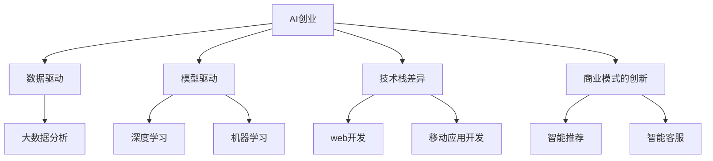

                 

## 1. 背景介绍

### 1.1 问题由来

随着人工智能技术的迅猛发展，AI创业成为了科技领域的新风向标。从最早的语音识别、图像处理，到近年来的自然语言处理、计算机视觉等，AI技术正以令人瞩目的速度渗透到各行各业。与此同时，互联网行业也在持续演进，从PC互联网到移动互联网，再到今天的全场景、全链路智能应用，互联网创业也在不断开辟新的疆域。

然而，AI创业与传统互联网创业相比，无论是创业理念、技术实现，还是商业模式，都存在着显著的差异。了解这些差异，将有助于创业者更好地理解AI创业的特点和挑战，为其创业之路提供有价值的参考和指导。

### 1.2 问题核心关键点

AI创业与传统互联网创业的异同，主要体现在以下几个关键点：

1. **技术栈差异**：AI创业主要依赖于深度学习、机器学习等算法，需要大量的数据和计算资源；而传统互联网创业更多依赖于web开发、移动应用开发等技术栈。
2. **数据驱动与模型驱动**：AI创业的核心在于数据和模型的深度结合，对数据的依赖程度较高；而传统互联网创业更多依赖于业务逻辑、用户体验等非技术因素。
3. **商业模式的创新**：AI创业可以创新性地结合大数据分析、算法推荐、智能客服等AI技术，形成新的商业闭环；而传统互联网创业则更多依赖于传统电商、社交媒体、内容分发等模式。
4. **应用场景的多样性**：AI创业的应用场景非常广泛，包括智能制造、智慧医疗、自动驾驶等；而传统互联网创业则更多集中于电商、社交、娱乐等领域。

## 2. 核心概念与联系

### 2.1 核心概念概述

为更好地理解AI创业与传统互联网创业的异同，本节将介绍几个关键概念及其联系：

1. **AI创业**：指利用人工智能技术进行产品研发和商业模式创新的创业行为。其核心在于通过深度学习、机器学习等算法，实现对数据的深度理解和智能决策。

2. **传统互联网创业**：指利用互联网技术进行产品研发和商业模式创新的创业行为。其核心在于通过web开发、移动应用开发等技术栈，实现对用户需求的高效响应和产品创新。

3. **数据驱动**：指在产品设计、业务运营中，利用大数据分析和机器学习模型进行决策。其核心在于数据的收集、分析和利用，以实现对市场趋势的精准把握。

4. **模型驱动**：指在产品设计和业务运营中，利用深度学习、机器学习等算法，构建和优化模型，以实现对用户行为、市场环境的智能预测和决策。

5. **技术栈差异**：指AI创业与传统互联网创业在技术实现上的差异，AI创业更依赖于深度学习、机器学习等算法，而传统互联网创业更多依赖于web开发、移动应用开发等技术栈。

6. **商业模式的创新**：指AI创业可以结合大数据分析、算法推荐、智能客服等AI技术，创新性地形成新的商业闭环，如智能推荐系统、智能客服系统等；而传统互联网创业则更多依赖于传统电商、社交媒体、内容分发等模式。

这些概念之间的逻辑关系可以通过以下Mermaid流程图来展示：



这个流程图展示了两者的核心概念及其联系：

1. AI创业主要依赖数据和模型驱动，通过深度学习、机器学习等算法实现对数据的深度理解和智能决策。
2. AI创业的技术栈差异较大，需要大量数据和计算资源。
3. AI创业的商业模式创新，结合大数据分析、算法推荐、智能客服等AI技术，形成新的商业闭环。
4. 传统互联网创业更多依赖web开发、移动应用开发等技术栈，通过业务逻辑、用户体验等非技术因素进行产品创新。

## 3. 核心算法原理 & 具体操作步骤
### 3.1 算法原理概述

AI创业与传统互联网创业的核心区别在于对数据和模型的依赖程度。AI创业的算法原理主要包括以下几个方面：

1. **深度学习**：通过多层神经网络，对数据进行特征提取和模式识别，实现对复杂任务的自动化处理。
2. **机器学习**：通过构建模型，对数据进行训练和预测，实现对未知数据的泛化能力。
3. **自然语言处理**：利用深度学习模型，对自然语言进行理解、生成和推理，实现对文本数据的智能处理。

### 3.2 算法步骤详解

AI创业的算法步骤主要包括以下几个环节：

1. **数据收集与预处理**：收集并清洗海量数据，为模型训练提供数据支持。
2. **模型训练与调优**：构建深度学习模型，使用训练数据进行训练，并通过调优提高模型精度。
3. **模型评估与验证**：使用测试数据评估模型性能，调整模型参数，确保模型泛化能力。
4. **模型部署与应用**：将训练好的模型部署到生产环境，实现对实际业务场景的智能支持。

### 3.3 算法优缺点

AI创业的算法优点包括：

1. **自动化程度高**：通过深度学习和机器学习算法，可以实现对数据的高自动化处理，减少人工干预。
2. **泛化能力强**：深度学习模型具有较强的泛化能力，可以适应多种场景和数据类型。
3. **决策透明化**：通过可解释性技术，可以解释模型的决策过程，提高决策透明度。

AI创业的算法缺点包括：

1. **数据依赖性强**：深度学习模型需要大量高质量的数据进行训练，数据获取成本较高。
2. **计算资源消耗大**：深度学习模型训练和推理需要大量计算资源，对硬件要求较高。
3. **模型复杂度高**：深度学习模型结构复杂，难以调试和维护。

### 3.4 算法应用领域

AI创业的算法应用领域非常广泛，主要包括：

1. **智能推荐系统**：如电商平台的商品推荐、视频网站的个性化推荐等。
2. **智能客服系统**：如基于自然语言处理的智能客服机器人。
3. **图像识别**：如自动驾驶中的道路识别、医疗影像分析等。
4. **语音识别**：如智能音箱、语音助手等。
5. **自然语言处理**：如智能聊天机器人、文本摘要生成等。

## 4. 数学模型和公式 & 详细讲解 & 举例说明

### 4.1 数学模型构建

以智能推荐系统为例，其数学模型构建主要包括：

1. **用户-商品相似度矩阵**：使用协同过滤算法构建用户与商品的相似度矩阵，如基于余弦相似度的模型。
2. **用户兴趣向量**：通过深度学习模型，对用户行为数据进行训练，得到用户兴趣向量。
3. **商品特征向量**：通过深度学习模型，对商品属性数据进行训练，得到商品特征向量。
4. **推荐算法**：使用矩阵分解、梯度下降等算法，计算用户对商品的推荐概率。

### 4.2 公式推导过程

以协同过滤算法为例，其公式推导过程如下：

1. **余弦相似度计算**：用户i和商品j的相似度为：
   $$
   \cos \theta = \frac{\mathbf{u}_i \cdot \mathbf{v}_j}{\|\mathbf{u}_i\| \cdot \|\mathbf{v}_j\|}
   $$
   其中 $\mathbf{u}_i$ 为用户i的兴趣向量，$\mathbf{v}_j$ 为商品j的属性向量。

2. **推荐概率计算**：用户i对商品j的推荐概率为：
   $$
   p(i,j) = \frac{\mathbf{u}_i \cdot \mathbf{v}_j}{\sum_k \mathbf{u}_i \cdot \mathbf{v}_k}
   $$
   其中 $k$ 为所有商品的编号。

### 4.3 案例分析与讲解

以电商平台的商品推荐系统为例，其数学模型和算法实现如下：

1. **数据收集**：从电商平台收集用户行为数据和商品属性数据。
2. **数据预处理**：对数据进行清洗、归一化等处理。
3. **模型训练**：使用深度学习模型对用户行为数据进行训练，得到用户兴趣向量。
4. **相似度计算**：使用余弦相似度计算用户与商品的相似度。
5. **推荐计算**：使用梯度下降算法计算用户对商品的推荐概率。
6. **模型评估**：使用测试数据评估模型性能，调整模型参数。

## 5. 项目实践：代码实例和详细解释说明

### 5.1 开发环境搭建

AI创业项目通常需要使用深度学习框架和数据处理工具。以下是Python环境搭建的步骤：

1. **安装Anaconda**：从官网下载并安装Anaconda，用于创建独立的Python环境。
2. **创建虚拟环境**：
   ```bash
   conda create -n ai-env python=3.7
   conda activate ai-env
   ```
3. **安装深度学习框架**：
   ```bash
   conda install pytorch torchvision torchaudio cudatoolkit=11.1 -c pytorch -c conda-forge
   ```

### 5.2 源代码详细实现

以下是一个简单的电商商品推荐系统的代码实现，使用TensorFlow进行模型训练：

```python
import tensorflow as tf
import numpy as np

# 用户行为数据
user_behavioas = np.random.randn(1000, 10)

# 商品属性数据
item_attributes = np.random.randn(1000, 5)

# 构建用户-商品相似度矩阵
similarity_matrix = np.dot(user_behavioas, item_attributes)

# 构建深度学习模型
model = tf.keras.Sequential([
    tf.keras.layers.Dense(10, input_dim=5, activation='relu'),
    tf.keras.layers.Dense(1, activation='sigmoid')
])

# 编译模型
model.compile(optimizer='adam', loss='binary_crossentropy', metrics=['accuracy'])

# 训练模型
model.fit(similarity_matrix, user_behavioas, epochs=10, batch_size=32)

# 计算推荐概率
recomm_score = model.predict(similarity_matrix)

# 输出推荐结果
print(recomm_score)
```

### 5.3 代码解读与分析

**代码解释**：

1. **用户行为数据**：随机生成1000个用户的行为数据，每个用户有10个行为特征。
2. **商品属性数据**：随机生成1000个商品的5个属性数据。
3. **相似度矩阵**：计算用户与商品的余弦相似度，得到一个1000x1000的相似度矩阵。
4. **深度学习模型**：构建一个包含两个全连接层的深度学习模型，第一层10个神经元，第二层1个神经元。
5. **模型编译**：编译模型，使用Adam优化器和二元交叉熵损失函数。
6. **模型训练**：使用相似度矩阵和用户行为数据进行模型训练，训练10个epoch，每个epoch使用32个样本。
7. **推荐计算**：使用训练好的模型计算用户对商品的推荐概率。
8. **输出推荐结果**：输出推荐概率结果。

**代码分析**：

1. **数据预处理**：在实际应用中，需要清洗和归一化数据，以便于模型训练。
2. **模型设计**：根据实际需求选择合适的深度学习模型结构。
3. **模型训练**：使用训练数据训练模型，并通过调优提高模型精度。
4. **推荐计算**：使用训练好的模型计算用户对商品的推荐概率，并根据推荐概率进行推荐。
5. **模型评估**：使用测试数据评估模型性能，调整模型参数。

## 6. 实际应用场景

### 6.1 智能客服系统

智能客服系统是AI创业的重要应用场景之一。传统客服方式往往需要大量人力，高峰期响应缓慢，且一致性和专业性难以保证。智能客服系统利用自然语言处理和机器学习算法，可以实现7x24小时不间断服务，快速响应客户咨询，用自然流畅的语言解答各类常见问题。

在技术实现上，可以收集企业内部的历史客服对话记录，将问题和最佳答复构建成监督数据，在此基础上对预训练语言模型进行微调。微调后的语言模型能够自动理解用户意图，匹配最合适的答案模板进行回复。对于客户提出的新问题，还可以接入检索系统实时搜索相关内容，动态组织生成回答。

### 6.2 金融舆情监测

金融机构需要实时监测市场舆论动向，以便及时应对负面信息传播，规避金融风险。传统的人工监测方式成本高、效率低，难以应对网络时代海量信息爆发的挑战。基于深度学习的文本分类和情感分析技术，为金融舆情监测提供了新的解决方案。

具体而言，可以收集金融领域相关的新闻、报道、评论等文本数据，并对其进行主题标注和情感标注。在此基础上对预训练语言模型进行微调，使其能够自动判断文本属于何种主题，情感倾向是正面、中性还是负面。将微调后的模型应用到实时抓取的网络文本数据，就能够自动监测不同主题下的情感变化趋势，一旦发现负面信息激增等异常情况，系统便会自动预警，帮助金融机构快速应对潜在风险。

### 6.3 个性化推荐系统

当前的推荐系统往往只依赖用户的历史行为数据进行物品推荐，无法深入理解用户的真实兴趣偏好。基于深度学习的个性化推荐系统可以更好地挖掘用户行为背后的语义信息，从而提供更精准、多样的推荐内容。

在实践中，可以收集用户浏览、点击、评论、分享等行为数据，提取和用户交互的物品标题、描述、标签等文本内容。将文本内容作为模型输入，用户的后续行为（如是否点击、购买等）作为监督信号，在此基础上微调预训练语言模型。微调后的模型能够从文本内容中准确把握用户的兴趣点。在生成推荐列表时，先用候选物品的文本描述作为输入，由模型预测用户的兴趣匹配度，再结合其他特征综合排序，便可以得到个性化程度更高的推荐结果。

### 6.4 未来应用展望

随着深度学习技术的发展，AI创业将在更多领域得到应用，为传统行业带来变革性影响。

在智慧医疗领域，基于深度学习的医学影像分析、病历分析、药物研发等应用将提升医疗服务的智能化水平，辅助医生诊疗，加速新药开发进程。

在智能教育领域，基于深度学习的内容推荐、学情分析、智能辅导等技术，将因材施教，促进教育公平，提高教学质量。

在智慧城市治理中，基于深度学习的城市事件监测、舆情分析、应急指挥等应用，将提高城市管理的自动化和智能化水平，构建更安全、高效的未来城市。

此外，在企业生产、社会治理、文娱传媒等众多领域，基于深度学习的AI应用也将不断涌现，为经济社会发展注入新的动力。相信随着技术的日益成熟，深度学习技术将成为各行各业的重要工具，推动人工智能技术向更广阔的领域加速渗透。

## 7. 工具和资源推荐

### 7.1 学习资源推荐

为了帮助开发者系统掌握深度学习的基本概念和实践技巧，这里推荐一些优质的学习资源：

1. 《深度学习》系列书籍：由Goodfellow等人撰写，系统介绍了深度学习的基本理论和实践方法。
2. CS231n《卷积神经网络》课程：斯坦福大学开设的计算机视觉课程，包含丰富的深度学习内容。
3. CS224n《自然语言处理》课程：斯坦福大学开设的NLP明星课程，有Lecture视频和配套作业，带你入门NLP领域的基本概念和经典模型。
4. TensorFlow官方文档：TensorFlow的官方文档，提供了丰富的API参考和样例代码。
5. PyTorch官方文档：PyTorch的官方文档，提供了全面的深度学习框架介绍和代码实现。

通过这些资源的学习实践，相信你一定能够快速掌握深度学习的基本原理和实现方法，为其创业之路提供坚实的基础。

### 7.2 开发工具推荐

高效的开发离不开优秀的工具支持。以下是几款用于深度学习开发的常用工具：

1. PyTorch：基于Python的开源深度学习框架，灵活动态的计算图，适合快速迭代研究。
2. TensorFlow：由Google主导开发的开源深度学习框架，生产部署方便，适合大规模工程应用。
3. Keras：高级神经网络API，易于上手，适合快速原型开发和实验。
4. Jupyter Notebook：交互式编程环境，方便进行实验和代码调试。
5. Git：版本控制系统，方便进行代码管理和协作开发。

合理利用这些工具，可以显著提升深度学习项目开发的效率，加速创新迭代的步伐。

### 7.3 相关论文推荐

深度学习技术的发展源于学界的持续研究。以下是几篇奠基性的相关论文，推荐阅读：

1. ImageNet Classification with Deep Convolutional Neural Networks（即AlexNet论文）：提出了卷积神经网络，开启了深度学习在计算机视觉领域的应用。
2. Deep Residual Learning for Image Recognition（即ResNet论文）：提出了残差网络结构，解决了深度网络训练中的梯度消失问题。
3. Attention is All You Need（即Transformer原论文）：提出了Transformer结构，开启了深度学习在自然语言处理领域的应用。
4. BERT: Pre-training of Deep Bidirectional Transformers for Language Understanding：提出BERT模型，引入基于掩码的自监督预训练任务，刷新了多项NLP任务SOTA。
5. Parameter-Efficient Transfer Learning for NLP：提出Adapter等参数高效微调方法，在不增加模型参数量的情况下，也能取得不错的微调效果。

这些论文代表了大深度学习技术的发展脉络。通过学习这些前沿成果，可以帮助研究者把握学科前进方向，激发更多的创新灵感。

## 8. 总结：未来发展趋势与挑战

### 8.1 总结

本文对AI创业与传统互联网创业的异同进行了全面系统的介绍。首先阐述了AI创业与传统互联网创业的核心差异，明确了深度学习技术在AI创业中的重要作用。其次，从原理到实践，详细讲解了深度学习的数学原理和关键步骤，给出了深度学习任务开发的完整代码实例。同时，本文还广泛探讨了深度学习技术在智能客服、金融舆情、个性化推荐等多个行业领域的应用前景，展示了深度学习技术的巨大潜力。此外，本文精选了深度学习技术的各类学习资源，力求为读者提供全方位的技术指引。

通过本文的系统梳理，可以看到，深度学习技术正在成为AI创业的重要引擎，极大地拓展了技术应用的范围和深度。AI创业的快速发展和落地应用，为各行各业带来了新的机遇和挑战。未来，伴随深度学习技术的持续演进，相信其将在更多领域大放异彩，深刻影响人类的生产生活方式。

### 8.2 未来发展趋势

展望未来，深度学习技术将呈现以下几个发展趋势：

1. **模型规模持续增大**：随着算力成本的下降和数据规模的扩张，深度学习模型的参数量还将持续增长。超大规模深度学习模型蕴含的丰富知识，有望支撑更加复杂多变的任务。
2. **模型结构更加多样**：未来将涌现更多创新型的深度学习模型结构，如变分自编码器、生成对抗网络等，以实现更高效、更灵活的模型表达。
3. **跨模态学习融合**：深度学习模型将更多地结合视觉、语音、文本等多种模态数据，实现跨模态的智能理解和决策。
4. **迁移学习与自监督学习**：深度学习模型将更多地利用迁移学习、自监督学习等技术，实现对新任务的快速适应和高效学习。
5. **深度学习与算法结合**：深度学习技术与算法优化、强化学习等技术的结合，将使模型具备更强的智能决策和策略学习能力。

以上趋势凸显了深度学习技术的广阔前景。这些方向的探索发展，必将进一步提升深度学习系统的性能和应用范围，为人工智能技术的发展注入新的动力。

### 8.3 面临的挑战

尽管深度学习技术已经取得了瞩目成就，但在迈向更加智能化、普适化应用的过程中，它仍面临着诸多挑战：

1. **数据依赖性强**：深度学习模型需要大量高质量的数据进行训练，数据获取成本较高。
2. **计算资源消耗大**：深度学习模型训练和推理需要大量计算资源，对硬件要求较高。
3. **模型复杂度高**：深度学习模型结构复杂，难以调试和维护。
4. **泛化能力有限**：深度学习模型在对抗样本、噪声数据上的表现仍需改进，泛化能力有待提高。
5. **可解释性不足**：深度学习模型通常缺乏可解释性，难以解释其内部工作机制和决策逻辑。
6. **伦理与安全问题**：深度学习模型可能学习到有害的偏见和信息，存在伦理与安全问题。

正视深度学习面临的这些挑战，积极应对并寻求突破，将是其迈向成熟的重要保障。

### 8.4 研究展望

面对深度学习面临的种种挑战，未来的研究需要在以下几个方面寻求新的突破：

1. **无监督学习与自适应学习**：探索无监督学习、自适应学习等方法，以减少对标注数据和计算资源的依赖。
2. **模型压缩与加速**：研究模型压缩、加速等技术，实现深度学习模型的轻量化和高效推理。
3. **跨模态融合与学习**：结合视觉、语音、文本等多种模态数据，实现跨模态的智能理解和决策。
4. **深度学习与算法结合**：结合深度学习与算法优化、强化学习等技术，实现深度学习的智能决策和策略学习。
5. **模型可解释性与伦理性**：引入可解释性技术和伦理约束，提高深度学习模型的透明度和可靠性。

这些研究方向的探索，必将引领深度学习技术迈向更高的台阶，为构建安全、可靠、可解释、可控的智能系统铺平道路。面向未来，深度学习技术还需要与其他人工智能技术进行更深入的融合，如知识表示、因果推理、强化学习等，多路径协同发力，共同推动人工智能技术的发展。

## 9. 附录：常见问题与解答

**Q1：AI创业与传统互联网创业的主要区别是什么？**

A: AI创业与传统互联网创业的主要区别在于对数据和模型的依赖程度。AI创业主要依赖数据和模型驱动，通过深度学习、机器学习等算法实现对数据的深度理解和智能决策。而传统互联网创业更多依赖web开发、移动应用开发等技术栈，通过业务逻辑、用户体验等非技术因素进行产品创新。

**Q2：AI创业项目的技术栈选择应考虑哪些因素？**

A: AI创业项目的技术栈选择应考虑以下因素：

1. **数据获取成本**：深度学习模型需要大量高质量的数据进行训练，需要考虑数据获取的难易程度。
2. **计算资源要求**：深度学习模型训练和推理需要大量计算资源，需要考虑硬件设备的性能。
3. **技术实现难度**：深度学习模型的实现难度较高，需要考虑开发团队的技术水平和经验。
4. **模型可解释性要求**：深度学习模型通常缺乏可解释性，需要考虑模型输出的透明度和可解释性。

**Q3：AI创业项目在开发过程中需要哪些工具支持？**

A: AI创业项目在开发过程中需要以下工具支持：

1. **深度学习框架**：如PyTorch、TensorFlow、Keras等，提供高效的模型构建和训练功能。
2. **数据处理工具**：如Pandas、NumPy等，提供数据预处理和分析功能。
3. **编程环境**：如Jupyter Notebook、Visual Studio Code等，提供交互式编程和代码调试功能。
4. **版本控制系统**：如Git等，提供代码管理和协作开发功能。

合理利用这些工具，可以显著提升AI创业项目的开发效率，加速创新迭代的步伐。

**Q4：AI创业项目在落地部署时需要注意哪些问题？**

A: AI创业项目在落地部署时需要注意以下问题：

1. **模型裁剪与优化**：去除不必要的层和参数，减小模型尺寸，加快推理速度。
2. **模型压缩与加速**：使用模型压缩、加速等技术，实现轻量化和高效推理。
3. **服务化封装**：将模型封装为标准化服务接口，便于集成调用。
4. **弹性伸缩**：根据请求流量动态调整资源配置，平衡服务质量和成本。
5. **监控告警**：实时采集系统指标，设置异常告警阈值，确保服务稳定性。

合理解决这些问题，可以显著提升AI创业项目的落地部署效率和效果。

**Q5：AI创业项目在商业化过程中需要注意哪些因素？**

A: AI创业项目在商业化过程中需要注意以下因素：

1. **用户需求匹配**：深入了解用户需求，设计符合用户需求的AI产品。
2. **商业模式创新**：结合深度学习技术与传统商业模式，形成新的商业闭环。
3. **伦理与安全问题**：确保AI产品符合伦理与安全要求，避免伦理与安全问题。
4. **市场推广策略**：制定有效的市场推广策略，吸引更多用户。
5. **业务落地保障**：确保AI产品在实际业务场景中的稳定性和可靠性。

合理解决这些问题，可以显著提升AI创业项目的商业化效果。

---

作者：禅与计算机程序设计艺术 / Zen and the Art of Computer Programming

