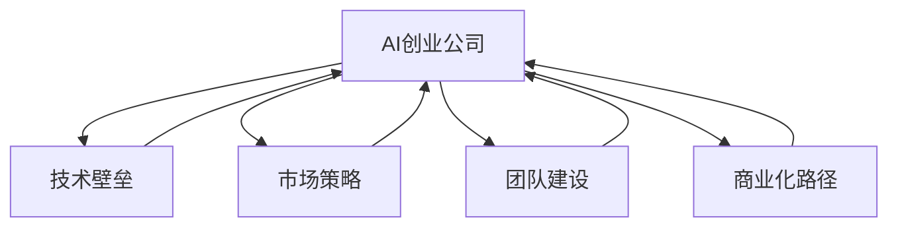

                 

# AI创业公司如何打造核心竞争力

> 关键词：AI创业公司,核心竞争力,技术壁垒,市场策略,团队建设,商业化路径

## 1. 背景介绍

在人工智能领域，创业公司的成功离不开强大的技术实力、明确的市场定位、有效的运营策略和出色的团队建设。本文将深入探讨AI创业公司如何通过技术创新、市场布局、人才招聘和商业模式等多方面的努力，打造独特的核心竞争力，实现持续发展。

## 2. 核心概念与联系

### 2.1 核心概念概述

为全面理解AI创业公司的核心竞争力，本文将介绍几个关键概念及其相互联系：

- **AI创业公司**：专注于AI技术的研发、应用及商业化，旨在解决特定行业或领域的实际问题，提升业务效率或创新体验的新型企业。

- **技术壁垒**：指企业通过长期积累的技术创新和知识产权，在市场中建立起的难以被竞争对手轻易模仿的竞争优势。

- **市场策略**：企业在目标市场中采取的一系列策略，包括产品定位、市场推广、销售渠道等，旨在实现最大化商业价值。

- **团队建设**：构建一支具有高度专业化和技术水平，能够协同工作、有效执行战略目标的团队，是创业公司成功的关键。

- **商业化路径**：指将AI技术从研发阶段转向实际应用，实现从实验室到市场的转化，并实现盈利的过程。

这些核心概念之间的关系可以用以下Mermaid流程图进行描绘：



该图展示了AI创业公司如何通过技术创新、市场策略、团队建设、商业化路径等多个维度，形成和提升其核心竞争力。

## 3. 核心算法原理 & 具体操作步骤

### 3.1 算法原理概述

打造AI创业公司的核心竞争力，需从技术创新、市场布局、人才招聘和商业模式等多个方面入手。以下将详细介绍每个方面的核心算法原理和具体操作步骤。

### 3.2 算法步骤详解

#### 3.2.1 技术创新

**3.2.1.1 算法选择与设计**
- **选择基础技术**：根据业务需求选择合适的基础算法，如机器学习、深度学习、强化学习等。
- **创新算法设计**：在现有算法基础上，通过改进算法结构、增加新算法模块等方式，设计出具有独特优势的技术方案。

**3.2.1.2 数据采集与处理**
- **数据来源**：通过公开数据集、商业数据、自收集数据等方式获取数据。
- **数据清洗与预处理**：对数据进行清洗、去重、归一化等预处理步骤，确保数据质量和一致性。

**3.2.1.3 模型训练与评估**
- **模型训练**：使用优化算法（如梯度下降、Adam等）对模型进行训练，调整超参数（如学习率、批大小等）以优化模型性能。
- **模型评估**：使用交叉验证、混淆矩阵、ROC曲线等评估方法，评估模型效果并及时调整模型结构。

**3.2.1.4 迭代优化**
- **反馈循环**：基于评估结果对模型进行迭代优化，不断提升模型准确率和泛化能力。
- **版本控制**：记录每次迭代的数据和模型参数，确保追踪历史版本，便于回溯和复现。

#### 3.2.2 市场布局

**3.2.2.1 目标市场分析**
- **市场细分**：通过市场调研、数据分析等方式，对目标市场进行细分，识别目标客户群体的需求和痛点。
- **竞争分析**：分析竞争对手的优势和劣势，确定自身的市场定位和竞争策略。

**3.2.2.2 市场推广**
- **品牌建设**：通过品牌策略、市场营销活动等方式提升品牌知名度和美誉度。
- **渠道建设**：建立线上线下多渠道销售网络，确保产品和服务的高效分发。

**3.2.2.3 客户关系管理**
- **客户画像**：基于用户数据构建客户画像，了解客户需求和行为特征。
- **客户服务**：提供高质量的客户服务和支持，增强客户满意度和忠诚度。

#### 3.2.3 人才招聘

**3.2.3.1 招聘渠道**
- **人才库建立**：通过招聘网站、行业论坛、校园招聘等渠道，构建丰富的人才库。
- **人才筛选**：设置明确的招聘标准和评估流程，筛选符合岗位需求的人才。

**3.2.3.2 人才培训**
- **基础培训**：针对新员工进行基础培训，确保其对公司文化和业务流程的熟悉。
- **进阶培训**：提供高级培训课程和技术研讨会，促进团队技术水平提升。

**3.2.3.3 激励机制**
- **薪酬体系**：制定具有市场竞争力的薪酬体系，吸引和留住优秀人才。
- **晋升机制**：建立清晰的晋升通道，激励员工不断提升专业技能和职业素养。

#### 3.2.4 商业模式

**3.2.4.1 收入模式选择**
- **订阅模式**：按月或按年收取订阅费用，提供持续性服务。
- **按需付费**：根据用户使用量或场景，收取动态费用。

**3.2.4.2 合作伙伴关系**
- **战略合作**：与大型企业、科研机构等建立战略合作关系，共享资源和技术优势。
- **生态建设**：构建完整的生态系统，吸引合作伙伴共同开发和推广产品。

**3.2.4.3 产品定价策略**
- **成本加成**：根据产品成本和市场定位，设定合理的价格区间。
- **竞争定价**：根据竞争对手的定价策略，灵活调整自身产品定价。

### 3.3 算法优缺点

#### 3.3.1 技术创新

**优点**：
- **提升竞争力**：通过技术创新，可以迅速拉开与竞争对手的差距，建立技术壁垒。
- **适应市场需求**：不断迭代优化技术方案，更灵活地适应市场需求变化。

**缺点**：
- **高成本投入**：技术研发需要大量资金和人力资源投入，风险较高。
- **技术迭代快**：技术领域变化迅速，持续投入才能保持竞争力。

#### 3.3.2 市场布局

**优点**：
- **市场占有率提升**：通过有效的市场策略，可以快速扩大市场份额，增强品牌影响力。
- **客户关系管理**：精准客户画像和高质量客户服务，提升客户满意度和忠诚度。

**缺点**：
- **市场竞争激烈**：竞争激烈的市场环境，需要持续投入才能保持优势。
- **客户获取成本高**：高成本的市场推广和客户获取，对资金和人力资源要求较高。

#### 3.3.3 人才招聘

**优点**：
- **人才储备充足**：通过系统的人才招聘和培训机制，保证团队的高效运转。
- **团队凝聚力强**：激励机制和晋升通道，提升团队凝聚力和稳定性。

**缺点**：
- **人才流失风险**：高薪水和职业发展机会，吸引外部人才的同时，也可能导致内部人才流失。
- **人才匹配难度大**：选择合适的人才库和招聘标准，需要更多的时间和精力。

#### 3.3.4 商业模式

**优点**：
- **收入来源多样化**：通过多种收入模式和合作伙伴关系，降低单一收入来源的风险。
- **市场灵活性高**：灵活的产品定价策略，适应不同市场环境和客户需求。

**缺点**：
- **竞争压力大**：市场和价格竞争激烈，需要不断创新和调整策略。
- **成本控制难度大**：收入模式多样化带来成本管理难度，需要精细化管理。

### 3.4 算法应用领域

AI创业公司核心竞争力的构建，涉及多个应用领域：

- **医疗健康**：利用AI技术进行疾病诊断、治疗方案推荐、患者管理等，提升医疗服务效率和质量。
- **金融服务**：通过AI模型进行信用评估、风险管理、投资建议等，优化金融产品和服务。
- **智能制造**：在生产流程优化、质量控制、设备维护等方面应用AI，提升制造业智能化水平。
- **教育培训**：开发智能教育平台，提供个性化学习方案、自动评分系统等，提高教育质量和学习效率。
- **智慧城市**：在城市管理、公共安全、交通控制等方面应用AI，提升城市治理水平和居民生活质量。
- **电子商务**：利用AI技术进行商品推荐、库存管理、客户行为分析等，提升电商运营效率和用户体验。

## 4. 数学模型和公式 & 详细讲解 & 举例说明

### 4.1 数学模型构建

AI创业公司的核心竞争力构建，可以通过数学模型进行量化和优化。以下以产品推荐系统为例，构建数学模型：

假设用户集合为 $U$，物品集合为 $I$，用户与物品之间的交互矩阵为 $A$，用户对物品的评分矩阵为 $R$，用户-物品协同过滤模型为 $P$。

**用户-物品协同过滤模型**：
$$ P = \max_{u,i} [R_{ui} + \alpha \cdot A_{ui}] $$

其中，$R_{ui}$ 为物品 $i$ 对用户 $u$ 的评分，$\alpha$ 为权重系数，$A_{ui}$ 为物品 $i$ 的特征表示。

**推荐结果排序**：
$$ \text{推荐列表} = \text{排序}(P_{u1}, P_{u2}, ..., P_{un}) $$

其中，$P_{ui}$ 为用户 $u$ 对物品 $i$ 的预测评分。

### 4.2 公式推导过程

**协同过滤模型推导**：
1. **用户-物品协同过滤模型**：
   - 用户对物品的评分 $R_{ui}$ 可以通过矩阵分解等方法得到，模型 $P$ 通过最大化用户对物品的评分和物品特征的影响，得出推荐结果。
   - 公式推导为：
     - $P_{ui} = \sum_{i,j} R_{ui} \cdot A_{ij}$
     - 对 $P_{ui}$ 进行排序，即可得到推荐列表。

2. **推荐结果排序**：
   - 推荐结果排序可以使用排序算法，如最大似然法、贝叶斯法等，确保推荐结果的可解释性和准确性。
   - 公式推导为：
     - $P_{ui} = R_{ui} + \alpha \cdot A_{ui}$

**推荐系统案例分析**：
- **数据准备**：收集用户行为数据、物品特征数据等，构建用户-物品交互矩阵 $A$ 和评分矩阵 $R$。
- **模型训练**：使用协同过滤模型 $P$ 进行训练，得到最优的权重系数 $\alpha$。
- **推荐结果**：根据用户 $u$ 的评分预测 $P_{ui}$，进行排序得到推荐列表。

### 4.3 案例分析与讲解

以某在线教育平台的推荐系统为例，分析如何通过协同过滤模型提升用户学习体验：

1. **数据准备**：
   - 收集用户学习记录、课程评分、用户行为等数据，构建用户-物品交互矩阵 $A$ 和评分矩阵 $R$。
   - 数据清洗和预处理，去除异常数据和噪声，确保数据质量和一致性。

2. **模型训练**：
   - 使用协同过滤模型 $P$ 进行训练，调整权重系数 $\alpha$，确保模型性能和泛化能力。
   - 通过交叉验证等评估方法，优化模型参数，提升推荐效果。

3. **推荐结果**：
   - 根据用户 $u$ 的评分预测 $P_{ui}$，排序得到推荐课程列表。
   - 通过A/B测试等方法，评估推荐效果，迭代优化推荐策略。

## 5. 项目实践：代码实例和详细解释说明

### 5.1 开发环境搭建

1. **Python环境配置**：
   - 安装Anaconda，创建虚拟环境。
   - 安装Python、NumPy、Pandas、Scikit-learn等常用库。

2. **代码管理工具**：
   - 使用Git进行代码版本控制，记录开发进程和协作状态。
   - 使用JIRA、Trello等项目管理工具，规划任务和时间节点。

3. **开发工具**：
   - 使用PyCharm、VSCode等IDE进行代码编写和调试。
   - 使用Docker、Kubernetes等容器化技术，实现代码和环境的一致性部署。

### 5.2 源代码详细实现

以下是一个基于协同过滤模型的推荐系统示例代码实现：

**数据准备**：
```python
import pandas as pd
import numpy as np

# 读取用户-物品交互矩阵
A = pd.read_csv('user_item_matrix.csv', index_col='user_id')

# 读取评分矩阵
R = pd.read_csv('rating_matrix.csv', index_col='user_id', parse_dates=True)

# 数据清洗和预处理
A = A.fillna(0)
R = R.fillna(0).astype(float)

# 构建用户评分矩阵
user_scores = R * A
```

**模型训练**：
```python
from sklearn.decomposition import TruncatedSVD

# 训练协同过滤模型
svd = TruncatedSVD(n_components=50, random_state=42)
P = svd.fit_transform(user_scores)

# 调整权重系数
alpha = 0.5
P = P + alpha * A
```

**推荐结果**：
```python
# 计算用户评分预测
user_predictions = P.dot(svd.components_.T)

# 对预测结果进行排序
user_top_items = user_predictions.argsort()[::-1][:10]

# 推荐课程列表
recommendations = [(user_id, item_id) for user_id, item_id in zip(range(len(user_predictions)), user_top_items)]
```

### 5.3 代码解读与分析

1. **数据准备**：
   - 通过Pandas库读取和处理用户-物品交互矩阵和评分矩阵，确保数据质量和一致性。
   - 数据清洗和预处理，去除异常值和噪声，提升模型性能。

2. **模型训练**：
   - 使用Scikit-learn库中的TruncatedSVD算法，训练协同过滤模型。
   - 调整权重系数 $\alpha$，确保模型平衡用户评分和物品特征的影响。

3. **推荐结果**：
   - 计算用户评分预测，得到用户对每个物品的推荐评分。
   - 对推荐评分进行排序，生成用户推荐的课程列表。

4. **运行结果展示**：
   - 使用Jupyter Notebook展示推荐结果，对比不同用户推荐列表的差异。
   - 通过可视化工具，展示推荐系统的动态变化和效果评估。

## 6. 实际应用场景

### 6.1 医疗健康

AI创业公司可以通过AI技术提升医疗服务质量，打造核心竞争力。以下介绍几个具体应用场景：

**疾病诊断**：利用深度学习模型对医疗影像、病理切片等数据进行分析，提供精准的疾病诊断。
**治疗方案推荐**：根据患者历史数据和当前症状，推荐最合适的治疗方案，提升治疗效果。
**患者管理**：通过AI技术对患者进行健康监控和管理，提供个性化的健康管理方案。

**应用案例**：某医疗AI公司通过深度学习模型，对医学影像进行自动分析，提升诊断准确率，被多家医院采用。

### 6.2 金融服务

AI创业公司可以通过AI技术优化金融服务，提升用户体验和效率。以下介绍几个具体应用场景：

**信用评估**：利用机器学习模型分析用户历史数据和行为，提供信用评分和信用报告。
**风险管理**：通过AI技术进行风险预警和风险控制，降低金融机构的损失风险。
**投资建议**：基于用户数据和市场行情，提供个性化的投资建议和资产配置方案。

**应用案例**：某金融科技公司通过信用评估模型，提供实时信用评估服务，帮助金融机构快速审批贷款，提高审批效率。

### 6.3 智能制造

AI创业公司可以通过AI技术提升制造业智能化水平，打造核心竞争力。以下介绍几个具体应用场景：

**生产流程优化**：利用机器学习模型对生产数据进行分析，优化生产流程和资源配置。
**质量控制**：通过AI技术进行产品检测和质量控制，减少次品率和生产成本。
**设备维护**：利用AI技术对设备进行实时监控和预测维护，延长设备使用寿命。

**应用案例**：某智能制造公司通过AI技术，优化生产流程，提升产品质量，降低生产成本，被多家制造业企业采用。

### 6.4 未来应用展望

未来，AI创业公司将在更多领域实现应用突破，构建更强的核心竞争力：

**智慧城市**：通过AI技术优化城市管理，提升城市治理水平和居民生活质量。
**智能教育**：利用AI技术提供个性化教育方案，提升教育质量和学习效率。
**智慧农业**：通过AI技术优化农业生产，提升农业生产效率和农产品品质。
**智能交通**：利用AI技术优化交通管理，提升交通效率和安全性。

## 7. 工具和资源推荐

### 7.1 学习资源推荐

1. **《深度学习》书籍**：Ian Goodfellow等著，全面介绍深度学习原理和应用。
2. **Kaggle竞赛平台**：提供大量数据集和竞赛机会，帮助学习者提升实战能力。
3. **Coursera平台**：提供多门AI相关课程，包括机器学习、深度学习等。
4. **GitHub开源项目**：提供丰富的代码实现和开源项目，学习者可参考和复现。

### 7.2 开发工具推荐

1. **PyTorch框架**：灵活的动态计算图，适用于深度学习模型开发。
2. **TensorFlow框架**：功能强大的静态计算图，适用于大规模模型训练。
3. **Jupyter Notebook**：互动式的开发环境，方便代码编写和实时调试。
4. **Docker容器**：可移植和可重复的开发环境，方便代码和环境的一致性部署。

### 7.3 相关论文推荐

1. **《深度学习》论文**：Ian Goodfellow等著，深度学习领域的经典教材。
2. **《机器学习实战》书籍**：Peter Harrington著，全面介绍机器学习算法和应用。
3. **《计算机视觉：模型、学习和推理》书籍**：Simon J.D. Prince等著，介绍计算机视觉基础和应用。
4. **《自然语言处理综论》书籍**：Daniel Jurafsky和James H. Martin著，介绍自然语言处理基础和应用。

## 8. 总结：未来发展趋势与挑战

### 8.1 研究成果总结

AI创业公司通过技术创新、市场布局、人才招聘和商业模式等多方面的努力，构建了强大的核心竞争力。以下总结其主要研究成果：

1. **技术创新**：通过持续的技术研发和创新，打造具有独特竞争优势的技术壁垒。
2. **市场布局**：通过有效的市场策略和客户关系管理，扩大市场份额和提升品牌影响力。
3. **人才招聘**：通过系统的人才招聘和培训机制，构建高水平的技术团队。
4. **商业模式**：通过多元化的收入模式和合作伙伴关系，降低单一收入来源的风险。

### 8.2 未来发展趋势

未来，AI创业公司将继续在技术创新、市场布局、人才招聘和商业模式等方面不断突破：

1. **技术创新**：通过前沿技术的研发，提升产品性能和竞争力。
2. **市场布局**：通过全球化布局和多元化市场策略，扩大市场份额和提升品牌影响力。
3. **人才招聘**：通过全球招聘和多样化的人才培养计划，吸引和留住顶尖人才。
4. **商业模式**：通过多样化的收入模式和合作伙伴关系，降低风险和提升盈利能力。

### 8.3 面临的挑战

尽管AI创业公司在核心竞争力构建上取得了一定的成就，但仍面临诸多挑战：

1. **技术壁垒保护**：竞争对手快速跟进和模仿，需要持续投入研发。
2. **市场竞争激烈**：市场份额的争夺，需要创新和优化市场策略。
3. **人才流失风险**：高薪水和职业发展机会，吸引外部人才的同时，也可能导致内部人才流失。
4. **成本控制难度**：收入模式多样化带来成本管理难度，需要精细化管理。

### 8.4 研究展望

未来，AI创业公司在核心竞争力构建上需要进一步研究和突破：

1. **技术创新**：研发更加先进和高效的技术算法，提升产品性能和竞争力。
2. **市场布局**：构建全球化市场布局和多元化市场策略，扩大市场份额和提升品牌影响力。
3. **人才招聘**：全球招聘和多样化的人才培养计划，吸引和留住顶尖人才。
4. **商业模式**：探索和实践多样化的收入模式和合作伙伴关系，降低风险和提升盈利能力。

## 9. 附录：常见问题与解答

### Q1：AI创业公司如何选择合适的技术基础？

A: AI创业公司需要根据业务需求和技术成熟度选择合适的技术基础。可以参考以下几个方面：

1. **技术适用性**：选择能够满足业务需求的成熟技术。
2. **技术成熟度**：选择技术成熟度和稳定性较高的技术。
3. **技术社区支持**：选择有活跃社区支持的技术，便于技术交流和问题解决。

### Q2：AI创业公司如何构建高效的项目管理团队？

A: AI创业公司需要构建高效的项目管理团队，可以从以下几个方面入手：

1. **明确项目目标**：明确项目目标和阶段，制定详细的项目计划和时间节点。
2. **合理分配资源**：根据项目需求和团队能力，合理分配人力和物力资源。
3. **建立沟通机制**：建立高效的沟通机制，确保团队成员之间的信息共享和协作。
4. **定期评估和调整**：定期评估项目进展和效果，及时调整和优化项目计划。

### Q3：AI创业公司如何保障数据安全和隐私？

A: AI创业公司需要高度重视数据安全和隐私保护，可以从以下几个方面入手：

1. **数据加密**：对敏感数据进行加密处理，确保数据传输和存储的安全性。
2. **访问控制**：设置严格的访问控制机制，确保只有授权人员可以访问敏感数据。
3. **隐私保护**：采用隐私保护技术，如差分隐私、联邦学习等，保护用户隐私。
4. **合规性审查**：确保数据处理和应用符合相关法律法规和行业标准。

### Q4：AI创业公司如何实现商业化落地？

A: AI创业公司需要制定详细的商业化落地策略，可以从以下几个方面入手：

1. **市场需求分析**：通过市场调研和数据分析，识别市场需求和痛点。
2. **产品定位**：根据市场需求和业务目标，确定产品的定位和功能。
3. **合作伙伴关系**：与大型企业、科研机构等建立战略合作关系，共同推动产品商业化。
4. **市场推广**：制定有效的市场推广策略，提高产品知名度和市场占有率。

### Q5：AI创业公司如何应对市场竞争？

A: AI创业公司需要制定有效的市场竞争策略，可以从以下几个方面入手：

1. **差异化定位**：明确产品差异化优势，提升品牌竞争力。
2. **持续创新**：不断进行技术研发和产品创新，保持市场领先地位。
3. **市场细分**：根据市场细分，针对不同用户群体制定差异化的营销策略。
4. **客户服务**：提供高质量的客户服务，提升客户满意度和忠诚度。

通过系统性的理论阐述和实践案例，本文深入探讨了AI创业公司如何通过技术创新、市场布局、人才招聘和商业模式等多方面的努力，构建强大的核心竞争力，实现持续发展。AI创业公司需要不断提升技术实力、优化市场策略、强化团队建设，并积极探索商业化路径，方能在激烈的市场竞争中脱颖而出。

作者：禅与计算机程序设计艺术 / Zen and the Art of Computer Programming

