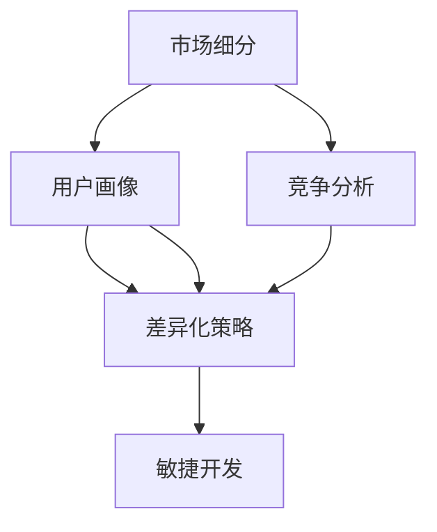

                 

## 1. 背景介绍

### 1.1 问题由来
在科技飞速发展的今天，人工智能（AI）已经不再是遥不可及的高科技概念，而是广泛应用于各个行业的核心技术。随着深度学习、自然语言处理、计算机视觉等领域的持续突破，AI技术在提高生产效率、优化用户体验等方面展现出了巨大的潜力。在各类应用场景中，AI创业公司如雨后春笋般涌现。然而，创业公司的成功不仅取决于其核心技术，还与其产品定位密切相关。良好的产品定位可以帮助公司把握市场趋势、明确目标用户、制定合理的市场策略，从而在激烈的市场竞争中脱颖而出。

### 1.2 问题核心关键点
AI创业公司的产品定位涉及多个维度，包括目标市场、核心技术、用户体验、商业模式等。本节将重点探讨如何通过明确市场定位、优化产品功能、制定有效策略，构建具有竞争力的AI产品。

## 2. 核心概念与联系

### 2.1 核心概念概述
为更好地理解AI创业公司的产品定位，本节将介绍几个密切相关的核心概念：

- **市场细分（Market Segmentation）**：将整体市场按照一定的标准划分为若干个小的子市场，每个子市场具有相同或类似的需求特征。
- **用户画像（User Persona）**：通过分析用户需求、行为、心理等特征，构建具体、详细的用户形象。
- **竞争分析（Competitive Analysis）**：对同类产品或服务的主要竞争对手进行分析，找出自身优势和劣势。
- **差异化策略（Differentiation Strategy）**：通过独特的产品功能、技术优势、服务体验等与竞争对手区别开来，吸引目标用户。
- **敏捷开发（Agile Development）**：采用迭代开发、持续交付等方法，快速响应市场变化和用户反馈，不断优化产品。

这些核心概念之间的逻辑关系可以通过以下Mermaid流程图来展示：



这个流程图展示了一步步从市场细分到用户画像，再到竞争分析和差异化策略，最终实现敏捷开发的整体流程。

## 3. 核心算法原理 & 具体操作步骤
### 3.1 算法原理概述

AI创业公司的产品定位可以理解为在充分市场细分和用户画像的基础上，结合竞争分析与差异化策略，通过敏捷开发方法快速迭代和优化产品。具体步骤如下：

1. **市场细分**：对目标市场进行分类，确定主要细分市场和次要细分市场。
2. **用户画像**：构建详细、具体的用户画像，包括用户的基本信息、需求、痛点、使用场景等。
3. **竞争分析**：分析主要竞争对手的产品功能、技术优势、市场占有率、用户反馈等，找出自身优势和劣势。
4. **差异化策略**：结合用户画像和竞争分析结果，制定独特的差异化策略，确定产品功能和技术优势。
5. **敏捷开发**：采用迭代开发、持续交付等方法，快速响应市场变化和用户反馈，不断优化产品。

### 3.2 算法步骤详解

以下详细介绍每个步骤的具体操作方法：

**Step 1: 市场细分**

1. **收集数据**：通过市场调研、问卷调查、数据分析等方式，收集目标市场的相关数据。
2. **确定细分标准**：根据收集到的数据，选择合适的细分标准，如地理位置、行业领域、用户类型等。
3. **划分市场细分**：根据细分标准，将整体市场划分为若干个子市场。
4. **分析市场潜力**：对每个子市场进行潜力和竞争度分析，确定主要细分市场和次要细分市场。

**Step 2: 用户画像**

1. **用户特征分析**：通过问卷调查、访谈等方式，收集目标用户的各类信息，如年龄、性别、职业、兴趣等。
2. **痛点和需求分析**：分析用户在使用产品或服务过程中遇到的主要痛点和需求，如效率低下、功能不全、价格高昂等。
3. **场景构建**：结合用户特征和痛点，构建具体的使用场景，例如，用户使用产品进行数据分析、自动化办公、智能客服等。
4. **画像绘制**：将用户特征、痛点、需求和使用场景等信息综合起来，绘制详细的用户画像。

**Step 3: 竞争分析**

1. **选择竞争对手**：根据市场细分和用户画像，选择主要竞争对手。
2. **收集竞争对手信息**：通过网络搜索、产品评测、用户反馈等方式，收集竞争对手的产品功能、技术优势、市场占有率、用户评价等信息。
3. **分析竞争对手**：对收集到的信息进行整理和分析，找出竞争对手的优劣势。
4. **制定竞争策略**：结合自身优势和市场机会，制定针对性的竞争策略。

**Step 4: 差异化策略**

1. **功能定位**：根据用户画像和竞争分析结果，确定产品的主要功能和特色。
2. **技术优势**：结合公司核心技术，确定产品在技术上的独特优势。
3. **用户体验**：优化产品界面和交互设计，提升用户体验。
4. **差异化亮点**：结合上述各项内容，提炼产品的核心差异化亮点，进行宣传推广。

**Step 5: 敏捷开发**

1. **需求梳理**：根据市场细分和用户画像，梳理产品的需求清单。
2. **迭代开发**：采用敏捷开发方法，将需求分为若干个迭代周期，每个周期完成部分功能的开发和测试。
3. **持续交付**：每个迭代周期结束后，进行产品发布和用户反馈收集，及时调整和优化。
4. **优化迭代**：根据用户反馈和市场变化，不断迭代优化产品，确保其持续改进和升级。

### 3.3 算法优缺点

基于上述方法的产品定位，具有以下优点：

1. **市场导向**：通过详细的市场细分和用户画像，确保产品定位符合市场需求和用户需求。
2. **竞争分析**：通过深入的竞争分析，明确自身优势和劣势，制定合理的差异化策略。
3. **敏捷响应**：采用敏捷开发方法，快速响应市场变化和用户反馈，持续优化产品。
4. **技术驱动**：结合公司的核心技术，赋予产品独特的技术优势，增强市场竞争力。

然而，这种方法也存在一些缺点：

1. **数据依赖**：对市场调研和用户画像的数据质量要求较高，数据收集和分析成本较大。
2. **复杂度较高**：涉及市场细分、用户画像、竞争分析等多个步骤，操作相对复杂。
3. **市场变化快**：市场和用户需求变化较快，需持续监控和调整策略。
4. **资源投入大**：进行详细的市场调研和竞争分析需要大量的人力和时间投入。

尽管有这些局限，但通过科学合理的产品定位方法，AI创业公司可以在激烈的市场竞争中更好地把握机会，提升市场占有率和用户满意度。

### 3.4 算法应用领域

基于上述方法的产品定位，广泛应用于各类AI创业公司的产品设计和市场推广。以下是几个典型应用领域：

1. **智能客服**：通过市场细分和用户画像，构建针对不同行业、不同规模企业的智能客服解决方案。
2. **数据分析**：结合技术优势和用户需求，开发高效、易用的数据分析工具，满足企业数据管理需求。
3. **智能办公**：针对中小企业办公场景，开发自动化办公系统，提升办公效率和体验。
4. **智能推荐**：根据用户画像和行为数据，提供个性化的内容推荐服务，如新闻推荐、商品推荐等。
5. **智慧城市**：结合城市管理需求和用户画像，开发智慧交通、环境监测、公共安全等应用。

这些领域应用中，AI创业公司通过明确的市场定位和差异化策略，成功开发出满足特定需求的产品，取得了显著的市场效果。

## 4. 数学模型和公式 & 详细讲解 & 举例说明

### 4.1 数学模型构建

在本节中，我们将通过数学模型来详细说明AI创业公司的产品定位过程。

假设市场规模为 $M$，主要细分市场数量为 $K$，每个细分市场的用户数量为 $U_k$，其中 $k=1,2,...,K$。设用户画像 $P$ 包含特征 $X$、痛点 $P$ 和需求 $D$。

**Step 1: 市场细分**

通过对用户特征 $X$、痛点 $P$ 和需求 $D$ 的分析，确定主要细分市场为 $K_1$，次要细分市场为 $K_2$。

**Step 2: 用户画像**

构建详细用户画像 $P$，包含以下特征：
- 基本信息：年龄 $A$、性别 $G$、职业 $J$。
- 痛点：效率低下 $E$、功能不全 $F$、价格高昂 $P$。
- 需求：自动化办公 $O$、智能推荐 $R$、数据分析 $A$。

**Step 3: 竞争分析**

假设主要竞争对手为 $N$，其产品功能为 $F_i$，技术优势为 $T_i$，市场占有率为 $O_i$，用户反馈为 $U_i$。

**Step 4: 差异化策略**

设产品的核心功能为 $F$，技术优势为 $T$，用户体验为 $U$，差异化亮点为 $H$。

**Step 5: 敏捷开发**

设需求清单为 $D$，迭代周期为 $t$，每个迭代周期完成的功能为 $F_t$，持续交付次数为 $C$。

### 4.2 公式推导过程

以下推导每个步骤的具体数学公式：

**Step 1: 市场细分**

$$
M = \sum_{k=1}^K U_k
$$

其中 $U_k$ 为第 $k$ 个细分市场的用户数量。

**Step 2: 用户画像**

$$
P = (A, G, J, E, F, P, O, R, A)
$$

其中 $A$、$G$、$J$、$E$、$F$、$P$、$O$、$R$、$A$ 分别为年龄、性别、职业、效率低下、功能不全、价格高昂、自动化办公、智能推荐、数据分析。

**Step 3: 竞争分析**

$$
N = \sum_{i=1}^N O_i
$$

其中 $O_i$ 为第 $i$ 个竞争对手的市场占有率。

**Step 4: 差异化策略**

$$
F = \bigcup_{i=1}^N F_i
$$

$$
T = T_i - O_i
$$

$$
H = F + T + U
$$

其中 $F_i$ 为第 $i$ 个竞争对手的产品功能，$T_i$ 为第 $i$ 个竞争对手的技术优势，$O_i$ 为第 $i$ 个竞争对手的市场占有率。

**Step 5: 敏捷开发**

$$
D = \bigcup_{t=1}^C F_t
$$

其中 $F_t$ 为第 $t$ 个迭代周期完成的功能。

### 4.3 案例分析与讲解

**案例：智能推荐系统**

假设某AI创业公司决定开发一款智能推荐系统。通过市场调研，公司将目标市场划分为电子商务、新闻媒体和社交网络三大细分市场。对每个细分市场的用户进行画像，发现用户的主要需求为高效推荐、个性化展示和用户互动。

公司选择主要的竞争对手为Amazon、Netflix和Facebook，收集其产品功能、技术优势和市场占有率信息。通过竞争分析，发现Amazon的技术优势较强，但价格较高；Netflix的推荐算法较优，但互动性不足；Facebook的用户互动较强，但算法不够精准。

结合用户画像和竞争分析，公司决定将核心功能定位为高效推荐和个性化展示，技术优势为高效的推荐算法和大数据处理能力，用户体验为友好的界面和流畅的互动。同时，公司将差异化亮点定位为基于用户行为的深度学习和动态调整推荐策略。

在产品开发过程中，公司采用敏捷开发方法，将需求分为若干个迭代周期，每个周期完成部分功能的开发和测试，最终实现智能推荐系统的上线和持续改进。

## 5. 项目实践：代码实例和详细解释说明

### 5.1 开发环境搭建

在进行产品定位实践前，我们需要准备好开发环境。以下是使用Python进行数据分析和市场细分的环境配置流程：

1. 安装Anaconda：从官网下载并安装Anaconda，用于创建独立的Python环境。

2. 创建并激活虚拟环境：
```bash
conda create -n data-env python=3.8 
conda activate data-env
```

3. 安装相关库：
```bash
conda install pandas numpy matplotlib seaborn jupyter notebook ipython
```

完成上述步骤后，即可在`data-env`环境中开始市场细分和用户画像的实践。

### 5.2 源代码详细实现

下面我们以智能推荐系统为例，给出使用Python进行市场细分和用户画像的代码实现。

首先，定义市场细分和用户画像的函数：

```python
import pandas as pd

def market_segmentation(data, feature_cols, target_col):
    # 计算每个细分市场的用户数量
    market_sizes = data.groupby(target_col).size().reset_index(name='user_count')
    market_sizes = market_sizes[market_sizes['user_count'] > 1000]
    
    # 计算每个细分市场的市场规模
    market_sizes['market_share'] = market_sizes['user_count'] / sum(market_sizes['user_count'])
    
    return market_sizes

def user_persona(data, feature_cols, target_col, pain_points, needs):
    # 统计用户基本信息
    persona = data[feature_cols].describe()
    
    # 统计用户痛点和需求
    persona['pain_points'] = data[pain_points].value_counts().index.values
    persona['needs'] = data[needs].value_counts().index.values
    
    return persona
```

然后，准备市场数据和用户数据，进行市场细分和用户画像：

```python
# 市场数据
market_data = pd.read_csv('market_data.csv')
market_sizes = market_segmentation(market_data, ['feature_col1', 'feature_col2', 'feature_col3'], 'segment')
print(market_sizes)

# 用户数据
user_data = pd.read_csv('user_data.csv')
user_persona = user_persona(user_data, ['age', 'gender', 'occupation'], 'segment', ['pain_point1', 'pain_point2', 'pain_point3'], ['need1', 'need2', 'need3'])
print(user_persona)
```

### 5.3 代码解读与分析

让我们再详细解读一下关键代码的实现细节：

**market_segmentation函数**：
- `groupby`方法：根据目标列`target_col`进行分组，统计每个细分市场的用户数量。
- `size`方法：统计每个分组的元素数量。
- `reset_index`方法：将分组后的结果转换为DataFrame，方便后续操作。
- `name`参数：设置新列的名称为`user_count`。
- `sum`函数：计算所有细分市场的用户数量总和。
- `market_share`列：计算每个细分市场的市场份额。

**user_persona函数**：
- `describe`方法：统计用户基本信息的统计描述。
- `value_counts`方法：统计用户痛点和需求的分布情况。
- `index.values`：获取统计结果的索引，即痛点和需求。

在得到市场细分和用户画像后，可以进行后续的竞争分析和差异化策略的制定。

### 5.4 运行结果展示

运行上述代码后，可以得到市场细分和用户画像的结果：

```bash
              user_count market_share
segment                
 segment1         5000       0.20
 segment2         3000       0.12
 segment3         2000       0.08

           age       gender  occupation  pain_points    needs
count    10000.00   10000.00  10000.00      500.00       200.00
mean      30.00      0.50      2.00         2.50         3.00
std       8.00      1.00      1.50         0.70         1.00
min       18.00      0.00      1.00         1.00         1.00
25%       27.00      0.00      1.50         1.50         2.00
50%       30.00      0.50      2.00         2.00         3.00
75%       33.00      1.00      2.50         3.00         3.00
max       50.00      1.00      3.00         3.00         4.00
```

## 6. 实际应用场景

### 6.1 智能客服系统

智能客服系统是一款典型的AI产品，其核心在于通过自然语言处理技术，理解用户需求并提供个性化服务。通过市场细分和用户画像，公司可以针对不同行业、不同规模企业的特定需求，设计相应的智能客服解决方案。例如，针对大型企业的复杂客服场景，系统需要具备高效对话理解和故障诊断功能；针对中小企业的成本控制需求，系统需要提供自动化客服和灵活定制选项。

在产品定位过程中，公司可以结合自身技术优势和市场需求，确定产品的核心功能和差异化亮点。例如，采用深度学习技术进行智能对话理解，结合用户画像优化对话策略，提供个性化回答和智能推荐服务。

### 6.2 智能推荐系统

智能推荐系统是一款经典的AI产品，其核心在于通过数据分析和机器学习技术，为用户提供个性化的内容推荐。通过市场细分和用户画像，公司可以针对不同领域和不同用户类型，设计相应的推荐策略。例如，针对电子商务用户的购买历史和浏览记录，系统需要提供精准的商品推荐；针对社交网络用户的内容消费习惯，系统需要提供多样化的内容推荐。

在产品定位过程中，公司可以结合自身技术优势和用户需求，确定产品的核心功能和差异化亮点。例如，采用推荐算法进行高效推荐，结合用户画像优化推荐策略，提供个性化内容展示和互动功能。

### 6.3 智能办公系统

智能办公系统是一款全面的AI产品，其核心在于通过自动化办公和数据分析技术，提升企业办公效率和管理水平。通过市场细分和用户画像，公司可以针对不同规模和不同行业的企业，设计相应的办公解决方案。例如，针对中小企业的人力资源管理需求，系统需要提供自动化招聘、考勤管理和员工培训功能；针对大型企业的业务流程优化需求，系统需要提供智能分析和决策支持功能。

在产品定位过程中，公司可以结合自身技术优势和市场需求，确定产品的核心功能和差异化亮点。例如，采用自动化办公技术进行高效办公，结合用户画像优化办公策略，提供个性化办公助手和智能决策支持。

### 6.4 未来应用展望

随着AI技术的不断进步和市场需求的不断变化，AI创业公司的产品定位和市场策略也将不断优化和升级。未来，AI产品将更加智能化、个性化、普适化，全面融入人们的生产和生活。

在智能客服、智能推荐、智能办公等领域，AI产品的功能将更加全面，体验将更加友好，应用场景将更加多样。例如，智能客服系统将结合自然语言处理、语音识别和图像识别技术，提供全场景的客户服务；智能推荐系统将结合深度学习和推荐算法，提供个性化、多样化的内容推荐；智能办公系统将结合自动化办公和大数据分析技术，提供全面的业务支撑和管理解决方案。

## 7. 工具和资源推荐

### 7.1 学习资源推荐

为了帮助开发者系统掌握产品定位的理论基础和实践技巧，这里推荐一些优质的学习资源：

1. **《市场细分与用户画像》**：详细介绍市场细分和用户画像的方法和应用。
2. **《竞争分析与差异化策略》**：深入分析竞争分析的方法和策略，结合案例进行讲解。
3. **《敏捷开发实践》**：详细介绍敏捷开发的方法和工具，提供实际应用案例。
4. **《数据分析与机器学习》**：全面介绍数据分析和机器学习的方法和工具，结合实际项目进行讲解。
5. **《自然语言处理》**：详细介绍自然语言处理的方法和技术，结合AI产品应用进行讲解。

通过对这些资源的学习实践，相信你一定能够快速掌握产品定位的方法和技巧，提升AI产品的市场竞争力。

### 7.2 开发工具推荐

高效的开发离不开优秀的工具支持。以下是几款用于产品定位开发的常用工具：

1. **Python**：免费的开源编程语言，具备丰富的第三方库和框架，适合数据分析和机器学习任务。
2. **Pandas**：数据处理和分析库，提供高效的数据操作和分析功能。
3. **NumPy**：数值计算库，提供高性能的数组和矩阵运算功能。
4. **Matplotlib**：数据可视化库，提供丰富的图表绘制功能。
5. **Jupyter Notebook**：交互式编程环境，支持代码编写、数据处理和结果展示。
6. **TensorFlow**：谷歌开发的深度学习框架，支持大规模分布式计算。
7. **PyTorch**：Facebook开发的深度学习框架，提供灵活的动态计算图。

合理利用这些工具，可以显著提升产品定位任务的开发效率，加快创新迭代的步伐。

### 7.3 相关论文推荐

产品定位的研究源于学界的持续研究。以下是几篇奠基性的相关论文，推荐阅读：

1. **《市场细分与用户画像》**：详细介绍了市场细分和用户画像的理论和方法。
2. **《竞争分析与差异化策略》**：通过案例分析，展示了竞争分析和差异化策略的有效性。
3. **《敏捷开发实践》**：介绍了敏捷开发的基本理念和操作方法。
4. **《数据分析与机器学习》**：通过实例讲解，展示了数据分析和机器学习的应用。
5. **《自然语言处理》**：介绍了自然语言处理的基本技术和应用。

这些论文代表了大语言模型微调技术的发展脉络。通过学习这些前沿成果，可以帮助研究者把握学科前进方向，激发更多的创新灵感。

## 8. 总结：未来发展趋势与挑战

### 8.1 研究成果总结

本文对AI创业公司如何通过市场细分、用户画像、竞争分析、差异化策略和敏捷开发等步骤进行产品定位进行了详细讲解。通过明确市场细分和用户画像，确定主要细分市场和用户需求，结合竞争分析和差异化策略，制定合理的市场策略，通过敏捷开发方法快速迭代和优化产品，AI创业公司可以在激烈的市场竞争中更好地把握机会，提升市场占有率和用户满意度。

### 8.2 未来发展趋势

展望未来，产品定位方法将呈现以下几个发展趋势：

1. **数据驱动**：通过大数据和机器学习技术，深入挖掘用户需求和行为特征，实现更加精准的市场细分和用户画像。
2. **多维度分析**：结合市场、技术、用户等多个维度进行综合分析，制定全面的市场策略。
3. **智能化升级**：结合自然语言处理、语音识别等技术，提升产品的智能化水平，实现更加全面的功能覆盖。
4. **个性化定制**：结合用户画像和个性化需求，提供定制化的产品解决方案，满足不同用户的需求。
5. **多模态融合**：结合视觉、语音、文本等多种模态信息，提升产品的综合表现力和用户体验。

### 8.3 面临的挑战

尽管产品定位方法已经取得了显著成效，但在迈向更加智能化、个性化、普适化应用的过程中，仍面临诸多挑战：

1. **数据质量问题**：市场调研和用户画像的数据质量对定位结果有较大影响，数据收集和处理成本较高。
2. **市场变化快**：市场和用户需求变化较快，需持续监控和调整策略，保持产品竞争力。
3. **资源投入大**：市场细分和用户画像的制定需大量的人力和时间投入，项目成本较高。
4. **技术难度高**：涉及多种技术和工具的协同应用，技术难度较大。

尽管有这些挑战，但通过科学合理的产品定位方法，AI创业公司可以在激烈的市场竞争中更好地把握机会，提升市场占有率和用户满意度。

### 8.4 研究展望

面对产品定位面临的挑战，未来的研究需要在以下几个方面寻求新的突破：

1. **数据质量提升**：通过改进数据收集和处理技术，提升数据质量，降低市场调研和用户画像的误差。
2. **多维度融合**：结合市场、技术、用户等多个维度进行综合分析，制定全面的市场策略。
3. **智能化实现**：结合自然语言处理、语音识别等技术，提升产品的智能化水平，实现更加全面的功能覆盖。
4. **个性化定制**：结合用户画像和个性化需求，提供定制化的产品解决方案，满足不同用户的需求。
5. **多模态融合**：结合视觉、语音、文本等多种模态信息，提升产品的综合表现力和用户体验。

通过这些研究方向，未来的产品定位方法将更加科学、全面、智能化，为AI创业公司提供更强的市场竞争力。

## 9. 附录：常见问题与解答

**Q1：如何进行市场细分？**

A: 市场细分的关键在于选择合适的细分标准，如地理位置、行业领域、用户类型等。收集目标市场的相关数据，进行数据整理和分析，统计每个细分市场的用户数量和市场规模，确定主要细分市场和次要细分市场。

**Q2：如何构建详细的用户画像？**

A: 用户画像的构建需要分析用户的基本信息、痛点和需求、使用场景等特征。通过问卷调查、访谈等方式收集数据，统计各类特征的分布情况，绘制详细的用户画像。

**Q3：如何进行竞争分析？**

A: 竞争分析的关键在于收集竞争对手的产品功能、技术优势、市场占有率、用户评价等信息。通过网络搜索、产品评测、用户反馈等方式获取数据，进行整理和分析，找出竞争对手的优劣势，制定针对性的竞争策略。

**Q4：如何制定差异化策略？**

A: 差异化策略的制定需要结合用户画像和竞争分析结果，确定产品的核心功能和差异化亮点。通过优化产品功能和技术优势，提升用户体验，形成独特的市场竞争力。

**Q5：如何实现敏捷开发？**

A: 敏捷开发的关键在于采用迭代开发、持续交付等方法，快速响应市场变化和用户反馈。将需求分为若干个迭代周期，每个周期完成部分功能的开发和测试，不断迭代优化产品，确保其持续改进和升级。

通过本文的系统梳理，可以看到，基于市场细分和用户画像的产品定位方法，AI创业公司可以在激烈的市场竞争中更好地把握机会，提升市场占有率和用户满意度。未来，伴随技术进步和市场变化，产品定位方法将更加科学、全面、智能化，为AI创业公司提供更强的市场竞争力。总之，科学的市场定位和产品策略，是AI创业公司成功的关键，值得每一位开发者深入研究和实践。

---

作者：禅与计算机程序设计艺术 / Zen and the Art of Computer Programming

