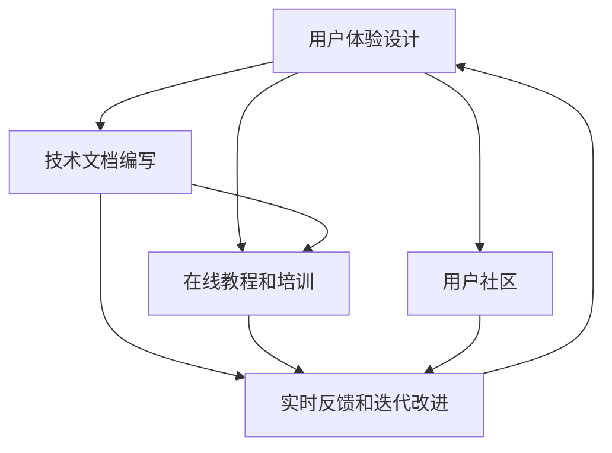

                 

# AI创业公司如何进行用户教育?

> 关键词：用户教育, AI技术, 人工智能, 机器学习, 深度学习, 自然语言处理(NLP), 推荐系统

## 1. 背景介绍

### 1.1 问题由来

随着人工智能（AI）技术的快速发展和普及，越来越多的AI创业公司涌现。这些公司在创新技术和产品的同时，也面临着如何让用户快速、有效地使用其产品的挑战。用户教育不仅是技术推广的重要环节，更是提高用户满意度、提升产品市场占有率的关键。本文将深入探讨AI创业公司如何进行用户教育，从理论到实践，提供全面、系统的指导。

### 1.2 问题核心关键点

用户教育的核心在于让用户体验到AI技术的实际价值，并掌握其基本使用方法。这涉及以下几个关键点：

- **用户体验设计**：打造直观易用的界面，让用户能够迅速上手。
- **技术文档编写**：提供详细且易于理解的文档，帮助用户理解技术原理。
- **在线教程和培训**：通过视频教程、在线课程等形式，提供互动式学习体验。
- **社区和支持**：建立用户社区，提供即时技术支持，解答用户疑问。
- **实时反馈和迭代改进**：通过用户反馈，持续改进产品和服务。

## 2. 核心概念与联系

### 2.1 核心概念概述

- **用户体验设计（User Experience Design, UXD）**：通过合理的界面设计、交互逻辑和反馈机制，提升用户的使用体验，增加用户粘性。
- **技术文档（Technical Documentation）**：详细描述产品功能和使用方法的文档，包括API文档、使用手册等，帮助用户理解技术细节。
- **在线教程（Online Tutorial）**：通过视频、博客、互动式学习平台等形式，向用户提供逐步学习指导，帮助用户掌握技能。
- **用户社区（User Community）**：建立线上或线下的交流平台，让用户能够互相帮助，共享经验。
- **实时反馈（Real-time Feedback）**：通过收集用户使用数据和反馈，不断优化产品，满足用户需求。

这些概念相互关联，共同构成了用户教育的全貌。通过精心设计和系统实施，AI创业公司可以显著提升用户满意度，增强产品竞争力。

### 2.2 核心概念原理和架构的 Mermaid 流程图



## 3. 核心算法原理 & 具体操作步骤

### 3.1 算法原理概述

用户教育不仅仅是技术传播，更是一个从用户需求出发，逐步提升产品使用价值的持续改进过程。其核心算法原理包括以下几点：

1. **用户行为分析**：通过数据分析技术，理解用户的使用习惯和需求，精准定位教育内容。
2. **个性化推荐**：根据用户的历史行为和偏好，推荐个性化的学习路径和内容。
3. **内容更新机制**：定期更新和优化教育内容，保持其与时俱进和有效性和吸引性。
4. **多渠道传播**：结合多种传播渠道，如社交媒体、邮件、网站等，最大化教育效果。

### 3.2 算法步骤详解

#### 3.2.1 用户行为分析

1. **数据采集**：收集用户使用数据，包括访问路径、操作时间、停留时长等。
2. **数据分析**：通过数据挖掘和机器学习算法，分析用户行为模式和需求。
3. **需求识别**：识别用户的常见问题、痛点和需求点，作为教育内容设计的依据。

#### 3.2.2 个性化推荐

1. **用户画像构建**：根据用户行为数据，构建用户画像，描述其兴趣、能力、需求等。
2. **内容库建立**：建立涵盖各种技术细节、操作步骤的丰富内容库。
3. **推荐算法设计**：设计个性化推荐算法，根据用户画像和内容库，生成个性化推荐列表。

#### 3.2.3 内容更新机制

1. **用户反馈收集**：通过在线调查、用户评论等形式，收集用户反馈。
2. **内容分析与评估**：评估现有内容的效果，识别改进点和新增需求。
3. **内容迭代**：更新和优化内容，确保其时效性和有效性。

#### 3.2.4 多渠道传播

1. **传播渠道选择**：根据用户特征和教育内容特点，选择适合的传播渠道，如网站、APP、社交媒体等。
2. **内容适配**：根据不同渠道的特性，适配内容形式，如视频、图文、动画等。
3. **传播策略制定**：制定多渠道传播策略，确保教育内容覆盖广泛用户群体。

### 3.3 算法优缺点

#### 3.3.1 算法优点

1. **提升用户满意度**：通过个性化推荐和实时反馈，用户能够迅速掌握技术，提升使用体验。
2. **增强产品粘性**：良好的用户体验和教育内容，能够提高用户对产品的信任和粘性。
3. **促进产品迭代**：通过持续的用户反馈和内容更新，不断优化产品，满足用户需求。

#### 3.3.2 算法缺点

1. **资源投入高**：用户教育涉及大量数据采集、分析和内容制作，需要较高的人力和物力投入。
2. **内容更新复杂**：内容库需要持续维护和更新，更新过程复杂且成本较高。
3. **用户需求多样**：用户需求和偏好多样化，难以通过单一策略满足所有用户需求。

### 3.4 算法应用领域

用户教育方法不仅适用于AI创业公司，还广泛应用于各类高科技产品的推广和技术传播。例如：

- **软件应用**：通过教程和文档，帮助用户理解软件功能和使用方法。
- **硬件产品**：通过使用手册和视频教程，引导用户正确操作硬件设备。
- **在线服务**：通过FAQ和在线客服，解答用户疑问，提高服务质量。
- **教育培训**：通过在线课程和视频讲座，提升用户的专业技能。
- **医疗健康**：通过健康指导和疾病预防教程，提高用户的健康意识和自我管理能力。

## 4. 数学模型和公式 & 详细讲解 & 举例说明

### 4.1 数学模型构建

用户教育的数学模型主要基于机器学习和数据分析技术，包括以下关键模型：

1. **用户行为分析模型**：用于识别用户行为模式和需求，常见模型包括决策树、随机森林、聚类算法等。
2. **个性化推荐模型**：用于生成个性化推荐列表，常见模型包括协同过滤、内容推荐、深度学习等。
3. **内容更新评估模型**：用于评估和优化内容库，常见模型包括回归分析、分类模型等。

### 4.2 公式推导过程

#### 4.2.1 用户行为分析模型

假设用户行为数据为 $D=\{x_i,y_i\}_{i=1}^N$，其中 $x_i$ 表示用户行为特征，$y_i$ 表示用户是否遇到某问题（二分类问题）。我们可以使用决策树模型来分析用户行为，其决策树为：

$$
T = (R, D, C, f)
$$

其中 $R$ 为特征集，$D$ 为数据集，$C$ 为模型分支，$f$ 为节点函数。通过递归构建决策树，可以得到最优的分类模型。

#### 4.2.2 个性化推荐模型

假设用户画像为 $u_i$，内容库为 $C_j$，用户对内容 $C_j$ 的评分向量为 $r_{ij}$。我们可以使用协同过滤算法来生成个性化推荐列表：

$$
\hat{r}_{ij} = \alpha (\frac{\sum_{k=1}^N \hat{u}_i^T \hat{u}_k r_{kj}}{\sqrt{\sum_{k=1}^N \hat{u}_i^T \hat{u}_k} \sqrt{\sum_{k=1}^N \hat{u}_k^T \hat{u}_k}} + \beta \sigma (r_{ij})
$$

其中 $\alpha$ 和 $\beta$ 为调节参数，$\sigma$ 为激活函数。通过计算用户画像与内容库的相似度，得到推荐列表。

#### 4.2.3 内容更新评估模型

假设内容库更新前后的评分分别为 $R_0$ 和 $R_1$，我们可以通过回归分析模型评估内容更新效果：

$$
R_1 = R_0 + \epsilon
$$

其中 $\epsilon$ 为随机误差项，可以通过最小二乘法求解最优参数。

### 4.3 案例分析与讲解

#### 4.3.1 用户行为分析案例

假设某AI软件应用的用户行为数据如下：

| User ID | Actions | Problem    |
| ------- | ------- | ---------- |
| 1       | 安装、运行、设置、使用 | 无法启动 |
| 2       | 安装、运行、设置、使用 | 界面卡顿 |
| 3       | 安装、运行、设置、使用 | 无问题  |

通过决策树模型分析用户行为，可以得到：

| Action | Problem    | Yes/No |
| ------ | ---------- | ------ |
| 安装   | 无法启动   | 是     |
| 运行   | 界面卡顿   | 是     |
| 设置   | 无问题     | 否     |
| 使用   | 无问题     | 否     |

通过决策树分析，我们可以发现用户在使用过程中遇到的问题集中在“无法启动”和“界面卡顿”两个方面，进而设计有针对性的教育内容。

#### 4.3.2 个性化推荐案例

假设某用户画像 $u_i=[50, 男性, 喜爱人工智能]$，内容库 $C_j=[人工智能基础, Python编程, 深度学习入门]$，用户对内容 $C_j$ 的评分向量为 $r_{ij}$。通过协同过滤算法，可以生成个性化推荐列表：

$$
\hat{r}_{ij} = [0.8, 0.7, 0.6]
$$

表示用户对“人工智能基础”和“Python编程”的评分较高，对“深度学习入门”的评分较低。通过推荐列表，用户可以迅速掌握所需知识，提升使用体验。

#### 4.3.3 内容更新评估案例

假设某内容库包含两篇文章，更新前后的评分分别为：

| 文章ID | 更新前评分 | 更新后评分 |
| ------ | ---------- | ---------- |
| A      | 4.0        | 4.5        |
| B      | 3.8        | 3.9        |

通过回归分析模型评估内容更新效果：

$$
R_1 = R_0 + \epsilon = \begin{bmatrix} 4.5 \\ 3.9 \end{bmatrix} = \begin{bmatrix} 4.0 \\ 3.8 \end{bmatrix} + \begin{bmatrix} 0.5 \\ 0.1 \end{bmatrix}
$$

其中 $\epsilon = \begin{bmatrix} 0.5 \\ 0.1 \end{bmatrix}$，表示内容更新后的评分有显著提升，评估模型有效。

## 5. 项目实践：代码实例和详细解释说明

### 5.1 开发环境搭建

在进行用户教育项目开发前，需要准备好开发环境。以下是使用Python进行PyTorch开发的环境配置流程：

1. 安装Anaconda：从官网下载并安装Anaconda，用于创建独立的Python环境。

2. 创建并激活虚拟环境：
```bash
conda create -n user-education-env python=3.8 
conda activate user-education-env
```

3. 安装PyTorch：根据CUDA版本，从官网获取对应的安装命令。例如：
```bash
conda install pytorch torchvision torchaudio cudatoolkit=11.1 -c pytorch -c conda-forge
```

4. 安装PyTorch提供的相关库：
```bash
pip install torch torchtext
```

5. 安装各类工具包：
```bash
pip install numpy pandas scikit-learn matplotlib tqdm jupyter notebook ipython
```

完成上述步骤后，即可在`user-education-env`环境中开始用户教育项目的开发。

### 5.2 源代码详细实现

下面以一个简单的用户行为分析项目为例，给出使用PyTorch进行用户行为分析的代码实现。

首先，定义数据处理函数：

```python
import torch
import torch.nn as nn
from sklearn.preprocessing import LabelEncoder
from sklearn.model_selection import train_test_split
from sklearn.tree import DecisionTreeClassifier
from sklearn.metrics import accuracy_score

def load_data(file_path):
    data = pd.read_csv(file_path)
    features = data[['feature1', 'feature2', 'feature3']]
    labels = data['label']
    label_encoder = LabelEncoder()
    labels = label_encoder.fit_transform(labels)
    return features, labels

def train_model(features, labels):
    features_train, features_test, labels_train, labels_test = train_test_split(features, labels, test_size=0.2)
    model = DecisionTreeClassifier()
    model.fit(features_train, labels_train)
    predictions = model.predict(features_test)
    accuracy = accuracy_score(labels_test, predictions)
    return accuracy

# 加载数据
features, labels = load_data('user_behavior.csv')

# 训练模型
accuracy = train_model(features, labels)
print(f'Accuracy: {accuracy:.2f}')
```

然后，定义数据处理和模型训练函数：

```python
from torch.utils.data import Dataset
from torch.utils.data import DataLoader
import torch.nn as nn

class UserBehaviorDataset(Dataset):
    def __init__(self, features, labels):
        self.features = features
        self.labels = labels
        
    def __len__(self):
        return len(self.features)
    
    def __getitem__(self, item):
        features = self.features[item]
        label = self.labels[item]
        return features, label

# 创建dataset
dataset = UserBehaviorDataset(features, labels)

# 定义模型
class UserBehaviorClassifier(nn.Module):
    def __init__(self):
        super(UserBehaviorClassifier, self).__init__()
        self.fc1 = nn.Linear(3, 8)
        self.fc2 = nn.Linear(8, 4)
        self.fc3 = nn.Linear(4, 2)
        
    def forward(self, x):
        x = torch.relu(self.fc1(x))
        x = torch.relu(self.fc2(x))
        x = torch.sigmoid(self.fc3(x))
        return x

# 定义优化器
model = UserBehaviorClassifier()
optimizer = torch.optim.Adam(model.parameters(), lr=0.001)

# 训练模型
epochs = 100
for epoch in range(epochs):
    for features, label in dataloader:
        model.zero_grad()
        output = model(features)
        loss = nn.BCELoss()(output, label)
        loss.backward()
        optimizer.step()
    if (epoch+1) % 10 == 0:
        print(f'Epoch {epoch+1}, loss: {loss.item():.4f}')
```

最后，启动模型训练流程：

```python
# 加载数据集
dataloader = DataLoader(dataset, batch_size=32, shuffle=True)

# 训练模型
for epoch in range(epochs):
    for features, label in dataloader:
        model.zero_grad()
        output = model(features)
        loss = nn.BCELoss()(output, label)
        loss.backward()
        optimizer.step()
    if (epoch+1) % 10 == 0:
        print(f'Epoch {epoch+1}, loss: {loss.item():.4f}')
```

以上就是使用PyTorch进行用户行为分析的完整代码实现。可以看到，PyTorch提供了丰富的机器学习组件，可以方便地构建和训练决策树等用户行为分析模型。

### 5.3 代码解读与分析

让我们再详细解读一下关键代码的实现细节：

**UserBehaviorDataset类**：
- `__init__`方法：初始化数据特征和标签，并进行标签编码。
- `__len__`方法：返回数据集的样本数量。
- `__getitem__`方法：对单个样本进行处理，返回特征和标签。

**UserBehaviorClassifier类**：
- `__init__`方法：定义模型结构，包括三个全连接层。
- `forward`方法：定义前向传播过程，经过激活函数和输出层。

**训练函数**：
- 定义优化器、损失函数等关键组件。
- 使用DataLoader加载数据集，迭代训练模型，计算损失并更新参数。

这些代码实现展示了使用PyTorch进行用户行为分析的基本流程，包括数据处理、模型构建和训练。开发者可以根据具体需求，对数据处理方式、模型结构和训练策略进行灵活调整。

## 6. 实际应用场景

### 6.1 智能客服系统

智能客服系统是AI创业公司用户教育的重要场景。通过在线客服机器人，用户能够快速获取技术支持，解决问题。智能客服系统的用户教育方法包括：

1. **智能问答**：使用自然语言处理技术，理解用户问题并给出准确回答。
2. **FAQ库**：建立常见问题库，提供解答模板和操作步骤。
3. **视频教程**：录制常见问题的操作视频，通过视频引导用户使用产品。
4. **用户反馈**：收集用户反馈，持续优化客服系统。

通过这些方法，用户能够快速掌握智能客服系统的操作，提高服务满意度。

### 6.2 在线教育平台

在线教育平台通过用户教育，提升用户的学习体验。用户教育方法包括：

1. **课程推荐**：根据用户历史学习行为和偏好，推荐个性化课程。
2. **学习路径规划**：制定详细的学习路径，帮助用户系统掌握知识。
3. **互动式学习**：通过在线讨论、作业批改等方式，增强学习互动性。
4. **实时反馈**：通过在线测试和反馈系统，实时评估用户学习效果。

通过这些方法，用户能够高效掌握学习内容，提升学习效果。

### 6.3 健康管理应用

健康管理应用通过用户教育，提升用户健康意识和自我管理能力。用户教育方法包括：

1. **健康知识库**：建立健康知识库，提供健康科普文章和视频。
2. **运动指导**：根据用户健康数据，提供个性化的运动计划和指导。
3. **饮食建议**：根据用户饮食偏好和健康数据，提供个性化的饮食建议。
4. **健康监测**：通过实时监测健康数据，提供健康预警和建议。

通过这些方法，用户能够科学管理健康，提高生活质量。

### 6.4 未来应用展望

随着AI技术的发展，用户教育的应用场景将更加丰富和多样化。未来，用户教育将更注重以下几个方面：

1. **个性化定制**：通过深度学习和数据挖掘，提供更加个性化的教育内容。
2. **多模态融合**：结合视觉、语音、文本等多模态信息，提供全面的用户体验。
3. **实时互动**：通过虚拟助手和智能聊天机器人，实现实时互动和问题解答。
4. **社交学习**：建立用户社区，促进用户之间的知识共享和学习交流。
5. **情感智能**：通过情感分析和智能推荐，提供更符合用户心理需求的教育内容。

这些方向的探索将进一步提升用户教育的效果和覆盖面，促进AI技术的普及和应用。

## 7. 工具和资源推荐

### 7.1 学习资源推荐

为了帮助开发者系统掌握用户教育的技术基础和实践技巧，这里推荐一些优质的学习资源：

1. **《用户体验设计》系列书籍**：深入浅出地介绍了用户体验设计的原理和方法，帮助开发者设计直观易用的界面。
2. **Coursera《机器学习》课程**：斯坦福大学开设的机器学习课程，涵盖机器学习基础和应用，适合初学者入门。
3. **Kaggle数据科学竞赛**：通过实际数据集，提供用户行为分析和个性化推荐等实战经验。
4. **Google Developers 文档**：提供完整的用户教育开发指南，涵盖用户行为分析、个性化推荐等内容。
5. **《深度学习入门》系列书籍**：深入浅出地介绍了深度学习基础和应用，适合有一定基础的用户教育开发者。

通过对这些资源的学习实践，相信你一定能够快速掌握用户教育的技术基础，并用于解决实际的NLP问题。

### 7.2 开发工具推荐

高效的开发离不开优秀的工具支持。以下是几款用于用户教育开发的常用工具：

1. **Jupyter Notebook**：开源的交互式开发环境，支持Python、R等多种语言，适合数据处理和机器学习开发。
2. **PyTorch**：开源深度学习框架，提供丰富的机器学习组件，适合构建和训练用户行为分析模型。
3. **Scikit-learn**：开源机器学习库，提供多种经典机器学习算法，适合数据预处理和模型评估。
4. **TensorBoard**：TensorFlow配套的可视化工具，实时监测模型训练状态，提供丰富的图表呈现方式。
5. **OpenAPI**：用于API文档生成和在线教程开发，方便用户快速理解技术接口。

合理利用这些工具，可以显著提升用户教育任务的开发效率，加快创新迭代的步伐。

### 7.3 相关论文推荐

用户教育技术的快速发展得益于学界的持续研究。以下是几篇奠基性的相关论文，推荐阅读：

1. **《个性化推荐系统研究综述》**：综述了个性化推荐系统的发展历程和主要算法，提供用户教育内容的理论基础。
2. **《用户行为分析方法综述》**：综述了用户行为分析的多种方法，提供用户行为识别的技术参考。
3. **《深度学习在用户行为分析中的应用》**：介绍了深度学习在用户行为分析中的实践案例，提供实际应用经验。
4. **《机器学习在推荐系统中的研究与应用》**：综述了机器学习在推荐系统中的研究进展，提供个性化推荐的技术思路。
5. **《智能客服系统的设计与实现》**：介绍了智能客服系统的设计与实现，提供用户教育场景的实际应用经验。

这些论文代表了大语言模型微调技术的进展，为开发者提供了深入的理论和技术支持。

## 8. 总结：未来发展趋势与挑战

### 8.1 总结

本文对AI创业公司如何进行用户教育进行了全面系统的介绍。首先阐述了用户教育在AI技术推广中的重要性和实际意义，明确了用户教育的关键点：用户体验设计、技术文档编写、在线教程和培训、用户社区和支持、实时反馈和迭代改进。通过深入探讨用户行为分析、个性化推荐、内容更新机制等核心算法原理，提供了详细的实践步骤和代码实例。最后，结合实际应用场景，探讨了未来用户教育的发展趋势和面临的挑战。

通过本文的系统梳理，可以看到，用户教育是AI技术推广的重要环节，通过精心设计和系统实施，可以显著提升用户满意度，增强产品竞争力。未来，随着AI技术的不断发展，用户教育的应用场景将更加丰富和多样化，为NLP技术落地应用提供了新的方向。

### 8.2 未来发展趋势

展望未来，用户教育技术将呈现以下几个发展趋势：

1. **个性化定制**：通过深度学习和数据挖掘，提供更加个性化的教育内容，提升用户教育效果。
2. **多模态融合**：结合视觉、语音、文本等多模态信息，提供全面的用户体验，增强用户粘性。
3. **实时互动**：通过虚拟助手和智能聊天机器人，实现实时互动和问题解答，提高用户满意度。
4. **社交学习**：建立用户社区，促进用户之间的知识共享和学习交流，提升用户参与度。
5. **情感智能**：通过情感分析和智能推荐，提供更符合用户心理需求的教育内容，增强用户体验。

这些趋势凸显了用户教育技术的重要性和应用潜力，将推动AI技术在更多领域落地应用，为社会带来深远影响。

### 8.3 面临的挑战

尽管用户教育技术已经取得了瞩目成就，但在迈向更加智能化、普适化应用的过程中，仍面临诸多挑战：

1. **数据隐私问题**：用户教育需要大量数据支持，如何保护用户隐私，确保数据安全，是重要挑战。
2. **内容多样性**：用户需求和偏好多样化，如何通过多样化内容满足不同用户需求，需要持续优化。
3. **技术门槛高**：用户教育涉及复杂的技术算法，如何降低技术门槛，提供易用的教育工具，是重要课题。
4. **交互体验差**：如何通过界面设计和交互逻辑优化，提升用户互动体验，增加用户粘性，是重要挑战。
5. **多渠道整合**：如何通过多渠道整合，最大化教育效果，提供全方位用户体验，是重要课题。

这些挑战需要多方面的协同努力，才能更好地实现用户教育技术的普及和应用。

### 8.4 研究展望

面对用户教育面临的挑战，未来的研究需要在以下几个方面寻求新的突破：

1. **隐私保护技术**：开发更加安全的数据保护技术，确保用户数据隐私安全。
2. **内容生成技术**：开发自动生成高质量教育内容的技术，降低内容制作成本，提升内容多样性。
3. **技术普及教育**：开发易用的用户教育工具，降低技术门槛，提升用户使用体验。
4. **交互体验优化**：通过界面设计优化和交互逻辑改进，提升用户互动体验，增加用户粘性。
5. **多渠道整合优化**：优化多渠道整合策略，最大化教育效果，提供全方位用户体验。

这些研究方向的探索，必将引领用户教育技术迈向更高的台阶，为构建安全、可靠、可解释、可控的智能系统铺平道路。面向未来，用户教育技术还需要与其他人工智能技术进行更深入的融合，如知识表示、因果推理、强化学习等，多路径协同发力，共同推动自然语言理解和智能交互系统的进步。只有勇于创新、敢于突破，才能不断拓展语言模型的边界，让智能技术更好地造福人类社会。

## 9. 附录：常见问题与解答

**Q1：如何衡量用户教育的效果？**

A: 用户教育效果可以从以下几个方面进行衡量：

1. **用户满意度**：通过问卷调查、用户反馈等方式，收集用户对教育内容的使用体验和满意度。
2. **学习效果评估**：通过在线测试、作业批改等方式，评估用户对教育内容的掌握程度。
3. **产品使用指标**：通过访问量、使用时长、转化率等指标，评估用户对产品的使用情况。
4. **业务指标**：通过新用户注册量、留存率、客户满意度等指标，评估教育活动对业务的影响。

**Q2：用户教育如何结合用户行为分析？**

A: 用户教育可以结合用户行为分析，通过以下方式实现：

1. **行为数据分析**：通过分析用户行为数据，识别用户的常见问题和需求点，作为教育内容设计的依据。
2. **个性化推荐**：根据用户行为数据，生成个性化推荐列表，引导用户学习相关内容。
3. **内容迭代优化**：通过行为数据分析，识别教育内容的效果和改进点，持续优化教育内容库。

**Q3：用户教育如何结合在线教程和培训？**

A: 用户教育可以结合在线教程和培训，通过以下方式实现：

1. **视频教程**：录制详细的教学视频，通过视频引导用户学习。
2. **互动式学习**：开发在线课程和互动平台，提供问答、讨论、作业等功能，增强用户互动性。
3. **实时反馈**：通过在线测试和反馈系统，实时评估用户学习效果，提供即时指导和建议。

**Q4：用户教育如何结合用户社区和支持？**

A: 用户教育可以结合用户社区和支持，通过以下方式实现：

1. **社区交流**：建立用户社区，促进用户之间的知识共享和学习交流，提升用户参与度。
2. **在线客服**：提供实时在线客服，解答用户疑问，提供个性化指导。
3. **用户反馈收集**：通过社区和客服平台，收集用户反馈，持续优化产品和服务。

**Q5：用户教育如何结合实时反馈和迭代改进？**

A: 用户教育可以结合实时反馈和迭代改进，通过以下方式实现：

1. **数据收集**：通过用户行为数据和反馈数据，收集用户的使用情况和问题。
2. **分析评估**：通过数据分析和评估，识别教育内容的改进点和优化方向。
3. **内容更新**：根据分析评估结果，更新和优化教育内容，保持其时效性和有效性。

通过这些方法，用户教育可以实现精准定位、个性化推荐和持续改进，提升用户教育效果和用户满意度。

---

作者：禅与计算机程序设计艺术 / Zen and the Art of Computer Programming

