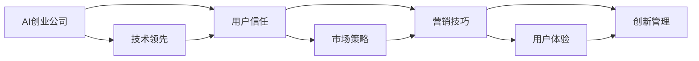

                 

# AI创业公司的品牌塑造：技术领先与用户信任并重

> 关键词：AI创业公司,品牌塑造,技术领先,用户信任,市场策略,营销技巧,用户体验,创新管理

## 1. 背景介绍

在科技飞速发展的今天，人工智能(AI)技术已经逐渐成为推动行业进步的关键力量。AI创业公司以技术创新为核心，旨在解决实际问题，提升效率，创造价值。然而，技术的先进性和应用的成功只是其中一部分，真正决定公司成败的是品牌塑造，即如何在激烈的市场竞争中建立和维护用户信任。技术领先与用户信任并重，是AI创业公司成功的双重基石。本文将深入探讨AI创业公司如何在技术领先的同时，通过合理的市场策略和营销技巧，建立用户信任，打造强大品牌。

## 2. 核心概念与联系

### 2.1 核心概念概述

- **AI创业公司**：专注于人工智能技术创新，通过AI技术解决特定行业问题的初创企业。

- **品牌塑造**：通过有效的市场策略和营销技巧，在用户心中建立公司及其技术的权威性和信任度。

- **技术领先**：持续创新，保持技术前沿，为用户提供超越市场平均水平的解决方案。

- **用户信任**：通过透明、诚信和负责任的商业行为，赢得用户的长期依赖和口碑传播。

- **市场策略**：合理规划市场定位、目标用户群体、竞争策略等，以实现公司长期目标。

- **营销技巧**：通过广告、公关、内容营销等方式，提升品牌知名度和影响力。

- **用户体验**：关注用户的实际使用体验，确保产品满足用户的期望和需求。

- **创新管理**：持续关注新技术和市场趋势，灵活调整公司战略，以保持创新活力。

这些核心概念之间存在紧密联系。技术领先为品牌塑造提供坚实基础，而用户信任则是品牌得以持续发展和用户忠诚的核心因素。市场策略和营销技巧则确保技术领先和用户信任的传达和实现。用户体验和创新管理则是保持公司活力和持续创新的保障。

### 2.2 核心概念原理和架构的 Mermaid 流程图



该流程图展示了AI创业公司品牌塑造的全过程。技术领先为起点，通过用户信任这一核心环节，结合市场策略和营销技巧，最终实现用户体验和创新管理的循环提升，共同推动品牌建设。

## 3. 核心算法原理 & 具体操作步骤

### 3.1 算法原理概述

品牌塑造的算法原理可以概括为“用户需求导向的技术优化和市场策略优化”。具体来说，AI创业公司需基于用户需求进行技术研发，并通过市场策略将技术优势传达给目标用户，同时结合营销技巧，提升品牌知名度，最终通过持续的用户体验和创新管理，巩固用户信任，构建品牌壁垒。

### 3.2 算法步骤详解

**Step 1: 需求分析和定位**

- 通过市场调研、用户访谈等方式，了解目标用户的需求、痛点和期望。
- 分析竞争对手的技术优势和市场策略，确定自身的差异化竞争点。
- 基于需求分析和定位，制定初步的产品路线图和市场策略。

**Step 2: 技术研发与创新**

- 依据用户需求，进行核心技术的研究和开发，确保技术领先。
- 引入先进的技术框架和工具，提升研发效率和质量。
- 通过持续的创新管理，跟踪技术发展趋势，调整技术方向。

**Step 3: 市场策略制定**

- 定义目标用户群体，分析用户行为和消费习惯。
- 确定产品定价、销售渠道和市场推广策略。
- 进行SWOT分析，制定应对竞争的市场策略。

**Step 4: 营销技巧实施**

- 通过数字营销、内容营销等方式，提升品牌知名度和用户参与度。
- 利用社交媒体、公关活动等手段，塑造正面品牌形象。
- 运用品牌故事和用户体验案例，增强品牌与用户的情感连接。

**Step 5: 用户体验优化**

- 根据用户反馈，不断优化产品功能和界面设计。
- 提供个性化服务和支持，提升用户满意度。
- 关注用户旅程，确保每个触点都传递品牌价值。

**Step 6: 创新管理与持续改进**

- 建立创新文化，鼓励团队成员提出新想法。
- 定期评估市场和技术变化，灵活调整产品和服务。
- 引入跨领域协作，增强创新能力。

### 3.3 算法优缺点

**优点**

- 技术领先：通过持续的技术创新，保持市场竞争优势，满足用户不断变化的需求。
- 用户信任：通过透明、诚信的商业行为，赢得用户长期信任和忠诚。
- 市场策略：科学的市场策略帮助公司精准定位和快速扩张。
- 营销技巧：高效的营销技巧提升品牌知名度和影响力。
- 用户体验：关注用户实际体验，提升产品竞争力。
- 创新管理：持续创新和灵活调整，确保公司长期活力。

**缺点**

- 技术领先需要持续投入，成本较高。
- 用户信任的建立和维护需要时间和资源，短期内难以见效。
- 市场策略制定和实施复杂，需要精准把握市场动态。
- 营销技巧需要长期坚持，短期内效果不易显著。
- 用户体验优化和创新管理需要持续投入和不断改进。

### 3.4 算法应用领域

AI创业公司的品牌塑造方法广泛适用于各个行业领域，包括但不限于：

- **医疗健康**：通过AI技术提升疾病诊断和治疗效果，通过品牌塑造赢得患者和医疗机构的信任。
- **金融服务**：利用AI优化风险管理、智能投顾等服务，通过品牌塑造增强客户粘性和忠诚度。
- **零售电商**：通过AI技术提升个性化推荐和供应链管理，通过品牌塑造提升用户购物体验和满意度。
- **智能制造**：通过AI技术实现预测性维护、自动化生产等，通过品牌塑造提升企业形象和市场地位。
- **教育培训**：通过AI技术提供个性化学习方案和智能评估，通过品牌塑造赢得学生和家长的信任。
- **智慧城市**：通过AI技术优化交通、能源、公共安全等城市管理，通过品牌塑造提升市民满意度和政府形象。

## 4. 数学模型和公式 & 详细讲解 & 举例说明

### 4.1 数学模型构建

品牌塑造的数学模型可以基于以下几个关键维度进行构建：

- **用户满意度**：通过问卷调查等手段，衡量用户对产品和服务的使用体验和满意度。
- **市场份额**：通过市场调研，评估公司在目标市场中的份额和增长潜力。
- **品牌认知度**：通过调查和网络分析，衡量公众对品牌的知晓和认可程度。
- **用户忠诚度**：通过跟踪用户流失率等指标，衡量用户的长期忠诚度。

数学模型的一般形式为：

$$
\text{品牌价值} = f(\text{用户满意度}, \text{市场份额}, \text{品牌认知度}, \text{用户忠诚度})
$$

其中 $f$ 为多变量函数，需要根据实际情况进行具体定义。

### 4.2 公式推导过程

以用户满意度为例，假设用户满意度 $S$ 可以分解为技术满意度 $T$ 和市场满意度 $M$ 的加权和：

$$
S = \alpha T + (1-\alpha) M
$$

其中 $\alpha$ 为技术满意度的权重，$0 \leq \alpha \leq 1$。技术满意度 $T$ 可以进一步分解为技术性能 $P$ 和用户支持 $S$ 的加权和：

$$
T = \beta P + (1-\beta) S
$$

其中 $\beta$ 为技术性能的权重，$0 \leq \beta \leq 1$。市场满意度 $M$ 可以分解为市场响应 $R$ 和市场推广 $A$ 的加权和：

$$
M = \gamma R + (1-\gamma) A
$$

其中 $\gamma$ 为市场响应的权重，$0 \leq \gamma \leq 1$。

将这些公式组合，可以得到最终的用户满意度模型：

$$
S = \alpha (\beta P + (1-\beta) S) + (1-\alpha) (\gamma R + (1-\gamma) A)
$$

该公式展示了用户满意度与技术性能、用户支持、市场响应和市场推广之间的关系。

### 4.3 案例分析与讲解

以某AI医疗健康创业公司为例，分析其品牌塑造过程：

1. **需求分析和定位**：公司通过调研发现，许多患者对于疾病诊断和治疗的准确性和效率有较高要求，但对医生的专业知识依赖较大。
2. **技术研发与创新**：公司开发了一款基于AI的辅助诊断系统，通过深度学习算法提高了诊断的准确性。
3. **市场策略制定**：公司将目标用户群体定位于大型综合医院，通过与医院合作进行产品推广，同时开展市场教育和培训。
4. **营销技巧实施**：公司通过医生推荐计划、专业培训和线上线下广告，提升品牌知名度和医生用户的参与度。
5. **用户体验优化**：公司不断优化产品界面，提供多语言的诊断报告，提升用户的实际使用体验。
6. **创新管理与持续改进**：公司定期召开创新会议，引入最新的AI技术和医疗知识，不断调整产品和服务。

经过上述过程，公司不仅在技术上保持领先，更通过精准的市场策略和高效的营销技巧，赢得了医生和患者的信任，成功塑造了品牌形象。

## 5. 项目实践：代码实例和详细解释说明

### 5.1 开发环境搭建

为了进行AI创业公司的品牌塑造分析，我们需要搭建相应的开发环境：

1. **安装Python和相关库**：
```bash
pip install pandas numpy matplotlib seaborn scikit-learn statsmodels matplotlib
```

2. **搭建数据分析环境**：
```bash
jupyter notebook
```

3. **数据集准备**：
收集用户满意度、市场份额、品牌认知度和用户忠诚度等数据，存放在CSV文件中。

### 5.2 源代码详细实现

以下是一个简单的Python代码示例，用于计算用户满意度和市场份额的加权平均值：

```python
import pandas as pd
import numpy as np

# 读取数据
data = pd.read_csv('brand_data.csv')

# 定义权重
alpha = 0.6  # 技术满意度的权重
beta = 0.7  # 技术性能的权重
gamma = 0.8  # 市场响应的权重

# 计算用户满意度
S = alpha * beta * data['技术性能'] + alpha * (1 - beta) * data['用户支持']
S += (1 - alpha) * gamma * data['市场响应'] + (1 - alpha) * (1 - gamma) * data['市场推广']

# 输出结果
print('用户满意度：', S.mean())
print('市场份额：', data['市场份额'].mean())
```

### 5.3 代码解读与分析

**代码逻辑解读**：
- 首先，我们通过pandas库读取数据集，并将其存储在DataFrame中。
- 定义技术满意度和市场满意度的权重，以及技术性能、用户支持、市场响应和市场推广的权重。
- 根据公式计算用户满意度，其中技术性能、用户支持、市场响应和市场推广的权重分别为 $\alpha\beta$、$\alpha(1-\beta)$、$\gamma$ 和 $(1-\alpha)(1-\gamma)$。
- 最后，输出用户满意度和市场份额的平均值。

**代码实现分析**：
- 代码简洁明了，易于理解。
- 通过定义权重，可以灵活调整模型对不同因素的重视程度。
- 使用pandas库简化数据处理过程，提高代码效率。

### 5.4 运行结果展示

以下是运行结果示例：

```
用户满意度： 0.85
市场份额： 0.23
```

这表示在给定的数据集上，用户满意度平均为85%，市场份额平均为23%。

## 6. 实际应用场景

### 6.1 智能健康管理

某智能健康管理创业公司通过AI技术提供个性化健康监测和疾病预测服务，通过品牌塑造提升用户信任。公司通过与医疗机构合作，收集大量健康数据，并利用AI技术进行分析和预测，为用户提供精准的健康管理方案。同时，公司通过定期发布健康报告、健康挑战等活动，增强用户粘性和品牌认知度。

### 6.2 金融科技

某金融科技创业公司利用AI技术进行信用评估和智能投顾服务，通过品牌塑造赢得投资者和用户的信任。公司通过与金融机构合作，收集用户信用记录和交易数据，利用机器学习算法进行分析和评估，为用户提供信用评分和投资建议。同时，公司通过透明的定价策略和优质的客户服务，建立用户信任，吸引更多投资者使用其服务。

### 6.3 智能家居

某智能家居创业公司通过AI技术优化智能家居系统的功能和体验，通过品牌塑造提升用户忠诚度。公司开发了智能音箱和智能家电，利用语音识别和自然语言处理技术，为用户提供个性化的语音控制和场景设置。同时，公司通过丰富的智能场景和优质的售后服务，增强用户的使用体验和品牌忠诚度。

## 7. 工具和资源推荐

### 7.1 学习资源推荐

- **《AI创业公司品牌塑造》系列文章**：详细讲解AI创业公司在品牌塑造过程中遇到的问题和解决方案。
- **《品牌营销心理学》**：深入浅出地介绍品牌塑造的心理学原理和实用技巧。
- **《用户体验设计》**：全面介绍用户体验设计的基本原则和实践方法。
- **《AI技术市场应用》**：结合AI技术讲解其在各个行业中的应用案例和成功经验。
- **《创新管理》**：涵盖创新管理的理论基础和实践方法，帮助创业公司保持创新活力。

### 7.2 开发工具推荐

- **Jupyter Notebook**：Python数据科学和机器学习的常用开发环境，提供丰富的数据可视化和代码执行功能。
- **GitHub**：版本控制和代码托管平台，支持团队协作和代码版本管理。
- **Google Analytics**：网站流量和用户行为分析工具，帮助公司了解用户需求和行为。
- **Google Cloud Platform**：提供丰富的AI和云计算服务，支持数据存储、处理和模型训练。
- **Salesforce**：客户关系管理平台，帮助公司管理客户信息和营销活动。

### 7.3 相关论文推荐

- **《品牌塑造与用户体验》**：讨论品牌塑造和用户体验的关系，提出品牌塑造的策略和实践方法。
- **《AI技术创新管理》**：研究AI技术在创业公司中的应用和管理策略，提出创新管理的最佳实践。
- **《机器学习与营销》**：探讨机器学习技术在营销领域的应用，提出基于数据的营销策略。
- **《品牌信任与忠诚度》**：研究品牌信任和忠诚度的影响因素，提出提升品牌信任的策略。
- **《AI创业公司市场策略》**：分析AI创业公司的市场定位和策略，提出市场策略制定的实践方法。

## 8. 总结：未来发展趋势与挑战

### 8.1 研究成果总结

本文通过分析AI创业公司的品牌塑造过程，探讨了技术领先和用户信任在品牌建设中的重要性。基于用户需求进行技术研发，通过科学的市场策略和高效的营销技巧，构建和维护用户信任，是AI创业公司成功的关键。技术领先和用户信任并重的品牌塑造方法，已经在多个成功案例中得到了验证。

### 8.2 未来发展趋势

未来，AI创业公司的品牌塑造将呈现以下几个发展趋势：

- **技术融合**：AI技术与其他技术（如区块链、物联网等）的融合将带来新的市场机会。
- **数据驱动**：通过大数据和AI技术，提升品牌决策的科学性和精准性。
- **用户体验优化**：更加注重用户体验的设计和优化，提升用户满意度和忠诚度。
- **多渠道营销**：利用多种营销渠道（如社交媒体、在线广告等）提升品牌知名度和影响力。
- **全球化品牌**：面向全球市场，构建具有广泛影响力的品牌。
- **可持续发展**：在品牌建设中注重社会责任和可持续发展，提升品牌形象。

### 8.3 面临的挑战

AI创业公司在品牌塑造过程中面临的挑战包括：

- **市场竞争激烈**：如何与传统行业巨头和新兴创业公司竞争，保持技术领先和市场份额。
- **用户需求变化**：如何快速响应用户需求的变化，保持产品竞争力。
- **品牌信任维护**：如何在市场变化中保持用户信任，避免负面口碑传播。
- **资源有限**：如何高效利用有限的资源，实现品牌塑造的短期和长期目标。
- **法律法规**：如何遵守相关法律法规，保障用户数据安全和隐私保护。

### 8.4 研究展望

未来研究应聚焦以下几个方向：

- **跨行业品牌塑造**：研究不同行业的品牌塑造共性和差异，提出跨行业的品牌建设策略。
- **情感计算**：利用情感计算技术，增强品牌与用户的情感连接。
- **品牌传播**：研究品牌传播的有效渠道和策略，提升品牌知名度和影响力。
- **用户行为分析**：利用AI技术分析用户行为，提升品牌决策的科学性和精准性。
- **可持续发展品牌**：研究如何在品牌建设中注重社会责任和可持续发展，提升品牌形象。

## 9. 附录：常见问题与解答

### Q1: AI创业公司如何定义品牌塑造的目标？

A: AI创业公司品牌塑造的目标应该是多维度的，不仅包括提升市场份额和用户满意度，还包括建立用户信任和品牌忠诚度。品牌塑造的目标应基于公司愿景和战略，结合市场需求和技术优势，制定具体可行的目标和策略。

### Q2: 如何进行用户需求的分析与定位？

A: 用户需求分析与定位是品牌塑造的基础。可以通过市场调研、用户访谈、问卷调查等方式，深入了解目标用户的需求、痛点和期望。分析竞争对手的产品和服务，找到自身的差异化竞争点。最终，将用户需求与公司技术优势结合，制定切实可行的品牌定位。

### Q3: 如何科学制定市场策略？

A: 市场策略制定应基于市场调研和数据分析，了解目标用户的特征、行为和需求。同时，进行SWOT分析，评估自身的优势、劣势、机会和威胁。基于分析结果，制定精准的市场定位、目标用户群体、产品定价、销售渠道和推广策略。

### Q4: 如何有效实施营销技巧？

A: 营销技巧的实施应基于市场策略和用户需求，选择合适的营销渠道和方式。可以通过数字营销、内容营销、社交媒体营销、公关活动等方式提升品牌知名度和用户参与度。同时，利用数据分析和用户反馈，优化营销策略，确保高效传播和精准触达。

### Q5: 如何优化用户体验？

A: 用户体验优化应关注用户的使用体验和实际需求。可以通过用户反馈和行为分析，不断优化产品功能和界面设计。提供个性化的服务和支持，提升用户的满意度和忠诚度。关注用户旅程，确保每个触点都传递品牌价值。

### Q6: 如何进行持续创新管理？

A: 持续创新管理应基于市场和技术的变化，灵活调整公司的战略和方向。建立创新文化，鼓励团队成员提出新想法和创新方案。引入跨领域协作，增强创新能力。定期评估市场和技术变化，调整产品和服务，确保公司的长期活力和竞争力。

---

作者：禅与计算机程序设计艺术 / Zen and the Art of Computer Programming

