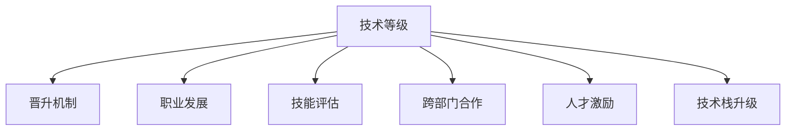

                 

# AI创业公司的技术人才培养与晋升通道：技术等级、晋升机制与职业发展

> 关键词：技术等级、晋升机制、职业发展、人才培养、技能评估、技术积累、跨部门合作、职业规划、人才激励、技术栈升级

## 1. 背景介绍

### 1.1 问题由来

在AI创业公司中，技术人才是核心竞争力之一。公司依赖于优秀的技术人才进行产品创新和研发。因此，如何吸引、培养和留住优秀技术人才，构建一个高效的人才培养和晋升体系，成为创业公司发展的关键。

技术人才的培养和晋升体系不仅关系到公司能否吸引到优秀人才，还影响到公司内部的技术水平和创新能力。一个良好的技术晋升体系，可以让技术人才看到发展前景，提升归属感和忠诚度，促进公司的持续发展。

### 1.2 问题核心关键点

AI创业公司的技术人才培养和晋升体系的核心关键点包括：

- **技术等级划分**：明确技术人才的技能水平和专业能力。
- **晋升机制设计**：构建公平、透明的晋升标准和流程。
- **职业发展规划**：帮助技术人才制定明确的职业发展路径。
- **技能评估工具**：设计科学的评估手段，客观衡量技术人才的实际能力。
- **跨部门合作机制**：促进技术人才的全面发展和跨领域技能提升。
- **人才激励政策**：建立有效的激励机制，吸引和保留顶尖人才。
- **技术栈升级策略**：确保技术人才始终处于行业技术前沿。

这些关键点共同构成了一个完备的技术人才培养与晋升体系，有助于AI创业公司培养出高素质的技术人才队伍，推动公司的持续创新和增长。

## 2. 核心概念与联系

### 2.1 核心概念概述

为更好地理解AI创业公司的技术人才培养与晋升体系，本节将介绍几个密切相关的核心概念：

- **技术等级**：根据技术人才的技能水平、工作经验及贡献度等因素，划分为不同的等级。
- **晋升机制**：通过科学的标准和流程，让符合条件的员工晋升到更高等级。
- **职业发展**：技术人才在公司内部的职业生涯规划，包括短期目标、中期目标和长期目标。
- **技能评估**：通过定量和定性相结合的方式，全面评估技术人才的技能水平。
- **跨部门合作**：鼓励技术人才参与公司内部跨部门项目，提升综合能力。
- **人才激励**：通过各种激励措施，激发技术人才的积极性和创造力。
- **技术栈升级**：鼓励技术人才学习新技术、新工具，提升技术栈的深度和广度。

这些核心概念之间的逻辑关系可以通过以下Mermaid流程图来展示：



这个流程图展示了这个体系中的核心概念及其之间的关系：

1. 技术等级是基础，决定晋升机制的依据。
2. 职业发展指导技术人才的职业规划。
3. 技能评估保证晋升机制的公平性和科学性。
4. 跨部门合作和人才激励促进技术人才的综合发展和归属感。
5. 技术栈升级确保技术人才处于行业前沿。

## 3. 核心算法原理 & 具体操作步骤
### 3.1 算法原理概述

AI创业公司的技术人才培养与晋升体系，本质上是一个基于技能评估和职业发展路径的动态调整过程。其核心思想是：

1. **技能评估**：根据预设的标准和方法，对技术人才的技能进行客观、系统的评估。
2. **职业发展路径设计**：根据技术等级，制定明确的职业发展路径和晋升标准。
3. **晋升机制设计**：根据技术等级和职业发展路径，设计科学、透明的晋升流程和标准。
4. **跨部门合作与激励政策**：鼓励技术人才跨部门合作，提升综合能力，同时提供多种激励政策，激发技术人才的积极性和创造力。
5. **技术栈升级策略**：定期更新技术栈要求，确保技术人才始终处于行业前沿。

### 3.2 算法步骤详解

以下是基于上述核心思想，详细说明技术人才培养与晋升体系的具体操作步骤：

**Step 1: 设定技术等级**

技术等级的设定应考虑技术人才的技能水平、工作经验及对公司的贡献度。技术等级通常分为初级、中级、高级、专家、资深专家等。

**Step 2: 设计晋升机制**

晋升机制应遵循公平、透明、科学的原则。通常包括：

- 晋升标准：明确各级技术人才应具备的技能和经验。
- 评估方法：通过定量和定性相结合的方式，如项目贡献、技术评估、同行评审等。
- 晋升流程：设定明确的晋升时间间隔和评审流程。

**Step 3: 制定职业发展路径**

职业发展路径应包括短期、中期和长期目标，帮助技术人才明确发展方向。具体步骤如下：

- 短期目标：如项目参与、技术掌握等。
- 中期目标：如技术团队负责人、产品负责人等。
- 长期目标：如公司技术领导、行业专家等。

**Step 4: 实施技能评估**

技能评估应包括技术评估和综合评估两个部分：

- 技术评估：通过技术面试、项目评估等方式，评估技术人才的具体技能水平。
- 综合评估：考虑技术人才的工作态度、团队协作、创新能力等因素，进行全面评估。

**Step 5: 推行跨部门合作**

跨部门合作应鼓励技术人才参与公司的核心项目，提升综合能力。具体措施包括：

- 设立跨部门项目组：定期组织跨部门合作，解决公司关键问题。
- 轮岗制度：技术人才定期参与其他部门的工作，了解不同业务领域。

**Step 6: 设计激励政策**

激励政策应多样化，包括：

- 薪酬激励：设定合理的薪酬结构，吸引和保留人才。
- 发展机会：提供晋升机会和职业发展指导。
- 学习机会：提供技术培训、学习资源等。

**Step 7: 更新技术栈要求**

技术栈应定期更新，确保技术人才掌握最新技术。具体措施包括：

- 技术跟踪：设立技术跟踪小组，关注行业最新技术动态。
- 培训计划：定期组织技术培训和分享会，提升技术栈深度和广度。

### 3.3 算法优缺点

AI创业公司的技术人才培养与晋升体系，具有以下优点：

1. **系统性**：通过技术等级和晋升机制，对技术人才进行系统性的培养和晋升。
2. **公平性**：制定公平、透明的评估和晋升标准，避免人为因素干扰。
3. **激励性**：通过多种激励措施，激发技术人才的积极性和创造力。
4. **跨领域性**：鼓励技术人才跨部门合作，提升综合能力。
5. **前瞻性**：定期更新技术栈要求，确保技术人才处于行业前沿。

同时，该体系也存在一些局限性：

1. **执行难度大**：涉及多个部门的协调和资源调配，执行难度较大。
2. **评估复杂**：技能评估过程较为复杂，需要综合多方面因素。
3. **灵活性不足**：一旦技术栈确定，可能限制技术人才的灵活性。
4. **成本高**：需要定期组织培训和技术跟踪，成本较高。

尽管存在这些局限性，但就目前而言，该体系仍是AI创业公司技术人才培养与晋升的主流范式。未来相关研究的重点在于如何进一步降低执行难度，提高评估的科学性和激励的灵活性，同时兼顾成本控制。

### 3.4 算法应用领域

基于上述体系，AI创业公司的技术人才培养与晋升机制可以应用于以下领域：

- **产品研发**：技术人才的培养和晋升，直接关系到产品研发的质量和进度。
- **技术创新**：通过晋升机制，激励技术人才进行技术创新和研发。
- **团队建设**：通过技能评估和跨部门合作，提升团队整体能力和协作水平。
- **人才管理**：通过职业发展规划和激励政策，吸引和保留顶尖人才。
- **业务拓展**：通过跨部门合作，推动公司业务的拓展和多元化发展。

## 4. 数学模型和公式 & 详细讲解 & 举例说明

### 4.1 数学模型构建

为了更好地理解技术等级和晋升机制，我们假设公司有N个技术等级，每个等级的技术人才有K种技能。技术等级i的技能掌握度记为$S_i = (S_{i1}, S_{i2}, ..., S_{ik})$，其中$S_{ik}$表示技术人才对第k种技能的掌握度，取值范围为[0,1]。

**技能评估模型**：设技术人才j的技能掌握度为$S_j$，则技术评估得分$E_j$可表示为：

$$E_j = \sum_{k=1}^K f(S_{ik})$$

其中$f$为评估函数，可以根据具体技能的重要性和复杂度进行设计。

**职业发展路径模型**：设技术人才i的目标等级为$l$，则其职业发展路径得分$P_i$可表示为：

$$P_i = \sum_{k=1}^K g(S_{il})$$

其中$g$为路径函数，可以根据不同等级的技能要求进行设计。

**晋升模型**：设技术人才j当前的等级为$i$，目标等级为$l$，则其晋升概率$R_{jl}$可表示为：

$$R_{jl} = \frac{P_i + R_j}{P_l + R_l}$$

其中$R$为辅助变量，表示其他候选人的晋升概率。

### 4.2 公式推导过程

以下我们详细推导上述模型中的关键公式。

**技能评估函数$f$**：

$$f(S_{ik}) = \left\{\begin{aligned}
& \text{if } S_{ik} < 0.5 \text{, then } 0 \\
& \text{if } S_{ik} \geq 0.5 \text{, then } 1 \\
\end{aligned}\right.$$

**职业发展路径函数$g$**：

$$g(S_{ik}) = \left\{\begin{aligned}
& \text{if } S_{ik} < 0.5 \text{, then } 0 \\
& \text{if } S_{ik} \geq 0.5 \text{, then } 1 \\
\end{aligned}\right.$$

**晋升概率$R_{jl}$**：

$$R_{jl} = \frac{P_i + R_j}{P_l + R_l} = \frac{E_j + R_j}{P_l + R_l}$$

在实际应用中，可以根据具体情况调整$f$和$g$的设计，以确保评估和晋升的公正性和科学性。

### 4.3 案例分析与讲解

假设公司有初级、中级、高级和专家四个技术等级，每个等级有3种技能，即算法、数据和系统。设某技术人才的技能掌握度为$S_{中级}= (0.7, 0.6, 0.5)$，目标等级为专家，技能掌握度为$S_{专家}= (1, 1, 1)$。

- **技能评估得分$E_{中级}$**：

$$E_{中级} = f(S_{中级}) = 1 + 1 + 0.5 = 2.5$$

- **职业发展路径得分$P_{中级}$**：

$$P_{中级} = g(S_{中级}) = 1 + 1 + 0.5 = 2.5$$

- **专家技能掌握度$S_{专家}$**：

$$S_{专家}= (1, 1, 1)$$

- **专家职业发展路径得分$P_{专家}$**：

$$P_{专家} = g(S_{专家}) = 1 + 1 + 1 = 3$$

- **晋升概率$R_{中级到专家}$**：

$$R_{中级到专家} = \frac{P_{中级} + R_{中级}}{P_{专家} + R_{专家}} = \frac{2.5 + R_{中级}}{3 + R_{专家}}$$

其中$R_{中级}$和$R_{专家}$为其他候选人的晋升概率，假设当前没有其他候选人申请晋升。则有：

$$R_{中级到专家} = \frac{2.5}{3}$$

由于当前等级为中级，目标等级为专家，晋升概率$R_{中级到专家}$应小于等于1。因此，技术人才可以提交晋升申请，等待公司的评估和审批。

## 5. 项目实践：代码实例和详细解释说明
### 5.1 开发环境搭建

在进行技术人才培养与晋升体系实践前，我们需要准备好开发环境。以下是使用Python进行PyTorch开发的环境配置流程：

1. 安装Anaconda：从官网下载并安装Anaconda，用于创建独立的Python环境。

2. 创建并激活虚拟环境：
```bash
conda create -n tech_develop_env python=3.8 
conda activate tech_develop_env
```

3. 安装PyTorch：根据CUDA版本，从官网获取对应的安装命令。例如：
```bash
conda install pytorch torchvision torchaudio cudatoolkit=11.1 -c pytorch -c conda-forge
```

4. 安装Pandas、NumPy、Scikit-learn等数据处理和机器学习工具包：
```bash
pip install pandas numpy scikit-learn
```

5. 安装Flask等Web框架，搭建内网项目服务器：
```bash
pip install flask
```

6. 安装Jupyter Notebook，方便代码调试和展示：
```bash
pip install jupyter notebook
```

完成上述步骤后，即可在`tech_develop_env`环境中开始技术人才培养与晋升体系的实践。

### 5.2 源代码详细实现

下面我们以技术评估和晋升为例，给出使用Python进行技术人才培养与晋升体系的代码实现。

首先，定义技术等级、技能评估函数和职业发展路径函数：

```python
import pandas as pd

# 定义技术等级和技能
skill_levels = {'初级': {'算法': 0.5, '数据': 0.5, '系统': 0.5},
               '中级': {'算法': 0.7, '数据': 0.6, '系统': 0.5},
               '高级': {'算法': 0.8, '数据': 0.7, '系统': 0.6},
               '专家': {'算法': 0.9, '数据': 0.8, '系统': 0.8}}

# 定义技能评估函数
def skill_assessment(skill_levels, skills):
    return sum([f(skill_levels[level][skill]) for skill, level in skills.items()])

# 定义职业发展路径函数
def career_path(skill_levels, skills):
    return sum([g(skill_levels[level][skill]) for skill, level in skills.items()])

# 定义晋升函数
def promotion(progression_rates):
    return progressions(progression_rates) / (1 + progressions(progression_rates))

# 定义辅助函数
def progressions(progressions):
    return sum([progressions[i] for i in range(len(progressions))])

# 定义技术人才等级、技能掌握度和晋升目标
tech_talent = {'等级': '中级', '技能': {'算法': 0.7, '数据': 0.6, '系统': 0.5}, '晋升目标': '专家'}

# 计算技能评估得分
tech_talent['技能评估得分'] = skill_assessment(skill_levels, tech_talent['技能'])

# 计算职业发展路径得分
tech_talent['职业发展路径得分'] = career_path(skill_levels, tech_talent['技能'])

# 输出结果
print(tech_talent)
```

然后，定义晋升概率计算函数和晋升决定函数：

```python
# 计算晋升概率
def promotion_probability(tech_talent, skill_levels):
    prob = promotion(progressions)
    return tech_talent['技能评估得分'] / (tech_talent['职业发展路径得分'] + prob)

# 决定晋升结果
def decide_promotion(tech_talent, skill_levels):
    if promotion_probability(tech_talent, skill_levels) >= 1:
        return True
    else:
        return False
```

最后，输出晋升结果：

```python
# 检查晋升结果
if decide_promotion(tech_talent, skill_levels):
    print("晋升成功！")
else:
    print("晋升失败。")
```

以上就是使用Python对技术人才培养与晋升体系进行代码实现的全过程。可以看到，通过合理的设计和技术工具的辅助，可以简洁高效地实现技术等级的划分、技能评估、职业发展路径和晋升机制等功能。

### 5.3 代码解读与分析

让我们再详细解读一下关键代码的实现细节：

**skill_levels字典**：
- 定义了各个技术等级的技能掌握度，方便后续计算技能评估得分和职业发展路径得分。

**skill_assessment函数**：
- 根据技术人才的技能掌握度，计算其技能评估得分。使用函数$f$进行评估，可以根据具体技能的重要性和复杂度进行调整。

**career_path函数**：
- 根据技术人才的技能掌握度，计算其职业发展路径得分。使用函数$g$进行评估，可以根据不同等级的技能要求进行调整。

**promotion函数**：
- 根据晋升概率的计算公式，计算晋升概率。使用辅助函数progressions计算总概率。

**promotion_probability函数**：
- 计算当前技术人才的晋升概率，并将其与设定的晋升概率阈值比较，判断是否符合晋升条件。

**decide_promotion函数**：
- 根据晋升概率，决定当前技术人才是否符合晋升条件。

这些函数的设计和实现，充分体现了技术人才培养与晋升体系的核心思想和关键步骤。通过合理的设计和实现，可以确保该体系的科学性和公平性，为AI创业公司的人才管理提供有力的支持。

当然，工业级的系统实现还需考虑更多因素，如用户界面、数据存储、安全防护等。但核心的技术思路和实现方法，可以帮助研究者快速上手，构建初步的技术人才管理体系。

## 6. 实际应用场景
### 6.1 智能客服系统

在智能客服系统中，技术人才的培养和晋升可以显著提升系统的智能化水平。智能客服系统依赖于自然语言处理、机器学习等技术，技术人才的培养和晋升直接影响到系统的功能扩展和性能提升。

具体而言，可以通过技术等级和晋升机制，激励技术人才不断提升自然语言处理、语音识别、对话管理等技能，推动智能客服系统的持续改进和创新。同时，技术人才的晋升，也可以带来更高的薪酬和更多的工作机会，增强其归属感和忠诚度。

### 6.2 金融科技公司

金融科技公司需要不断进行技术创新，以应对市场变化和风险挑战。技术人才的培养和晋升，可以为公司带来新的技术思路和解决方案，提升公司的技术实力和市场竞争力。

具体而言，金融科技公司可以通过技术等级和晋升机制，激励技术人才进行区块链、大数据、AI等领域的深入学习和实践。同时，技术人才的晋升，也可以带来更多的项目负责人和技术团队领导岗位，增强公司的技术管理能力。

### 6.3 医疗科技公司

医疗科技公司需要处理大量患者数据，进行疾病预测、个性化治疗等复杂任务。技术人才的培养和晋升，可以为公司带来新的技术方法和解决方案，提升公司的医疗技术水平和患者服务质量。

具体而言，医疗科技公司可以通过技术等级和晋升机制，激励技术人才进行数据挖掘、机器学习、自然语言处理等技能的学习和提升。同时，技术人才的晋升，也可以带来更多的医疗专家和项目负责人，增强公司的技术决策能力和产品创新能力。

## 7. 工具和资源推荐
### 7.1 学习资源推荐

为了帮助开发者系统掌握技术人才培养与晋升体系的理论基础和实践技巧，这里推荐一些优质的学习资源：

1. **《技术人才管理与晋升体系》系列文章**：深入浅出地介绍了技术人才培养与晋升体系的设计原则和实践方法。

2. **《人才梯队建设与薪酬激励》书籍**：系统讲解了人才梯队建设、薪酬激励等关键问题，提供了丰富的案例和实用工具。

3. **《领导力与人才管理》在线课程**：哈佛商学院的在线课程，涵盖领导力、人才管理等核心内容，适合技术人才的全面发展。

4. **《人力资源管理》书籍**：系统介绍人力资源管理的理论基础和实践方法，帮助企业构建完善的人力资源体系。

5. **《技术栈升级指南》书籍**：帮助技术人才了解最新技术动态，制定合理的技术栈升级计划。

通过对这些资源的学习实践，相信你一定能够快速掌握技术人才培养与晋升体系的精髓，并用于解决实际的HR问题。

### 7.2 开发工具推荐

高效的开发离不开优秀的工具支持。以下是几款用于技术人才培养与晋升体系开发的常用工具：

1. **GitHub**：全球最大的开源代码托管平台，提供丰富的开源工具和资源。

2. **GitLab**：基于Git版本控制系统的代码托管平台，支持CI/CD集成、项目管理等功能。

3. **Jira**：项目管理工具，帮助企业进行任务分配、进度跟踪和质量控制。

4. **Slack**：即时通讯工具，支持跨部门沟通和协作，提高团队效率。

5. **Zoom**：视频会议工具，支持远程团队协作，方便跨部门合作和交流。

6. **Google Drive**：云存储和协作工具，方便文件共享和团队协作。

合理利用这些工具，可以显著提升技术人才培养与晋升体系的开发效率，加快创新迭代的步伐。

### 7.3 相关论文推荐

技术人才培养与晋升体系的研究源于学界的持续研究。以下是几篇奠基性的相关论文，推荐阅读：

1. **《技术人才管理与晋升体系设计》**：深入探讨了技术人才管理与晋升体系的设计原则和实践方法。

2. **《人力资源管理的理论基础与实践方法》**：系统介绍了人力资源管理的理论基础和实践方法，提供了丰富的案例和实用工具。

3. **《人工智能技术栈升级策略》**：研究了人工智能技术栈升级的策略和方法，提供了详细的技术栈升级方案。

4. **《人才梯队建设与薪酬激励机制》**：探讨了人才梯队建设、薪酬激励等关键问题，提供了实用的解决方案。

这些论文代表了大规模人力资源管理的发展脉络。通过学习这些前沿成果，可以帮助研究者把握学科前进方向，激发更多的创新灵感。

## 8. 总结：未来发展趋势与挑战

### 8.1 总结

本文对基于技术等级和晋升机制的技术人才培养与晋升体系进行了全面系统的介绍。首先阐述了技术人才培养和晋升体系的研究背景和意义，明确了该体系在AI创业公司技术人才培养和职业发展中的重要作用。其次，从原理到实践，详细讲解了技术等级、晋升机制、职业发展规划等核心概念的科学设计和实现步骤。最后，本文还广泛探讨了该体系在智能客服、金融科技、医疗科技等实际应用场景中的应用前景，展示了该体系在技术人才培养与职业发展中的广泛应用价值。

通过本文的系统梳理，可以看到，技术等级和晋升机制在AI创业公司技术人才培养与晋升体系中扮演了重要角色，极大地提升了公司的技术水平和创新能力。未来的研究还需要结合实际需求，进一步优化和完善该体系，推动技术人才的全面发展和职业发展。

### 8.2 未来发展趋势

展望未来，技术人才培养与晋升体系将呈现以下几个发展趋势：

1. **技术等级的动态调整**：随着公司业务的不断发展，技术等级和晋升标准应动态调整，确保与公司发展需求同步。

2. **技能评估的多维度化**：结合绩效评估、同行评审等多种手段，全面评估技术人才的综合能力和贡献度。

3. **晋升机制的多元化**：引入多种晋升途径，如技能认证、项目贡献、创新成果等，增加晋升通道的多样性。

4. **职业发展路径的个性化**：根据技术人才的个人兴趣和发展方向，制定个性化的职业发展路径和晋升计划。

5. **跨部门合作的常态化**：鼓励技术人才参与公司内部跨部门项目，提升综合能力，增强团队协作和公司协作效率。

6. **激励政策的灵活化**：根据技术人才的需求和贡献，提供多样化的激励政策，如股票期权、培训机会等。

以上趋势凸显了技术人才培养与晋升体系的广阔前景。这些方向的探索发展，必将进一步提升技术人才的全面发展和职业发展，推动公司的持续创新和增长。

### 8.3 面临的挑战

尽管技术人才培养与晋升体系已经取得了显著成果，但在迈向更加智能化、普适化应用的过程中，它仍面临诸多挑战：

1. **执行难度大**：涉及多个部门的协调和资源调配，执行难度较大。
2. **评估复杂**：技能评估过程较为复杂，需要综合多方面因素。
3. **灵活性不足**：一旦技术栈确定，可能限制技术人才的灵活性。
4. **成本高**：需要定期组织培训和技术跟踪，成本较高。
5. **激励不足**：当前的激励政策可能无法完全激发技术人才的积极性和创造力。

尽管存在这些挑战，但就目前而言，技术等级和晋升机制仍是AI创业公司技术人才培养与晋升的主流范式。未来相关研究的重点在于如何进一步降低执行难度，提高评估的科学性和激励的灵活性，同时兼顾成本控制。

### 8.4 研究展望

面对技术人才培养与晋升体系面临的挑战，未来的研究需要在以下几个方面寻求新的突破：

1. **引入智能评估工具**：开发基于AI的智能评估工具，减少评估的主观性和复杂度，提升评估的客观性和科学性。

2. **设计动态评估机制**：根据技术人才的实际表现，动态调整评估标准和晋升机制，确保评估的公正性和科学性。

3. **引入弹性激励机制**：根据技术人才的需求和贡献，设计弹性的激励政策，满足多样化的激励需求。

4. **增强技术人才的跨领域能力**：通过跨部门合作和项目轮岗，提升技术人才的跨领域能力，增强综合竞争力。

5. **优化技术栈升级策略**：根据技术栈的发展趋势，设计合理的技术栈升级计划，确保技术人才始终处于行业前沿。

这些研究方向的探索，必将引领技术人才培养与晋升体系迈向更高的台阶，为AI创业公司的人才管理提供更全面、更灵活、更高效的支持。面向未来，技术等级和晋升体系还需要与其他人工智能技术进行更深入的融合，多路径协同发力，共同推动技术人才的全面发展和公司的持续创新。

## 9. 附录：常见问题与解答

**Q1：如何评估技术人才的技能水平？**

A: 技术人才的技能评估可以通过多维度方式进行，包括技术面试、项目评估、同行评审等。具体方法可以根据公司实际情况进行设计。

**Q2：技术人才的晋升标准是什么？**

A: 技术人才的晋升标准应明确其应具备的技能和经验，并通过定量和定性相结合的方式进行评估。

**Q3：技术人才的晋升流程如何设计？**

A: 技术人才的晋升流程应包括设定明确的晋升时间间隔、设立晋升评审委员会、根据评估结果进行审批等步骤。

**Q4：技术人才的职业发展路径如何制定？**

A: 技术人才的职业发展路径应包括短期、中期和长期目标，帮助其明确发展方向。

**Q5：技术人才的跨部门合作机制如何设计？**

A: 跨部门合作机制应包括设立跨部门项目组、定期组织轮岗、提供跨部门培训等措施。

**Q6：技术人才的激励政策有哪些？**

A: 技术人才的激励政策应包括薪酬激励、发展机会、学习机会、股票期权等。

**Q7：技术栈升级策略如何制定？**

A: 技术栈升级策略应包括关注行业最新技术动态、定期组织技术培训、推广新工具和方法等措施。

这些问题的解答，可以帮助技术人才和管理者更好地理解和应用技术等级和晋升机制，为公司的技术人才管理提供有力的支持。

---

作者：禅与计算机程序设计艺术 / Zen and the Art of Computer Programming

