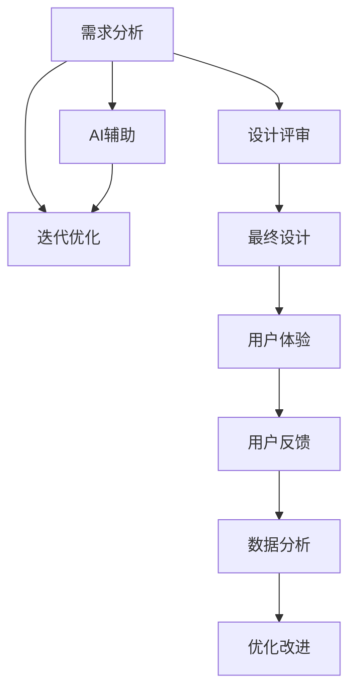

                 

# AI创业公司的用户体验设计流程优化：需求分析、设计评审与迭代优化

> 关键词：用户体验设计, 设计评审, 迭代优化, 需求分析, 人工智能, 创业公司

## 1. 背景介绍

### 1.1 问题由来

在AI创业公司的成长过程中，用户体验设计（User Experience Design, UX设计）扮演着至关重要的角色。通过有效的UX设计，不仅能够提升产品的可用性和用户满意度，还能增加用户粘性和市场竞争力。然而，由于创业公司的资源有限，如何在有限的预算和时间约束下，最大化用户体验，成为一大挑战。传统的用户体验设计流程通常流程繁琐、反馈周期长，难以快速迭代和优化，迫切需要新的方法和工具来解决这些问题。

### 1.2 问题核心关键点

 UX设计流程的核心在于确保产品能够满足用户需求，同时在技术和商业上可行。而核心关键点在于：
1. **需求分析**：精准理解用户需求，避免冗余设计。
2. **设计评审**：确保设计符合用户和商业目标。
3. **迭代优化**：基于用户反馈和数据分析，持续改进设计。

通过优化这些关键点，能够大幅提升用户体验设计流程的效率和效果，从而支撑创业公司的快速成长和市场扩展。

### 1.3 问题研究意义

 UX设计流程优化对创业公司的意义重大：
1. **提升产品竞争力和市场占有率**：优秀的用户体验能够显著提升用户满意度，增加市场份额。
2. **降低开发成本和风险**：通过早期的用户反馈和迭代优化，减少后期修正带来的时间和成本浪费。
3. **提高团队协作效率**：优化流程可以减少沟通障碍，提升跨部门协作效率。
4. **增强用户粘性和品牌忠诚度**：优秀的用户体验能够增加用户粘性和品牌忠诚度，提高产品生命周期。

## 2. 核心概念与联系

### 2.1 核心概念概述

为了更好地理解用户体验设计流程的优化，本节将介绍几个密切相关的核心概念：

- **用户体验设计 (UX设计)**：涵盖用户研究、用户交互设计、可用性测试等环节，旨在提升用户使用产品的体验。
- **需求分析**：通过各种手段，准确理解用户需求，确保产品设计的方向性和实用性。
- **设计评审**：通过跨部门评审，确保设计符合用户和商业目标，避免遗漏关键需求和问题。
- **迭代优化**：通过快速反馈和迭代，不断改进设计，提升用户满意度。
- **人工智能 (AI)**：利用机器学习和自然语言处理等技术，辅助设计决策和优化流程。

这些核心概念之间的逻辑关系可以通过以下Mermaid流程图来展示：



这个流程图展示了UX设计流程的各个环节，并强调了AI技术在其中的作用。

## 3. 核心算法原理 & 具体操作步骤
### 3.1 算法原理概述

用户体验设计流程优化的核心在于：
1. **需求分析阶段**：通过数据分析、用户访谈、问卷调查等方式，准确收集用户需求，并形成可执行的设计方案。
2. **设计评审阶段**：通过跨部门评审，确保设计方案符合用户和商业目标，优化方案的可行性和实用性。
3. **迭代优化阶段**：通过快速原型设计和用户测试，收集用户反馈，不断优化设计方案。

这些阶段通过合理分工和协作，可以显著提升设计的质量和效率。

### 3.2 算法步骤详解

#### 3.2.1 需求分析阶段

**步骤1：数据收集与分析**
- 通过用户访谈、问卷调查、用户行为数据分析等方式，收集用户需求。
- 使用数据可视化工具（如Tableau、Power BI）对数据进行初步分析和解读。

**步骤2：用户画像构建**
- 根据收集到的数据，构建用户画像，明确目标用户群体的特点和需求。
- 使用AI技术（如聚类分析、情感分析等）辅助用户画像构建，提高准确性。

**步骤3：需求定义与优先级排序**
- 根据用户画像和数据分析结果，定义需求列表。
- 使用优先级排序算法（如MoSCoW方法）对需求进行优先级排序，确保关键需求优先得到满足。

#### 3.2.2 设计评审阶段

**步骤1：设计方案制定**
- 基于需求分析结果，制定初步的设计方案。
- 设计方案应包括界面设计、交互设计、信息架构等关键环节。

**步骤2：跨部门评审**
- 邀请产品经理、设计师、工程师、市场运营等部门参与评审，确保设计方案符合业务目标和用户需求。
- 使用设计评审工具（如Miro、Confluence）记录和共享评审意见，促进跨部门协作。

**步骤3：设计方案优化**
- 根据评审意见，对设计方案进行优化。
- 引入AI技术（如自然语言处理、图像识别等）辅助优化设计，提升设计效率和质量。

#### 3.2.3 迭代优化阶段

**步骤1：快速原型设计**
- 使用设计工具（如Sketch、Figma）快速构建设计原型。
- 引入AI技术（如AI驱动的自动化设计工具）加速原型设计。

**步骤2：用户测试与反馈收集**
- 进行用户测试，收集用户反馈和行为数据。
- 使用用户测试工具（如UserTesting、Lookback）优化用户测试流程。

**步骤3：数据分析与改进**
- 对用户测试数据进行分析，找出设计中的问题和改进点。
- 使用数据分析工具（如Google Analytics、Mixpanel）进行深入分析，确保改进措施的有效性。

### 3.3 算法优缺点

 UX设计流程优化算法具有以下优点：
1. **提升设计效率**：通过AI技术辅助，大幅缩短设计周期。
2. **确保设计质量**：跨部门评审机制确保设计符合业务和用户目标。
3. **减少资源浪费**：需求分析和优先级排序，避免冗余设计。
4. **提升用户满意度**：快速原型设计和用户测试，确保设计符合用户需求。

然而，该算法也存在一些缺点：
1. **对AI技术依赖性强**：依赖AI技术的准确性和有效性，可能会引入偏差。
2. **跨部门协作难度大**：需要协调各部门意见，可能存在沟通障碍。
3. **设计复杂度增加**：引入AI技术后，设计流程复杂度可能增加，需要专业人员操作。

### 3.4 算法应用领域

 UX设计流程优化算法在多个领域得到了广泛应用，例如：

- **电子商务平台**：通过优化用户体验，提升用户购买体验和满意度，增加交易转化率。
- **社交媒体应用**：通过优化界面设计和交互逻辑，提升用户粘性和活跃度。
- **移动应用**：通过提升用户体验，增加用户下载和使用率。
- **医疗健康应用**：通过优化设计，提升用户使用体验和健康管理效果。

这些应用场景展示了UX设计流程优化的广泛适用性。

## 4. 数学模型和公式 & 详细讲解 & 举例说明
### 4.1 数学模型构建

为了更好地描述用户体验设计流程，本节将使用数学语言进行更加严格的建模。

假设用户需求数量为 $N$，用户满意度为 $S$，用户反馈数量为 $F$。设计流程优化目标为最大化用户满意度 $S$，即：

$$
\max_{\theta} S = \sum_{i=1}^N s_i
$$

其中 $s_i$ 表示第 $i$ 个用户的需求满意度。

需求分析阶段的目标是最大化需求满足度 $D$，即：

$$
\max_{\theta} D = \sum_{i=1}^N d_i
$$

其中 $d_i$ 表示第 $i$ 个需求的满足度。

设计评审阶段的目标是最大化设计方案的商业价值 $V$，即：

$$
\max_{\theta} V = \sum_{i=1}^N v_i
$$

其中 $v_i$ 表示第 $i$ 个设计方案的商业价值。

迭代优化阶段的目标是最大化用户反馈满意度 $F$，即：

$$
\max_{\theta} F = \sum_{i=1}^N f_i
$$

其中 $f_i$ 表示第 $i$ 个用户反馈的满意度。

### 4.2 公式推导过程

以下我们将通过一系列数学推导，展示用户体验设计流程优化中的关键公式。

#### 4.2.1 需求分析阶段

**需求满足度计算公式**：

$$
d_i = \frac{\text{需求实现度}}{\text{需求期望度}}
$$

其中 $\text{需求实现度}$ 表示需求在产品中的实际实现情况，$\text{需求期望度}$ 表示用户对需求实现的期望。

**需求满足度最大化问题**：

$$
\max_{\theta} \sum_{i=1}^N \frac{\text{需求实现度}}{\text{需求期望度}}
$$

#### 4.2.2 设计评审阶段

**设计方案商业价值计算公式**：

$$
v_i = \text{设计方案价值} \times \text{需求实现度}
$$

其中 $\text{设计方案价值}$ 表示设计方案在业务上的商业价值，$\text{需求实现度}$ 表示设计方案对需求的满足情况。

**设计方案商业价值最大化问题**：

$$
\max_{\theta} \sum_{i=1}^N \text{设计方案价值} \times \frac{\text{需求实现度}}{\text{需求期望度}}
$$

#### 4.2.3 迭代优化阶段

**用户反馈满意度计算公式**：

$$
f_i = \text{用户满意度} \times \text{反馈次数}
$$

其中 $\text{用户满意度}$ 表示用户对设计方案的满意度，$\text{反馈次数}$ 表示用户提供的反馈数量。

**用户反馈满意度最大化问题**：

$$
\max_{\theta} \sum_{i=1}^N \text{用户满意度} \times \text{反馈次数}
$$

### 4.3 案例分析与讲解

#### 4.3.1 案例背景

某电商创业公司开发了一款移动应用，旨在提升用户体验和交易转化率。公司希望通过优化用户体验设计流程，提升用户满意度，增加用户粘性和交易量。

#### 4.3.2 需求分析阶段

**步骤1：数据收集与分析**
- 对现有用户进行问卷调查，收集需求和痛点。
- 使用Tableau对用户数据进行初步分析，找出主要问题和需求。

**步骤2：用户画像构建**
- 根据问卷调查和行为数据，构建用户画像。
- 使用聚类分析技术，将用户分为不同类型，识别出关键用户群体。

**步骤3：需求定义与优先级排序**
- 定义需求列表，包括界面设计、交互设计、功能需求等。
- 使用MoSCoW方法对需求进行优先级排序，确保关键需求优先得到满足。

#### 4.3.3 设计评审阶段

**步骤1：设计方案制定**
- 根据需求分析结果，制定初步的设计方案。
- 设计方案包括用户界面设计、交互逻辑设计、功能模块设计等。

**步骤2：跨部门评审**
- 邀请产品经理、设计师、工程师、市场运营等部门参与评审。
- 使用Miro记录和共享评审意见，促进跨部门协作。

**步骤3：设计方案优化**
- 根据评审意见，对设计方案进行优化。
- 引入自然语言处理技术，辅助优化设计，提升设计质量。

#### 4.3.4 迭代优化阶段

**步骤1：快速原型设计**
- 使用Sketch快速构建设计原型。
- 引入AI驱动的自动化设计工具，加速原型设计过程。

**步骤2：用户测试与反馈收集**
- 进行用户测试，收集用户反馈和行为数据。
- 使用UserTesting工具优化用户测试流程。

**步骤3：数据分析与改进**
- 对用户测试数据进行分析，找出设计中的问题和改进点。
- 使用Google Analytics进行深入分析，确保改进措施的有效性。

## 5. 项目实践：代码实例和详细解释说明
### 5.1 开发环境搭建

在进行用户体验设计流程优化实践前，我们需要准备好开发环境。以下是使用Python进行UX设计流程优化的环境配置流程：

1. 安装Anaconda：从官网下载并安装Anaconda，用于创建独立的Python环境。

2. 创建并激活虚拟环境：
```bash
conda create -n UX-design-env python=3.8 
conda activate UX-design-env
```

3. 安装相关库：
```bash
pip install pandas numpy matplotlib scikit-learn seaborn
```

完成上述步骤后，即可在`UX-design-env`环境中开始用户体验设计流程优化实践。

### 5.2 源代码详细实现

这里我们以用户需求分析为例，给出使用Python进行需求分析的代码实现。

首先，定义需求数据集：

```python
import pandas as pd

# 定义需求数据集
data = pd.DataFrame({
    '需求': ['搜索体验', '商品推荐', '下单流程', '客服支持'],
    '需求实现度': [0.8, 0.7, 0.6, 0.5],
    '需求期望度': [0.9, 0.8, 0.7, 0.6],
    '需求优先级': ['高', '中', '低', '低']
})
```

然后，计算需求满足度：

```python
# 计算需求满足度
data['需求满足度'] = data['需求实现度'] / data['需求期望度']
```

接着，进行需求优先级排序：

```python
# 定义需求优先级排序函数
def sort_by_priority(value):
    if value == '高':
        return 1
    elif value == '中':
        return 2
    else:
        return 3

# 对需求进行优先级排序
data['需求优先级排序'] = data['需求优先级'].apply(sort_by_priority)
data = data.sort_values(by=['需求优先级排序', '需求满足度'], ascending=False)
```

最后，输出优化后的需求列表：

```python
# 输出优化后的需求列表
print(data[['需求', '需求优先级排序', '需求满足度']])
```

### 5.3 代码解读与分析

让我们再详细解读一下关键代码的实现细节：

**需求数据集定义**：
- 使用pandas库定义需求数据集，包含需求、需求实现度、需求期望度和需求优先级等字段。

**需求满足度计算**：
- 使用pandas库的列操作功能，计算需求满足度，即需求实现度除以需求期望度。

**需求优先级排序**：
- 定义一个需求优先级排序函数，将需求优先级映射为数字。
- 使用pandas库的apply函数和sort_values函数，对需求进行优先级排序，确保高优先级需求优先得到满足。

**需求输出**：
- 使用print函数输出优化后的需求列表，帮助设计师明确重点需求。

可以看出，使用Python进行需求分析的代码实现非常简洁高效，能够快速处理大量数据，生成优化后的需求列表，为设计师提供了直观的参考依据。

## 6. 实际应用场景
### 6.1 智能客服系统

在智能客服系统中，用户体验设计流程优化可以显著提升用户满意度和问题解决效率。通过优化需求分析、设计评审和迭代优化，可以快速构建出高效、易用的智能客服系统。

具体而言，可以收集用户的常见问题、解答和反馈，通过数据分析和用户画像构建，找出用户最关注的问题和痛点。在需求分析和优先级排序的基础上，设计高效的用户界面和交互逻辑，确保问题快速解决。通过用户测试和反馈收集，不断优化系统，提升用户满意度。

### 6.2 电商网站

电商网站的用户体验设计流程优化可以提升用户购买体验和交易转化率。通过优化需求分析、设计评审和迭代优化，可以构建出用户友好的电商网站，提升用户体验和购买转化率。

具体而言，可以收集用户浏览、购买、评价等行为数据，通过数据分析和用户画像构建，找出用户购买过程中的主要痛点和需求。在需求分析和优先级排序的基础上，设计高效的产品页面和购物流程，确保用户购物体验流畅。通过用户测试和反馈收集，不断优化系统，提升用户满意度和交易转化率。

### 6.3 金融应用

在金融应用中，用户体验设计流程优化可以提升用户体验和金融服务的安全性和便捷性。通过优化需求分析、设计评审和迭代优化，可以构建出用户友好的金融应用，提升用户体验和金融服务的安全性。

具体而言，可以收集用户的账户管理、交易操作、理财咨询等需求，通过数据分析和用户画像构建，找出用户的主要需求和痛点。在需求分析和优先级排序的基础上，设计高效的用户界面和交互逻辑，确保金融服务的便捷性和安全性。通过用户测试和反馈收集，不断优化系统，提升用户满意度和金融服务的安全性。

### 6.4 未来应用展望

随着用户体验设计流程优化技术的不断发展，未来将在更多领域得到应用，为传统行业带来变革性影响。

在智慧医疗领域，通过优化用户体验设计流程，可以提升患者对医疗服务的满意度和使用体验，辅助医生进行诊断和治疗。在教育领域，通过优化用户体验设计流程，可以提升学生对在线教育的接受度和满意度，优化学习体验。在智能交通领域，通过优化用户体验设计流程，可以提升用户对智能交通系统的使用体验，提升交通效率和安全性。

## 7. 工具和资源推荐
### 7.1 学习资源推荐

为了帮助开发者系统掌握用户体验设计流程优化的理论基础和实践技巧，这里推荐一些优质的学习资源：

1. 《UX设计基础》系列课程：由世界顶尖设计公司提供，涵盖用户体验设计的基本概念和关键技能。

2. 《设计思维》系列书籍：介绍设计思维的基本原理和实用方法，帮助设计师掌握用户研究和需求分析的技巧。

3. 《UX设计流程优化》书籍：详细介绍用户体验设计流程优化的理论基础和实践方法，适合初学者和中级设计师。

4. 《用户体验设计实战》系列课程：由知名设计师主讲，通过实际案例展示用户体验设计流程优化的具体方法和工具。

5. 《UX设计工作坊》系列课程：通过实战工作坊，帮助设计师提升用户体验设计流程优化能力，掌握实际操作技能。

通过对这些资源的学习实践，相信你一定能够快速掌握用户体验设计流程优化的精髓，并用于解决实际的UX问题。

### 7.2 开发工具推荐

高效的开发离不开优秀的工具支持。以下是几款用于用户体验设计流程优化的常用工具：

1. Sketch：专业的界面设计工具，支持多种设计格式和协作方式，适合UI设计师使用。

2. Figma：云端协作设计工具，支持实时协作和版本控制，适合跨部门团队使用。

3. Adobe XD：专业的原型设计工具，支持设计、原型和交互设计，适合UI/UX设计师使用。

4. InVision：原型设计和用户体验测试工具，支持交互式原型和用户测试，适合UX设计师使用。

5. UserTesting：用户测试平台，支持远程用户测试和用户行为分析，适合产品团队使用。

6. Mixpanel：用户行为分析工具，支持深入的用户行为分析和数据可视化，适合产品经理使用。

合理利用这些工具，可以显著提升用户体验设计流程优化的效率，加快创新迭代的步伐。

### 7.3 相关论文推荐

用户体验设计流程优化技术的发展源于学界的持续研究。以下是几篇奠基性的相关论文，推荐阅读：

1. "Designing for Interaction: Creating Innovative Products and Services" by Dan Saffer：介绍设计思维和用户体验设计的基本原理和实践方法。

2. "The User Experience of Use: Attraction and Satisfaction in Software" by Schell and Diner：深入分析用户在使用软件时的吸引力和满意度，提供用户体验设计的具体方法和案例。

3. "User-Centered Design of Software" by Michael Craswick：详细介绍用户体验设计的理论基础和实践技巧，涵盖用户研究和需求分析的关键方法。

4. "Human-Centered Design: Creating Products by People, for People" by Buzan and Law：全面介绍人本设计的基本概念和关键方法，帮助设计师掌握用户研究和需求分析的技巧。

这些论文代表了大用户体验设计流程优化技术的发展脉络。通过学习这些前沿成果，可以帮助研究者把握学科前进方向，激发更多的创新灵感。

## 8. 总结：未来发展趋势与挑战

### 8.1 总结

本文对用户体验设计流程优化的需求分析、设计评审和迭代优化方法进行了全面系统的介绍。首先阐述了用户体验设计流程优化的背景和意义，明确了需求分析、设计评审和迭代优化在提升用户体验中的关键作用。其次，从原理到实践，详细讲解了用户体验设计流程优化的数学模型和操作步骤，给出了具体的代码实现和分析。同时，本文还探讨了用户体验设计流程优化在智能客服、电商、金融等领域的广泛应用，展示了其广阔前景。最后，本文推荐了一些优质的学习资源和工具，力求为读者提供全方位的技术指引。

通过本文的系统梳理，可以看到，用户体验设计流程优化技术正在成为提升用户体验的重要手段，极大地拓展了产品设计的边界，为创业公司的快速成长和市场扩展提供了有力支持。未来，伴随用户体验设计流程优化技术的持续演进，相信将会有更多创新方法和工具涌现，推动用户体验设计迈向更高的台阶，为构建人机协同的智能系统铺平道路。

### 8.2 未来发展趋势

用户体验设计流程优化技术的发展趋势如下：

1. **自动化和智能化**：引入AI技术，自动化需求分析和优先级排序，提升设计效率和质量。
2. **数据驱动**：通过用户行为数据分析，精准把握用户需求和痛点，优化设计方案。
3. **跨领域融合**：结合视觉设计、交互设计、用户体验等多领域知识，提升设计方案的全面性和实用性。
4. **个性化设计**：通过用户画像和用户研究，实现个性化设计，提升用户体验的差异化和多样性。
5. **多模态设计**：结合视觉、听觉、触觉等多模态信息，提升用户交互的丰富性和沉浸感。

以上趋势凸显了用户体验设计流程优化技术的广阔前景。这些方向的探索发展，必将进一步提升用户体验设计流程的效率和效果，为构建智能、便捷、高效的产品和服务提供有力支持。

### 8.3 面临的挑战

尽管用户体验设计流程优化技术已经取得了显著成就，但在迈向更加智能化、普适化应用的过程中，仍面临诸多挑战：

1. **资源有限**：创业公司通常资源有限，难以支撑大规模的用户研究和用户测试，限制了流程优化的深度和广度。
2. **数据质量**：用户行为数据质量参差不齐，难以准确把握用户需求和痛点，影响设计决策的准确性。
3. **跨部门协作**：跨部门协作难度大，不同部门的目标和优先级可能不一致，影响设计的统一性和可行性。
4. **用户反馈处理**：用户反馈复杂多样，难以全面理解和应用，影响设计的迭代优化效果。

### 8.4 研究展望

未来在用户体验设计流程优化领域，需要继续努力克服这些挑战，探索新的方法和工具，提升用户体验设计的质量和效率。

1. **多模态数据融合**：结合视觉、听觉、触觉等多模态数据，提升用户交互的丰富性和沉浸感。
2. **实时数据分析**：引入实时数据分析技术，动态调整设计方案，提升用户体验的及时性和响应性。
3. **用户情感分析**：结合用户情感分析技术，优化用户界面设计和交互逻辑，提升用户情感体验。
4. **跨部门协作机制**：建立跨部门协作机制，确保设计方案符合用户和商业目标，优化设计方案的可行性和实用性。
5. **人工智能辅助设计**：引入AI技术辅助设计决策和优化流程，提升设计效率和质量。

这些研究方向将进一步推动用户体验设计流程优化的发展，为构建智能、便捷、高效的产品和服务提供有力支持。

## 9. 附录：常见问题与解答

**Q1：如何提高用户需求分析的准确性？**

A: 提高用户需求分析的准确性，可以从以下几个方面入手：
1. 进行深度用户访谈，了解用户真实需求和痛点。
2. 使用问卷调查和用户行为数据分析，收集大量用户反馈和行为数据。
3. 引入AI技术，如自然语言处理和聚类分析，辅助需求分析和用户画像构建，提高准确性。

**Q2：如何在跨部门评审中确保设计方案的统一性？**

A: 在跨部门评审中确保设计方案的统一性，需要建立明确的评审标准和流程，包括：
1. 制定统一的评审标准，明确设计方案应满足的关键业务和用户目标。
2. 引入设计评审工具，如Miro和Confluence，记录和共享评审意见，促进跨部门协作。
3. 邀请产品经理、设计师、工程师、市场运营等多部门参与评审，确保设计方案符合各部门的需求和优先级。

**Q3：如何快速进行用户测试和反馈收集？**

A: 快速进行用户测试和反馈收集，可以使用以下工具和方法：
1. 使用UserTesting和Lookback等在线用户测试平台，快速招募测试用户，进行远程用户测试。
2. 使用Mixpanel和Google Analytics等用户行为分析工具，收集用户行为数据，进行深入分析。
3. 设计简洁易用的用户测试流程，减少测试时间，提升测试效率。

**Q4：如何结合多模态数据进行用户体验设计？**

A: 结合多模态数据进行用户体验设计，可以从以下几个方面入手：
1. 收集多模态数据，如用户行为数据、语音数据、生理数据等，全面了解用户需求和行为。
2. 结合视觉、听觉、触觉等多模态信息，设计丰富多样的用户体验，提升用户交互的沉浸感和丰富性。
3. 引入AI技术，如图像识别和语音识别，辅助多模态数据分析和设计决策，提升设计效率和质量。

通过上述方法，可以更好地结合多模态数据进行用户体验设计，提升设计的全面性和实用性。

---

作者：禅与计算机程序设计艺术 / Zen and the Art of Computer Programming

