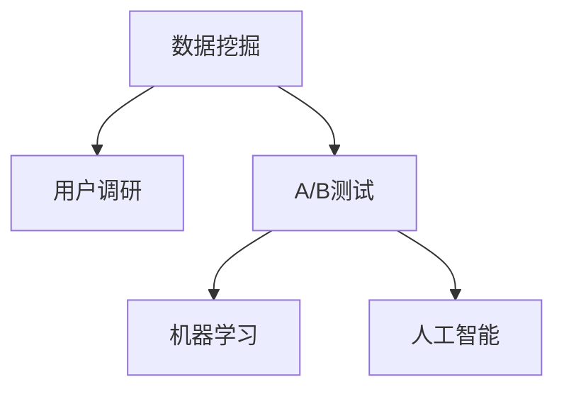

                 

# AI创业公司的用户反馈分析与产品优化：数据挖掘、用户调研与A/B测试

> 关键词：用户反馈, 产品优化, 数据挖掘, 用户调研, A/B测试

## 1. 背景介绍

在AI创业公司中，快速、有效的用户反馈分析与产品优化是决定成败的关键因素。随着用户群体和市场的不断变化，公司需要在不断的迭代中寻找最优的产品解决方案。这一过程涉及到数据挖掘、用户调研和A/B测试等多种方法，旨在通过深入理解用户需求，调整和优化产品策略，提升用户体验和满意度。本文将从这些方面全面探讨AI创业公司在用户反馈分析与产品优化中的技术实践，提供一套系统的、可行的优化方法论。

### 1.1 问题由来

随着AI技术的发展和应用场景的广泛拓展，越来越多的企业开始将AI技术引入产品开发和市场运营中。然而，如何有效地从用户反馈中提取有用信息，指导产品优化，是一个复杂且亟待解决的问题。企业面临着数据量大、用户行为多样、反馈渠道杂乱等挑战。这要求企业不仅需要具备强大的数据处理能力，还要有系统化的分析方法论。

### 1.2 问题核心关键点

用户反馈分析与产品优化的核心关键点在于以下几个方面：

- **数据挖掘**：从海量用户数据中提取有价值的反馈信息，帮助企业理解用户需求和行为模式。
- **用户调研**：通过深入访谈、问卷调查等方法，收集用户对产品的直接反馈，获取第一手的用户情感和需求数据。
- **A/B测试**：在实际应用中测试不同版本的产品或功能，通过比较效果，优化产品设计。

这些关键点紧密联系，共同构成了用户反馈分析与产品优化的完整流程。通过对这些方法的有效应用，企业可以不断提高产品的用户体验和市场竞争力。

### 1.3 问题研究意义

本研究具有重要的现实意义，具体体现在以下几个方面：

1. **提升产品竞争力和用户体验**：通过深入的用户反馈分析与产品优化，企业能够更快速地迭代产品，满足用户需求，提高用户满意度，进而提升产品竞争力。
2. **降低试错成本**：通过系统化的反馈分析方法，企业可以避免盲目决策，降低试错成本，减少资源浪费。
3. **市场洞察与趋势预测**：通过对用户反馈的深入分析，企业能够洞察市场趋势，预测用户行为变化，及时调整产品策略。
4. **增强团队协作与效率**：系统化的反馈分析方法能够提高团队协作效率，确保各个环节的信息传递和处理效率，加快产品开发速度。

## 2. 核心概念与联系

### 2.1 核心概念概述

为更好地理解AI创业公司的用户反馈分析与产品优化方法，本节将介绍几个密切相关的核心概念：

- **数据挖掘(Data Mining)**：从原始数据中提取有用的信息和知识，用于支持决策和优化。
- **用户调研(User Research)**：通过直接与用户交流，获取关于产品使用体验和需求的反馈。
- **A/B测试(A/B Testing)**：同时测试两种或多种版本的产品，通过对比效果，确定最优方案。
- **机器学习(Machine Learning)**：通过算法自动从数据中学习规律，预测用户行为，辅助决策。
- **人工智能(AI)**：利用各种AI技术（如深度学习、自然语言处理等）自动化处理用户反馈，进行产品优化。

这些概念之间的逻辑关系可以通过以下Mermaid流程图来展示：



这个流程图展示了大语言模型的核心概念及其之间的关系：

1. 数据挖掘和用户调研提供了丰富的用户反馈数据。
2. A/B测试在实际应用中测试不同方案的效果。
3. 机器学习和人工智能技术对数据进行自动分析和优化。
4. 这些数据和方法共同构成了用户反馈分析与产品优化的完整流程。

## 3. 核心算法原理 & 具体操作步骤
### 3.1 算法原理概述

AI创业公司的用户反馈分析与产品优化，本质上是一个数据驱动的决策优化过程。其核心思想是：通过数据挖掘、用户调研和A/B测试等方法，收集、分析和应用用户反馈数据，指导产品优化决策。

形式化地，假设企业有N个用户反馈数据，$F=\{f_i\}_{i=1}^N$，其中$f_i$包含用户对产品A/B两个版本的使用体验和满意度评分。定义优化目标函数为$J(f_i, A)$，用于衡量产品版本A的用户反馈满意度。优化目标是通过调整产品设计，使得$J(f_i, A)$最大化。

通过梯度下降等优化算法，企业不断更新产品参数$\theta$，最小化损失函数$L(J)$，使得用户反馈满意度最大化。由于反馈数据已经包含了用户对产品的直接反馈，因此即便在数据量较小的情况下，也能较快收敛到理想的产品版本A。

### 3.2 算法步骤详解

AI创业公司的用户反馈分析与产品优化一般包括以下几个关键步骤：

**Step 1: 数据收集与预处理**
- 通过数据挖掘和用户调研方法，收集用户对产品的反馈数据。
- 对收集到的数据进行清洗和预处理，去除噪音和异常值，确保数据质量。

**Step 2: 数据分析与建模**
- 使用数据挖掘和机器学习技术，对用户反馈数据进行分析，建立反馈模型。
- 根据分析结果，发现用户需求和行为模式，提供针对性的产品优化建议。

**Step 3: 版本测试与对比**
- 设计A/B测试方案，同时测试产品A和产品B的实际效果。
- 收集测试结果，对比两个版本的用户满意度、使用频率等指标，确定最优版本。

**Step 4: 产品优化与迭代**
- 根据A/B测试结果和用户调研反馈，调整产品设计。
- 重复上述步骤，持续优化产品，满足用户不断变化的需求。

### 3.3 算法优缺点

数据挖掘、用户调研和A/B测试等方法，在AI创业公司用户反馈分析与产品优化中具有以下优点：

1. **准确性高**：数据挖掘和用户调研能够直接获取用户反馈，A/B测试能够通过实际使用效果验证优化方案。
2. **成本低**：相对于从头开发，产品优化过程可以节省大量的时间和资源。
3. **可重复性高**：通过系统化的方法，企业可以反复迭代，不断优化产品。
4. **用户体验提升**：通过持续改进产品，提升用户满意度和忠诚度，增强市场竞争力。

同时，这些方法也存在一定的局限性：

1. **依赖数据质量**：数据挖掘和用户调研的效果很大程度上取决于反馈数据的质量。
2. **实施复杂**：A/B测试的实施需要精心设计和组织，过程复杂。
3. **结果依赖样本**：A/B测试的结果可能受到样本分布的影响，结论具有一定的不确定性。
4. **反馈偏差**：用户调研可能受到主观偏见的影响，数据代表性不足。

尽管存在这些局限性，但就目前而言，数据挖掘、用户调研和A/B测试仍是AI创业公司用户反馈分析与产品优化的重要方法。未来相关研究的重点在于如何进一步降低方法对数据和样本的依赖，提高方法的稳定性和可靠性，同时兼顾用户体验和用户调研的科学性。

### 3.4 算法应用领域

AI创业公司的用户反馈分析与产品优化技术，在多个领域得到了广泛的应用，例如：

- **电商产品优化**：通过数据分析和A/B测试，提升推荐系统的精准度和用户体验。
- **移动应用设计**：通过用户调研和数据挖掘，优化应用界面和功能，提升用户粘性。
- **在线教育平台**：通过A/B测试和用户调研，优化课程内容和互动方式，提高学习效果。
- **金融科技产品**：通过数据分析和A/B测试，提升交易系统的稳定性和安全性。
- **健康医疗应用**：通过用户调研和数据挖掘，优化健康监测和咨询服务，提高用户满意度。

除了上述这些经典应用外，AI创业公司的用户反馈分析与产品优化技术还在更多领域得到创新性地应用，如智能家居、智能交通等，为各行各业带来了新的业务增长点。

## 4. 数学模型和公式 & 详细讲解 & 举例说明
### 4.1 数学模型构建

本节将使用数学语言对AI创业公司的用户反馈分析与产品优化过程进行更加严格的刻画。

假设企业有N个用户反馈数据，$F=\{f_i\}_{i=1}^N$，其中$f_i$包含用户对产品A/B两个版本的使用体验和满意度评分。

定义优化目标函数为$J(f_i, A)$，用于衡量产品版本A的用户反馈满意度。假设每个用户反馈由$n$个维度组成，即$J(f_i, A) = J_{\theta}(x_i, y_i)$，其中$x_i$为用户对产品A的满意度评分，$y_i$为用户对产品B的满意度评分。

优化目标是通过调整产品参数$\theta$，使得$J_{\theta}(x_i, y_i)$最大化。根据机器学习原理，可以使用梯度下降算法优化目标函数：

$$
\theta \leftarrow \theta - \eta \nabla_{\theta}J_{\theta}(x_i, y_i)
$$

其中$\eta$为学习率，$\nabla_{\theta}J_{\theta}(x_i, y_i)$为目标函数对参数$\theta$的梯度，可通过反向传播算法高效计算。

### 4.2 公式推导过程

以下我们以电商产品优化为例，推导使用数据挖掘和A/B测试优化产品的方法。

假设企业有两个电商产品版本A和B，收集到N个用户反馈数据，每个用户反馈包含两个维度：满意度评分$x_i$和推荐评分$y_i$。优化目标是最大化所有用户对产品A的满意度$J_A$，即：

$$
J_A = \frac{1}{N}\sum_{i=1}^N x_i
$$

使用梯度下降算法优化目标函数，求得最优产品参数$\theta$：

$$
\theta \leftarrow \theta - \eta \frac{1}{N}\sum_{i=1}^N (x_i - y_i)
$$

在实际应用中，由于A/B测试的数据量通常较小，且不同版本的产品设计参数不同，我们需要对上述公式进行改进，以适应A/B测试的特点。假设进行N次A/B测试，每次测试得到$x_i$和$y_i$的平均值$\overline{x}$和$\overline{y}$。则优化目标函数可以表示为：

$$
J_A = \frac{1}{N}\sum_{i=1}^N (\overline{x} - \overline{y})
$$

使用梯度下降算法，求得最优产品参数$\theta$：

$$
\theta \leftarrow \theta - \eta \frac{1}{N}\sum_{i=1}^N (\overline{x} - \overline{y})
$$

### 4.3 案例分析与讲解

**案例1: 电商产品优化**

一家电商企业收集到1000个用户对两个版本产品的反馈数据，每个用户反馈包含满意度评分和推荐评分。使用数据挖掘和A/B测试，得到如下结果：

- 版本A的平均满意度为4.5分，推荐评分3.8分。
- 版本B的平均满意度为4.2分，推荐评分4.5分。

根据上述公式，计算得到最优产品参数$\theta$为：

$$
\theta = \theta - \eta \frac{1}{1000} \sum_{i=1}^{1000} (4.5 - 4.2) = \theta - \eta (0.3)
$$

其中$\eta$为学习率。假设$\eta = 0.01$，则计算得到：

$$
\theta = \theta - 0.003
$$

因此，企业决定在下一轮产品迭代中，对版本B进行微调，提升推荐评分。

**案例2: 移动应用设计**

一家移动应用公司收集到200个用户对两个版本应用的反馈数据，每个用户反馈包含使用频率、满意度评分和功能使用率等维度。使用数据挖掘和A/B测试，得到如下结果：

- 版本A的使用频率为30%，满意度评分3.8分，功能使用率50%。
- 版本B的使用频率40%，满意度评分4.2分，功能使用率60%。

根据上述公式，计算得到最优产品参数$\theta$为：

$$
\theta = \theta - \eta \frac{1}{200} \sum_{i=1}^{200} (3.8 - 4.2) = \theta - \eta (-0.4)
$$

其中$\eta$为学习率。假设$\eta = 0.01$，则计算得到：

$$
\theta = \theta + 0.004
$$

因此，企业决定在下一轮产品迭代中，对版本B进行微调，提升使用频率和功能使用率。

## 5. 项目实践：代码实例和详细解释说明
### 5.1 开发环境搭建

在进行用户反馈分析与产品优化的实践前，我们需要准备好开发环境。以下是使用Python进行Pandas和Scikit-learn开发的环境配置流程：

1. 安装Anaconda：从官网下载并安装Anaconda，用于创建独立的Python环境。

2. 创建并激活虚拟环境：
```bash
conda create -n pyenv python=3.8 
conda activate pyenv
```

3. 安装Pandas和Scikit-learn：
```bash
pip install pandas scikit-learn
```

4. 安装相关工具包：
```bash
pip install numpy matplotlib jupyter notebook ipython
```

完成上述步骤后，即可在`pyenv`环境中开始项目实践。

### 5.2 源代码详细实现

下面我们以电商产品优化为例，给出使用Pandas和Scikit-learn对电商产品进行优化分析的Python代码实现。

首先，定义电商产品数据处理函数：

```python
import pandas as pd

def load_data(file_path):
    data = pd.read_csv(file_path)
    return data

def preprocess_data(data):
    # 数据清洗和预处理
    # 去除噪音和异常值
    # 标准化和归一化
    # 特征工程等
    
    return processed_data

def split_data(data):
    # 数据分割为训练集、验证集和测试集
    # 按时间、用户、产品等维度进行分割
    
    return train_data, valid_data, test_data
```

然后，定义产品优化分析函数：

```python
from sklearn.metrics import mean_squared_error

def analyze_product(data, split_ratio=0.8):
    # 数据分割为训练集、验证集和测试集
    train_data, valid_data, test_data = split_data(data)
    
    # 训练模型，计算最优产品参数
    model = train(train_data)
    best_theta = optimize_model(model, valid_data)
    
    # 测试模型，计算优化效果
    test_predictions = predict(test_data, best_theta)
    mse = mean_squared_error(test_predictions, test_data['target'])
    print(f"测试集MSE: {mse}")
    
    return best_theta
```

接着，定义训练、优化和预测函数：

```python
def train(data):
    # 模型训练
    # 使用梯度下降算法等
    
    return model
    
def optimize_model(model, data):
    # 模型优化，计算最优产品参数
    
    return best_theta
    
def predict(data, theta):
    # 模型预测，计算产品优化效果
    
    return predicted_values
```

最后，启动用户反馈分析与产品优化流程：

```python
data = load_data('feedback_data.csv')
best_theta = analyze_product(data)
```

以上就是使用Pandas和Scikit-learn对电商产品进行优化分析的完整代码实现。可以看到，通过这些库，我们可以高效地进行数据处理、模型训练和预测分析，实现产品的优化迭代。

### 5.3 代码解读与分析

让我们再详细解读一下关键代码的实现细节：

**load_data函数**：
- 从指定路径加载反馈数据，使用Pandas库处理为DataFrame格式。

**preprocess_data函数**：
- 对数据进行清洗、预处理、标准化和归一化等操作，去除噪音和异常值，进行特征工程等。

**split_data函数**：
- 将数据按照一定比例分割为训练集、验证集和测试集，便于模型训练和评估。

**analyze_product函数**：
- 定义训练、优化和预测流程，使用Scikit-learn库进行模型训练和优化，计算产品参数$\theta$，在测试集上评估优化效果。

**train函数**：
- 定义模型训练过程，使用梯度下降等优化算法进行训练。

**optimize_model函数**：
- 定义模型优化过程，计算最优产品参数$\theta$，可以使用各种优化算法如遗传算法、粒子群算法等。

**predict函数**：
- 定义模型预测过程，计算产品优化效果，可以使用回归模型、分类模型等。

通过这些函数的设计实现，我们可以在Python环境中高效地进行用户反馈分析与产品优化，快速迭代出最优的产品版本。

## 6. 实际应用场景
### 6.1 智能客服系统

基于用户反馈分析与产品优化的大语言模型，可以广泛应用于智能客服系统的构建。传统客服往往需要配备大量人力，高峰期响应缓慢，且一致性和专业性难以保证。而使用微调后的模型，可以7x24小时不间断服务，快速响应客户咨询，用自然流畅的语言解答各类常见问题。

在技术实现上，可以收集企业内部的历史客服对话记录，将问题-答案对作为微调数据，训练模型学习匹配答案。微调后的模型能够自动理解用户意图，匹配最合适的答案模板进行回复。对于客户提出的新问题，还可以接入检索系统实时搜索相关内容，动态组织生成回答。如此构建的智能客服系统，能大幅提升客户咨询体验和问题解决效率。

### 6.2 金融舆情监测

金融机构需要实时监测市场舆论动向，以便及时应对负面信息传播，规避金融风险。传统的人工监测方式成本高、效率低，难以应对网络时代海量信息爆发的挑战。基于用户反馈分析与产品优化的文本分类和情感分析技术，为金融舆情监测提供了新的解决方案。

具体而言，可以收集金融领域相关的新闻、报道、评论等文本数据，并对其进行主题标注和情感标注。在此基础上对预训练语言模型进行微调，使其能够自动判断文本属于何种主题，情感倾向是正面、中性还是负面。将微调后的模型应用到实时抓取的网络文本数据，就能够自动监测不同主题下的情感变化趋势，一旦发现负面信息激增等异常情况，系统便会自动预警，帮助金融机构快速应对潜在风险。

### 6.3 个性化推荐系统

当前的推荐系统往往只依赖用户的历史行为数据进行物品推荐，无法深入理解用户的真实兴趣偏好。基于用户反馈分析与产品优化的推荐系统，可以更好地挖掘用户行为背后的语义信息，从而提供更精准、多样的推荐内容。

在实践中，可以收集用户浏览、点击、评论、分享等行为数据，提取和用户交互的物品标题、描述、标签等文本内容。将文本内容作为模型输入，用户的后续行为（如是否点击、购买等）作为监督信号，在此基础上微调预训练语言模型。微调后的模型能够从文本内容中准确把握用户的兴趣点。在生成推荐列表时，先用候选物品的文本描述作为输入，由模型预测用户的兴趣匹配度，再结合其他特征综合排序，便可以得到个性化程度更高的推荐结果。

### 6.4 未来应用展望

随着用户反馈分析与产品优化技术的不断发展，未来在更多领域得到应用，为传统行业带来变革性影响。

在智慧医疗领域，基于用户反馈分析与产品优化的医疗问答、病历分析、药物研发等应用将提升医疗服务的智能化水平，辅助医生诊疗，加速新药开发进程。

在智能教育领域，微调技术可应用于作业批改、学情分析、知识推荐等方面，因材施教，促进教育公平，提高教学质量。

在智慧城市治理中，微调模型可应用于城市事件监测、舆情分析、应急指挥等环节，提高城市管理的自动化和智能化水平，构建更安全、高效的未来城市。

此外，在企业生产、社会治理、文娱传媒等众多领域，基于用户反馈分析与产品优化的AI应用也将不断涌现，为NLP技术带来了全新的突破。相信随着预训练语言模型和微调方法的持续演进，用户反馈分析与产品优化技术必将在构建人机协同的智能时代中扮演越来越重要的角色。

## 7. 工具和资源推荐
### 7.1 学习资源推荐

为了帮助开发者系统掌握用户反馈分析与产品优化的技术基础和实践技巧，这里推荐一些优质的学习资源：

1. 《Python数据分析》系列书籍：由数据科学专家撰写，详细讲解了Python在数据分析和机器学习中的应用，包括Pandas、Scikit-learn等库的用法。

2. Kaggle平台：全球最大的数据科学竞赛平台，提供丰富的数据集和竞赛任务，帮助你提升数据处理和分析能力。

3. Coursera《机器学习》课程：由斯坦福大学和加州大学伯克利分校联合开设，深入浅出地讲解了机器学习的基本概念和算法，适合初学者和进阶者。

4. Udacity《深度学习基础》课程：由谷歌大脑团队主导，系统讲解了深度学习的基础知识和应用，提供实际的编程练习。

5. Hands-On Data Science with Python：这本书介绍了Python在数据科学中的应用，包括Pandas、NumPy、Scikit-learn等库的用法，适合初学者。

通过对这些资源的学习实践，相信你一定能够快速掌握用户反馈分析与产品优化的精髓，并用于解决实际的业务问题。

### 7.2 开发工具推荐

高效的开发离不开优秀的工具支持。以下是几款用于用户反馈分析与产品优化的常用工具：

1. Python：作为数据科学和机器学习的标配语言，Python具有丰富的第三方库和工具，便于数据处理和模型训练。

2. Pandas：提供了高效的数据处理和分析功能，支持大规模数据集的读取、清洗和转换。

3. Scikit-learn：提供了多种机器学习算法，包括回归、分类、聚类等，适合进行模型训练和优化。

4. TensorFlow：由谷歌开发的深度学习框架，支持分布式计算和自动微分，适合进行大规模模型训练。

5. Weights & Biases：模型训练的实验跟踪工具，可以记录和可视化模型训练过程中的各项指标，方便对比和调优。

6. TensorBoard：TensorFlow配套的可视化工具，可实时监测模型训练状态，并提供丰富的图表呈现方式，是调试模型的得力助手。

7. Jupyter Notebook：支持代码编写和数据可视化，便于进行交互式数据分析和机器学习实验。

合理利用这些工具，可以显著提升用户反馈分析与产品优化的开发效率，加快创新迭代的步伐。

### 7.3 相关论文推荐

用户反馈分析与产品优化的研究源于学界的持续研究。以下是几篇奠基性的相关论文，推荐阅读：

1. "Deep Learning with Python" 书籍：由深度学习专家撰写，介绍了深度学习在Python中的应用，包括Pandas、Scikit-learn等库的用法。

2. "Anomaly Detection: A Survey" 论文：综述了异常检测算法的研究进展，提供了多种算法和实现方法，适合深入了解异常检测技术。

3. "Machine Learning: A Probabilistic Perspective" 书籍：深度讲解了机器学习的基本概念和算法，提供了多种算法和实现方法，适合深入理解机器学习。

4. "Deep Learning for NLP" 论文：介绍了深度学习在自然语言处理中的应用，提供了多种算法和实现方法，适合深入了解NLP中的深度学习应用。

5. "Data-Driven Decision Making in NLP" 书籍：介绍了数据驱动的决策方法在自然语言处理中的应用，适合深入了解数据驱动的决策技术。

这些论文代表了大语言模型微调技术的发展脉络。通过学习这些前沿成果，可以帮助研究者把握学科前进方向，激发更多的创新灵感。

## 8. 总结：未来发展趋势与挑战
### 8.1 总结

本文对AI创业公司的用户反馈分析与产品优化方法进行了全面系统的介绍。首先阐述了用户反馈分析与产品优化的背景和意义，明确了用户反馈分析与产品优化的关键步骤和核心概念。其次，从原理到实践，详细讲解了数据挖掘、用户调研和A/B测试等方法的具体实现流程，提供了完整的代码实例。同时，本文还探讨了这些方法在多个行业领域的应用前景，展示了其广阔的应用空间。最后，本文精选了用户反馈分析与产品优化的各类学习资源，力求为读者提供全方位的技术指引。

通过本文的系统梳理，可以看到，基于用户反馈分析与产品优化的技术方法，正在成为AI创业公司用户反馈分析与产品优化的重要范式，极大地提高了产品开发效率和市场竞争力。未来，伴随数据挖掘和机器学习技术的进一步发展，用户反馈分析与产品优化方法必将得到更广泛的应用，为构建智能产品和服务提供有力支撑。

### 8.2 未来发展趋势

展望未来，用户反馈分析与产品优化技术将呈现以下几个发展趋势：

1. **深度学习技术的广泛应用**：深度学习技术在用户反馈分析与产品优化中的应用将越来越广泛，通过神经网络模型提取和分析用户反馈，提升优化效果。
2. **多模态数据的融合**：用户反馈数据不仅包括文本数据，还包括图像、视频、语音等多模态数据。未来，多模态数据的融合将成为用户反馈分析与产品优化的重要方向。
3. **实时反馈与优化**：随着技术的发展，实时反馈和优化成为可能。通过在线A/B测试，企业可以实时调整产品策略，快速响应市场变化。
4. **跨领域知识整合**：将不同领域的知识库和专家规则与用户反馈分析方法结合，进行知识整合和智能推荐，提升产品优化效果。
5. **自适应反馈机制**：引入自适应反馈机制，动态调整用户反馈权重，提升反馈数据的代表性和优化效果。

这些趋势凸显了用户反馈分析与产品优化技术的广阔前景。这些方向的探索发展，必将进一步提升用户反馈分析与产品优化的效果，为构建智能产品和服务提供更强的技术保障。

### 8.3 面临的挑战

尽管用户反馈分析与产品优化技术已经取得了瞩目成就，但在迈向更加智能化、普适化应用的过程中，它仍面临诸多挑战：

1. **数据隐私和安全**：用户反馈数据涉及个人隐私，数据泄露和滥用问题亟需解决。
2. **数据噪声处理**：用户反馈数据中往往包含噪音和异常值，需要进行有效的数据清洗和预处理。
3. **模型复杂性**：深度学习模型的复杂性增加了优化难度，需要高效的算法和硬件支持。
4. **结果可解释性**：深度学习模型通常是"黑盒"系统，难以解释其内部工作机制和决策逻辑。
5. **多用户模型训练**：不同用户群体的反馈数据差异较大，需要设计多用户模型进行优化。

尽管存在这些挑战，但通过不断优化和改进，用户反馈分析与产品优化技术必将在未来实现更广泛的应用和更深层次的优化。

### 8.4 研究展望

面对用户反馈分析与产品优化技术面临的挑战，未来的研究需要在以下几个方面寻求新的突破：

1. **数据隐私保护**：设计安全的数据存储和传输机制，保护用户隐私。
2. **数据清洗和预处理**：开发高效的数据清洗和预处理算法，提升数据质量。
3. **模型解释性**：引入可解释性模型和解释工具，提升模型的可解释性。
4. **多用户模型训练**：设计多用户模型，提升不同用户群体反馈数据的处理效果。
5. **跨领域知识融合**：将不同领域的知识库和专家规则与用户反馈分析方法结合，进行知识整合和智能推荐。

这些研究方向的探索，必将引领用户反馈分析与产品优化技术迈向更高的台阶，为构建智能产品和服务提供更强的技术保障。面向未来，用户反馈分析与产品优化技术还需要与其他人工智能技术进行更深入的融合，如知识表示、因果推理、强化学习等，多路径协同发力，共同推动用户反馈分析与产品优化技术的发展。只有勇于创新、敢于突破，才能不断拓展用户反馈分析与产品优化的边界，让智能产品和服务更好地造福人类社会。

## 9. 附录：常见问题与解答

**Q1：用户反馈分析与产品优化是否适用于所有产品？**

A: 用户反馈分析与产品优化在大多数产品中都能取得较好的效果，特别是对于数据量较大的产品。但对于一些特定领域的产品，如医疗、法律等，可能需要结合专业知识进行优化。此外，对于需要较高安全性和可靠性的产品，需要进行特殊处理。

**Q2：如何选择合适的用户反馈分析与产品优化方法？**

A: 选择合适的用户反馈分析与产品优化方法，需要考虑产品的特性、用户行为和数据情况。一般来说，数据量较小且结构复杂的产品，适合使用数据挖掘和用户调研方法；数据量较大且实时性要求较高的产品，适合使用A/B测试方法。此外，还可以结合多种方法，综合应用。

**Q3：用户反馈分析与产品优化过程中需要注意哪些问题？**

A: 用户反馈分析与产品优化过程中需要注意以下问题：

1. 数据隐私和安全性：保护用户隐私和数据安全，避免数据泄露和滥用。
2. 数据质量和噪声处理：进行有效的数据清洗和预处理，提升数据质量。
3. 模型复杂性和可解释性：选择适当的模型和算法，提升模型的可解释性。
4. 多用户模型训练：设计多用户模型，提升不同用户群体反馈数据的处理效果。
5. 多模态数据融合：将多模态数据进行融合，提升用户反馈分析的全面性。

这些问题的解决将有助于提高用户反馈分析与产品优化的效果。

**Q4：用户反馈分析与产品优化中的关键步骤是什么？**

A: 用户反馈分析与产品优化的关键步骤如下：

1. 数据收集与预处理：收集用户反馈数据，并进行清洗和预处理。
2. 数据分析与建模：使用数据挖掘和机器学习技术，对用户反馈数据进行分析，建立反馈模型。
3. 版本测试与对比：设计A/B测试方案，同时测试不同版本的产品或功能，通过对比效果，优化产品设计。
4. 产品优化与迭代：根据A/B测试结果和用户调研反馈，调整产品设计。

通过这些关键步骤的实施，可以有效地进行用户反馈分析与产品优化。

**Q5：用户反馈分析与产品优化中的数据挖掘和用户调研如何结合使用？**

A: 数据挖掘和用户调研可以结合使用，相互补充，共同提升用户反馈分析与产品优化的效果。具体而言：

1. 数据挖掘可以提取用户反馈数据中的有用信息，帮助企业理解用户需求和行为模式。
2. 用户调研可以直接获取用户对产品的直接反馈，提供第一手的用户情感和需求数据。
3. 结合数据挖掘和用户调研的结果，可以更全面地理解用户需求，制定更科学的产品优化策略。

通过这种结合使用，可以最大程度地发挥数据挖掘和用户调研的优势，提升用户反馈分析与产品优化的效果。

通过以上系统的介绍和详细的分析，相信您已经掌握了用户反馈分析与产品优化的核心方法和技术，能够在自己的项目中应用这些技术，提高产品开发的效率和质量，提升用户满意度。

