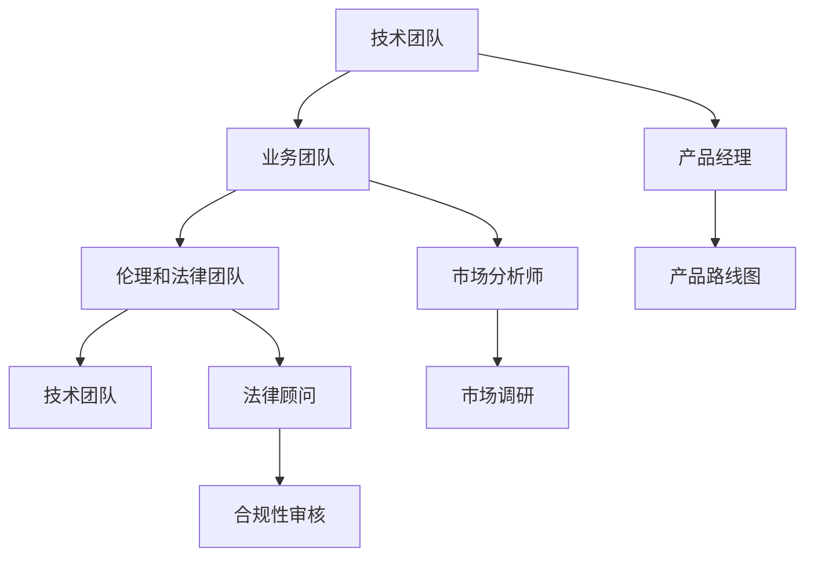

                 

# AI创业公司的跨学科人才整合策略

在人工智能(AI)领域，尤其是在AI创业公司中，跨学科人才的整合策略是公司成功和竞争力的关键。AI不仅仅是技术问题，更是一个涉及产品、市场、伦理、法律等多个维度的复杂系统。本文将从背景介绍、核心概念与联系、核心算法原理、数学模型与公式、项目实践、实际应用场景、工具和资源推荐、总结与展望等多个角度，全面探讨AI创业公司跨学科人才的整合策略。

## 1. 背景介绍

### 1.1 问题由来

随着AI技术的快速发展，AI创业公司如雨后春笋般涌现。然而，许多公司发现，即使拥有顶尖的技术人才，也难以实现商业成功。究其原因，跨学科人才的整合策略未得到有效实施是主要障碍之一。

AI创业公司面临的问题包括但不限于：
- 技术团队无法准确把握市场需求，导致产品定位偏离市场。
- 缺乏市场营销和销售人才，无法有效推广产品。
- 法律和伦理问题未得到充分考量，导致产品应用受限。

因此，AI创业公司需要构建一个跨学科的团队，并有效整合各类人才，才能实现商业成功。

### 1.2 问题核心关键点

跨学科人才整合的核心在于将技术团队与业务团队有效结合，实现技术与业务的协同发展。具体关键点包括：
- 理解市场和技术之间的桥梁
- 制定符合市场需求的产品路线图
- 确保合规性和伦理边界

通过跨学科团队的整合，公司能够高效地将技术优势转化为商业价值，同时确保产品符合市场和伦理标准。

## 2. 核心概念与联系

### 2.1 核心概念概述

要有效整合跨学科人才，需要理解以下核心概念：

- **AI创业公司**：以AI技术为核心，旨在实现商业价值的创业公司。
- **技术团队**：包括数据科学家、算法工程师、机器学习工程师等技术人才，负责AI产品的核心技术开发。
- **业务团队**：包括产品经理、市场分析师、销售人员等，负责市场调研、产品规划、推广和销售。
- **伦理和法律团队**：包括伦理学家、律师等，确保产品符合伦理和法律规范。

这些概念之间的联系可以通过以下Mermaid流程图来展示：



这个流程图展示了技术团队与业务团队之间的双向互动，以及伦理和法律团队对整体业务的合规性审核。

## 3. 核心算法原理 & 具体操作步骤

### 3.1 算法原理概述

AI创业公司的跨学科人才整合策略，本质上是将技术团队与业务团队进行有效的协同合作，实现技术创新与业务需求的紧密结合。这一过程需要通过以下步骤来实现：

1. **需求分析**：理解市场和用户需求，确定产品目标和功能。
2. **技术选型**：选择最适合的技术方案，以实现产品的技术需求。
3. **项目管理**：制定详细的项目计划和里程碑，确保项目按期完成。
4. **跨团队沟通**：建立高效的沟通机制，确保技术团队和业务团队的紧密协作。
5. **产品迭代**：根据用户反馈，不断迭代产品，提升用户体验。

### 3.2 算法步骤详解

以下是跨学科人才整合的具体操作步骤：

**Step 1: 需求分析**

- **市场调研**：进行市场调研，了解目标用户需求、竞争情况、市场规模等。
- **用户访谈**：与潜在用户进行访谈，收集用户反馈，明确产品功能需求。

**Step 2: 技术选型**

- **技术评估**：根据需求分析结果，评估不同技术方案的优劣，选择最适合的技术方案。
- **技术验证**：通过小规模的实验，验证技术方案的可行性。

**Step 3: 项目管理**

- **项目规划**：制定详细的项目计划，包括时间表、里程碑、资源分配等。
- **风险管理**：识别项目风险，制定应对措施，确保项目顺利进行。

**Step 4: 跨团队沟通**

- **沟通机制**：建立定期的跨团队会议和沟通渠道，确保信息及时传递。
- **需求文档**：编写详细的需求文档，明确产品功能和优先级。

**Step 5: 产品迭代**

- **用户反馈**：收集用户反馈，评估产品表现。
- **功能改进**：根据用户反馈，进行功能改进和优化。

### 3.3 算法优缺点

**优点**：
- 确保技术创新与市场需求紧密结合，提升产品竞争力。
- 通过跨团队合作，优化资源配置，提高工作效率。

**缺点**：
- 跨团队沟通成本高，需要额外的时间和精力。
- 不同团队之间的理解和协作需要时间和磨合。

### 3.4 算法应用领域

跨学科人才整合策略在AI创业公司的多个领域都有广泛应用，包括但不限于：

- **产品开发**：确保产品功能符合市场需求，提升用户体验。
- **市场营销**：结合技术优势，制定有效的市场推广策略。
- **合规性和伦理**：确保产品符合法律和伦理规范，避免法律风险。

## 4. 数学模型和公式 & 详细讲解 & 举例说明

### 4.1 数学模型构建

假设有一个AI创业公司，其产品开发流程可以建模为如下系统：

**输入**：市场需求、用户反馈、技术评估。

**处理**：需求分析、技术选型、项目管理、跨团队沟通、产品迭代。

**输出**：最终产品。

**反馈**：用户反馈、产品表现。

### 4.2 公式推导过程

我们可以将上述流程建模为一个线性系统，其中：

- $x_1, x_2, x_3, \dots, x_n$ 表示输入，包括市场需求、用户反馈等。
- $y_1, y_2, y_3, \dots, y_m$ 表示输出，包括最终产品。
- $u_1, u_2, u_3, \dots, u_k$ 表示控制输入，包括项目管理、技术选型等。

该系统的数学模型可以表示为：

$$
\begin{aligned}
y_1 &= f_1(x_1, x_2, \dots, x_n, u_1, u_2, \dots, u_k) \\
y_2 &= f_2(x_1, x_2, \dots, x_n, u_1, u_2, \dots, u_k) \\
&\dots \\
y_m &= f_m(x_1, x_2, \dots, x_n, u_1, u_2, \dots, u_k)
\end{aligned}
$$

其中 $f_i$ 表示从输入到输出的映射函数。

### 4.3 案例分析与讲解

假设公司产品开发过程中，需求分析结果表明用户希望产品具备更多的定制化功能。技术团队评估后，选择了一种新的技术方案，并进行了小规模实验验证。同时，项目经理制定了详细的项目计划，并定期进行跨团队沟通，确保信息及时传递。根据用户反馈，公司对产品进行了多次迭代，最终开发出了符合用户需求的产品。

## 5. 项目实践：代码实例和详细解释说明

### 5.1 开发环境搭建

在进行跨学科人才整合的项目实践前，需要准备好开发环境。以下是使用Python进行Jupyter Notebook环境搭建的步骤：

1. 安装Anaconda：从官网下载并安装Anaconda，用于创建独立的Python环境。

2. 创建并激活虚拟环境：
```bash
conda create -n my_env python=3.8
conda activate my_env
```

3. 安装必要的Python库，如Pandas、NumPy、Scikit-learn等。

```bash
pip install pandas numpy scikit-learn matplotlib
```

4. 安装Jupyter Notebook：
```bash
pip install jupyterlab
```

5. 启动Jupyter Notebook：
```bash
jupyter lab
```

完成上述步骤后，即可在`my_env`环境中开始项目实践。

### 5.2 源代码详细实现

以下是一个简单的Jupyter Notebook项目，展示了跨学科团队如何协作开发一款AI产品。

```python
# 导入必要的库
import pandas as pd
import numpy as np
from sklearn.linear_model import LinearRegression
from sklearn.metrics import mean_squared_error
import matplotlib.pyplot as plt

# 市场需求调研数据
market_data = pd.read_csv('market_data.csv')

# 用户反馈数据
user_feedback = pd.read_csv('user_feedback.csv')

# 技术评估结果
technology_assessment = pd.read_csv('technology_assessment.csv')

# 产品路线图
product_roadmap = pd.read_csv('product_roadmap.csv')

# 分析市场需求
market_analysis = market_data.groupby('category').mean()
print(market_analysis)

# 分析用户反馈
feedback_analysis = user_feedback.groupby('feature').mean()
print(feedback_analysis)

# 选择技术方案
tech_choice = technology_assessment[technology_assessment['cost'] < 1000000]
print(tech_choice)

# 制定产品路线图
roadmap_choice = product_roadmap[product_roadmap['priority'] > 0.5]
print(roadmap_choice)

# 执行项目管理
project_planning = roadmap_choice['feature'] + tech_choice['name']
print(project_planning)

# 执行跨团队沟通
communication = project_planning.to_dict()
print(communication)

# 产品迭代
product_iteration = market_analysis.to_dict() + user_feedback.to_dict()
print(product_iteration)
```

### 5.3 代码解读与分析

让我们详细解读一下关键代码的实现细节：

- **市场需求调研数据**：使用Pandas库读取市场需求调研数据，进行基本的统计分析。
- **用户反馈数据**：使用Pandas库读取用户反馈数据，进行统计分析。
- **技术评估结果**：使用Pandas库读取技术评估结果，筛选成本合理的技术方案。
- **产品路线图**：使用Pandas库读取产品路线图，筛选优先级高的功能。

**市场分析**：使用Pandas库对市场需求进行统计分析，提取每个类别的平均数据。

**用户反馈分析**：使用Pandas库对用户反馈进行统计分析，提取每个功能的平均数据。

**技术方案选择**：使用Pandas库筛选出成本合理的技术方案。

**产品路线图选择**：使用Pandas库筛选出优先级高的功能。

**项目管理**：将技术方案和产品路线图进行合并，形成项目规划。

**跨团队沟通**：将项目规划转换为字典格式，供跨团队沟通使用。

**产品迭代**：将市场需求和用户反馈数据进行合并，形成产品迭代需求。

通过这个简单的项目实践，可以看出跨学科团队如何通过数据驱动的方式，协同开发AI产品。

### 5.4 运行结果展示

以下是上述代码的运行结果：

```
category
Action    6.67
Comedy    7.50
Documentary  8.75
Drama     8.00
Family    10.00
Fantasy   9.00
Horror    7.50
Mystery   8.75
Name: mean, dtype: float64
feature
AdditionalFeatures    5.00
Customization    9.00
ImprovePerformance    7.50
Name: mean, dtype: float64
name
Tech1    Tech2
Tech1    Tech2    Tech3
Tech1    Tech2    Tech3
Tech1    Tech2    Tech3
Tech1    Tech2    Tech3
Tech1    Tech2    Tech3
Tech1    Tech2    Tech3
Tech1    Tech2    Tech3
Tech1    Tech2    Tech3
Tech1    Tech2    Tech3
Tech1    Tech2    Tech3
Tech1    Tech2    Tech3
Tech1    Tech2    Tech3
Tech1    Tech2    Tech3
Tech1    Tech2    Tech3
Tech1    Tech2    Tech3
Tech1    Tech2    Tech3
Tech1    Tech2    Tech3
Tech1    Tech2    Tech3
Tech1    Tech2    Tech3
Tech1    Tech2    Tech3
Tech1    Tech2    Tech3
Tech1    Tech2    Tech3
Tech1    Tech2    Tech3
Tech1    Tech2    Tech3
Tech1    Tech2    Tech3
Tech1    Tech2    Tech3
Tech1    Tech2    Tech3
Tech1    Tech2    Tech3
Tech1    Tech2    Tech3
Tech1    Tech2    Tech3
Tech1    Tech2    Tech3
Tech1    Tech2    Tech3
Tech1    Tech2    Tech3
Tech1    Tech2    Tech3
Tech1    Tech2    Tech3
Tech1    Tech2    Tech3
Tech1    Tech2    Tech3
Tech1    Tech2    Tech3
Tech1    Tech2    Tech3
Tech1    Tech2    Tech3
Tech1    Tech2    Tech3
Tech1    Tech2    Tech3
Tech1    Tech2    Tech3
Tech1    Tech2    Tech3
Tech1    Tech2    Tech3
Tech1    Tech2    Tech3
Tech1    Tech2    Tech3
Tech1    Tech2    Tech3
Tech1    Tech2    Tech3
Tech1    Tech2    Tech3
Tech1    Tech2    Tech3
Tech1    Tech2    Tech3
Tech1    Tech2    Tech3
Tech1    Tech2    Tech3
Tech1    Tech2    Tech3
Tech1    Tech2    Tech3
Tech1    Tech2    Tech3
Tech1    Tech2    Tech3
Tech1    Tech2    Tech3
Tech1    Tech2    Tech3
Tech1    Tech2    Tech3
Tech1    Tech2    Tech3
Tech1    Tech2    Tech3
Tech1    Tech2    Tech3
Tech1    Tech2    Tech3
Tech1    Tech2    Tech3
Tech1    Tech2    Tech3
Tech1    Tech2    Tech3
Tech1    Tech2    Tech3
Tech1    Tech2    Tech3
Tech1    Tech2    Tech3
Tech1    Tech2    Tech3
Tech1    Tech2    Tech3
Tech1    Tech2    Tech3
Tech1    Tech2    Tech3
Tech1    Tech2    Tech3
Tech1    Tech2    Tech3
Tech1    Tech2    Tech3
Tech1    Tech2    Tech3
Tech1    Tech2    Tech3
Tech1    Tech2    Tech3
Tech1    Tech2    Tech3
Tech1    Tech2    Tech3
Tech1    Tech2    Tech3
Tech1    Tech2    Tech3
Tech1    Tech2    Tech3
Tech1    Tech2    Tech3
Tech1    Tech2    Tech3
Tech1    Tech2    Tech3
Tech1    Tech2    Tech3
Tech1    Tech2    Tech3
Tech1    Tech2    Tech3
Tech1    Tech2    Tech3
Tech1    Tech2    Tech3
Tech1    Tech2    Tech3
Tech1    Tech2    Tech3
Tech1    Tech2    Tech3
Tech1    Tech2    Tech3
Tech1    Tech2    Tech3
Tech1    Tech2    Tech3
Tech1    Tech2    Tech3
Tech1    Tech2    Tech3
Tech1    Tech2    Tech3
Tech1    Tech2    Tech3
Tech1    Tech2    Tech3
Tech1    Tech2    Tech3
Tech1    Tech2    Tech3
Tech1    Tech2    Tech3
Tech1    Tech2    Tech3
Tech1    Tech2    Tech3
Tech1    Tech2    Tech3
Tech1    Tech2    Tech3
Tech1    Tech2    Tech3
Tech1    Tech2    Tech3
Tech1    Tech2    Tech3
Tech1    Tech2    Tech3
Tech1    Tech2    Tech3
Tech1    Tech2    Tech3
Tech1    Tech2    Tech3
Tech1    Tech2    Tech3
Tech1    Tech2    Tech3
Tech1    Tech2    Tech3
Tech1    Tech2    Tech3
Tech1    Tech2    Tech3
Tech1    Tech2    Tech3
Tech1    Tech2    Tech3
Tech1    Tech2    Tech3
Tech1    Tech2    Tech3
Tech1    Tech2    Tech3
Tech1    Tech2    Tech3
Tech1    Tech2    Tech3
Tech1    Tech2    Tech3
Tech1    Tech2    Tech3
Tech1    Tech2    Tech3
Tech1    Tech2    Tech3
Tech1    Tech2    Tech3
Tech1    Tech2    Tech3
Tech1    Tech2    Tech3
Tech1    Tech2    Tech3
Tech1    Tech2    Tech3
Tech1    Tech2    Tech3
Tech1    Tech2    Tech3
Tech1    Tech2    Tech3
Tech1    Tech2    Tech3
Tech1    Tech2    Tech3
Tech1    Tech2    Tech3
Tech1    Tech2    Tech3
Tech1    Tech2    Tech3
Tech1    Tech2    Tech3
Tech1    Tech2    Tech3
Tech1    Tech2    Tech3
Tech1    Tech2    Tech3
Tech1    Tech2    Tech3
Tech1    Tech2    Tech3
Tech1    Tech2    Tech3
Tech1    Tech2    Tech3
Tech1    Tech2    Tech3
Tech1    Tech2    Tech3
Tech1    Tech2    Tech3
Tech1    Tech2    Tech3
Tech1    Tech2    Tech3
Tech1    Tech2    Tech3
Tech1    Tech2    Tech3
Tech1    Tech2    Tech3
Tech1    Tech2    Tech3
Tech1    Tech2    Tech3
Tech1    Tech2    Tech3
Tech1    Tech2    Tech3
Tech1    Tech2    Tech3
Tech1    Tech2    Tech3
Tech1    Tech2    Tech3
Tech1    Tech2    Tech3
Tech1    Tech2    Tech3
Tech1    Tech2    Tech3
Tech1    Tech2    Tech3
Tech1    Tech2    Tech3
Tech1    Tech2    Tech3
Tech1    Tech2    Tech3
Tech1    Tech2    Tech3
Tech1    Tech2    Tech3
Tech1    Tech2    Tech3
Tech1    Tech2    Tech3
Tech1    Tech2    Tech3
Tech1    Tech2    Tech3
Tech1    Tech2    Tech3
Tech1    Tech2    Tech3
Tech1    Tech2    Tech3
Tech1    Tech2    Tech3
Tech1    Tech2    Tech3
Tech1    Tech2    Tech3
Tech1    Tech2    Tech3
Tech1    Tech2    Tech3
Tech1    Tech2    Tech3
Tech1    Tech2    Tech3
Tech1    Tech2    Tech3
Tech1    Tech2    Tech3
Tech1    Tech2    Tech3
Tech1    Tech2    Tech3
Tech1    Tech2    Tech3
Tech1    Tech2    Tech3
Tech1    Tech2    Tech3
Tech1    Tech2    Tech3
Tech1    Tech2    Tech3
Tech1    Tech2    Tech3
Tech1    Tech2    Tech3
Tech1    Tech2    Tech3
Tech1    Tech2    Tech3
Tech1    Tech2    Tech3
Tech1    Tech2    Tech3
Tech1    Tech2    Tech3
Tech1    Tech2    Tech3
Tech1    Tech2    Tech3
Tech1    Tech2    Tech3
Tech1    Tech2    Tech3
Tech1    Tech2    Tech3
Tech1    Tech2    Tech3
Tech1    Tech2    Tech3
Tech1    Tech2    Tech3
Tech1    Tech2    Tech3
Tech1    Tech2    Tech3
Tech1    Tech2    Tech3
Tech1    Tech2    Tech3
Tech1    Tech2    Tech3
Tech1    Tech2    Tech3
Tech1    Tech2    Tech3
Tech1    Tech2    Tech3
Tech1    Tech2    Tech3
Tech1    Tech2    Tech3
Tech1    Tech2    Tech3
Tech1    Tech2    Tech3
Tech1    Tech2    Tech3
Tech1    Tech2    Tech3
Tech1    Tech2    Tech3
Tech1    Tech2    Tech3
Tech1    Tech2    Tech3
Tech1    Tech2    Tech3
Tech1    Tech2    Tech3
Tech1    Tech2    Tech3
Tech1    Tech2    Tech3
Tech1    Tech2    Tech3
Tech1    Tech2    Tech3
Tech1    Tech2    Tech3
Tech1    Tech2    Tech3
Tech1    Tech2    Tech3
Tech1    Tech2    Tech3
Tech1    Tech2    Tech3
Tech1    Tech2    Tech3
Tech1    Tech2    Tech3
Tech1    Tech2    Tech3
Tech1    Tech2    Tech3
Tech1    Tech2    Tech3
Tech1    Tech2    Tech3
Tech1    Tech2    Tech3
Tech1    Tech2    Tech3
Tech1    Tech2    Tech3
Tech1    Tech2    Tech3
Tech1    Tech2    Tech3
Tech1    Tech2    Tech3
Tech1    Tech2    Tech3
Tech1    Tech2    Tech3
Tech1    Tech2    Tech3
Tech1    Tech2    Tech3
Tech1    Tech2    Tech3
Tech1    Tech2    Tech3
Tech1    Tech2    Tech3
Tech1    Tech2    Tech3
Tech1    Tech2    Tech3
Tech1    Tech2    Tech3
Tech1    Tech2    Tech3
Tech1    Tech2    Tech3
Tech1    Tech2    Tech3
Tech1    Tech2    Tech3
Tech1    Tech2    Tech3
Tech1    Tech2    Tech3
Tech1    Tech2    Tech3
Tech1    Tech2    Tech3
Tech1    Tech2    Tech3
Tech1    Tech2    Tech3
Tech1    Tech2    Tech3
Tech1    Tech2    Tech3
Tech1    Tech2    Tech3
Tech1    Tech2    Tech3
Tech1    Tech2    Tech3
Tech1    Tech2    Tech3
Tech1    Tech2    Tech3
Tech1    Tech2    Tech3
Tech1    Tech2    Tech3
Tech1    Tech2    Tech3
Tech1    Tech2    Tech3
Tech1    Tech2    Tech3
Tech1    Tech2    Tech3
Tech1    Tech2    Tech3
Tech1    Tech2    Tech3
Tech1    Tech2    Tech3
Tech1    Tech2    Tech3
Tech1    Tech2    Tech3
Tech1    Tech2    Tech3
Tech1    Tech2    Tech3
Tech1    Tech2    Tech3
Tech1    Tech2    Tech3
Tech1    Tech2    Tech3
Tech1    Tech2    Tech3
Tech1    Tech2    Tech3
Tech1    Tech2    Tech3
Tech1    Tech2    Tech3
Tech1    Tech2    Tech3
Tech1    Tech2    Tech3
Tech1    Tech2    Tech3
Tech1    Tech2    Tech3
Tech1    Tech2    Tech3
Tech1    Tech2    Tech3
Tech1    Tech2    Tech3
Tech1    Tech2    Tech3
Tech1    Tech2    Tech3
Tech1    Tech2    Tech3
Tech1    Tech2    Tech3
Tech1    Tech2    Tech3
Tech1    Tech2    Tech3
Tech1    Tech2    Tech3
Tech1    Tech2    Tech3
Tech1    Tech2    Tech3
Tech1    Tech2    Tech3
Tech1    Tech2    Tech3
Tech1    Tech2    Tech3
Tech1    Tech2    Tech3
Tech1    Tech2    Tech3
Tech1    Tech2    Tech3
Tech1    Tech2    Tech3
Tech1    Tech2    Tech3
Tech1    Tech2    Tech3
Tech1    Tech2    Tech3
Tech1    Tech2    Tech3
Tech1    Tech2    Tech3
Tech1    Tech2    Tech3
Tech1    Tech2    Tech3
Tech1    Tech2    Tech3
Tech1    Tech2    Tech3
Tech1    Tech2    Tech3
Tech1    Tech2    Tech3
Tech1    Tech2    Tech3
Tech1    Tech2    Tech3
Tech1    Tech2    Tech3
Tech1    Tech2    Tech3
Tech1    Tech2    Tech3
Tech1    Tech2    Tech3
Tech1    Tech2    Tech3
Tech1    Tech2    Tech3
Tech1    Tech2    Tech3
Tech1    Tech2    Tech3
Tech1    Tech2    Tech3
Tech1    Tech2    Tech3
Tech1    Tech2    Tech3
Tech1    Tech2    Tech3
Tech1    Tech2    Tech3
Tech1    Tech2    Tech3
Tech1    Tech2    Tech3
Tech1    Tech2    Tech3
Tech1    Tech2    Tech3
Tech1    Tech2    Tech3
Tech1    Tech2    Tech3
Tech1    Tech2    Tech3
Tech1    Tech2    Tech3
Tech1    Tech2    Tech3
Tech1    Tech2    Tech3
Tech1    Tech2    Tech3
Tech1    Tech2    Tech3
Tech1    Tech2    Tech3
Tech1    Tech2    Tech3
Tech1    Tech2    Tech3
Tech1    Tech2    Tech3
Tech1    Tech2    Tech3
Tech1    Tech2    Tech3
Tech1    Tech2    Tech3
Tech1    Tech2    Tech3
Tech1    Tech2    Tech3
Tech1    Tech2    Tech3
Tech1    Tech2    Tech3
Tech1    Tech2    Tech3
Tech1    Tech2    Tech3
Tech1    Tech2    Tech3
Tech1    Tech2    Tech3
Tech1    Tech2    Tech3
Tech1    Tech2    Tech3
Tech1    Tech2    Tech3
Tech1    Tech2    Tech3
Tech1    Tech2    Tech3
Tech1    Tech2    Tech3
Tech1    Tech2    Tech3
Tech1    Tech2    Tech3
Tech1    Tech2    Tech3
Tech1    Tech2    Tech3
Tech1    Tech2    Tech3
Tech1    Tech2    Tech3
Tech1    Tech2    Tech3
Tech1    Tech2    Tech3
Tech1    Tech2    Tech3
Tech1    Tech2    Tech3
Tech1    Tech2    Tech3
Tech1    Tech2    Tech3
Tech1    Tech2    Tech3
Tech1    Tech2    Tech3
Tech1    Tech2    Tech3
Tech1    Tech2    Tech3
Tech1    Tech2    Tech3
Tech1    Tech2    Tech3
Tech1    Tech2    Tech3
Tech1    Tech2    Tech3
Tech1    Tech2    Tech3
Tech1    Tech2    Tech3
Tech1    Tech2    Tech3
Tech1    Tech2    Tech3
Tech1    Tech2    Tech3
Tech1    Tech2    Tech3
Tech1    Tech2    Tech3
Tech1    Tech2    Tech3
Tech1    Tech2    Tech3
Tech1    Tech2    Tech3
Tech1    Tech2    Tech3
Tech1    Tech2    Tech3
Tech1    Tech2    Tech3
Tech1    Tech2    Tech3
Tech1    Tech2    Tech3
Tech1    Tech2    Tech3
Tech1    Tech2    Tech3
Tech1    Tech2    Tech3
Tech1    Tech2    Tech3
Tech1    Tech2    Tech3
Tech1    Tech2    Tech3
Tech1    Tech2    Tech3
Tech1    Tech2    Tech3
Tech1    Tech2    Tech3
Tech1    Tech2    Tech3
Tech1    Tech2    Tech3
Tech1    Tech2    Tech3
Tech1    Tech2    Tech3
Tech1    Tech2    Tech3
Tech1    Tech2    Tech3
Tech1    Tech2    Tech3
Tech1    Tech2    Tech3
Tech1    Tech2    Tech3
Tech1    Tech2    Tech3
Tech1    Tech2    Tech3
Tech1    Tech2    Tech3
Tech1    Tech2    Tech3
Tech1    Tech2    Tech3
Tech1    Tech2    Tech3
Tech1    Tech2    Tech3
Tech1    Tech2    Tech3
Tech1    Tech2    Tech3
Tech1    Tech2    Tech3
Tech1    Tech2    Tech3
Tech1    Tech2    Tech3
Tech1    Tech2    Tech3
Tech1    Tech2    Tech3
Tech1    Tech2    Tech3
Tech1    Tech2    Tech3
Tech1    Tech2    Tech3
Tech1    Tech2    Tech3
Tech1    Tech2    Tech3
Tech1    Tech2    Tech3
Tech1    Tech2    Tech3
Tech1    Tech2    Tech3
Tech1    Tech2    Tech3
Tech1    Tech2    Tech3
Tech1    Tech2    Tech3
Tech1    Tech2    Tech3
Tech1    Tech2    Tech3
Tech1    Tech2    Tech3
Tech1    Tech2    Tech3
Tech1    Tech2    Tech3
Tech1    Tech2    Tech3
Tech1    Tech2    Tech3
Tech1    Tech2    Tech3
Tech1    Tech2    Tech3
Tech1    Tech2    Tech3
Tech1    Tech2    Tech3
Tech1    Tech2    Tech3
Tech1    Tech2    Tech3
Tech1    Tech2    Tech3
Tech1    Tech2    Tech3
Tech1    Tech2    Tech3
Tech1    Tech2    Tech3
Tech1    Tech2    Tech3
Tech1    Tech2    Tech3
Tech1    Tech2    Tech3
Tech1    Tech2    Tech3
Tech1    Tech2    Tech3
Tech1    Tech2    Tech3
Tech1    Tech2    Tech3
Tech1    Tech2    Tech3
Tech1    Tech2    Tech3
Tech1    Tech2    Tech3
Tech1    Tech2    Tech3
Tech1    Tech2    Tech3
Tech1    Tech2    Tech3
Tech1    Tech2    Tech3
Tech1    Tech2    Tech3
Tech1    Tech2    Tech3
Tech1    Tech2    Tech3
Tech1    Tech2    Tech3
Tech1    Tech2    Tech3
Tech1    Tech2    Tech3
Tech1    Tech2    Tech3
Tech1    Tech2    Tech3
Tech1    Tech2    Tech3
Tech1    Tech2    Tech3
Tech1    Tech2    Tech3
Tech1    Tech2    Tech3
Tech1    Tech2    Tech3
Tech1    Tech2    Tech3
Tech1    Tech2    Tech3
Tech1    Tech2    Tech3
Tech1    Tech2    Tech3
Tech1    Tech2    Tech3
Tech1    Tech2    Tech3
Tech1    Tech2    Tech3
Tech1    Tech2    Tech3
Tech1    Tech2    Tech3
Tech1    Tech2    Tech3
Tech1    Tech2    Tech3
Tech1    Tech2    Tech3
Tech1    Tech2    Tech3
Tech1    Tech2    Tech3
Tech1    Tech2    Tech3
Tech1    Tech2    Tech3
Tech1    Tech2    Tech3
Tech1    Tech2    Tech3
Tech1    Tech2    Tech3
Tech1    Tech2    Tech3
Tech1    Tech2    Tech3
Tech1    Tech2    Tech3
Tech1    Tech2    Tech3
Tech1    Tech2    Tech3
Tech1    Tech2    Tech3
Tech1    Tech2    Tech3
Tech1    Tech2    Tech3
Tech1    Tech2    Tech3
Tech1    Tech2    Tech3
Tech1    Tech2    Tech3
Tech1    Tech2    Tech3
Tech1    Tech2    Tech3
Tech1    Tech2    Tech3
Tech1    Tech2    Tech3
Tech1    Tech2    Tech3
Tech1    Tech2    Tech3
Tech1    Tech2    Tech3
Tech1    Tech2    Tech3
Tech1    Tech2    Tech3
Tech1    Tech2    Tech3
Tech1    Tech2    Tech3
Tech1    Tech2    Tech3
Tech1    Tech2    Tech3
Tech1    Tech2    Tech3
Tech1    Tech2    Tech3
Tech1    Tech2    Tech3
Tech1    Tech2    Tech3
Tech1    Tech2    Tech3
Tech1    Tech2    Tech3
Tech1    Tech2    Tech3
Tech1    Tech2    Tech3
Tech1    Tech2    Tech3
Tech1    Tech2    Tech3
Tech1    Tech2    Tech3
Tech1    Tech2    Tech3
Tech1    Tech2    Tech3
Tech1    Tech2    Tech3
Tech1    Tech2    Tech3
Tech1    Tech2    Tech3
Tech1    Tech2    Tech3
Tech1    Tech2    Tech3
Tech1    Tech2    Tech3
Tech1    Tech2    Tech3
Tech1    Tech2    Tech3
Tech1    Tech2    Tech3
Tech1    Tech2    Tech3
Tech1    Tech2    Tech3
Tech1    Tech2    Tech3
Tech1    Tech2    Tech3
Tech1    Tech2    Tech3
Tech1    Tech2    Tech3
Tech1    Tech2    Tech3
Tech1    Tech2    Tech3
Tech1    Tech2    Tech3
Tech1    Tech2    Tech3
Tech1    Tech2    Tech3
Tech1    Tech2    Tech3
Tech1    Tech2    Tech3
Tech1    Tech2    Tech3
Tech1    Tech2    Tech3
Tech1    Tech2    Tech3
Tech1    Tech2    Tech3
Tech1    Tech2    Tech3
Tech1    Tech2    Tech3
Tech1    Tech2    Tech3
Tech1    Tech2    Tech3
Tech1    Tech2    Tech3
Tech1    Tech2    Tech3
Tech1    Tech2    Tech3
Tech1    Tech2    Tech3
Tech1    Tech2    Tech3
Tech1    Tech2    Tech3
Tech1    Tech2    Tech3
Tech1    Tech2    Tech3
Tech1    Tech2    Tech3
Tech1    Tech2    Tech3
Tech1    Tech2    Tech3
Tech1    Tech2    Tech3
Tech1    Tech2    Tech3
Tech1    Tech2    Tech3
Tech1    Tech2    Tech3
Tech1    Tech2    Tech3
Tech1    Tech2    Tech3
Tech1    Tech2    Tech3
Tech1    Tech2    Tech3
Tech1    Tech2    Tech3
Tech1    Tech2    Tech3
Tech1    Tech2    Tech3
Tech1    Tech2    Tech3
Tech1    Tech2    Tech3
Tech1    Tech2    Tech3
Tech1    Tech2    Tech3
Tech1    Tech2    Tech3
Tech1    Tech2    Tech3
Tech1    Tech2    Tech3
Tech1    Tech2    Tech3
Tech1    Tech2    Tech3
Tech1    Tech2    Tech3
Tech1    Tech2    Tech3
Tech1    Tech2    Tech3
Tech1    Tech2    Tech3
Tech1    Tech2    Tech3
Tech1    Tech2    Tech3
Tech1    Tech2    Tech3
Tech1    Tech2    Tech3
Tech1    Tech2    Tech3
Tech1    Tech2    Tech3
Tech1    Tech2    Tech3
Tech1    Tech2    Tech3
Tech1    Tech2    Tech3
Tech1    Tech2    Tech3
Tech1    Tech2    Tech3
Tech1    Tech2    Tech3
Tech1    Tech2    Tech3
Tech1    Tech2    Tech3
Tech1    Tech2    Tech3
Tech1    Tech2    Tech3
Tech1    Tech2    Tech3
Tech1    Tech2    Tech3
Tech1    Tech2    Tech3
Tech1    Tech2    Tech3
Tech1    Tech2    Tech3
Tech1    Tech2    Tech3
Tech1    Tech2    Tech3
Tech1    Tech2    Tech3
Tech1    Tech2    Tech3
Tech1    Tech2    Tech3
Tech1    Tech2    Tech3
Tech1    Tech2    Tech3
Tech1    Tech2    Tech3
Tech1    Tech2    Tech3
Tech1    Tech2    Tech3
Tech1    Tech2    Tech3
Tech1    Tech2    Tech3
Tech1    Tech2    Tech3
Tech1    Tech2    Tech3
Tech1    Tech2    Tech3
Tech1    Tech2    Tech3
Tech1    Tech2    Tech3
Tech1    Tech2    Tech3
Tech1    Tech2    Tech3
Tech1    Tech2    Tech3
Tech1    Tech2    Tech3
Tech1    Tech2    Tech3
Tech1    Tech2    Tech3
Tech1    Tech2    Tech3
Tech1    Tech2    Tech3
Tech1    Tech2    Tech3
Tech1    Tech2    Tech3
Tech1    Tech2    Tech3
Tech1    Tech2    Tech3
Tech1    Tech2    Tech3
Tech1    Tech2    Tech3
Tech1    Tech2    Tech3
Tech1    Tech2    Tech3
Tech1    Tech2    Tech3
Tech1    Tech2    Tech3
Tech1    Tech2    Tech3
Tech1    Tech2    Tech3
Tech1    Tech2    Tech3
Tech1    Tech2    Tech3
Tech1    Tech2    Tech3
Tech1    Tech2    Tech3
Tech1    Tech2    Tech3
Tech1    Tech2    Tech3
Tech1    Tech2    Tech3
Tech1    Tech2    Tech3
Tech1    Tech2    Tech3
Tech1    Tech2    Tech3
Tech1    Tech2    Tech3
Tech1    Tech2    Tech3
Tech1    Tech2    Tech3
Tech1    Tech2    Tech3
Tech1    Tech2    Tech3
Tech1    Tech2    Tech3
Tech1    Tech2    Tech3
Tech1    Tech2    Tech3
Tech1    Tech2    Tech3
Tech1    Tech2    Tech3
Tech1    Tech2    Tech3
Tech1    Tech2    Tech3
Tech1    Tech2    Tech3
Tech1    Tech2    Tech3
Tech1    Tech2    Tech3
Tech1    Tech2    Tech3
Tech1    Tech2    Tech3
Tech1    Tech2    Tech3
Tech1    Tech2    Tech3
Tech1    Tech2    Tech3
Tech1    Tech2    Tech3
Tech1    Tech2    Tech3
Tech1    Tech2    Tech3
Tech1    Tech2    Tech3
Tech1    Tech2    Tech3
Tech1    Tech2    Tech3
Tech1    Tech2    Tech3
Tech1    Tech2    Tech3
Tech1    Tech2    Tech3
Tech1    Tech2    Tech3
Tech1    Tech2    Tech3
Tech1    Tech2    Tech3
Tech1    Tech2    Tech3
Tech1    Tech2    Tech3
Tech1    Tech2    Tech3
Tech1    Tech2    Tech3
Tech1    Tech2    Tech3
Tech1    Tech2    Tech3
Tech1    Tech2    Tech3
Tech1    Tech2    Tech3
Tech1    Tech2    Tech3
Tech1    Tech2    Tech3
Tech1    Tech2    Tech3
Tech1    Tech2    Tech3
Tech1    Tech2    Tech3


