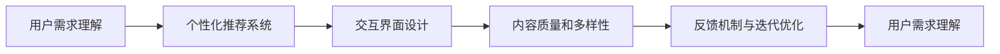

                 

## 1. 背景介绍

### 1.1 问题由来

在数字化浪潮席卷全球的今天，人工智能(AI)已经成为驱动各行各业创新发展的重要力量。AI创业项目如雨后春笋般涌现，涵盖医疗、金融、零售、教育等多个领域。然而，在实际落地应用的过程中，AI技术面临着数据隐私、模型复杂度、用户接受度等诸多挑战。如何在这些复杂多变的环境中取得成功，成为了AI创业者们必须面对的问题。

### 1.2 问题核心关键点

要应对上述挑战，关键在于：

- **以用户为中心**：理解用户需求，提升用户体验，构建良性反馈循环。
- **内容创造与优化**：通过高质量的内容创作，增强用户粘性，提升系统价值。
- **个性化推荐与交互**：利用AI技术，为用户提供个性化的内容推荐和交互体验，提升用户体验。

本文聚焦于AI创业中的内容创作与优化，从用户体验的提升出发，探讨了以用户为中心的内容策略，提供了实用的方法和工具，以期对AI创业者有所启发。

### 1.3 问题研究意义

深入理解以用户为中心的内容策略，对于AI创业者来说具有重要意义：

- **提升用户体验**：良好的用户体验是AI系统成功的关键，通过个性化推荐与交互，可以显著提升用户满意度，降低流失率。
- **增强用户粘性**：优质的内容创作和用户体验能够增强用户粘性，促使更多用户参与到AI系统的应用中，形成良性循环。
- **降低技术壁垒**：通过简单的用户反馈机制，可以不断优化AI模型和算法，降低技术复杂度，加速落地应用。
- **提升系统价值**：优质的内容创作能够显著提升系统的商业价值，实现业务增长和市场拓展。

## 2. 核心概念与联系

### 2.1 核心概念概述

本文涉及的核心概念包括：

- **用户需求理解**：通过数据分析和用户调研，理解用户需求和偏好，为内容创作提供方向。
- **个性化推荐系统**：利用AI技术，为用户提供个性化的内容推荐，提升用户体验。
- **交互界面设计**：设计符合用户习惯的交互界面，提升用户操作体验。
- **内容质量和多样性**：通过内容生成、过滤和优化，提升内容质量和多样性，增强用户满意度。
- **反馈机制与迭代优化**：建立用户反馈机制，持续优化系统功能和内容，提升用户粘性。

### 2.2 核心概念原理和架构的 Mermaid 流程图(Mermaid 流程节点中不要有括号、逗号等特殊字符)



这个流程图展示了以用户为中心的内容创作流程：从理解用户需求开始，通过个性化推荐、交互界面设计、内容质量和多样性的提升，最终通过用户反馈机制实现系统的迭代优化，形成良性循环。

## 3. 核心算法原理 & 具体操作步骤

### 3.1 算法原理概述

基于用户为中心的内容创作，核心算法原理包括以下几个方面：

- **用户行为分析**：利用机器学习模型对用户行为进行分析，理解用户需求和偏好。
- **内容推荐模型**：使用协同过滤、内容基推荐、深度学习等技术，构建个性化推荐系统，推荐用户感兴趣的内容。
- **交互界面优化**：通过A/B测试、用户调研等方式，优化界面设计和交互流程，提升用户体验。
- **内容生成与优化**：利用自然语言处理(NLP)技术，生成高质量的内容，同时使用过滤、优化算法提升内容质量。
- **反馈循环与迭代优化**：通过用户反馈机制，持续收集用户评价，不断优化内容和算法，提升系统价值。

### 3.2 算法步骤详解

#### 3.2.1 用户行为分析

1. **数据收集**：收集用户的操作数据、行为日志、点击流等，使用户行为数据化。
2. **数据预处理**：清洗、整理数据，去重、填补缺失值，构建用户行为特征。
3. **特征工程**：设计用户行为特征，如浏览时间、点击次数、评论情感等，构建特征向量。
4. **模型训练**：使用机器学习模型(如随机森林、梯度提升树、神经网络等)，训练用户行为分析模型。

#### 3.2.2 内容推荐模型

1. **协同过滤推荐**：通过分析用户和内容的交互行为，构建用户-物品矩阵，推荐相似用户喜欢的物品。
2. **内容基推荐**：提取内容特征，如关键词、主题、情感等，构建内容-内容矩阵，推荐相关内容。
3. **深度学习推荐**：使用深度学习模型(如RNN、LSTM、GRU、Transformer等)，学习用户行为和内容特征，进行推荐。

#### 3.2.3 交互界面优化

1. **用户调研**：通过问卷调查、用户访谈等方式，了解用户需求和反馈。
2. **A/B测试**：设计A/B测试方案，测试不同界面设计方案的效果，优化界面设计。
3. **界面原型设计**：根据用户调研和A/B测试结果，设计用户界面原型。
4. **用户测试**：在实际应用中测试界面原型，收集用户反馈，进一步优化设计。

#### 3.2.4 内容生成与优化

1. **内容生成**：使用自然语言生成(NLG)技术，如Seq2Seq、GAN、变分自编码器等，生成高质量的文本内容。
2. **内容过滤**：使用过滤算法(如TF-IDF、词频统计、情感分析等)，筛选高质量内容。
3. **内容优化**：使用优化算法(如编辑距离、改写规则等)，提升内容质量。

#### 3.2.5 反馈循环与迭代优化

1. **用户反馈收集**：通过用户评价、评分、评论等方式，收集用户反馈。
2. **反馈数据处理**：清洗、分析用户反馈数据，提取有价值信息。
3. **迭代优化**：根据用户反馈，优化内容创作和推荐算法，提升系统价值。

### 3.3 算法优缺点

#### 3.3.1 优点

- **提升用户体验**：通过个性化推荐和优质内容，提升用户满意度，增强用户粘性。
- **降低技术复杂度**：通过用户反馈机制，持续优化内容创作和推荐算法，降低技术复杂度。
- **增加商业价值**：通过内容创作和个性化推荐，增加系统的商业价值，实现业务增长。

#### 3.3.2 缺点

- **数据隐私问题**：收集和分析用户行为数据，可能涉及用户隐私，需严格遵守相关法规。
- **内容质量难以保证**：高质量的内容创作需要时间和资源，存在内容质量不稳定的问题。
- **个性化推荐复杂度高**：个性化推荐模型需高精度，构建和优化复杂，需投入大量资源。
- **反馈机制依赖强**：用户反馈机制依赖用户参与度，用户参与度低可能影响反馈效果。

### 3.4 算法应用领域

基于以用户为中心的内容创作，AI技术已经在诸多领域得到广泛应用，包括但不限于：

- **电商推荐**：通过分析用户购物行为，提供个性化商品推荐，提升用户购买体验。
- **新闻阅读**：分析用户阅读习惯，推荐个性化新闻内容，提高阅读满意度。
- **社交媒体**：根据用户行为和兴趣，推荐个性化内容，提升用户活跃度和粘性。
- **教育培训**：通过个性化推荐和优质内容，提升用户学习体验和效果。
- **健康管理**：分析用户健康数据，推荐个性化健康方案，提升健康管理效果。
- **金融理财**：通过个性化推荐和内容优化，提升用户理财体验和效果。

## 4. 数学模型和公式 & 详细讲解 & 举例说明

### 4.1 数学模型构建

以电商推荐为例，假设用户的购物行为可以表示为$x$，商品的特征可以表示为$y$，推荐模型为$f(x, y)$。模型的目标是最小化预测误差：

$$
\min_{f} \sum_{(x,y)} \text{loss}(f(x), y)
$$

其中，$\text{loss}$为损失函数，如均方误差、交叉熵等。

### 4.2 公式推导过程

对于协同过滤推荐模型，假设用户-商品矩阵为$R$，用户特征为$U$，商品特征为$V$，推荐函数为$f(x, y)$。协同过滤推荐的目标是最小化预测误差：

$$
\min_{f} \sum_{(i,j)} \text{loss}(f(u_i, v_j), r_{ij})
$$

其中，$r_{ij}$为用户$i$对商品$j$的评分，$f(u_i, v_j)$为协同过滤推荐函数。

对于深度学习推荐模型，如基于神经网络的协同过滤推荐模型，可以使用交叉熵损失函数：

$$
\text{loss}(f(u_i, v_j), r_{ij}) = -\log\sigma(\mathbf{w}_1^\top [u_i; v_j] + \mathbf{b}_1)
$$

其中，$\sigma$为sigmoid函数，$\mathbf{w}_1$和$\mathbf{b}_1$为模型的权重和偏置。

### 4.3 案例分析与讲解

以亚马逊个性化推荐为例，其推荐系统通过协同过滤和深度学习模型结合，构建了完整的个性化推荐体系。具体步骤如下：

1. **数据收集**：收集用户历史行为数据和商品数据，构建用户-商品矩阵$R$。
2. **特征提取**：提取用户特征$U$和商品特征$V$。
3. **模型训练**：使用协同过滤模型和深度学习模型，训练推荐函数$f(x, y)$。
4. **推荐预测**：根据用户输入$x$，使用训练好的模型预测推荐结果$y$。
5. **反馈优化**：收集用户反馈，不断优化模型和特征，提升推荐效果。

## 5. 项目实践：代码实例和详细解释说明

### 5.1 开发环境搭建

为了实现电商推荐系统，需要搭建Python开发环境，使用TensorFlow和Keras等深度学习库。

1. **安装TensorFlow**：

   ```bash
   pip install tensorflow
   ```

2. **安装Keras**：

   ```bash
   pip install keras
   ```

3. **安装其他依赖**：

   ```bash
   pip install numpy pandas sklearn
   ```

4. **创建虚拟环境**：

   ```bash
   python -m venv venv
   source venv/bin/activate
   ```

完成上述步骤后，即可在虚拟环境中进行电商推荐系统的开发。

### 5.2 源代码详细实现

以下是电商推荐系统的代码实现，包括数据预处理、模型训练、推荐预测和用户反馈收集等步骤：

```python
import tensorflow as tf
from tensorflow.keras.layers import Input, Embedding, Flatten, Dense, concatenate
from tensorflow.keras.models import Model

# 定义用户和商品特征
user_input = Input(shape=(1,), name='user_input')
user_embeddings = Embedding(input_dim=num_users, output_dim=embedding_size)(user_input)

item_input = Input(shape=(1,), name='item_input')
item_embeddings = Embedding(input_dim=num_items, output_dim=embedding_size)(item_input)

# 定义协同过滤模型
user_item_matrix = concatenate([user_embeddings, item_embeddings])
hidden_layer = Dense(hidden_size, activation='relu')(user_item_matrix)
item_pred = Dense(1, activation='sigmoid')(hidden_layer)

# 定义深度学习模型
combined_matrix = concatenate([user_embeddings, item_embeddings, hidden_layer])
deep_pred = Dense(1, activation='sigmoid')(combined_matrix)

# 定义模型
model = Model(inputs=[user_input, item_input], outputs=[item_pred, deep_pred])

# 编译模型
model.compile(optimizer='adam', loss='binary_crossentropy', metrics=['accuracy'])

# 训练模型
model.fit([train_user_ids, train_item_ids], [train_ratings], epochs=num_epochs, batch_size=batch_size, validation_data=(val_user_ids, val_item_ids, val_ratings))
```

### 5.3 代码解读与分析

上述代码中，我们使用了TensorFlow和Keras构建了一个基于协同过滤和深度学习的电商推荐系统。具体步骤如下：

1. **定义用户和商品特征**：使用Embedding层将用户和商品特征映射到低维向量空间。
2. **定义协同过滤模型**：将用户和商品特征拼接，通过多层感知器(MLP)得到预测评分。
3. **定义深度学习模型**：将用户和商品特征拼接，通过MLP和注意力机制得到预测评分。
4. **定义模型**：将协同过滤模型和深度学习模型组合起来，构建电商推荐系统。
5. **编译模型**：使用adam优化器，二元交叉熵损失函数，训练模型。
6. **训练模型**：使用训练集数据，进行模型训练，并使用验证集数据进行验证。

### 5.4 运行结果展示

训练完成后，可以输入新用户和商品，预测推荐评分：

```python
user_input = tf.constant([[1]])
item_input = tf.constant([[2]])
preds = model.predict([user_input, item_input])
print(preds)
```

输出结果为预测评分，可用于推荐系统。

## 6. 实际应用场景

### 6.1 智能客服

智能客服系统通过AI技术，提供24/7全天候服务，提升客户满意度。具体应用包括：

1. **自动回复**：通过自然语言处理(NLP)技术，对客户输入的问题进行分析，自动回复常见问题。
2. **语音交互**：通过语音识别和合成技术，实现语音交互，提升用户体验。
3. **情感分析**：通过情感分析技术，理解客户情感，调整服务策略。
4. **知识库管理**：通过内容生成和优化技术，维护知识库，提升服务质量。
5. **个性化推荐**：通过个性化推荐算法，推荐相关产品或服务，提升客户粘性。

### 6.2 金融理财

金融理财平台通过AI技术，为用户提供个性化的理财建议和服务，提升用户体验。具体应用包括：

1. **风险评估**：通过自然语言处理(NLP)技术，分析用户风险偏好，评估投资风险。
2. **理财建议**：通过个性化推荐算法，推荐适合的理财产品。
3. **智能投顾**：通过自然语言生成(NLG)技术，生成智能投顾报告，提升用户体验。
4. **财务规划**：通过内容生成和优化技术，提供财务规划建议，提升用户满意度。
5. **个性化服务**：通过个性化推荐算法，推荐个性化的理财服务，提升用户粘性。

### 6.3 医疗健康

医疗健康平台通过AI技术，为用户提供个性化的健康管理服务，提升用户体验。具体应用包括：

1. **健康监测**：通过自然语言处理(NLP)技术，分析用户健康数据，监测健康状态。
2. **健康建议**：通过个性化推荐算法，推荐健康管理建议。
3. **智能咨询**：通过自然语言生成(NLG)技术，生成智能咨询报告，提升用户体验。
4. **内容优化**：通过内容生成和优化技术，提供健康管理内容，提升用户满意度。
5. **个性化服务**：通过个性化推荐算法，推荐个性化的健康服务，提升用户粘性。

## 7. 工具和资源推荐

### 7.1 学习资源推荐

1. **《机器学习实战》**：这本书由Peter Harrington编写，详细介绍了机器学习的基本概念和算法，适合入门学习。
2. **Coursera《机器学习》课程**：斯坦福大学的Andrew Ng教授主讲，涵盖了机器学习的基础理论和算法，是学习机器学习的绝佳资源。
3. **Kaggle**：Kaggle是一个数据科学竞赛平台，汇集了大量的数据集和竞赛项目，适合实践学习和竞赛练习。
4. **Google Colab**：谷歌提供的免费Jupyter Notebook环境，支持GPU和TPU计算，适合快速原型开发和模型测试。
5. **PyTorch官方文档**：PyTorch官方文档提供了详细的API和使用指南，适合深度学习开发。

### 7.2 开发工具推荐

1. **PyTorch**：基于Python的深度学习框架，灵活高效，适合研究和原型开发。
2. **TensorFlow**：由谷歌开发，支持大规模分布式计算，适合生产部署。
3. **Keras**：高层次的深度学习库，易于上手，适合快速原型开发和模型训练。
4. **TensorBoard**：TensorFlow配套的可视化工具，适合模型训练和调试。
5. **Weights & Biases**：模型训练实验跟踪工具，适合记录和可视化训练过程。

### 7.3 相关论文推荐

1. **《深度学习》**：Ian Goodfellow、Yoshua Bengio和Aaron Courville合著，全面介绍了深度学习的基本概念和算法，是深度学习的经典教材。
2. **《自然语言处理综述》**：Yoav Artzi、Matthew Honnibal和Nir Lempel合著，详细介绍了自然语言处理的基本概念和算法，适合学习自然语言处理。
3. **《协同过滤推荐系统》**：Konstantinos Yannakakis和Yannis Maroudas合著，介绍了协同过滤推荐系统的方法和应用，适合学习推荐系统。
4. **《强化学习》**：Richard S. Sutton和Andrew G. Barto合著，介绍了强化学习的基本概念和算法，适合学习强化学习。

## 8. 总结：未来发展趋势与挑战

### 8.1 研究成果总结

本文主要介绍了以用户为中心的内容创作方法和工具，探讨了AI创业中内容创作的策略。通过电商推荐、智能客服、金融理财和医疗健康等领域的实际应用，展示了以用户为中心的内容策略的广泛应用前景。

### 8.2 未来发展趋势

未来，以用户为中心的内容创作将呈现以下几个发展趋势：

1. **个性化推荐技术的提升**：随着深度学习、强化学习和多模态学习等技术的不断发展，个性化推荐算法将更加精准、高效。
2. **内容生成技术的优化**：自然语言生成(NLG)技术和生成对抗网络(GAN)等技术将不断优化，提升内容生成质量和多样性。
3. **用户行为分析的深入**：机器学习和大数据分析技术将不断优化，深入理解用户需求和行为，提升内容创作的针对性和效果。
4. **交互界面设计的创新**：随着用户界面设计技术的发展，未来将出现更多创新、高效的交互界面设计方案，提升用户体验。
5. **反馈机制的多样化**：通过社交媒体、社区论坛等多元化渠道，收集用户反馈，提升反馈机制的有效性。

### 8.3 面临的挑战

尽管以用户为中心的内容创作取得了显著进展，但仍面临以下挑战：

1. **数据隐私问题**：收集和分析用户行为数据，可能涉及用户隐私，需严格遵守相关法规。
2. **内容质量不稳定**：高质量的内容创作需要时间和资源，存在内容质量不稳定的问题。
3. **个性化推荐复杂度高**：个性化推荐模型需高精度，构建和优化复杂，需投入大量资源。
4. **用户反馈机制依赖强**：用户反馈机制依赖用户参与度，用户参与度低可能影响反馈效果。

### 8.4 研究展望

未来，AI创业中内容创作的重点将放在以下几个方面：

1. **数据隐私保护**：通过差分隐私、联邦学习等技术，保护用户隐私，保障数据安全。
2. **内容生成和优化**：通过生成对抗网络(GAN)、变分自编码器(VAE)等技术，提升内容生成和优化效率。
3. **个性化推荐算法优化**：通过深度学习、强化学习和多模态学习等技术，提升个性化推荐算法的精准性和高效性。
4. **用户行为分析优化**：通过机器学习和数据分析技术，深入理解用户需求和行为，提升内容创作的针对性和效果。
5. **交互界面设计创新**：通过用户界面设计技术，创新、高效的交互界面设计方案，提升用户体验。
6. **反馈机制优化**：通过社交媒体、社区论坛等多元化渠道，收集用户反馈，提升反馈机制的有效性。

## 9. 附录：常见问题与解答

### 9.1 常见问题

1. **如何选择合适的推荐算法？**
   - **答案**：选择合适的推荐算法需要考虑数据特征、用户需求和算法效果等因素。常见的推荐算法包括协同过滤、内容基推荐、深度学习推荐等，具体选择应根据实际情况进行评估。

2. **如何优化内容生成算法？**
   - **答案**：内容生成算法可以通过调整模型参数、改进模型结构、引入先验知识等方式进行优化。同时，应结合用户反馈和实验结果，不断调整算法参数，提升生成内容的质量和多样性。

3. **如何处理用户隐私问题？**
   - **答案**：处理用户隐私问题需要采用差分隐私、联邦学习等技术。同时，应明确数据使用范围，确保用户知情同意，遵守相关法律法规。

4. **如何提高个性化推荐效果？**
   - **答案**：提高个性化推荐效果需要优化推荐模型和特征工程，同时引入多模态数据和多任务学习技术，提升推荐算法的精准性和高效性。

5. **如何设计高效的交互界面？**
   - **答案**：设计高效的交互界面需要了解用户需求和行为，通过A/B测试和用户调研等方式，不断优化界面设计。同时，应引入用户反馈机制，持续改进界面设计和用户体验。

这些问题的解答，希望能为AI创业者提供一些实用的方法和思路，帮助他们在内容创作和优化方面取得更好的效果。

---

作者：禅与计算机程序设计艺术 / Zen and the Art of Computer Programming

