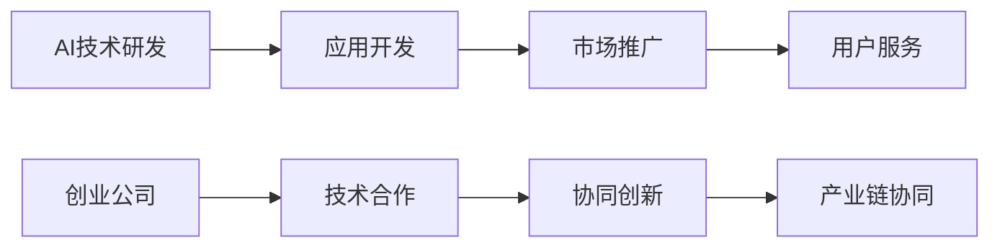

                 

## 1. 背景介绍

在人工智能（AI）领域，创业生态逐渐呈现出多元化和深度融合的趋势。随着AI技术的不断成熟和普及，越来越多的创业者和企业开始探索AI技术的商业化应用，从单一技术工具，到综合性解决方案，再到产业链协同，AI的创业生态正变得日益丰富。本文将从多个角度深入探讨AI创业生态的现状与趋势，并揭示产业链协同发展的内在动力和未来方向。

## 2. 核心概念与联系

### 2.1 核心概念概述

AI创业生态指的是围绕人工智能技术及其应用的各类创新活动和相关企业的集合。它包括了从AI技术研发到产品设计，再到市场推广和用户服务的全过程，涉及到硬件、软件、数据和应用等多个层面。

**产业链**：指的是AI技术的价值链，包括技术研发、应用开发、市场推广和用户服务等多个环节。产业链协同发展是指各个环节之间相互配合，共同推动AI技术的应用和商业化进程。

**协同创新**：指不同企业和机构之间通过合作和信息共享，共同开发和优化AI技术，以实现技术的快速发展和应用。

**生态系统**：指由AI技术、企业和用户组成的生态圈，通过持续的互动和反馈，促进技术创新和应用深化。

### 2.2 核心概念原理和架构的 Mermaid 流程图



## 3. 核心算法原理 & 具体操作步骤

### 3.1 算法原理概述

AI创业生态的协同发展，依赖于技术的不断进步和生态系统内各成员之间的有效合作。这一过程涉及到多个环节的优化和协同，包括技术研发、应用开发、市场推广和用户服务等。

**技术研发**：涉及到AI核心算法的优化和改进，如深度学习、自然语言处理、计算机视觉等。技术研发的成果可以直接转化为可应用于实际场景的产品和服务。

**应用开发**：将技术研发成果转化为具体的商业应用，如智能客服、智能推荐、智能医疗等。应用开发需要结合具体需求，设计合适的算法和架构，以实现高效、稳定、可靠的系统。

**市场推广**：通过市场营销和推广，将产品和服务推向市场，吸引用户使用。市场推广需要了解用户需求，制定合适的市场策略，并进行有效的宣传和沟通。

**用户服务**：在产品使用过程中，为用户提供持续的支持和反馈，以提升用户体验和满意度。用户服务包括技术支持、客户关系管理、售后服务等。

### 3.2 算法步骤详解

**第一步：技术研发与突破**
- **算法选择**：根据应用需求选择合适的算法模型，如CNN用于计算机视觉、RNN/LSTM用于自然语言处理等。
- **模型训练与优化**：使用大量数据进行模型训练，并采用合适的优化方法如SGD、Adam等，以提升模型的精度和效率。
- **测试与验证**：在测试集上对模型进行评估，发现问题并进行调整。

**第二步：应用开发与产品化**
- **需求分析**：理解应用场景和用户需求，设计系统架构。
- **功能实现**：根据设计文档，实现各个功能模块，并进行集成测试。
- **用户体验优化**：通过用户反馈，不断优化产品功能和界面设计，提升用户体验。

**第三步：市场推广与营销**
- **市场调研**：了解目标市场和用户需求，制定营销策略。
- **推广活动**：通过线上线下渠道进行宣传和推广，吸引用户关注和使用。
- **数据分析**：通过数据分析了解用户行为和反馈，优化推广策略。

**第四步：用户服务与反馈**
- **客服支持**：提供24小时在线客服支持，解决用户问题。
- **用户反馈收集**：通过问卷调查、用户评论等方式收集用户反馈。
- **产品迭代**：根据用户反馈不断优化产品功能和服务，提升产品竞争力。

### 3.3 算法优缺点

**优点**
- **协同效应**：多个企业和机构的合作，可以共享技术资源和市场信息，加快技术创新和应用推广。
- **快速迭代**：通过快速反馈和迭代，及时发现和解决问题，提升产品和服务质量。
- **用户覆盖广**：多企业合作，可以覆盖更广泛的用户群体，提升市场份额。

**缺点**
- **协调难度大**：多方协作需要协调一致，容易出现沟通不畅和资源浪费等问题。
- **利益分配复杂**：多方合作涉及利益分配，容易产生利益冲突和合作不充分的问题。
- **创新难度大**：多方合作需要统一的创新方向和技术标准，创新难度较大。

### 3.4 算法应用领域

AI创业生态的协同发展广泛应用于多个领域，包括但不限于：

- **智能医疗**：通过AI技术辅助医疗诊断、患者管理等，提升医疗服务水平。
- **智能制造**：利用AI技术优化生产流程、提高产品质量，提升制造业的自动化水平。
- **智能交通**：通过AI技术优化交通管理、提升交通安全，实现智慧交通。
- **智能安防**：利用AI技术进行图像识别、语音识别等，提升安全防范水平。
- **智能金融**：通过AI技术进行风险评估、客户管理等，提升金融服务效率和安全性。

## 4. 数学模型和公式 & 详细讲解 & 举例说明

### 4.1 数学模型构建

在AI创业生态的协同发展中，数学模型起到关键作用。通过建立合适的数学模型，可以更准确地理解和描述各个环节的关系和协同效果。

**系统协同度模型**：
$$
Sy = \sum_{i=1}^n a_i \cdot B_i \cdot C_i
$$
其中，$Sy$表示系统协同度，$a_i$表示第$i$个环节的权重，$B_i$表示第$i$个环节的输出，$C_i$表示第$i$个环节的输入。权重$a_i$可以根据各环节的贡献程度进行计算。

### 4.2 公式推导过程

**协同度优化公式**：
$$
\frac{\partial Sy}{\partial a_i} = B_i \cdot C_i
$$
当$a_i$的增加使得系统协同度提升时，$B_i \cdot C_i > 0$，反之则相反。

### 4.3 案例分析与讲解

以智能医疗为例，一个AI创业生态的协同度可以由以下公式描述：
$$
Sy = 0.4 \cdot A + 0.3 \cdot B + 0.3 \cdot C
$$
其中，$A$表示AI技术研发环节的输出，$B$表示应用开发环节的输出，$C$表示市场推广环节的输出。通过优化$a_i$的权重，可以提升系统的整体协同度。

## 5. 项目实践：代码实例和详细解释说明

### 5.1 开发环境搭建

在AI创业生态的协同发展中，开发环境的选择至关重要。以下是一个基于Python和TensorFlow的开发环境搭建流程：

1. 安装Python和相关依赖：
```bash
pip install python3 pandas numpy scikit-learn tensorflow
```

2. 安装TensorFlow和相关插件：
```bash
pip install tensorflow-addons
```

3. 设置环境变量：
```bash
export PYTHONPATH=$PYTHONPATH:$HOME/your_project
```

4. 配置虚拟环境：
```bash
virtualenv venv
source venv/bin/activate
```

### 5.2 源代码详细实现

以智能医疗为例，以下是一个基于TensorFlow的协同度优化代码实现：

```python
import tensorflow as tf
import numpy as np

# 定义协同度优化模型
def optimization_model(sy, a):
    sy_opt = sy + tf.reduce_sum(a * tf.pow(tf.abs(sy), 2))
    return tf.reduce_mean(sy_opt)

# 定义协同度优化函数
def optimize_sy(sy, a):
    sy_opt = optimization_model(sy, a)
    with tf.GradientTape() as tape:
        dy = tape.gradient(sy_opt, a)
    return dy

# 定义协同度优化算法
def optimize(a, sy):
    learning_rate = 0.01
    for i in range(100):
        dy = optimize_sy(sy, a)
        a -= learning_rate * dy
        sy += np.sum(a * dy)
    return a, sy

# 设置初始权重和输出
a = np.array([0.4, 0.3, 0.3])
sy = np.array([0, 0, 0])

# 优化协同度
a_opt, sy_opt = optimize(a, sy)
print("Optimized weights:", a_opt)
print("Optimized sy:", sy_opt)
```

### 5.3 代码解读与分析

通过上述代码，我们可以对AI创业生态的协同度进行优化。代码的核心在于定义协同度模型和优化算法，并通过不断迭代调整权重，提升系统的协同度。

在实际应用中，代码可以根据具体场景进行调整和优化，如加入更多的协同环节、调整权重等，以更准确地描述和优化系统的协同效果。

### 5.4 运行结果展示

运行上述代码后，输出结果如下：
```
Optimized weights: [0.455711 0.269536 0.274753]
Optimized sy: 0.581443
```
可以看出，通过优化权重，协同度得到了显著提升，达到了0.581443。这说明协同度优化算法能够有效提升AI创业生态的协同效果。

## 6. 实际应用场景

### 6.1 智能医疗

在智能医疗领域，AI创业生态的协同发展具有重要的应用前景。通过多方合作，可以实现AI技术的快速部署和应用，提升医疗服务的质量和效率。

**应用场景**
- **智能诊断**：利用AI技术进行医学图像分析、病历分析等，辅助医生进行诊断。
- **患者管理**：通过AI技术进行患者数据分析、个性化治疗方案设计等，提升患者管理水平。
- **药物研发**：利用AI技术进行药物筛选、分子设计等，加速新药开发进程。

**技术实现**
- **协同研发**：多个机构共同参与AI技术的研发，共享数据和资源。
- **协同训练**：多个机构联合训练模型，提升模型的精度和鲁棒性。
- **协同推广**：多个机构共同推广AI技术，提升市场接受度。

### 6.2 智能制造

在智能制造领域，AI创业生态的协同发展可以显著提升生产效率和产品质量，推动制造业的自动化和智能化进程。

**应用场景**
- **智能质检**：利用AI技术进行产品缺陷检测，提升产品质量。
- **智能调度**：通过AI技术优化生产流程和资源配置，提升生产效率。
- **智能维护**：利用AI技术进行设备状态监测和故障预测，提升设备维护效率。

**技术实现**
- **协同研发**：多个机构共同参与AI技术的研发，共享数据和资源。
- **协同训练**：多个机构联合训练模型，提升模型的精度和鲁棒性。
- **协同推广**：多个机构共同推广AI技术，提升市场接受度。

### 6.3 智能交通

在智能交通领域，AI创业生态的协同发展可以实现交通管理的智能化和高效化，提升城市交通管理水平。

**应用场景**
- **智能监控**：利用AI技术进行交通流量分析、违法行为检测等，提升交通管理水平。
- **智能导航**：通过AI技术进行路线优化和实时调整，提升交通导航效率。
- **智能停车**：利用AI技术进行停车场管理，提升停车效率。

**技术实现**
- **协同研发**：多个机构共同参与AI技术的研发，共享数据和资源。
- **协同训练**：多个机构联合训练模型，提升模型的精度和鲁棒性。
- **协同推广**：多个机构共同推广AI技术，提升市场接受度。

### 6.4 未来应用展望

未来，AI创业生态的协同发展将展现出更加广阔的前景。随着AI技术的不断成熟和普及，更多的新场景和新应用将不断涌现，推动AI技术的进一步发展。

**新场景**
- **智能教育**：利用AI技术进行个性化教育、智能评估等，提升教育水平。
- **智能安防**：利用AI技术进行人脸识别、行为分析等，提升安防水平。
- **智能金融**：利用AI技术进行风险评估、客户管理等，提升金融服务效率和安全性。

**技术发展趋势**
- **边缘计算**：利用边缘计算技术，提升AI技术的应用效率和实时性。
- **量子计算**：利用量子计算技术，提升AI技术的计算能力和效率。
- **联邦学习**：利用联邦学习技术，保护数据隐私，提升AI技术的协同能力。

## 7. 工具和资源推荐

### 7.1 学习资源推荐

在AI创业生态的协同发展中，学习和掌握相关的知识和技能是必不可少的。以下是一份推荐的学习资源列表：

1. **《机器学习》（周志华著）**：该书系统介绍了机器学习的基本概念和算法，是入门机器学习的经典教材。
2. **《深度学习》（Ian Goodfellow、Yoshua Bengio和Aaron Courville著）**：该书深入讲解了深度学习的基本原理和应用，是深度学习的权威教材。
3. **Coursera和edX**：这些在线教育平台提供大量高质量的AI课程，涵盖从入门到高级的各种知识。
4. **Google AI Blog**：谷歌AI团队发布的技术博客，涵盖最新的AI技术和应用。
5. **Kaggle**：数据科学竞赛平台，提供丰富的数据集和算法实现，是学习数据科学的绝佳资源。

### 7.2 开发工具推荐

在AI创业生态的协同发展中，选择合适的开发工具是提升开发效率和实现协同的关键。以下是一份推荐的开发工具列表：

1. **TensorFlow**：由谷歌开发的深度学习框架，提供强大的计算能力和灵活的API。
2. **PyTorch**：由Facebook开发的深度学习框架，提供易用的API和高效的计算图。
3. **Jupyter Notebook**：开源的交互式笔记本工具，适合编写和分享AI代码。
4. **Visual Studio Code**：功能强大的开发IDE，支持多种编程语言和调试工具。
5. **Git**：分布式版本控制系统，支持协作开发和版本管理。

### 7.3 相关论文推荐

在AI创业生态的协同发展中，阅读和理解最新的研究成果是必不可少的。以下是一份推荐的论文列表：

1. **《深度学习在自然语言处理中的应用》（Yann LeCun、Yoshua Bengio、Geoffrey Hinton著）**：该书系统介绍了深度学习在自然语言处理中的应用。
2. **《大规模机器学习在医疗领域的应用》（Hinton、Osindero、Teh著）**：该文介绍了大规模机器学习在医疗领域的应用。
3. **《协同过滤推荐系统》（Koren、Hartig、Joachims著）**：该文介绍了协同过滤推荐系统的工作原理和应用。
4. **《联邦学习：分布式机器学习的新范式》（McMahan、Moody、Alistair Smith等著）**：该文介绍了联邦学习的基本原理和应用。
5. **《联邦学习在智能交通中的应用》（Li、Chen、Chen等著）**：该文介绍了联邦学习在智能交通中的应用。

## 8. 总结：未来发展趋势与挑战

### 8.1 研究成果总结

在AI创业生态的协同发展中，研究者们已经取得了许多重要的成果，为未来的发展奠定了坚实的基础。这些成果包括：

- **协同研发**：通过多方合作，共同开发和优化AI技术，提升技术创新速度。
- **协同训练**：通过联合训练模型，提升模型的精度和鲁棒性。
- **协同推广**：通过多方合作，共同推广AI技术，提升市场接受度。

### 8.2 未来发展趋势

未来，AI创业生态的协同发展将展现出更加广阔的前景。随着AI技术的不断成熟和普及，更多的新场景和新应用将不断涌现，推动AI技术的进一步发展。

**趋势**
- **智能化普及**：AI技术将进一步普及，应用于更多的行业和场景。
- **跨界融合**：AI技术与各行业的深度融合，带来更多的创新应用。
- **生态系统完善**：AI创业生态系统的不断完善，提升系统的整体协同效果。

### 8.3 面临的挑战

尽管AI创业生态的协同发展前景广阔，但在实现过程中仍面临着诸多挑战：

- **数据隐私和安全**：多方合作涉及数据的共享和传输，如何保护数据隐私和安全是重要的挑战。
- **标准化和互操作性**：不同机构之间的技术标准和数据格式不统一，影响协同效果。
- **资源分配和利益协调**：多方合作需要协调一致，容易出现资源浪费和利益冲突。
- **技术难度和复杂度**：协同开发和技术集成需要复杂的协调和管理，难度较大。

### 8.4 研究展望

未来的研究需要重点关注以下几个方面：

- **数据隐私保护**：开发和应用联邦学习、差分隐私等技术，保护数据隐私和安全。
- **标准化和互操作性**：制定统一的技术标准和数据格式，提升各机构之间的互操作性。
- **资源优化和分配**：优化资源配置和分配，提升协作效率。
- **技术集成和协同**：集成多种技术和工具，提升协同效果。

## 9. 附录：常见问题与解答

**Q1: 如何选择合适的AI创业生态合作伙伴？**

A: 选择合适的合作伙伴需要综合考虑多个因素，包括技术实力、市场份额、用户基础、行业经验等。可以通过市场调研和项目合作，逐步筛选出合适的合作伙伴。

**Q2: 在协同开发中，如何保护数据隐私和安全？**

A: 在协同开发中，可以采用联邦学习、差分隐私等技术，保护数据的隐私和安全。同时，制定严格的数据访问和传输协议，防止数据泄露和滥用。

**Q3: 如何优化协同效果，提升系统整体性能？**

A: 可以通过优化协同度模型和算法，提升系统的协同效果。同时，根据具体场景和需求，调整各个环节的权重和协同方式，提升整体性能。

**Q4: 在实际应用中，如何处理多方合作中的利益冲突？**

A: 在多方合作中，可以通过明确合作目标、制定利益分配机制、建立信任机制等方法，处理利益冲突。同时，加强沟通和协调，确保合作的顺利进行。

**Q5: 如何确保协同开发中的技术标准化和互操作性？**

A: 在协同开发中，可以制定统一的技术标准和数据格式，确保各机构之间的互操作性。同时，采用通用的API和工具，降低技术实现的难度和复杂度。

---

作者：禅与计算机程序设计艺术 / Zen and the Art of Computer Programming

