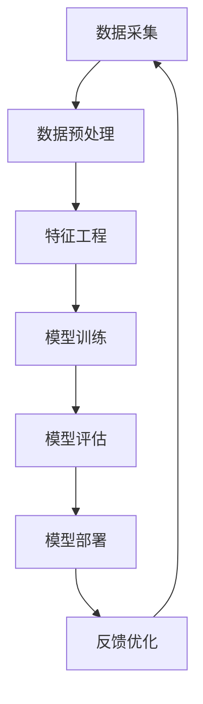

                 

# AI创业者的码头愿景：AI赋能美好生活

> 关键词：AI赋能,智能创新,科技创业,美好生活,数据驱动

## 1. 背景介绍

### 1.1 问题由来
随着人工智能技术的飞速发展，AI正逐渐从实验室走向现实生活，为各行各业带来深刻的变革。在数字化、智能化转型的大趋势下，如何运用AI技术推动产业升级，满足人们日益增长的美好生活需求，成为了AI创业者关注的重点。

### 1.2 问题核心关键点
AI创业的核心在于如何利用前沿技术解决实际问题，创造社会价值。在应用领域选择上，要考虑市场需求、技术可行性、商业模式等关键因素。本文将从AI赋能美好生活的视角，探讨如何通过AI技术解决社会问题，提升生活质量，创造新的价值。

## 2. 核心概念与联系

### 2.1 核心概念概述

1. **AI赋能**：指通过人工智能技术，为各行各业提供智能解决方案，推动产业升级，提升生产效率，创造新的商业模式和服务模式。

2. **智能创新**：利用AI技术进行创新，提升产品和服务的智能化水平，提供更高效、个性化、智能化的用户体验。

3. **科技创业**：依托前沿科技，运用AI技术，创立新兴企业，解决社会问题，创造经济价值。

4. **美好生活**：通过科技改善生活环境，提升生活质量，增进社会福祉，实现可持续发展的目标。

5. **数据驱动**：基于大数据分析，优化AI算法，提升模型性能，实现精准决策和预测。

6. **人机协同**：结合人类智慧与AI能力，实现技术与人的协作，提升工作效率和创造力。

### 2.2 核心概念原理和架构的 Mermaid 流程图



这个流程图展示了AI赋能美好生活的核心流程，包括数据采集、预处理、特征工程、模型训练、评估、部署和反馈优化等多个环节。

## 3. 核心算法原理 & 具体操作步骤
### 3.1 算法原理概述

AI赋能美好生活的核心算法原理主要包括数据驱动的智能决策、深度学习模型的训练与优化、模型集成与部署等。

1. **数据驱动**：通过数据采集、清洗、特征工程等步骤，构建高质量的数据集，为模型的训练提供坚实基础。

2. **深度学习模型**：利用深度神经网络结构，对大规模数据进行训练，提取高层次特征，实现精准预测和分类。

3. **模型训练与优化**：通过反向传播算法，不断调整模型参数，优化模型性能，提升预测准确率。

4. **模型集成**：将多个模型的预测结果进行融合，提升整体性能和鲁棒性。

5. **模型部署**：将训练好的模型部署到实际应用环境中，实现实时预测和决策。

### 3.2 算法步骤详解

1. **数据采集**：从各个渠道获取数据，包括公共数据集、API接口、传感器数据等。

2. **数据预处理**：对数据进行清洗、归一化、标准化等处理，保证数据质量。

3. **特征工程**：设计合适的特征，提取数据中的关键信息，提升模型性能。

4. **模型训练**：使用深度学习框架（如TensorFlow、PyTorch等）搭建模型，并进行训练。

5. **模型评估**：在验证集上评估模型性能，选择最优模型。

6. **模型部署**：将模型集成到实际应用系统中，实现实时预测和决策。

### 3.3 算法优缺点

**优点**：
- 数据驱动：利用大数据分析，提升模型性能。
- 深度学习：模型具备强大的泛化能力，适合处理复杂问题。
- 模型集成：提升整体性能和鲁棒性。
- 实时部署：满足实时需求，提高效率。

**缺点**：
- 数据依赖：对高质量数据的依赖较大。
- 模型复杂：模型结构复杂，需要大量计算资源。
- 数据隐私：需要保护数据隐私，避免信息泄露。
- 更新迭代：需要不断更新模型，保持其时效性。

### 3.4 算法应用领域

AI赋能美好生活的应用领域广泛，涵盖医疗、教育、金融、交通、能源等多个领域。

- **医疗**：利用AI进行疾病预测、诊断、治疗方案推荐等，提升医疗服务水平。
- **教育**：通过智能辅导、个性化推荐等，提升教育质量和效率。
- **金融**：利用AI进行风险控制、信用评估、智能投顾等，提升金融服务水平。
- **交通**：利用AI进行交通流量预测、智能调度、自动驾驶等，提升交通效率。
- **能源**：利用AI进行能源消耗预测、智能调度、资源优化等，提升能源利用效率。

## 4. 数学模型和公式 & 详细讲解 & 举例说明

### 4.1 数学模型构建

基于深度学习的AI赋能模型，通常采用以下数学模型构建：

$$
f(x) = W\cdot x + b
$$

其中，$x$ 为输入数据，$W$ 为权重矩阵，$b$ 为偏置项。

### 4.2 公式推导过程

以线性回归模型为例，推导其优化目标函数和梯度公式：

1. 定义损失函数：

$$
L(w,b) = \frac{1}{2n} \sum_{i=1}^n (y_i - f(x_i))^2
$$

2. 求梯度：

$$
\frac{\partial L}{\partial w} = \frac{1}{n} \sum_{i=1}^n (y_i - f(x_i))x_i
$$

$$
\frac{\partial L}{\partial b} = \frac{1}{n} \sum_{i=1}^n (y_i - f(x_i))
$$

### 4.3 案例分析与讲解

以医疗领域为例，利用AI进行疾病预测和诊断。假设数据集包含患者的年龄、性别、病史等特征，以及是否患某种疾病的标签。

1. 数据采集：从医院数据库中获取患者数据。
2. 数据预处理：清洗数据，去除缺失值和异常值。
3. 特征工程：提取关键特征，如年龄、性别、病史等。
4. 模型训练：使用深度学习框架搭建模型，并进行训练。
5. 模型评估：在验证集上评估模型性能，选择最优模型。
6. 模型部署：将模型集成到医生工作系统中，实现实时预测和诊断。

## 5. 项目实践：代码实例和详细解释说明

### 5.1 开发环境搭建

1. 安装Python：在Windows、Linux或MacOS上安装Python 3.x版本。
2. 安装深度学习框架：如TensorFlow、PyTorch等。
3. 安装数据处理库：如Pandas、NumPy等。
4. 安装机器学习库：如Scikit-learn、Keras等。

### 5.2 源代码详细实现

以下是一个简单的线性回归模型的代码实现：

```python
import numpy as np
from sklearn.linear_model import LinearRegression

# 生成模拟数据
X = np.random.rand(100, 3)
y = np.dot(X, np.array([0.1, -0.2, 0.3])) + 0.4

# 训练模型
model = LinearRegression()
model.fit(X, y)

# 预测
X_test = np.random.rand(10, 3)
y_pred = model.predict(X_test)
```

### 5.3 代码解读与分析

以上代码实现了一个简单的线性回归模型，步骤如下：

1. 生成模拟数据：使用NumPy生成100个样本，包含3个特征和一个标签。
2. 训练模型：使用Scikit-learn中的线性回归模型，对数据进行训练。
3. 预测：使用训练好的模型对测试数据进行预测。

## 6. 实际应用场景

### 6.1 智能医疗

AI在医疗领域的应用广泛，包括疾病预测、诊断、治疗方案推荐等。利用AI进行疾病预测，可以提前发现潜在疾病，减少医疗成本。例如，使用深度学习模型对患者电子病历进行分析，预测其是否患有某种疾病，并在患者自我诊断时提供参考。

### 6.2 智能教育

AI在教育领域的应用包括智能辅导、个性化推荐、作业批改等。利用AI进行个性化推荐，可以针对学生的学习情况，推荐适合的课程和资料，提升学习效果。例如，使用深度学习模型对学生的学习行为进行分析，推荐适合的学习内容和资源。

### 6.3 智能金融

AI在金融领域的应用包括信用评估、智能投顾、风险控制等。利用AI进行信用评估，可以更准确地评估客户的信用等级，降低贷款风险。例如，使用深度学习模型对客户的收入、支出、消费等数据进行分析，评估其信用等级。

### 6.4 智能交通

AI在交通领域的应用包括交通流量预测、智能调度、自动驾驶等。利用AI进行交通流量预测，可以优化交通管理，减少交通拥堵。例如，使用深度学习模型对交通数据进行分析，预测未来的交通流量，并根据预测结果进行交通调度。

### 6.5 智能能源

AI在能源领域的应用包括能源消耗预测、智能调度、资源优化等。利用AI进行能源消耗预测，可以优化能源分配，降低能源浪费。例如，使用深度学习模型对能源数据进行分析，预测未来的能源消耗，并进行智能调度。

## 7. 工具和资源推荐

### 7.1 学习资源推荐

1. **《深度学习》一书**：由Ian Goodfellow等人撰写，全面介绍了深度学习的基本原理和应用，是入门必读。
2. **Coursera深度学习课程**：由Andrew Ng教授主讲，涵盖深度学习的基础理论和实践应用。
3. **Kaggle竞赛平台**：参与数据科学竞赛，提升数据处理和模型训练能力。

### 7.2 开发工具推荐

1. **TensorFlow**：由Google开发，功能强大，适用于大规模深度学习模型开发。
2. **PyTorch**：由Facebook开发，易用性高，适用于快速原型开发和研究。
3. **Scikit-learn**：基于Python的机器学习库，包含各种经典算法和工具。

### 7.3 相关论文推荐

1. **《深度学习》（Ian Goodfellow等著）**：介绍了深度学习的基本原理和应用。
2. **《神经网络与深度学习》（Michael Nielsen著）**：讲解了神经网络和深度学习的基础知识。
3. **《强化学习》（Richard S. Sutton等人著）**：介绍了强化学习的基本理论和应用。

## 8. 总结：未来发展趋势与挑战

### 8.1 研究成果总结

AI赋能美好生活是大势所趋，未来将在医疗、教育、金融、交通、能源等领域发挥重要作用。通过AI技术提升生产效率，改善生活环境，实现可持续发展。

### 8.2 未来发展趋势

1. **智能协同**：AI与人类智慧的结合将更加紧密，实现更高效、更人性化的服务。
2. **跨领域应用**：AI将在更多领域得到应用，提升各行业的智能化水平。
3. **数据驱动**：大数据将为AI赋能提供更多高质量数据。
4. **算法优化**：深度学习算法将不断优化，提升模型的性能和效率。
5. **人机协同**：AI将与人类智慧协同工作，实现更高效、更可靠的工作方式。

### 8.3 面临的挑战

1. **数据隐私**：如何保护数据隐私，避免信息泄露。
2. **算法透明**：如何提升算法的可解释性，使其更容易理解和接受。
3. **模型鲁棒**：如何提高模型的鲁棒性，避免过度拟合和过拟合。
4. **技术普及**：如何将AI技术普及到各行各业，提高应用效果。
5. **伦理道德**：如何制定伦理道德规范，确保AI技术的应用符合人类价值观。

### 8.4 研究展望

未来AI赋能美好生活的研究将更多关注以下几个方面：
1. **跨领域融合**：AI与各领域的深度融合，提升各行业的智能化水平。
2. **人机协同**：提升人机协同能力，实现更高效、更人性化的服务。
3. **数据驱动**：利用大数据提升模型的性能和效率。
4. **算法优化**：不断优化深度学习算法，提升模型的性能。
5. **伦理道德**：制定伦理道德规范，确保AI技术的应用符合人类价值观。

## 9. 附录：常见问题与解答

**Q1: AI赋能美好生活的应用范围有哪些？**

A: AI赋能美好生活的应用范围广泛，涵盖医疗、教育、金融、交通、能源等多个领域。

**Q2: AI赋能过程中需要注意哪些问题？**

A: AI赋能过程中需要注意数据隐私、算法透明、模型鲁棒、技术普及、伦理道德等问题。

**Q3: AI赋能美好生活的未来趋势是什么？**

A: AI赋能美好生活的未来趋势包括智能协同、跨领域应用、数据驱动、算法优化、人机协同等。

**Q4: 如何提升AI赋能的效率？**

A: 提升AI赋能的效率需要优化数据处理流程、优化算法性能、提升模型速度等。

**Q5: AI赋能美好生活的伦理道德规范是什么？**

A: AI赋能美好生活的伦理道德规范包括数据隐私、算法透明、模型鲁棒、技术普及、伦理道德等。

---

作者：禅与计算机程序设计艺术 / Zen and the Art of Computer Programming

