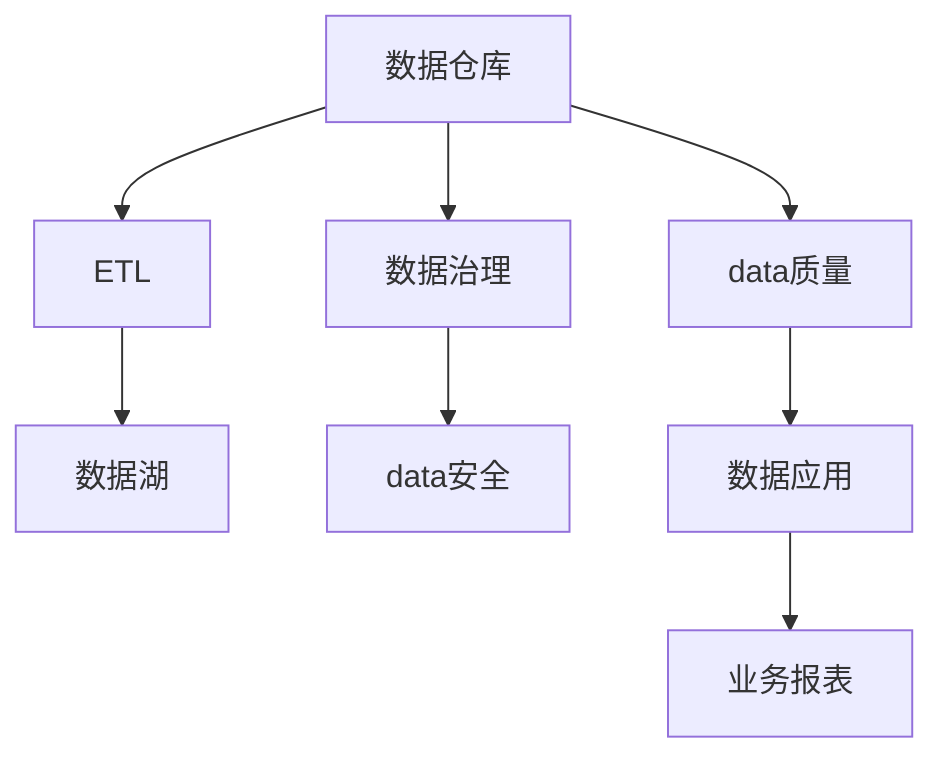
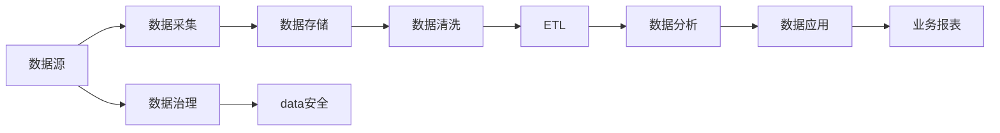

                 

## 1. 背景介绍

### 1.1 问题由来
在人工智能创业浪潮中，数据管理团队扮演着至关重要的角色。面对海量的数据和复杂的数据应用场景，如何高效、安全、可靠地管理数据，成为每个AI创业公司必须面对的挑战。本文将深入探讨数据管理团队建设的重要性，并提供一套系统的实践指南，以助力创业公司顺利构建高效的数据管理体系。

### 1.2 问题核心关键点
数据管理团队的核心任务包括数据收集、存储、处理、分析、安全保障和质量控制等方面。以下是数据管理团队建设的核心关键点：

- **数据收集**：确保数据的全面性和及时性，涵盖业务所需的各类数据。
- **数据存储**：采用高效的数据存储解决方案，保证数据的可访问性和一致性。
- **数据处理**：优化数据处理流程，减少数据冗余，提升数据处理效率。
- **数据分析**：建立强大的数据分析能力，支持业务决策和产品迭代。
- **数据安全**：保障数据在传输和存储过程中的安全性，防止数据泄露和滥用。
- **数据质量**：监控数据质量，定期进行数据清洗和更新，确保数据的准确性和完整性。

### 1.3 问题研究意义
数据管理团队的高效运行，对于AI创业公司的成功至关重要：

1. **降低数据成本**：通过合理的数据管理，减少数据冗余和无效处理，降低数据存储和处理成本。
2. **提升决策速度**：确保数据的时效性和完整性，加速业务决策和产品迭代，提升市场竞争力。
3. **保障数据安全**：加强数据安全措施，防止数据泄露和滥用，维护公司声誉和客户信任。
4. **优化数据质量**：通过持续的数据质量管理，提高数据准确性和一致性，支持高质量的AI模型训练和应用。

本文旨在通过系统化的分析，帮助AI创业公司构建高效、安全、可靠的数据管理体系，推动公司的AI技术落地和商业化进程。

## 2. 核心概念与联系

### 2.1 核心概念概述

数据管理团队涉及多个关键概念，包括数据仓库、数据湖、ETL、数据治理、数据安全、数据质量等。这些概念之间具有紧密的联系，共同构成了数据管理的完整生态。

- **数据仓库**：集中存储和处理企业关键数据，支持多维数据分析和业务报表。
- **数据湖**：涵盖企业内外部的海量数据，包括结构化、半结构化和非结构化数据，支持复杂的数据分析。
- **ETL**：数据抽取、转换和加载，是数据集成和清洗的重要工具。
- **数据治理**：建立数据管理和使用标准，确保数据质量和安全。
- **数据安全**：采用加密、权限管理等技术，保护数据不被非法访问和滥用。
- **数据质量**：通过数据清洗、校验和监控，确保数据的准确性和完整性。

这些概念之间的联系可以通过以下Mermaid流程图来展示：



这个流程图展示了数据从收集、清洗、存储到分析和应用的完整流程，以及各个环节的数据治理和安全保障措施。

### 2.2 核心概念原理和架构

数据管理团队的核心工作原理基于数据管理的全生命周期，包括以下几个关键阶段：

1. **数据收集**：通过数据采集工具从各种数据源获取原始数据。数据源包括业务系统、互联网、社交媒体等。
2. **数据存储**：将收集到的数据存储在数据仓库或数据湖中。数据仓库适用于结构化数据，数据湖适用于海量、异构数据。
3. **数据清洗**：去除重复、错误和无关数据，确保数据的完整性和一致性。
4. **数据分析**：利用ETL工具对数据进行抽取、转换和加载，生成分析数据集。
5. **数据治理**：建立数据管理标准和流程，确保数据的质量和安全。
6. **数据应用**：将处理后的数据应用于业务决策、产品迭代和业务报表生成。

数据管理的架构通常采用分布式存储和计算，支持大数据处理和实时数据分析。下图展示了数据管理架构的关键组件：



## 3. 核心算法原理 & 具体操作步骤

### 3.1 算法原理概述

数据管理团队的核心工作原理基于数据管理的全生命周期，包括以下几个关键阶段：

1. **数据收集**：通过数据采集工具从各种数据源获取原始数据。数据源包括业务系统、互联网、社交媒体等。
2. **数据存储**：将收集到的数据存储在数据仓库或数据湖中。数据仓库适用于结构化数据，数据湖适用于海量、异构数据。
3. **数据清洗**：去除重复、错误和无关数据，确保数据的完整性和一致性。
4. **数据分析**：利用ETL工具对数据进行抽取、转换和加载，生成分析数据集。
5. **数据治理**：建立数据管理标准和流程，确保数据的质量和安全。
6. **数据应用**：将处理后的数据应用于业务决策、产品迭代和业务报表生成。

### 3.2 算法步骤详解

以下是数据管理团队建设和优化的详细步骤：

#### 3.2.1 数据收集

- **数据源评估**：识别和评估所有潜在的数据源，确定重要性和数据质量。
- **数据采集工具选择**：根据数据源的特性选择合适的数据采集工具，如Flume、Kafka、AWS Kinesis等。
- **数据采集策略**：制定详细的数据采集策略，包括采集时间、频率和方式。

#### 3.2.2 数据存储

- **数据存储方案选择**：根据数据特性选择合适的存储方案，如Hadoop HDFS、Amazon S3、Google Cloud Storage等。
- **数据分区和索引**：对数据进行分区和索引，提高数据查询和读取效率。
- **数据备份和恢复**：建立数据备份和恢复机制，确保数据安全和可靠性。

#### 3.2.3 数据清洗

- **数据清洗流程**：制定详细的清洗流程，包括数据校验、去重、错误纠正等步骤。
- **数据清洗工具选择**：根据数据特性选择合适的数据清洗工具，如Pig、Hive、ETL工具如Talend、Informatica等。

#### 3.2.4 数据分析

- **ETL工具选择**：选择合适的ETL工具，如Apache Nifi、Talend、Informatica等。
- **数据仓库设计**：设计数据仓库的架构和模型，确保数据的一致性和完整性。
- **数据分析和报告**：利用数据分析工具进行数据挖掘和报告生成，如Hadoop、Spark、Tableau等。

#### 3.2.5 数据治理

- **数据标准制定**：制定详细的数据管理标准，包括数据命名规范、数据质量标准等。
- **数据质量监控**：建立数据质量监控机制，定期进行数据校验和审核。
- **数据安全策略**：制定数据安全策略，确保数据不被非法访问和滥用。

#### 3.2.6 数据应用

- **数据应用设计**：设计数据应用的流程和模型，确保数据在应用中的准确性和一致性。
- **数据应用测试**：对数据应用进行全面测试，确保其稳定性和可靠性。
- **数据应用优化**：根据反馈和测试结果，持续优化数据应用流程和模型。

### 3.3 算法优缺点

数据管理团队建设的优点包括：

- **数据质量保障**：通过数据清洗和质量监控，确保数据的一致性和准确性。
- **数据安全保障**：采用加密和权限管理等技术，保护数据不被非法访问和滥用。
- **业务决策支持**：通过数据分析和报告生成，支持业务决策和产品迭代。

其缺点主要包括：

- **成本高**：数据管理团队建设需要投入大量的人力、物力和财力。
- **复杂度高**：数据管理涉及多个环节，管理复杂度高，容易出现数据孤岛和数据冗余。
- **技术门槛高**：需要具备数据管理和数据处理的专业知识和技能。

### 3.4 算法应用领域

数据管理团队在多个领域都有广泛的应用：

- **金融领域**：支持金融风险评估、市场分析和客户行为预测等。
- **零售行业**：支持库存管理、客户细分和销售预测等。
- **医疗行业**：支持医疗数据整合、临床试验数据管理和健康监测等。
- **制造业**：支持生产过程优化、质量控制和供应链管理等。

## 4. 数学模型和公式 & 详细讲解 & 举例说明

### 4.1 数学模型构建

数据管理涉及的数学模型主要包括以下几个方面：

1. **数据采集模型**：描述数据采集的策略和流程，如时间间隔、数据源选择等。
2. **数据清洗模型**：描述数据清洗的流程和规则，如重复数据检测、错误纠正等。
3. **数据存储模型**：描述数据存储的方案和策略，如分区、索引等。
4. **数据分析模型**：描述数据分析的流程和算法，如ETL、数据挖掘等。
5. **数据治理模型**：描述数据治理的流程和规则，如数据标准、安全策略等。

### 4.2 公式推导过程

以数据清洗模型为例，推导数据清洗的流程图和步骤：

1. **数据校验**：
   $$
   validate_data(x) = \left\{
   \begin{aligned}
   &true, & if \, \text{数据符合规范} \\
   &false, & otherwise
   \end{aligned}
   \right.
   $$

2. **去重操作**：
   $$
   deduplicate_data(x) = \left\{
   \begin{aligned}
   &x_{unique}, & if \, \text{数据为重复} \\
   &x, & otherwise
   \end{aligned}
   \right.
   $$

3. **错误纠正**：
   $$
   correct_error(x) = \left\{
   \begin{aligned}
   &x_{corrected}, & if \, \text{数据存在错误} \\
   &x, & otherwise
   \end{aligned}
   \right.
   $$

4. **合并操作**：
   $$
   merge_data(x1, x2) = \left\{
   \begin{aligned}
   &\text{concat}(x1, x2), & if \, \text{数据来源不同} \\
   &x1, & otherwise
   \end{aligned}
   \right.
   $$

通过以上公式推导，可以清晰地展示数据清洗的每个步骤和逻辑关系，帮助团队成员理解数据清洗流程。

### 4.3 案例分析与讲解

以金融行业的数据管理为例，分析数据管理的关键步骤和应用场景：

1. **数据采集**：通过API接口和爬虫技术，从金融市场获取实时交易数据、行情数据和新闻数据。
2. **数据清洗**：去除重复交易数据、异常数据和错误数据，确保数据的一致性和准确性。
3. **数据存储**：将清洗后的数据存储在分布式数据仓库中，支持高效的查询和分析。
4. **数据分析**：利用ETL工具对数据进行抽取、转换和加载，生成分析数据集。
5. **数据治理**：制定详细的数据管理标准和流程，确保数据的质量和安全。
6. **数据应用**：将处理后的数据应用于金融风险评估、市场分析和客户行为预测等场景。

## 5. 项目实践：代码实例和详细解释说明

### 5.1 开发环境搭建

在进行数据管理团队建设前，我们需要准备好开发环境。以下是使用Python进行Pyspark开发的环境配置流程：

1. 安装Anaconda：从官网下载并安装Anaconda，用于创建独立的Python环境。

2. 创建并激活虚拟环境：
```bash
conda create -n pyspark-env python=3.8 
conda activate pyspark-env
```

3. 安装PySpark：根据CUDA版本，从官网获取对应的安装命令。例如：
```bash
conda install pyspark spark-client -c conda-forge
```

4. 安装各类工具包：
```bash
pip install numpy pandas scikit-learn matplotlib tqdm jupyter notebook ipython
```

完成上述步骤后，即可在`pyspark-env`环境中开始数据管理团队建设的实践。

### 5.2 源代码详细实现

下面我们以金融行业的数据管理为例，给出使用Pyspark进行数据管理的PySpark代码实现。

首先，定义数据清洗函数：

```python
from pyspark.sql.functions import col, when, concat_ws

def clean_data(df):
    df = df.drop_duplicates()  # 去重
    df = df.withColumn('corrected_price', when(df['price'] < 0, 0) otherwise df['price'])  # 纠正价格错误
    df = df.dropna()  # 删除缺失值
    return df
```

然后，定义数据存储函数：

```python
from pyspark.sql import SparkSession

spark = SparkSession.builder.appName("Data Management").getOrCreate()

def save_data(df, path):
    spark.write.format("parquet").save(df, path)
```

接着，定义数据治理函数：

```python
from pyspark.sql import functions as F

def data_governance(df):
    # 定义数据规范
    data_schema = [("date", "timestamp"), ("symbol", "string"), ("price", "double"), ("volume", "double")]
    
    # 创建规范表
    data_dict = {schema[0]: schema[1] for schema in data_schema}
    data_dict["table_name"] = "financial_data"
    df.createOrReplaceTempView(data_dict)
    
    # 检查数据规范
    data_check = df.checkConstraints()
    if not data_check:
        raise Exception("Data does not comply with schema")
    
    # 定义安全策略
    data_security = F.expr("price >= 0 and volume >= 0")
    data_df = df.filter(data_security)
    
    return data_df
```

最后，启动数据管理流程：

```python
from pyspark.sql import SparkSession
from pyspark.sql.functions import col, when, concat_ws

spark = SparkSession.builder.appName("Data Management").getOrCreate()

# 数据采集
df = spark.read.csv("data_source.csv", header=True, inferSchema=True)

# 数据清洗
df = clean_data(df)

# 数据存储
save_data(df, "data_lake")

# 数据治理
df = data_governance(df)

# 数据应用
df = df.groupBy("symbol").sum()  # 统计每个股票的日交易量

# 数据输出
df.show()
```

以上就是使用Pyspark进行数据管理的完整代码实现。可以看到，Pyspark提供了强大的数据处理和分布式计算能力，使得数据管理任务变得更加高效和可靠。

### 5.3 代码解读与分析

让我们再详细解读一下关键代码的实现细节：

**clean_data函数**：
- 去除重复数据
- 纠正价格错误
- 删除缺失值

**save_data函数**：
- 将数据保存为Parquet格式，支持分布式存储和高效查询

**data_governance函数**：
- 定义数据规范
- 检查数据规范
- 定义安全策略
- 过滤不符合安全策略的数据

**数据管理流程**：
- 数据采集
- 数据清洗
- 数据存储
- 数据治理
- 数据应用
- 数据输出

这些代码展示了数据管理的完整流程，通过使用Pyspark，可以高效地完成数据采集、清洗、存储、治理和应用，满足金融行业的数据管理需求。

## 6. 实际应用场景

### 6.1 智能推荐系统

基于数据管理团队的数据处理和分析能力，智能推荐系统可以快速获取用户行为数据，并进行深度分析和推荐。数据管理团队负责采集、清洗和存储用户行为数据，为推荐算法提供高质量的数据支持。

### 6.2 金融风控系统

在金融风控系统中，数据管理团队负责采集和存储交易数据、客户数据和市场数据，并通过数据治理和分析，生成风险评估模型和客户画像。数据管理团队的实时数据处理能力，可以支持风控系统的实时风险监测和决策。

### 6.3 医疗诊断系统

在医疗诊断系统中，数据管理团队负责采集和存储患者数据、病历数据和实验室数据，并通过数据治理和分析，生成诊断模型和健康监测报告。数据管理团队的质量控制能力，可以确保诊断数据的准确性和完整性，提高医疗诊断的准确性。

### 6.4 未来应用展望

随着数据管理技术的不断进步，未来的数据管理团队将呈现以下几个发展趋势：

1. **数据治理自动化**：通过智能算法和自动化工具，实现数据治理流程的自动化和智能化，减少人工干预，提高数据治理效率。
2. **数据实时处理**：利用流式处理技术，实现数据的实时采集、清洗和分析，支持实时决策和应用。
3. **数据联邦化**：采用联邦学习等技术，实现数据在多方之间的安全共享和联合分析，增强数据的多样性和代表性。
4. **数据隐私保护**：采用隐私计算和差分隐私等技术，保护数据隐私和安全，确保数据合规使用。
5. **数据可视化**：利用数据可视化工具，将复杂的数据分析结果直观展示，支持业务决策和数据探索。

这些趋势将推动数据管理团队向智能化、自动化和高效化的方向发展，为企业的AI应用提供更坚实的数据基础。

## 7. 工具和资源推荐

### 7.1 学习资源推荐

为了帮助开发者系统掌握数据管理团队建设的理论基础和实践技巧，这里推荐一些优质的学习资源：

1. 《Data Management: Concepts and Best Practices》系列博文：由数据管理专家撰写，深入浅出地介绍了数据管理的核心概念和最佳实践。

2. Udacity《Data Management for AI Engineers》课程：涵盖数据管理的基础知识和实战技能，适合数据管理团队的新手和进阶开发者。

3. 《Data Management for Data Scientists》书籍：全面介绍了数据管理的全流程和关键技术，适合数据科学家和数据工程师阅读。

4. Databricks官方文档：提供详细的Spark数据处理和分布式计算文档，帮助开发者快速上手数据管理实践。

5. Apache Hadoop官方文档：提供Hadoop数据存储和处理的基本知识和高级技巧，适合大数据领域的专业开发者。

通过对这些资源的学习实践，相信你一定能够快速掌握数据管理团队建设的精髓，并用于解决实际的数据管理问题。

### 7.2 开发工具推荐

高效的数据管理离不开优秀的工具支持。以下是几款用于数据管理开发的常用工具：

1. Apache Spark：基于内存计算的大数据处理框架，支持分布式数据处理和实时数据流处理。
2. Apache Hadoop：基于分布式存储和计算的数据管理平台，支持大规模数据存储和处理。
3. Apache Kafka：高效的消息流处理平台，支持实时数据采集和传输。
4. Apache Nifi：数据集成和流处理工具，支持数据的抽取、转换和加载。
5. Apache Beam：统一的数据处理框架，支持批处理、流处理和分布式计算。

合理利用这些工具，可以显著提升数据管理的开发效率，加快创新迭代的步伐。

### 7.3 相关论文推荐

数据管理团队的研究源于学界的持续研究。以下是几篇奠基性的相关论文，推荐阅读：

1. "Data Management for Large-Scale Machine Learning: Concepts and Best Practices"（数据管理在大规模机器学习中的应用）：介绍数据管理在大规模机器学习中的应用，涵盖数据收集、存储、处理和治理等方面。

2. "Towards Data-Driven AI: The Future of Data Management"（数据驱动的人工智能：数据管理的未来）：探讨数据管理在人工智能技术中的重要作用，以及未来的发展方向。

3. "Data Privacy and Security in the Age of AI"（人工智能时代的数据隐私和安全）：讨论数据隐私和安全在人工智能技术中的应用，提出解决方案和策略。

4. "The Role of Data Governance in AI Systems"（数据治理在人工智能系统中的角色）：分析数据治理在人工智能系统中的重要性，提出数据治理的最佳实践。

5. "Real-Time Data Management in AI Applications"（人工智能应用中的实时数据管理）：介绍实时数据管理在人工智能应用中的关键技术和挑战。

这些论文代表了大数据和人工智能领域的研究方向，通过学习这些前沿成果，可以帮助研究者把握学科前进方向，激发更多的创新灵感。

## 8. 总结：未来发展趋势与挑战

### 8.1 研究成果总结

本文对数据管理团队建设的实践进行了全面系统的介绍，涵盖数据收集、存储、处理、分析、安全保障和质量控制等方面。通过系统化的分析，帮助AI创业公司构建高效、安全、可靠的数据管理体系，推动公司的AI技术落地和商业化进程。

### 8.2 未来发展趋势

展望未来，数据管理团队将呈现以下几个发展趋势：

1. **数据治理自动化**：通过智能算法和自动化工具，实现数据治理流程的自动化和智能化，减少人工干预，提高数据治理效率。
2. **数据实时处理**：利用流式处理技术，实现数据的实时采集、清洗和分析，支持实时决策和应用。
3. **数据联邦化**：采用联邦学习等技术，实现数据在多方之间的安全共享和联合分析，增强数据的多样性和代表性。
4. **数据隐私保护**：采用隐私计算和差分隐私等技术，保护数据隐私和安全，确保数据合规使用。
5. **数据可视化**：利用数据可视化工具，将复杂的数据分析结果直观展示，支持业务决策和数据探索。

### 8.3 面临的挑战

尽管数据管理团队建设已经取得了一定的进展，但在迈向更加智能化、自动化和高效化的过程中，仍面临诸多挑战：

1. **数据质量保证**：确保数据在采集、存储、处理和应用中的准确性和完整性，避免数据错误和冗余。
2. **数据安全保障**：保护数据在传输和存储过程中的安全性，防止数据泄露和滥用。
3. **数据处理效率**：提升数据处理和分析的效率，支持大规模数据的实时处理和分析。
4. **数据治理复杂性**：数据治理涉及多个环节，管理复杂度高，容易出现数据孤岛和数据冗余。
5. **数据隐私保护**：在满足数据合规性的前提下，保护数据隐私和安全，避免数据滥用。

### 8.4 研究展望

未来，数据管理团队需要从以下几个方面进行深入研究：

1. **自动化数据治理**：探索自动化数据治理技术，如智能算法、自动化工具等，提高数据治理效率和准确性。
2. **实时数据处理**：利用流式处理技术，实现数据的实时采集、清洗和分析，支持实时决策和应用。
3. **数据联邦化**：研究联邦学习等技术，实现数据在多方之间的安全共享和联合分析，增强数据的多样性和代表性。
4. **数据隐私保护**：采用隐私计算和差分隐私等技术，保护数据隐私和安全，确保数据合规使用。
5. **数据可视化**：利用数据可视化工具，将复杂的数据分析结果直观展示，支持业务决策和数据探索。

这些研究方向将推动数据管理团队向智能化、自动化和高效化的方向发展，为企业的AI应用提供更坚实的数据基础。

## 9. 附录：常见问题与解答

**Q1：如何确保数据在采集、存储、处理和应用中的准确性和完整性？**

A: 确保数据在每个环节的准确性和完整性，需要建立严格的数据治理流程和规范，包括：

1. **数据采集**：通过自动化采集工具和数据校验，确保数据来源的准确性和完整性。
2. **数据存储**：采用分布式存储和冗余备份机制，确保数据存储的安全性和可靠性。
3. **数据清洗**：建立数据清洗规范和流程，去除重复、错误和无关数据。
4. **数据应用**：建立数据应用规范和流程，确保数据在应用中的准确性和一致性。

通过严格的数据治理和规范，可以有效保证数据在各个环节的准确性和完整性。

**Q2：数据管理团队在开发过程中需要注意哪些问题？**

A: 数据管理团队在开发过程中需要注意以下问题：

1. **数据质量控制**：确保数据采集、存储、处理和应用中的数据质量，避免数据错误和冗余。
2. **数据安全保障**：采用加密、权限管理等技术，保护数据不被非法访问和滥用。
3. **数据处理效率**：提升数据处理和分析的效率，支持大规模数据的实时处理和分析。
4. **数据治理复杂性**：数据治理涉及多个环节，管理复杂度高，容易出现数据孤岛和数据冗余。
5. **数据隐私保护**：在满足数据合规性的前提下，保护数据隐私和安全，避免数据滥用。

通过合理的数据治理和规范，可以有效避免数据管理中的常见问题，提高数据管理团队的效率和准确性。

**Q3：数据管理团队在企业中的应用场景有哪些？**

A: 数据管理团队在企业中的应用场景包括：

1. **智能推荐系统**：采集和处理用户行为数据，为推荐算法提供高质量的数据支持。
2. **金融风控系统**：采集和存储交易数据、客户数据和市场数据，支持风险评估和客户行为分析。
3. **医疗诊断系统**：采集和存储患者数据、病历数据和实验室数据，支持诊断模型和健康监测。
4. **实时数据处理**：利用流式处理技术，实现数据的实时采集、清洗和分析，支持实时决策和应用。
5. **数据治理自动化**：通过智能算法和自动化工具，实现数据治理流程的自动化和智能化，减少人工干预，提高数据治理效率。

通过合理的数据管理，可以支持企业的各项业务应用，提高企业的数据处理能力和业务决策水平。

---

作者：禅与计算机程序设计艺术 / Zen and the Art of Computer Programming

