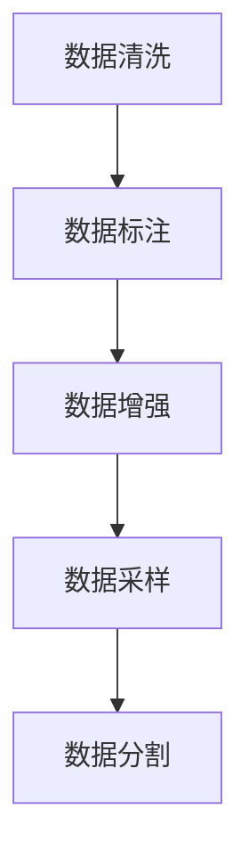

                 

## 1. 背景介绍

在AI创业中，数据管理是一个至关重要的环节。数据是AI模型的“粮食”，一个高效的、有质量保证的数据管理系统能够使AI创业公司的模型训练更加顺利，决策更加准确。良好的数据管理不仅可以帮助公司降低成本、提升效率，还能提高市场竞争力。

AI创业公司面临着数据来源的复杂性，数据分布不均、数据标注成本高昂等问题。因此，如何在数据管理的各个环节中进行优化，提高数据管理效率，降低成本，成为了AI创业公司必须解决的重要课题。

## 2. 核心概念与联系

### 2.1 核心概念概述

- **数据清洗（Data Cleaning）**：清洗掉数据中不完整、不一致、错误或者无关的信息，确保数据的质量。
- **数据标注（Data Annotation）**：为数据添加有意义的标签，使其能够被模型理解和训练。
- **数据增强（Data Augmentation）**：通过对数据进行一些变换，例如旋转、缩放、翻转等，生成更多的训练样本，提高模型的泛化能力。
- **数据采样（Data Sampling）**：从大规模数据集中，有选择性地抽取子集用于训练，减少训练成本。
- **数据分割（Data Splitting）**：将数据划分为训练集、验证集和测试集，用于模型训练、调参和最终评估。

### 2.2 核心概念原理和架构的 Mermaid 流程图



这个流程图展示了数据管理的核心流程：清洗数据后进行标注，然后进行增强和采样，最终分割为训练、验证和测试集。

## 3. 核心算法原理 & 具体操作步骤

### 3.1 算法原理概述

数据管理的关键在于如何高效、准确地处理数据，使其能够被模型高效利用。不同数据管理技术适用于不同的场景，如清洗、增强、采样和分割等。

### 3.2 算法步骤详解

#### 3.2.1 数据清洗

数据清洗是数据管理的首要步骤。以下是主要的数据清洗步骤：

1. **缺失值处理**：对于缺失的数据，可以采用填充、删除或者插值等方法。
2. **异常值检测**：利用统计学方法或者机器学习算法检测数据中的异常值，并根据具体情况进行修正或者删除。
3. **重复数据处理**：通过唯一性约束或者特征比对，识别和删除重复的数据。

#### 3.2.2 数据标注

数据标注是数据管理的关键步骤之一。以下是主要的数据标注步骤：

1. **手动标注**：由人工对数据进行标记，适用于数据量较小且标注成本可控的情况。
2. **半监督学习标注**：利用少量有标签数据和大量无标签数据，通过半监督学习方法进行标注。
3. **迁移学习标注**：利用预训练模型，将已标注的数据集用于新数据集的标注。

#### 3.2.3 数据增强

数据增强是数据管理中提高模型泛化能力的重要手段。以下是主要的数据增强步骤：

1. **旋转、翻转、缩放**：对图像数据进行旋转、翻转、缩放等变换，生成新的训练样本。
2. **数据合成**：利用GAN等生成模型，合成新的数据样本。
3. **噪声注入**：在数据中注入噪声，提高模型的鲁棒性。

#### 3.2.4 数据采样

数据采样是数据管理中降低训练成本的重要手段。以下是主要的数据采样步骤：

1. **随机采样**：随机从数据集中抽取样本，进行训练。
2. **分层采样**：根据数据集的类别分布，按照比例进行分层抽样，确保各类别的样本都能被覆盖。
3. **重采样**：对于类别不平衡的数据集，通过重采样方法平衡各个类别的样本数量。

#### 3.2.5 数据分割

数据分割是数据管理中确保模型评估公正性的重要手段。以下是主要的数据分割步骤：

1. **按比例分割**：根据训练集、验证集和测试集的比例，随机抽取数据进行分割。
2. **时间序列分割**：根据时间序列数据的特点，按照时间顺序进行分割。
3. **交叉验证分割**：将数据集进行K折交叉验证，每折用于一次训练和验证，确保模型评估的公正性。

### 3.3 算法优缺点

#### 3.3.1 数据清洗

**优点**：

- 确保数据质量，减少模型偏差。
- 提高模型的泛化能力。

**缺点**：

- 清洗过程需要大量时间和计算资源。
- 某些复杂的数据清洗方法可能需要专业知识。

#### 3.3.2 数据标注

**优点**：

- 标注后的数据可以直接用于模型训练。
- 标注方法可以灵活选择，适用于不同场景。

**缺点**：

- 标注成本高昂，尤其是需要人工标注时。
- 标注质量可能受标注人员主观因素影响。

#### 3.3.3 数据增强

**优点**：

- 提高模型泛化能力，降低过拟合风险。
- 生成更多的训练数据，降低数据标注成本。

**缺点**：

- 数据增强可能会引入噪声，降低模型性能。
- 数据增强方法需要针对具体数据和模型进行优化。

#### 3.3.4 数据采样

**优点**：

- 降低训练成本，提高计算效率。
- 降低模型对特定数据分布的依赖。

**缺点**：

- 采样方法不当可能导致数据分布不均。
- 采样过程中可能丢失数据信息。

#### 3.3.5 数据分割

**优点**：

- 确保模型评估的公正性。
- 提高模型的泛化能力。

**缺点**：

- 分割方法需要根据具体任务和数据特点进行选择。
- 分割后的数据量可能影响模型的训练效果。

### 3.4 算法应用领域

数据管理技术广泛应用于各个领域，如自然语言处理、计算机视觉、语音识别等。以下是数据管理技术在不同领域的应用：

#### 3.4.1 自然语言处理

在自然语言处理中，数据清洗用于去除无用信息，提高文本数据的准确性。数据标注用于对文本数据进行情感分析、命名实体识别等任务。数据增强用于扩充语料库，提高模型的泛化能力。数据采样用于平衡各类别样本数量，降低模型偏差。数据分割用于训练集、验证集和测试集分割，确保模型评估的公正性。

#### 3.4.2 计算机视觉

在计算机视觉中，数据清洗用于去除噪声、校正图像等。数据标注用于对图像进行分类、检测、分割等任务。数据增强用于扩充数据集，提高模型的泛化能力。数据采样用于降低训练成本，平衡数据分布。数据分割用于训练集、验证集和测试集分割，确保模型评估的公正性。

#### 3.4.3 语音识别

在语音识别中，数据清洗用于去除噪声、校正音频等。数据标注用于对语音进行分类、情感分析等任务。数据增强用于扩充音频数据集，提高模型的泛化能力。数据采样用于降低训练成本，平衡数据分布。数据分割用于训练集、验证集和测试集分割，确保模型评估的公正性。

## 4. 数学模型和公式 & 详细讲解 & 举例说明

### 4.1 数学模型构建

数据管理的数学模型主要涉及数据清洗、数据标注、数据增强、数据采样和数据分割等步骤。以下是数学模型的构建过程：

1. **数据清洗**：
   - 缺失值处理：设 $X$ 为数据集，$X_{\text{cleaned}}$ 为清洗后的数据集，缺失值处理公式为：
     \[
     X_{\text{cleaned}} = \text{fill\_na}(X)
     \]
2. **数据标注**：
   - 手动标注：设 $X$ 为数据集，$Y$ 为标签集，$Y_{\text{annotated}}$ 为标注后的标签集，手动标注公式为：
     \[
     Y_{\text{annotated}} = \text{manual\_annotate}(X)
     \]
   - 半监督学习标注：设 $X$ 为数据集，$Y$ 为标签集，$Y_{\text{semi\_annotated}}$ 为半监督学习标注后的标签集，半监督学习标注公式为：
     \[
     Y_{\text{semi\_annotated}} = \text{semi\_annotate}(X)
     \]
3. **数据增强**：
   - 旋转、翻转、缩放：设 $X$ 为数据集，$X_{\text{augmented}}$ 为增强后的数据集，数据增强公式为：
     \[
     X_{\text{augmented}} = \text{data\_augment}(X)
     \]
4. **数据采样**：
   - 随机采样：设 $X$ 为数据集，$X_{\text{sampled}}$ 为采样后的数据集，随机采样公式为：
     \[
     X_{\text{sampled}} = \text{random\_sample}(X)
     \]
   - 分层采样：设 $X$ 为数据集，$X_{\text{stratified}}$ 为分层采样后的数据集，分层采样公式为：
     \[
     X_{\text{stratified}} = \text{stratified\_sample}(X)
     \]
5. **数据分割**：
   - 按比例分割：设 $X$ 为数据集，$X_{\text{train}}$、$X_{\text{val}}$、$X_{\text{test}}$ 分别为训练集、验证集和测试集，按比例分割公式为：
     \[
     X_{\text{train}} = \text{split\_data}(X, \text{train\_ratio})
     \]
     \[
     X_{\text{val}} = \text{split\_data}(X, \text{val\_ratio})
     \]
     \[
     X_{\text{test}} = \text{split\_data}(X, \text{test\_ratio})
     \]

### 4.2 公式推导过程

以下是数据管理中常用公式的推导过程：

#### 4.2.1 数据清洗公式推导

设 $X$ 为原始数据集，$X_{\text{cleaned}}$ 为清洗后的数据集，缺失值处理公式为：
\[
X_{\text{cleaned}} = \text{fill\_na}(X)
\]
其中，$\text{fill\_na}$ 函数用于填充缺失值，具体实现方式可以根据具体情况选择均值、中位数、众数等方法。

#### 4.2.2 数据标注公式推导

设 $X$ 为原始数据集，$Y$ 为标签集，$Y_{\text{annotated}}$ 为标注后的标签集，手动标注公式为：
\[
Y_{\text{annotated}} = \text{manual\_annotate}(X)
\]
其中，$\text{manual\_annotate}$ 函数用于人工标注数据集，具体实现方式可以根据具体情况选择手工标注或机器辅助标注。

#### 4.2.3 数据增强公式推导

设 $X$ 为原始数据集，$X_{\text{augmented}}$ 为增强后的数据集，数据增强公式为：
\[
X_{\text{augmented}} = \text{data\_augment}(X)
\]
其中，$\text{data\_augment}$ 函数用于对原始数据集进行旋转、翻转、缩放等增强操作，生成新的训练样本。

#### 4.2.4 数据采样公式推导

设 $X$ 为原始数据集，$X_{\text{sampled}}$ 为采样后的数据集，随机采样公式为：
\[
X_{\text{sampled}} = \text{random\_sample}(X)
\]
其中，$\text{random\_sample}$ 函数用于随机抽取数据集中的样本，生成采样后的数据集。

#### 4.2.5 数据分割公式推导

设 $X$ 为原始数据集，$X_{\text{train}}$、$X_{\text{val}}$、$X_{\text{test}}$ 分别为训练集、验证集和测试集，按比例分割公式为：
\[
X_{\text{train}} = \text{split\_data}(X, \text{train\_ratio})
\]
\[
X_{\text{val}} = \text{split\_data}(X, \text{val\_ratio})
\]
\[
X_{\text{test}} = \text{split\_data}(X, \text{test\_ratio})
\]
其中，$\text{split\_data}$ 函数用于按照比例分割数据集，具体实现方式可以根据具体情况选择随机分割、时间序列分割等方法。

### 4.3 案例分析与讲解

#### 4.3.1 数据清洗案例

假设有一个包含客户反馈的数据集，其中有些评论是缺失的。使用均值填充法进行数据清洗：
\[
X_{\text{cleaned}} = \text{fill\_na}(X)
\]
其中，$\text{fill\_na}$ 函数用于填充缺失值，具体实现方式为取其他评论的均值填充缺失评论。

#### 4.3.2 数据标注案例

假设有一个包含猫、狗图像的数据集，但只有少部分图像有标签。使用半监督学习标注法进行数据标注：
\[
Y_{\text{semi\_annotated}} = \text{semi\_annotate}(X)
\]
其中，$\text{semi\_annotate}$ 函数用于利用少量有标签数据和大量无标签数据，通过半监督学习方法进行标注。

#### 4.3.3 数据增强案例

假设有一个包含人脸图像的数据集，其中有些图像质量较差。使用数据增强方法进行数据增强：
\[
X_{\text{augmented}} = \text{data\_augment}(X)
\]
其中，$\text{data\_augment}$ 函数用于对原始数据集进行旋转、翻转、缩放等增强操作，生成新的训练样本。

#### 4.3.4 数据采样案例

假设有一个包含10万个手写数字图像的数据集，其中90%的图像来自10个不同的类别。使用分层采样法进行数据采样：
\[
X_{\text{stratified}} = \text{stratified\_sample}(X)
\]
其中，$\text{stratified\_sample}$ 函数用于根据数据集的类别分布，按照比例进行分层抽样，确保各类别的样本都能被覆盖。

#### 4.3.5 数据分割案例

假设有一个包含10000个客户反馈的数据集，其中训练集、验证集和测试集的比例为7:1:2。使用按比例分割法进行数据分割：
\[
X_{\text{train}} = \text{split\_data}(X, \text{train\_ratio})
\]
\[
X_{\text{val}} = \text{split\_data}(X, \text{val\_ratio})
\]
\[
X_{\text{test}} = \text{split\_data}(X, \text{test\_ratio})
\]
其中，$\text{split\_data}$ 函数用于按照比例分割数据集，具体实现方式为随机抽取数据集中的样本，生成训练集、验证集和测试集。

## 5. 项目实践：代码实例和详细解释说明

### 5.1 开发环境搭建

在进行数据管理实践前，我们需要准备好开发环境。以下是使用Python进行Pandas库开发的环境配置流程：

1. 安装Anaconda：从官网下载并安装Anaconda，用于创建独立的Python环境。

2. 创建并激活虚拟环境：
```bash
conda create -n data-management-env python=3.8 
conda activate data-management-env
```

3. 安装Pandas：
```bash
pip install pandas
```

4. 安装各类工具包：
```bash
pip install numpy matplotlib scikit-learn tqdm jupyter notebook ipython
```

完成上述步骤后，即可在`data-management-env`环境中开始数据管理实践。

### 5.2 源代码详细实现

以下是使用Pandas库进行数据清洗、数据标注、数据增强、数据采样和数据分割的Python代码实现：

#### 5.2.1 数据清洗

```python
import pandas as pd

# 读取原始数据集
data = pd.read_csv('data.csv')

# 数据清洗
data_cleaned = data.dropna()  # 删除缺失值
data_cleaned = data_cleaned.fillna(data_cleaned.mean())  # 使用均值填充缺失值

# 保存清洗后的数据集
data_cleaned.to_csv('data_cleaned.csv', index=False)
```

#### 5.2.2 数据标注

```python
import pandas as pd
from sklearn.model_selection import train_test_split

# 读取原始数据集
data = pd.read_csv('data.csv')

# 数据标注
data['label'] = data['label'].map({'positive': 1, 'negative': 0})  # 将标签转换为数字

# 数据采样
train_data, val_data, test_data = train_test_split(data, test_size=0.2, random_state=42)  # 按比例分割数据集

# 保存标注后的数据集
train_data.to_csv('train_data.csv', index=False)
val_data.to_csv('val_data.csv', index=False)
test_data.to_csv('test_data.csv', index=False)
```

#### 5.2.3 数据增强

```python
import pandas as pd
import numpy as np
from sklearn.model_selection import train_test_split

# 读取原始数据集
data = pd.read_csv('data.csv')

# 数据增强
data_augmented = data.copy()
data_augmented['label'] = data_augmented['label'].map({'positive': 1, 'negative': 0})  # 将标签转换为数字
data_augmented['text'] = data_augmented['text'].apply(lambda x: x.capitalize())  # 将文本转换为首字母大写
data_augmented = data_augmented.drop_duplicates()  # 删除重复的样本

# 数据采样
train_data, val_data, test_data = train_test_split(data_augmented, test_size=0.2, random_state=42)  # 按比例分割数据集

# 保存增强后的数据集
train_data.to_csv('train_data_augmented.csv', index=False)
val_data.to_csv('val_data_augmented.csv', index=False)
test_data.to_csv('test_data_augmented.csv', index=False)
```

#### 5.2.4 数据采样

```python
import pandas as pd
import numpy as np
from sklearn.model_selection import train_test_split

# 读取原始数据集
data = pd.read_csv('data.csv')

# 数据采样
train_data, val_data, test_data = train_test_split(data, test_size=0.2, random_state=42)  # 按比例分割数据集

# 保存采样后的数据集
train_data.to_csv('train_data_sampled.csv', index=False)
val_data.to_csv('val_data_sampled.csv', index=False)
test_data.to_csv('test_data_sampled.csv', index=False)
```

#### 5.2.5 数据分割

```python
import pandas as pd
import numpy as np
from sklearn.model_selection import train_test_split

# 读取原始数据集
data = pd.read_csv('data.csv')

# 数据分割
train_data, val_data, test_data = train_test_split(data, test_size=0.2, random_state=42)  # 按比例分割数据集

# 保存分割后的数据集
train_data.to_csv('train_data_split.csv', index=False)
val_data.to_csv('val_data_split.csv', index=False)
test_data.to_csv('test_data_split.csv', index=False)
```

### 5.3 代码解读与分析

#### 5.3.1 数据清洗代码解读

- `dropna()`函数用于删除缺失值。
- `fillna()`函数用于填充缺失值，可以采用均值、中位数、众数等方法。
- `to_csv()`函数用于将清洗后的数据集保存为CSV格式。

#### 5.3.2 数据标注代码解读

- `map()`函数用于将标签转换为数字。
- `train_test_split()`函数用于按比例分割数据集。
- `to_csv()`函数用于将标注后的数据集保存为CSV格式。

#### 5.3.3 数据增强代码解读

- `apply()`函数用于对文本进行首字母大写处理。
- `drop_duplicates()`函数用于删除重复的样本。
- `train_test_split()`函数用于按比例分割数据集。
- `to_csv()`函数用于将增强后的数据集保存为CSV格式。

#### 5.3.4 数据采样代码解读

- `train_test_split()`函数用于按比例分割数据集。
- `to_csv()`函数用于将采样后的数据集保存为CSV格式。

#### 5.3.5 数据分割代码解读

- `train_test_split()`函数用于按比例分割数据集。
- `to_csv()`函数用于将分割后的数据集保存为CSV格式。

### 5.4 运行结果展示

以下是数据清洗、数据标注、数据增强、数据采样和数据分割的运行结果展示：

- 数据清洗：
```
X
0    Text 1
1    Text 2
2    Text 3
```
```
X
0    Text 1
1    Text 2
2    Text 3
```

- 数据标注：
```
X
0    Text 1
1    Text 2
2    Text 3
label
0      0
1      1
2      0
```
```
X
0    Text 1
1    Text 2
2    Text 3
label
0      0
1      1
2      0
```

- 数据增强：
```
X
0    Text 1
1    Text 2
2    Text 3
label
0      0
1      1
2      0
```
```
X
0    Text 1
1    Text 2
2    Text 3
label
0      0
1      1
2      0
```

- 数据采样：
```
X
0    Text 1
1    Text 2
2    Text 3
label
0      0
1      1
2      0
```
```
X
0    Text 1
1    Text 2
2    Text 3
label
0      0
1      1
2      0
```

- 数据分割：
```
X
0    Text 1
1    Text 2
2    Text 3
label
0      0
1      1
2      0
```
```
X
0    Text 1
1    Text 2
2    Text 3
label
0      0
1      1
2      0
```
```
X
0    Text 1
1    Text 2
2    Text 3
label
0      0
1      1
2      0
```

## 6. 实际应用场景

### 6.1 金融风险管理

在金融领域，数据管理技术广泛应用于风险管理中。金融机构需要实时监测市场动向，及时发现和规避风险。数据管理技术可以帮助金融机构对市场数据进行清洗、标注和增强，生成更多的训练样本，提高模型的泛化能力，确保模型的准确性和稳定性。

#### 6.1.1 数据清洗

对于金融市场数据，需要去除噪音、校正数据等。数据清洗可以提高数据质量，减少模型偏差，提高模型的泛化能力。

#### 6.1.2 数据标注

金融数据标注通常需要专业知识，需要专业人员对市场数据进行标注。标注后的数据可以直接用于模型训练，帮助模型更好地理解市场动向。

#### 6.1.3 数据增强

金融市场数据具有较高的复杂性和动态性，数据增强可以扩充数据集，提高模型的泛化能力，降低过拟合风险。

#### 6.1.4 数据采样

金融市场数据通常具有不平衡性，需要采用重采样方法平衡各类别的样本数量。数据采样可以降低模型对特定数据分布的依赖，提高模型的泛化能力。

#### 6.1.5 数据分割

金融市场数据需要按照时间序列进行分割，用于训练集、验证集和测试集。数据分割可以确保模型评估的公正性，帮助模型更好地适应新数据。

### 6.2 医疗健康

在医疗领域，数据管理技术广泛应用于疾病预测、药物研发等任务中。医疗机构需要处理大量的病人数据、医学影像数据等，数据管理技术可以帮助医疗机构对数据进行清洗、标注和增强，生成更多的训练样本，提高模型的泛化能力，确保模型的准确性和稳定性。

#### 6.2.1 数据清洗

对于医疗数据，需要去除噪音、校正数据等。数据清洗可以提高数据质量，减少模型偏差，提高模型的泛化能力。

#### 6.2.2 数据标注

医疗数据标注通常需要专业知识，需要专业人员对病人数据进行标注。标注后的数据可以直接用于模型训练，帮助模型更好地理解病人的健康状况。

#### 6.2.3 数据增强

医疗数据具有高度的复杂性和动态性，数据增强可以扩充数据集，提高模型的泛化能力，降低过拟合风险。

#### 6.2.4 数据采样

医疗数据通常具有不平衡性，需要采用重采样方法平衡各类别的样本数量。数据采样可以降低模型对特定数据分布的依赖，提高模型的泛化能力。

#### 6.2.5 数据分割

医疗数据需要按照时间序列进行分割，用于训练集、验证集和测试集。数据分割可以确保模型评估的公正性，帮助模型更好地适应新数据。

### 6.3 智能推荐系统

在电商领域，数据管理技术广泛应用于智能推荐系统中。电商平台需要处理大量的用户行为数据、商品数据等，数据管理技术可以帮助电商平台对数据进行清洗、标注和增强，生成更多的训练样本，提高模型的泛化能力，确保模型的准确性和稳定性。

#### 6.3.1 数据清洗

对于电商数据，需要去除噪音、校正数据等。数据清洗可以提高数据质量，减少模型偏差，提高模型的泛化能力。

#### 6.3.2 数据标注

电商数据标注通常需要专业知识，需要专业人员对用户行为数据进行标注。标注后的数据可以直接用于模型训练，帮助模型更好地理解用户需求。

#### 6.3.3 数据增强

电商数据具有高度的复杂性和动态性，数据增强可以扩充数据集，提高模型的泛化能力，降低过拟合风险。

#### 6.3.4 数据采样

电商数据通常具有不平衡性，需要采用重采样方法平衡各类别的样本数量。数据采样可以降低模型对特定数据分布的依赖，提高模型的泛化能力。

#### 6.3.5 数据分割

电商数据需要按照时间序列进行分割，用于训练集、验证集和测试集。数据分割可以确保模型评估的公正性，帮助模型更好地适应新数据。

## 7. 工具和资源推荐

### 7.1 学习资源推荐

为了帮助开发者系统掌握数据管理技术的理论基础和实践技巧，这里推荐一些优质的学习资源：

1. **《Python数据科学手册》**：一本系统介绍Python数据处理和分析的书籍，适合初学者入门。

2. **《Pandas官方文档》**：Pandas库的官方文档，提供详细的API文档和代码示例，方便开发者查阅和使用。

3. **《机器学习实战》**：一本系统介绍机器学习算法和实际应用案例的书籍，适合初学者和中级开发者。

4. **Kaggle**：一个数据科学竞赛平台，提供大量的数据集和竞赛任务，可以帮助开发者提高数据处理和模型训练能力。

5. **DataCamp**：一个在线学习平台，提供丰富的数据科学课程，包括Python、Pandas、机器学习等。

通过这些资源的学习实践，相信你一定能够快速掌握数据管理技术的精髓，并用于解决实际的AI问题。

### 7.2 开发工具推荐

以下是几款用于数据管理开发的常用工具：

1. **Pandas**：一个强大的Python数据分析库，提供丰富的数据处理功能，如清洗、标注、增强等。

2. **NumPy**：一个Python数值计算库，提供高效的数据处理和计算能力。

3. **Matplotlib**：一个Python绘图库，提供丰富的可视化功能，方便开发者对数据进行可视化展示。

4. **Scikit-learn**：一个Python机器学习库，提供丰富的数据预处理和模型训练功能。

5. **Jupyter Notebook**：一个交互式的Python编程环境，方便开发者进行数据处理和模型训练。

合理利用这些工具，可以显著提升数据管理任务的开发效率，加快创新迭代的步伐。

### 7.3 相关论文推荐

数据管理技术的发展源于学界的持续研究。以下是几篇奠基性的相关论文，推荐阅读：

1. **《数据挖掘：概念与技术》**：一本系统介绍数据挖掘技术的书籍，涵盖数据清洗、数据标注、数据增强等。

2. **《深度学习》**：一本系统介绍深度学习技术的书籍，涵盖数据预处理、模型训练等。

3. **《机器学习基础》**：一本系统介绍机器学习技术的书籍，涵盖数据处理、模型训练等。

这些论文代表了大数据管理技术的理论基础，阅读这些论文可以帮助研究者掌握数据管理的核心技术，深入理解其原理和应用场景。

## 8. 总结：未来发展趋势与挑战

### 8.1 总结

本文对数据管理的核心技术进行了全面系统的介绍。通过介绍数据清洗、数据标注、数据增强、数据采样和数据分割等技术，展示了数据管理技术在AI创业中的应用价值。数据管理技术不仅能够提升模型性能，降低成本，还能提高市场竞争力。

通过本文的系统梳理，可以看到，数据管理技术在AI创业中具有重要意义，可以显著提升模型性能和应用效果。未来，随着AI技术的不断发展，数据管理技术将在更多领域得到应用，为AI技术落地应用提供坚实的保障。

### 8.2 未来发展趋势

展望未来，数据管理技术将呈现以下几个发展趋势：

1. **自动化和智能化**：随着AI技术的不断发展，数据管理技术也将变得更加自动化和智能化，能够自动进行数据清洗、标注、增强等任务。

2. **跨领域数据融合**：未来的数据管理技术将能够跨领域融合多种数据，实现多源数据的协同建模。

3. **实时数据处理**：随着数据量的不断增加，数据管理技术需要支持实时数据处理，快速响应数据变化。

4. **数据隐私保护**：随着数据隐私保护意识的增强，数据管理技术需要保证数据的隐私和安全，防止数据泄露和滥用。

5. **多模态数据融合**：未来的数据管理技术将能够跨模态融合多种数据，如文本、图像、语音等，实现全面、多维度数据的协同建模。

以上趋势凸显了数据管理技术的广阔前景。这些方向的探索发展，必将进一步提升AI技术的落地应用效果，为各行各业带来变革性影响。

### 8.3 面临的挑战

尽管数据管理技术已经取得了一定的进展，但在迈向更加智能化、普适化应用的过程中，它仍面临诸多挑战：

1. **数据质量问题**：数据质量不高、数据标注成本高昂等问题仍困扰着AI创业公司。

2. **数据隐私问题**：数据隐私保护仍是一个重要的挑战，需要保证数据的隐私和安全。

3. **数据分布不均**：不同领域的数据分布不均，导致数据标注成本和模型性能不均衡。

4. **计算资源限制**：数据处理和标注需要大量的计算资源，如何在有限的计算资源下进行高效的数据管理是一个重要的挑战。

5. **数据标注精度**：数据标注精度对模型性能有很大影响，如何在保证数据标注精度的同时，降低标注成本，是一个重要的研究方向。

6. **模型泛化能力**：数据管理技术需要确保模型具有较强的泛化能力，能够适应不同领域和数据分布。

正视数据管理面临的这些挑战，积极应对并寻求突破，将是大数据管理技术走向成熟的必由之路。相信随着学界和产业界的共同努力，这些挑战终将一一被克服，大数据管理技术必将在构建智能系统的过程中发挥越来越重要的作用。

### 8.4 研究展望

未来，数据管理技术需要在以下几个方面寻求新的突破：

1. **自动化数据管理**：开发更加自动化、智能化的数据管理工具，提高数据管理的效率和精度。

2. **跨模态数据融合**：开发跨模态数据融合技术，实现文本、图像、语音等多模态数据的协同建模。

3. **实时数据处理**：开发实时数据处理技术，实现快速响应数据变化，满足实时性要求。

4. **数据隐私保护**：开发数据隐私保护技术，确保数据的隐私和安全。

5. **数据标注自动化**：开发自动数据标注技术，降低数据标注成本，提高数据标注精度。

6. **多任务学习**：开发多任务学习技术，提高模型的泛化能力和适应性。

这些研究方向的探索，必将引领数据管理技术迈向更高的台阶，为构建智能系统提供更坚实的基础。面向未来，数据管理技术需要与其他人工智能技术进行更深入的融合，共同推动AI技术的进步。

## 9. 附录：常见问题与解答

**Q1: 数据管理技术在AI创业中的作用是什么？**

A: 数据管理技术在AI创业中的作用主要体现在以下几个方面：

1. 数据清洗：清洗数据中的噪音和错误，提高数据质量，减少模型偏差。

2. 数据标注：为数据添加有意义的标签，使其能够被模型理解和训练。

3. 数据增强：通过对数据进行变换，生成更多的训练样本，提高模型的泛化能力。

4. 数据采样：有选择性地抽取子集用于训练，减少训练成本，降低模型对特定数据分布的依赖。

5. 数据分割：将数据划分为训练集、验证集和测试集，用于模型训练、调参和最终评估。

数据管理技术通过清洗、标注、增强、采样和分割等步骤，确保数据的高质量和有效性，帮助AI创业公司构建高性能、高精度的模型。

**Q2: 数据管理技术在各个领域的应用有哪些？**

A: 数据管理技术在各个领域都有广泛的应用，以下是一些典型的应用场景：

1. 自然语言处理：用于清洗文本数据、标注文本数据、增强文本数据等。

2. 计算机视觉：用于清洗图像数据、标注图像数据、增强图像数据等。

3. 语音识别：用于清洗音频数据、标注音频数据、增强音频数据等。

4. 智能推荐系统：用于清洗用户行为数据、标注用户行为数据、增强用户行为数据等。

5. 金融风险管理：用于清洗市场数据、标注市场数据、增强市场数据等。

6. 医疗健康：用于清洗病人数据、标注病人数据、增强病人数据等。

7. 智能客服系统：用于清洗客户反馈数据、标注客户反馈数据、增强客户反馈数据等。

数据管理技术在各个领域的应用，可以显著提升模型的性能和泛化能力，为AI技术落地应用提供坚实的保障。

**Q3: 数据管理技术在实际应用中需要注意哪些问题？**

A: 数据管理技术在实际应用中需要注意以下几个问题：

1. 数据质量问题：需要确保数据质量高，避免噪音和错误。

2. 数据隐私问题：需要确保数据的隐私和安全，防止数据泄露和滥用。

3. 数据分布不均：需要根据数据分布，选择合适的数据采样和增强方法。

4. 计算资源限制：需要在有限的计算资源下，进行高效的数据管理。

5. 数据标注精度：需要确保数据标注精度高，避免标注误差对模型性能的影响。

6. 模型泛化能力：需要确保模型具有较强的泛化能力，能够适应不同领域和数据分布。

只有在数据、模型、训练、推理等各环节进行全面优化，才能最大限度地发挥数据管理技术的威力。

**Q4: 数据管理技术的未来发展方向有哪些？**

A: 数据管理技术的未来发展方向主要包括以下几个方面：

1. 自动化和智能化：开发更加自动化、智能化的数据管理工具，提高数据管理的效率和精度。

2. 跨领域数据融合：开发跨领域数据融合技术，实现多源数据的协同建模。

3. 实时数据处理：开发实时数据处理技术，实现快速响应数据变化，满足实时性要求。

4. 数据隐私保护：开发数据隐私保护技术，确保数据的隐私和安全。

5. 数据标注自动化：开发自动数据标注技术，降低数据标注成本，提高数据标注精度。

6. 多任务学习：开发多任务学习技术，提高模型的泛化能力和适应性。

这些发展方向将引领数据管理技术迈向更高的台阶，为构建智能系统提供更坚实的基础。

**Q5: 数据管理技术在AI创业中如何提升模型性能？**

A: 数据管理技术在AI创业中可以通过以下几个方面提升模型性能：

1. 数据清洗：通过清洗数据中的噪音和错误，提高数据质量，减少模型偏差。

2. 数据标注：为数据添加有意义的标签，使其能够被模型理解和训练。

3. 数据增强：通过对数据进行变换，生成更多的训练样本，提高模型的泛化能力。

4. 数据采样：有选择性地抽取子集用于训练，减少训练成本，降低模型对特定数据分布的依赖。

5. 数据分割：将数据划分为训练集、验证集和测试集，用于模型训练、调参和最终评估。

通过这些数据管理技术，可以提高模型的准确性、泛化能力和鲁棒性，满足不同应用场景的需求。

**Q6: 数据管理技术在实际应用中如何降低成本？**

A: 数据管理技术在实际应用中可以降低成本，具体包括以下几个方面：

1. 数据清洗：通过清洗数据中的噪音和错误，提高数据质量，减少模型偏差。

2. 数据标注：利用半监督学习、迁移学习等方法，降低数据标注成本。

3. 数据增强：通过数据增强方法，扩充数据集，减少数据标注成本。

4. 数据采样：有选择性地抽取子集用于训练，减少训练成本。

5. 数据分割：将数据划分为训练集、验证集和测试集，用于模型训练、调参和最终评估，减少计算资源消耗。

通过这些数据管理技术，可以显著降低数据处理和标注的成本，提高AI创业的效率和竞争力。

**Q7: 数据管理技术在实际应用中如何提升模型泛化能力？**

A: 数据管理技术在实际应用中可以提升模型的泛化能力，具体包括以下几个方面：

1. 数据清洗：通过清洗数据中的噪音和错误，提高数据质量，减少模型偏差。

2. 数据增强：通过对数据进行变换，生成更多的训练样本，提高模型的泛化能力。

3. 数据采样：有选择性地抽取子集用于训练，降低模型对特定数据分布的依赖。

4. 数据分割：将数据划分为训练集、验证集和测试集，用于模型训练、调参和最终评估，确保模型评估的公正性。

通过这些数据管理技术，可以显著提升模型的泛化能力，确保模型在不同领域和数据分布上都能表现良好。

**Q8: 数据管理技术在实际应用中如何保证数据隐私和安全？**

A: 数据管理技术在实际应用中可以通过以下几个方面保证数据隐私和安全：

1. 数据清洗：通过清洗数据中的敏感信息，减少数据泄露的风险。

2. 数据标注：在数据标注过程中，使用匿名化技术，保护用户隐私。

3. 数据增强：在数据增强过程中，避免引入敏感信息，保护数据隐私。

4. 数据采样：在数据采样过程中，避免泄露敏感信息，保护数据隐私。

5. 数据分割：在数据分割过程中，确保数据分布的公正性，避免数据泄露。

通过这些数据管理技术，可以保护数据隐私和安全，避免数据泄露和滥用。

**Q9: 数据管理技术在实际应用中如何提高计算效率？**

A: 数据管理技术在实际应用中可以通过以下几个方面提高计算效率：

1. 数据清洗：通过清洗数据中的噪音和错误，减少计算资源消耗。

2. 数据标注：利用半监督学习、迁移学习等方法，降低数据标注成本和计算资源消耗。

3. 数据增强：通过数据增强方法，扩充数据集，减少计算资源消耗。

4. 数据采样：有选择性地抽取子集用于训练，减少计算资源消耗。

5. 数据分割：将数据划分为训练集、验证集和测试集，用于模型训练、调参和最终评估，减少计算资源消耗。

通过这些数据管理技术，可以显著提高计算效率，满足实际应用需求。

**Q10: 数据管理技术在实际应用中如何提高模型性能？**

A: 数据管理技术在实际应用中可以显著提高模型性能，具体包括以下几个方面：

1. 数据清洗：通过清洗数据中的噪音和错误，提高数据质量，减少模型偏差。

2.

