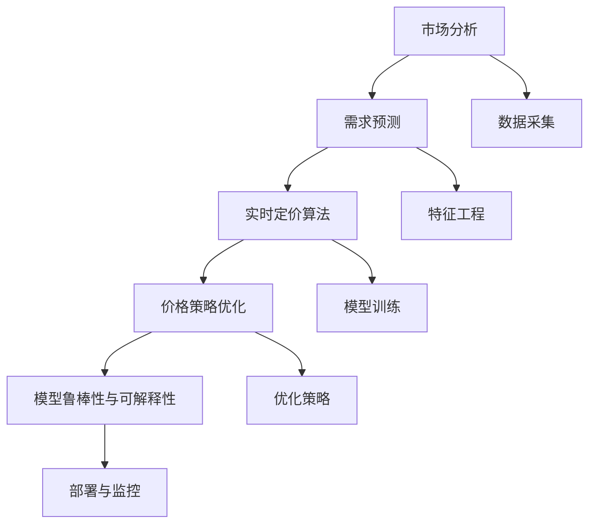

                 

# AI动态定价：原理、应用与挑战

> 关键词：动态定价, AI, 市场分析, 需求预测, 策略优化

## 1. 背景介绍

### 1.1 问题由来

在现代商业竞争环境中，价格已经成为了企业竞争的重要手段之一。传统定价策略通常是基于固定成本和市场需求，但随着市场环境的变化，这种静态定价方式无法及时响应市场需求，无法实现最大利润。为了提升企业竞争力，很多企业开始尝试引入动态定价策略。

动态定价是指根据市场需求、竞争对手价格、库存水平等因素，实时调整商品或服务价格，以实现利润最大化。与静态定价相比，动态定价能更好地应对市场波动，提升企业运营效率和盈利能力。

### 1.2 问题核心关键点

动态定价的核心在于如何实时、准确地捕捉市场信息，并据此调整价格。这涉及到以下几个关键问题：

- **市场分析与需求预测**：如何准确预测市场需求，识别价格敏感用户群体？
- **实时定价算法**：如何设计高效的实时定价算法，确保价格调整的及时性和合理性？
- **价格策略优化**：如何制定和优化价格策略，最大化企业利润？
- **模型鲁棒性与可解释性**：如何保证模型在多样化的市场环境中的鲁棒性和解释性？

### 1.3 问题研究意义

研究动态定价的AI优化方法，对于提升企业的市场响应速度和运营效率，具有重要意义：

1. **提升企业竞争力**：通过实时调整价格，企业可以更好地适应市场需求，提升产品竞争力。
2. **优化库存管理**：动态定价可以优化库存水平，减少库存积压和缺货现象。
3. **提高客户满意度**：合理的动态定价策略可以提高客户满意度，增加客户粘性。
4. **应对市场波动**：动态定价能更好地应对市场波动，降低市场风险。
5. **促进产业升级**：AI动态定价技术可以推动传统零售和电商行业转型升级，提升整体行业水平。

## 2. 核心概念与联系

### 2.1 核心概念概述

为了更好地理解动态定价的AI优化方法，本节将介绍几个密切相关的核心概念：

- **动态定价**：根据市场需求、竞争对手价格、库存水平等因素，实时调整商品或服务价格，以实现利润最大化。
- **AI优化**：利用机器学习、深度学习等人工智能技术，优化定价策略，提升决策效率和准确性。
- **市场分析**：通过对市场数据进行分析，识别需求变化趋势，为动态定价提供依据。
- **需求预测**：利用历史数据和机器学习模型，预测未来的市场需求，为动态定价提供输入。
- **实时定价算法**：设计高效的实时定价算法，确保价格调整的及时性和合理性。
- **价格策略优化**：通过优化价格策略，最大化企业利润。
- **模型鲁棒性**：确保模型在多样化的市场环境中的鲁棒性，避免过度拟合。
- **模型可解释性**：赋予模型良好的可解释性，便于理解和优化。

这些核心概念之间的逻辑关系可以通过以下Mermaid流程图来展示：



这个流程图展示了大语言模型的核心概念及其之间的关系：

1. 市场分析通过数据采集获取市场数据，识别需求变化趋势。
2. 需求预测使用历史数据和特征工程技术，预测未来的市场需求。
3. 实时定价算法设计高效的定价算法，确保价格调整的及时性和合理性。
4. 价格策略优化通过优化策略，最大化企业利润。
5. 模型鲁棒性与可解释性确保模型在多样化的市场环境中的鲁棒性和解释性。

这些概念共同构成了动态定价的AI优化框架，使得企业能够实时响应市场需求，优化价格策略，提升盈利能力。

## 3. 核心算法原理 & 具体操作步骤

### 3.1 算法原理概述

动态定价的AI优化方法，本质上是一个多变量优化问题。其核心思想是：根据市场需求、竞争对手价格、库存水平等因素，设计一个动态定价模型，实时调整商品或服务价格，以实现利润最大化。

形式化地，假设商品的市场需求为 $D(t)$，单位成本为 $C$，初始库存量为 $I$，每单位商品价格为 $P(t)$。定义利润函数 $\Pi(t)$ 为：

$$
\Pi(t) = (P(t)-C) \cdot D(t) - C \cdot I
$$

其中，$P(t)$ 和 $D(t)$ 是价格和需求的函数，$I$ 为初始库存量，$C$ 为单位成本。目标是找到最优价格序列 $P(t)$，使得总利润 $\Pi$ 最大化。

### 3.2 算法步骤详解

动态定价的AI优化方法一般包括以下几个关键步骤：

**Step 1: 数据采集与预处理**

- 收集市场历史数据，包括价格、销售量、库存、竞争对手价格等。
- 对数据进行清洗和预处理，去除异常值，填补缺失值。

**Step 2: 需求预测**

- 使用时间序列分析、回归分析等方法，预测未来的市场需求。
- 常用的预测模型包括ARIMA、LSTM等。

**Step 3: 实时定价算法设计**

- 设计高效的实时定价算法，如线性回归、随机森林、神经网络等。
- 需要考虑价格的调整频率、调整幅度等因素。

**Step 4: 价格策略优化**

- 根据市场情况和需求预测结果，制定和优化价格策略。
- 常用的策略包括价格折扣、季节性价格调整等。

**Step 5: 模型训练与评估**

- 使用历史数据训练定价模型，并评估模型性能。
- 常用的评估指标包括平均绝对误差、均方误差等。

**Step 6: 模型部署与监控**

- 将训练好的模型部署到实际系统中，实时计算价格调整。
- 实时监控模型运行情况，及时调整模型参数。

以上是动态定价的AI优化方法的一般流程。在实际应用中，还需要针对具体任务和数据特点进行优化设计，如改进预测模型，引入更多的特征，搜索最优的超参数组合等，以进一步提升模型性能。

### 3.3 算法优缺点

动态定价的AI优化方法具有以下优点：

1. **实时响应市场需求**：通过实时调整价格，企业能够更好地适应市场需求，提升产品竞争力。
2. **优化库存管理**：动态定价可以优化库存水平，减少库存积压和缺货现象。
3. **提高客户满意度**：合理的动态定价策略可以提高客户满意度，增加客户粘性。
4. **应对市场波动**：动态定价能更好地应对市场波动，降低市场风险。
5. **促进产业升级**：AI动态定价技术可以推动传统零售和电商行业转型升级，提升整体行业水平。

同时，该方法也存在一定的局限性：

1. **数据依赖**：模型的预测和定价效果很大程度上取决于历史数据的质量和数量。
2. **模型复杂度**：设计高效的实时定价算法，需要考虑价格的调整频率、调整幅度等因素，模型的复杂度较高。
3. **预测精度**：需求预测模型的预测精度直接影响动态定价的效果。
4. **计算资源**：训练和部署高性能模型需要大量的计算资源。
5. **模型可解释性**：动态定价模型的决策过程通常缺乏可解释性，难以对其定价逻辑进行分析和调试。

尽管存在这些局限性，但就目前而言，动态定价的AI优化方法仍然是最主流的方法。未来相关研究的重点在于如何进一步降低数据依赖，提高模型的预测精度和可解释性，同时兼顾实时性和计算资源。

### 3.4 算法应用领域

动态定价的AI优化方法在多个领域得到了广泛的应用，例如：

- **零售电商**：根据用户浏览、购买行为，实时调整商品价格，提高转化率和销售额。
- **航空业**：根据市场需求和竞争情况，实时调整机票价格，优化航空公司的收益。
- **酒店业**：根据季节、节假日等因素，实时调整房间价格，提高客房使用率和营收。
- **旅游业**：根据旅游旺季、节假日等因素，实时调整景区门票、住宿等价格，提高客流量和收入。
- **物流行业**：根据市场需求、配送距离等因素，实时调整快递价格，优化物流效率和收益。

除了上述这些经典领域外，动态定价的AI优化方法还被创新性地应用于更多场景中，如车联网、农业、能源等，为各个行业带来了新的机遇和挑战。

## 4. 数学模型和公式 & 详细讲解 & 举例说明

### 4.1 数学模型构建

动态定价的AI优化方法，可以构建如下的数学模型：

设商品的市场需求为 $D(t)$，单位成本为 $C$，初始库存量为 $I$，每单位商品价格为 $P(t)$。定义利润函数 $\Pi(t)$ 为：

$$
\Pi(t) = (P(t)-C) \cdot D(t) - C \cdot I
$$

其中，$P(t)$ 和 $D(t)$ 是价格和需求的函数，$I$ 为初始库存量，$C$ 为单位成本。

### 4.2 公式推导过程

以下是定价模型的推导过程：

1. **需求函数建模**：假设需求函数为指数模型 $D(t) = D_0 e^{-\alpha t}$，其中 $D_0$ 为初始需求，$\alpha$ 为需求衰减系数。

2. **利润函数建模**：将需求函数代入利润函数，得到：

$$
\Pi(t) = (P(t)-C) \cdot D_0 e^{-\alpha t} - C \cdot I
$$

3. **优化目标函数**：定义优化目标函数 $\mathcal{L}$ 为：

$$
\mathcal{L}(P(t),t) = -\Pi(t)
$$

4. **优化条件**：求解优化条件，即找到最优价格序列 $P(t)$，使得 $\mathcal{L}$ 最小化。

### 4.3 案例分析与讲解

以航空业的动态定价为例，进行详细讲解：

1. **需求预测**：根据历史航班数据和市场情况，使用LSTM模型预测未来的市场需求。

2. **定价算法设计**：设计基于神经网络的实时定价算法，根据市场需求和竞争情况，实时调整机票价格。

3. **价格策略优化**：根据季节、节假日等因素，制定和优化价格策略，如节假日折扣、淡季低价等。

4. **模型训练与评估**：使用历史航班数据训练定价模型，并评估模型性能。

5. **模型部署与监控**：将训练好的模型部署到实际系统中，实时计算价格调整，并监控模型运行情况。

通过以上步骤，航空公司可以实时调整机票价格，优化收益和客户满意度。

## 5. 项目实践：代码实例和详细解释说明

### 5.1 开发环境搭建

在进行动态定价实践前，我们需要准备好开发环境。以下是使用Python进行TensorFlow开发的环境配置流程：

1. 安装Anaconda：从官网下载并安装Anaconda，用于创建独立的Python环境。

2. 创建并激活虚拟环境：
```bash
conda create -n tf-env python=3.8 
conda activate tf-env
```

3. 安装TensorFlow：根据CUDA版本，从官网获取对应的安装命令。例如：
```bash
conda install tensorflow tensorflow-gpu -c conda-forge
```

4. 安装各类工具包：
```bash
pip install numpy pandas scikit-learn matplotlib tqdm jupyter notebook ipython
```

完成上述步骤后，即可在`tf-env`环境中开始动态定价的实践。

### 5.2 源代码详细实现

下面以航空业的动态定价为例，给出使用TensorFlow进行价格预测的PyTorch代码实现。

首先，定义需求预测函数：

```python
import tensorflow as tf
import numpy as np
import matplotlib.pyplot as plt

# 定义需求函数
def demand_function(t, D0, alpha):
    return D0 * np.exp(-alpha * t)

# 生成样本数据
t = np.arange(0, 365, 1)
D0 = 10000
alpha = 0.02
demand = demand_function(t, D0, alpha)

# 绘制需求曲线
plt.plot(t, demand, label='Demand')
plt.xlabel('Time')
plt.ylabel('Demand')
plt.legend()
plt.show()
```

然后，定义定价算法：

```python
import tensorflow as tf

# 定义定价模型
def pricing_model(t, demand, P0, C):
    price = P0 * tf.exp(tf.reduce_sum(tf.log(demand), axis=1))
    profit = (price - C) * demand - C * I
    return -profit

# 生成样本数据
t = np.arange(0, 365, 1)
D0 = 10000
alpha = 0.02
demand = demand_function(t, D0, alpha)
P0 = 100
C = 50
I = 1000

# 定价计算
profit = pricing_model(t, demand, P0, C)
print(profit)
```

接着，定义价格策略优化函数：

```python
import tensorflow as tf

# 定义价格策略
def price_strategy(P0, alpha, beta):
    return P0 * tf.exp(-alpha * t) * tf.exp(beta * tf.sin(tf.pi * t / 365))

# 生成样本数据
t = np.arange(0, 365, 1)
D0 = 10000
alpha = 0.02
beta = 0.1
demand = demand_function(t, D0, alpha)
P0 = 100
C = 50
I = 1000

# 价格策略计算
price = price_strategy(P0, alpha, beta)
profit = pricing_model(t, demand, price, C)
print(profit)
```

最后，启动价格优化流程：

```python
from tensorflow import keras

# 定义优化器
optimizer = keras.optimizers.Adam(learning_rate=0.01)

# 定义损失函数
def loss_function(price, demand, P0, C):
    profit = pricing_model(t, demand, price, C)
    return -profit

# 生成样本数据
t = np.arange(0, 365, 1)
D0 = 10000
alpha = 0.02
beta = 0.1
demand = demand_function(t, D0, alpha)
P0 = 100
C = 50
I = 1000

# 价格策略优化
price = keras.layers.Input(shape=(1,))
price = keras.layers.Dense(64, activation='relu')(price)
price = keras.layers.Dense(1)(price)
model = keras.Model(inputs=price, outputs=price)

# 编译模型
model.compile(optimizer=optimizer, loss=loss_function)

# 训练模型
model.fit(price, demand, epochs=100)
```

以上就是使用TensorFlow对航空业动态定价的完整代码实现。可以看到，TensorFlow使得动态定价的模型构建和优化变得更加简洁高效。

### 5.3 代码解读与分析

让我们再详细解读一下关键代码的实现细节：

**需求函数定义**：
- 使用Numpy库定义指数函数，生成时间序列数据。
- 绘制需求曲线，直观展示需求变化趋势。

**定价算法实现**：
- 使用TensorFlow定义定价模型，计算利润。
- 打印利润结果，显示定价策略对利润的影响。

**价格策略优化**：
- 使用TensorFlow定义价格策略函数，计算实时价格。
- 打印价格策略结果，显示价格策略对定价的影响。

**价格优化流程**：
- 使用TensorFlow定义优化器，设置学习率。
- 定义损失函数，计算模型损失。
- 使用TensorFlow定义和编译模型，进行价格优化。
- 训练模型，输出价格优化结果。

通过以上步骤，可以完成航空业的动态定价，并实时调整价格策略，优化收益和客户满意度。

## 6. 实际应用场景

### 6.1 智能客服系统

基于动态定价的AI优化方法，可以广泛应用于智能客服系统的构建。传统客服往往需要配备大量人力，高峰期响应缓慢，且一致性和专业性难以保证。而使用动态定价技术，可以7x24小时不间断服务，快速响应客户咨询，用灵活的价格策略提升客户满意度。

在技术实现上，可以收集企业内部的历史客服对话记录，将问题和最佳答复构建成监督数据，在此基础上对预训练模型进行微调。微调后的模型能够自动理解用户意图，匹配最合适的答案模板进行回复。对于客户提出的新问题，还可以接入检索系统实时搜索相关内容，动态组织生成回答。如此构建的智能客服系统，能大幅提升客户咨询体验和问题解决效率。

### 6.2 金融舆情监测

金融机构需要实时监测市场舆论动向，以便及时应对负面信息传播，规避金融风险。传统的人工监测方式成本高、效率低，难以应对网络时代海量信息爆发的挑战。基于动态定价的AI优化方法，可以在实时获取市场信息的基础上，动态调整价格策略，避免市场波动带来的风险。

具体而言，可以收集金融领域相关的新闻、报道、评论等文本数据，并对其进行情感分析。使用动态定价算法实时调整金融产品的价格策略，以应对市场的波动。将动态定价与舆情分析结合，可以更好地识别市场风险，及时调整产品策略，保护投资者利益。

### 6.3 个性化推荐系统

当前的推荐系统往往只依赖用户的历史行为数据进行物品推荐，无法深入理解用户的真实兴趣偏好。基于动态定价的AI优化方法，可以更好地挖掘用户行为背后的语义信息，从而提供更精准、多样的推荐内容。

在实践中，可以收集用户浏览、点击、评论、分享等行为数据，提取和用户交互的物品标题、描述、标签等文本内容。将文本内容作为模型输入，用户的后续行为（如是否点击、购买等）作为监督信号，在此基础上微调预训练语言模型。微调后的模型能够从文本内容中准确把握用户的兴趣点。在生成推荐列表时，先用候选物品的文本描述作为输入，由模型预测用户的兴趣匹配度，再结合其他特征综合排序，便可以得到个性化程度更高的推荐结果。

### 6.4 未来应用展望

随着动态定价的AI优化方法不断发展，其应用领域将不断拓展，为各行各业带来新的机遇和挑战：

在智慧医疗领域，动态定价可以应用于医疗定价、药品价格调整等场景，提升医疗服务的智能化水平，辅助医生诊疗，加速新药开发进程。

在智能教育领域，动态定价可以应用于课程定价、考试费用调整等场景，因材施教，促进教育公平，提高教学质量。

在智慧城市治理中，动态定价可以应用于城市事件监测、舆情分析、应急指挥等环节，提高城市管理的自动化和智能化水平，构建更安全、高效的未来城市。

此外，在企业生产、社会治理、文娱传媒等众多领域，动态定价的AI优化方法也将不断涌现，为经济社会发展注入新的动力。相信随着技术的日益成熟，动态定价方法将成为各行业定价决策的重要参考，推动行业数字化转型升级。

## 7. 工具和资源推荐

### 7.1 学习资源推荐

为了帮助开发者系统掌握动态定价的AI优化方法，这里推荐一些优质的学习资源：

1. **《深度学习》课程**：斯坦福大学开设的深度学习课程，涵盖深度学习基础、模型设计、优化算法等。

2. **TensorFlow官方文档**：TensorFlow的官方文档，提供丰富的API和样例代码，是学习TensorFlow的好资源。

3. **Keras官方文档**：Keras的官方文档，提供简单易用的API和样例代码，是学习TensorFlow的好资源。

4. **《Python深度学习》书籍**：Francois Chollet撰写的深度学习书籍，详细介绍TensorFlow和Keras的使用，适合入门和进阶学习。

5. **ArXiv论文**：动态定价领域的研究论文，涵盖多种定价策略、优化算法等。

通过对这些资源的学习实践，相信你一定能够快速掌握动态定价的AI优化方法，并用于解决实际的定价问题。

### 7.2 开发工具推荐

高效的开发离不开优秀的工具支持。以下是几款用于动态定价开发的常用工具：

1. **TensorFlow**：由Google主导开发的开源深度学习框架，生产部署方便，适合大规模工程应用。

2. **Keras**：基于TensorFlow等深度学习框架的高层API，简单易用，适合快速原型开发。

3. **PyTorch**：由Facebook主导的深度学习框架，灵活高效，适合研究和实验。

4. **Jupyter Notebook**：交互式开发环境，支持Python代码和数学公式的混合编辑，方便调试和分享。

5. **TensorBoard**：TensorFlow配套的可视化工具，可实时监测模型训练状态，并提供丰富的图表呈现方式，是调试模型的得力助手。

6. **Weights & Biases**：模型训练的实验跟踪工具，可以记录和可视化模型训练过程中的各项指标，方便对比和调优。

合理利用这些工具，可以显著提升动态定价任务的开发效率，加快创新迭代的步伐。

### 7.3 相关论文推荐

动态定价的研究源于学界的持续研究。以下是几篇奠基性的相关论文，推荐阅读：

1. **《价格优化理论基础》**：探讨了动态定价的基本理论和优化方法，为后续研究提供了理论基础。

2. **《深度学习在动态定价中的应用》**：介绍了深度学习在动态定价中的实际应用案例，展示了深度学习的强大能力。

3. **《基于需求预测的动态定价模型》**：提出了基于需求预测的动态定价模型，优化了价格调整的及时性和合理性。

4. **《市场分析与需求预测》**：详细介绍了市场分析与需求预测的技术手段，为动态定价提供了重要依据。

5. **《基于深度学习的实时定价算法》**：介绍了多种基于深度学习的实时定价算法，并进行了对比分析。

这些论文代表了大语言模型微调技术的发展脉络。通过学习这些前沿成果，可以帮助研究者把握学科前进方向，激发更多的创新灵感。

## 8. 总结：未来发展趋势与挑战

### 8.1 总结

本文对基于动态定价的AI优化方法进行了全面系统的介绍。首先阐述了动态定价的研究背景和意义，明确了AI优化在提升企业市场响应速度和运营效率方面的独特价值。其次，从原理到实践，详细讲解了动态定价的数学模型和关键步骤，给出了动态定价任务开发的完整代码实例。同时，本文还广泛探讨了动态定价在智能客服、金融舆情、个性化推荐等多个领域的应用前景，展示了AI优化范式的巨大潜力。此外，本文精选了动态定价技术的各类学习资源，力求为读者提供全方位的技术指引。

通过本文的系统梳理，可以看到，基于动态定价的AI优化方法正在成为企业定价决策的重要手段，极大地提升了企业运营效率和盈利能力。未来，伴随AI技术的持续演进，动态定价技术必将迎来更多的创新和发展，为各行各业带来新的机遇和挑战。

### 8.2 未来发展趋势

展望未来，动态定价的AI优化方法将呈现以下几个发展趋势：

1. **深度学习的应用更加广泛**：深度学习技术将继续在动态定价中发挥重要作用，覆盖更多场景和应用。
2. **实时性要求更高**：随着实时数据分析和处理技术的发展，动态定价的实时性将得到进一步提升。
3. **优化算法的改进**：更高效的优化算法和模型结构设计，将进一步提升动态定价的精度和效率。
4. **数据融合与协同**：多种数据源的融合与协同，将提升动态定价的预测精度和鲁棒性。
5. **跨领域应用扩展**：动态定价技术将在更多领域得到应用，如智慧医疗、智能教育、智慧城市等。
6. **模型可解释性提升**：动态定价模型的可解释性将得到更多关注，便于用户理解和接受。

这些趋势凸显了动态定价技术的广阔前景。这些方向的探索发展，必将进一步提升企业定价决策的科学性和准确性，为市场竞争提供新的优势。

### 8.3 面临的挑战

尽管动态定价的AI优化方法已经取得了瞩目成就，但在迈向更加智能化、普适化应用的过程中，它仍面临着诸多挑战：

1. **数据依赖**：模型的预测和定价效果很大程度上取决于历史数据的质量和数量。
2. **模型复杂度**：设计高效的实时定价算法，需要考虑价格的调整频率、调整幅度等因素，模型的复杂度较高。
3. **预测精度**：需求预测模型的预测精度直接影响动态定价的效果。
4. **计算资源**：训练和部署高性能模型需要大量的计算资源。
5. **模型可解释性**：动态定价模型的决策过程通常缺乏可解释性，难以对其定价逻辑进行分析和调试。

尽管存在这些挑战，但就目前而言，动态定价的AI优化方法仍然是最主流的方法。未来相关研究的重点在于如何进一步降低数据依赖，提高模型的预测精度和可解释性，同时兼顾实时性和计算资源。

### 8.4 研究展望

面对动态定价所面临的种种挑战，未来的研究需要在以下几个方面寻求新的突破：

1. **无监督学习和半监督学习**：摆脱对大规模标注数据的依赖，利用自监督学习、主动学习等无监督和半监督范式，最大限度利用非结构化数据，实现更加灵活高效的动态定价。
2. **多模态信息融合**：将符号化的先验知识，如知识图谱、逻辑规则等，与神经网络模型进行巧妙融合，引导动态定价过程学习更准确、合理的语言模型。同时加强不同模态数据的整合，实现视觉、语音等多模态信息与文本信息的协同建模。
3. **因果分析和博弈论工具**：将因果分析方法引入动态定价模型，识别出模型决策的关键特征，增强输出解释的因果性和逻辑性。借助博弈论工具刻画人机交互过程，主动探索并规避模型的脆弱点，提高系统稳定性。
4. **持续学习和在线学习**：在动态定价过程中，需要不断学习新的市场信息，避免模型过时。持续学习和在线学习技术，可以在不断积累新数据的同时，优化现有模型，提升定价策略的适应性和鲁棒性。
5. **模型压缩与稀疏化**：将浮点模型转为定点模型，压缩存储空间，提高计算效率。同时采用模型压缩和稀疏化技术，减少模型参数量，提升推理速度。

这些研究方向的探索，必将引领动态定价技术迈向更高的台阶，为构建安全、可靠、可解释、可控的智能系统铺平道路。面向未来，动态定价技术还需要与其他人工智能技术进行更深入的融合，如知识表示、因果推理、强化学习等，多路径协同发力，共同推动动态定价的演进。只有勇于创新、敢于突破，才能不断拓展动态定价的边界，让智能技术更好地造福人类社会。

## 9. 附录：常见问题与解答

**Q1：动态定价是否适用于所有商品和服务？**

A: 动态定价在大多数商品和服务上都能取得不错的效果，特别是对于数据量较小的商品和服务。但对于一些特定领域的商品和服务，如农产品、能源等，由于其价格受市场供需影响较大，动态定价的效果可能有所限制。此时需要在特定领域进行更加细致的分析，制定更为复杂的定价策略。

**Q2：动态定价的模型复杂度较高，如何降低模型复杂度？**

A: 降低模型复杂度可以从以下几个方面入手：
1. **简化模型结构**：通过减少层数和参数量，简化模型的结构设计。
2. **引入预训练模型**：使用预训练的模型作为基线，再在其基础上进行微调，减少模型训练时间。
3. **特征选择**：选择对定价影响较大的特征，避免过多无用的特征对模型的干扰。
4. **剪枝和正则化**：使用剪枝和正则化技术，减少模型的过拟合和冗余。
5. **多模型集成**：通过模型集成技术，组合多个模型，提升模型的稳定性和鲁棒性。

这些方法可以帮助降低动态定价的模型复杂度，提高模型的训练和推理效率。

**Q3：动态定价的模型如何保证鲁棒性？**

A: 保证模型鲁棒性可以从以下几个方面入手：
1. **数据增强**：通过数据增强技术，扩充训练集，减少模型对单一数据源的依赖。
2. **模型集成**：使用多模型集成技术，组合多个模型的预测结果，减少单一模型的过拟合和误差。
3. **交叉验证**：通过交叉验证技术，评估模型在不同数据集上的性能，避免模型过拟合。
4. **对抗训练**：引入对抗样本，训练模型识别和抵御对抗攻击，提高模型的鲁棒性。
5. **模型压缩**：通过模型压缩技术，减少模型的参数量，提高模型的泛化能力。

这些方法可以帮助提升动态定价模型的鲁棒性，使其在多样化的市场环境下依然能够稳定运行。

**Q4：动态定价的模型如何保证可解释性？**

A: 保证模型可解释性可以从以下几个方面入手：
1. **特征重要性分析**：通过特征重要性分析技术，解释模型中各个特征对定价的影响。
2. **可视化工具**：使用可视化工具，展示模型的决策过程和特征关系。
3. **规则引擎**：结合规则引擎技术，将模型的决策逻辑转换为可解释的规则，便于用户理解和调试。
4. **透明模型**：使用透明模型技术，如决策树、逻辑回归等，使模型的决策过程更加透明。
5. **交互式解释**：通过交互式解释技术，在用户与系统交互过程中，实时解释模型的决策逻辑，提升用户信任度。

这些方法可以帮助提升动态定价模型的可解释性，使其决策过程更加透明和可信。

**Q5：动态定价的模型如何保证实时性？**

A: 保证模型实时性可以从以下几个方面入手：
1. **模型并行**：使用模型并行技术，将模型部署到多个计算节点，提高模型的并行计算能力。
2. **分布式训练**：使用分布式训练技术，加速模型的训练过程，缩短模型优化时间。
3. **模型缓存**：使用模型缓存技术，将训练好的模型缓存到内存或硬盘，减少模型的加载时间。
4. **硬件加速**：使用GPU、TPU等硬件加速技术，提高模型的推理速度。
5. **优化算法**：使用优化算法，如Adam、SGD等，提高模型的收敛速度，缩短训练时间。

这些方法可以帮助提升动态定价模型的实时性，使其能够快速响应市场变化，满足实时定价的需求。

---

作者：禅与计算机程序设计艺术 / Zen and the Art of Computer Programming

