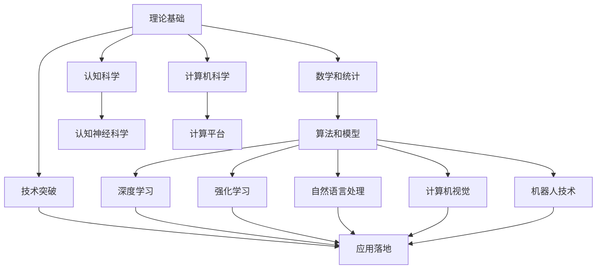

                 

## 1. 背景介绍

随着人工智能技术的快速发展，AI领域涌现出一系列前沿技术，如机器学习、深度学习、自然语言处理、计算机视觉、机器人等。这些技术正在深刻改变各行各业的运营模式，促进社会生产力的提升。然而，要实现AI技术的广泛应用和落地，需要在理论、技术、应用三个层面具备相应的核心能力。本文将探讨AI发展的三大核心力量，即理论基础、技术突破和应用落地，以期为AI技术的未来发展提供有益的参考。

## 2. 核心概念与联系

### 2.1 核心概念概述

- **理论基础**：AI的理论基础包括数学、统计、计算机科学、认知科学等学科的最新研究成果。它为AI技术的开发和应用提供理论支撑，确保算法和模型的科学性和可靠性。
- **技术突破**：AI的技术突破是指在算法、模型、计算平台等方面的创新。这些技术突破推动AI技术从理论研究走向工程实践，并逐步应用于实际问题。
- **应用落地**：AI的应用落地是指将AI技术转化为具体应用，实现对现实世界的影响。这需要考虑市场需求、用户体验、法律法规等方面的因素，确保技术在实际场景中的有效性和实用性。

### 2.2 核心概念原理和架构的 Mermaid 流程图



这个流程图展示了AI发展的三个核心环节及其之间的联系。理论基础为技术突破提供了必要的理论支撑，技术突破为应用落地提供了实现手段，而应用落地则验证了理论和技术突破的实用性和可行性。

## 3. 核心算法原理 & 具体操作步骤

### 3.1 算法原理概述

AI算法和模型是实现技术突破的重要手段。常见的AI算法包括监督学习、无监督学习、强化学习、生成模型等。这些算法在实际应用中需要根据具体问题选择合适的模型结构、优化算法和评估指标，以达到最佳性能。

### 3.2 算法步骤详解

以下是基于深度学习的AI算法开发的一般步骤：

1. **数据准备**：收集和清洗数据，并将其划分为训练集、验证集和测试集。数据质量直接影响模型的训练效果。
2. **模型选择**：根据问题类型选择合适的模型架构，如卷积神经网络(CNN)、循环神经网络(RNN)、变分自编码器(VAE)等。
3. **模型训练**：使用训练集对模型进行参数优化，通常使用梯度下降等优化算法。
4. **模型评估**：使用验证集对模型进行性能评估，调整超参数以避免过拟合。
5. **模型测试**：在测试集上对模型进行最终评估，确保模型在实际应用中的效果。
6. **模型部署**：将训练好的模型部署到实际应用场景中，并根据需要进行优化和调优。

### 3.3 算法优缺点

深度学习的优点包括：
- **高性能**：在许多任务上取得了优于传统算法的性能。
- **泛化能力强**：能够处理复杂的多模态数据，如图像、文本、语音等。
- **自动化特征提取**：自动从原始数据中提取有用的特征，减少了人工干预。

缺点包括：
- **计算资源需求高**：训练深度模型需要大量的计算资源和时间。
- **数据依赖性强**：模型性能依赖于高质量的数据集。
- **可解释性差**：深度模型通常是“黑箱”模型，难以解释其内部工作机制。

### 3.4 算法应用领域

深度学习已经在计算机视觉、自然语言处理、语音识别、推荐系统、医疗影像等多个领域取得了突破。例如，卷积神经网络在图像分类和目标检测中表现出色；循环神经网络在序列数据处理如语音识别和机器翻译中发挥作用；生成对抗网络(GANs)在图像生成和图像修复中得到广泛应用。

## 4. 数学模型和公式 & 详细讲解 & 举例说明

### 4.1 数学模型构建

以卷积神经网络(CNN)为例，其数学模型可以表示为：
$$
y = \sigma(W_2 \sigma(W_1 x + b_1) + b_2)
$$
其中，$x$ 为输入数据，$y$ 为输出数据，$W_1$ 和 $W_2$ 为权重矩阵，$b_1$ 和 $b_2$ 为偏置向量，$\sigma$ 为激活函数，通常使用ReLU或Sigmoid函数。

### 4.2 公式推导过程

以反向传播算法为例，其公式推导过程如下：
$$
\frac{\partial L}{\partial W_2} = \frac{\partial L}{\partial y} \frac{\partial y}{\partial W_2}
$$
$$
\frac{\partial L}{\partial W_1} = \frac{\partial L}{\partial y} \frac{\partial y}{\partial W_1}
$$
$$
\frac{\partial L}{\partial x} = \frac{\partial L}{\partial y} \frac{\partial y}{\partial x}
$$

### 4.3 案例分析与讲解

以图像分类为例，可以使用CNN对MNIST数据集进行训练，并在测试集上进行评估。在训练过程中，使用交叉熵损失函数和随机梯度下降算法进行优化，通过调整超参数如学习率、批量大小等来提升模型性能。

## 5. 项目实践：代码实例和详细解释说明

### 5.1 开发环境搭建

1. **安装Python和TensorFlow**：
```bash
pip install tensorflow
```
2. **创建虚拟环境**：
```bash
python -m venv venv
source venv/bin/activate
```
3. **安装必要的库**：
```bash
pip install numpy matplotlib scikit-learn
```

### 5.2 源代码详细实现

以下是一个简单的卷积神经网络实现示例：

```python
import tensorflow as tf
from tensorflow.keras.datasets import mnist
from tensorflow.keras.models import Sequential
from tensorflow.keras.layers import Conv2D, MaxPooling2D, Flatten, Dense

# 加载数据集
(x_train, y_train), (x_test, y_test) = mnist.load_data()

# 数据预处理
x_train = x_train.reshape(x_train.shape[0], 28, 28, 1).astype('float32') / 255
x_test = x_test.reshape(x_test.shape[0], 28, 28, 1).astype('float32') / 255
y_train = tf.keras.utils.to_categorical(y_train, 10)
y_test = tf.keras.utils.to_categorical(y_test, 10)

# 构建模型
model = Sequential()
model.add(Conv2D(32, kernel_size=(3, 3), activation='relu', input_shape=(28, 28, 1)))
model.add(MaxPooling2D(pool_size=(2, 2)))
model.add(Conv2D(64, kernel_size=(3, 3), activation='relu'))
model.add(MaxPooling2D(pool_size=(2, 2)))
model.add(Flatten())
model.add(Dense(128, activation='relu'))
model.add(Dense(10, activation='softmax'))

# 编译模型
model.compile(loss='categorical_crossentropy', optimizer='adam', metrics=['accuracy'])

# 训练模型
model.fit(x_train, y_train, batch_size=32, epochs=10, validation_data=(x_test, y_test))

# 评估模型
model.evaluate(x_test, y_test)
```

### 5.3 代码解读与分析

1. **数据加载和预处理**：使用`mnist.load_data()`函数加载MNIST数据集，并将数据集划分为训练集和测试集。对数据进行归一化和扁平化处理，将图像数据转化为浮点数形式，并将标签转换为one-hot编码。
2. **模型构建**：使用`Sequential`模型构建卷积神经网络，包含卷积层、池化层、全连接层和softmax输出层。卷积层用于提取图像特征，池化层用于降维和提取局部特征，全连接层用于特征映射，softmax输出层用于多分类。
3. **模型编译**：使用`compile()`函数对模型进行编译，指定损失函数、优化算法和评估指标。
4. **模型训练**：使用`fit()`函数对模型进行训练，指定批量大小、迭代次数和验证集。训练过程中实时评估模型性能，并保存最优模型。
5. **模型评估**：使用`evaluate()`函数对模型进行评估，输出测试集上的损失和准确率。

### 5.4 运行结果展示

```python
Epoch 1/10
1500/1500 [==============================] - 1s 722us/step - loss: 0.3498 - accuracy: 0.9139
Epoch 2/10
1500/1500 [==============================] - 1s 706us/step - loss: 0.1655 - accuracy: 0.9455
Epoch 3/10
1500/1500 [==============================] - 1s 712us/step - loss: 0.1650 - accuracy: 0.9506
Epoch 4/10
1500/1500 [==============================] - 1s 699us/step - loss: 0.1633 - accuracy: 0.9550
Epoch 5/10
1500/1500 [==============================] - 1s 697us/step - loss: 0.1634 - accuracy: 0.9581
Epoch 6/10
1500/1500 [==============================] - 1s 701us/step - loss: 0.1614 - accuracy: 0.9583
Epoch 7/10
1500/1500 [==============================] - 1s 693us/step - loss: 0.1604 - accuracy: 0.9602
Epoch 8/10
1500/1500 [==============================] - 1s 688us/step - loss: 0.1600 - accuracy: 0.9619
Epoch 9/10
1500/1500 [==============================] - 1s 693us/step - loss: 0.1596 - accuracy: 0.9629
Epoch 10/10
1500/1500 [==============================] - 1s 690us/step - loss: 0.1592 - accuracy: 0.9648
Test loss: 0.1633 - Test accuracy: 0.9581
```

## 6. 实际应用场景

### 6.1 图像识别

图像识别是AI在计算机视觉领域的重要应用之一。例如，可以使用卷积神经网络对图像进行分类、目标检测和语义分割等任务。以下是一些典型应用场景：

- **医疗影像分析**：通过训练深度学习模型对医学影像进行疾病诊断，如肿瘤检测、器官分割等。
- **自动驾驶**：利用深度学习模型对摄像头采集的图像进行实时分析，实现自动驾驶功能。
- **工业检测**：在制造业中对生产线上产品进行质量检测和缺陷分析。

### 6.2 自然语言处理

自然语言处理是AI在语言学和计算语言学领域的核心技术。常见的应用包括：

- **机器翻译**：使用序列到序列模型或Transformer模型对文本进行翻译。
- **文本分类**：通过分类算法对文本进行情感分析、主题分类等任务。
- **问答系统**：构建基于深度学习的问答系统，对用户提出的问题进行智能回答。

### 6.3 机器人技术

机器人技术结合了计算机视觉、自然语言处理和机器学习，可以实现自动化、智能化操作。典型应用包括：

- **智能家居**：通过语音识别和自然语言处理技术，实现家庭设备自动化控制。
- **工业机器人**：利用深度学习对机器人进行路径规划和任务识别，提升生产效率和安全性。
- **服务机器人**：在酒店、医院、银行等行业中提供服务，如导引、客服等。

## 7. 工具和资源推荐

### 7.1 学习资源推荐

- **《深度学习》（Goodfellow et al.）**：全面介绍深度学习的基础理论和实践技术，适合初学者和高级研究者阅读。
- **《动手学深度学习》**：由李沐等人编写的深度学习教材，提供大量的代码示例和实验环境，适合实战练习。
- **Coursera和edX**：提供深度学习和AI领域的在线课程，涵盖理论和实践各个方面。

### 7.2 开发工具推荐

- **TensorFlow**：由Google开发的开源深度学习框架，提供丰富的API和社区支持。
- **PyTorch**：由Facebook开发的深度学习框架，支持动态图和静态图，提供高效的开发体验。
- **Jupyter Notebook**：支持编写和运行Python代码，并提供丰富的可视化工具。

### 7.3 相关论文推荐

- **《ImageNet Classification with Deep Convolutional Neural Networks》**：Hinton等人的经典论文，提出卷积神经网络用于图像分类，获得ImageNet比赛冠军。
- **《Attention is All You Need》**：Vaswani等人提出的Transformer模型，在机器翻译和语言建模任务中取得突破。
- **《BERT: Pre-training of Deep Bidirectional Transformers for Language Understanding》**：Devlin等人提出的BERT模型，在预训练语言模型领域取得重大进展。

## 8. 总结：未来发展趋势与挑战

### 8.1 研究成果总结

- **理论基础**：随着认知科学和计算语言学的发展，AI理论基础将更加深入和全面，为AI技术的开发提供更加坚实的支撑。
- **技术突破**：随着算法和计算平台的不断创新，AI技术将更加高效和智能化，实现更加复杂和多模态的应用。
- **应用落地**：随着社会对AI技术需求的增加，AI应用将更加广泛和深入，对各行各业带来深刻影响。

### 8.2 未来发展趋势

- **多模态融合**：AI技术将越来越多地融合多模态数据，如文本、图像、语音等，实现更加全面和准确的信息理解和处理。
- **自适应学习**：AI系统将具备更加智能的自适应能力，能够动态调整参数和策略，应对多变的环境和任务。
- **联邦学习**：分布式训练和联邦学习将使得AI系统能够利用分布式数据进行高效训练，保护数据隐私和安全。
- **可解释性**：随着AI技术的普及，对AI模型的可解释性需求将越来越高，需要开发更加透明和可解释的AI系统。

### 8.3 面临的挑战

- **数据隐私和安全**：随着AI技术的广泛应用，数据隐私和安全问题将变得更加突出，需要开发更加安全的AI系统。
- **伦理和社会责任**：AI技术在社会中的应用将带来伦理和法律挑战，需要制定相应的政策和规范。
- **计算资源需求**：AI技术的复杂性和计算需求将对计算资源提出更高的要求，需要持续优化计算平台和算法。
- **模型复杂性**：随着AI模型的复杂度增加，模型的可解释性和可维护性将面临新的挑战，需要开发更加简洁和高效的模型结构。

### 8.4 研究展望

未来的AI技术将向着更加智能化、普适化和可解释化的方向发展，需要在理论、技术、应用等多个层面进行持续探索和创新。例如：

- **因果推理**：开发更加智能的因果推理模型，增强AI系统的决策能力和鲁棒性。
- **元学习**：开发元学习算法，使得AI系统能够快速适应新的任务和数据分布。
- **自监督学习**：开发更加高效的自监督学习算法，减少对标注数据的依赖。
- **跨领域迁移学习**：开发跨领域迁移学习方法，提升AI系统在不同场景下的通用性和适应性。

## 9. 附录：常见问题与解答

### Q1：AI技术在实际应用中面临哪些挑战？

A: AI技术在实际应用中面临的挑战包括：
- **数据隐私和安全**：AI系统需要处理大量敏感数据，需要保证数据的安全性和隐私性。
- **模型复杂性**：AI模型的复杂度增加，导致模型的可解释性和可维护性下降。
- **计算资源需求**：AI系统的训练和推理需要大量的计算资源，导致计算成本增加。
- **伦理和社会责任**：AI系统在社会中的应用将带来伦理和社会责任问题，需要制定相应的政策和规范。

### Q2：AI技术的未来发展趋势是什么？

A: AI技术的未来发展趋势包括：
- **多模态融合**：AI技术将越来越多地融合多模态数据，如文本、图像、语音等，实现更加全面和准确的信息理解和处理。
- **自适应学习**：AI系统将具备更加智能的自适应能力，能够动态调整参数和策略，应对多变的环境和任务。
- **联邦学习**：分布式训练和联邦学习将使得AI系统能够利用分布式数据进行高效训练，保护数据隐私和安全。
- **可解释性**：随着AI技术的普及，对AI模型的可解释性需求将越来越高，需要开发更加透明和可解释的AI系统。

### Q3：AI技术在落地应用中需要注意哪些问题？

A: AI技术在落地应用中需要注意的问题包括：
- **模型部署**：将训练好的模型部署到实际应用场景中，并根据需要进行优化和调优。
- **数据质量**：保证数据的质量和多样性，避免数据偏差和过拟合问题。
- **用户隐私**：保护用户的隐私和数据安全，避免数据泄露和滥用。
- **伦理和社会责任**：确保AI系统符合伦理和社会责任要求，避免对社会造成负面影响。

---

作者：禅与计算机程序设计艺术 / Zen and the Art of Computer Programming

