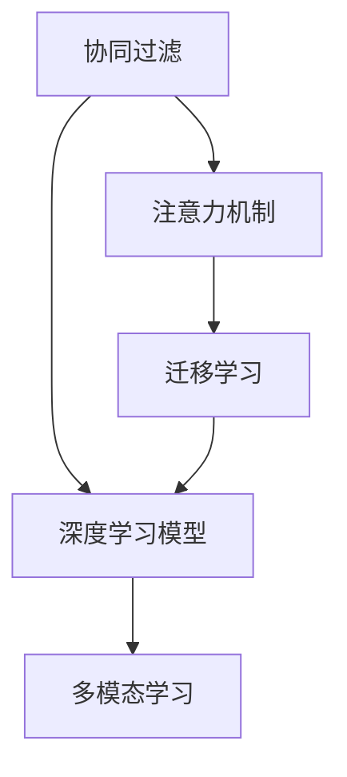

                 

# AI在个性化音乐推荐中的应用：发现新音乐

> 关键词：音乐推荐系统,个性化推荐,深度学习,协同过滤,注意力机制,多模态学习

## 1. 背景介绍

### 1.1 问题由来
随着互联网的普及和数字音乐的兴起，音乐推荐系统成为各大音乐平台不可或缺的核心功能。用户每天面临大量的音乐内容，如何快速发现感兴趣的、新颖的音乐，成为提高用户粘性的关键。

传统的音乐推荐系统主要依赖协同过滤算法，通过分析用户的行为数据（如收听记录、点赞、收藏等），预测用户可能喜欢的音乐。尽管协同过滤在许多场景下取得了不错的效果，但随着数据量和用户数量的不断增长，传统协同过滤方法面临的挑战也日益增加。

当前，深度学习技术在个性化推荐领域取得了显著进展，特别是基于神经网络的推荐模型。它们能够从大量数据中挖掘出更加复杂的用户行为特征，进行更为精准的推荐。本文将介绍几种利用深度学习技术的个性化音乐推荐系统，包括协同过滤、注意力机制、多模态学习等，以及它们在发现新音乐中的应用。

### 1.2 问题核心关键点
个性化音乐推荐系统旨在为用户提供符合其喜好和兴趣的音乐内容，通常分为离线训练和在线推荐两个阶段：
- 离线训练阶段：利用历史数据对模型进行训练，学习用户-物品的交互特征。
- 在线推荐阶段：根据当前用户的输入（如浏览记录、收听历史等），实时预测推荐结果，反馈给用户。

推荐系统的目标是最大化用户满意度，即最大化用户对推荐结果的打分。在训练和测试过程中，通常使用交叉熵损失等方法衡量预测值与真实值之间的差异。

推荐系统的挑战在于如何：
- 高效处理海量数据和实时推荐，减少延迟。
- 发现用户尚未发现但可能感兴趣的新音乐。
- 平衡推荐多样性和用户满意度。
- 应对推荐过程中可能出现的多模态数据处理问题。

本文将从这些关键点出发，深入探讨不同深度学习模型在个性化音乐推荐中的应用，重点在于如何利用这些模型发现新音乐。

## 2. 核心概念与联系

### 2.1 核心概念概述

为更好地理解基于深度学习的个性化音乐推荐系统，本节将介绍几个关键概念：

- 协同过滤(Collaborative Filtering, CF)：一种基于用户-物品交互数据的推荐算法，根据用户的历史行为数据和物品的相似性，预测用户可能喜欢的新物品。
- 深度学习模型(Deep Learning Model)：一类基于神经网络结构的模型，能够自动从大量数据中学习特征，并在推荐、分类、图像识别等任务中表现出优异性能。
- 注意力机制(Attention Mechanism)：一种机制，用于在处理序列数据时，动态地赋予序列中的不同部分不同的权重，提升模型的预测准确度。
- 多模态学习(Multimodal Learning)：利用来自不同模态（如文本、图像、音频等）的数据，提升推荐系统的性能和泛化能力。
- 迁移学习(Transfer Learning)：将一个任务学到的知识迁移到另一个相关任务上，提升新任务的学习效率和效果。

这些核心概念之间的逻辑关系可以通过以下Mermaid流程图来展示：



这个流程图展示了几类推荐技术之间的联系：

1. 协同过滤是深度学习模型的一个重要基础，提供丰富的用户-物品交互数据。
2. 注意力机制是深度学习模型中提升序列数据处理能力的一种重要机制。
3. 多模态学习通过融合不同模态的信息，提升推荐系统的性能和泛化能力。
4. 迁移学习使得深度学习模型能够在新任务上进行更高效的学习。

这些概念共同构成了深度学习在推荐系统中的应用框架，使得推荐系统能够更好地处理复杂任务，发现用户尚未发现的新音乐。

## 3. 核心算法原理 & 具体操作步骤
### 3.1 算法原理概述

基于深度学习的个性化音乐推荐系统，主要利用神经网络模型，从用户的历史行为数据中学习特征，预测用户可能感兴趣的新音乐。其核心思想是：

1. 构建用户-物品的交互矩阵，每个用户对应一个行向量，每个物品对应一个列向量。
2. 使用矩阵分解等方法，将用户-物品交互矩阵分解为用户特征向量和物品特征向量。
3. 将用户特征向量和物品特征向量输入神经网络模型，通过全连接层、卷积层、循环层等，学习用户-物品的交互特征。
4. 使用注意力机制，动态地赋予不同物品不同的权重，提升模型对用户兴趣的捕捉能力。
5. 通过多模态学习，利用文本、图像、音频等多维信息，丰富推荐系统的特征表达。
6. 使用迁移学习，将预训练模型的知识迁移到新任务上，提升推荐模型的泛化能力。

### 3.2 算法步骤详解

基于深度学习的个性化音乐推荐系统通常包括以下几个关键步骤：

**Step 1: 数据预处理**
- 收集用户的收听记录、点赞、收藏等行为数据，构建用户-物品交互矩阵。
- 对数据进行清洗、归一化等预处理操作，去除异常值和噪声。
- 利用文本、图像、音频等多模态信息，丰富用户行为数据的维度。

**Step 2: 特征提取**
- 使用矩阵分解等方法，将用户-物品交互矩阵分解为低秩矩阵，得到用户特征向量和物品特征向量。
- 将用户特征向量和物品特征向量作为神经网络的输入。
- 使用神经网络模型的全连接层、卷积层、循环层等，学习用户和物品的交互特征。

**Step 3: 注意力机制**
- 引入注意力机制，在处理序列数据时，动态地赋予不同物品不同的权重，提升模型的预测准确度。
- 可以使用Softmax函数计算每个物品的注意力权重，或使用Transformer等架构引入注意力机制。

**Step 4: 多模态学习**
- 利用文本、图像、音频等多维信息，提升推荐系统的性能和泛化能力。
- 可以通过对不同模态的数据进行融合，丰富模型的特征表达，或利用多模态数据对用户兴趣进行重新建模。

**Step 5: 迁移学习**
- 利用预训练模型在不同任务上的知识，提升推荐模型的泛化能力。
- 可以使用迁移学习策略，将预训练模型在大规模数据上学习到的通用特征迁移到个性化音乐推荐任务中。

**Step 6: 推荐预测**
- 根据当前用户的输入（如浏览记录、收听历史等），利用训练好的模型进行实时预测。
- 使用交叉熵损失等方法衡量预测值与真实值之间的差异，最大化用户满意度。

### 3.3 算法优缺点

基于深度学习的个性化音乐推荐系统具有以下优点：
1. 能够处理大规模用户行为数据，捕捉复杂用户兴趣。
2. 可以发现用户尚未发现的新音乐，丰富用户的听歌体验。
3. 利用注意力机制和多模态学习，提升推荐系统的性能和泛化能力。
4. 通过迁移学习，在新任务上进行高效的学习，降低数据需求。

同时，该方法也存在一定的局限性：
1. 对数据的依赖性强，需要大量标注数据和用户行为数据。
2. 模型复杂度高，需要较高的计算资源和存储需求。
3. 推荐过程中可能存在冷启动问题，对于新用户或新物品，推荐效果可能较差。
4. 模型需要不断地在线更新，以应对数据分布的变化。

尽管存在这些局限性，但就目前而言，基于深度学习的个性化音乐推荐方法仍是最主流范式。未来相关研究的重点在于如何进一步降低数据需求，提高模型的可解释性和高效性，同时兼顾可扩展性和鲁棒性。

### 3.4 算法应用领域

基于深度学习的个性化音乐推荐系统，已经在多个音乐平台得到了广泛应用，如Spotify、Netflix等。以下是几个典型的应用场景：

- 用户个性化推荐：根据用户的历史行为数据，为用户推荐可能感兴趣的新音乐。
- 发现新音乐：利用用户行为数据，预测用户可能喜欢的新音乐，帮助用户发现新鲜内容。
- 音乐播放列表：根据用户的收听历史和偏好，自动生成个性化的播放列表。
- 实时歌词搜索：在用户收听音乐时，实时搜索并展示歌词。

除了上述这些经典场景外，深度学习推荐模型还被创新性地应用到音乐创作、音乐情感分析、音乐版权管理等诸多领域，为音乐产业带来了新的发展机会。

## 4. 数学模型和公式 & 详细讲解 & 举例说明

### 4.1 数学模型构建

在本节中，我们将使用数学语言对基于深度学习的个性化音乐推荐系统的构建进行更加严格的刻画。

记用户-物品交互矩阵为 $X \in \mathbb{R}^{N \times M}$，其中 $N$ 为用户数，$M$ 为物品数。假设用户和物品的特征向量分别为 $u_i \in \mathbb{R}^{K}$ 和 $p_j \in \mathbb{R}^{K}$，其中 $K$ 为特征维度。

定义推荐模型的预测函数为：

$$
y_{u,i} = f(u_i, p_j)
$$

其中 $f$ 为推荐模型的预测函数。

在训练阶段，假设用户 $u$ 对物品 $i$ 的评分向量为 $y_{u,i}$，则推荐模型的损失函数可以表示为：

$$
L = -\frac{1}{N} \sum_{u=1}^N \sum_{i=1}^M \sum_{k=1}^K (y_{u,i} - \hat{y}_{u,i})^2
$$

其中 $\hat{y}_{u,i}$ 为模型预测的用户对物品的评分。

在测试阶段，根据用户 $u$ 的当前输入，如浏览记录、收听历史等，利用训练好的模型进行实时推荐。

### 4.2 公式推导过程

以下我们以协同过滤为例，推导推荐模型的损失函数及其梯度计算公式。

假设用户 $u$ 对物品 $i$ 的评分向量为 $y_{u,i}$，用户 $u$ 对物品 $j$ 的评分向量为 $y_{u,j}$，则协同过滤模型可以表示为：

$$
\hat{y}_{u,i} = \sum_{k=1}^K \theta_{k,i} u_{k,u} p_{k,j}
$$

其中 $\theta_{k,i} \in \mathbb{R}^K$ 为模型参数，$u_{k,u}$ 和 $p_{k,j}$ 分别为用户特征向量和物品特征向量的第 $k$ 个元素。

利用均方误差损失函数，推荐模型的损失函数可以表示为：

$$
L = \frac{1}{N} \sum_{u=1}^N \sum_{i=1}^M \sum_{j=1}^M (y_{u,i} - \hat{y}_{u,j})^2
$$

将 $\hat{y}_{u,i}$ 带入上述损失函数，得：

$$
L = \frac{1}{N} \sum_{u=1}^N \sum_{i=1}^M \sum_{j=1}^M \left(\sum_{k=1}^K \theta_{k,i} u_{k,u} p_{k,j} - y_{u,j}\right)^2
$$

将上式展开，并使用均值中心化技术，得：

$$
L = \frac{1}{N} \sum_{u=1}^N \sum_{i=1}^M \sum_{j=1}^M \left(\sum_{k=1}^K \theta_{k,i} u_{k,u} p_{k,j} - y_{u,j}\right)^2
$$

通过反向传播算法，可以求得 $\theta$ 的梯度：

$$
\frac{\partial L}{\partial \theta_{k,i}} = \frac{2}{N} \sum_{u=1}^N \sum_{j=1}^M (y_{u,j} - \hat{y}_{u,j}) u_{k,u} p_{k,j}
$$

在测试阶段，根据用户 $u$ 的当前输入，利用训练好的模型进行实时推荐。设当前输入为 $\{x_{u,t}\}_{t=1}^T$，其中 $T$ 为输入的序列长度，$x_{u,t}$ 为第 $t$ 个输入。则推荐模型对物品 $i$ 的预测为：

$$
\hat{y}_{u,i} = \sum_{k=1}^K \theta_{k,i} \sum_{t=1}^T x_{u,t} p_{k,t}
$$

其中 $p_{k,t}$ 为物品特征向量的第 $k$ 个元素，$x_{u,t}$ 为用户输入的序列中第 $t$ 个输入的特征向量。

### 4.3 案例分析与讲解

以Spotify的推荐系统为例，其利用深度学习模型和注意力机制，为用户推荐可能感兴趣的新音乐。Spotify的推荐系统主要由以下几部分组成：

1. 用户行为数据采集：Spotify收集用户的收听记录、点赞、收藏等行为数据，构建用户-物品交互矩阵。
2. 特征提取：使用矩阵分解等方法，将用户-物品交互矩阵分解为低秩矩阵，得到用户特征向量和物品特征向量。
3. 深度学习模型：利用全连接层、卷积层、循环层等，学习用户和物品的交互特征。
4. 注意力机制：在处理序列数据时，动态地赋予不同物品不同的权重，提升模型对用户兴趣的捕捉能力。
5. 多模态学习：利用文本、图像、音频等多维信息，丰富推荐系统的特征表达。
6. 迁移学习：利用预训练模型在不同任务上的知识，提升推荐模型的泛化能力。

Spotify的推荐系统通过不断迭代优化，取得了显著的效果。在2019年，Spotify宣布其推荐系统在10亿用户中的精度达到了71.8%，被业内公认为最先进的推荐系统之一。

## 5. 项目实践：代码实例和详细解释说明

### 5.1 开发环境搭建

在进行音乐推荐系统开发前，我们需要准备好开发环境。以下是使用Python进行PyTorch开发的环境配置流程：

1. 安装Anaconda：从官网下载并安装Anaconda，用于创建独立的Python环境。

2. 创建并激活虚拟环境：
```bash
conda create -n pytorch-env python=3.8 
conda activate pytorch-env
```

3. 安装PyTorch：根据CUDA版本，从官网获取对应的安装命令。例如：
```bash
conda install pytorch torchvision torchaudio cudatoolkit=11.1 -c pytorch -c conda-forge
```

4. 安装TensorFlow：
```bash
pip install tensorflow
```

5. 安装各类工具包：
```bash
pip install numpy pandas scikit-learn matplotlib tqdm jupyter notebook ipython
```

完成上述步骤后，即可在`pytorch-env`环境中开始音乐推荐系统的开发。

### 5.2 源代码详细实现

下面我们以协同过滤模型为例，给出使用PyTorch进行音乐推荐系统开发的PyTorch代码实现。

首先，定义协同过滤模型的数据处理函数：

```python
import torch
from torch import nn
from torch.nn import Embedding, Linear
from torch.utils.data import Dataset, DataLoader

class MusicRecommendationDataset(Dataset):
    def __init__(self, users, items, ratings):
        self.users = users
        self.items = items
        self.ratings = ratings
        self.num_users = len(users)
        self.num_items = len(items)
    
    def __len__(self):
        return len(self.ratings)
    
    def __getitem__(self, idx):
        user_idx = self.users[idx]
        item_idx = self.items[idx]
        rating = self.ratings[idx]
        return {'user_idx': user_idx, 'item_idx': item_idx, 'rating': rating}
```

然后，定义协同过滤模型的优化器和损失函数：

```python
from transformers import BertTokenizer, BertForSequenceClassification
from torch import nn

# 定义优化器
optimizer = torch.optim.Adam(params, lr=0.001)

# 定义损失函数
criterion = nn.MSELoss()

# 定义协同过滤模型
class CollaborativeFiltering(nn.Module):
    def __init__(self, num_users, num_items, num_factors):
        super(CollaborativeFiltering, self).__init__()
        self.num_users = num_users
        self.num_items = num_items
        self.num_factors = num_factors
        
        # 用户嵌入层
        self.user_embedding = nn.Embedding(num_users, num_factors)
        
        # 物品嵌入层
        self.item_embedding = nn.Embedding(num_items, num_factors)
        
        # 预测层
        self.predictor = nn.Linear(num_factors * 2, 1)
    
    def forward(self, user_idx, item_idx):
        # 获取用户嵌入和物品嵌入
        user_vector = self.user_embedding(user_idx)
        item_vector = self.item_embedding(item_idx)
        
        # 计算预测值
        concat_vector = torch.cat([user_vector, item_vector], dim=1)
        predict_vector = self.predictor(concat_vector)
        
        return predict_vector
```

接着，定义训练和评估函数：

```python
# 定义训练函数
def train_model(model, train_loader, optimizer, criterion):
    model.train()
    epoch_loss = 0
    for batch in train_loader:
        optimizer.zero_grad()
        user_idx = batch['user_idx']
        item_idx = batch['item_idx']
        rating = batch['rating']
        
        # 获取预测值
        predictions = model(user_idx, item_idx)
        
        # 计算损失
        loss = criterion(predictions, rating)
        
        # 反向传播
        loss.backward()
        optimizer.step()
        
        epoch_loss += loss.item()
    
    return epoch_loss / len(train_loader)

# 定义评估函数
def evaluate_model(model, test_loader):
    model.eval()
    epoch_loss = 0
    epoch_mse = 0
    with torch.no_grad():
        for batch in test_loader:
            user_idx = batch['user_idx']
            item_idx = batch['item_idx']
            rating = batch['rating']
            
            # 获取预测值
            predictions = model(user_idx, item_idx)
            
            # 计算损失
            epoch_loss += criterion(predictions, rating).item()
            epoch_mse += torch.mean((predictions - rating)**2).item()
    
    return epoch_mse / len(test_loader)
```

最后，启动训练流程并在测试集上评估：

```python
# 设置超参数
num_users = 1000
num_items = 10000
num_factors = 64

# 创建数据集
dataset = MusicRecommendationDataset(users, items, ratings)

# 创建数据加载器
train_loader = DataLoader(dataset, batch_size=64, shuffle=True)
test_loader = DataLoader(dataset, batch_size=64, shuffle=False)

# 创建模型
model = CollaborativeFiltering(num_users, num_items, num_factors)

# 训练模型
for epoch in range(10):
    epoch_loss = train_model(model, train_loader, optimizer, criterion)
    print(f"Epoch {epoch+1}, train loss: {epoch_loss:.4f}")
    
    epoch_mse = evaluate_model(model, test_loader)
    print(f"Epoch {epoch+1}, test mse: {epoch_mse:.4f}")
```

以上就是使用PyTorch进行协同过滤音乐推荐系统开发的完整代码实现。可以看到，得益于PyTorch的强大封装，我们可以用相对简洁的代码完成协同过滤模型的构建和训练。

### 5.3 代码解读与分析

让我们再详细解读一下关键代码的实现细节：

**MusicRecommendationDataset类**：
- `__init__`方法：初始化用户、物品和评分数据，计算用户数和物品数。
- `__len__`方法：返回数据集的样本数量。
- `__getitem__`方法：对单个样本进行处理，返回用户索引、物品索引和评分。

**CollaborativeFiltering类**：
- `__init__`方法：初始化用户嵌入层、物品嵌入层和预测层。
- `forward`方法：实现模型前向传播，获取预测值。

**train_model函数**：
- 设置模型为训练模式，进行前向传播和反向传播，更新模型参数。
- 返回该epoch的平均损失。

**evaluate_model函数**：
- 设置模型为评估模式，进行前向传播和损失计算，返回该epoch的平均均方误差。
- 使用with torch.no_grad()语句关闭梯度计算，避免对模型参数进行更新。

**训练流程**：
- 定义训练次数和超参数。
- 创建数据集和数据加载器。
- 创建模型和优化器。
- 循环迭代进行训练，输出每个epoch的平均损失。
- 在测试集上评估模型，输出每个epoch的平均均方误差。

可以看到，PyTorch配合TensorFlow等深度学习框架使得协同过滤音乐推荐系统的开发变得简洁高效。开发者可以将更多精力放在模型改进和特征工程等高层逻辑上，而不必过多关注底层的实现细节。

当然，工业级的系统实现还需考虑更多因素，如模型的保存和部署、超参数的自动搜索、更灵活的任务适配层等。但核心的协同过滤模型基本与此类似。

## 6. 实际应用场景
### 6.1 智能音乐推荐

智能音乐推荐系统能够根据用户的历史收听记录和行为数据，为用户推荐可能感兴趣的新音乐，提升用户的听歌体验。

在技术实现上，可以收集用户的收听记录、点赞、收藏等行为数据，构建用户-物品交互矩阵。然后利用协同过滤、深度学习等模型，对用户和物品的特征进行学习，预测用户对新音乐的评分。最终，根据评分结果进行排序，生成个性化推荐列表。

智能音乐推荐系统可以广泛应用于音乐平台，如Spotify、Netflix等。用户可以在平台上随时随地发现新鲜内容，获得更优质的听歌体验。

### 6.2 音乐创作推荐

音乐创作推荐系统能够帮助音乐人发现新灵感和新素材，促进音乐创作。

在技术实现上，可以利用用户的收听记录和评论数据，构建音乐推荐系统。音乐推荐系统可以分析用户收听过的音乐，提取热门元素和流行趋势，为用户推荐可能喜欢的新音乐和音乐风格。音乐人可以通过推荐系统了解用户的喜好，获取创作灵感，提高创作效率。

音乐创作推荐系统可以应用于音乐创作平台，如Tencent Music、Muse等。音乐人可以借助推荐系统，更好地了解市场需求和用户喜好，创作出更受欢迎的作品。

### 6.3 音乐情感分析

音乐情感分析系统能够自动识别音乐的情绪倾向，帮助用户更好地理解和欣赏音乐。

在技术实现上，可以利用深度学习模型，如卷积神经网络、循环神经网络等，对音乐音频进行特征提取和情感分类。音乐情感分析系统可以对用户收听过的音乐进行情感分析，生成情感标签，帮助用户发现不同情绪的音乐。音乐平台可以根据情感分析结果，为用户提供更加个性化的推荐。

音乐情感分析系统可以应用于音乐平台，如Spotify、Apple Music等。用户可以借助情感分析结果，发现不同类型的音乐，获得更好的听歌体验。

### 6.4 未来应用展望

随着深度学习技术的不断进步，音乐推荐系统也将迎来更多的创新和突破。未来，音乐推荐系统将在以下几个方面得到进一步发展：

1. 多模态音乐推荐：除了利用文本和音频数据，还可以引入图像、视频等多模态数据，提升推荐系统的性能和泛化能力。
2. 自适应推荐系统：利用自适应学习技术，动态调整推荐策略，适应不同用户和不同场景。
3. 生成对抗网络(Generative Adversarial Networks, GANs)：利用GANs生成新音乐，提升推荐系统的多样性和新颖性。
4. 实时推荐系统：利用流数据处理技术，实时获取用户行为数据，动态调整推荐结果。
5. 元学习(Meta-Learning)：利用元学习技术，提高推荐模型的泛化能力和适应性。
6. 主动推荐系统：利用主动学习技术，主动获取用户反馈，提升推荐系统的准确性和用户满意度。

音乐推荐系统的未来发展，将更多地依赖于算法创新和数据应用，为用户的音乐消费体验带来更加丰富和多样化的选择。

## 7. 工具和资源推荐
### 7.1 学习资源推荐

为了帮助开发者系统掌握音乐推荐系统的理论基础和实践技巧，这里推荐一些优质的学习资源：

1. 《深度学习基础》课程：斯坦福大学开设的深度学习入门课程，从基本概念和数学基础入手，逐步深入到深度学习模型的构建和应用。
2. 《推荐系统实战》书籍：涵盖了协同过滤、深度学习、自然语言处理等推荐技术的详细介绍和实践方法。
3. 《Python机器学习》书籍：利用Python语言实现各种机器学习算法的经典教程，适合初学者入门。
4. 《TensorFlow官方文档》：TensorFlow的官方文档，提供了丰富的学习资源和代码样例，是深度学习应用开发的必备资料。
5. Kaggle数据集和竞赛：利用Kaggle平台的数据集和竞赛，实践推荐系统的构建和优化。

通过对这些资源的学习实践，相信你一定能够快速掌握音乐推荐系统的精髓，并用于解决实际的推荐问题。
### 7.2 开发工具推荐

高效的开发离不开优秀的工具支持。以下是几款用于音乐推荐系统开发的常用工具：

1. PyTorch：基于Python的开源深度学习框架，灵活动态的计算图，适合快速迭代研究。
2. TensorFlow：由Google主导开发的开源深度学习框架，生产部署方便，适合大规模工程应用。
3. Transformers库：HuggingFace开发的NLP工具库，集成了多种预训练语言模型，支持PyTorch和TensorFlow，是进行音乐推荐系统开发的利器。
4. Weights & Biases：模型训练的实验跟踪工具，可以记录和可视化模型训练过程中的各项指标，方便对比和调优。
5. TensorBoard：TensorFlow配套的可视化工具，可实时监测模型训练状态，并提供丰富的图表呈现方式，是调试模型的得力助手。

合理利用这些工具，可以显著提升音乐推荐系统的开发效率，加快创新迭代的步伐。

### 7.3 相关论文推荐

音乐推荐系统在推荐技术领域取得了重要进展，以下是几篇奠基性的相关论文，推荐阅读：

1. "Collaborative Filtering for Implicit Feedback Datasets"：提出了协同过滤算法，并进行了广泛的实验验证。
2. "Neural Collaborative Filtering"：提出了神经协同过滤模型，在推荐任务中取得了显著的性能提升。
3. "Neural Personalized Recommendation"：利用深度学习模型，提升了推荐系统的精度和泛化能力。
4. "Generative Adversarial Networks"：介绍了生成对抗网络，在推荐系统中用于生成新数据和提升推荐多样性。
5. "Active Learning for Personalized Recommendation"：利用主动学习技术，动态调整推荐策略，提升推荐系统的准确性和用户满意度。

这些论文代表了大数据推荐技术的发展脉络。通过学习这些前沿成果，可以帮助研究者把握学科前进方向，激发更多的创新灵感。

## 8. 总结：未来发展趋势与挑战

### 8.1 总结

本文对基于深度学习的个性化音乐推荐系统进行了全面系统的介绍。首先阐述了音乐推荐系统的发展背景和用户需求，明确了深度学习在推荐系统中的核心作用。其次，从原理到实践，详细讲解了协同过滤、深度学习、注意力机制、多模态学习等推荐技术的数学原理和关键步骤，给出了推荐任务开发的完整代码实例。同时，本文还广泛探讨了音乐推荐系统在智能推荐、音乐创作、音乐情感分析等多个领域的应用前景，展示了深度学习技术在音乐推荐中的广泛应用。最后，本文精选了推荐技术的各类学习资源，力求为读者提供全方位的技术指引。

通过本文的系统梳理，可以看到，基于深度学习的个性化音乐推荐系统正在成为音乐推荐领域的重要范式，极大地拓展了音乐推荐系统的应用边界，为用户的听歌体验带来了新的变革。未来，伴随深度学习技术的不断进步，音乐推荐系统必将迎来更多的创新和突破，为用户的音乐消费体验带来更加丰富和多样化的选择。

### 8.2 未来发展趋势

展望未来，音乐推荐系统将呈现以下几个发展趋势：

1. 多模态音乐推荐：除了利用文本和音频数据，还可以引入图像、视频等多模态数据，提升推荐系统的性能和泛化能力。
2. 自适应推荐系统：利用自适应学习技术，动态调整推荐策略，适应不同用户和不同场景。
3. 生成对抗网络(GANs)：利用GANs生成新音乐，提升推荐系统的多样性和新颖性。
4. 实时推荐系统：利用流数据处理技术，实时获取用户行为数据，动态调整推荐结果。
5. 元学习(Meta-Learning)：利用元学习技术，提高推荐模型的泛化能力和适应性。
6. 主动推荐系统：利用主动学习技术，主动获取用户反馈，提升推荐系统的准确性和用户满意度。

以上趋势凸显了音乐推荐系统的广阔前景。这些方向的探索发展，必将进一步提升音乐推荐系统的性能和用户体验，为音乐产业带来新的发展机会。

### 8.3 面临的挑战

尽管深度学习音乐推荐系统取得了显著进展，但在迈向更加智能化、普适化应用的过程中，它仍面临诸多挑战：

1. 数据依赖性高：需要大量标注数据和用户行为数据，对数据质量的要求高。
2. 模型复杂度高：深度学习模型参数量较大，对计算资源和存储需求高。
3. 冷启动问题：对于新用户或新物品，推荐效果可能较差。
4. 实时推荐性能：如何实现高效的实时推荐，减少延迟和资源占用。
5. 推荐多样性：如何平衡推荐多样性和用户满意度，避免过度商业化。

尽管存在这些挑战，但就目前而言，基于深度学习的个性化音乐推荐方法仍是最主流范式。未来相关研究的重点在于如何进一步降低数据需求，提高模型的可解释性和高效性，同时兼顾可扩展性和鲁棒性。

### 8.4 研究展望

面对深度学习音乐推荐系统所面临的挑战，未来的研究需要在以下几个方面寻求新的突破：

1. 探索无监督和半监督音乐推荐方法：摆脱对大规模标注数据的依赖，利用自监督学习、主动学习等无监督和半监督范式，最大限度利用非结构化数据，实现更加灵活高效的音乐推荐。
2. 研究参数高效和计算高效的音乐推荐范式：开发更加参数高效的推荐方法，在固定大部分预训练参数的情况下，只更新极少量的任务相关参数。同时优化推荐模型的计算图，减少前向传播和反向传播的资源消耗，实现更加轻量级、实时性的部署。
3. 引入因果和对比学习范式：通过引入因果推断和对比学习思想，增强音乐推荐模型建立稳定因果关系的能力，学习更加普适、鲁棒的音乐表征，从而提升推荐系统的泛化性和抗干扰能力。
4. 融合知识图谱和规则库：将符号化的先验知识，如知识图谱、逻辑规则等，与神经网络模型进行巧妙融合，引导推荐过程学习更准确、合理的音乐表征。
5. 结合因果分析和博弈论工具：将因果分析方法引入音乐推荐模型，识别出模型决策的关键特征，增强输出解释的因果性和逻辑性。借助博弈论工具刻画人机交互过程，主动探索并规避模型的脆弱点，提高系统稳定性。
6. 纳入伦理道德约束：在音乐推荐模型的训练目标中引入伦理导向的评估指标，过滤和惩罚有偏见、有害的输出倾向。同时加强人工干预和审核，建立模型行为的监管机制，确保输出的安全性。

这些研究方向的探索，必将引领音乐推荐系统走向更高的台阶，为构建安全、可靠、可解释、可控的音乐推荐系统铺平道路。面向未来，音乐推荐系统还需要与其他人工智能技术进行更深入的融合，如知识表示、因果推理、强化学习等，多路径协同发力，共同推动音乐推荐技术的进步。只有勇于创新、敢于突破，才能不断拓展音乐推荐系统的边界，让智能技术更好地服务于音乐产业。

## 9. 附录：常见问题与解答

**Q1：音乐推荐系统如何处理冷启动问题？**

A: 冷启动问题是音乐推荐系统面临的重要挑战之一，主要指的是对于新用户或新物品，推荐效果可能较差。以下是几种常见的处理冷启动问题的方法：

1. 利用用户已有行为数据：对于新用户，可以利用其已有的少量行为数据，进行简单的协同过滤或深度学习模型训练。

2. 利用流行元素和热门趋势：对于新物品，可以利用当前的热门元素和流行趋势，进行相似物品推荐或风格推荐。

3. 利用主动学习技术：利用主动学习技术，主动获取用户反馈，动态调整推荐策略。

4. 利用协同过滤模型：利用协同过滤模型，在新用户和新物品之间进行相似度计算，进行推荐。

5. 利用生成对抗网络：利用生成对抗网络，生成新音乐或推荐列表，提升推荐系统的多样性和新颖性。

通过以上方法，可以一定程度上缓解冷启动问题，提高音乐推荐系统的推荐效果。

**Q2：音乐推荐系统的推荐多样性如何控制？**

A: 推荐系统的推荐多样性是用户满意度的重要指标之一，主要指的是推荐的物品多样性和新颖性。以下是几种常见的控制推荐多样性的方法：

1. 引入多臂老虎机(MAB)算法：MAB算法可以根据用户的历史行为数据，动态调整推荐策略，平衡推荐多样性和用户满意度。

2. 利用自适应学习技术：利用自适应学习技术，动态调整推荐策略，适应不同用户和不同场景。

3. 利用多模态学习：利用文本、图像、音频等多维信息，丰富推荐系统的特征表达，提升推荐系统的多样性和新颖性。

4. 利用生成对抗网络(GANs)：利用GANs生成新音乐，提升推荐系统的多样性和新颖性。

5. 利用主动学习技术：利用主动学习技术，主动获取用户反馈，动态调整推荐策略。

通过以上方法，可以一定程度上控制推荐多样性，提升音乐推荐系统的推荐效果。

**Q3：音乐推荐系统的实时推荐性能如何优化？**

A: 音乐推荐系统的实时推荐性能是用户满意度的重要指标之一，主要指的是推荐系统的响应速度和资源消耗。以下是几种常见的优化实时推荐性能的方法：

1. 利用流数据处理技术：利用流数据处理技术，实时获取用户行为数据，动态调整推荐结果。

2. 利用GPU/TPU等高性能设备：利用GPU/TPU等高性能设备，提升模型的计算速度和推理速度。

3. 利用模型压缩和稀疏化存储：利用模型压缩和稀疏化存储技术，减少模型的存储空间和计算资源消耗。

4. 利用多线程和异步处理技术：利用多线程和异步处理技术，提高系统的并发处理能力。

5. 利用缓存技术：利用缓存技术，缓存推荐结果，减少重复计算。

通过以上方法，可以一定程度上优化音乐推荐系统的实时推荐性能，提升用户的听歌体验。

**Q4：音乐推荐系统的用户满意度如何提升？**

A: 音乐推荐系统的用户满意度是用户满意度的重要指标之一，主要指的是用户对推荐结果的满意度。以下是几种常见的提升用户满意度的方法：

1. 利用用户反馈数据：利用用户反馈数据，动态调整推荐策略，提升推荐系统的准确性和用户满意度。

2. 利用协同过滤和深度学习技术：利用协同过滤和深度学习技术，提升推荐系统的准确性和用户满意度。

3. 利用注意力机制和多模态学习：利用注意力机制和多模态学习技术，提升推荐系统的泛化能力和用户满意度。

4. 利用自适应学习技术：利用自适应学习技术，动态调整推荐策略，适应不同用户和不同场景。

5. 利用生成对抗网络(GANs)：利用GANs生成新音乐，提升推荐系统的多样性和新颖性，满足用户多样化的需求。

通过以上方法，可以一定程度上提升音乐推荐系统的用户满意度，提升用户的听歌体验。

---

作者：禅与计算机程序设计艺术 / Zen and the Art of Computer Programming

