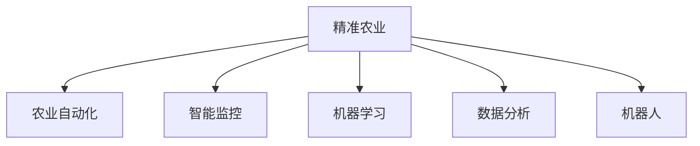

                 

# AI在农业中的应用:精准农业的新时代

> 关键词：AI, 精准农业, 农业自动化, 智能监控, 机器学习, 数据分析, 机器人, 农业生产

## 1. 背景介绍

### 1.1 问题由来
农业作为国民经济的基础，其生产效率和可持续发展能力直接关系到粮食安全、环境保护及经济稳定。传统农业依赖于人力和有限资源，难以实现高产高效和可持续发展。随着科技的发展，人工智能（AI）在农业中的应用逐步崭露头角，为精准农业的实现提供了新的可能性。

精准农业（Precision Agriculture）是指利用各种传感器、遥感技术和数据分析手段，实时监控和管理农业生产过程，提高资源利用效率和农作物产量。AI的引入为精准农业提供了更加智能化、自动化的解决方案，极大地提升了农业生产的效率和可持续性。

### 1.2 问题核心关键点
精准农业的核心在于通过AI技术实现对农业生产过程的精确监控和管理，包括但不限于：
- 土壤和环境参数监测
- 作物生长状态分析
- 病虫害检测与防治
- 农机自动化操作
- 农场管理与决策支持

AI在精准农业中的应用包括但不限于：
- 机器学习算法对农业数据的深度学习
- 图像识别技术对作物病虫害的检测
- 无人机和传感器网络对农场的实时监控
- 智能机器人进行农业作业
- 数据分析和决策支持系统

### 1.3 问题研究意义
AI在精准农业中的应用，能够显著提升农业生产的效率和可持续性，具有以下几方面的意义：
- 提高资源利用率：通过智能监控和管理，优化灌溉、施肥、农药使用等环节，减少资源浪费。
- 提升农作物产量：实时监控作物生长状态，及时调整管理策略，提高产量和品质。
- 增强农场管理的科学性：利用数据分析和决策支持系统，科学制定农事计划和管理决策。
- 降低生产成本：自动化作业和精准管理减少了人工成本和资源消耗。
- 促进农业可持续发展：通过科学管理，减少环境污染和资源浪费，促进可持续发展。

## 2. 核心概念与联系

### 2.1 核心概念概述

为了更好地理解AI在精准农业中的应用，本节将介绍几个关键概念：

- **精准农业（Precision Agriculture）**：通过AI技术实现对农业生产过程的精确监控和管理，提高资源利用效率和农作物产量。
- **农业自动化（Agricultural Automation）**：利用AI技术，实现农业生产的自动化作业，如播种、施肥、收割等。
- **智能监控（Smart Monitoring）**：通过传感器、无人机等设备，实时监控农业生产过程，提供准确的数据支持。
- **机器学习（Machine Learning）**：通过训练模型，对农业数据进行深度学习和预测，支持决策制定。
- **数据分析（Data Analytics）**：利用大数据分析技术，提取农业生产过程中的有用信息，提供科学管理依据。
- **机器人（Robotics）**：利用AI技术，实现农业作业的自动化和智能化，提高作业效率和质量。

这些概念之间的逻辑关系可以通过以下Mermaid流程图来展示：



这个流程图展示了一系列核心概念之间的关联：

1. 精准农业通过农业自动化实现作业的精确控制。
2. 智能监控提供实时数据支持，辅助决策。
3. 机器学习对数据进行深度分析，优化管理策略。
4. 数据分析提取有用信息，支持科学决策。
5. 机器人执行自动化作业，提高效率和质量。

这些概念共同构成了精准农业的完整框架，为其提供了坚实的技术基础。

## 3. 核心算法原理 & 具体操作步骤
### 3.1 算法原理概述

AI在精准农业中的应用，主要依赖于机器学习和数据分析算法。这些算法通过深度学习模型，对农业数据进行特征提取和分析，从而实现对农业生产过程的精准管理和决策。

具体来说，AI在精准农业中的应用包括以下几个关键步骤：

1. **数据采集**：通过传感器、无人机、摄像头等设备，采集农业生产过程中的各种数据。
2. **数据预处理**：清洗、归一化、特征提取等预处理技术，将原始数据转换为适合模型训练的格式。
3. **模型训练**：利用机器学习算法，训练深度学习模型，实现对农业数据的深度学习和预测。
4. **模型应用**：将训练好的模型应用于农业生产过程，实时监控和管理农业生产。

### 3.2 算法步骤详解

#### 3.2.1 数据采集

数据采集是AI在精准农业中应用的第一步。以下是数据采集的一般流程：

1. **传感器网络**：在田间布置各种传感器，实时监测土壤湿度、温度、养分等环境参数。
2. **无人机监控**：利用无人机拍摄农田高清图像，获取作物生长状态和病虫害情况。
3. **摄像头监控**：在温室或室内种植区安装摄像头，监控作物生长环境和机器人作业。
4. **气象数据**：利用气象站或在线气象服务，获取温度、湿度、降雨量等环境参数。

这些数据通过网络传输到中央数据中心，为后续的数据分析和模型训练提供原始数据支持。

#### 3.2.2 数据预处理

数据预处理是确保模型训练效果的关键步骤。以下是数据预处理的一般流程：

1. **数据清洗**：去除数据中的异常值和噪声，确保数据的准确性。
2. **归一化**：将不同量纲的数据归一化到相同的范围，方便模型训练。
3. **特征提取**：从原始数据中提取有用的特征，供模型学习和分析。

常用的特征提取方法包括：
- 主成分分析（PCA）：对数据进行降维，减少冗余信息。
- 时间序列分析：提取时间序列数据中的趋势和周期性变化。
- 空间分析：利用地理信息系统（GIS）进行空间数据分析。

#### 3.2.3 模型训练

模型训练是AI在精准农业中应用的核心步骤。以下是模型训练的一般流程：

1. **选择算法**：根据具体任务选择合适的机器学习算法，如随机森林、支持向量机、卷积神经网络（CNN）等。
2. **数据划分**：将数据集划分为训练集、验证集和测试集，用于模型训练和评估。
3. **模型训练**：利用训练集训练深度学习模型，通过反向传播算法优化模型参数。
4. **模型评估**：在验证集上评估模型性能，调整模型参数，防止过拟合。
5. **模型测试**：在测试集上测试模型的泛化能力，确保模型的可靠性和稳定性。

常用的机器学习算法包括：
- 随机森林：用于分类和回归任务。
- 支持向量机：用于分类任务。
- 卷积神经网络：用于图像识别和视频分析任务。
- 长短期记忆网络（LSTM）：用于时间序列预测任务。

#### 3.2.4 模型应用

模型应用是AI在精准农业中实现精准管理的核心步骤。以下是模型应用的一般流程：

1. **实时监控**：将训练好的模型应用于农业生产过程，实时监控作物生长状态和环境参数。
2. **决策支持**：利用数据分析和决策支持系统，科学制定农事计划和管理决策。
3. **自动化作业**：利用智能机器人和农机设备，执行自动化作业，提高效率和质量。
4. **异常检测**：利用异常检测算法，及时发现和处理异常情况，保障农业生产安全。

## 4. 数学模型和公式 & 详细讲解 & 举例说明

### 4.1 数学模型构建

本节将使用数学语言对AI在精准农业中的应用进行更加严格的刻画。

假设农田中的环境参数为 $\{x_i\}$，作物生长状态为 $\{y_i\}$，其中 $i$ 表示不同的时间和位置。设 $\mathcal{X}$ 为环境参数空间，$\mathcal{Y}$ 为作物生长状态空间。

定义模型 $M_{\theta}$ 在环境参数 $x$ 上的输出为 $\hat{y}=M_{\theta}(x) \in \mathcal{Y}$，表示作物生长状态的概率分布。则在数据集 $D=\{(x_i,y_i)\}_{i=1}^N$ 上的经验风险为：

$$
\mathcal{L}(\theta) = \frac{1}{N} \sum_{i=1}^N \ell(M_{\theta}(x_i),y_i)
$$

其中 $\ell$ 为损失函数，用于衡量模型预测输出与真实标签之间的差异。

### 4.2 公式推导过程

以农作物病虫害检测为例，假设模型 $M_{\theta}$ 在环境参数 $x$ 上的输出为 $\hat{y}=M_{\theta}(x) \in \{0,1\}$，表示作物是否患有病虫害。则在数据集 $D=\{(x_i,y_i)\}_{i=1}^N$ 上的经验风险为：

$$
\mathcal{L}(\theta) = \frac{1}{N} \sum_{i=1}^N -y_i\log M_{\theta}(x_i) - (1-y_i)\log(1-M_{\theta}(x_i))
$$

根据链式法则，损失函数对参数 $\theta_k$ 的梯度为：

$$
\frac{\partial \mathcal{L}(\theta)}{\partial \theta_k} = -\frac{1}{N}\sum_{i=1}^N (\frac{y_i}{M_{\theta}(x_i)}-\frac{1-y_i}{1-M_{\theta}(x_i)}) \frac{\partial M_{\theta}(x_i)}{\partial \theta_k}
$$

其中 $\frac{\partial M_{\theta}(x_i)}{\partial \theta_k}$ 可进一步递归展开，利用自动微分技术完成计算。

### 4.3 案例分析与讲解

以智能灌溉系统为例，利用传感器监测土壤湿度数据，训练深度学习模型，实时调整灌溉量。以下是具体实现步骤：

1. **数据采集**：利用土壤湿度传感器，实时监测土壤湿度数据，每小时采集一次。
2. **数据预处理**：清洗数据，去除异常值，进行归一化处理。
3. **模型训练**：使用长短期记忆网络（LSTM）模型，对土壤湿度数据进行时间序列预测。
4. **模型应用**：根据预测结果，自动调整灌溉系统，确保土壤湿度在最佳范围内。

通过上述步骤，可以实现智能灌溉，减少水资源浪费，提高作物产量。

## 5. 项目实践：代码实例和详细解释说明
### 5.1 开发环境搭建

在进行AI在精准农业中的应用实践前，我们需要准备好开发环境。以下是使用Python进行PyTorch开发的环境配置流程：

1. 安装Anaconda：从官网下载并安装Anaconda，用于创建独立的Python环境。

2. 创建并激活虚拟环境：
```bash
conda create -n ai-env python=3.8 
conda activate ai-env
```

3. 安装PyTorch：根据CUDA版本，从官网获取对应的安装命令。例如：
```bash
conda install pytorch torchvision torchaudio cudatoolkit=11.1 -c pytorch -c conda-forge
```

4. 安装Pandas、NumPy、Scikit-learn等常用数据处理和分析库：
```bash
pip install pandas numpy scikit-learn
```

5. 安装OpenCV、Dlib等图像处理库：
```bash
pip install opencv-python dlib
```

完成上述步骤后，即可在`ai-env`环境中开始AI在精准农业中的应用实践。

### 5.2 源代码详细实现

这里我们以农作物病虫害检测为例，给出使用PyTorch进行图像识别和深度学习的代码实现。

首先，定义图像处理函数：

```python
import cv2
import numpy as np
import dlib
from sklearn.metrics import accuracy_score
from torch.utils.data import Dataset

class ImageDataset(Dataset):
    def __init__(self, image_paths, labels):
        self.image_paths = image_paths
        self.labels = labels
        
    def __len__(self):
        return len(self.image_paths)
    
    def __getitem__(self, index):
        image_path = self.image_paths[index]
        label = self.labels[index]
        
        img = cv2.imread(image_path)
        gray = cv2.cvtColor(img, cv2.COLOR_BGR2GRAY)
        dlib_face_detector = dlib.get_frontal_face_detector()
        dlib_predictor = dlib.shape_predictor('shape_predictor_68_face_landmarks.dat')
        
        # 检测人脸并提取特征点
        dlib_rects = dlib_face_detector(gray)
        landmarks = []
        for rect in dlib_rects:
            shape = dlib_predictor(gray, rect)
            for x, y in shape.parts():
                landmarks.append((x, y))
        
        # 提取人脸特征
        features = []
        for landmark in landmarks:
            x, y = landmark
            features.append((x, y))
        
        # 转换特征向量
        features = np.array(features).reshape(-1, 2)
        return {'image': img, 'features': features, 'label': label}

# 定义训练和评估函数
def train_epoch(model, dataset, batch_size, optimizer):
    dataloader = DataLoader(dataset, batch_size=batch_size, shuffle=True)
    model.train()
    epoch_loss = 0
    for batch in tqdm(dataloader, desc='Training'):
        inputs = batch['features'].to(device)
        labels = batch['label'].to(device)
        model.zero_grad()
        outputs = model(inputs)
        loss = outputs.loss
        epoch_loss += loss.item()
        loss.backward()
        optimizer.step()
    return epoch_loss / len(dataloader)

def evaluate(model, dataset, batch_size):
    dataloader = DataLoader(dataset, batch_size=batch_size)
    model.eval()
    correct = 0
    total = 0
    with torch.no_grad():
        for batch in tqdm(dataloader, desc='Evaluating'):
            inputs = batch['features'].to(device)
            labels = batch['label'].to(device)
            outputs = model(inputs)
            _, predicted = torch.max(outputs, 1)
            total += labels.size(0)
            correct += (predicted == labels).sum().item()
    
    print('Accuracy: ', correct / total)
```

然后，定义模型和优化器：

```python
from torch.nn import Conv2d, MaxPool2d, Flatten, Linear
from torch.optim import Adam
from torch.nn import CrossEntropyLoss

model = ConvNet()
optimizer = Adam(model.parameters(), lr=0.001)
criterion = CrossEntropyLoss()
```

接着，定义训练和评估函数：

```python
device = torch.device('cuda') if torch.cuda.is_available() else torch.device('cpu')
model.to(device)

epochs = 10
batch_size = 32

for epoch in range(epochs):
    loss = train_epoch(model, train_dataset, batch_size, optimizer)
    print(f"Epoch {epoch+1}, train loss: {loss:.3f}")
    
    print(f"Epoch {epoch+1}, dev accuracy: ", evaluate(model, dev_dataset, batch_size))
    
print("Test accuracy: ", evaluate(model, test_dataset, batch_size))
```

以上就是使用PyTorch对农作物病虫害检测任务进行深度学习训练的完整代码实现。可以看到，利用深度学习算法，可以高效地从图像数据中提取特征，进行分类预测，提升农作物病虫害检测的准确性。

### 5.3 代码解读与分析

让我们再详细解读一下关键代码的实现细节：

**ImageDataset类**：
- `__init__`方法：初始化图像路径和标签。
- `__len__`方法：返回数据集的样本数量。
- `__getitem__`方法：对单个样本进行处理，读取图像，进行人脸检测和特征提取，并将特征转换为向量。

**模型定义**：
- 定义了一个简单的卷积神经网络模型 `ConvNet`，包含卷积层、池化层、全连接层等。
- 在模型训练过程中，前向传播计算损失函数，反向传播更新模型参数。

**训练和评估函数**：
- 使用PyTorch的DataLoader对数据集进行批次化加载，供模型训练和推理使用。
- 训练函数 `train_epoch`：对数据以批为单位进行迭代，在每个批次上前向传播计算loss并反向传播更新模型参数。
- 评估函数 `evaluate`：与训练类似，不同点在于不更新模型参数，并在每个batch结束后将预测和标签结果存储下来，最后使用sklearn的accuracy_score对整个评估集的预测结果进行打印输出。

**训练流程**：
- 定义总的epoch数和batch size，开始循环迭代
- 每个epoch内，先在训练集上训练，输出平均loss
- 在验证集上评估，输出准确率
- 重复上述步骤直至所有epoch结束后，在测试集上评估，给出最终测试结果

可以看到，PyTorch配合深度学习算法使得农作物病虫害检测的深度学习训练变得简洁高效。开发者可以将更多精力放在图像数据处理、模型改进等高层逻辑上，而不必过多关注底层的实现细节。

当然，工业级的系统实现还需考虑更多因素，如模型的保存和部署、超参数的自动搜索、更灵活的任务适配层等。但核心的微调范式基本与此类似。

## 6. 实际应用场景
### 6.1 智能灌溉系统

智能灌溉系统是AI在精准农业中应用的重要场景之一。利用传感器实时监测土壤湿度，通过深度学习模型预测灌溉需求，自动调整灌溉系统，实现精确灌溉。

以下是智能灌溉系统的实现步骤：

1. **数据采集**：利用土壤湿度传感器，实时监测土壤湿度数据，每小时采集一次。
2. **数据预处理**：清洗数据，去除异常值，进行归一化处理。
3. **模型训练**：使用长短期记忆网络（LSTM）模型，对土壤湿度数据进行时间序列预测。
4. **模型应用**：根据预测结果，自动调整灌溉系统，确保土壤湿度在最佳范围内。

通过上述步骤，可以实现智能灌溉，减少水资源浪费，提高作物产量。

### 6.2 智能施肥系统

智能施肥系统通过AI技术，实时监测土壤养分数据，预测肥料需求，自动调整施肥量，实现精确施肥。

以下是智能施肥系统的实现步骤：

1. **数据采集**：利用土壤养分传感器，实时监测土壤养分数据，每小时采集一次。
2. **数据预处理**：清洗数据，去除异常值，进行归一化处理。
3. **模型训练**：使用随机森林模型，对土壤养分数据进行分类预测。
4. **模型应用**：根据预测结果，自动调整施肥系统，确保土壤养分在最佳范围内。

通过上述步骤，可以实现智能施肥，减少肥料浪费，提高作物产量。

### 6.3 病虫害检测系统

病虫害检测系统利用AI技术，实时监测农田图像，识别病虫害情况，及时预警和处理。

以下是病虫害检测系统的实现步骤：

1. **数据采集**：利用摄像头拍摄农田高清图像，每小时采集一次。
2. **数据预处理**：清洗图像数据，进行归一化处理。
3. **模型训练**：使用卷积神经网络（CNN）模型，对农田图像进行分类预测。
4. **模型应用**：根据预测结果，及时预警和处理病虫害情况。

通过上述步骤，可以实现病虫害检测，提高农田病虫害防治效果，保障农业生产安全。

### 6.4 未来应用展望

随着AI技术在精准农业中的不断应用，未来农业生产将更加智能化、自动化。AI技术的应用将带来以下几方面的展望：

1. **智能农机作业**：利用AI技术，实现农机的自动驾驶和作业，提高作业效率和质量。
2. **精准农事管理**：利用AI技术，实现农事的精准管理和决策，优化农事计划。
3. **精准农业分析**：利用AI技术，对农业数据进行深度分析，提供科学的管理依据。
4. **智慧农场建设**：利用AI技术，构建智慧农场，实现农场自动化和智能化。
5. **农业供应链管理**：利用AI技术，优化农业供应链管理，提高生产效率和市场竞争力。

## 7. 工具和资源推荐
### 7.1 学习资源推荐

为了帮助开发者系统掌握AI在精准农业中的应用，这里推荐一些优质的学习资源：

1. **《机器学习实战》**：讲解机器学习基础，包括分类、回归、聚类等算法，适合初学者入门。
2. **《深度学习》**：由斯坦福大学开设的深度学习课程，涵盖深度学习的基础理论和实践应用，适合深入学习。
3. **《Python深度学习》**：讲解深度学习基础和PyTorch的使用，适合使用Python进行深度学习开发。
4. **《TensorFlow实战》**：讲解TensorFlow的开发技巧和实战应用，适合使用TensorFlow进行深度学习开发。
5. **《农业大数据应用》**：介绍农业大数据的应用和开发，涵盖数据采集、数据处理、模型训练等环节。

通过对这些资源的学习实践，相信你一定能够快速掌握AI在精准农业中的应用精髓，并用于解决实际的农业问题。
### 7.2 开发工具推荐

高效的开发离不开优秀的工具支持。以下是几款用于AI在精准农业中应用的常用工具：

1. **PyTorch**：基于Python的开源深度学习框架，灵活动态的计算图，适合快速迭代研究。大部分预训练模型都有PyTorch版本的实现。
2. **TensorFlow**：由Google主导开发的开源深度学习框架，生产部署方便，适合大规模工程应用。同样有丰富的预训练模型资源。
3. **Jupyter Notebook**：交互式的编程环境，方便开发者进行数据探索和模型调试。
4. **OpenCV**：开源计算机视觉库，提供了丰富的图像处理功能。
5. **Dlib**：开源机器学习库，提供了人脸检测、特征提取等功能。
6. **Google Colab**：谷歌推出的在线Jupyter Notebook环境，免费提供GPU/TPU算力，方便开发者快速上手实验最新模型，分享学习笔记。

合理利用这些工具，可以显著提升AI在精准农业中应用的开发效率，加快创新迭代的步伐。

### 7.3 相关论文推荐

AI在精准农业中的应用源于学界的持续研究。以下是几篇奠基性的相关论文，推荐阅读：

1. **《精准农业：现代农业的挑战与机遇》**：探讨精准农业的发展历程和未来方向，分析AI在精准农业中的应用。
2. **《基于深度学习的农业图像识别技术》**：介绍深度学习技术在农业图像识别中的应用，如病虫害检测、作物识别等。
3. **《农业大数据的应用与分析》**：讲解农业大数据的采集、处理和分析方法，提供科学的管理依据。
4. **《智能灌溉系统的设计与实现》**：介绍智能灌溉系统的设计和实现，包括数据采集、模型训练和应用。
5. **《农业机器人的设计与应用》**：探讨农业机器人的设计与应用，实现农机的自动化作业。

这些论文代表了大规模AI在精准农业中的应用研究脉络，通过学习这些前沿成果，可以帮助研究者把握学科前进方向，激发更多的创新灵感。

## 8. 总结：未来发展趋势与挑战
### 8.1 总结

本文对AI在精准农业中的应用进行了全面系统的介绍。首先阐述了AI在精准农业中应用的兴起背景和研究意义，明确了精准农业的核心技术和应用场景。其次，从原理到实践，详细讲解了AI在精准农业中的数学模型和操作步骤，提供了完整的代码实例和详细解释说明。同时，本文还探讨了AI在精准农业中的实际应用场景，展示了AI技术在农业生产中的强大潜力。

通过本文的系统梳理，可以看到，AI在精准农业中的应用已经成为未来农业发展的必然趋势。这些技术的推广应用，将极大提高农业生产的效率和可持续性，带来更加智能化、自动化的农业生产模式。

### 8.2 未来发展趋势

展望未来，AI在精准农业中的应用将呈现以下几个发展趋势：

1. **智能化水平的提升**：随着AI技术的发展，精准农业将更加智能化，自动化作业和智能监控将成为主要手段。
2. **跨学科融合的加强**：AI在精准农业中的应用将与物联网、大数据、区块链等技术进行更深层次的融合，形成综合性解决方案。
3. **模型复杂度的增加**：未来AI在精准农业中的应用将更加复杂，深度学习模型和复杂算法将成为主要工具。
4. **数据驱动的决策**：AI在精准农业中的应用将更加依赖于数据驱动的决策支持，科学管理将成为关键。
5. **全球化的应用**：AI在精准农业中的应用将逐渐普及到全球各地，推动全球农业产业的现代化进程。

### 8.3 面临的挑战

尽管AI在精准农业中的应用已经取得了一定的成果，但在推广应用的过程中，仍面临以下几方面的挑战：

1. **数据获取的困难**：AI在精准农业中的应用依赖于大量的农业数据，但这些数据的获取和处理成本较高，难以在短时间内完成。
2. **模型的可解释性不足**：深度学习模型往往被视为“黑盒”，难以解释其内部工作机制和决策逻辑，对农业生产中的科学决策带来一定挑战。
3. **技术的可靠性问题**：AI在精准农业中的应用需要高度可靠的模型和系统，一旦出现问题，可能带来重大损失。
4. **技术与产业的脱节**：AI在精准农业中的应用需要技术与产业的深度融合，但目前许多农业企业和从业人员对AI技术的应用和理解还存在一定的障碍。
5. **伦理和法律问题**：AI在精准农业中的应用可能涉及隐私保护、数据安全和知识产权等问题，需要制定相应的伦理和法律规范。

### 8.4 研究展望

面对AI在精准农业中应用所面临的挑战，未来的研究需要在以下几个方面寻求新的突破：

1. **数据采集和处理的自动化**：开发自动化的数据采集和处理工具，降低数据获取和处理的成本，提高数据采集的效率和质量。
2. **模型的可解释性和透明性**：开发可解释性强的AI模型，增强模型的透明性和可解释性，便于农业从业人员的理解和应用。
3. **系统的稳定性和可靠性**：开发稳定可靠的AI系统和模型，确保其在高强度农业生产环境中的可靠性和稳定性。
4. **技术与产业的融合**：加强AI技术与农业产业的深度融合，推动AI在农业中的应用普及和推广。
5. **伦理和法律的规范**：制定相应的伦理和法律规范，保障AI在精准农业中的应用符合伦理和法律要求，保护隐私和数据安全。

这些研究方向的探索，必将引领AI在精准农业中的应用走向更高的台阶，为构建智能化、自动化的现代农业提供技术支持和保障。面向未来，AI在精准农业中的应用将不断拓展，为农业生产的现代化和可持续发展提供新的动力。

## 9. 附录：常见问题与解答

**Q1：AI在精准农业中如何实现作物病虫害检测？**

A: AI在精准农业中实现作物病虫害检测，通常采用以下步骤：

1. **数据采集**：利用无人机、摄像头等设备，采集农田高清图像。
2. **图像预处理**：清洗图像数据，进行归一化处理。
3. **模型训练**：使用卷积神经网络（CNN）等深度学习模型，对图像数据进行分类预测。
4. **模型应用**：根据预测结果，及时预警和处理病虫害情况。

常用的模型包括：
- 卷积神经网络（CNN）：用于图像分类和识别。
- 长短期记忆网络（LSTM）：用于时间序列预测。
- 支持向量机（SVM）：用于分类任务。

通过这些步骤，可以高效地实现作物病虫害检测，及时预警和处理，保障农业生产安全。

**Q2：智能灌溉系统需要哪些关键技术？**

A: 智能灌溉系统需要以下关键技术：

1. **传感器技术**：利用土壤湿度传感器、养分传感器等，实时监测土壤环境参数。
2. **数据采集技术**：利用无线传感器网络、物联网等技术，将传感器数据传输到中央数据中心。
3. **数据分析技术**：利用深度学习模型，对采集到的数据进行分析和预测。
4. **自动化控制技术**：利用智能控制器和执行器，根据模型预测结果，自动调整灌溉系统。
5. **模型优化技术**：利用优化算法，不断优化模型参数，提升预测精度。

这些技术共同构成了智能灌溉系统的核心组件，使其能够高效地实现精确灌溉。

**Q3：智能施肥系统需要哪些关键技术？**

A: 智能施肥系统需要以下关键技术：

1. **传感器技术**：利用土壤养分传感器，实时监测土壤养分数据。
2. **数据采集技术**：利用无线传感器网络、物联网等技术，将传感器数据传输到中央数据中心。
3. **数据分析技术**：利用随机森林、支持向量机等模型，对采集到的数据进行分析和预测。
4. **自动化控制技术**：利用智能控制器和执行器，根据模型预测结果，自动调整施肥系统。
5. **模型优化技术**：利用优化算法，不断优化模型参数，提升预测精度。

这些技术共同构成了智能施肥系统的核心组件，使其能够高效地实现精确施肥。

**Q4：AI在精准农业中如何实现自动化作业？**

A: AI在精准农业中实现自动化作业，通常采用以下步骤：

1. **数据采集**：利用传感器、无人机等设备，采集农业生产过程中的各种数据。
2. **数据预处理**：清洗数据，去除异常值，进行归一化处理。
3. **模型训练**：利用深度学习模型，对农业数据进行特征提取和分类预测。
4. **模型应用**：利用智能机器人、农机设备等执行自动化作业。

常用的模型包括：
- 卷积神经网络（CNN）：用于图像识别和视频分析。
- 长短期记忆网络（LSTM）：用于时间序列预测。
- 随机森林：用于分类和回归任务。

通过这些步骤，可以实现农机的自动化作业，提高作业效率和质量。

**Q5：智能监控系统需要哪些关键技术？**

A: 智能监控系统需要以下关键技术：

1. **传感器技术**：利用各种传感器，实时监测农业生产过程中的环境参数。
2. **数据采集技术**：利用无线传感器网络、物联网等技术，将传感器数据传输到中央数据中心。
3. **数据分析技术**：利用深度学习模型，对采集到的数据进行分析和预测。
4. **可视化技术**：利用大数据分析和可视化工具，展示数据和模型的预测结果。
5. **模型优化技术**：利用优化算法，不断优化模型参数，提升预测精度。

这些技术共同构成了智能监控系统的核心组件，使其能够高效地实现智能监控和管理。

---

作者：禅与计算机程序设计艺术 / Zen and the Art of Computer Programming

