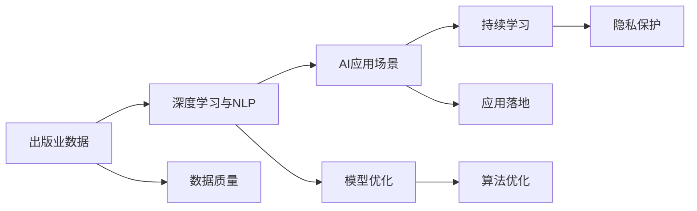

                 

## 1. 背景介绍

### 1.1 问题由来

出版业在面临数字化转型的过程中，面对复杂多变的需求与不断进化的内容消费模式。人工智能技术在这一转型中扮演了重要角色，尤其是基于深度学习和自然语言处理（NLP）技术的AI应用，为出版业带来了革新性的变化。然而，出版业与AI之间的融合并非一帆风顺，存在数据、算法和应用上的壁垒，这些壁垒限制了AI在出版业中发挥更大作用。

### 1.2 问题核心关键点

1. **数据获取与质量**：出版业需要处理大量文本数据，包括书籍内容、文章、新闻、广告等，这些数据的质量直接影响到AI模型的训练效果。高质量的数据获取和标注是AI应用的基础。
2. **算法优化**：目前，许多出版业AI应用基于现有深度学习模型和NLP技术，但这些模型和算法在大规模出版物数据上的效果仍有提升空间。
3. **应用落地**：从算法到实际应用，出版业需要考虑如何整合AI技术，并将其嵌入现有的业务流程中，同时也需要解决成本、效率和安全性等问题。
4. **持续学习与优化**：出版业的内容不断更新，需要AI模型具备持续学习的能力，以适应新内容的生成和旧内容的再利用。
5. **用户隐私保护**：出版业涉及大量用户数据，如何确保用户隐私保护是一个重要议题。

### 1.3 问题研究意义

通过深入探讨出版业与AI之间的数据、算法与应用壁垒，本研究旨在：

1. **优化数据获取与处理流程**：提供高质量数据获取和处理的策略，降低出版业使用AI技术的数据成本。
2. **提升算法优化能力**：探讨如何改进现有深度学习模型和算法，以更好地适应出版业的具体需求。
3. **促进AI应用落地**：提供出版业AI应用落地的策略，确保AI技术的实际应用效果。
4. **强调持续学习与优化**：讨论出版业如何使AI模型具备持续学习的能力，以适应不断变化的内容需求。
5. **保障用户隐私安全**：探讨如何在保障用户隐私的前提下，安全有效地使用AI技术。

## 2. 核心概念与联系

### 2.1 核心概念概述

本节将介绍几个关键概念，并说明它们之间的联系：

1. **出版业数据**：包括书籍内容、文章、新闻、广告等文本数据，是AI应用的输入基础。
2. **深度学习与NLP**：深度学习模型（如RNN、LSTM、Transformer）和NLP技术（如语言模型、文本分类、实体识别）构成了AI在出版业应用的技术基础。
3. **AI应用场景**：从自动化内容生成、智能推荐、版权管理到读者分析，AI在出版业中有着广泛的应用场景。
4. **持续学习**：指AI模型在不断更新的数据上持续学习，以适应内容的变化和用户的喜好。
5. **隐私保护**：确保AI应用在处理大量出版物数据时，保护用户隐私。

这些核心概念共同构成了AI在出版业应用的框架，每个概念的优化都对AI的实际应用效果有重要影响。

### 2.2 核心概念原理和架构的 Mermaid 流程图



### 2.3 核心概念的联系

1. **数据与模型**：高质量的数据是深度学习模型训练的基础，模型性能依赖于数据的质量和数量。
2. **算法与应用**：不同的AI应用场景需要不同的算法优化策略，以提升模型在特定任务上的表现。
3. **学习与隐私**：持续学习使得模型能够适应内容的变化，同时需要在隐私保护和数据使用之间找到平衡。
4. **数据与隐私**：数据获取和处理的过程中需要遵守隐私保护政策，确保用户隐私不被侵犯。

## 3. 核心算法原理 & 具体操作步骤

### 3.1 算法原理概述

基于深度学习的大规模出版物数据处理和NLP技术在出版业中的应用，核心算法原理包括以下几个方面：

1. **预训练与微调**：通过在大规模无标签数据上预训练深度学习模型，然后在特定出版物数据上微调，以适应出版业的特定需求。
2. **序列模型与编码器-解码器架构**：使用序列模型（如RNN、LSTM）和编码器-解码器架构（如Transformer）进行文本处理。
3. **注意力机制**：在序列模型中引入注意力机制，提高模型对重要信息的关注度。
4. **生成对抗网络（GANs）**：用于生成新的出版物内容，如创作小说、生成广告文案等。

### 3.2 算法步骤详解

1. **数据准备**：收集出版物数据，进行清洗和预处理，确保数据质量和一致性。
2. **模型预训练**：使用大规模出版物数据对深度学习模型进行预训练，学习通用的语言和出版物特征。
3. **任务适配**：根据具体的出版业应用需求，设计任务适配层，将预训练模型转换为适合特定任务的模型。
4. **微调训练**：在标注的出版物数据集上，使用监督学习算法进行微调，优化模型在特定任务上的表现。
5. **模型评估与优化**：在验证集上评估模型性能，调整超参数和训练策略，进一步优化模型。

### 3.3 算法优缺点

#### 优点

1. **自动化内容生成**：深度学习模型能够自动生成高质量的出版物内容，减少人工编写的工作量。
2. **智能推荐**：通过分析用户行为和偏好，推荐合适的出版物，提高用户体验。
3. **版权管理**：利用图像和文本识别技术，自动识别和保护版权。
4. **读者分析**：通过NLP技术分析读者的反馈和评论，了解读者需求，优化内容策略。

#### 缺点

1. **数据依赖**：模型的训练和性能依赖于高质量的数据，数据获取和标注成本高。
2. **模型复杂度**：大规模出版物数据和复杂模型结构增加了计算和存储的需求。
3. **性能优化**：模型优化需要不断调整超参数，寻找最优的模型配置。
4. **隐私风险**：处理大量用户数据时，隐私保护问题不容忽视。

### 3.4 算法应用领域

1. **出版物内容生成**：用于创作小说、生成文章摘要、创作广告文案等。
2. **智能推荐系统**：根据用户历史阅读记录和行为，推荐出版物。
3. **版权检测**：自动识别和检测出版物中的版权信息，保护原创内容。
4. **读者情感分析**：通过分析读者评论和反馈，了解出版物受众情感倾向。

## 4. 数学模型和公式 & 详细讲解 & 举例说明

### 4.1 数学模型构建

基于深度学习的出版物处理模型，其数学模型构建主要包括：

1. **输入层**：将出版物数据转换为模型可以处理的向量形式，例如使用词嵌入（Word Embedding）将文本转换为向量。
2. **隐藏层**：包含多个神经网络层，通过非线性变换处理输入，提取出版物特征。
3. **输出层**：根据具体任务设计不同的输出层，如分类输出、生成输出等。

### 4.2 公式推导过程

以生成式对抗网络（GANs）为例，其数学模型和推导过程如下：

1. **生成器**：将噪声向量 $z$ 映射为生成出版物内容的向量 $G(z)$，生成器网络结构如下：

$$
G(z) = W_2 \cdot tanh(W_1 \cdot z + b_1) + b_2
$$

2. **判别器**：判断输入的出版物内容向量是真实的出版物内容还是生成内容，判别器网络结构如下：

$$
D(x) = \sigma(W_3 \cdot x + b_3)
$$

3. **损失函数**：最大化生成器损失函数 $L_G$ 和最小化判别器损失函数 $L_D$ 的对抗训练过程如下：

$$
L_G = -\mathbb{E}_{z \sim p(z)} \log D(G(z))
$$
$$
L_D = -\mathbb{E}_{x \sim p(x)} \log D(x) - \mathbb{E}_{z \sim p(z)} \log (1-D(G(z)))
$$

其中，$W_1, W_2, W_3$ 和 $b_1, b_2, b_3$ 为模型参数，$p(z)$ 和 $p(x)$ 分别为噪声和真实出版物内容的概率分布。

### 4.3 案例分析与讲解

以智能推荐系统为例，使用基于深度学习的协同过滤算法：

1. **输入准备**：将用户的历史阅读记录和出版物的基本信息转换为向量形式。
2. **模型训练**：通过协同过滤模型学习用户和出版物之间的隐含关系。
3. **推荐生成**：根据用户的历史偏好和出版物的特征向量，生成推荐的出版物列表。

## 5. 项目实践：代码实例和详细解释说明

### 5.1 开发环境搭建

1. **Python环境配置**：安装Python 3.x，使用Anaconda或Miniconda进行环境管理。
2. **深度学习框架安装**：安装TensorFlow、PyTorch、Keras等深度学习框架。
3. **数据预处理工具**：安装NLTK、SpaCy等文本处理工具。
4. **分布式训练**：配置多GPU或多节点环境，如使用Horovod进行分布式训练。

### 5.2 源代码详细实现

以下是一个简单的智能推荐系统代码示例：

```python
import tensorflow as tf
from tensorflow.keras.layers import Input, Dense, Embedding, Concatenate, dot, Dropout
from tensorflow.keras.models import Model

# 定义模型架构
user_input = Input(shape=(max_seq_length,))
item_input = Input(shape=(max_seq_length,))
user_embedding = Embedding(vocab_size, embedding_dim)(user_input)
item_embedding = Embedding(vocab_size, embedding_dim)(item_input)
concat = Concatenate()([user_embedding, item_embedding])
dot_product = dot(concat, axes=2)
concatenate = Concatenate()([dot_product, user_input, item_input])
dropout = Dropout(0.2)(concatenate)
output = Dense(1, activation='sigmoid')(dropout)

# 定义模型输出
recommendation = Model(inputs=[user_input, item_input], outputs=output)

# 编译模型
recommendation.compile(optimizer='adam', loss='binary_crossentropy', metrics=['accuracy'])

# 训练模型
recommendation.fit([user_data, item_data], y_data, epochs=10, batch_size=64)
```

### 5.3 代码解读与分析

- **输入层**：将用户和出版物的ID转换为嵌入向量。
- **嵌入层**：使用Embedding层将ID序列转换为向量。
- **dot层**：计算用户和出版物的向量点积，得到隐含关系的表示。
- **dropout层**：防止过拟合，随机丢弃一部分神经元。
- **输出层**：使用Sigmoid激活函数输出推荐概率。

### 5.4 运行结果展示

训练完成后，使用测试集评估模型性能：

```python
test_loss, test_accuracy = recommendation.evaluate([user_data_test, item_data_test], y_data_test)
print(f"Test loss: {test_loss}, Test accuracy: {test_accuracy}")
```

## 6. 实际应用场景

### 6.1 出版物内容生成

深度学习模型可以自动生成高质量的出版物内容，如小说、文章摘要、广告文案等。这不仅能节省作者大量时间，还能在创意表达和风格上提供更多可能性。

### 6.2 智能推荐系统

通过分析用户的历史阅读记录和行为，智能推荐系统可以推荐用户可能感兴趣的出版物，提升用户体验和满意度。

### 6.3 版权管理

利用图像和文本识别技术，自动识别和检测出版物中的版权信息，保护原创内容。

### 6.4 读者情感分析

通过分析读者评论和反馈，了解出版物受众情感倾向，优化内容策略。

### 6.5 未来应用展望

未来的出版业将更多地融入AI技术，提升内容生产效率、个性化推荐精度和版权保护力度。AI技术的应用将使出版业变得更加智能化、高效化和个性化。

## 7. 工具和资源推荐

### 7.1 学习资源推荐

1. **Coursera**：提供深度学习、NLP相关的课程，如斯坦福大学《深度学习专项课程》。
2. **Kaggle**：参与数据科学竞赛，学习和实践深度学习模型和NLP技术。
3. **Udacity**：提供专业技能课程，如深度学习、计算机视觉等。
4. **NIPS和ICML**：国际顶尖会议，了解最新研究成果和趋势。

### 7.2 开发工具推荐

1. **Jupyter Notebook**：交互式数据科学和机器学习平台，支持Python代码和数学公式的编写和展示。
2. **TensorBoard**：可视化工具，用于监控和调试深度学习模型训练过程。
3. **Horovod**：分布式深度学习框架，支持多GPU和多节点环境下的训练。
4. **NLTK**：Python自然语言处理工具包，支持文本预处理和分析。
5. **SpaCy**：高效的自然语言处理库，提供词性标注、命名实体识别等功能。

### 7.3 相关论文推荐

1. **Attention Is All You Need**：提出Transformer架构，革命性地改变了NLP处理方式。
2. **BERT: Pre-training of Deep Bidirectional Transformers for Language Understanding**：提出BERT模型，在大规模无标签数据上预训练语言模型。
3. **GPT-3: Language Models are Unsupervised Multitask Learners**：展示GPT-3在多种NLP任务上的零样本学习能力。

## 8. 总结：未来发展趋势与挑战

### 8.1 研究成果总结

基于深度学习和NLP技术的AI在出版业中的应用，取得了显著进展，但在数据、算法和应用上仍存在诸多壁垒。优化数据获取与处理流程、提升算法优化能力、促进AI应用落地、强调持续学习与优化、保障用户隐私安全等是未来研究的重要方向。

### 8.2 未来发展趋势

1. **数据获取与处理**：采用无监督和半监督学习技术，减少标注数据需求。
2. **算法优化**：开发更加参数高效和计算高效的微调方法，提升模型性能。
3. **持续学习**：增强模型在不断更新的数据上持续学习的能力。
4. **用户隐私保护**：在隐私保护和数据使用之间找到平衡。
5. **多模态融合**：结合视觉、语音等多模态信息，提高模型性能。

### 8.3 面临的挑战

1. **数据质量与标注成本**：高质量数据获取和标注成本高昂。
2. **模型性能与资源消耗**：大规模出版物数据和复杂模型结构增加了计算和存储需求。
3. **隐私保护与安全**：处理大量用户数据时，隐私保护问题不容忽视。

### 8.4 研究展望

未来的研究需要在以下几个方面寻求新的突破：

1. **无监督学习与半监督学习**：减少对标注数据的依赖，利用自监督学习、主动学习等技术优化数据获取与处理流程。
2. **参数高效与计算高效**：开发更加参数高效和计算高效的微调方法，提升模型性能和资源利用效率。
3. **多模态融合**：结合视觉、语音等多模态信息，提高模型性能和应用灵活性。
4. **隐私保护与安全**：在保障用户隐私的前提下，安全有效地使用AI技术。

## 9. 附录：常见问题与解答

**Q1：出版业如何获取高质量的出版物数据？**

A: 出版业可以通过合作出版社、图书馆、在线书店等方式获取高质量的出版物数据。此外，也可以使用公共数据集和开源数据进行训练。

**Q2：出版业AI应用中存在哪些隐私风险？**

A: 出版业AI应用中存在的隐私风险包括用户隐私泄露、数据滥用等问题。应采取数据匿名化、加密等措施，保护用户隐私。

**Q3：如何选择适合的深度学习模型和算法？**

A: 根据具体的出版业应用需求，选择适合的深度学习模型和算法。可以考虑模型的复杂度、训练时间、资源消耗等因素，进行综合评估。

**Q4：如何在出版业中应用持续学习技术？**

A: 定期更新模型训练数据，使用在线学习算法，如在线梯度下降（OGD），使模型能够持续学习新知识，适应不断变化的内容需求。

**Q5：如何评估AI在出版业中的性能？**

A: 通过精度、召回率、F1分数等指标评估AI模型在出版业中的性能。同时，考虑模型的计算效率、内存占用和运行时间等实际应用因素。

---

作者：禅与计算机程序设计艺术 / Zen and the Art of Computer Programming

