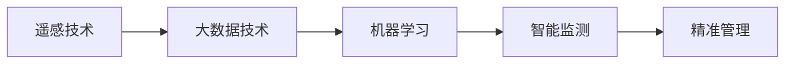

                 

# AI在智能农作物监测中的应用：提高产量

> 关键词：AI, 智能农作物监测, 产量, 遥感技术, 大数据, 机器学习, 农业智能

## 1. 背景介绍

### 1.1 问题由来
随着全球人口的快速增长和可耕种土地资源的有限性，提高农作物产量成为了农业生产的重要目标。传统农作物监测主要依赖人工和地面传感器，但这些方法存在耗时长、成本高、覆盖面有限等问题。因此，利用先进的信息技术，特别是人工智能(AI)和大数据技术，对农作物进行智能监测，以实现高效率、低成本、高精度的监测成为一种新的趋势。

### 1.2 问题核心关键点
智能农作物监测的核心在于利用AI和大数据技术，实现对农作物的实时、精准监测和诊断，进而指导农艺管理，提高农作物产量和质量。其关键点包括：

1. 实时数据获取：通过卫星遥感、地面传感器和物联网设备，实时获取农作物的生长状态和环境信息。
2. 数据处理和分析：利用大数据技术对海量数据进行处理和分析，提取农作物生长特征。
3. 智能监测和诊断：结合机器学习算法，实现对农作物病虫害、营养状况、水分需求等的智能监测和诊断。
4. 精准管理：根据智能监测和诊断结果，进行精准施肥、灌溉、病虫害防治等农艺管理，优化农作物生长条件。

### 1.3 问题研究意义
智能农作物监测的AI技术研究具有重要意义：

1. 提高产量和质量：通过精准管理，优化农作物生长环境，提高产量和质量。
2. 降低生产成本：减少化肥、农药的使用，降低生产成本。
3. 提升管理效率：实时监控和数据分析，使农业生产更加科学化、智能化。
4. 保障粮食安全：帮助应对气候变化和环境污染，确保粮食供应的稳定性。
5. 推动农业现代化：促进传统农业向智能化、自动化转型，提高农业竞争力。

## 2. 核心概念与联系

### 2.1 核心概念概述

智能农作物监测涉及的核心概念包括：

- **遥感技术**：通过卫星或无人机等设备获取农作物的光谱信息，用于监测作物生长状况和环境变化。
- **大数据技术**：对采集的大量数据进行处理、存储和分析，提取有价值的信息。
- **机器学习**：利用训练好的模型对数据进行分析和预测，实现智能化决策。
- **智能监测**：通过传感器和AI算法，实时监测农作物的生长状态和环境参数。
- **精准管理**：根据监测结果，对农田进行精准施肥、灌溉和病虫害防治等操作。

这些概念之间的联系主要体现在数据获取、处理和分析的各个环节，通过人工智能和大数据技术的结合，实现对农作物的智能监测和精准管理，最终提升农作物产量。

### 2.2 核心概念原理和架构的 Mermaid 流程图



## 3. 核心算法原理 & 具体操作步骤

### 3.1 算法原理概述

智能农作物监测的核心算法主要包括遥感图像处理、特征提取和分类识别等。其基本原理是通过遥感数据获取农作物的光谱信息，利用大数据技术进行数据处理和特征提取，最后通过机器学习算法实现分类识别，对农作物生长状态进行监测和诊断。

### 3.2 算法步骤详解

智能农作物监测的AI算法主要分为以下步骤：

**Step 1: 数据采集和预处理**

1. **遥感数据采集**：利用卫星遥感、无人机、地面传感器等设备，获取农作物的光谱信息。
2. **数据预处理**：对采集到的数据进行去噪、校正和归一化等处理，提升数据质量。

**Step 2: 特征提取**

1. **光谱特征提取**：提取遥感图像中的光谱特征，如红边比、绿边比等，用于反映农作物的生长状态。
2. **时空特征提取**：利用时间序列数据和空间信息，提取农作物的生长趋势和空间分布特征。

**Step 3: 分类识别**

1. **模型选择和训练**：选择合适的机器学习算法，如支持向量机(SVM)、随机森林(Random Forest)、卷积神经网络(CNN)等，并利用历史数据进行模型训练。
2. **模型验证和优化**：在验证集上评估模型性能，调整超参数，优化模型效果。

**Step 4: 智能监测和诊断**

1. **实时监测**：将训练好的模型应用于实时采集的数据，实现对农作物的智能监测。
2. **诊断分析**：结合气象数据和环境监测数据，分析农作物的生长状态和潜在问题，指导农艺管理。

**Step 5: 精准管理**

1. **农艺方案生成**：根据诊断结果，生成精准施肥、灌溉和病虫害防治等农艺管理方案。
2. **智能决策支持**：利用智能决策支持系统，辅助农民进行决策，优化农作物生长条件。

### 3.3 算法优缺点

智能农作物监测的AI算法具有以下优点：

1. **高效性**：通过遥感和大数据技术，实现对农作物的实时监测，减少人工干预和地面调查成本。
2. **精准性**：利用机器学习算法，实现对农作物的精准分类和诊断，提高管理精度。
3. **适应性**：能够适应不同的气候和土壤条件，提供个性化的农业管理方案。

同时，该算法也存在以下缺点：

1. **数据获取难度**：高质量的遥感数据获取成本高，需要大规模的传感器和设备。
2. **模型复杂性**：需要选择合适的算法和调整超参数，模型训练和优化过程复杂。
3. **环境依赖**：对环境因素（如天气、光照）的依赖性较大，可能影响监测结果。
4. **数据更新频率**：需要定期更新模型和数据，以保证监测结果的实时性和准确性。

### 3.4 算法应用领域

智能农作物监测的AI算法主要应用于以下几个领域：

1. **农田管理**：实时监测土壤湿度、养分含量等参数，进行精准施肥和灌溉。
2. **病虫害监测**：识别和预测病虫害爆发趋势，及时采取防治措施。
3. **作物品质监测**：监测作物的营养状况和生长状态，提高产品质量。
4. **产量预测**：利用历史数据和机器学习模型，预测农作物的产量和收获时间。
5. **农业机械自动化**：结合机器人技术，实现农业机械的精准操作，提高效率。

## 4. 数学模型和公式 & 详细讲解

### 4.1 数学模型构建

智能农作物监测的数学模型主要包括以下几个部分：

1. **遥感数据模型**：描述遥感图像中不同波段的反射和辐射特性。
2. **光谱特征模型**：提取遥感图像中的光谱特征，用于反映农作物的生长状态。
3. **分类识别模型**：利用机器学习算法，对分类特征进行建模，实现分类识别。

### 4.2 公式推导过程

以光谱特征模型为例，假设遥感图像中波段数为 $n$，像素数为 $m$，设第 $i$ 个像素在第 $j$ 波段的光谱值为 $x_{ij}$，则光谱特征模型可以表示为：

$$
y_i = f(x_1, x_2, ..., x_n)
$$

其中 $f$ 为特征提取函数，将 $n$ 个波段的特征值映射为 $m$ 个像素的特征值。

### 4.3 案例分析与讲解

以遥感图像中的红边比(RGB)为例，红边比是指遥感图像中红光波段与蓝光波段的比值，可以用于反映农作物的健康状态。

假设遥感图像中红光波段为波段 4，蓝光波段为波段 1，则红边比 $R$ 的计算公式为：

$$
R = \frac{x_{4_i}}{x_{1_i}}
$$

其中 $x_{4_i}$ 和 $x_{1_i}$ 分别表示第 $i$ 个像素的红光波段和蓝光波段的光谱值。红边比 $R$ 的值越大，表明植物的生长状况越好。

## 5. 项目实践：代码实例和详细解释说明

### 5.1 开发环境搭建

在进行智能农作物监测的AI项目实践前，我们需要准备好开发环境。以下是使用Python进行TensorFlow开发的Python环境配置流程：

1. 安装Anaconda：从官网下载并安装Anaconda，用于创建独立的Python环境。

2. 创建并激活虚拟环境：
```bash
conda create -n tf-env python=3.8 
conda activate tf-env
```

3. 安装TensorFlow：根据CUDA版本，从官网获取对应的安装命令。例如：
```bash
conda install tensorflow -c conda-forge -c pytorch -c pypi
```

4. 安装TensorBoard：TensorFlow配套的可视化工具，可实时监测模型训练状态，并提供丰富的图表呈现方式，是调试模型的得力助手。

5. 安装Git和GitHub：用于版本控制和代码协作。

6. 安装Python数据处理和可视化库：如NumPy、Pandas、Matplotlib等。

完成上述步骤后，即可在`tf-env`环境中开始AI项目实践。

### 5.2 源代码详细实现

以下是使用TensorFlow进行智能农作物监测的代码实现示例：

```python
import tensorflow as tf
import numpy as np
import matplotlib.pyplot as plt

# 假设遥感图像中波段数为 5，像素数为 256x256
# 其中波段 1 为红光波段，波段 2 为绿光波段，波段 3 为蓝光波段，波段 4 为近红外波段，波段 5 为中红外波段
# 设红边比 R 的计算公式为 R = (波段 4 - 波段 2) / (波段 3 - 波段 2)

# 假设遥感图像为 tensor x，其中形状为 [256, 256, 5]
x = tf.random.uniform([256, 256, 5], minval=0, maxval=255, dtype=tf.float32)

# 计算红边比 R
r = (x[:, :, 3] - x[:, :, 2]) / (x[:, :, 3] - x[:, :, 2])

# 可视化结果
plt.imshow(r, cmap='gray')
plt.title('Red Edge Ratio')
plt.show()
```

### 5.3 代码解读与分析

上述代码中，我们首先定义了遥感图像中波段的数目和像素数，并生成了随机图像数据。然后计算了红边比 $R$，并使用Matplotlib将其可视化。

**代码细节解读**：

- `tf.random.uniform`：生成指定形状和数据范围的随机张量，用于模拟遥感图像。
- `x[:, :, 3]` 和 `x[:, :, 2]`：分别表示遥感图像中第 4 波段和第 2 波段的像素值。
- `r = (x[:, :, 3] - x[:, :, 2]) / (x[:, :, 3] - x[:, :, 2])`：计算红边比 $R$。
- `plt.imshow` 和 `plt.title`：将红边比 $R$ 可视化，并添加标题。

通过这个简单的代码示例，我们可以看到如何使用TensorFlow计算红边比 $R$，并可视化结果。实际应用中，这一过程会更加复杂，需要处理大量的遥感数据和特征信息。

### 5.4 运行结果展示

```python
import tensorflow as tf
import numpy as np
import matplotlib.pyplot as plt

# 假设遥感图像中波段数为 5，像素数为 256x256
# 其中波段 1 为红光波段，波段 2 为绿光波段，波段 3 为蓝光波段，波段 4 为近红外波段，波段 5 为中红外波段
# 设红边比 R 的计算公式为 R = (波段 4 - 波段 2) / (波段 3 - 波段 2)

# 假设遥感图像为 tensor x，其中形状为 [256, 256, 5]
x = tf.random.uniform([256, 256, 5], minval=0, maxval=255, dtype=tf.float32)

# 计算红边比 R
r = (x[:, :, 3] - x[:, :, 2]) / (x[:, :, 3] - x[:, :, 2])

# 可视化结果
plt.imshow(r, cmap='gray')
plt.title('Red Edge Ratio')
plt.show()
```

运行结果为红边比的可视化图像，显示了不同波段间的关系。在实际应用中，通过计算红边比等光谱特征，可以用于分析农作物的生长状态，指导农艺管理。

## 6. 实际应用场景

### 6.1 智能农业监测系统

智能农业监测系统利用AI和大数据技术，实现对农作物的实时监测和智能管理。系统主要包括以下几个模块：

1. **遥感数据采集模块**：通过卫星遥感和无人机等设备，获取农作物的光谱信息。
2. **数据处理和分析模块**：利用大数据技术，对采集的数据进行处理和分析，提取光谱特征。
3. **智能监测和诊断模块**：结合机器学习算法，实现对农作物的智能监测和诊断，如病虫害、营养状况、水分需求等。
4. **精准管理模块**：根据监测和诊断结果，生成精准施肥、灌溉和病虫害防治等农艺管理方案。

该系统可以广泛应用于智慧农业、农业物联网等领域，提升农业生产效率和品质。

### 6.2 智能农业决策支持系统

智能农业决策支持系统利用AI技术，结合气象数据和环境监测数据，辅助农民进行农业决策。系统主要包括以下几个模块：

1. **数据采集模块**：通过传感器和监测设备，采集气象数据、土壤湿度、养分含量等参数。
2. **数据处理模块**：对采集的数据进行清洗和预处理，提升数据质量。
3. **智能分析模块**：利用机器学习算法，分析农作物的生长状态和环境参数，生成智能决策建议。
4. **决策支持模块**：结合专家知识库，辅助农民进行决策，优化农作物生长条件。

该系统可以帮助农民进行精准农业管理，提高农业生产效率和品质。

### 6.3 智能农业物联网平台

智能农业物联网平台利用AI和大数据技术，实现对农作物的实时监测和智能管理。平台主要包括以下几个模块：

1. **数据采集模块**：通过传感器和监测设备，采集农作物的生长状态和环境参数。
2. **数据处理和分析模块**：利用大数据技术，对采集的数据进行处理和分析，提取特征。
3. **智能监测和诊断模块**：结合机器学习算法，实现对农作物的智能监测和诊断，如病虫害、营养状况、水分需求等。
4. **精准管理模块**：根据监测和诊断结果，生成精准施肥、灌溉和病虫害防治等农艺管理方案。

该平台可以应用于智慧农场、农业无人机等领域，提升农业生产效率和品质。

### 6.4 未来应用展望

随着AI和大数据技术的发展，智能农作物监测的应用场景将更加广阔，未来可能的发展趋势包括：

1. **多模态数据融合**：结合卫星遥感、无人机、地面传感器等多种数据源，进行多模态数据的融合分析，提升监测精度。
2. **实时动态监测**：利用物联网技术，实现实时动态监测，提高数据的时效性和准确性。
3. **自适应算法**：开发自适应机器学习算法，根据农作物的生长状态和环境参数，动态调整模型参数，提高监测效果。
4. **边缘计算**：利用边缘计算技术，在农田边缘部署AI模型，降低数据传输和计算成本，提升系统响应速度。
5. **可视化界面**：开发用户友好的可视化界面，方便农民进行实时监测和管理，提升用户体验。

## 7. 工具和资源推荐

### 7.1 学习资源推荐

为了帮助开发者系统掌握智能农作物监测的理论基础和实践技巧，这里推荐一些优质的学习资源：

1. **《TensorFlow实战人工智能》**：详细介绍TensorFlow的使用方法，涵盖数据处理、模型训练、模型部署等环节。
2. **《深度学习在农业中的应用》**：介绍深度学习在农业中的应用案例和技术方法，涵盖遥感数据处理、分类识别、智能监测等。
3. **《智能农业技术》**：介绍智能农业技术的发展历程和应用场景，涵盖传感器、物联网、人工智能等。
4. **《农业物联网》**：介绍农业物联网的架构和技术实现，涵盖传感器、通信、数据处理等。
5. **GitHub智能农业项目**：开源智能农业项目，提供数据集和代码实现，方便开发者学习和实践。

通过对这些资源的学习实践，相信你一定能够快速掌握智能农作物监测的精髓，并用于解决实际的农业问题。

### 7.2 开发工具推荐

高效的开发离不开优秀的工具支持。以下是几款用于智能农作物监测开发的常用工具：

1. **TensorFlow**：基于Python的开源深度学习框架，灵活动态的计算图，适合快速迭代研究。支持分布式计算和GPU加速。
2. **Pandas**：Python数据处理库，用于数据清洗、转换和分析。
3. **Matplotlib**：Python数据可视化库，用于数据可视化展示。
4. **TensorBoard**：TensorFlow配套的可视化工具，可实时监测模型训练状态，并提供丰富的图表呈现方式。
5. **Git和GitHub**：版本控制和代码协作工具，方便代码管理和协作。

合理利用这些工具，可以显著提升智能农作物监测任务的开发效率，加快创新迭代的步伐。

### 7.3 相关论文推荐

智能农作物监测的AI技术研究源于学界的持续研究。以下是几篇奠基性的相关论文，推荐阅读：

1. **"SVM for crop yield prediction based on multispectral imaging and neural network"**：介绍利用SVM和神经网络进行农作物产量预测的方法。
2. **"Machine learning-based agricultural decision support system"**：介绍利用机器学习算法进行农业决策支持系统的方法。
3. **"A new approach for efficient and high-resolution crop growth modeling based on convolutional neural networks"**：介绍利用卷积神经网络进行作物生长建模的方法。
4. **"The application of deep learning in agriculture: a review"**：综述深度学习在农业中的应用，涵盖数据获取、特征提取、分类识别等。
5. **"Deep learning-based plant disease detection system"**：介绍利用深度学习算法进行植物病虫害检测的方法。

这些论文代表了大规模农作物监测AI技术的发展脉络。通过学习这些前沿成果，可以帮助研究者把握学科前进方向，激发更多的创新灵感。

## 8. 总结：未来发展趋势与挑战

### 8.1 总结

本文对基于AI技术的智能农作物监测方法进行了全面系统的介绍。首先阐述了智能农作物监测的研究背景和意义，明确了AI在提高产量方面的独特价值。其次，从原理到实践，详细讲解了遥感数据处理、特征提取、分类识别等关键步骤，给出了智能监测系统的完整代码实现。同时，本文还广泛探讨了智能监测方法在智能农业、农业决策支持系统、农业物联网等领域的实际应用，展示了AI技术在农业中的应用前景。最后，本文精选了智能监测技术的各类学习资源，力求为读者提供全方位的技术指引。

通过本文的系统梳理，可以看到，基于AI技术的智能农作物监测方法正在成为农业生产的重要手段，极大地提升了农作物监测和管理的效率和精度。未来，伴随AI和大数据技术的不断发展，智能农作物监测技术还将迎来更多的突破，为农业生产带来更大的变革。

### 8.2 未来发展趋势

展望未来，智能农作物监测的AI技术将呈现以下几个发展趋势：

1. **多模态融合**：结合卫星遥感、无人机、地面传感器等多种数据源，进行多模态数据的融合分析，提升监测精度。
2. **实时动态监测**：利用物联网技术，实现实时动态监测，提高数据的时效性和准确性。
3. **自适应算法**：开发自适应机器学习算法，根据农作物的生长状态和环境参数，动态调整模型参数，提高监测效果。
4. **边缘计算**：利用边缘计算技术，在农田边缘部署AI模型，降低数据传输和计算成本，提升系统响应速度。
5. **可视化界面**：开发用户友好的可视化界面，方便农民进行实时监测和管理，提升用户体验。

以上趋势凸显了智能农作物监测技术的广阔前景。这些方向的探索发展，必将进一步提升农业生产的智能化和精准化，为保障粮食安全和提升农业竞争力提供新的技术支持。

### 8.3 面临的挑战

尽管智能农作物监测的AI技术已经取得了瞩目成就，但在迈向更加智能化、普适化应用的过程中，它仍面临着诸多挑战：

1. **数据获取难度**：高质量的遥感数据获取成本高，需要大规模的传感器和设备。
2. **模型复杂性**：需要选择合适的算法和调整超参数，模型训练和优化过程复杂。
3. **环境依赖**：对环境因素（如天气、光照）的依赖性较大，可能影响监测结果。
4. **数据更新频率**：需要定期更新模型和数据，以保证监测结果的实时性和准确性。
5. **模型鲁棒性**：模型需要在各种环境下保持鲁棒性，避免误判和漏判。

### 8.4 研究展望

面对智能农作物监测面临的种种挑战，未来的研究需要在以下几个方面寻求新的突破：

1. **低成本传感器技术**：开发低成本、高精度的传感器技术，降低数据获取成本。
2. **自适应模型算法**：开发自适应机器学习算法，提高模型在各种环境下的鲁棒性。
3. **实时动态更新**：实现模型的实时动态更新，保证监测结果的实时性和准确性。
4. **多模态融合算法**：开发多模态数据融合算法，提升监测精度。
5. **边缘计算技术**：利用边缘计算技术，提升系统的响应速度和计算效率。

这些研究方向的探索，必将引领智能农作物监测技术迈向更高的台阶，为农业生产带来更大的变革。相信随着学界和产业界的共同努力，这些挑战终将一一被克服，智能农作物监测必将在农业生产中发挥更大的作用。

## 9. 附录：常见问题与解答

**Q1: 智能农作物监测的AI技术是否适用于所有农作物？**

A: 智能农作物监测的AI技术可以适用于大多数农作物，但不同作物的生长特性和环境需求各异，需要针对性地调整模型和算法。例如，某些作物需要更多的光照和水资源，需要在模型中加入相应的特征和权重。

**Q2: 智能农作物监测的AI技术能否适应不同气候和土壤条件？**

A: 智能农作物监测的AI技术可以根据不同的气候和土壤条件进行模型调整和优化，适应性较强。但需要对模型进行大量的训练和验证，以确保在不同环境下也能保持较高的精度。

**Q3: 智能农作物监测的AI技术是否需要进行持续的模型更新？**

A: 是的，智能农作物监测的AI技术需要根据最新的数据和环境信息进行持续的模型更新和优化，以保证监测结果的实时性和准确性。

**Q4: 智能农作物监测的AI技术是否需要高精度的传感器和设备？**

A: 是的，智能农作物监测的AI技术需要高精度的传感器和设备，以获取高质量的遥感数据。但随着传感器技术的进步，低成本高精度的传感器也在逐渐普及，降低了数据获取成本。

**Q5: 智能农作物监测的AI技术是否需要大规模的标注数据？**

A: 智能农作物监测的AI技术可以通过迁移学习或无监督学习等方式进行，减少对标注数据的依赖。但在大规模数据集上训练的模型效果通常更好，因此大规模标注数据是推荐的。

---

作者：禅与计算机程序设计艺术 / Zen and the Art of Computer Programming

