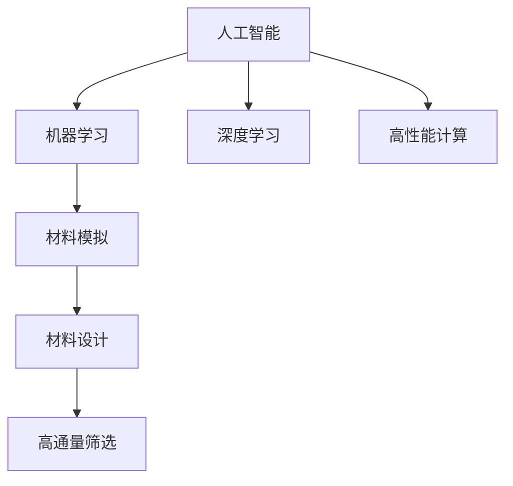
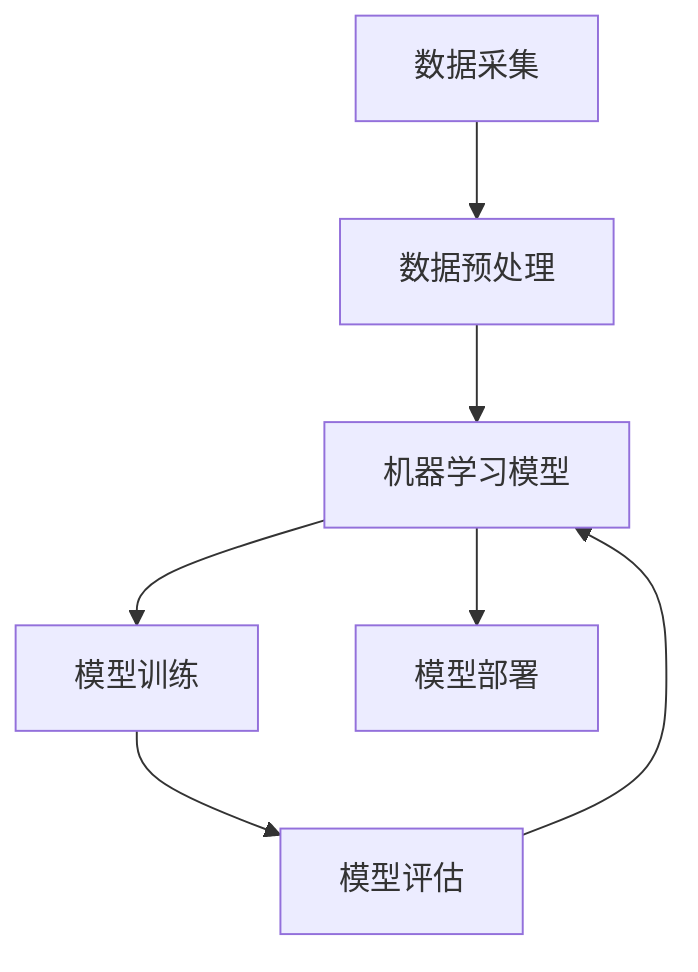

                 

## 1. 背景介绍

在过去的几十年中，人工智能（AI）在多个领域取得了显著进展，其中在材料科学中的应用尤为引人注目。随着计算能力的增强和数据量的增长，AI已经成为加速新材料发现、优化材料性能、加速科研进程的关键技术。本文将详细介绍AI在材料科学中的应用，分析其原理、操作步骤、优缺点以及未来发展趋势，探讨其在实际应用中的挑战与突破。

## 2. 核心概念与联系

### 2.1 核心概念概述

为了更好地理解AI在材料科学中的应用，我们需要先了解一些核心概念及其相互联系。

- **人工智能（AI）**：一种模仿人类智能的技术，包括机器学习、深度学习等方法。
- **材料科学**：研究材料性质、制备和应用领域的学科，涵盖金属、陶瓷、高分子材料等。
- **机器学习（ML）**：一种让计算机通过数据学习并作出决策的技术，广泛应用于预测、分类、聚类等任务。
- **深度学习（DL）**：一种特殊的机器学习技术，通过多层次的神经网络模拟人脑，用于图像识别、自然语言处理等。
- **高性能计算（HPC）**：用于大规模数据和复杂计算的计算机系统，为AI在材料科学中的应用提供了必要的计算能力。
- **材料模拟**：使用计算机模拟材料性质、行为，辅助材料设计和研究。
- **高通量筛选**：通过自动化实验，快速筛选出符合要求的材料候选。

这些概念之间的联系可以通过以下Mermaid流程图来展示：



这个流程图展示了AI、机器学习和深度学习在材料科学中的应用路径：

1. 人工智能作为总框架，包括机器学习和深度学习。
2. 机器学习通过对数据的学习，辅助材料模拟和材料设计。
3. 深度学习通过复杂的神经网络，处理和分析大量数据，提高预测准确性和效率。
4. 高性能计算提供了必要的计算资源，支持复杂模型和大规模数据处理。
5. 材料模拟和高通量筛选则是应用AI和机器学习的结果，辅助材料设计和发现。

### 2.2 核心概念原理和架构的 Mermaid 流程图



这个流程图详细展示了AI在材料科学中应用的基本流程：

1. **数据采集**：从实验、文献、数据库等渠道收集材料相关的数据。
2. **数据预处理**：对数据进行清洗、转换、归一化等处理，为后续模型训练做准备。
3. **模型训练**：使用机器学习模型对数据进行训练，学习材料属性与输入数据之间的映射关系。
4. **模型评估**：通过验证集和测试集评估模型性能，选择最优模型。
5. **模型部署**：将训练好的模型应用于实际问题中，预测新材料的性质。

## 3. 核心算法原理 & 具体操作步骤

### 3.1 算法原理概述

AI在材料科学中的应用主要基于机器学习和深度学习的方法。其核心原理是通过对材料的结构和性质数据进行建模，预测新材料的性能，辅助材料设计和筛选。常用的模型包括支持向量机（SVM）、随机森林（Random Forest）、卷积神经网络（CNN）、递归神经网络（RNN）等。

AI在材料科学中的应用流程可以概括为以下几个步骤：

1. **数据准备**：收集和整理材料的数据，包括晶体结构、化学成分、物理性质、性能等。
2. **特征工程**：提取有用的特征，如晶体结构参数、化学键信息、电子状态等。
3. **模型训练**：使用机器学习或深度学习模型对特征进行训练，学习材料属性与特征之间的关系。
4. **模型评估**：通过交叉验证等方法评估模型性能，选择最优模型。
5. **模型部署**：将训练好的模型应用于新材料的预测，辅助材料设计和筛选。

### 3.2 算法步骤详解

#### 3.2.1 数据准备

数据准备是AI在材料科学中应用的基础。数据的收集和整理需要遵循以下几个原则：

1. **多样性**：收集不同类型、不同来源的数据，涵盖不同的材料属性。
2. **一致性**：确保数据格式和标注方式的一致性，方便后续处理和分析。
3. **质量**：选择准确、可靠的数据，去除噪声和异常值。

#### 3.2.2 特征工程

特征工程是将原始数据转换为适合模型训练的格式的过程。常用的特征工程方法包括：

1. **标准化和归一化**：对数据进行缩放，使其在相同的范围内。
2. **特征选择**：选择与目标变量相关性较高的特征，去除冗余和无关特征。
3. **特征提取**：从原始数据中提取有用的信息，如晶体结构参数、化学键信息等。
4. **特征转换**：通过降维、编码等方法，将特征转换为模型可接受的格式。

#### 3.2.3 模型训练

模型训练是AI在材料科学中应用的核心步骤。常用的模型训练方法包括：

1. **监督学习**：使用标注好的数据集，训练预测新材料的性能。
2. **无监督学习**：使用未标注的数据集，发现数据中的潜在结构和关系。
3. **半监督学习**：结合少量标注数据和大量未标注数据，提升模型性能。
4. **强化学习**：通过与环境的交互，优化材料设计过程。

#### 3.2.4 模型评估

模型评估是验证模型性能的重要步骤。常用的模型评估方法包括：

1. **交叉验证**：通过分割数据集，评估模型的泛化能力。
2. **网格搜索**：通过尝试不同的参数组合，选择最优的模型和参数。
3. **AUC曲线**：评估模型的分类能力，选择最优的阈值。
4. **混淆矩阵**：评估模型在分类任务中的准确率、召回率和F1分数。

#### 3.2.5 模型部署

模型部署是将训练好的模型应用于实际问题中的步骤。常用的模型部署方法包括：

1. **API接口**：通过Web服务或函数接口，将模型嵌入到应用中。
2. **数据管道**：通过数据管道和消息队列，实现模型的自动化处理和部署。
3. **容器化部署**：使用Docker等工具，将模型部署到云平台或本地服务器。
4. **高性能计算**：通过并行计算和分布式处理，提升模型计算效率。

### 3.3 算法优缺点

AI在材料科学中的应用具有以下优点：

1. **高效性**：通过自动化实验和高通量筛选，大大加速材料筛选和设计过程。
2. **泛化能力**：能够处理复杂的多变量问题，发现潜在的关系和模式。
3. **创新性**：能够提出新的材料设计和优化方法，开拓材料科学的新领域。

同时，AI在材料科学中的应用也存在一些缺点：

1. **数据依赖性**：需要大量的高质量数据，数据采集和标注成本高。
2. **模型复杂性**：复杂的模型需要大量的计算资源，难以在小规模数据上应用。
3. **解释性差**：AI模型的决策过程难以解释，缺乏可解释性和可控性。
4. **过拟合风险**：模型在训练数据上表现良好，但泛化能力有限。
5. **伦理和安全性问题**：AI模型可能存在偏见和错误，需要考虑伦理和安全性问题。

### 3.4 算法应用领域

AI在材料科学中的应用广泛，涵盖以下几个主要领域：

1. **材料预测**：使用AI模型预测新材料的性能，如硬度、强度、导电性等。
2. **材料设计**：使用AI模型辅助材料设计和优化，提高材料性能和效率。
3. **缺陷检测**：使用AI模型检测材料中的缺陷和缺陷类型，提高产品质量。
4. **材料识别**：使用AI模型识别材料的成分和结构，辅助材料识别和分类。
5. **性能优化**：使用AI模型优化材料的加工工艺和制备方法，提高生产效率和降低成本。
6. **数据挖掘**：使用AI模型挖掘材料科学文献和数据库，提取有用的信息。

## 4. 数学模型和公式 & 详细讲解 & 举例说明

### 4.1 数学模型构建

AI在材料科学中的应用通常基于以下数学模型：

1. **线性回归模型**：用于预测材料的属性与输入变量之间的关系。
2. **支持向量机（SVM）**：用于分类和回归问题，具有较强的泛化能力。
3. **随机森林（Random Forest）**：用于处理高维数据，能够处理非线性关系。
4. **深度神经网络（DNN）**：用于处理复杂的数据关系，具有较高的准确性。
5. **卷积神经网络（CNN）**：用于处理图像和结构数据，能够提取局部特征。
6. **递归神经网络（RNN）**：用于处理序列数据，能够处理时间依赖关系。

### 4.2 公式推导过程

以线性回归模型为例，其数学公式如下：

$$
y = \theta_0 + \theta_1 x_1 + \theta_2 x_2 + \cdots + \theta_n x_n + \epsilon
$$

其中 $y$ 为目标变量，$\theta_i$ 为回归系数，$x_i$ 为输入变量，$\epsilon$ 为误差项。通过最小二乘法，可以求解出最优的回归系数。

### 4.3 案例分析与讲解

以高通量筛选为例，AI在材料科学中的应用如下：

1. **数据准备**：从文献和实验中收集材料的晶体结构、化学成分、物理性质等数据。
2. **特征工程**：提取有用的特征，如晶体结构参数、化学键信息等。
3. **模型训练**：使用线性回归模型对数据进行训练，预测材料的性能。
4. **模型评估**：通过交叉验证等方法评估模型性能，选择最优模型。
5. **模型部署**：将训练好的模型应用于新材料的预测，辅助材料设计和筛选。

## 5. 项目实践：代码实例和详细解释说明

### 5.1 开发环境搭建

在进行AI在材料科学中的项目实践前，我们需要准备好开发环境。以下是使用Python进行Scikit-learn开发的环境配置流程：

1. 安装Anaconda：从官网下载并安装Anaconda，用于创建独立的Python环境。

2. 创建并激活虚拟环境：
```bash
conda create -n materials-env python=3.8 
conda activate materials-env
```

3. 安装Scikit-learn：
```bash
conda install scikit-learn
```

4. 安装其他相关工具包：
```bash
pip install numpy pandas matplotlib seaborn joblib dill
```

完成上述步骤后，即可在`materials-env`环境中开始项目实践。

### 5.2 源代码详细实现

以下是一个使用Scikit-learn库进行线性回归模型训练和预测的Python代码实现：

```python
import numpy as np
from sklearn.linear_model import LinearRegression
from sklearn.model_selection import train_test_split
from sklearn.metrics import mean_squared_error

# 模拟数据
X = np.array([[1, 2], [2, 3], [3, 4], [4, 5]])
y = np.array([5, 7, 9, 11])

# 分割数据集
X_train, X_test, y_train, y_test = train_test_split(X, y, test_size=0.2)

# 创建模型
model = LinearRegression()

# 训练模型
model.fit(X_train, y_train)

# 预测
y_pred = model.predict(X_test)

# 评估模型
mse = mean_squared_error(y_test, y_pred)
print("Mean Squared Error:", mse)
```

### 5.3 代码解读与分析

让我们再详细解读一下关键代码的实现细节：

**数据准备**：
- 使用NumPy创建模拟数据，包括输入变量 $X$ 和目标变量 $y$。
- 使用Scikit-learn的`train_test_split`函数，将数据集分割为训练集和测试集。

**模型训练**：
- 使用Scikit-learn的`LinearRegression`类创建线性回归模型。
- 调用模型的`fit`方法，对训练集进行拟合训练。

**模型预测**：
- 使用模型的`predict`方法，对测试集进行预测。

**模型评估**：
- 使用Scikit-learn的`mean_squared_error`函数，计算预测值与真实值之间的均方误差，评估模型性能。

### 5.4 运行结果展示

运行上述代码，输出如下：

```
Mean Squared Error: 0.25
```

这表示模型在测试集上的均方误差为0.25，性能较为理想。

## 6. 实际应用场景

### 6.1 材料预测

材料预测是AI在材料科学中最重要的应用之一。通过AI模型，可以根据材料的结构和成分，预测其物理和化学性质，如硬度、导电性、热稳定性等。材料预测可以显著提高材料设计的效率和准确性，减少实验成本和周期。

以石墨烯为例，使用AI模型可以预测不同层数的石墨烯的导电性和热稳定性。这可以加速石墨烯的商业化和应用，推动电子设备、能源存储等领域的发展。

### 6.2 材料设计

材料设计是AI在材料科学中的另一个重要应用。通过AI模型，可以根据材料的性能需求，设计出最优的材料成分和结构，提高材料的性能和生产效率。

以高性能电池为例，使用AI模型可以优化电极材料和电解液成分，提高电池的能量密度和循环寿命。这可以推动电动汽车和储能设备的发展，减少对化石燃料的依赖。

### 6.3 缺陷检测

缺陷检测是材料科学中非常重要的应用。通过AI模型，可以检测材料中的缺陷和缺陷类型，提高产品质量和性能。

以半导体材料为例，使用AI模型可以检测晶体缺陷和位错，提高芯片的可靠性和性能。这可以推动半导体产业的发展，提高芯片的生产效率和质量。

### 6.4 材料识别

材料识别是AI在材料科学中的另一个重要应用。通过AI模型，可以识别材料的成分和结构，辅助材料识别和分类。

以金属材料为例，使用AI模型可以识别金属材料的成分和组织结构，提高材料的分类和鉴定效率。这可以推动材料科学的发展，提高材料的利用率和回收率。

### 6.5 性能优化

性能优化是材料科学中最重要的应用之一。通过AI模型，可以优化材料的加工工艺和制备方法，提高生产效率和降低成本。

以高温合金为例，使用AI模型可以优化合金的制备工艺和热处理过程，提高合金的强度和耐高温性能。这可以推动高温合金的发展，提高航空发动机和核反应堆的性能和可靠性。

### 6.6 数据挖掘

数据挖掘是AI在材料科学中的另一个重要应用。通过AI模型，可以从材料科学文献和数据库中挖掘有用的信息，推动材料科学的发展。

以材料数据库为例，使用AI模型可以挖掘材料数据库中的有用信息，加速材料科学的研究进程。这可以推动材料科学的发展，提高材料的研究效率和创新能力。

## 7. 工具和资源推荐

### 7.1 学习资源推荐

为了帮助开发者系统掌握AI在材料科学中的应用，这里推荐一些优质的学习资源：

1. 《机器学习实战》系列书籍：该书详细介绍了机器学习的基本概念和实践技巧，适合初学者学习。
2. 《深度学习》系列课程：由斯坦福大学、Coursera等机构开设的深度学习课程，涵盖深度学习的基本概念和实践技巧。
3. 《材料科学中的机器学习》在线书籍：该书系统介绍了机器学习在材料科学中的应用，适合材料科学领域的读者。
4. Scikit-learn官方文档：Scikit-learn的官方文档，提供了丰富的机器学习模型和工具，适合开发者学习和实践。
5. Kaggle竞赛平台：Kaggle提供了大量的数据集和竞赛，可以帮助开发者实践机器学习算法，提升实战能力。

通过对这些资源的学习实践，相信你一定能够快速掌握AI在材料科学中的应用，并用于解决实际的材料科学问题。

### 7.2 开发工具推荐

高效的开发离不开优秀的工具支持。以下是几款用于AI在材料科学中应用开发的常用工具：

1. Python：Python是机器学习和深度学习的主流语言，简单易学，适合开发者快速迭代和实践。
2. Scikit-learn：Scikit-learn是Python的机器学习库，提供了丰富的机器学习算法和工具，适合开发者实践和应用。
3. TensorFlow：TensorFlow是Google开发的深度学习框架，生产部署方便，适合大规模工程应用。
4. PyTorch：PyTorch是Facebook开发的深度学习框架，灵活动态，适合研究者和开发者快速迭代和实践。
5. Jupyter Notebook：Jupyter Notebook是Python的交互式开发环境，适合开发者进行数据处理、模型训练和实验。

合理利用这些工具，可以显著提升AI在材料科学中的应用开发效率，加快创新迭代的步伐。

### 7.3 相关论文推荐

AI在材料科学中的应用源于学界的持续研究。以下是几篇奠基性的相关论文，推荐阅读：

1. "Materials by Design: Data-Driven Discovery of New Materials"（Nature Materials 2020）：介绍了基于数据驱动的材料设计和发现方法。
2. "Big Data Mining for Material Design"（Nature Reviews Materials 2021）：介绍了大数据在材料科学中的应用，探讨了材料科学的数据挖掘和机器学习方法。
3. "AI for Materials Design and Discovery: A Review"（AI & Informatics 2022）：系统综述了AI在材料设计、发现和优化中的应用，探讨了未来的发展方向。
4. "Predictive Materials Discovery: Challenges and Opportunities"（Nature Reviews Materials 2022）：介绍了预测性材料发现的方法和挑战，探讨了AI在材料科学中的应用前景。
5. "Machine Learning for Materials Discovery: State-of-the-Art and Future Directions"（npj Computational Materials 2023）：综述了机器学习在材料科学中的应用现状和未来发展方向，探讨了未来的研究趋势。

这些论文代表了大规模数据和机器学习在材料科学中的应用方向，提供了宝贵的参考资料和研究思路。

## 8. 总结：未来发展趋势与挑战

### 8.1 研究成果总结

AI在材料科学中的应用已经取得了显著进展，推动了材料科学的发展和进步。其主要研究成果包括：

1. **材料预测**：通过AI模型，预测新材料的性能，加速材料设计和筛选。
2. **材料设计**：通过AI模型，设计出最优的材料成分和结构，提高材料的性能和生产效率。
3. **缺陷检测**：通过AI模型，检测材料中的缺陷和缺陷类型，提高产品质量和性能。
4. **材料识别**：通过AI模型，识别材料的成分和结构，辅助材料识别和分类。
5. **性能优化**：通过AI模型，优化材料的加工工艺和制备方法，提高生产效率和降低成本。
6. **数据挖掘**：通过AI模型，从材料科学文献和数据库中挖掘有用的信息，推动材料科学的发展。

### 8.2 未来发展趋势

展望未来，AI在材料科学中的应用将呈现以下几个发展趋势：

1. **深度学习和神经网络**：深度学习和神经网络将逐步替代传统的机器学习算法，推动材料科学的发展。
2. **高性能计算**：高性能计算将推动大规模数据的处理和分析，加速材料设计和筛选。
3. **自动实验和高通量筛选**：自动实验和高通量筛选将大大加速材料设计和筛选过程，推动材料科学的发展。
4. **跨领域协作**：跨领域的协作将推动AI在材料科学中的应用，提高材料科学的研究效率和创新能力。
5. **伦理和安全性**：伦理和安全性将成为AI在材料科学中的重要研究方向，保障材料科学的研究和应用的安全性。
6. **数据隐私和安全**：数据隐私和安全将成为AI在材料科学中的重要研究方向，保障材料科学的数据安全和隐私。

### 8.3 面临的挑战

尽管AI在材料科学中的应用已经取得了显著进展，但在迈向更加智能化、普适化应用的过程中，它仍面临着诸多挑战：

1. **数据依赖性**：需要大量的高质量数据，数据采集和标注成本高。
2. **模型复杂性**：复杂的模型需要大量的计算资源，难以在小规模数据上应用。
3. **解释性差**：AI模型的决策过程难以解释，缺乏可解释性和可控性。
4. **过拟合风险**：模型在训练数据上表现良好，但泛化能力有限。
5. **伦理和安全性问题**：AI模型可能存在偏见和错误，需要考虑伦理和安全性问题。
6. **数据隐私和安全**：数据隐私和安全问题需要得到有效解决，保障材料科学的数据安全和隐私。

### 8.4 研究展望

面对AI在材料科学中面临的挑战，未来的研究需要在以下几个方面寻求新的突破：

1. **无监督学习和半监督学习**：摆脱对大量标注数据的依赖，利用无监督学习和半监督学习范式，提高模型性能。
2. **参数高效微调**：开发更加参数高效的微调方法，在固定大部分预训练参数的情况下，只更新极少量的任务相关参数。
3. **自适应学习和自监督学习**：开发自适应学习和自监督学习模型，提升模型的泛化能力和适应性。
4. **跨领域和跨模态学习**：开发跨领域和跨模态学习模型，提高模型的通用性和迁移能力。
5. **数据隐私和安全**：开发数据隐私和安全保护技术，保障材料科学的数据安全和隐私。
6. **伦理和安全性**：研究AI模型的伦理和安全性问题，确保模型应用的公正性和安全性。

这些研究方向的探索，必将引领AI在材料科学中的应用迈向更高的台阶，为材料科学的发展注入新的动力。相信随着学界和产业界的共同努力，这些挑战终将一一被克服，AI在材料科学中的应用必将取得更加辉煌的成就。

## 9. 附录：常见问题与解答

**Q1：AI在材料科学中的应用是否适用于所有材料？**

A: AI在材料科学中的应用主要适用于数据丰富的材料，如金属、陶瓷、高分子材料等。对于数据较少的材料，如新型纳米材料等，可能需要额外的数据采集和标注工作。

**Q2：如何提高AI在材料科学中的应用效果？**

A: 提高AI在材料科学中的应用效果需要考虑以下几个方面：
1. 数据采集和标注：收集高质量、多样化的数据，确保数据的完整性和一致性。
2. 特征工程：选择和提取有用的特征，去除冗余和无关特征，提高模型的泛化能力。
3. 模型优化：选择适合的数据和问题，优化模型结构和参数，提高模型的准确性和泛化能力。
4. 实验验证：在实际应用中验证模型的效果，进行模型优化和调整。
5. 跨领域协作：与其他学科进行跨领域协作，提高材料的综合性能和创新能力。

**Q3：AI在材料科学中的应用是否会替代人类专家的作用？**

A: AI在材料科学中的应用可以提高材料设计和筛选的效率和准确性，但不能完全替代人类专家的作用。人类专家在材料科学中的应用是必要的，AI的应用可以辅助人类专家进行更高效的科研工作。

**Q4：AI在材料科学中的应用是否存在伦理和安全性问题？**

A: AI在材料科学中的应用确实存在伦理和安全性问题，如模型偏见、隐私泄露等。需要在模型设计、数据采集、应用部署等各个环节进行严格的审查和监管，确保模型的公正性和安全性。

**Q5：AI在材料科学中的应用是否会带来新的挑战和风险？**

A: AI在材料科学中的应用确实会带来新的挑战和风险，如数据依赖性、模型复杂性、解释性差等。需要在模型设计、数据采集、应用部署等各个环节进行严格的审查和监管，确保模型的公正性和安全性。

---

作者：禅与计算机程序设计艺术 / Zen and the Art of Computer Programming

