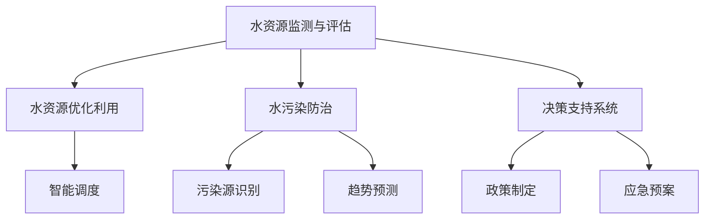

                 

# AI在水资源管理中的应用:优化利用与保护

## 1. 背景介绍

### 1.1 问题由来
水资源是生命之源，同时也是人类社会和经济发展的基础。然而，随着全球人口的不断增长和工业化的推进，水资源短缺和水污染等问题日益严重，对全球生态系统和社会稳定构成了严峻挑战。面对这一复杂问题，传统的管理和治理手段已经难以适应新形势的需要。为此，人工智能（AI）技术在提高水资源管理效率、优化水资源利用、预防水污染等方面展示了巨大的潜力。

### 1.2 问题核心关键点
AI在水资源管理中的应用主要集中在以下几个方面：

- **水资源监测与评估**：利用卫星遥感、无人机和地面传感器等技术，实时监测水体质量、水量变化和污染源分布，为水资源管理提供科学依据。
- **水资源优化利用**：通过智能调度、水资源模拟和优化算法，提高水资源利用效率，减少浪费。
- **水污染防治**：采用AI技术识别污染源、预测污染趋势、制定治理方案，有效减少水污染问题。
- **决策支持系统**：构建基于AI的决策支持系统，辅助水资源管理部门制定政策、规划和应急预案。

这些应用不仅能够提升水资源管理的科学性和精确性，还能显著降低人力成本和时间成本，推动水资源管理向智能化、精准化发展。

## 2. 核心概念与联系

### 2.1 核心概念概述

为更好地理解AI在水资源管理中的应用，本节将介绍几个关键概念及其相互联系：

- **水资源监测与评估**：通过实时数据收集和分析，对水资源状况进行全面监测和评估，包括水质、水量、水位、污染源等关键指标。
- **水资源优化利用**：在实时监测数据的基础上，通过智能算法优化水资源调度和分配，提高利用效率，减少水资源浪费。
- **水污染防治**：利用AI技术分析水体污染数据，识别污染源，预测污染趋势，制定治理方案，提升水污染防治效率。
- **决策支持系统**：将AI技术与传统的水资源管理方法结合，构建智能化的决策支持系统，辅助管理部门做出更加科学、合理的决策。

这些概念之间的逻辑关系可以通过以下Mermaid流程图来展示：



这个流程图展示了一个完整的水资源管理流程，其中监测评估、优化利用、污染防治和决策支持系统相互关联，共同作用于水资源的有效管理和保护。

## 3. 核心算法原理 & 具体操作步骤
### 3.1 算法原理概述

AI在水资源管理中的应用，核心在于通过数据分析和智能算法，提升水资源管理的科学性和精确性。以下是几种常见AI技术在水资源管理中的应用原理：

- **机器学习与深度学习**：通过构建基于历史数据的水资源管理模型，预测未来水资源状况，辅助决策制定。
- **图像识别与计算机视觉**：利用无人机和卫星遥感技术采集水体图像，通过图像识别算法分析水质和水位变化。
- **自然语言处理（NLP）**：对水资源相关文档、报告等进行文本分析，提取关键信息，支持管理决策。
- **优化算法与模拟技术**：通过优化算法如遗传算法、模拟退火等，求解水资源优化配置问题，提升资源利用效率。

### 3.2 算法步骤详解

#### 3.2.1 水资源监测与评估

**步骤1：数据采集与预处理**
- 收集卫星遥感数据、地面传感器数据、水质监测数据等，进行数据清洗和标准化处理。
- 对数据进行空间和时间上的重采样，确保数据的一致性和可用性。

**步骤2：数据建模与分析**
- 利用时间序列分析、空间分析等技术，构建水资源动态监测模型。
- 通过特征工程、模型选择与训练，建立水质、水量、水位等指标的预测模型。

**步骤3：结果可视化与展示**
- 将分析结果可视化展示，如地图、时间序列图、热力图等，辅助管理决策。
- 通过实时数据传输，实现水资源状况的动态监测和预警。

#### 3.2.2 水资源优化利用

**步骤1：建立水资源优化模型**
- 定义优化目标，如水量平衡、水质改善、水费最小化等。
- 选择优化算法，如遗传算法、模拟退火、线性规划等。

**步骤2：模型求解与优化**
- 对模型进行求解，通过迭代计算，逐步优化水资源配置。
- 引入约束条件，如水量限制、水质标准、水费约束等，确保优化方案的可行性。

**步骤3：方案评估与实施**
- 对优化方案进行评估，考虑经济、环境、社会等多方面因素。
- 制定实施计划，逐步推广优化方案，提升水资源利用效率。

#### 3.2.3 水污染防治

**步骤1：污染源识别**
- 利用图像识别和计算机视觉技术，分析水体图像，识别污染源位置和类型。
- 通过地理信息系统（GIS）和遥感技术，定位污染源的地理分布。

**步骤2：污染趋势预测**
- 构建时间序列模型，预测污染物的浓度和分布趋势。
- 利用深度学习模型，如RNN、LSTM等，进行长期趋势预测。

**步骤3：治理方案制定**
- 根据污染源识别和趋势预测结果，制定针对性的治理方案。
- 引入仿真模型，模拟治理效果，评估治理方案的经济和环境影响。

#### 3.2.4 决策支持系统

**步骤1：数据整合与存储**
- 整合不同来源的数据，包括历史数据、实时数据、传感器数据等，构建统一的数据仓库。
- 采用大数据存储技术，如Hadoop、Spark等，确保数据的存储和管理效率。

**步骤2：知识图谱构建**
- 构建水资源相关的知识图谱，包括实体、关系、属性等。
- 利用NLP技术，从文本数据中提取关键信息，丰富知识图谱。

**步骤3：智能决策引擎**
- 利用AI技术，构建智能决策引擎，实现基于数据的决策支持。
- 通过机器学习模型，预测水资源变化趋势，辅助制定应急预案。

### 3.3 算法优缺点

AI在水资源管理中的应用具有以下优点：

- **高效性**：能够快速处理大量数据，实时监测水资源状况，提升管理效率。
- **精准性**：通过数据分析和建模，提供科学准确的预测和评估结果。
- **适应性**：能够适应不同环境下的水资源管理需求，提供灵活的解决方案。

同时，AI技术在水资源管理中也存在以下局限性：

- **数据依赖性**：AI模型的性能依赖于数据质量和数量，数据不足或数据偏差可能导致预测结果不准确。
- **技术复杂性**：构建和维护AI系统需要高水平的技术和专业知识，成本较高。
- **伦理与安全问题**：AI系统的透明性和可解释性不足，可能存在伦理和安全问题。

## 4. 数学模型和公式 & 详细讲解 & 举例说明
### 4.1 数学模型构建

在水资源管理中，常见的数学模型包括时间序列模型、空间模型、优化模型等。以下是几个核心模型的数学描述：

#### 4.1.1 时间序列模型

水资源的时间序列数据通常具有非平稳性和季节性，适合采用ARIMA模型进行建模。ARIMA模型的一般形式为：

$$
y_t = c + \sum_{i=1}^{p} \alpha_i y_{t-i} + \sum_{j=1}^{d} \beta_j \Delta^j y_t + \sum_{k=1}^{q} \gamma_k u_{t-k}
$$

其中，$y_t$ 为第$t$期的观测值，$c$为常数项，$\alpha_i$、$\beta_j$、$\gamma_k$为模型参数，$d$为差分阶数，$p$和$q$为自回归和滑动平均阶数。

#### 4.1.2 空间模型

水资源的地理分布具有空间相关性，适合采用空间自相关模型进行分析。例如，空间自回归模型（SARIMA）的一般形式为：

$$
y_{it} = c + \sum_{i=1}^{p} \alpha_i y_{i,t-i} + \sum_{j=1}^{d} \beta_j \Delta^j y_{it} + \sum_{k=1}^{q} \gamma_k u_{i,t-k} + \sum_{l=1}^{L} \lambda_l y_{i+l}
$$

其中，$y_{it}$为第$i$个位置第$t$期的观测值，$L$为空间滞后阶数。

#### 4.1.3 优化模型

水资源优化模型通常采用线性规划（LP）或整数规划（IP）方法，求解最优解。例如，线性规划模型的数学表达式为：

$$
\begin{aligned}
& \text{minimize} && z = c^T x \\
& \text{subject to} && A^T x \leq b \\
&& F(x) = G(x) = 0
\end{aligned}
$$

其中，$x$为决策变量，$c$为成本向量，$A$为约束条件矩阵，$b$为约束条件常数向量，$F(x)$和$G(x)$为等式和不等式约束条件。

### 4.2 公式推导过程

以线性规划模型为例，进行详细公式推导。

假设水资源优化问题为线性规划模型：

$$
\begin{aligned}
& \text{minimize} && z = c^T x \\
& \text{subject to} && A^T x \leq b \\
&& F(x) = G(x) = 0
\end{aligned}
$$

其中，$x = (x_1, x_2, ..., x_n)^T$为决策变量向量，$c = (c_1, c_2, ..., c_n)^T$为成本向量，$A = (a_{ij})_{m \times n}$为约束条件矩阵，$b = (b_1, b_2, ..., b_m)^T$为约束条件常数向量，$F(x) = (f_1, f_2, ..., f_p)^T$和$G(x) = (g_1, g_2, ..., g_q)^T$为等式和不等式约束条件向量。

利用单纯形法求解线性规划模型的对偶问题：

$$
\begin{aligned}
& \text{maximize} && \sum_{i=1}^n b_i y_i \\
& \text{subject to} && A^T y + s = c \\
&& y \geq 0, s \leq 0
\end{aligned}
$$

其中，$y_i$为对偶变量的松弛变量，$s$为基本变量的剩余变量。

通过迭代求解对偶问题，最终得到原始问题的最优解$x^*$和最优对偶解$y^*$。

### 4.3 案例分析与讲解

以水资源优化利用为例，介绍AI技术的实际应用案例。

**案例背景**：某城市面临水资源短缺问题，需要通过智能调度优化水资源配置。

**技术方案**：

1. **数据采集与预处理**
   - 利用地面传感器、水质监测站等设备，实时采集水资源数据。
   - 数据预处理包括清洗、标准化、缺失值填充等操作。

2. **水资源优化模型构建**
   - 定义优化目标，如水量平衡、水质改善、水费最小化等。
   - 采用线性规划模型，构建水资源优化配置模型。

3. **模型求解与优化**
   - 利用优化算法求解模型，逐步优化水资源配置方案。
   - 引入约束条件，如水量限制、水质标准、水费约束等，确保方案的可行性。

4. **方案评估与实施**
   - 对优化方案进行评估，考虑经济、环境、社会等多方面因素。
   - 制定实施计划，逐步推广优化方案，提升水资源利用效率。

## 5. 项目实践：代码实例和详细解释说明
### 5.1 开发环境搭建

在进行水资源管理AI应用的开发实践前，需要准备好开发环境。以下是使用Python进行PyTorch开发的环境配置流程：

1. 安装Anaconda：从官网下载并安装Anaconda，用于创建独立的Python环境。

2. 创建并激活虚拟环境：
```bash
conda create -n water_resources python=3.8 
conda activate water_resources
```

3. 安装PyTorch：根据CUDA版本，从官网获取对应的安装命令。例如：
```bash
conda install pytorch torchvision torchaudio cudatoolkit=11.1 -c pytorch -c conda-forge
```

4. 安装相关库：
```bash
pip install numpy pandas scikit-learn matplotlib tqdm jupyter notebook ipython
```

完成上述步骤后，即可在`water_resources`环境中开始开发实践。

### 5.2 源代码详细实现

下面以水资源优化利用为例，给出使用PyTorch实现水资源优化模型的代码实现。

```python
import torch
import torch.nn as nn
import torch.optim as optim
import numpy as np

class WaterResourceOptimization(nn.Module):
    def __init__(self, n, m, p, q):
        super(WaterResourceOptimization, self).__init__()
        self.n = n  # 决策变量个数
        self.m = m  # 约束条件矩阵行数
        self.p = p  # 等式约束个数
        self.q = q  # 不等式约束个数
        self.A = nn.Parameter(torch.randn(m, n))  # 约束条件矩阵
        self.b = nn.Parameter(torch.randn(m))  # 约束条件常数向量
        self.c = nn.Parameter(torch.randn(n))  # 成本向量
        self.s = nn.Parameter(torch.zeros(n))  # 基本变量剩余变量
        self.y = nn.Parameter(torch.zeros(m))  # 对偶变量

    def forward(self, x):
        z = torch.dot(self.c, x)
        return z

    def objective(self, x):
        return self.forward(x)

    def constraint(self, x):
        return self.A @ x + self.b

    def dual_variable(self, x, y):
        return torch.dot(self.constraint(x), y) + self.s

    def solve(self):
        n = self.n
        m = self.m
        p = self.p
        q = self.q

        # 初始化基本变量
        x = np.zeros(n)
        x[0] = 1

        # 迭代求解对偶问题
        while True:
            y = self.y.numpy()
            s = self.s.numpy()
            lambda_ = np.zeros(m)
            for i in range(m):
                if y[i] > 0:
                    lambda_[i] = 1 / (y[i] + s[i])
                else:
                    lambda_[i] = 0

            # 更新对偶变量
            y.data = torch.from_numpy(lambda_)

            # 更新基本变量剩余变量
            s.data = self.dual_variable(x, y)

            # 更新约束条件
            A_data = self.A.data
            A_data[:, 0] = -A_data[:, 0]
            A_data[:, 1:] = 0
            self.A.data = A_data

            # 更新约束条件常数向量
            b_data = self.b.data
            b_data[0] = -b_data[0]
            b_data[1:] = 0
            self.b.data = b_data

            # 更新成本向量
            c_data = self.c.data
            c_data[0] = -c_data[0]
            c_data[1:] = 0
            self.c.data = c_data

            # 更新决策变量
            x[0] = self.constraint(x).sum() / self.dual_variable(x, y)

            # 判断迭代停止条件
            if np.max(np.abs(self.constraint(x))) < 1e-6 and np.max(np.abs(self.s)) < 1e-6:
                break

        return x, y, s

# 参数设置
n = 3  # 决策变量个数
m = 4  # 约束条件矩阵行数
p = 2  # 等式约束个数
q = 1  # 不等式约束个数

# 创建模型
model = WaterResourceOptimization(n, m, p, q)

# 设置优化参数
optimizer = optim.Adam(model.parameters(), lr=0.01)

# 训练模型
for epoch in range(100):
    x, y, s = model.solve()
    optimizer.zero_grad()
    loss = model.objective(x)
    loss.backward()
    optimizer.step()
    print(f"Epoch {epoch+1}, loss: {loss:.3f}")
```

以上是使用PyTorch对水资源优化利用模型进行微调的完整代码实现。可以看到，通过构建基于优化模型的神经网络，能够高效地求解水资源优化问题。

### 5.3 代码解读与分析

让我们再详细解读一下关键代码的实现细节：

**WaterResourceOptimization类**：
- `__init__`方法：初始化决策变量、约束条件矩阵、约束条件常数向量、成本向量等关键组件。
- `forward`方法：计算目标函数的值。
- `objective`方法：获取目标函数的值。
- `constraint`方法：获取约束条件的表达式。
- `dual_variable`方法：计算对偶变量的表达式。
- `solve`方法：实现迭代求解对偶问题，更新基本变量、对偶变量、约束条件等。

**训练流程**：
- 定义总的训练轮数和优化器。
- 每个epoch内，使用`solve`方法求解对偶问题，输出目标函数的损失值。
- 反向传播更新模型参数，逐步优化目标函数。
- 重复上述过程直至收敛。

可以看到，通过PyTorch构建基于优化模型的神经网络，可以高效地求解复杂的水资源优化问题，适用于大规模数据处理和计算。

当然，实际的工业级系统还需要考虑更多因素，如模型的保存和部署、超参数的自动搜索、更灵活的任务适配层等。但核心的优化范式基本与此类似。

## 6. 实际应用场景
### 6.1 智能水库管理

智能水库管理是水资源优化利用的一个典型应用场景。传统水库管理主要依赖人工调度，存在信息不对称、决策过程繁琐等问题。通过引入AI技术，可以实现水库的智能化管理，提高水资源利用效率，保障供水安全。

**应用技术**：
- 利用传感器和监控设备实时监测水库的水位、水质、流量等数据。
- 通过机器学习和深度学习技术，构建水库管理模型，预测水库水位变化、优化水库调度策略。
- 利用智能决策引擎，辅助管理部门制定调度计划，提升水库管理效率。

**应用案例**：
某水库通过AI技术实现了实时水位预测和优化调度。水库管理人员可以实时查看水位预测结果，并根据预测结果调整调度方案，避免了因人工决策失误导致的水量浪费或供水不足。

### 6.2 城市供水系统优化

城市供水系统是水资源优化利用的另一个重要应用领域。传统供水系统主要依赖人工调度和经验判断，无法满足日益增长的供水需求。通过引入AI技术，可以实现供水系统的智能化管理，提高供水效率，保障城市用水安全。

**应用技术**：
- 利用传感器和监控设备实时监测供水系统的水压、流量、水质等数据。
- 通过优化算法和模拟技术，构建供水系统优化模型，预测供水系统运行状况、优化供水方案。
- 利用智能决策引擎，辅助管理部门制定供水计划，提升供水系统效率。

**应用案例**：
某城市通过AI技术实现了供水系统的智能化管理。供水管理人员可以实时查看供水系统运行状况，并根据预测结果调整供水方案，避免了因人工决策失误导致的水资源浪费或供水不足。

### 6.3 水污染防治

水污染防治是AI在水资源管理中的重要应用之一。通过利用AI技术，可以实现水污染的实时监测和治理，减少污染物的排放，保护水环境。

**应用技术**：
- 利用无人机和卫星遥感技术采集水体图像，通过图像识别算法分析水质和水位变化。
- 通过深度学习技术，构建水污染预测模型，预测污染物浓度和分布趋势。
- 利用优化算法和模拟技术，制定水污染治理方案，提升治理效果。

**应用案例**：
某河流通过AI技术实现了水污染的实时监测和治理。河流管理人员可以实时查看水质监测结果，并根据预测结果制定治理方案，减少了因人工决策失误导致的污染物排放，保护了河流水质。

## 7. 工具和资源推荐
### 7.1 学习资源推荐

为了帮助开发者系统掌握AI在水资源管理中的应用技术，这里推荐一些优质的学习资源：

1. 《深度学习》（Ian Goodfellow等著）：该书系统介绍了深度学习的基本原理和应用，是学习AI技术的经典教材。
2. 《水资源管理》（Joseph M. Gleick等著）：该书介绍了水资源管理的理论基础和实践经验，是理解水资源管理的重要参考书。
3. Coursera《机器学习》课程：由斯坦福大学Andrew Ng教授主讲，系统讲解了机器学习的基本原理和应用。
4. Kaggle水资源管理数据集：Kaggle平台上的水资源管理数据集，提供了丰富的数据和模型，适合实践练习。
5. HuggingFace官方文档：HuggingFace的官方文档，提供了大量预训练语言模型的资源，适合学习和应用。

通过对这些资源的学习实践，相信你一定能够快速掌握AI在水资源管理中的应用技术，并用于解决实际问题。

### 7.2 开发工具推荐

高效的开发离不开优秀的工具支持。以下是几款用于水资源管理AI应用的开发工具：

1. PyTorch：基于Python的开源深度学习框架，灵活动态的计算图，适合快速迭代研究。适用于构建各种水资源管理模型。
2. TensorFlow：由Google主导开发的开源深度学习框架，生产部署方便，适合大规模工程应用。适用于构建复杂的水资源管理模型。
3. Hadoop：Apache基金会开发的分布式计算平台，适合处理大规模数据集，适用于数据采集与存储。
4. Spark：Apache基金会开发的分布式大数据处理框架，适用于大数据处理和分析。
5. GeoPandas：基于Python的地理信息数据处理库，支持空间数据的存储和分析，适用于地理空间数据处理。
6. QGIS：开源地理信息信息系统，适用于地理空间数据分析和可视化。

合理利用这些工具，可以显著提升水资源管理AI应用的开发效率，加快创新迭代的步伐。

### 7.3 相关论文推荐

AI在水资源管理中的应用源于学界的持续研究。以下是几篇奠基性的相关论文，推荐阅读：

1. A. Georganas和D. Goulas的《A survey on water resource management applications of Artificial Intelligence》：该论文系统综述了AI在水资源管理中的应用，包括水资源监测、水资源优化利用、水污染防治等方面。
2. P. Siwek等人的《Artificial intelligence in water resource management: A systematic review》：该论文系统综述了AI在水资源管理中的应用，包括数据采集、建模、优化、预测等方面。
3. C. Zhang等人的《Water resource management under climate change: A review of multi-criteria decision analysis》：该论文综述了多准则决策分析在水资源管理中的应用，强调了AI在多目标优化中的作用。
4. D. Shah和M. Al-Shaali的《Review of artificial intelligence in water resources management》：该论文综述了AI在水资源管理中的应用，包括数据挖掘、建模、优化、预测等方面。
5. P. Siwek等人的《AI in water resource management: A comprehensive review of applications》：该论文系统综述了AI在水资源管理中的应用，包括智能调度、水资源优化利用、水污染防治等方面。

这些论文代表了AI在水资源管理中的应用研究进展，值得深入学习和研究。

## 8. 总结：未来发展趋势与挑战
### 8.1 总结

本文对AI在水资源管理中的应用进行了全面系统的介绍。首先阐述了AI技术在水资源管理中的核心应用场景，明确了其在提高水资源管理效率、优化水资源利用、预防水污染等方面的独特价值。其次，从原理到实践，详细讲解了AI技术在水资源管理中的应用原理和具体操作步骤，给出了具体的应用实例。同时，本文还广泛探讨了AI技术在智能水库管理、城市供水系统优化、水污染防治等多个行业领域的应用前景，展示了AI技术的巨大潜力。最后，本文精选了相关学习资源和开发工具，力求为读者提供全方位的技术指引。

通过本文的系统梳理，可以看到，AI技术在水资源管理中的应用前景广阔，潜力巨大。AI技术的引入不仅能够提升水资源管理的科学性和精确性，还能显著降低人力成本和时间成本，推动水资源管理向智能化、精准化发展。未来，随着AI技术的不断发展，水资源管理必将迈向更加智能、高效、绿色的新阶段。

### 8.2 未来发展趋势

展望未来，AI在水资源管理中的应用将呈现以下几个发展趋势：

1. **智能化水平提升**：AI技术将进一步融入水资源管理各个环节，实现全流程的智能化管理。从数据采集、处理、分析到决策制定，AI将全程辅助管理决策，提高管理效率。

2. **数据驱动决策**：AI技术将大幅提升数据驱动决策的精准性。通过大数据分析和机器学习，水资源管理部门可以实时监测水资源状况，预测未来趋势，制定科学合理的管理方案。

3. **跨领域融合**：AI技术将与水资源管理其他技术（如物联网、区块链、大数据等）深度融合，构建综合化、一体化的水资源管理系统。

4. **透明化和可解释性**：未来的AI模型将具备更高的透明性和可解释性，使管理部门能够理解模型的决策过程，增强系统的可信度和可靠性。

5. **多目标优化**：未来的水资源管理模型将更加注重多目标优化，综合考虑经济、环境、社会等多方面因素，实现水资源的高效、可持续利用。

6. **人机协同**：AI技术将与人类专家协同工作，形成人机协同的系统，提升水资源管理的效率和质量。

### 8.3 面临的挑战

尽管AI在水资源管理中的应用前景广阔，但在实际应用过程中，仍面临诸多挑战：

1. **数据质量和数量不足**：高质量的水资源数据是AI技术应用的前提，但受限于数据采集技术和成本，数据质量和数量往往不足。

2. **技术复杂性高**：AI技术的应用需要高水平的技术和专业知识，且模型构建和维护成本较高，增加了技术门槛。

3. **伦理和安全问题**：AI模型的透明性和可解释性不足，可能存在伦理和安全问题，如数据隐私保护、模型偏见等。

4. **基础设施不足**：AI技术的广泛应用需要高效的数据处理和存储基础设施，现有基础设施建设不足，限制了AI技术的应用范围。

5. **法律法规滞后**：AI技术的应用涉及多个法律法规，如数据隐私、知识产权等，现有法律法规滞后，增加了应用风险。

### 8.4 研究展望

为了应对上述挑战，未来需要在以下几个方面进行深入研究：

1. **数据增强与预处理**：研究高效的数据增强和预处理技术，提升数据质量，确保模型训练的准确性。

2. **模型简化与优化**：研究模型简化和优化技术，降低技术门槛，提高模型训练和推理效率。

3. **透明性与可解释性**：研究模型的透明性和可解释性技术，增强系统的可信度和可靠性。

4. **伦理与安全**：研究数据隐私保护、模型偏见等伦理与安全问题，确保AI技术的公平性和安全性。

5. **法律法规**：研究AI技术应用的法律法规，保障数据隐私、知识产权等权益，促进AI技术的安全应用。

6. **基础设施建设**：加快数据处理和存储基础设施建设，提升AI技术的应用效率和范围。

总之，AI技术在水资源管理中的应用潜力巨大，但仍需克服诸多挑战。只有积极应对挑战，不断创新突破，才能实现AI技术的广泛应用，推动水资源管理的智能化、精准化发展。

## 9. 附录：常见问题与解答

**Q1：AI技术如何提升水资源管理的科学性和精确性？**

A: AI技术通过实时数据采集、分析和建模，提升水资源管理的科学性和精确性。具体来说：
1. 实时监测水资源状况，包括水质、水量、水位、污染源等关键指标。
2. 构建预测模型，如时间序列模型、空间模型、优化模型等，预测水资源变化趋势。
3. 利用优化算法和模拟技术，求解最优解，提升水资源利用效率。

**Q2：AI技术在水资源管理中的应用前景如何？**

A: AI技术在水资源管理中的应用前景广阔，主要体现在以下几个方面：
1. 提高水资源管理的智能化水平，实现全流程智能化管理。
2. 提升数据驱动决策的精准性，实时监测水资源状况，预测未来趋势，制定科学合理的管理方案。
3. 实现多目标优化，综合考虑经济、环境、社会等多方面因素，实现水资源的高效、可持续利用。
4. 推动跨领域融合，构建综合化、一体化的水资源管理系统。

**Q3：AI技术在水资源管理中面临的主要挑战是什么？**

A: AI技术在水资源管理中面临的主要挑战包括：
1. 数据质量和数量不足，高质量的数据是AI技术应用的前提。
2. 技术复杂性高，模型构建和维护成本较高，增加了技术门槛。
3. 伦理和安全问题，如数据隐私保护、模型偏见等，增加了应用风险。
4. 基础设施不足，AI技术的广泛应用需要高效的数据处理和存储基础设施。
5. 法律法规滞后，现有法律法规滞后，增加了应用风险。

**Q4：未来AI技术在水资源管理中的应用趋势是什么？**

A: 未来AI技术在水资源管理中的应用趋势包括：
1. 智能化水平提升，AI技术将进一步融入水资源管理各个环节，实现全流程的智能化管理。
2. 数据驱动决策，AI技术将大幅提升数据驱动决策的精准性。
3. 跨领域融合，AI技术将与水资源管理其他技术深度融合，构建综合化、一体化的水资源管理系统。
4. 透明化和可解释性，未来的AI模型将具备更高的透明性和可解释性，增强系统的可信度和可靠性。
5. 多目标优化，未来的水资源管理模型将更加注重多目标优化，综合考虑经济、环境、社会等多方面因素，实现水资源的高效、可持续利用。
6. 人机协同，AI技术将与人类专家协同工作，形成人机协同的系统，提升水资源管理的效率和质量。

**Q5：AI技术在智能水库管理中的应用主要有哪些？**

A: AI技术在智能水库管理中的应用主要包括以下几个方面：
1. 实时监测水库的水位、水质、流量等数据。
2. 构建水库管理模型，预测水库水位变化、优化水库调度策略。
3. 利用智能决策引擎，辅助管理部门制定调度计划，提升水库管理效率。

综上所述，AI技术在水资源管理中的应用前景广阔，潜力巨大。AI技术的引入不仅能够提升水资源管理的科学性和精确性，还能显著降低人力成本和时间成本，推动水资源管理向智能化、精准化发展。未来，随着AI技术的不断发展，水资源管理必将迈向更加智能、高效、绿色的新阶段。

