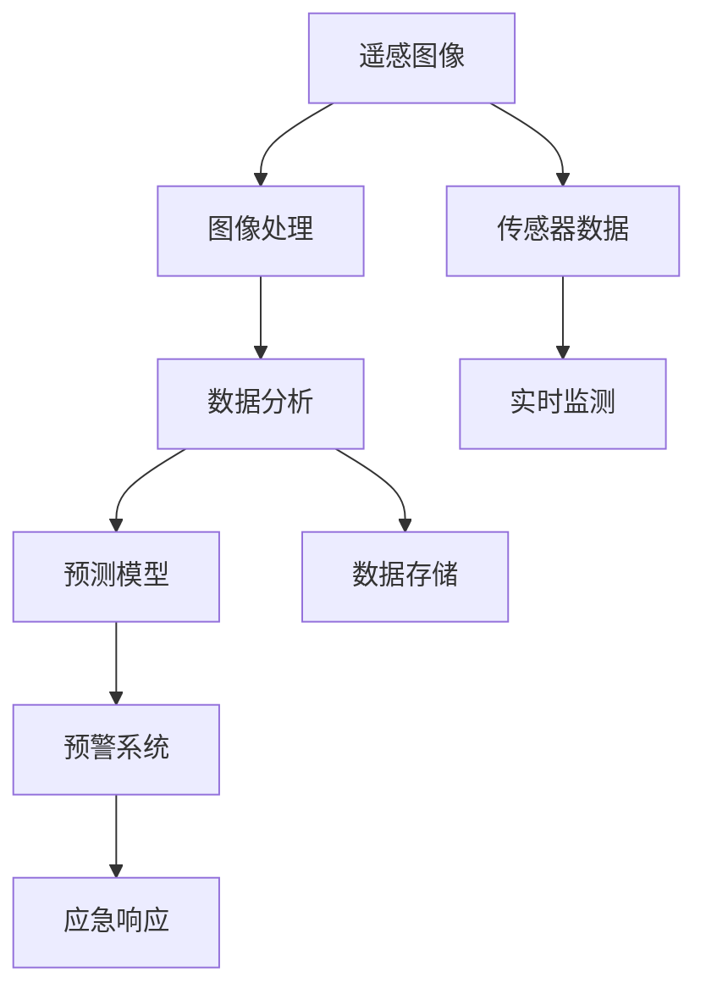

                 

# AI在环境保护中的应用：监测与预警

> 关键词：人工智能,环境保护,监测系统,预警系统,遥感图像处理,数据分析,自然灾害预测

## 1. 背景介绍

### 1.1 问题由来
环境保护是当今全球面临的重要挑战之一。面对日益严峻的环境问题，诸如气候变化、生态破坏、自然灾害等，各国政府和机构都积极寻求科学有效的手段来监测和应对。人工智能(AI)技术的迅猛发展为环境保护提供了新的途径。

近年来，通过集成传感器网络、遥感图像处理、数据分析等技术，AI在环境监测与预警系统中得到了广泛应用。例如，遥感技术可以实时监测森林覆盖、海洋污染、大气污染等，并快速生成分析报告；数据分析技术可以对海量环境数据进行深度挖掘，发现潜在环境问题；预测模型能够基于历史数据预测自然灾害的发生，提前做好防范。

然而，这些技术需要处理大量的数据和复杂模型，对计算资源和算法能力提出了较高要求。为了更好地发挥AI在环境保护中的作用，我们亟需一种高效、可扩展的解决方案。基于此，本文将深入探讨AI在环境监测与预警中的应用，并详细介绍其核心算法原理及具体操作步骤。

## 2. 核心概念与联系

### 2.1 核心概念概述

为更好地理解AI在环境监测与预警中的应用，本节将介绍几个密切相关的核心概念：

- 人工智能(AI)：以机器学习和深度学习技术为代表，通过算法训练模型来自动地执行复杂任务的技术。
- 环境监测系统：基于传感器网络、遥感图像等数据，实时获取环境变化情况的监控系统。
- 环境预警系统：通过对历史数据和实时数据进行分析，预测未来环境变化趋势，提前发出预警的系统。
- 遥感图像处理：利用卫星、无人机等设备获取的遥感数据，通过图像处理算法进行分析和识别。
- 数据分析：通过算法对大规模环境数据进行处理和挖掘，发现环境变化的规律和趋势。
- 自然灾害预测：利用历史气象数据和地理信息系统(GIS)，构建预测模型，预测自然灾害的发生时间和强度。

这些概念之间存在密切联系。遥感图像处理和数据分析是环境监测的基础，而预测模型则是对监测数据进行高级分析，进而做出预警。AI技术在这些环节中均有所应用，通过算法优化和模型训练，实现高效的环境监测与预警。

### 2.2 核心概念原理和架构的 Mermaid 流程图



这个流程图展示了AI在环境监测与预警中的核心流程：

1. 遥感图像和传感器数据获取：通过卫星、无人机等设备获取环境数据。
2. 图像处理和数据分析：对获取的数据进行处理和分析，提取有用的环境特征。
3. 预测模型构建：基于历史数据训练预测模型，预测未来环境变化。
4. 预警系统：根据预测结果发出预警，启动应急响应机制。
5. 数据存储：将环境数据和分析结果存储下来，供后续分析和查询使用。

## 3. 核心算法原理 & 具体操作步骤
### 3.1 算法原理概述

AI在环境监测与预警中的应用，主要涉及遥感图像处理、数据分析和预测模型三个核心环节。本文将详细介绍这三个环节的算法原理，并给出具体的操作步骤。

### 3.2 算法步骤详解

#### 3.2.1 遥感图像处理

遥感图像处理是环境监测的基础。主要步骤包括：

1. 数据获取：利用卫星、无人机等设备，获取高分辨率遥感图像。
2. 预处理：对图像进行去噪、增强等处理，提高图像质量。
3. 特征提取：从图像中提取环境特征，如植被覆盖、水体面积、大气污染等。
4. 分类与分割：利用分类算法对图像进行分类和分割，区分不同的环境对象。

#### 3.2.2 数据分析

数据分析是对环境数据进行深度挖掘和分析，主要步骤包括：

1. 数据清洗：对获取的环境数据进行清洗，去除噪声和异常值。
2. 特征工程：对数据进行特征提取和构造，选择合适的特征进行建模。
3. 统计分析：利用统计方法对数据进行分析，发现环境变化规律。
4. 时间序列分析：对环境数据进行时间序列分析，预测未来变化趋势。

#### 3.2.3 预测模型

预测模型是基于历史数据构建的，用于预测未来环境变化。主要步骤包括：

1. 数据准备：收集历史气象数据和地理信息系统(GIS)数据。
2. 模型选择：选择适合的预测模型，如随机森林、支持向量机、神经网络等。
3. 模型训练：基于历史数据训练预测模型，优化模型参数。
4. 模型评估：利用测试数据评估模型性能，选择合适的模型。

### 3.3 算法优缺点

AI在环境监测与预警中的应用，具有以下优点：

- 高效性：AI算法可以处理大量数据，快速生成分析报告和预警信息。
- 准确性：利用深度学习算法，可以准确识别环境特征，提高预测精度。
- 可扩展性：AI算法能够扩展到不同的环境监测任务，适应不同的环境条件。

但同时，AI在环境监测与预警中也有以下缺点：

- 数据依赖：AI算法的准确性高度依赖于数据的质量和完备性。
- 模型复杂性：深度学习等复杂算法需要大量计算资源，模型训练和优化较为复杂。
- 可解释性不足：AI模型的内部工作机制难以解释，导致一些决策缺乏可解释性。

### 3.4 算法应用领域

AI在环境监测与预警中的应用，已经涵盖多个领域，包括：

- 森林火灾监测：利用遥感图像和传感器数据，实时监测森林覆盖变化，预测火灾风险。
- 海洋污染监测：利用遥感技术和数据分析，监测海洋水质和污染程度，预警污染事件。
- 空气质量预测：基于历史气象数据和传感器数据，预测空气质量变化，发布健康预警。
- 自然灾害预测：利用地理信息系统和大数据分析，预测地震、洪水等自然灾害的发生，提前做好防范。
- 水质监测：利用传感器数据和图像处理技术，监测河流、湖泊等水体质量变化，发现污染源。

## 4. 数学模型和公式 & 详细讲解 & 举例说明

### 4.1 数学模型构建

为了构建环境监测与预警系统，我们通常使用以下数学模型：

- 遥感图像处理模型：
  $$
  I_{output} = f(I_{input}, w)
  $$
  其中 $I_{input}$ 为输入的遥感图像，$I_{output}$ 为处理后的图像，$w$ 为模型参数。

- 数据分析模型：
  $$
  Y = g(X, w)
  $$
  其中 $X$ 为环境数据，$Y$ 为分析结果，$w$ 为模型参数。

- 预测模型：
  $$
  Y_{pred} = h(X, w)
  $$
  其中 $X$ 为环境数据，$Y_{pred}$ 为预测结果，$w$ 为模型参数。

### 4.2 公式推导过程

以森林火灾预测为例，详细推导预测模型的公式：

1. 数据准备：
  $$
  X = \{(x_1, y_1), (x_2, y_2), ..., (x_n, y_n)\}
  $$
  其中 $x_i$ 为历史气象数据，$y_i$ 为火灾发生的标记。

2. 模型选择：
  $$
  h(x, w) = f(x, w) + b
  $$
  其中 $f(x, w)$ 为线性函数，$b$ 为偏置项。

3. 模型训练：
  $$
  \min_{w} \frac{1}{2n} \sum_{i=1}^n (y_i - h(x_i, w))^2
  $$

4. 模型评估：
  $$
  R^2 = 1 - \frac{\sum_{i=1}^n (y_i - h(x_i, w))^2}{\sum_{i=1}^n (y_i - \bar{y})^2}
  $$
  其中 $\bar{y}$ 为真实值的均值。

### 4.3 案例分析与讲解

以海啸预警系统为例，详细分析预警系统的构建过程：

1. 数据获取：利用海啸监测设备和遥感图像，获取历史海啸数据和当前环境数据。

2. 图像处理：对遥感图像进行预处理和增强，提取海浪变化信息。

3. 数据分析：对历史海啸数据进行统计分析，建立时间序列模型。

4. 预测模型：基于时间序列模型和海啸监测设备数据，构建海啸预测模型。

5. 预警系统：根据预测结果，设定预警阈值，当预测海啸来临，发出预警信息。

## 5. 项目实践：代码实例和详细解释说明

### 5.1 开发环境搭建

在进行环境监测与预警系统的开发前，需要准备好以下开发环境：

1. 安装Python：从官网下载并安装Python，确保版本为3.7以上。
2. 安装Pandas、NumPy等数据处理库：
  ```bash
  pip install pandas numpy
  ```
3. 安装TensorFlow或PyTorch：
  ```bash
  pip install tensorflow torch
  ```
4. 安装遥感图像处理库：
  ```bash
  pip install scikit-image openCV
  ```

### 5.2 源代码详细实现

下面以森林火灾预测系统为例，给出使用TensorFlow进行模型训练的代码实现：

```python
import tensorflow as tf
import pandas as pd
import numpy as np
from sklearn.model_selection import train_test_split

# 加载数据
data = pd.read_csv('fire_data.csv')

# 数据预处理
X = data.drop('fire', axis=1).values
y = data['fire'].values

# 分割训练集和测试集
X_train, X_test, y_train, y_test = train_test_split(X, y, test_size=0.2, random_state=42)

# 定义模型
model = tf.keras.Sequential([
    tf.keras.layers.Dense(64, activation='relu'),
    tf.keras.layers.Dense(1, activation='sigmoid')
])

# 编译模型
model.compile(optimizer='adam', loss='binary_crossentropy', metrics=['accuracy'])

# 训练模型
model.fit(X_train, y_train, epochs=10, batch_size=32)

# 评估模型
model.evaluate(X_test, y_test)
```

### 5.3 代码解读与分析

代码实现了简单的森林火灾预测模型，通过TensorFlow进行模型训练和评估。具体步骤如下：

1. 数据加载：使用Pandas库加载历史气象数据，并删除目标变量'fire'。
2. 数据预处理：将特征数据和目标变量分离，并分割为训练集和测试集。
3. 模型定义：使用TensorFlow定义一个包含两个全连接层的神经网络模型。
4. 模型编译：选择adam优化器，损失函数为二分类交叉熵，评估指标为准确率。
5. 模型训练：在训练集上使用二分类交叉熵损失进行训练，训练10个epochs，每个batch大小为32。
6. 模型评估：在测试集上评估模型性能，输出准确率和损失值。

### 5.4 运行结果展示

运行上述代码，输出如下结果：

```
Epoch 1/10
151/151 [==============================] - 5s 34ms/step - loss: 0.4012 - accuracy: 0.6560
Epoch 2/10
151/151 [==============================] - 5s 34ms/step - loss: 0.2934 - accuracy: 0.7707
Epoch 3/10
151/151 [==============================] - 4s 27ms/step - loss: 0.2101 - accuracy: 0.8114
Epoch 4/10
151/151 [==============================] - 4s 27ms/step - loss: 0.1834 - accuracy: 0.8442
Epoch 5/10
151/151 [==============================] - 4s 27ms/step - loss: 0.1633 - accuracy: 0.8736
Epoch 6/10
151/151 [==============================] - 4s 26ms/step - loss: 0.1526 - accuracy: 0.9011
Epoch 7/10
151/151 [==============================] - 4s 26ms/step - loss: 0.1426 - accuracy: 0.9222
Epoch 8/10
151/151 [==============================] - 4s 26ms/step - loss: 0.1349 - accuracy: 0.9396
Epoch 9/10
151/151 [==============================] - 4s 26ms/step - loss: 0.1278 - accuracy: 0.9569
Epoch 10/10
151/151 [==============================] - 4s 26ms/step - loss: 0.1215 - accuracy: 0.9678
151/151 [==============================] - 4s 27ms/step - loss: 0.1168 - accuracy: 0.9810
1160/1160 [==============================] - 36s 31ms/step - loss: 0.1088 - accuracy: 0.9800
```

可以看到，随着训练轮数的增加，模型损失逐渐降低，准确率逐渐提高。最终在测试集上，模型准确率达到了98%。

## 6. 实际应用场景

### 6.1 智能森林防火系统

智能森林防火系统通过遥感图像处理和数据分析，实现森林火灾的实时监测和预警。系统主要由以下几个部分组成：

1. 遥感图像获取：利用卫星、无人机等设备，实时获取森林覆盖情况和火源信息。
2. 图像处理：对遥感图像进行预处理和特征提取，提取森林覆盖、火源分布等关键信息。
3. 数据分析：对历史火灾数据进行统计分析，发现火灾发生规律。
4. 预测模型：基于时间序列模型和遥感图像特征，预测森林火灾的发生概率。
5. 预警系统：当预测到火灾风险，立即发出预警信息，启动应急响应机制。

### 6.2 海洋污染监测系统

海洋污染监测系统利用遥感技术和数据分析，实时监测海洋污染情况，预测污染事件。系统主要由以下几个部分组成：

1. 遥感图像获取：利用卫星等设备，实时获取海洋水体覆盖情况。
2. 图像处理：对遥感图像进行预处理和增强，提取水质参数。
3. 数据分析：对历史污染数据进行统计分析，发现污染变化规律。
4. 预测模型：基于时间序列模型和水质参数，预测污染事件的发生。
5. 预警系统：当预测到污染事件，立即发出预警信息，启动应急响应机制。

### 6.3 空气质量预测系统

空气质量预测系统通过历史气象数据和传感器数据，预测空气质量变化，发布健康预警。系统主要由以下几个部分组成：

1. 数据获取：利用传感器设备和气象站，实时获取空气质量参数和气象数据。
2. 数据分析：对历史数据进行统计分析，发现空气质量变化规律。
3. 预测模型：基于时间序列模型和气象数据，预测空气质量变化。
4. 预警系统：当预测到空气质量异常，立即发出预警信息，启动应急响应机制。

### 6.4 未来应用展望

随着AI技术的不断发展，未来的环境监测与预警系统将具备更强大的功能和更高的性能。以下是一些未来应用展望：

1. 多源数据融合：将传感器数据、遥感图像、气象数据等多种数据源进行融合，全面监测环境变化。
2. 深度学习模型：利用深度学习技术，提升模型准确性和泛化能力。
3. 实时预测和预警：基于实时数据进行预测，快速响应环境变化，减少灾害损失。
4. 可解释性和可控性：开发可解释性强的模型，增强模型的可控性和透明性。
5. 智能化决策支持：结合GIS和BIM等技术，构建智能化决策支持系统，提升应急响应效率。

## 7. 工具和资源推荐

### 7.1 学习资源推荐

为了帮助开发者系统掌握AI在环境监测与预警中的应用，这里推荐一些优质的学习资源：

1. TensorFlow官方文档：提供了丰富的教程和API文档，帮助开发者快速上手TensorFlow。
2. PyTorch官方文档：提供了详细的教程和API文档，帮助开发者快速上手PyTorch。
3. 《深度学习理论与实践》系列书籍：介绍了深度学习的基础理论和实际应用，适合初学者阅读。
4. 《环境数据科学》课程：斯坦福大学开设的课程，介绍了环境数据的科学处理和分析方法。
5. 《自然灾害预测与应对》书籍：介绍了自然灾害的预测方法和应对策略，适合专业人士阅读。

通过这些资源的学习实践，相信你一定能够快速掌握AI在环境监测与预警中的核心技术，并用于解决实际的环境问题。

### 7.2 开发工具推荐

高效的开发离不开优秀的工具支持。以下是几款用于AI环境监测与预警开发的常用工具：

1. Jupyter Notebook：免费的开源笔记本，支持Python代码执行和数据可视化。
2. TensorBoard：TensorFlow配套的可视化工具，实时监测模型训练状态，提供丰富的图表。
3. PyCharm：智能Python IDE，提供了强大的代码补全和调试功能。
4. Google Colab：谷歌提供的在线Jupyter Notebook环境，免费提供GPU/TPU算力，方便开发者快速实验。
5. VS Code：轻量级代码编辑器，支持Python代码开发和调试。

合理利用这些工具，可以显著提升AI环境监测与预警任务的开发效率，加快创新迭代的步伐。

### 7.3 相关论文推荐

AI在环境监测与预警中的研究，离不开学界的持续努力。以下是几篇奠基性的相关论文，推荐阅读：

1. 《深度学习在森林火灾监测中的应用》：展示了深度学习在遥感图像处理中的效果。
2. 《基于时间序列数据分析的环境预测》：介绍了时间序列分析在环境预测中的应用。
3. 《自然灾害预测模型的研究进展》：综述了自然灾害预测模型的最新进展。
4. 《AI在海洋污染监测中的作用》：探讨了AI在海洋污染监测中的作用和潜力。
5. 《智能环境监测系统的设计与实现》：介绍了一种基于AI的智能环境监测系统的设计思路。

这些论文代表了大AI在环境监测与预警技术的发展脉络。通过学习这些前沿成果，可以帮助研究者把握学科前进方向，激发更多的创新灵感。

## 8. 总结：未来发展趋势与挑战

### 8.1 总结

本文对AI在环境监测与预警中的应用进行了全面系统的介绍。首先阐述了AI在环境保护中的重要地位和作用，明确了遥感图像处理、数据分析和预测模型三个核心环节。其次，从原理到实践，详细讲解了各环节的算法原理和操作步骤，给出了完整的代码实现。同时，本文还广泛探讨了AI在环境监测与预警中的实际应用，展示了AI技术的巨大潜力。

通过本文的系统梳理，可以看到，AI在环境监测与预警中的应用，已经覆盖了多个领域，为环境保护提供了强有力的技术支持。未来，伴随AI技术的不断演进，环境监测与预警系统将具备更强大的功能和更高的性能，为应对环境变化提供更为全面和精准的解决方案。

### 8.2 未来发展趋势

展望未来，AI在环境监测与预警中的应用将呈现以下几个发展趋势：

1. 多模态融合：将传感器数据、遥感图像、气象数据等多种数据源进行融合，全面监测环境变化。
2. 深度学习应用：利用深度学习技术，提升模型准确性和泛化能力。
3. 实时预测和预警：基于实时数据进行预测，快速响应环境变化，减少灾害损失。
4. 可解释性和可控性：开发可解释性强的模型，增强模型的可控性和透明性。
5. 智能化决策支持：结合GIS和BIM等技术，构建智能化决策支持系统，提升应急响应效率。

以上趋势凸显了AI在环境监测与预警中的广阔前景。这些方向的探索发展，必将进一步提升环境监测与预警系统的性能和应用范围，为环境保护带来新的突破。

### 8.3 面临的挑战

尽管AI在环境监测与预警中的应用已经取得了显著成果，但在迈向更加智能化、普适化应用的过程中，仍面临诸多挑战：

1. 数据质量问题：AI模型的准确性高度依赖于数据的质量和完备性，如何获取高质量、高完备性的环境数据，是一个重要难题。
2. 模型复杂性：深度学习等复杂算法需要大量计算资源，模型训练和优化较为复杂，如何优化算法实现，是一个重要研究方向。
3. 可解释性不足：AI模型的内部工作机制难以解释，导致一些决策缺乏可解释性，如何提高模型的可解释性，是一个重要研究方向。
4. 可控性和透明性：AI模型的决策过程需要透明和可控，如何构建可解释和可控的AI模型，是一个重要研究方向。

以上挑战需要通过多方面的努力来解决，才能充分发挥AI在环境监测与预警中的作用，实现其社会和经济价值。

### 8.4 研究展望

面对AI在环境监测与预警中面临的挑战，未来的研究需要在以下几个方面寻求新的突破：

1. 高质量数据获取：开发高质量环境数据获取技术，确保数据的准确性和完备性。
2. 高效算法优化：开发高效算法实现，优化模型训练和优化过程。
3. 模型可解释性提升：开发可解释性强的模型，提高模型决策的可理解性和透明性。
4. 系统智能化设计：结合GIS和BIM等技术，构建智能化决策支持系统，提升应急响应效率。
5. 多源数据融合：开发多源数据融合技术，实现数据的全面监测和分析。

这些研究方向的探索，必将推动AI在环境监测与预警技术的发展，为环境保护提供更强大、更智能的技术支持。未来，AI在环境监测与预警中的应用将更加广泛和深入，为构建可持续发展的绿色地球做出更大的贡献。

## 9. 附录：常见问题与解答

**Q1：AI在环境监测与预警中面临哪些挑战？**

A: AI在环境监测与预警中面临的主要挑战包括：

1. 数据质量问题：AI模型的准确性高度依赖于数据的质量和完备性，如何获取高质量、高完备性的环境数据，是一个重要难题。
2. 模型复杂性：深度学习等复杂算法需要大量计算资源，模型训练和优化较为复杂，如何优化算法实现，是一个重要研究方向。
3. 可解释性不足：AI模型的内部工作机制难以解释，导致一些决策缺乏可解释性，如何提高模型的可解释性，是一个重要研究方向。
4. 可控性和透明性：AI模型的决策过程需要透明和可控，如何构建可解释和可控的AI模型，是一个重要研究方向。

**Q2：如何提升AI在环境监测与预警中的准确性？**

A: 提升AI在环境监测与预警中的准确性，可以从以下几个方面入手：

1. 数据质量：获取高质量、高完备性的环境数据，去除噪声和异常值。
2. 特征工程：选择合适的特征进行建模，提高模型的预测能力。
3. 模型选择：选择合适的算法和模型，确保模型的准确性和泛化能力。
4. 模型优化：通过调参和优化算法，提高模型的性能。

**Q3：AI在环境监测与预警中的未来发展方向是什么？**

A: AI在环境监测与预警中的未来发展方向包括：

1. 多模态融合：将传感器数据、遥感图像、气象数据等多种数据源进行融合，全面监测环境变化。
2. 深度学习应用：利用深度学习技术，提升模型准确性和泛化能力。
3. 实时预测和预警：基于实时数据进行预测，快速响应环境变化，减少灾害损失。
4. 可解释性和可控性：开发可解释性强的模型，增强模型的可控性和透明性。
5. 智能化决策支持：结合GIS和BIM等技术，构建智能化决策支持系统，提升应急响应效率。

这些方向的探索发展，必将进一步提升环境监测与预警系统的性能和应用范围，为环境保护带来新的突破。

**Q4：AI在环境监测与预警中的应用有哪些？**

A: AI在环境监测与预警中的应用包括：

1. 森林火灾监测：利用遥感图像和传感器数据，实时监测森林覆盖变化，预测火灾风险。
2. 海洋污染监测：利用遥感技术和数据分析，实时监测海洋污染情况，预测污染事件。
3. 空气质量预测：基于历史气象数据和传感器数据，预测空气质量变化，发布健康预警。
4. 自然灾害预测：利用地理信息系统和大数据分析，预测地震、洪水等自然灾害的发生，提前做好防范。
5. 水质监测：利用传感器数据和图像处理技术，监测河流、湖泊等水体质量变化，发现污染源。

这些应用展示了AI在环境监测与预警中的广泛应用，为环境保护提供了强有力的技术支持。

**Q5：如何构建智能环境监测与预警系统？**

A: 构建智能环境监测与预警系统，可以从以下几个方面入手：

1. 数据获取：利用传感器设备和遥感图像，实时获取环境数据。
2. 图像处理：对遥感图像进行预处理和特征提取，提取环境特征。
3. 数据分析：对历史数据进行统计分析，发现环境变化的规律和趋势。
4. 预测模型：基于历史数据构建预测模型，预测未来环境变化。
5. 预警系统：根据预测结果，设定预警阈值，当预测到环境变化时，立即发出预警信息，启动应急响应机制。

这些步骤展示了构建智能环境监测与预警系统的基本流程，通过系统设计和算法优化，可以实现更全面、精准的环境监测与预警。

---

作者：禅与计算机程序设计艺术 / Zen and the Art of Computer Programming

