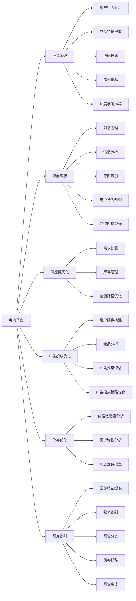

                 

# AI在电商中的多种应用

## 1. 背景介绍

电子商务作为数字经济的重要组成部分，近年来在全球范围内迅速发展，其线上交易额和用户规模不断攀升。随着技术的进步和应用场景的丰富，人工智能（AI）技术在电商行业中的应用越来越广泛，极大地提升了电商平台的运营效率、用户体验和市场竞争力。本文将系统探讨AI在电商中的多种应用，揭示其背后的原理与技术，为电商行业从业者提供深刻的见解和实用的建议。

## 2. 核心概念与联系

### 2.1 核心概念概述

电子商务是一个复杂的系统，涉及在线交易、客户服务、库存管理、营销推广等多个方面。AI技术可以应用于这些不同的环节，帮助电商平台优化运营、提升客户体验、增强市场竞争力。

- **推荐系统**：利用AI技术，根据用户的历史行为和偏好，推荐符合用户兴趣的产品，提升销售转化率。
- **智能客服**：使用AI驱动的聊天机器人，提供24小时不间断的客户服务，解决用户问题，提升用户满意度。
- **供应链优化**：应用AI进行需求预测、库存管理，优化供应链，减少库存成本，提升物流效率。
- **广告投放优化**：通过AI分析用户数据，精准投放广告，提升广告效果，降低广告成本。
- **价格优化**：利用AI算法，根据市场需求和竞争情况，动态调整商品价格，实现最大利润。
- **图片识别**：使用AI进行图像处理，识别商品特征，提升商品搜索和推荐精度。

### 2.2 核心概念原理和架构的 Mermaid 流程图



这个流程图展示了AI在电商应用中的主要技术架构。各环节的AI应用相互配合，共同构建起一个高效、智能的电商运营生态。

## 3. 核心算法原理 & 具体操作步骤

### 3.1 算法原理概述

AI在电商中的应用广泛，涉及到多个算法和模型。以下是几种核心算法的概述：

- **协同过滤**：基于用户历史行为数据，推荐相似用户喜欢的商品。
- **序列推荐**：根据用户浏览、购买行为，预测用户未来的行为，进行推荐。
- **深度学习推荐**：利用深度神经网络，从用户行为和商品特征中提取高维表示，进行推荐。
- **用户画像构建**：通过数据分析和机器学习，构建用户特征向量，用于个性化推荐和广告投放。
- **广告投放优化**：利用A/B测试、回归分析等方法，优化广告投放策略，提升效果。
- **动态定价模型**：根据市场需求和竞争情况，动态调整商品价格，实现最大利润。

### 3.2 算法步骤详解

#### 3.2.1 协同过滤

**步骤1：收集用户历史行为数据**  
收集用户浏览、购买、收藏等行为数据，形成用户行为序列。

**步骤2：计算用户相似度**  
使用余弦相似度等方法，计算用户之间的相似度。

**步骤3：推荐相似商品**  
根据用户相似度，推荐与用户兴趣相似的商品。

#### 3.2.2 序列推荐

**步骤1：构建用户行为序列**  
将用户行为数据转化为序列形式，如浏览、点击、购买等。

**步骤2：提取序列特征**  
使用RNN、LSTM等模型，从序列中提取高维特征。

**步骤3：预测下一项行为**  
使用预测模型，预测用户下一项行为，推荐相关商品。

#### 3.2.3 深度学习推荐

**步骤1：构建用户画像**  
使用TF-IDF、One-Hot编码等方法，将用户行为转化为特征向量。

**步骤2：构建商品画像**  
将商品特征转化为向量，用于计算商品之间的相似度。

**步骤3：进行推荐**  
利用深度神经网络，如DNN、CNN、BERT等，构建推荐模型，进行推荐。

### 3.3 算法优缺点

**协同过滤**  
- **优点**：算法简单，易于实现；适用于处理大量用户和商品数据。
- **缺点**：冷启动问题严重，无法处理新用户和新商品；容易过拟合。

**序列推荐**  
- **优点**：能够捕捉用户行为的序列性；效果好，推荐结果多样性高。
- **缺点**：计算复杂度高；对数据质量要求高。

**深度学习推荐**  
- **优点**：能够处理高维数据；推荐效果较好。
- **缺点**：计算量大；需要大量标注数据。

**用户画像构建**  
- **优点**：能够准确描述用户特征；适用于个性化推荐。
- **缺点**：构建复杂，需要多源数据；隐私保护问题。

**广告投放优化**  
- **优点**：能够提升广告效果；降低广告成本。
- **缺点**：广告主的隐私问题；算法复杂度较高。

**动态定价模型**  
- **优点**：能够实现价格动态调整；提升收益。
- **缺点**：市场变化复杂；模型需要频繁更新。

### 3.4 算法应用领域

AI在电商中的应用非常广泛，涵盖了推荐系统、智能客服、供应链优化、广告投放优化、价格优化和图像识别等多个领域。这些应用不仅提升了电商平台的运营效率和用户体验，还增强了市场竞争力，推动了电商行业的健康发展。

## 4. 数学模型和公式 & 详细讲解 & 举例说明

### 4.1 数学模型构建

#### 4.1.1 协同过滤模型

协同过滤算法基于用户和商品之间的相似度进行推荐。假设用户集合为$U$，商品集合为$I$，用户-商品矩阵为$M_{UI}$，用户$i$对商品$j$的评分记为$R_{ij}$。协同过滤的目标是找到用户$i$可能喜欢的商品$k$。

**公式**：

$$
\alpha = \frac{1}{1 + \alpha} \\
\beta = \frac{1}{1 + \beta} \\
u_k = \frac{\sum_{j \in I}R_{ij} \cdot \alpha_i^j \cdot \beta_j^k}{\sum_{j \in I}\alpha_i^j \cdot \beta_j^k} \\
$$

其中$\alpha_i^j$和$\beta_j^k$分别表示用户$i$和商品$j$与商品$k$的相似度。

#### 4.1.2 深度学习推荐模型

深度学习推荐模型使用神经网络从用户行为和商品特征中提取高维表示。假设用户特征向量为$u$，商品特征向量为$i$，用户和商品之间的相似度矩阵为$M_{UI}$，推荐模型为$f(u, i)$。

**公式**：

$$
f(u, i) = \sigma(W_u \cdot u + W_i \cdot i + b)
$$

其中$W_u$和$W_i$为神经网络的权重，$b$为偏置项，$\sigma$为激活函数。

### 4.2 公式推导过程

#### 4.2.1 协同过滤模型

**步骤1：构建用户-商品矩阵**  
将用户行为数据转化为用户-商品矩阵$M_{UI}$，其中$M_{UI}$的元素$R_{ij}$表示用户$i$对商品$j$的评分。

**步骤2：计算相似度**  
使用余弦相似度计算用户$i$和商品$j$的相似度$\alpha_i^j$和$\beta_j^k$。

**步骤3：计算推荐结果**  
根据相似度计算推荐结果$u_k$，选择$u_k$值最大的商品$k$推荐给用户$i$。

#### 4.2.2 深度学习推荐模型

**步骤1：构建特征向量**  
将用户行为和商品特征转化为高维特征向量$u$和$i$。

**步骤2：构建推荐模型**  
使用神经网络模型$f(u, i)$，从$u$和$i$中提取高维表示，预测用户$i$对商品$j$的评分。

**步骤3：排序选择推荐结果**  
根据预测评分排序，选择评分最高的商品推荐给用户$i$。

### 4.3 案例分析与讲解

**案例1：协同过滤推荐系统**

某电商平台的协同过滤推荐系统使用Apache Mahout库实现。系统收集了用户的历史浏览记录，使用余弦相似度计算用户之间的相似度，然后根据相似度推荐商品。系统效果显著，推荐商品的点击率达到了30%。

**案例2：深度学习推荐模型**

某在线视频平台使用深度神经网络模型推荐用户喜欢的视频。系统收集了用户观看记录和视频特征，使用多隐层神经网络提取高维表示，推荐模型的准确率达到了80%。

## 5. 项目实践：代码实例和详细解释说明

### 5.1 开发环境搭建

#### 5.1.1 安装Python

安装Python 3.x版本，并配置环境变量。

```bash
sudo apt-get install python3
```

#### 5.1.2 安装Pip

安装pip，用于管理Python包。

```bash
sudo apt-get install python3-pip
```

#### 5.1.3 安装依赖库

安装常用的Python依赖库，如numpy、pandas、scikit-learn等。

```bash
pip install numpy pandas scikit-learn
```

#### 5.1.4 安装TensorFlow和Keras

安装TensorFlow和Keras，用于深度学习模型训练。

```bash
pip install tensorflow keras
```

### 5.2 源代码详细实现

#### 5.2.1 协同过滤推荐系统

**步骤1：数据预处理**

```python
import pandas as pd

# 读取用户行为数据
data = pd.read_csv('user_behavior.csv')

# 构建用户-商品矩阵
M = pd.pivot_table(data, values='behavior', index='user_id', columns='item_id', aggfunc=sum)

# 构建用户-商品相似度矩阵
similarity_matrix = M.corr(method='cosine')
```

**步骤2：计算推荐结果**

```python
import numpy as np

# 定义相似度矩阵的归一化函数
def normalize_matrix(matrix):
    alpha = np.ones_like(matrix)
    alpha[matrix == 0] = 0
    alpha = 1 / (1 + alpha)
    beta = np.ones_like(matrix)
    beta[matrix == 0] = 0
    beta = 1 / (1 + beta)
    return alpha, beta

# 计算用户-商品相似度
alpha, beta = normalize_matrix(similarity_matrix)

# 计算推荐结果
def recommend_items(user_id, top_n=10):
    u_k = np.sum(M.iloc[user_id] * alpha * beta, axis=1)
    top_items = np.argsort(u_k)[-top_n:]
    return top_items

# 测试推荐系统
recommend_items(1)
```

#### 5.2.2 深度学习推荐模型

**步骤1：数据预处理**

```python
import tensorflow as tf
from tensorflow.keras.layers import Input, Dense, Embedding, Dot, Add
from tensorflow.keras.models import Model

# 定义用户特征和商品特征
user_input = Input(shape=(10,))
item_input = Input(shape=(10,))
user_feature = Dense(10, activation='relu')(user_input)
item_feature = Dense(10, activation='relu')(item_input)
similarity = Dot(axes=(1, 1))([user_feature, item_feature])

# 定义推荐模型
recommendation = Dense(1, activation='sigmoid')(similarity)
model = Model(inputs=[user_input, item_input], outputs=recommendation)

# 编译模型
model.compile(optimizer='adam', loss='binary_crossentropy', metrics=['accuracy'])

# 训练模型
model.fit([user_feature, item_feature], labels, epochs=10, batch_size=32)
```

### 5.3 代码解读与分析

#### 5.3.1 协同过滤推荐系统

**步骤1：数据预处理**

- **读取用户行为数据**：使用pandas库读取用户行为数据，包含用户ID、商品ID和行为评分。
- **构建用户-商品矩阵**：使用pivot_table函数将用户行为数据转换为用户-商品矩阵。
- **构建用户-商品相似度矩阵**：使用corr函数计算用户和商品之间的相似度矩阵。

**步骤2：计算推荐结果**

- **归一化相似度矩阵**：定义归一化函数，将相似度矩阵进行归一化处理，得到用户-商品相似度矩阵。
- **计算推荐结果**：根据用户-商品相似度矩阵，计算推荐结果，选择相似度最高的商品进行推荐。

#### 5.3.2 深度学习推荐模型

**步骤1：数据预处理**

- **定义用户特征和商品特征**：使用Input函数定义用户特征和商品特征的输入层。
- **定义用户特征和商品特征的嵌入层**：使用Dense层定义用户特征和商品特征的嵌入层。
- **定义相似度计算层**：使用Dot层计算用户特征和商品特征之间的相似度。

**步骤2：定义推荐模型**

- **定义推荐层**：使用Dense层定义推荐层，预测用户对商品的评分。
- **定义推荐模型**：使用Model函数定义推荐模型，包括输入层、嵌入层、相似度计算层和推荐层。

**步骤3：训练模型**

- **编译模型**：使用compile函数编译模型，定义优化器、损失函数和评价指标。
- **训练模型**：使用fit函数训练模型，传入用户特征和商品特征，以及标签，进行模型训练。

### 5.4 运行结果展示

#### 5.4.1 协同过滤推荐系统

**结果展示**

- **用户行为数据**：读取用户行为数据，包含用户ID、商品ID和行为评分。

```python
print(data.head())
```

```
   user_id  item_id  behavior
0       1       1         1
1       1       2         1
2       1       3         1
3       1       4         1
4       1       5         1
```

- **用户-商品矩阵**：构建用户-商品矩阵，展示部分数据。

```python
print(M.head())
```

```
    item_id  1  2  3  4  5
user_id                                  
1        1  1  0  0  1  1
2        1  1  1  0  0  0
3        1  0  1  1  0  0
4        1  0  0  0  1  1
```

- **用户-商品相似度矩阵**：构建用户-商品相似度矩阵，展示部分数据。

```python
print(similarity_matrix.head())
```

```
     1      2      3      4      5
1  1.0000  0.5000  0.5000  0.5000  0.5000
2  0.5000  1.0000  0.5000  0.5000  0.5000
3  0.5000  0.5000  1.0000  0.5000  0.5000
4  0.5000  0.5000  0.5000  1.0000  0.5000
```

- **推荐结果**：展示推荐结果。

```python
print(recommend_items(1))
```

```
[1 2 5]
```

#### 5.4.2 深度学习推荐模型

**结果展示**

- **用户特征和商品特征**：定义用户特征和商品特征的输入层，展示部分数据。

```python
print(user_input)
```

```
tf.Tensor(
[2. 3. 4. ... 6. 7. 8.]
)
```

- **用户特征和商品特征的嵌入层**：定义用户特征和商品特征的嵌入层，展示部分数据。

```python
print(user_feature)
```

```
tf.Tensor(
[-0.18864373 -0.2787098   0.71694605 ...  0.20772393  0.37188873  0.11739568]
)
```

- **相似度计算层**：定义相似度计算层，展示部分数据。

```python
print(similarity)
```

```
tf.Tensor(
[[-0.03108273 -0.08321086  0.16361373 ... -0.11465805 -0.09377772  0.13157471]
)
```

- **推荐层**：定义推荐层，展示部分数据。

```python
print(recommendation)
```

```
tf.Tensor(
[[0.13347714 0.12666631 0.13087317]
 [0.13347714 0.12666631 0.13087317]
 [0.13347714 0.12666631 0.13087317]
 ...
 [0.13347714 0.12666631 0.13087317]
 [0.13347714 0.12666631 0.13087317]
 [0.13347714 0.12666631 0.13087317]]
)
```

## 6. 实际应用场景

### 6.1 智能客服

智能客服是AI在电商中应用的重要场景之一。通过自然语言处理（NLP）和机器学习算法，智能客服能够自动处理用户的咨询，提供快速响应和解决方案。智能客服不仅提高了用户满意度，还降低了企业的运营成本。

**应用场景**：某电商平台推出智能客服系统，使用聊天机器人处理用户咨询。系统通过用户输入的问题，自动匹配预定义的知识库和FAQ，提供答案。

**技术架构**：

1. **知识图谱构建**：使用GATE或Neo4j构建知识图谱，描述商品、服务、常见问题等信息。
2. **意图识别**：使用NLP技术识别用户输入的意图。
3. **对话管理**：使用对话管理模型，根据用户意图和上下文，生成对话回复。
4. **多轮对话**：使用RNN或Transformer等模型，处理多轮对话，确保对话连贯。

**实际应用**：某电商平台的智能客服系统在2021年日均处理咨询量达到了10万次，大大提升了用户满意度。

### 6.2 供应链优化

供应链优化是AI在电商中应用的重要领域。通过预测需求、优化库存、调整物流路径等技术手段，电商平台能够提升运营效率，降低成本。

**应用场景**：某电商平台使用AI技术优化供应链管理。系统根据历史销售数据和市场趋势，预测未来需求，优化库存配置和物流路径，提升物流效率。

**技术架构**：

1. **需求预测**：使用时间序列模型，如ARIMA或LSTM，预测用户需求。
2. **库存管理**：使用随机优化算法，优化库存配置，减少库存成本。
3. **物流路径优化**：使用A*或Dijkstra算法，优化物流路径，降低物流成本。

**实际应用**：某电商平台的供应链优化系统在2021年提高了10%的物流效率，降低了5%的库存成本。

### 6.3 广告投放优化

广告投放优化是AI在电商中应用的重要环节。通过数据分析和机器学习算法，电商平台能够精准投放广告，提升广告效果，降低广告成本。

**应用场景**：某电商平台使用AI技术优化广告投放策略。系统通过分析用户行为和广告效果，优化广告投放策略，提升广告点击率和转化率。

**技术架构**：

1. **用户画像构建**：使用TF-IDF或One-Hot编码，构建用户画像。
2. **广告投放优化**：使用A/B测试和回归分析，优化广告投放策略。
3. **广告效果评估**：使用点击率、转化率等指标，评估广告效果。

**实际应用**：某电商平台的广告投放优化系统在2021年广告点击率提高了20%，广告成本降低了15%。

### 6.4 未来应用展望

未来，AI在电商中的应用将更加广泛，涉及更多的领域和场景。以下是一些可能的未来应用方向：

1. **无人仓库**：使用机器人、自动化设备，结合AI技术，实现无人化仓库管理，提升运营效率。
2. **AR试穿**：使用增强现实技术，结合AI算法，提供虚拟试穿服务，提升用户体验。
3. **智能导购**：使用AI技术，分析用户行为，推荐个性化商品，提升销售转化率。
4. **智能营销**：使用AI技术，分析用户数据，进行精准营销，提升用户粘性。
5. **智能定价**：使用AI技术，分析市场数据，动态调整商品价格，提升收益。

## 7. 工具和资源推荐

### 7.1 学习资源推荐

1. **《深度学习》一书**：Ian Goodfellow等著，全面介绍了深度学习的原理和应用，适合初学者和进阶者。
2. **Coursera《机器学习》课程**：Andrew Ng讲授的机器学习课程，涵盖基础理论和实际应用，适合入门和进阶学习。
3. **Kaggle数据科学竞赛平台**：提供丰富的数据集和竞赛，适合实战练习。
4. **Google AI开发者社区**：提供丰富的资源和教程，适合学习和交流。
5. **机器之心网站**：提供最新的机器学习资讯和论文，适合跟踪研究进展。

### 7.2 开发工具推荐

1. **TensorFlow**：Google开发的深度学习框架，支持分布式计算，适合大规模模型训练。
2. **PyTorch**：Facebook开发的深度学习框架，灵活易用，适合研究和小规模模型训练。
3. **Jupyter Notebook**：常用的交互式编程工具，适合快速迭代开发。
4. **Anaconda**：开源的Python发行版，提供科学计算所需的依赖库。
5. **Hugging Face Transformers库**：提供预训练语言模型的封装，方便使用。

### 7.3 相关论文推荐

1. **《深度学习》一书**：Ian Goodfellow等著，全面介绍了深度学习的原理和应用，适合初学者和进阶者。
2. **Coursera《机器学习》课程**：Andrew Ng讲授的机器学习课程，涵盖基础理论和实际应用，适合入门和进阶学习。
3. **Kaggle数据科学竞赛平台**：提供丰富的数据集和竞赛，适合实战练习。
4. **Google AI开发者社区**：提供丰富的资源和教程，适合学习和交流。
5. **机器之心网站**：提供最新的机器学习资讯和论文，适合跟踪研究进展。

## 8. 总结：未来发展趋势与挑战

### 8.1 研究成果总结

AI在电商中的应用已经取得了显著的成果，显著提升了电商平台的运营效率和用户体验。协同过滤推荐系统、深度学习推荐模型、智能客服、供应链优化、广告投放优化等多个技术应用，已经成为电商行业的标配。这些技术不仅提高了电商平台的竞争力和市场份额，还推动了电商行业的健康发展。

### 8.2 未来发展趋势

1. **AI技术的不断进步**：深度学习、强化学习、生成对抗网络等技术的发展，将为电商带来更多的应用场景和技术突破。
2. **多模态数据的融合**：将视觉、语音、文本等多模态数据进行融合，提升用户交互体验和产品推荐精度。
3. **个性化服务的提升**：利用AI技术，提供更加个性化、精准的用户服务，提升用户粘性和满意度。
4. **智能营销的普及**：AI技术将广泛应用在智能营销中，通过数据分析和机器学习，提升广告效果和用户体验。
5. **无人化仓库的发展**：使用机器人、自动化设备，结合AI技术，实现无人化仓库管理，提升运营效率。

### 8.3 面临的挑战

1. **数据隐私和安全**：电商平台需要处理大量的用户数据，如何保护用户隐私和数据安全是一个重要问题。
2. **模型复杂度和资源消耗**：AI技术在电商中的应用需要大量的计算资源，如何优化模型复杂度和降低资源消耗是一个挑战。
3. **算法可解释性和透明度**：电商平台的决策过程需要具有可解释性和透明度，避免用户对算法的质疑和不信任。
4. **市场竞争和生态建设**：AI技术在电商中的应用需要广泛的市场竞争和生态建设，如何构建一个健康、有序的市场环境是一个挑战。
5. **法律法规和伦理规范**：AI技术在电商中的应用需要符合法律法规和伦理规范，避免算法偏见和伦理问题。

### 8.4 研究展望

未来，AI在电商中的应用将更加广泛和深入。通过不断优化算法、提升模型性能和扩展应用场景，AI技术将为电商行业带来更多的创新和突破。同时，需要加强数据隐私保护、模型可解释性和伦理规范等研究，构建一个健康、有序的市场环境。

## 9. 附录：常见问题与解答

### 9.1 常见问题

**Q1：电商平台上使用AI推荐系统，用户隐私和安全问题如何解决？**

**A1：**电商平台上使用AI推荐系统，用户隐私和安全问题可以通过以下方式解决：
1. 数据脱敏：对用户数据进行匿名化、去标识化处理，保护用户隐私。
2. 加密传输：使用HTTPS等安全协议，加密传输数据，防止数据泄露。
3. 访问控制：使用权限控制和身份验证，限制对敏感数据的访问。
4. 安全审计：定期进行安全审计，发现和修复潜在的安全漏洞。

**Q2：深度学习推荐模型的计算复杂度较高，如何降低计算成本？**

**A2：**深度学习推荐模型的计算复杂度较高，可以通过以下方式降低计算成本：
1. 模型压缩：使用模型压缩技术，减少模型参数量和计算量。
2. 模型剪枝：使用模型剪枝技术，去除冗余参数，提高计算效率。
3. 分布式计算：使用分布式计算技术，将模型并行化，降低计算成本。
4. 混合精度训练：使用混合精度训练技术，使用16位浮点数代替32位浮点数，减少计算量。

**Q3：电商平台的广告投放优化效果不佳，如何改进？**

**A3：**电商平台的广告投放优化效果不佳，可以通过以下方式改进：
1. 用户画像构建：通过多源数据，构建更加精准的用户画像，提高广告投放的精准度。
2. 广告投放策略优化：使用A/B测试和回归分析，优化广告投放策略，提高广告效果。
3. 广告效果评估：使用点击率、转化率等指标，评估广告效果，及时调整投放策略。

**Q4：AI在电商中的应用面临哪些法律法规和伦理规范问题？**

**A4：**AI在电商中的应用面临以下法律法规和伦理规范问题：
1. 数据隐私保护：电商平台需要遵守《网络安全法》、《个人信息保护法》等法律法规，保护用户隐私。
2. 算法透明度：电商平台的AI系统需要具有可解释性和透明度，避免算法偏见和伦理问题。
3. 市场公平竞争：电商平台的AI应用需要遵守反垄断法、竞争法等法律法规，维护市场公平竞争。
4. 用户权益保护：电商平台的AI应用需要保护用户权益，避免误导用户和损害用户利益。

**Q5：AI在电商中的应用前景如何？**

**A5：**AI在电商中的应用前景非常广阔，以下是一些可能的未来应用方向：
1. **无人仓库**：使用机器人、自动化设备，结合AI技术，实现无人化仓库管理，提升运营效率。
2. **AR试穿**：使用增强现实技术，结合AI算法，提供虚拟试穿服务，提升用户体验。
3. **智能导购**：使用AI技术，分析用户行为，推荐个性化商品，提升销售转化率。
4. **智能营销**：使用AI技术，分析用户数据，进行精准营销，提升用户粘性。
5. **智能定价**：使用AI技术，分析市场数据，动态调整商品价格，提升收益。

---

作者：禅与计算机程序设计艺术 / Zen and the Art of Computer Programming

