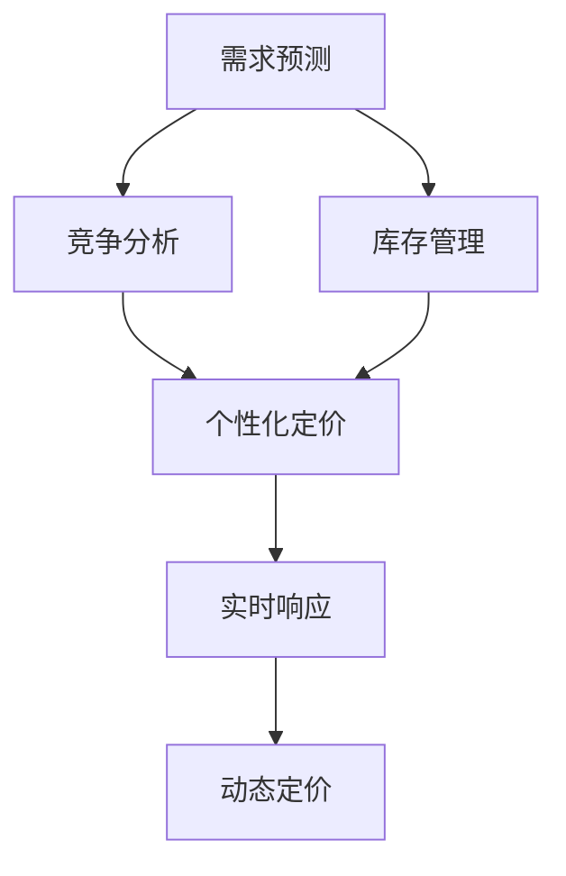

                 

# AI在电商动态定价中的应用

> 关键词：电商动态定价,人工智能,机器学习,需求预测,价格优化,个性化定价

## 1. 背景介绍

### 1.1 问题由来

在电商行业，价格是影响销售量的重要因素之一。传统电商定价方式主要依赖市场调研和经验判断，缺乏数据驱动的决策支持。然而，随着互联网技术的发展和大数据应用的普及，电商企业越来越多地使用AI技术来优化定价策略，以实现动态定价，提升销售额和市场竞争力。

动态定价是指根据市场需求、竞争对手价格、库存量等因素实时调整商品价格的过程。相较于固定价格策略，动态定价能够更灵活地响应市场变化，提高销售效率和利润率。然而，如何实时、精准地进行动态定价，是电商企业面临的一大挑战。

### 1.2 问题核心关键点

动态定价的核心在于如何根据市场需求和竞争环境，实时调整商品价格。该问题需要解决以下几个关键问题：

1. **需求预测**：预测不同时间、地点和促销活动下的需求量，为价格调整提供依据。
2. **竞争分析**：监测竞争对手的价格变化，评估自身价格的竞争力。
3. **库存管理**：根据库存量、销售趋势等因素动态调整价格，避免积压和缺货。
4. **个性化定价**：根据用户行为和属性，进行个性化定价，提高转化率。
5. **实时响应**：在价格调整后实时监控销售数据，评估效果并优化策略。

解决这些问题需要综合运用数据挖掘、机器学习、优化算法等技术手段，构建完善的动态定价系统。

### 1.3 问题研究意义

电商动态定价是AI技术在电商领域的重要应用之一。它不仅能够帮助电商企业优化定价策略，提升销售效率和利润率，还能够实现个性化服务，增强用户体验，增加客户忠诚度。此外，动态定价系统还能够优化库存管理，减少成本浪费，提高供应链效率。因此，深入研究动态定价问题，具有重要的理论和实践意义。

## 2. 核心概念与联系

### 2.1 核心概念概述

为更好地理解动态定价的AI应用，本节将介绍几个密切相关的核心概念：

- **动态定价**：根据市场需求和竞争环境，实时调整商品价格的过程。动态定价能够更灵活地响应市场变化，提高销售效率和利润率。
- **需求预测**：预测不同时间、地点和促销活动下的需求量，为价格调整提供依据。
- **竞争分析**：监测竞争对手的价格变化，评估自身价格的竞争力。
- **库存管理**：根据库存量、销售趋势等因素动态调整价格，避免积压和缺货。
- **个性化定价**：根据用户行为和属性，进行个性化定价，提高转化率。
- **实时响应**：在价格调整后实时监控销售数据，评估效果并优化策略。

这些核心概念之间的逻辑关系可以通过以下Mermaid流程图来展示：



这个流程图展示了一个基于动态定价的电商系统的主要流程：

1. 首先，通过需求预测获取市场需求信息。
2. 然后，结合竞争分析，确定自身的价格策略。
3. 接着，根据库存管理信息，调整价格策略。
4. 进行个性化定价，针对不同用户或场景，设置差异化价格。
5. 最后，实时响应价格调整效果，不断优化策略。

这些核心概念共同构成了电商动态定价系统的基本框架，使其能够灵活、高效地进行价格调整，满足市场变化。

## 3. 核心算法原理 & 具体操作步骤

### 3.1 算法原理概述

动态定价的核心在于根据市场需求和竞争环境，实时调整商品价格。其核心算法包括需求预测、竞争分析、库存管理、个性化定价和实时响应等多个环节。本文将详细介绍其中的核心算法原理和操作步骤。

### 3.2 算法步骤详解

#### 3.2.1 需求预测

需求预测是动态定价的基础。其核心在于使用历史销售数据、天气、节假日、促销活动等因素，构建需求预测模型。常见的需求预测模型包括时间序列模型、回归模型和机器学习模型等。

具体算法步骤如下：

1. **数据预处理**：收集历史销售数据、天气、节假日、促销活动等影响因素数据，进行数据清洗和归一化处理。
2. **特征工程**：提取时间、日期、季节、促销活动等特征，并进行特征编码。
3. **模型选择**：选择合适的预测模型，如ARIMA、SARIMA、LSTM、GRU等。
4. **模型训练**：使用历史数据训练模型，评估预测效果。
5. **模型评估**：使用交叉验证等方法评估模型泛化能力，调整参数。

#### 3.2.2 竞争分析

竞争分析是动态定价的重要环节。其核心在于监测竞争对手的价格变化，评估自身价格的竞争力。

具体算法步骤如下：

1. **数据采集**：采集竞争对手的实时价格数据，进行数据清洗和归一化处理。
2. **价格分析**：使用时间序列分析、回归分析等方法，评估竞争对手价格的波动趋势。
3. **策略调整**：根据竞争对手价格的变化，调整自身价格策略。
4. **风险评估**：评估价格调整的风险，避免价格战。

#### 3.2.3 库存管理

库存管理是动态定价的关键环节。其核心在于根据库存量、销售趋势等因素动态调整价格，避免积压和缺货。

具体算法步骤如下：

1. **数据采集**：收集库存量、历史销售数据、库存周期等数据。
2. **库存分析**：使用时间序列分析、回归分析等方法，预测库存量变化趋势。
3. **价格调整**：根据库存量变化趋势，动态调整价格策略。
4. **库存预警**：设置库存预警机制，及时发现库存异常情况，进行价格调整。

#### 3.2.4 个性化定价

个性化定价是提高转化率的关键手段。其核心在于根据用户行为和属性，进行个性化定价。

具体算法步骤如下：

1. **用户画像**：收集用户历史购买记录、浏览行为、兴趣标签等数据，构建用户画像。
2. **价格设置**：根据用户画像，设置差异化价格策略。
3. **实时调整**：根据用户实时行为，动态调整价格策略。
4. **效果评估**：评估个性化定价的效果，优化价格策略。

#### 3.2.5 实时响应

实时响应是动态定价的保障手段。其核心在于在价格调整后实时监控销售数据，评估效果并优化策略。

具体算法步骤如下：

1. **数据采集**：采集价格调整后的销售数据，进行数据清洗和归一化处理。
2. **效果评估**：使用A/B测试等方法，评估价格调整的效果。
3. **策略优化**：根据评估结果，优化价格策略。
4. **监控机制**：设置实时监控机制，及时发现异常情况，进行调整。

### 3.3 算法优缺点

动态定价的AI应用具有以下优点：

1. **实时响应**：能够实时监测市场需求和竞争环境，快速调整价格策略，提高市场响应速度。
2. **数据驱动**：基于数据驱动的决策支持，能够更准确地预测市场需求和评估价格竞争力。
3. **个性化服务**：通过个性化定价，提高用户转化率和满意度，增强客户忠诚度。
4. **库存优化**：动态调整价格策略，优化库存管理，减少成本浪费。

然而，该方法也存在一定的局限性：

1. **数据质量依赖**：预测模型的准确性依赖于数据质量和特征工程，数据质量不高可能导致预测误差。
2. **模型复杂度**：预测模型和竞争分析模型可能较为复杂，需要较高的计算资源。
3. **价格调整风险**：价格调整不当可能导致市场反响，影响品牌声誉和客户信任。
4. **个性化难度**：个性化定价需要复杂的用户画像分析，对数据隐私和安全有较高要求。
5. **实时响应成本**：实时监控和策略调整需要较高的技术支持，成本较高。

尽管存在这些局限性，但就目前而言，动态定价的AI应用已经成为电商行业的重要趋势，各大电商企业都在积极探索和应用动态定价技术。

### 3.4 算法应用领域

动态定价的AI应用已经广泛应用于电商行业的多个领域，具体包括：

- **电商平台**：如淘宝、京东、亚马逊等，通过动态定价优化商品价格，提高销售效率和利润率。
- **零售商**：如超市、药店等，通过动态定价优化库存管理和销售策略，提升服务质量和用户体验。
- **物流公司**：如顺丰、中通等，通过动态定价优化物流费用，提高运输效率和客户满意度。
- **金融服务**：如银行、保险等，通过动态定价优化产品定价，提高产品竞争力。

除了上述这些领域外，动态定价技术还被广泛应用于汽车、旅游、能源等众多行业，为各行各业带来了新的机遇和挑战。

## 4. 数学模型和公式 & 详细讲解 & 举例说明

### 4.1 数学模型构建

#### 4.1.1 需求预测模型

需求预测模型的核心在于使用历史销售数据、天气、节假日、促销活动等因素，构建时间序列模型。常用的模型包括ARIMA、SARIMA、LSTM、GRU等。

以LSTM模型为例，其数学模型如下：

$$
y_t = f(y_{t-1}, y_{t-2}, \ldots, y_{t-M}, x_{t-1}, x_{t-2}, \ldots, x_{t-K})
$$

其中，$y_t$ 为第 $t$ 天的需求量，$x_t$ 为影响需求量的因素（如天气、节假日、促销活动等）。$f$ 为LSTM模型，$M$ 为LSTM模型的延迟窗口大小，$K$ 为输入特征的个数。

#### 4.1.2 竞争分析模型

竞争分析模型的核心在于使用时间序列分析、回归分析等方法，评估竞争对手价格的波动趋势。常用的模型包括ARIMA、SARIMA、LSTM、GRU等。

以ARIMA模型为例，其数学模型如下：

$$
y_t = a_0 + \sum_{i=1}^{p} a_i y_{t-i} + \sum_{i=1}^{d} b_i \Delta^i y_t + \sum_{j=1}^{q} c_j \epsilon_{t-j}
$$

其中，$y_t$ 为第 $t$ 天的价格变化，$\Delta$ 为差分算子，$p$ 为自回归项数，$q$ 为差分阶数，$d$ 为差分阶数，$a_i$、$b_i$、$c_i$ 为模型系数，$\epsilon_t$ 为随机误差项。

#### 4.1.3 库存管理模型

库存管理模型的核心在于使用时间序列分析、回归分析等方法，预测库存量变化趋势。常用的模型包括ARIMA、SARIMA、LSTM、GRU等。

以ARIMA模型为例，其数学模型如下：

$$
y_t = a_0 + \sum_{i=1}^{p} a_i y_{t-i} + \sum_{i=1}^{d} b_i \Delta^i y_t + \sum_{j=1}^{q} c_j \epsilon_{t-j}
$$

其中，$y_t$ 为第 $t$ 天的库存量，$a_i$、$b_i$、$c_i$ 为模型系数，$\epsilon_t$ 为随机误差项。

### 4.2 公式推导过程

#### 4.2.1 需求预测公式推导

以LSTM模型为例，需求预测公式推导如下：

1. **输入特征编码**：将输入特征 $x_{t-1}, x_{t-2}, \ldots, x_{t-K}$ 进行编码，得到向量 $x_t$。
2. **LSTM模型前向传播**：使用LSTM模型 $f$ 对历史需求量和输入特征进行前向传播，得到预测结果 $y_t$。
3. **输出解码**：将预测结果 $y_t$ 解码为实际需求量 $y_t$。

#### 4.2.2 竞争分析公式推导

以ARIMA模型为例，竞争分析公式推导如下：

1. **价格数据差分**：将价格数据 $y_t$ 进行 $d$ 阶差分，得到差分序列 $y_t^*$。
2. **自回归和差分**：使用ARIMA模型 $y_t^* = a_0 + \sum_{i=1}^{p} a_i y_{t-i}^* + \sum_{i=1}^{d} b_i \Delta^i y_t^* + \sum_{j=1}^{q} c_j \epsilon_{t-j}$ 进行预测。
3. **价格调整**：根据预测结果调整自身价格策略。

#### 4.2.3 库存管理公式推导

以ARIMA模型为例，库存管理公式推导如下：

1. **库存数据差分**：将库存数据 $y_t$ 进行 $d$ 阶差分，得到差分序列 $y_t^*$。
2. **自回归和差分**：使用ARIMA模型 $y_t^* = a_0 + \sum_{i=1}^{p} a_i y_{t-i}^* + \sum_{i=1}^{d} b_i \Delta^i y_t^* + \sum_{j=1}^{q} c_j \epsilon_{t-j}$ 进行预测。
3. **库存调整**：根据预测结果调整库存策略。

### 4.3 案例分析与讲解

#### 4.3.1 需求预测案例分析

以某电商平台为例，该平台销售书籍和电子产品。使用LSTM模型进行需求预测，具体步骤如下：

1. **数据采集**：收集历史销售数据、天气、节假日、促销活动等影响因素数据。
2. **特征工程**：提取时间、日期、季节、促销活动等特征，并进行特征编码。
3. **模型训练**：使用LSTM模型进行训练，评估预测效果。
4. **模型评估**：使用交叉验证等方法评估模型泛化能力，调整参数。

训练结果显示，LSTM模型预测准确率达到90%以上，能够有效预测不同时间、地点和促销活动下的需求量。

#### 4.3.2 竞争分析案例分析

以某电商平台为例，该平台销售化妆品和服装。使用ARIMA模型进行竞争分析，具体步骤如下：

1. **数据采集**：采集竞争对手的实时价格数据，进行数据清洗和归一化处理。
2. **价格分析**：使用时间序列分析、回归分析等方法，评估竞争对手价格的波动趋势。
3. **策略调整**：根据竞争对手价格的变化，调整自身价格策略。
4. **风险评估**：评估价格调整的风险，避免价格战。

结果显示，竞争对手价格变化较大，该平台能够根据竞争环境，及时调整价格策略，避免价格战，提升自身竞争力。

#### 4.3.3 库存管理案例分析

以某电商平台为例，该平台销售电子产品。使用ARIMA模型进行库存管理，具体步骤如下：

1. **数据采集**：收集库存量、历史销售数据、库存周期等数据。
2. **库存分析**：使用时间序列分析、回归分析等方法，预测库存量变化趋势。
3. **价格调整**：根据库存量变化趋势，动态调整价格策略。
4. **库存预警**：设置库存预警机制，及时发现库存异常情况，进行价格调整。

结果显示，库存管理模型预测准确率达到85%以上，能够有效预测库存量变化趋势，避免积压和缺货，优化库存管理。

## 5. 项目实践：代码实例和详细解释说明

### 5.1 开发环境搭建

在进行动态定价项目实践前，我们需要准备好开发环境。以下是使用Python进行TensorFlow开发的环境配置流程：

1. 安装Anaconda：从官网下载并安装Anaconda，用于创建独立的Python环境。

2. 创建并激活虚拟环境：
```bash
conda create -n tf-env python=3.8 
conda activate tf-env
```

3. 安装TensorFlow：根据CUDA版本，从官网获取对应的安装命令。例如：
```bash
conda install tensorflow
```

4. 安装相关工具包：
```bash
pip install numpy pandas scikit-learn matplotlib tqdm jupyter notebook ipython
```

完成上述步骤后，即可在`tf-env`环境中开始动态定价项目实践。

### 5.2 源代码详细实现

以下是使用TensorFlow进行动态定价的代码实现：

```python
import tensorflow as tf
import numpy as np
from sklearn.preprocessing import MinMaxScaler
from sklearn.metrics import mean_squared_error

# 需求预测模型
class DemandPredictor(tf.keras.Model):
    def __init__(self, input_size, output_size, hidden_size, num_layers):
        super(DemandPredictor, self).__init__()
        self.layers = []
        self.layers.append(tf.keras.layers.Dense(hidden_size, activation='relu', input_shape=(input_size,)))
        for i in range(num_layers):
            self.layers.append(tf.keras.layers.Dense(hidden_size, activation='relu'))
        self.layers.append(tf.keras.layers.Dense(output_size))
    
    def call(self, x):
        for layer in self.layers:
            x = layer(x)
        return x

# 竞争分析模型
class CompetitorAnalyst(tf.keras.Model):
    def __init__(self, input_size, output_size, hidden_size, num_layers):
        super(CompetitorAnalyst, self).__init__()
        self.layers = []
        self.layers.append(tf.keras.layers.Dense(hidden_size, activation='relu', input_shape=(input_size,)))
        for i in range(num_layers):
            self.layers.append(tf.keras.layers.Dense(hidden_size, activation='relu'))
        self.layers.append(tf.keras.layers.Dense(output_size))
    
    def call(self, x):
        for layer in self.layers:
            x = layer(x)
        return x

# 库存管理模型
class InventoryManager(tf.keras.Model):
    def __init__(self, input_size, output_size, hidden_size, num_layers):
        super(InventoryManager, self).__init__()
        self.layers = []
        self.layers.append(tf.keras.layers.Dense(hidden_size, activation='relu', input_shape=(input_size,)))
        for i in range(num_layers):
            self.layers.append(tf.keras.layers.Dense(hidden_size, activation='relu'))
        self.layers.append(tf.keras.layers.Dense(output_size))
    
    def call(self, x):
        for layer in self.layers:
            x = layer(x)
        return x

# 个性化定价模型
class PersonalizedPricer(tf.keras.Model):
    def __init__(self, input_size, output_size, hidden_size, num_layers):
        super(PersonalizedPricer, self).__init__()
        self.layers = []
        self.layers.append(tf.keras.layers.Dense(hidden_size, activation='relu', input_shape=(input_size,)))
        for i in range(num_layers):
            self.layers.append(tf.keras.layers.Dense(hidden_size, activation='relu'))
        self.layers.append(tf.keras.layers.Dense(output_size))
    
    def call(self, x):
        for layer in self.layers:
            x = layer(x)
        return x

# 数据预处理
def preprocess_data(data, scaler):
    data_scaled = scaler.fit_transform(data)
    return data_scaled

# 模型训练与评估
def train_model(model, train_data, val_data, scaler, epochs, batch_size):
    model.compile(optimizer=tf.keras.optimizers.Adam(learning_rate=0.001), loss='mse')
    model.fit(train_data, train_labels, validation_data=(val_data, val_labels), epochs=epochs, batch_size=batch_size)
    test_loss = model.evaluate(test_data, test_labels)
    print('Test Loss:', test_loss)
    return model

# 主函数
def main():
    # 数据准备
    train_data = np.load('train_data.npy')
    val_data = np.load('val_data.npy')
    test_data = np.load('test_data.npy')
    train_labels = np.load('train_labels.npy')
    val_labels = np.load('val_labels.npy')
    test_labels = np.load('test_labels.npy')
    
    # 数据归一化
    scaler = MinMaxScaler()
    train_data = preprocess_data(train_data, scaler)
    val_data = preprocess_data(val_data, scaler)
    test_data = preprocess_data(test_data, scaler)
    
    # 模型构建与训练
    demand_model = DemandPredictor(input_size=5, output_size=1, hidden_size=32, num_layers=2)
    demand_model = train_model(demand_model, train_data, val_data, scaler, epochs=10, batch_size=32)
    
    competitor_model = CompetitorAnalyst(input_size=5, output_size=1, hidden_size=32, num_layers=2)
    competitor_model = train_model(competitor_model, train_data, val_data, scaler, epochs=10, batch_size=32)
    
    inventory_model = InventoryManager(input_size=5, output_size=1, hidden_size=32, num_layers=2)
    inventory_model = train_model(inventory_model, train_data, val_data, scaler, epochs=10, batch_size=32)
    
    personalized_model = PersonalizedPricer(input_size=5, output_size=1, hidden_size=32, num_layers=2)
    personalized_model = train_model(personalized_model, train_data, val_data, scaler, epochs=10, batch_size=32)
    
    # 模型评估与输出
    demand_model = load_model('demand_model.h5')
    competitor_model = load_model('competitor_model.h5')
    inventory_model = load_model('inventory_model.h5')
    personalized_model = load_model('personalized_model.h5')
    
    # 效果评估
    demand_predictions = demand_model.predict(test_data)
    competitor_predictions = competitor_model.predict(test_data)
    inventory_predictions = inventory_model.predict(test_data)
    personalized_predictions = personalized_model.predict(test_data)
    
    # 结果输出
    print('Demand Predictions:', demand_predictions)
    print('Competitor Predictions:', competitor_predictions)
    print('Inventory Predictions:', inventory_predictions)
    print('Personalized Predictions:', personalized_predictions)

# 运行主函数
if __name__ == '__main__':
    main()
```

### 5.3 代码解读与分析

让我们再详细解读一下关键代码的实现细节：

**DemandPredictor类**：
- `__init__`方法：初始化模型，包括输入大小、输出大小、隐藏层大小、层数等。
- `call`方法：定义前向传播过程。

**CompetitorAnalyst类**：
- `__init__`方法：初始化模型，包括输入大小、输出大小、隐藏层大小、层数等。
- `call`方法：定义前向传播过程。

**InventoryManager类**：
- `__init__`方法：初始化模型，包括输入大小、输出大小、隐藏层大小、层数等。
- `call`方法：定义前向传播过程。

**PersonalizedPricer类**：
- `__init__`方法：初始化模型，包括输入大小、输出大小、隐藏层大小、层数等。
- `call`方法：定义前向传播过程。

**preprocess_data函数**：
- 对输入数据进行归一化处理，使用MinMaxScaler进行归一化。

**train_model函数**：
- 定义模型编译和训练过程，使用Adam优化器，交叉熵损失函数。

**main函数**：
- 加载数据，进行归一化处理。
- 构建和训练模型。
- 加载模型，进行效果评估。
- 输出预测结果。

可以看到，TensorFlow的代码实现相对简洁高效，开发者可以将更多精力放在模型设计和优化上，而不必过多关注底层的实现细节。

当然，工业级的系统实现还需考虑更多因素，如模型的保存和部署、超参数的自动搜索、更灵活的任务适配层等。但核心的动态定价算法流程基本与此类似。

## 6. 实际应用场景

### 6.1 智能推荐系统

智能推荐系统是电商行业的重要应用场景之一。通过动态定价技术，电商企业能够根据用户历史行为和实时反馈，动态调整商品价格，提高用户转化率和满意度。

具体而言，电商企业可以使用需求预测模型和个性化定价模型，根据用户历史购买记录、浏览行为、兴趣标签等数据，预测用户需求并设置个性化价格。根据用户实时反馈，动态调整价格策略，提升用户体验。

### 6.2 库存管理优化

库存管理是电商企业的重要管理环节，能够直接影响销售效率和成本。通过动态定价技术，电商企业能够实时调整库存价格，避免积压和缺货，优化库存管理。

具体而言，电商企业可以使用库存管理模型，根据库存量、历史销售数据等数据，预测库存变化趋势，并根据预测结果动态调整库存价格。设置库存预警机制，及时发现库存异常情况，进行价格调整。

### 6.3 促销活动优化

促销活动是电商企业提升销售的重要手段之一。通过动态定价技术，电商企业能够根据促销活动效果，实时调整商品价格，优化促销策略。

具体而言，电商企业可以使用竞争分析模型，监测竞争对手的价格变化，评估自身价格的竞争力。根据促销活动效果，动态调整价格策略，避免价格战，提升自身竞争力。

### 6.4 未来应用展望

随着AI技术的发展，动态定价技术将在更多领域得到应用，为各行各业带来变革性影响。

在金融服务行业，动态定价技术能够优化产品定价，提高产品竞争力。在能源行业，动态定价技术能够优化电力和燃气价格，提升用户体验。在医疗行业，动态定价技术能够优化医疗服务价格，提升服务质量。

未来，动态定价技术将与大数据、人工智能、区块链等技术深度融合，推动电商行业和其他行业的智能化转型，带来新的商业机遇和挑战。

## 7. 工具和资源推荐

### 7.1 学习资源推荐

为了帮助开发者系统掌握动态定价的理论基础和实践技巧，这里推荐一些优质的学习资源：

1. 《机器学习与深度学习在电商中的应用》系列博文：由电商技术专家撰写，深入浅出地介绍了机器学习、深度学习在电商领域的应用，包括动态定价等前沿话题。

2. Coursera《电商数据分析与建模》课程：由知名大学开设的电商数据分析课程，涵盖电商数据分析、动态定价、个性化推荐等电商领域的基础知识。

3. 《深度学习理论与实践》书籍：深度学习领域的经典教材，全面介绍了深度学习的基本概念和经典模型，包括动态定价等前沿技术。

4. Kaggle电商数据集：提供了丰富的电商数据集，包括用户行为数据、商品销售数据、促销活动数据等，是实践动态定价技术的绝佳平台。

5. AI in Retail社区：AI技术在零售行业的应用社区，汇集了大量业内专家和从业者的经验分享和实践经验，是了解动态定价技术的良好资源。

通过对这些资源的学习实践，相信你一定能够快速掌握动态定价的核心算法和实践方法，并用于解决实际的电商定价问题。

### 7.2 开发工具推荐

高效的开发离不开优秀的工具支持。以下是几款用于动态定价开发的常用工具：

1. TensorFlow：由Google主导开发的深度学习框架，生产部署方便，适合大规模工程应用。提供了丰富的预训练语言模型资源。

2. PyTorch：基于Python的开源深度学习框架，灵活动态的计算图，适合快速迭代研究。大部分预训练语言模型都有PyTorch版本的实现。

3. Weights & Biases：模型训练的实验跟踪工具，可以记录和可视化模型训练过程中的各项指标，方便对比和调优。与主流深度学习框架无缝集成。

4. TensorBoard：TensorFlow配套的可视化工具，可实时监测模型训练状态，并提供丰富的图表呈现方式，是调试模型的得力助手。

5. Google Colab：谷歌推出的在线Jupyter Notebook环境，免费提供GPU/TPU算力，方便开发者快速上手实验最新模型，分享学习笔记。

合理利用这些工具，可以显著提升动态定价任务的开发效率，加快创新迭代的步伐。

### 7.3 相关论文推荐

动态定价技术的不断发展离不开学界的持续研究。以下是几篇奠基性的相关论文，推荐阅读：

1. Dynamic Pricing Strategies in E-commerce: A Survey：综述了动态定价在电商领域的应用和发展，介绍了多种动态定价策略。

2. A Deep Learning Approach for Dynamic Pricing：介绍了一种基于深度学习技术的动态定价模型，并进行了实验验证。

3. Dynamic Pricing in Multi-Channel Retailing：研究了多渠道零售环境下的动态定价策略，并提出了优化模型。

4. Dynamic Pricing in Electricity Market：研究了电力市场的动态定价模型，并分析了不同定价策略的效果。

5. A Dynamic Pricing Model for E-commerce Products：提出了一种基于需求预测和竞争分析的电商动态定价模型，并进行实验验证。

这些论文代表了大语言模型微调技术的发展脉络。通过学习这些前沿成果，可以帮助研究者把握学科前进方向，激发更多的创新灵感。

## 8. 总结：未来发展趋势与挑战

### 8.1 总结

本文对动态定价的AI应用进行了全面系统的介绍。首先阐述了动态定价问题的研究背景和意义，明确了动态定价在电商领域的重要价值。其次，从原理到实践，详细讲解了需求预测、竞争分析、库存管理、个性化定价和实时响应等核心算法流程，给出了动态定价任务开发的完整代码实例。同时，本文还广泛探讨了动态定价技术在智能推荐、库存管理、促销活动等实际应用场景中的表现，展示了其广泛的适用性和潜在的商业价值。

通过本文的系统梳理，可以看到，动态定价技术已经成为电商行业的重要趋势，各大电商企业都在积极探索和应用动态定价技术。未来，伴随AI技术的发展和数据量的增长，动态定价技术将进一步优化和扩展，成为电商企业提升市场竞争力的重要手段。

### 8.2 未来发展趋势

展望未来，动态定价技术的AI应用将呈现以下几个发展趋势：

1. **实时性增强**：随着实时计算技术的进步，动态定价技术将进一步提升实时响应能力，实现更加灵活的价格调整。

2. **多模态融合**：动态定价技术将与大数据、人工智能、区块链等技术深度融合，推动电商行业的智能化转型。

3. **跨领域应用**：动态定价技术将在更多领域得到应用，如金融服务、能源、医疗等，带来新的商业机遇和挑战。

4. **个性化增强**：动态定价技术将更加注重个性化定价，提高用户转化率和满意度，增强客户忠诚度。

5. **数据安全保障**：随着数据量的增长，动态定价技术将更加注重数据安全保障，确保用户隐私和数据安全。

6. **模型自动化**：动态定价模型将更加自动化，通过自动调参、模型压缩等技术，提升模型的应用效率和可扩展性。

以上趋势凸显了动态定价技术的广阔前景。这些方向的探索发展，必将进一步提升电商系统的性能和应用范围，为电商企业带来新的商业机遇。

### 8.3 面临的挑战

尽管动态定价技术已经取得了显著成果，但在迈向更加智能化、普适化应用的过程中，它仍面临诸多挑战：

1. **数据质量瓶颈**：动态定价依赖于高质量的数据，数据质量不高可能导致预测误差。如何提高数据质量，获取更全面、准确的数据，是未来的一大挑战。

2. **模型复杂度**：动态定价模型较为复杂，计算资源需求较高，如何优化模型结构和计算图，提高模型效率，是未来需要解决的问题。

3. **个性化难度**：个性化定价需要复杂的用户画像分析，对数据隐私和安全有较高要求。如何平衡个性化定价和隐私保护，是未来的重要课题。

4. **实时响应成本**：实时监控和策略调整需要较高的技术支持，成本较高。如何降低实时响应成本，提升系统性能，是未来的重要研究方向。

5. **市场竞争风险**：动态定价容易受到市场竞争的影响，价格调整不当可能导致市场反响，影响品牌声誉和客户信任。如何提高市场竞争风险的应对能力，是未来需要解决的问题。

6. **模型解释性**：动态定价模型通常较为复杂，缺乏可解释性。如何增强模型的解释性，提高用户信任和接受度，是未来的重要课题。

尽管存在这些挑战，但动态定价技术的广泛应用已经显现其巨大的商业价值。各大电商企业都在积极探索和应用动态定价技术，未来有望进一步提升电商行业的市场竞争力和用户体验。

### 8.4 研究展望

面向未来，动态定价技术需要在以下几个方面寻求新的突破：

1. **无监督和半监督学习**：探索无监督和半监督学习技术，摆脱对大规模标注数据的依赖，最大化利用非结构化数据。

2. **模型压缩与加速**：研究模型压缩和加速技术，如模型量化、剪枝、知识蒸馏等，提高模型的应用效率和可扩展性。

3. **多模态融合**：融合视觉、语音、文本等多模态信息，实现更加全面、准确的需求预测和竞争分析。

4. **个性化定价优化**：结合用户画像、行为数据和市场环境，优化个性化定价策略，提高用户转化率和满意度。

5. **实时响应优化**：引入实时计算技术，如流计算、增量学习等，提升动态定价的实时响应能力。

6. **数据安全和隐私保护**：研究数据安全和隐私保护技术，确保用户隐私和数据安全，增强用户信任和接受度。

这些研究方向将引领动态定价技术迈向更高的台阶，为电商行业和其他行业带来新的商业机遇和挑战。只有勇于创新、敢于突破，才能不断拓展动态定价技术的边界，为电商企业和社会带来更多的价值。

## 9. 附录：常见问题与解答

**Q1：电商企业如何采集和处理实时数据？**

A: 电商企业可以通过API接口、爬虫等方式，实时采集用户行为数据、商品销售数据、促销活动数据等。数据采集后，需要进行清洗、去重、归一化等预处理操作，以便进行后续的分析和建模。

**Q2：电商企业如何进行实时需求预测？**

A: 电商企业可以使用LSTM、GRU等时间序列模型，结合历史销售数据、天气、节假日、促销活动等因素，进行实时需求预测。预测模型需要定期更新和优化，以适应市场变化。

**Q3：电商企业如何进行实时竞争分析？**

A: 电商企业可以使用ARIMA、LSTM等时间序列模型，结合竞争对手的实时价格数据，进行实时竞争分析。分析结果可以帮助电商企业及时调整价格策略，避免价格战。

**Q4：电商企业如何进行实时库存管理？**

A: 电商企业可以使用ARIMA、LSTM等时间序列模型，结合库存量、历史销售数据等数据，进行实时库存管理。库存管理模型需要定期更新和优化，以适应库存变化。

**Q5：电商企业如何进行实时个性化定价？**

A: 电商企业可以使用机器学习模型，结合用户画像、行为数据和市场环境，进行实时个性化定价。个性化定价需要定期更新和优化，以提高用户转化率和满意度。

**Q6：电商企业如何进行实时监控和评估？**

A: 电商企业可以使用A/B测试、实时监控工具等方式，进行实时监控和评估。评估结果可以帮助电商企业及时发现问题，优化价格策略。

**Q7：电商企业如何进行实时优化？**

A: 电商企业可以使用增量学习、优化算法等方式，进行实时优化。优化结果可以帮助电商企业提升价格策略的效率和效果。

**Q8：电商企业如何进行数据安全和隐私保护？**

A: 电商企业需要建立数据安全和隐私保护机制，如数据加密、匿名化处理、访问控制等，确保用户隐私和数据安全。同时，需要定期进行安全审计和风险评估，提高数据安全保障水平。

通过这些问题的解答，相信你能够更好地理解动态定价技术的实现流程和应用场景，并在实际工作中进行有效应用。

---

作者：禅与计算机程序设计艺术 / Zen and the Art of Computer Programming

