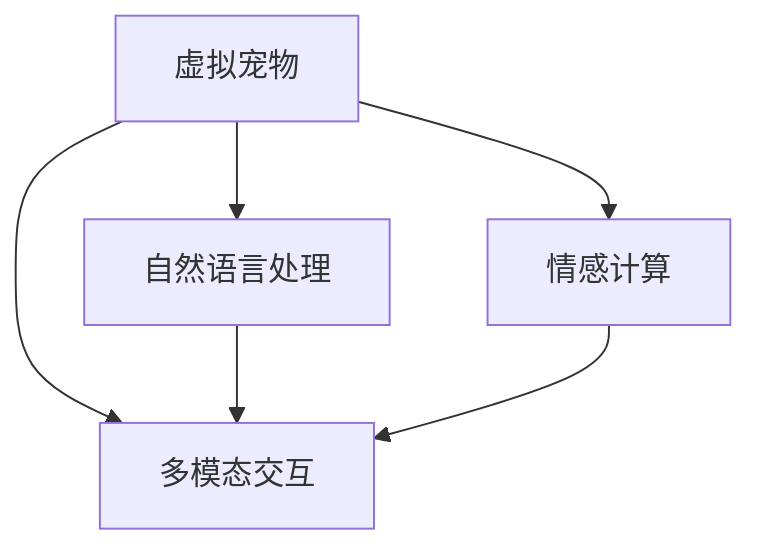

                 

# AI在虚拟宠物中的应用：提供陪伴

> 关键词：虚拟宠物，AI陪伴，情感计算，情感交互，交互设计，自然语言处理，多模态交互

## 1. 背景介绍

### 1.1 问题由来
在当今快节奏的生活中，许多人面临着工作压力、社交孤立和心理健康问题。虚拟宠物的出现，为人们提供了一种简单而有效的解决方案，让人们能够通过与虚拟宠物的互动，获得情感上的支持和陪伴。AI技术的应用，更是进一步提升了虚拟宠物的智能水平，使其能够更自然、更深入地与用户进行情感交流。

### 1.2 问题核心关键点
虚拟宠物的AI陪伴，涉及多个核心技术，包括情感计算、自然语言处理、多模态交互等。这些技术不仅需要能够识别用户的情感状态，还需要能够生成自然语言回复，并与用户进行多模态（语音、图像、文本）的互动。

1. **情感计算**：通过分析用户的语音、文本、表情等数据，识别用户的情绪状态。
2. **自然语言处理**：生成自然语言回复，理解用户的意图，提升交互的自然度。
3. **多模态交互**：融合语音、图像、文本等多种交互方式，提供更丰富、更真实的用户体验。

## 2. 核心概念与联系

### 2.1 核心概念概述

为了更好地理解AI在虚拟宠物中的应用，本节将介绍几个关键概念：

- **虚拟宠物**：一种模拟真实宠物的虚拟存在，用户可以通过与虚拟宠物的互动，获得情感上的支持和陪伴。
- **情感计算**：一种涉及心理学、计算机科学和工程学的交叉学科，旨在通过计算和分析用户的行为和情感状态，提供个性化的互动体验。
- **自然语言处理**：一种AI技术，旨在让机器能够理解和生成自然语言，提升人机交互的自然度和效率。
- **多模态交互**：一种涉及语音、图像、文本等多种输入输出方式的交互方式，为用户提供更丰富、更真实的体验。

这些核心概念之间的逻辑关系可以通过以下Mermaid流程图来展示：



这个流程图展示了虚拟宠物的核心技术组成及其相互关系：

1. 虚拟宠物基于情感计算和自然语言处理技术，进行情感识别和自然语言回复。
2. 多模态交互技术使得虚拟宠物能够处理多种输入输出方式，提升用户体验。
3. 情感计算、自然语言处理和多模态交互技术紧密协作，共同实现虚拟宠物的智能陪伴功能。

## 3. 核心算法原理 & 具体操作步骤
### 3.1 算法原理概述

AI在虚拟宠物中的应用，核心算法原理包括以下几个方面：

1. **情感识别**：通过分析用户的语音、文本、表情等数据，识别用户的情绪状态。
2. **自然语言处理**：生成自然语言回复，理解用户的意图，提升交互的自然度。
3. **多模态交互**：融合语音、图像、文本等多种交互方式，提供更丰富、更真实的用户体验。

### 3.2 算法步骤详解

**Step 1: 数据收集与预处理**

虚拟宠物的AI陪伴功能，依赖于大量的用户数据。这些数据包括用户的语音、文本、表情等，需要经过预处理，以便后续的情感计算和自然语言处理。

- **语音数据预处理**：将语音信号转换为文本，进行语音特征提取和情感识别。
- **文本数据预处理**：对用户的输入文本进行分词、去除停用词、标注情感极性等处理。
- **表情数据预处理**：通过图像识别技术，对用户的面部表情进行识别和情感分类。

**Step 2: 情感计算**

情感计算是虚拟宠物AI陪伴的核心技术之一。情感计算的主要目标是识别用户的情感状态，并根据情感状态，生成相应的回复。

- **情感识别**：使用机器学习模型，对用户的语音、文本、表情等数据进行情感分类。常用的情感分类模型包括情感分类器、卷积神经网络（CNN）等。
- **情感响应**：根据情感分类结果，生成相应的回复。情感响应可以通过模板匹配、生成式模型等方式实现。

**Step 3: 自然语言处理**

自然语言处理技术，用于生成自然语言回复，提升人机交互的自然度。

- **意图理解**：通过自然语言处理模型，理解用户的输入意图。常用的模型包括BERT、GPT等。
- **回复生成**：根据用户的输入意图，生成自然语言回复。常用的回复生成模型包括Seq2Seq、GPT等。

**Step 4: 多模态交互**

多模态交互技术，使得虚拟宠物能够处理多种输入输出方式，提升用户体验。

- **语音交互**：将用户的语音输入转换为文本，并生成语音回复。
- **图像交互**：通过图像识别技术，识别用户的面部表情，并生成相应的回复。
- **文本交互**：对用户的输入文本进行分词、情感分类等处理，并生成文本回复。

**Step 5: 反馈与优化**

虚拟宠物的AI陪伴功能，需要不断优化和改进。通过用户反馈，不断调整模型参数和交互策略，提升用户体验。

- **用户反馈收集**：通过用户评分、满意度调查等方式，收集用户反馈。
- **模型优化**：根据用户反馈，优化情感计算和自然语言处理模型，提升交互效果。

### 3.3 算法优缺点

AI在虚拟宠物中的应用，具有以下优点：

1. **随时陪伴**：虚拟宠物可以24小时陪伴用户，提供情感支持，缓解孤独感。
2. **个性化互动**：通过情感计算和自然语言处理，虚拟宠物能够提供个性化的互动体验。
3. **互动灵活**：多模态交互技术，使得虚拟宠物能够处理多种输入输出方式，提升用户体验。

同时，该方法也存在一些局限性：

1. **数据隐私问题**：用户数据的安全和隐私保护是一个重要问题，需要采取严格的措施来保护用户隐私。
2. **计算资源需求高**：情感计算和自然语言处理需要大量的计算资源，需要高性能的硬件设备支持。
3. **情感表达限制**：虚拟宠物的情感表达能力有限，无法完全替代真实宠物的情感交流。
4. **交互质量依赖模型**：虚拟宠物的交互质量高度依赖于算法的准确性和模型的性能。

尽管存在这些局限性，但就目前而言，AI在虚拟宠物中的应用，已经在情感陪伴和互动体验方面取得了显著的进展。未来，相关研究将进一步提升模型的准确性和用户体验，使虚拟宠物成为更多人情感支持的重要工具。

### 3.4 算法应用领域

AI在虚拟宠物中的应用，不仅局限于情感陪伴，还广泛应用于以下几个领域：

- **心理健康支持**：虚拟宠物可以用于心理健康咨询和治疗，帮助用户缓解压力和焦虑。
- **教育辅助**：虚拟宠物可以用于儿童教育，提供情感支持和互动教学。
- **社交互动**：虚拟宠物可以作为社交工具，帮助用户扩大社交圈，提升社交体验。
- **娱乐休闲**：虚拟宠物可以作为娱乐应用，提供趣味互动和游戏体验。

这些领域的应用，展示了AI在虚拟宠物中的广泛潜力和巨大价值。未来，随着技术的不断进步，虚拟宠物的AI陪伴功能将进一步拓展，为更多人提供情感支持和互动体验。

## 4. 数学模型和公式 & 详细讲解 & 举例说明

### 4.1 数学模型构建

本节将使用数学语言对AI在虚拟宠物中的应用进行更加严格的刻画。

假设用户的输入数据为 $x$，虚拟宠物的输出为 $y$，情感计算和自然语言处理模型为 $f$，多模态交互模型为 $g$。则情感计算和自然语言处理的过程可以表示为：

$$
y = f(x)
$$

其中 $f$ 为情感计算和自然语言处理模型，将输入 $x$ 映射到输出 $y$。多模态交互的过程可以表示为：

$$
y = g(f(x))
$$

其中 $g$ 为多模态交互模型，将情感计算和自然语言处理的输出 $f(x)$ 映射到最终的输出 $y$。

### 4.2 公式推导过程

以下是情感计算和自然语言处理模型的详细推导：

**情感计算模型**：

假设用户的输入数据为 $x$，情感计算模型为 $f$，输出为 $y$。情感计算模型的目标是通过分析 $x$，识别出用户的情感状态 $y$。假设 $x$ 是一个文本序列，情感计算模型可以表示为：

$$
y = f(x) = \text{EmotionClassifier}(x)
$$

其中 $\text{EmotionClassifier}$ 为情感分类器，通过分析文本序列 $x$，输出情感分类结果 $y$。常用的情感分类器包括LSTM、CNN等。

**自然语言处理模型**：

假设用户的输入数据为 $x$，自然语言处理模型为 $f$，输出为 $y$。自然语言处理模型的目标是通过分析 $x$，理解用户的意图，并生成自然语言回复。假设 $x$ 是一个文本序列，自然语言处理模型可以表示为：

$$
y = f(x) = \text{Seq2Seq}(x)
$$

其中 $\text{Seq2Seq}$ 为序列到序列模型，将输入序列 $x$ 映射到输出序列 $y$。常用的序列到序列模型包括LSTM、GRU等。

### 4.3 案例分析与讲解

以一个简单的虚拟宠物应用为例，演示情感计算和自然语言处理的实际应用。

假设用户的输入数据为一段文本：

```
"我很孤单，你愿意陪我聊天吗？"
```

情感计算模型通过分析文本，识别出用户的情感状态为“孤独”。自然语言处理模型理解用户的意图，并生成相应的回复：

```
"当然，我理解你的感受。我们可以聊聊你的兴趣爱好，或者讲讲你的一天。你今天过得怎么样？"
```

通过情感计算和自然语言处理，虚拟宠物能够理解和回应用户的情感状态，提供个性化的互动体验。

## 5. 项目实践：代码实例和详细解释说明

### 5.1 开发环境搭建

在进行虚拟宠物AI陪伴功能开发前，我们需要准备好开发环境。以下是使用Python进行TensorFlow开发的环境配置流程：

1. 安装Anaconda：从官网下载并安装Anaconda，用于创建独立的Python环境。

2. 创建并激活虚拟环境：
```bash
conda create -n virtual_pet python=3.8 
conda activate virtual_pet
```

3. 安装TensorFlow：根据CUDA版本，从官网获取对应的安装命令。例如：
```bash
conda install tensorflow tensorflow-gpu -c conda-forge
```

4. 安装各类工具包：
```bash
pip install numpy pandas scikit-learn matplotlib tqdm jupyter notebook ipython
```

完成上述步骤后，即可在`virtual_pet`环境中开始虚拟宠物的开发。

### 5.2 源代码详细实现

下面以情感分类和自然语言回复为例，给出使用TensorFlow进行虚拟宠物开发的PyTorch代码实现。

首先，定义情感分类模型：

```python
import tensorflow as tf
from tensorflow.keras.layers import LSTM, Dense, Dropout

class EmotionClassifier(tf.keras.Model):
    def __init__(self, input_dim, output_dim):
        super(EmotionClassifier, self).__init__()
        self.lstm = LSTM(64, input_shape=(input_dim, 1), return_sequences=True)
        self.dense = Dense(output_dim, activation='softmax')

    def call(self, x):
        x = self.lstm(x)
        x = tf.reduce_mean(x, axis=1)
        x = self.dense(x)
        return x
```

然后，定义自然语言回复模型：

```python
from tensorflow.keras.layers import Input, LSTM, Dense, Embedding
from tensorflow.keras.models import Model

class Seq2Seq(tf.keras.Model):
    def __init__(self, input_dim, output_dim, hidden_dim):
        super(Seq2Seq, self).__init__()
        self.encoder = LSTM(hidden_dim, input_shape=(input_dim, 1))
        self.decoder = LSTM(hidden_dim, return_sequences=True)
        self.dense = Dense(output_dim, activation='softmax')
        self.embedding = Embedding(input_dim, hidden_dim)

    def call(self, x):
        encoder_output, encoder_state = self.encoder(x)
        decoder_output, decoder_state = self.decoder(x)
        decoder_output = self.dense(decoder_output)
        return decoder_output
```

最后，构建虚拟宠物的AI陪伴模型：

```python
from tensorflow.keras.optimizers import Adam

class VirtualPet(tf.keras.Model):
    def __init__(self, emotion_dim, output_dim, hidden_dim):
        super(VirtualPet, self).__init__()
        self.emotion_classifier = EmotionClassifier(input_dim=100, output_dim=emotion_dim)
        self.seq2seq = Seq2Seq(input_dim=emotion_dim, output_dim=output_dim, hidden_dim=hidden_dim)

    def call(self, x):
        emotion = self.emotion_classifier(x)
        response = self.seq2seq(emotion)
        return response

    def train(self, x_train, y_train, x_dev, y_dev, epochs=10, batch_size=32):
        model = self
        model.compile(loss='sparse_categorical_crossentropy', optimizer=Adam(learning_rate=0.001))
        model.fit(x_train, y_train, batch_size=batch_size, epochs=epochs, validation_data=(x_dev, y_dev))
```

在实际应用中，还需要对模型进行超参数调优、数据增强等操作，以提升模型的性能。

### 5.3 代码解读与分析

让我们再详细解读一下关键代码的实现细节：

**EmotionClassifier类**：
- `__init__`方法：初始化情感分类器的LSTM和全连接层。
- `call`方法：前向传播计算情感分类器的输出。

**Seq2Seq类**：
- `__init__`方法：初始化序列到序列模型的LSTM、全连接层和嵌入层。
- `call`方法：前向传播计算序列到序列模型的输出。

**VirtualPet类**：
- `__init__`方法：初始化虚拟宠物的情感分类器和序列到序列模型。
- `call`方法：前向传播计算虚拟宠物的输出。
- `train`方法：定义训练过程，包括模型的编译和拟合。

**训练流程**：
- 定义训练集和验证集的数据，定义训练参数。
- 使用虚拟宠物的训练函数进行训练，并在验证集上进行性能评估。
- 迭代训练，直到满足预设的训练轮数或性能提升条件。

可以看到，TensorFlow配合Keras框架，使得虚拟宠物的AI陪伴功能代码实现变得简洁高效。开发者可以将更多精力放在模型设计、数据处理等高层逻辑上，而不必过多关注底层的实现细节。

当然，工业级的系统实现还需考虑更多因素，如模型的保存和部署、超参数的自动搜索、更灵活的任务适配层等。但核心的虚拟宠物AI陪伴功能基本与此类似。

## 6. 实际应用场景

### 6.1 虚拟宠物在心理健康支持中的应用

虚拟宠物在心理健康支持中的应用，为心理健康咨询和治疗提供了一种新的方式。许多用户不愿意在现实中寻求心理帮助，但通过与虚拟宠物互动，能够获得情感支持和情感宣泄，缓解压力和焦虑。

在技术实现上，可以收集用户的情感数据（如语音、文本、表情），对虚拟宠物进行微调，使其能够识别用户的情感状态，并生成相应的回复。通过这种方式，虚拟宠物可以成为用户的情感伙伴，帮助他们缓解孤独和压力。

### 6.2 虚拟宠物在教育辅助中的应用

虚拟宠物在教育辅助中的应用，为儿童教育提供了新的互动方式。许多儿童在传统教育方式下感到枯燥乏味，但通过与虚拟宠物互动，能够获得更多趣味性和互动性，提升学习兴趣。

在技术实现上，可以设计虚拟宠物作为教育工具，对学生的学习情况进行监测和反馈。虚拟宠物能够理解学生的学习需求和反馈，根据学生的学习进度和兴趣，提供个性化的学习内容和互动方式，提升学习效果。

### 6.3 虚拟宠物在社交互动中的应用

虚拟宠物在社交互动中的应用，为社交工具提供了新的互动方式。许多用户在现实生活中感到孤独，但通过与虚拟宠物互动，能够获得更多的社交支持和情感陪伴。

在技术实现上，虚拟宠物可以与用户进行多种方式的互动，如语音聊天、视频通话、表情交互等。通过这些互动方式，虚拟宠物能够更好地理解和回应用户的情感需求，提升社交体验。

### 6.4 虚拟宠物在娱乐休闲中的应用

虚拟宠物在娱乐休闲中的应用，为娱乐应用提供了新的互动方式。许多用户在娱乐应用中感到乏味，但通过与虚拟宠物互动，能够获得更多的趣味性和互动性，提升娱乐体验。

在技术实现上，虚拟宠物可以作为游戏角色，参与各种娱乐活动，如角色扮演、解谜游戏等。通过这些互动方式，虚拟宠物能够更好地与用户互动，提升游戏趣味性。

## 7. 工具和资源推荐

### 7.1 学习资源推荐

为了帮助开发者系统掌握虚拟宠物的AI陪伴技术，这里推荐一些优质的学习资源：

1. 《情感计算与人工智能》系列博文：由情感计算领域的专家撰写，深入浅出地介绍了情感计算的基本概念和技术。

2. CS224D《自然语言处理与深度学习》课程：斯坦福大学开设的NLP明星课程，涵盖自然语言处理和深度学习的基本知识，是进入该领域的入门课程。

3. 《自然语言处理实战》书籍：详细介绍了自然语言处理的基本算法和技术，包括情感计算和自然语言处理。

4. HuggingFace官方文档：Transformers库的官方文档，提供了海量预训练模型和完整的微调样例代码，是进入该领域的必备资料。

5. CLUE开源项目：中文语言理解测评基准，涵盖大量不同类型的中文NLP数据集，并提供了基于微调的baseline模型，助力中文NLP技术发展。

通过对这些资源的学习实践，相信你一定能够快速掌握虚拟宠物的AI陪伴技术的精髓，并用于解决实际的NLP问题。

### 7.2 开发工具推荐

高效的开发离不开优秀的工具支持。以下是几款用于虚拟宠物AI陪伴开发的常用工具：

1. TensorFlow：基于Python的开源深度学习框架，灵活动态的计算图，适合快速迭代研究。大部分深度学习模型都有TensorFlow版本的实现。

2. PyTorch：基于Python的开源深度学习框架，灵活动态的计算图，适合快速迭代研究。大部分深度学习模型都有PyTorch版本的实现。

3. HuggingFace Transformers库：提供预训练语言模型的封装，支持多种任务，如情感分类、序列到序列生成等。

4. Weights & Biases：模型训练的实验跟踪工具，可以记录和可视化模型训练过程中的各项指标，方便对比和调优。与主流深度学习框架无缝集成。

5. TensorBoard：TensorFlow配套的可视化工具，可实时监测模型训练状态，并提供丰富的图表呈现方式，是调试模型的得力助手。

6. Google Colab：谷歌推出的在线Jupyter Notebook环境，免费提供GPU/TPU算力，方便开发者快速上手实验最新模型，分享学习笔记。

合理利用这些工具，可以显著提升虚拟宠物AI陪伴功能的开发效率，加快创新迭代的步伐。

### 7.3 相关论文推荐

虚拟宠物的AI陪伴技术，涉及多个领域的前沿研究方向。以下是几篇奠基性的相关论文，推荐阅读：

1. "Sentiment Analysis via Emotion Classification"：提出通过情感分类进行情感分析的方法，为虚拟宠物的情感识别提供了新的思路。

2. "Attention is All You Need"：提出Transformer结构，使得虚拟宠物的自然语言处理任务更加高效。

3. "Sequence to Sequence Learning with Neural Networks"：提出Seq2Seq模型，为虚拟宠物的自然语言回复提供了新的方案。

4. "Recurrent Neural Network for Sequence Prediction"：提出LSTM模型，为虚拟宠物的情感分类任务提供了新的模型选择。

5. "Generative Adversarial Networks"：提出GAN模型，为虚拟宠物的交互设计提供了新的创意。

这些论文代表了大语言模型微调技术的发展脉络。通过学习这些前沿成果，可以帮助研究者把握学科前进方向，激发更多的创新灵感。

## 8. 总结：未来发展趋势与挑战

### 8.1 总结

本文对AI在虚拟宠物中的应用进行了全面系统的介绍。首先阐述了虚拟宠物在心理健康支持、教育辅助、社交互动和娱乐休闲等多个领域的应用背景和意义，明确了AI陪伴在虚拟宠物中的重要价值。其次，从原理到实践，详细讲解了情感计算、自然语言处理和多模态交互的数学原理和关键步骤，给出了虚拟宠物AI陪伴功能的完整代码实例。同时，本文还广泛探讨了虚拟宠物在多个行业领域的应用前景，展示了AI陪伴功能的广阔潜力和巨大价值。

通过本文的系统梳理，可以看到，AI在虚拟宠物中的应用，不仅提升了用户体验，还为心理健康、教育、社交和娱乐等多个领域带来了变革性影响。未来，伴随AI技术的不断进步，虚拟宠物的AI陪伴功能必将进一步拓展，为更多人提供情感支持和互动体验。

### 8.2 未来发展趋势

展望未来，虚拟宠物的AI陪伴技术将呈现以下几个发展趋势：

1. **多模态交互的融合**：未来的虚拟宠物将更加注重多模态交互的融合，通过语音、图像、文本等多种方式的互动，提升用户体验。
2. **情感计算的深化**：未来的虚拟宠物将更加注重情感计算的深化，通过更准确的情绪识别和情感分类，提升情感陪伴的精准度。
3. **自然语言处理的提升**：未来的虚拟宠物将更加注重自然语言处理的提升，通过更自然、更高效的自然语言回复，提升人机交互的自然度。
4. **个性化体验的增强**：未来的虚拟宠物将更加注重个性化体验的增强，通过个性化的互动方式，提升用户的参与感和满意度。
5. **跨领域应用的拓展**：未来的虚拟宠物将更加注重跨领域应用的拓展，在更多的领域中发挥情感支持和社会支持的作用。

以上趋势凸显了虚拟宠物的AI陪伴技术的广阔前景。这些方向的探索发展，必将进一步提升虚拟宠物的智能水平和用户体验，为虚拟宠物的普及和应用提供坚实的基础。

### 8.3 面临的挑战

尽管虚拟宠物的AI陪伴技术已经取得了显著进展，但在迈向更加智能化、普适化应用的过程中，它仍面临着诸多挑战：

1. **用户隐私保护**：用户数据的安全和隐私保护是一个重要问题，需要采取严格的措施来保护用户隐私。
2. **计算资源需求高**：情感计算和自然语言处理需要大量的计算资源，需要高性能的硬件设备支持。
3. **情感表达限制**：虚拟宠物的情感表达能力有限，无法完全替代真实宠物的情感交流。
4. **交互质量依赖模型**：虚拟宠物的交互质量高度依赖于算法的准确性和模型的性能。
5. **跨模态交互的难度**：多模态交互的融合需要考虑不同模态之间的协调和融合，难度较大。

尽管存在这些挑战，但就目前而言，虚拟宠物的AI陪伴技术已经在情感支持、社交互动和教育辅助等领域取得了显著的进展。未来，相关研究将进一步提升模型的准确性和用户体验，使虚拟宠物成为更多人情感支持的重要工具。

### 8.4 研究展望

面对虚拟宠物AI陪伴技术所面临的种种挑战，未来的研究需要在以下几个方面寻求新的突破：

1. **情感计算的强化**：进一步提升情感计算的准确性和深度，引入更多情感特征，增强情感识别的鲁棒性和可靠性。
2. **自然语言处理的优化**：通过更先进的自然语言处理模型，提升自然语言回复的自然度和语义理解能力，增强人机交互的自然度。
3. **多模态交互的融合**：通过更智能的多模态交互技术，提升虚拟宠物的交互体验和用户满意度。
4. **个性化体验的提升**：通过更个性化的互动方式和内容推荐，提升用户的参与感和满意度。
5. **隐私保护和安全性的保障**：通过更严格的隐私保护措施，保障用户数据的安全和隐私，提升用户信任度。

这些研究方向的探索，必将引领虚拟宠物的AI陪伴技术迈向更高的台阶，为虚拟宠物的普及和应用提供坚实的基础。面向未来，虚拟宠物的AI陪伴技术还需要与其他人工智能技术进行更深入的融合，如知识表示、因果推理、强化学习等，多路径协同发力，共同推动虚拟宠物的进步。只有勇于创新、敢于突破，才能不断拓展虚拟宠物的边界，让虚拟宠物成为更多人情感支持和社交互动的重要伙伴。

## 9. 附录：常见问题与解答

**Q1：虚拟宠物的AI陪伴功能是否需要深度学习模型？**

A: 虚拟宠物的AI陪伴功能，主要依赖于深度学习模型。情感计算和自然语言处理需要深度学习模型进行特征提取和模式识别，多模态交互也需要深度学习模型进行特征融合和交互设计。因此，深度学习模型是实现虚拟宠物AI陪伴功能的重要基础。

**Q2：虚拟宠物的AI陪伴功能如何保护用户隐私？**

A: 虚拟宠物的AI陪伴功能，需要采集用户的语音、文本、表情等数据。为了保护用户隐私，可以采取以下措施：
1. 数据加密：对用户数据进行加密存储和传输，防止数据泄露。
2. 匿名化处理：对用户数据进行匿名化处理，保护用户隐私。
3. 用户同意：在数据采集前，获取用户同意，并告知用户数据的使用范围和目的。

**Q3：虚拟宠物的AI陪伴功能如何处理语音识别误差？**

A: 虚拟宠物的AI陪伴功能，需要处理用户的语音输入。语音识别的误差是不可避免的，因此可以采取以下措施：
1. 多次输入：允许用户多次输入，提高识别的准确性。
2. 纠正机制：通过自然语言处理技术，对识别结果进行纠正，提升识别的准确性。
3. 数据增强：通过增加噪音、改变语速等数据增强手段，提高模型的鲁棒性。

**Q4：虚拟宠物的AI陪伴功能如何实现个性化体验？**

A: 虚拟宠物的AI陪伴功能，可以通过个性化的互动方式和内容推荐，实现个性化体验。具体措施包括：
1. 用户画像：建立用户画像，了解用户的兴趣和需求。
2. 推荐系统：利用推荐系统，为用户推荐个性化的互动内容。
3. 交互设计：根据用户的行为和反馈，调整虚拟宠物的互动策略，提升用户的满意度。

**Q5：虚拟宠物的AI陪伴功能如何处理多模态数据？**

A: 虚拟宠物的AI陪伴功能，需要处理语音、图像、文本等多种模态数据。具体措施包括：
1. 数据融合：通过多模态融合技术，将不同模态的数据进行融合，提升互动的自然度和准确性。
2. 特征提取：对不同模态的数据进行特征提取，提取有意义的特征进行模型训练。
3. 交互设计：根据不同模态的数据特点，设计合适的交互方式，提升用户体验。

通过本文的系统梳理，可以看到，虚拟宠物的AI陪伴技术在多个领域具有广泛的应用前景和巨大的发展潜力。随着技术的不断进步，虚拟宠物的智能水平和用户体验将进一步提升，成为更多人情感支持和社交互动的重要工具。未来，虚拟宠物的AI陪伴功能必将进一步拓展，为更多人提供情感支持和互动体验。

---

作者：禅与计算机程序设计艺术 / Zen and the Art of Computer Programming

