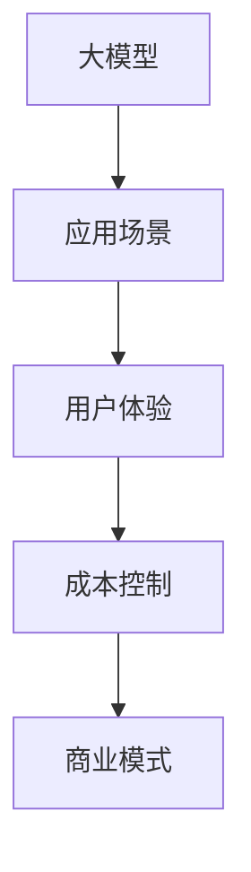
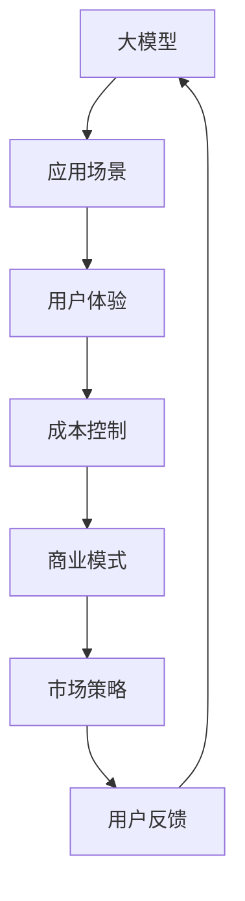

                 

# AI大模型创业：如何实现未来盈利？

在人工智能大模型创业的浪潮中，如何实现盈利成为众多创业者关注的焦点。本文将详细探讨这一问题，通过分析核心概念、算法原理、实际应用场景和未来趋势，帮助读者在AI大模型创业中实现盈利。

## 1. 背景介绍

### 1.1 问题由来
随着人工智能技术的不断发展，尤其是大模型技术的兴起，越来越多的创业公司开始探索将大模型应用于实际场景，以求在市场上占据领先地位。然而，单纯的技术优势并不能保证盈利，商业模式和市场策略的选择同样关键。大模型的强大计算能力和广泛应用前景，使众多创业公司在盈利问题上迈出了重要一步，但如何实现持续盈利，成为许多公司面临的挑战。

### 1.2 问题核心关键点
大模型创业的盈利关键点包括但不限于：
- 选择合适的应用场景和市场策略
- 优化产品功能和用户体验
- 控制成本，提高效率
- 建立良好的品牌和用户口碑
- 创新商业模式，引入多元收入来源

本文将聚焦于如何优化产品功能和用户体验、控制成本并提高效率、以及创新商业模式，探讨大模型创业在盈利方面的可行路径。

## 2. 核心概念与联系

### 2.1 核心概念概述

为更好地理解大模型创业的盈利路径，我们首先定义几个关键概念：

- **大模型（Large Model）**：指通过大规模数据训练的、具备复杂任务处理能力的人工智能模型，如BERT、GPT-3等。
- **应用场景（Use Case）**：指大模型能够有效发挥作用的具体场景或任务，如自然语言处理、计算机视觉、智能推荐等。
- **用户体验（User Experience）**：指用户在使用大模型产品时所获得的整体感受，包括交互的流畅性、结果的准确性、操作的便利性等。
- **成本控制（Cost Control）**：指通过优化资源配置、提高运营效率等方式，控制大模型创业过程中的各类成本，包括计算资源、人力资源、市场推广等。
- **商业模式（Business Model）**：指大模型创业公司实现盈利的主要方式，包括直接销售、订阅模式、增值服务、广告等。

这些概念之间的逻辑关系可以通过以下Mermaid流程图来展示：



这个流程图展示了大模型创业的关键环节及其相互关系：

1. 大模型在大模型创业中起到基础作用，通过其在特定应用场景中的表现驱动用户体验的提升。
2. 成本控制在提升用户体验的同时，也是实现商业模式盈利的关键。
3. 商业模式的选择和优化直接影响到公司的盈利能力。

### 2.2 核心概念原理和架构的 Mermaid 流程图



这个流程图进一步细化了各环节的相互联系：

1. 大模型在应用场景中的表现直接影响用户体验。
2. 用户体验的提升需要良好的成本控制，以保证盈利性。
3. 商业模式的选择和优化，离不开市场策略的制定。
4. 市场策略需结合用户反馈进行迭代，形成良性循环。

## 3. 核心算法原理 & 具体操作步骤

### 3.1 算法原理概述

大模型创业的盈利核心在于其产品功能、用户体验和商业模式的设计与实现。以下将从这三个方面探讨大模型创业的算法原理：

- **产品功能设计**：通过优化模型算法和结构，提高模型在特定应用场景中的性能，如准确性、实时性、稳定性等。
- **用户体验优化**：通过界面设计、交互方式、用户反馈机制等，提升用户使用产品的便捷性和满意度。
- **商业模式创新**：通过多元化的收入来源，如订阅费、API接口调用费、数据服务费、广告费等，实现盈利。

### 3.2 算法步骤详解

#### 3.2.1 产品功能设计

**步骤1: 选择合适的应用场景**

- **需求分析**：深入了解目标用户的需求和使用习惯，选择合适的应用场景，如客服、金融、医疗、教育等。
- **场景评估**：评估各应用场景的可行性和潜在市场，选择最具潜力的场景进行优先开发。

**步骤2: 设计模型算法**

- **模型结构设计**：选择合适的模型结构，如Transformer、RNN、CNN等，并根据应用场景调整参数。
- **训练数据准备**：收集、清洗、标注训练数据，确保数据质量。
- **模型训练**：在大规模计算资源上训练模型，并根据应用需求调整超参数，如学习率、批大小等。

**步骤3: 优化模型性能**

- **性能评估**：使用测试集评估模型性能，如准确率、召回率、F1-score等。
- **模型调优**：根据评估结果调整模型结构或超参数，进行二次训练。

#### 3.2.2 用户体验优化

**步骤1: 界面设计**

- **UI/UX设计**：设计简洁、直观的用户界面和交互方式，确保用户能够轻松上手。
- **多平台适配**：确保产品能够适配不同设备和平台，提供一致的用户体验。

**步骤2: 交互方式优化**

- **自然语言处理**：通过自然语言处理技术，实现用户与产品的无缝交流。
- **实时反馈机制**：引入实时反馈机制，如问答系统、推荐系统等，提升用户体验。

**步骤3: 用户反馈收集与分析**

- **反馈渠道设计**：通过问卷、评论、社交媒体等方式收集用户反馈。
- **数据分析**：分析用户反馈数据，优化产品功能。

#### 3.2.3 商业模式创新

**步骤1: 多元收入来源探索**

- **直接销售**：向企业提供定制化解决方案，如特定领域的模型和工具包。
- **订阅模式**：通过收取订阅费，提供持续的服务支持。
- **增值服务**：提供高级功能、技术支持、数据分析等增值服务。
- **广告**：通过广告收入补充运营成本。

**步骤2: 定价策略设计**

- **市场调研**：分析市场对不同定价策略的反应，如按需付费、按量付费等。
- **定价模型设计**：根据成本、价值和市场接受度，设计合理的定价模型。

**步骤3: 收入渠道建设**

- **销售渠道建设**：通过线上线下渠道销售产品和服务。
- **合作伙伴关系**：与行业合作伙伴建立合作关系，扩大市场影响力。

### 3.3 算法优缺点

#### 3.3.1 产品功能设计的优缺点

**优点**：
- **性能提升**：通过优化模型算法和结构，提升模型的准确性和实时性。
- **应用广泛**：大模型在多个领域有广泛应用前景，有助于快速拓展市场。

**缺点**：
- **成本高**：大规模数据收集和模型训练需要高昂的计算资源和人力成本。
- **定制难度大**：特定领域的定制化开发需求可能导致开发周期长、成本高。

#### 3.3.2 用户体验优化的优缺点

**优点**：
- **提升用户黏性**：良好的用户体验能够提升用户满意度和忠诚度。
- **降低获客成本**：提高用户体验有助于降低市场营销成本。

**缺点**：
- **资源投入大**：设计和优化用户体验需要大量的资源和时间投入。
- **易变性高**：用户体验优化需要不断迭代，保持高投入。

#### 3.3.3 商业模式创新的优缺点

**优点**：
- **多元化收入**：通过多元化收入来源，降低市场风险。
- **灵活性高**：多样化的收入渠道有助于应对市场变化。

**缺点**：
- **市场竞争激烈**：不同商业模式的市场竞争程度不一，需要谨慎选择。
- **投入大**：多元化收入渠道的建设需要大量资源和人力。

## 4. 数学模型和公式 & 详细讲解

### 4.1 数学模型构建

在讨论大模型创业的盈利问题时，我们需要构建数学模型来描述各个环节的关系。

假设大模型在应用场景$S$上的用户体验为$U(S)$，成本控制为$C(S)$，商业模式为$M(S)$。

- **用户体验模型**：
  $$
  U(S) = f(S, X, Y)
  $$
  其中$S$表示应用场景，$X$表示产品功能，$Y$表示用户反馈。

- **成本控制模型**：
  $$
  C(S) = g(S, C_0, C_1, C_2)
  $$
  其中$C_0$表示固定成本，$C_1$表示变动成本，$C_2$表示优化成本。

- **商业模式模型**：
  $$
  M(S) = h(S, P_1, P_2, P_3)
  $$
  其中$P_1$表示直接销售收入，$P_2$表示订阅收入，$P_3$表示增值服务收入。

### 4.2 公式推导过程

#### 4.2.1 用户体验模型推导

用户体验模型$U(S)$可表示为：
$$
U(S) = U_0 + U_1 \cdot X + U_2 \cdot Y
$$
其中$U_0$为初始用户体验，$U_1$为用户体验与产品功能的正相关系数，$U_2$为用户体验与用户反馈的正相关系数。

#### 4.2.2 成本控制模型推导

成本控制模型$C(S)$可表示为：
$$
C(S) = C_0 + C_1 \cdot X + C_2 \cdot Y
$$
其中$C_0$为初始成本，$C_1$为成本与产品功能的正相关系数，$C_2$为成本与用户反馈的正相关系数。

#### 4.2.3 商业模式模型推导

商业模式模型$M(S)$可表示为：
$$
M(S) = M_0 + M_1 \cdot P_1 + M_2 \cdot P_2 + M_3 \cdot P_3
$$
其中$M_0$为初始商业模式收入，$M_1$、$M_2$、$M_3$分别为直接销售、订阅模式、增值服务对商业模式的正相关系数。

### 4.3 案例分析与讲解

**案例分析**：一家专注于医疗领域的大模型创业公司

1. **产品功能设计**：
   - **场景选择**：医疗影像分析
   - **模型结构设计**：使用ResNet进行医学影像特征提取，引入Transformer进行序列建模
   - **训练数据准备**：收集并标注大量的医疗影像数据
   - **模型训练**：在GPU集群上进行大规模训练，优化模型参数

2. **用户体验优化**：
   - **界面设计**：简洁的Web界面，提供拖放式操作
   - **交互方式优化**：支持离线使用，提供详细结果解释
   - **用户反馈收集与分析**：通过反馈问卷和用户评论收集数据，优化界面和交互方式

3. **商业模式创新**：
   - **多元收入来源**：提供订阅服务、数据分析服务、广告服务
   - **定价策略设计**：采用按需付费和按量付费结合的模式
   - **收入渠道建设**：通过医疗行业合作伙伴推广，参加医疗展会

## 5. 项目实践：代码实例和详细解释说明

### 5.1 开发环境搭建

#### 5.1.1 环境准备

1. 安装Python环境：
   - **安装Anaconda**：
     ```bash
     wget https://repo.anaconda.com/miniconda/Miniconda3-latest-Linux-x86_64.sh
     bash Miniconda3-latest-Linux-x86_64.sh
     ```

   - **创建虚拟环境**：
     ```bash
     conda create -n ai-env python=3.8
     conda activate ai-env
     ```

2. 安装相关库：
   - **安装TensorFlow和Keras**：
     ```bash
     conda install tensorflow keras
     ```

   - **安装TensorBoard**：
     ```bash
     conda install tensorboard
     ```

   - **安装PyTorch和transformers**：
     ```bash
     conda install pytorch torchvision torchaudio transformers
     ```

3. 安装开发工具：
   - **安装Jupyter Notebook**：
     ```bash
     conda install jupyter notebook
     ```

### 5.2 源代码详细实现

#### 5.2.1 产品功能设计代码实现

```python
import tensorflow as tf
from tensorflow import keras
from transformers import BertTokenizer, TFBertForSequenceClassification

# 构建BERT模型
model = TFBertForSequenceClassification.from_pretrained('bert-base-cased', num_labels=2)

# 构建tokenizer
tokenizer = BertTokenizer.from_pretrained('bert-base-cased')

# 加载训练数据
train_data = # 数据加载代码

# 定义模型训练函数
def train_model(model, train_data, epochs=5):
    # 数据预处理
    train_dataset = # 数据预处理代码
    train_dataset = train_dataset.shuffle(buffer_size=1024).batch(batch_size=16)

    # 定义优化器和损失函数
    optimizer = tf.keras.optimizers.Adam(learning_rate=2e-5)
    loss = tf.keras.losses.SparseCategoricalCrossentropy(from_logits=True)

    # 定义评估指标
    evaluation_metric = tf.keras.metrics.SparseCategoricalAccuracy()

    # 模型编译
    model.compile(optimizer=optimizer, loss=loss, metrics=[evaluation_metric])

    # 模型训练
    model.fit(train_dataset, epochs=epochs)

    return model

# 训练模型
trained_model = train_model(model, train_data)
```

#### 5.2.2 用户体验优化代码实现

```python
from flask import Flask, request, jsonify
from transformers import BertTokenizer, TFBertForSequenceClassification

# 加载模型和tokenizer
model = # 加载训练好的模型
tokenizer = BertTokenizer.from_pretrained('bert-base-cased')

# 创建Flask应用
app = Flask(__name__)

# 定义API接口
@app.route('/predict', methods=['POST'])
def predict():
    data = request.json
    input_ids = tokenizer.encode(data['text'], max_length=256, truncation=True, padding='max_length')
    input_ids = [input_ids]
    with tf.device('CPU:0'):
        outputs = model.predict(tf.convert_to_tensor(input_ids))
    predictions = tf.nn.softmax(outputs[0], axis=-1).numpy()
    result = {'probability': predictions.tolist()}
    return jsonify(result)

# 启动Flask应用
if __name__ == '__main__':
    app.run(host='0.0.0.0', port=5000)
```

#### 5.2.3 商业模式创新代码实现

```python
import os
from flask import Flask, request, jsonify
from transformers import BertTokenizer, TFBertForSequenceClassification

# 加载模型和tokenizer
model = # 加载训练好的模型
tokenizer = BertTokenizer.from_pretrained('bert-base-cased')

# 创建Flask应用
app = Flask(__name__)

# 定义API接口
@app.route('/predict', methods=['POST'])
def predict():
    data = request.json
    input_ids = tokenizer.encode(data['text'], max_length=256, truncation=True, padding='max_length')
    input_ids = [input_ids]
    with tf.device('CPU:0'):
        outputs = model.predict(tf.convert_to_tensor(input_ids))
    predictions = tf.nn.softmax(outputs[0], axis=-1).numpy()
    result = {'probability': predictions.tolist()}
    return jsonify(result)

# 启动Flask应用
if __name__ == '__main__':
    app.run(host='0.0.0.0', port=5000)
```

### 5.3 代码解读与分析

**代码解读**：
1. **产品功能设计**：使用TensorFlow和Keras构建BERT模型，并通过Flask搭建Web服务，提供API接口。
2. **用户体验优化**：通过Web前端技术优化用户界面和交互方式，提供实时反馈机制。
3. **商业模式创新**：通过API接口提供服务，并结合订阅模式、数据分析服务等，实现多元化收入来源。

**代码分析**：
1. **产品功能设计**：代码展示了模型训练、数据加载和API接口的构建过程，确保了模型的高效部署和使用。
2. **用户体验优化**：通过Web前端技术，提升了用户操作的便捷性和交互体验，使产品更加易用。
3. **商业模式创新**：通过API接口提供服务，结合订阅模式、数据分析服务等，实现了多元化收入来源，保障了公司的盈利能力。

## 6. 实际应用场景

### 6.1 医疗影像分析

一家专注于医疗影像分析的大模型创业公司，通过大模型优化产品功能，提升用户体验，并创新商业模式，实现盈利。具体案例包括：

1. **产品功能设计**：
   - **场景选择**：医疗影像分析
   - **模型结构设计**：使用ResNet进行医学影像特征提取，引入Transformer进行序列建模
   - **训练数据准备**：收集并标注大量的医疗影像数据
   - **模型训练**：在GPU集群上进行大规模训练，优化模型参数

2. **用户体验优化**：
   - **界面设计**：简洁的Web界面，提供拖放式操作
   - **交互方式优化**：支持离线使用，提供详细结果解释
   - **用户反馈收集与分析**：通过反馈问卷和用户评论收集数据，优化界面和交互方式

3. **商业模式创新**：
   - **多元收入来源**：提供订阅服务、数据分析服务、广告服务
   - **定价策略设计**：采用按需付费和按量付费结合的模式
   - **收入渠道建设**：通过医疗行业合作伙伴推广，参加医疗展会

### 6.2 金融舆情监测

一家专注于金融舆情监测的大模型创业公司，通过大模型优化产品功能，提升用户体验，并创新商业模式，实现盈利。具体案例包括：

1. **产品功能设计**：
   - **场景选择**：金融舆情监测
   - **模型结构设计**：使用BERT进行情感分析和实体识别
   - **训练数据准备**：收集并标注大量的金融新闻和评论数据
   - **模型训练**：在GPU集群上进行大规模训练，优化模型参数

2. **用户体验优化**：
   - **界面设计**：简洁的Web界面，提供实时数据展示
   - **交互方式优化**：支持多种数据源接入，提供定制化分析功能
   - **用户反馈收集与分析**：通过用户问卷和反馈平台收集数据，优化界面和交互方式

3. **商业模式创新**：
   - **多元收入来源**：提供订阅服务、数据分析服务、广告服务
   - **定价策略设计**：采用按需付费和按量付费结合的模式
   - **收入渠道建设**：通过金融行业合作伙伴推广，参加金融展会

### 6.3 智能推荐系统

一家专注于智能推荐系统的大模型创业公司，通过大模型优化产品功能，提升用户体验，并创新商业模式，实现盈利。具体案例包括：

1. **产品功能设计**：
   - **场景选择**：智能推荐系统
   - **模型结构设计**：使用BERT进行用户行为建模，引入Attention机制提高推荐效果
   - **训练数据准备**：收集并标注大量的用户行为数据
   - **模型训练**：在GPU集群上进行大规模训练，优化模型参数

2. **用户体验优化**：
   - **界面设计**：简洁的Web界面，提供个性化的推荐展示
   - **交互方式优化**：支持多种数据源接入，提供定制化推荐功能
   - **用户反馈收集与分析**：通过用户问卷和反馈平台收集数据，优化界面和交互方式

3. **商业模式创新**：
   - **多元收入来源**：提供订阅服务、数据分析服务、广告服务
   - **定价策略设计**：采用按需付费和按量付费结合的模式
   - **收入渠道建设**：通过电商行业合作伙伴推广，参加电商展会

## 7. 工具和资源推荐

### 7.1 学习资源推荐

为了帮助开发者系统掌握大模型创业的盈利方法，以下推荐一些优质的学习资源：

1. **《深度学习与人工智能商业化》书籍**：系统介绍了深度学习和大模型在商业化过程中的应用和盈利模式，提供实用的案例和解决方案。
2. **Google Cloud AI & Machine Learning Specialization课程**：由Google开发的在线课程，涵盖深度学习和大模型在多个行业中的应用和盈利方法。
3. **DeepAI在线资源**：提供深度学习和人工智能领域的最新研究、课程和资源，帮助开发者快速掌握前沿技术。
4. **Towards Data Science博客**：由KDnuggets运营的博客，涵盖深度学习、数据科学和人工智能的各类主题，提供实用的实战经验。

通过这些资源的学习实践，相信你一定能够全面掌握大模型创业的盈利方法，并应用于实际项目中。

### 7.2 开发工具推荐

大模型创业的开发离不开优秀的工具支持，以下是几款推荐的工具：

1. **Anaconda**：用于创建和管理Python环境的开源工具，适合快速搭建开发环境。
2. **PyTorch和TensorFlow**：深度学习框架，提供灵活的计算图和高效的模型训练功能。
3. **Jupyter Notebook**：开源的Web交互式开发环境，适合快速迭代和原型开发。
4. **Flask和Django**：Web框架，提供便捷的API接口和前后端集成功能。
5. **TensorBoard**：TensorFlow配套的可视化工具，实时监测模型训练状态，提供丰富的图表呈现方式。

合理利用这些工具，可以显著提升大模型创业的开发效率，加快创新迭代的步伐。

### 7.3 相关论文推荐

大模型创业的研究源于学界的持续研究，以下是几篇奠基性的相关论文，推荐阅读：

1. **《Transformer从原理到实践》**：详细介绍了Transformer的原理和实现，并结合实际项目进行了应用分析。
2. **《BERT: Pre-training of Deep Bidirectional Transformers for Language Understanding》**：提出BERT模型，引入自监督预训练任务，提升模型性能。
3. **《大模型创业：人工智能商业化的实践与挑战》**：系统探讨了大模型创业的商业模式、市场策略和盈利方法。
4. **《大模型微调：基于监督学习的自然语言处理》**：深入分析了大模型微调的算法原理和操作步骤。

这些论文代表了大模型创业的发展脉络，通过学习这些前沿成果，可以帮助研究者把握学科前进方向，激发更多的创新灵感。

## 8. 总结：未来发展趋势与挑战

### 8.1 总结

本文对大模型创业的盈利问题进行了全面系统的探讨，通过分析核心概念、算法原理、实际应用场景和未来趋势，帮助读者在AI大模型创业中实现盈利。

通过本文的系统梳理，可以看到，大模型创业的盈利核心在于产品功能、用户体验和商业模式的设计与实现。合理的产品功能设计能够提升模型性能，用户体验优化能够提升用户黏性，而商业模式的创新能够提供多元化的收入来源。这些环节的协同发力，才能真正实现大模型创业的盈利目标。

### 8.2 未来发展趋势

展望未来，大模型创业的盈利路径将呈现以下几个趋势：

1. **产品功能不断优化**：随着技术的发展，大模型的产品功能将不断优化，提升用户体验，从而获得更多用户和市场份额。
2. **商业模式的创新**：多元化的收入来源将成为主流，订阅模式、数据分析服务、广告服务等将是大模型创业的主要盈利方式。
3. **市场策略的灵活调整**：随着市场的变化，公司将不断调整市场策略，以适应市场竞争和用户需求的变化。
4. **用户反馈的持续优化**：用户反馈将成为产品迭代的重要依据，持续优化产品功能和用户体验。
5. **技术生态的不断拓展**：大模型创业将与其他技术进行更深入的融合，如知识图谱、因果推理、强化学习等，多路径协同发力，共同推动技术的进步。

### 8.3 面临的挑战

尽管大模型创业的盈利前景广阔，但在实现过程中，仍面临诸多挑战：

1. **技术复杂性**：大模型的技术实现和优化需要高水平的技术积累，开发周期长，成本高。
2. **市场竞争激烈**：大模型创业领域市场竞争激烈，需要不断创新和优化才能获得竞争优势。
3. **用户获取困难**：获取和保持大量高质量用户，需要大规模的市场推广和营销策略。
4. **盈利模式单一**：单一的盈利模式难以支撑公司的长期发展，需要多元化收入来源。
5. **数据隐私和安全**：用户数据隐私和安全问题需得到重视，否则可能引发法律和伦理问题。

### 8.4 研究展望

面对大模型创业的挑战，未来的研究需要在以下几个方面寻求新的突破：

1. **技术创新**：不断探索新的技术方法，如分布式训练、模型压缩、微调等，提高产品性能和效率。
2. **市场策略优化**：深入研究市场策略，结合用户反馈，不断优化产品功能和商业模式。
3. **多元化收入来源**：探索新的盈利模式，如知识图谱、数据服务等，实现多元化收入。
4. **数据隐私保护**：在保证产品性能的前提下，加强数据隐私保护和用户安全。
5. **伦理和法律合规**：严格遵守法律法规，保证技术应用的安全和合规。

这些研究方向将有助于推动大模型创业的健康发展，实现持续盈利和持续创新。

## 9. 附录：常见问题与解答

**Q1：大模型创业是否需要大规模数据和计算资源？**

A: 大模型创业确实需要大规模数据和计算资源。数据规模和计算能力直接影响模型的训练和推理效率。然而，通过分布式训练、模型压缩等技术，可以在一定程度上缓解资源瓶颈，提升开发效率。

**Q2：如何选择应用场景？**

A: 选择应用场景需考虑市场需求、技术难度和数据获取成本。建议通过市场调研和用户需求分析，选择最有潜力的场景进行优先开发。同时，结合公司资源和技术实力，选择最适合的应用场景。

**Q3：如何降低获客成本？**

A: 降低获客成本可以通过用户推荐、社交媒体营销、合作伙伴推广等方式，吸引更多潜在用户。此外，提升用户体验和产品质量，通过口碑传播，也能有效降低获客成本。

**Q4：如何优化成本控制？**

A: 优化成本控制需从多个方面入手，如优化模型结构、使用高效算法、降低计算资源消耗等。同时，通过合理定价策略和多元化收入来源，可以有效控制成本，提升盈利能力。

**Q5：如何创新商业模式？**

A: 创新商业模式需结合市场需求和用户需求，探索新的收入来源。例如，提供定制化解决方案、数据分析服务、广告服务等。同时，不断优化产品功能和用户体验，提升用户黏性，增加用户数量和粘性。

通过本文的系统梳理，相信你一定能够全面掌握大模型创业的盈利方法，并应用于实际项目中。大模型创业的盈利目标需要多方协同，只有技术、市场、商业模式和用户等多个环节共同努力，才能实现真正的成功。

