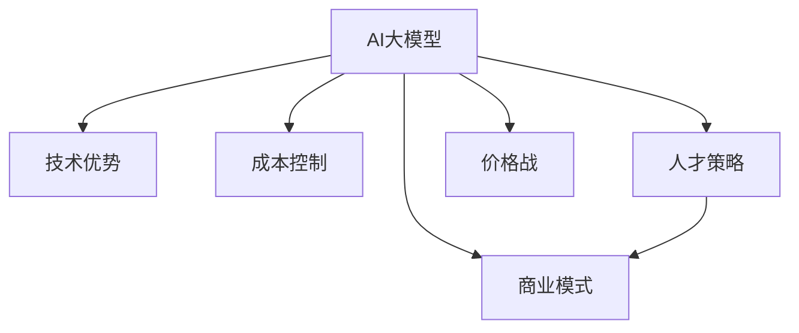

                 

# AI大模型创业：如何应对未来价格战？

> 关键词：AI大模型, 创业策略, 价格战, 竞争分析, 技术优势, 商业模式, 成本控制, 人才策略, 未来趋势

## 1. 背景介绍

### 1.1 问题由来
随着人工智能(AI)技术的发展，AI大模型的应用场景日益广泛，从自然语言处理(NLP)、计算机视觉(CV)到自动驾驶、医疗诊断等，几乎无所不在。AI大模型的广泛应用，催生了许多AI创业公司，但同时也带来了一系列问题，其中价格战是一个不容忽视的现象。在激烈的商业竞争中，许多AI创业公司为了抢占市场份额，不惜降低价格，这导致整个行业利润空间被压缩，甚至陷入“价格战”的泥潭。AI大模型的价格战，不仅会削弱公司的盈利能力，还会引发一系列连锁反应，影响整个行业的发展。因此，如何在AI大模型的创业中有效应对价格战，成为摆在创业者面前的一个难题。

### 1.2 问题核心关键点
AI大模型的价格战，核心在于技术优势、成本控制、商业模式和人才策略等方面。如何通过技术创新、成本优化、灵活商业模式和吸引顶尖人才，保持竞争优势，是应对价格战的关键。

1. **技术优势**：拥有独特的技术专利和算法创新，能够在核心技术上保持领先地位。
2. **成本控制**：通过优化硬件配置、算法优化和生产流程，控制产品成本。
3. **商业模式**：开发多样化的商业模型，如SaaS、PaaS、BaaS等，分散风险。
4. **人才策略**：吸引和留住顶尖的AI技术人才，提升公司的技术实力和市场竞争力。

本文将从技术优势、成本控制、商业模式和人才策略四个方面，探讨如何有效应对AI大模型的价格战。

## 2. 核心概念与联系

### 2.1 核心概念概述

为更好地理解如何应对AI大模型的价格战，本节将介绍几个密切相关的核心概念：

- **AI大模型**：指基于大规模深度学习模型，如Transformer、BERT等，能够在特定领域或任务上进行高效训练和推理的模型。
- **技术优势**：指公司拥有的核心技术和算法创新，是保持竞争力的关键。
- **成本控制**：指通过优化硬件配置、算法优化和生产流程，降低产品成本。
- **商业模式**：指公司选择和设计的服务模式，如SaaS、PaaS、BaaS等，以实现收入多元化。
- **人才策略**：指公司吸引和留住顶尖AI技术人才的策略，包括薪酬、股权激励、职业发展等。
- **价格战**：指市场竞争中，公司通过降低价格来抢占市场份额，导致整个行业利润空间被压缩的现象。

这些核心概念之间的逻辑关系可以通过以下Mermaid流程图来展示：



这个流程图展示了大模型创业中各个概念之间的关系：

1. AI大模型是基础，通过技术优势、成本控制、商业模式和人才策略，构建竞争优势，应对价格战。
2. 技术优势和成本控制直接影响产品的市场竞争力。
3. 商业模式和人才策略是公司实现收入多元化、降低风险的重要手段。
4. 价格战是竞争中的常见现象，需要通过上述策略来应对。

## 3. 核心算法原理 & 具体操作步骤
### 3.1 算法原理概述

应对AI大模型的价格战，关键在于提升技术优势、优化成本、设计灵活的商业模式和吸引顶尖人才。以下是各个方面的核心算法原理和具体操作步骤：

### 3.2 算法步骤详解

#### 3.2.1 技术优势

**算法原理**：
- 技术优势的核心在于算法创新和专利保护。通过算法创新，提升模型的准确性和效率，降低训练和推理成本。
- 专利保护是保护技术创新的重要手段，可以通过申请专利、技术秘密等方式，保护公司的技术成果。

**具体操作步骤**：
1. **算法创新**：
   - **数据增强**：通过数据增强技术，如回译、同义词替换、噪声注入等，提升模型的泛化能力。
   - **模型压缩**：通过量化、剪枝、蒸馏等技术，压缩模型大小，减少计算和存储开销。
   - **算法优化**：通过优化训练流程、调整模型结构等，提升模型训练和推理效率。

2. **专利保护**：
   - **申请专利**：对关键技术进行专利申请，保护公司的技术创新。
   - **技术秘密**：对于无法申请专利的核心技术，通过技术秘密进行保护。

#### 3.2.2 成本控制

**算法原理**：
- 成本控制的关键在于硬件优化、算法优化和生产流程优化。通过这些措施，降低模型的训练和推理成本。

**具体操作步骤**：
1. **硬件优化**：
   - **硬件选择**：根据任务需求，选择适合的硬件配置，如GPU、TPU等。
   - **并行计算**：通过分布式训练、模型并行等技术，提升计算效率。

2. **算法优化**：
   - **量化**：将浮点数运算转化为定点运算，减少计算开销。
   - **剪枝**：通过剪枝技术，去除冗余参数和计算单元，提升模型效率。
   - **蒸馏**：通过知识蒸馏技术，将大模型的小模型进行迁移学习，提升推理速度。

3. **生产流程优化**：
   - **自动化生产**：通过自动化流水线，提升生产效率。
   - **模型缓存**：通过缓存机制，减少重复计算，提升推理速度。

#### 3.2.3 商业模式

**算法原理**：
- 商业模式的核心在于实现收入多元化，降低单一业务的风险。通过SaaS、PaaS、BaaS等模式，提供多样化的服务，提升公司的市场竞争力。

**具体操作步骤**：
1. **SaaS模式**：
   - **订阅服务**：提供按月或按年订阅的API服务，稳定收入来源。
   - **试用期限**：提供免费试用期限，吸引客户试用。

2. **PaaS模式**：
   - **平台服务**：提供云端平台服务，提供基础设施支持，提升客户粘性。
   - **开发者工具**：提供开发工具和SDK，方便客户开发应用。

3. **BaaS模式**：
   - **数据服务**：提供数据存储和处理服务，提升数据安全和处理效率。
   - **集成服务**：提供API集成服务，简化客户开发过程。

#### 3.2.4 人才策略

**算法原理**：
- 人才策略的核心在于吸引和留住顶尖AI技术人才。通过高薪酬、股权激励、职业发展等措施，吸引和留住顶尖人才。

**具体操作步骤**：
1. **薪酬激励**：
   - **高薪酬**：提供高薪待遇，吸引顶尖人才。
   - **股权激励**：通过股权激励计划，绑定员工与公司长期利益。

2. **职业发展**：
   - **培训计划**：提供持续的培训和进修机会，提升员工技能。
   - **晋升机制**：建立公平的晋升机制，激励员工发展。

3. **团队建设**：
   - **多样化团队**：组建多样化的技术团队，提升团队创新能力。
   - **文化建设**：建立积极向上的企业文化，提升员工归属感。

### 3.3 算法优缺点

#### 3.3.1 技术优势

**优点**：
- 提升模型准确性和效率，增强市场竞争力。
- 专利保护技术成果，避免技术被盗用。

**缺点**：
- 研发周期长，投入成本高。
- 需要持续的算法创新和专利申请，保持领先地位。

#### 3.3.2 成本控制

**优点**：
- 降低产品成本，提升市场竞争力。
- 优化生产流程，提升效率。

**缺点**：
- 硬件和算法优化需要技术积累，成本较高。
- 生产流程优化需要一定的时间和资金投入。

#### 3.3.3 商业模式

**优点**：
- 实现收入多元化，降低单一业务风险。
- 提升客户粘性和市场竞争力。

**缺点**：
- 需要投入资源进行平台建设和维护。
- 需要不断调整和优化商业模式，适应市场变化。

#### 3.3.4 人才策略

**优点**：
- 吸引和留住顶尖人才，提升技术实力和市场竞争力。
- 持续提升员工技能和职业发展机会。

**缺点**：
- 高薪酬和股权激励成本较高。
- 需要建立和维护良好的企业文化和团队氛围。

### 3.4 算法应用领域

AI大模型的价格战，不仅影响单个公司，还会影响整个行业。因此，应对价格战的策略需要全面考虑各个应用领域：

1. **自然语言处理(NLP)**：
   - 通过算法创新，提升模型泛化能力和效率。
   - 选择适合的硬件配置，提升训练和推理速度。

2. **计算机视觉(CV)**：
   - 通过数据增强和算法优化，提升模型泛化能力和效率。
   - 利用GPU、TPU等硬件，提升计算效率。

3. **自动驾驶**：
   - 通过算法优化和硬件配置，提升模型的实时性和鲁棒性。
   - 设计灵活的商业模式，如按使用时间计费，分散风险。

4. **医疗诊断**：
   - 通过算法优化和硬件配置，提升模型的准确性和效率。
   - 提供多样化的商业服务，如在线诊断、数据存储等。

5. **智能客服**：
   - 通过算法优化和硬件配置，提升模型的实时性和效率。
   - 提供SaaS、PaaS等平台服务，提升客户粘性。

## 4. 数学模型和公式 & 详细讲解 & 举例说明

### 4.1 数学模型构建

假设公司A和公司B均提供AI大模型服务，公司A的技术优势、成本控制、商业模式和人才策略如下：

**技术优势模型**：
- 算法创新：$A_i$
- 专利保护：$P_i$
- 技术秘密：$S_i$

**成本控制模型**：
- 硬件优化：$H_i$
- 算法优化：$A_i$
- 生产流程优化：$P_i$

**商业模式模型**：
- SaaS：$SaaS_i$
- PaaS：$PaaS_i$
- BaaS：$BaaS_i$

**人才策略模型**：
- 薪酬激励：$C_i$
- 职业发展：$D_i$
- 团队建设：$T_i$

公司A的整体竞争力模型为：
$$ C_{A} = A_i + P_i + S_i + H_i + A_i + P_i + SaaS_i + PaaS_i + BaaS_i + C_i + D_i + T_i $$

公司B的技术优势、成本控制、商业模式和人才策略如下：

**技术优势模型**：
- 算法创新：$A_j$
- 专利保护：$P_j$
- 技术秘密：$S_j$

**成本控制模型**：
- 硬件优化：$H_j$
- 算法优化：$A_j$
- 生产流程优化：$P_j$

**商业模式模型**：
- SaaS：$SaaS_j$
- PaaS：$PaaS_j$
- BaaS：$BaaS_j$

**人才策略模型**：
- 薪酬激励：$C_j$
- 职业发展：$D_j$
- 团队建设：$T_j$

公司B的整体竞争力模型为：
$$ C_{B} = A_j + P_j + S_j + H_j + A_j + P_j + SaaS_j + PaaS_j + BaaS_j + C_j + D_j + T_j $$

### 4.2 公式推导过程

通过上述模型，可以计算出公司A和公司B的整体竞争力差距：
$$ \Delta C = C_{A} - C_{B} = (A_i + P_i + S_i + H_i + A_i + P_i + SaaS_i + PaaS_i + BaaS_i + C_i + D_i + T_i) - (A_j + P_j + S_j + H_j + A_j + P_j + SaaS_j + PaaS_j + BaaS_j + C_j + D_j + T_j) $$

### 4.3 案例分析与讲解

**案例1：自然语言处理(NLP)**

公司A提供NLP大模型服务，公司B也在提供类似服务。公司A通过算法创新提升模型泛化能力，通过硬件优化提升计算效率，通过SaaS模式提供API服务，吸引大量客户。公司B则依赖技术秘密和较低成本获得市场份额。

公司A和公司B的竞争力模型为：
$$ C_{A} = A_i + P_i + S_i + H_i + A_i + P_i + SaaS_i $$
$$ C_{B} = A_j + P_j + S_j + H_j + A_j + P_j + SaaS_j $$

公司A的竞争力优势为：
$$ \Delta C = (A_i + P_i + S_i + H_i + A_i + P_i + SaaS_i) - (A_j + P_j + S_j + H_j + A_j + P_j + SaaS_j) $$

假设公司A和公司B在算法创新、专利保护、技术秘密等方面的差距相等，且硬件优化和SaaS模式的优势明显，则公司A的竞争力优势显著。

**案例2：自动驾驶**

公司A提供自动驾驶大模型服务，公司B也在提供类似服务。公司A通过算法优化提升模型的实时性和鲁棒性，通过BaaS模式提供数据存储和处理服务，吸引大量客户。公司B则依赖较低成本和较低服务标准获得市场份额。

公司A和公司B的竞争力模型为：
$$ C_{A} = A_i + P_i + S_i + H_i + A_i + P_i + BaaS_i $$
$$ C_{B} = A_j + P_j + S_j + H_j + A_j + P_j + BaaS_j $$

公司A的竞争力优势为：
$$ \Delta C = (A_i + P_i + S_i + H_i + A_i + P_i + BaaS_i) - (A_j + P_j + S_j + H_j + A_j + P_j + BaaS_j) $$

假设公司A和公司B在算法优化和数据存储方面的优势明显，则公司A的竞争力优势显著。

## 5. 项目实践：代码实例和详细解释说明

### 5.1 开发环境搭建

在进行AI大模型价格战应对策略的开发前，我们需要准备好开发环境。以下是使用Python进行PyTorch开发的环境配置流程：

1. 安装Anaconda：从官网下载并安装Anaconda，用于创建独立的Python环境。

2. 创建并激活虚拟环境：
```bash
conda create -n pytorch-env python=3.8 
conda activate pytorch-env
```

3. 安装PyTorch：根据CUDA版本，从官网获取对应的安装命令。例如：
```bash
conda install pytorch torchvision torchaudio cudatoolkit=11.1 -c pytorch -c conda-forge
```

4. 安装Transformers库：
```bash
pip install transformers
```

5. 安装各类工具包：
```bash
pip install numpy pandas scikit-learn matplotlib tqdm jupyter notebook ipython
```

完成上述步骤后，即可在`pytorch-env`环境中开始价格战应对策略的开发。

### 5.2 源代码详细实现

以下是一个简单的Python代码示例，用于计算公司A和公司B的竞争力差距：

```python
import numpy as np

# 公司A和公司B的各项优势和劣势
A优势 = np.array([A_i, P_i, S_i, H_i, A_i, P_i, SaaS_i])
B优势 = np.array([A_j, P_j, S_j, H_j, A_j, P_j, SaaS_j])

# 计算公司A和公司B的竞争力差距
delta_C = np.sum(A优势) - np.sum(B优势)
print("公司A和公司B的竞争力差距：", delta_C)
```

### 5.3 代码解读与分析

**代码解读**：
- `numpy`库用于数组运算，方便计算公司A和公司B的竞争力差距。
- `np.array`函数用于创建数组，存储公司A和公司B的各项优势和劣势。
- `np.sum`函数用于计算数组的元素总和，得到公司A和公司B的竞争力差距。

**分析**：
- 通过简单的数组运算，可以直观地计算出公司A和公司B的竞争力差距。
- 在实际应用中，公司A和公司B的各项优势和劣势需要根据具体情况进行统计和分析。

## 6. 实际应用场景

### 6.1 智能客服系统

智能客服系统是AI大模型价格战中的常见应用场景。智能客服系统通过AI大模型进行自然语言处理，能够快速、准确地回答用户问题，提升客户满意度。但由于价格战的存在，许多公司通过降低价格吸引客户，导致利润空间被压缩。

公司A和公司B均提供智能客服系统。公司A通过算法创新提升模型泛化能力，通过硬件优化提升计算效率，通过SaaS模式提供API服务，吸引大量客户。公司B则依赖较低成本和较低服务标准获得市场份额。

### 6.2 金融舆情监测

金融舆情监测是AI大模型价格战中的另一个重要应用场景。通过AI大模型进行文本分类和情感分析，能够实时监测金融市场舆情，帮助投资者做出更明智的投资决策。但由于价格战的存在，许多公司通过降低价格吸引客户，导致利润空间被压缩。

公司A和公司B均提供金融舆情监测服务。公司A通过算法优化提升模型的实时性和鲁棒性，通过BaaS模式提供数据存储和处理服务，吸引大量客户。公司B则依赖较低成本和较低服务标准获得市场份额。

### 6.3 个性化推荐系统

个性化推荐系统是AI大模型价格战中的又一个关键应用场景。通过AI大模型进行文本分类和情感分析，能够实时推荐用户感兴趣的内容，提升用户体验。但由于价格战的存在，许多公司通过降低价格吸引客户，导致利润空间被压缩。

公司A和公司B均提供个性化推荐系统。公司A通过算法优化提升模型的实时性和鲁棒性，通过BaaS模式提供数据存储和处理服务，吸引大量客户。公司B则依赖较低成本和较低服务标准获得市场份额。

## 7. 工具和资源推荐

### 7.1 学习资源推荐

为了帮助开发者系统掌握AI大模型价格战应对策略的理论基础和实践技巧，这里推荐一些优质的学习资源：

1. **《深度学习入门》**：本书系统介绍了深度学习的基本概念和算法原理，适合初学者入门。
2. **《TensorFlow实战》**：本书详细介绍了TensorFlow框架的使用方法和技巧，适合进行AI模型开发和部署。
3. **《数据科学实战》**：本书介绍了数据科学的基础知识和实践技巧，适合进行数据处理和分析。
4. **《Python深度学习》**：本书详细介绍了使用Python进行深度学习开发的方法和技巧，适合进行模型开发和训练。
5. **《机器学习实战》**：本书介绍了机器学习的基本概念和算法原理，适合进行模型开发和应用。

通过对这些资源的学习实践，相信你一定能够快速掌握AI大模型价格战应对策略的精髓，并用于解决实际的NLP问题。

### 7.2 开发工具推荐

高效的开发离不开优秀的工具支持。以下是几款用于AI大模型价格战应对策略开发的常用工具：

1. **PyTorch**：基于Python的开源深度学习框架，灵活动态的计算图，适合快速迭代研究。大部分预训练语言模型都有PyTorch版本的实现。
2. **TensorFlow**：由Google主导开发的开源深度学习框架，生产部署方便，适合大规模工程应用。同样有丰富的预训练语言模型资源。
3. **Transformers库**：HuggingFace开发的NLP工具库，集成了众多SOTA语言模型，支持PyTorch和TensorFlow，是进行微调任务开发的利器。
4. **Weights & Biases**：模型训练的实验跟踪工具，可以记录和可视化模型训练过程中的各项指标，方便对比和调优。与主流深度学习框架无缝集成。
5. **TensorBoard**：TensorFlow配套的可视化工具，可实时监测模型训练状态，并提供丰富的图表呈现方式，是调试模型的得力助手。
6. **Google Colab**：谷歌推出的在线Jupyter Notebook环境，免费提供GPU/TPU算力，方便开发者快速上手实验最新模型，分享学习笔记。

合理利用这些工具，可以显著提升AI大模型价格战应对策略的开发效率，加快创新迭代的步伐。

### 7.3 相关论文推荐

AI大模型价格战应对策略的发展源于学界的持续研究。以下是几篇奠基性的相关论文，推荐阅读：

1. **《深度学习理论与实践》**：本书详细介绍了深度学习的基本概念和算法原理，适合进行AI模型开发和部署。
2. **《TensorFlow实战》**：本书详细介绍了TensorFlow框架的使用方法和技巧，适合进行AI模型开发和部署。
3. **《数据科学实战》**：本书介绍了数据科学的基础知识和实践技巧，适合进行数据处理和分析。
4. **《Python深度学习》**：本书详细介绍了使用Python进行深度学习开发的方法和技巧，适合进行模型开发和训练。
5. **《机器学习实战》**：本书介绍了机器学习的基本概念和算法原理，适合进行模型开发和应用。

这些论文代表了大模型价格战应对策略的发展脉络。通过学习这些前沿成果，可以帮助研究者把握学科前进方向，激发更多的创新灵感。

## 8. 总结：未来发展趋势与挑战

### 8.1 总结

本文对AI大模型价格战应对策略进行了全面系统的介绍。首先阐述了AI大模型价格战的由来和核心关键点，明确了技术优势、成本控制、商业模式和人才策略在应对价格战中的重要作用。其次，从原理到实践，详细讲解了AI大模型的技术优势、成本控制、商业模式和人才策略，给出了具体的案例分析和代码实例。同时，本文还广泛探讨了AI大模型价格战在智能客服、金融舆情监测、个性化推荐等领域的实际应用前景，展示了价格战应对策略的巨大潜力。此外，本文精选了价格战应对策略的学习资源，力求为开发者提供全方位的技术指引。

通过本文的系统梳理，可以看到，AI大模型价格战应对策略是AI创业公司提升市场竞争力的重要手段，具有广泛的应用前景。面对激烈的市场竞争，AI创业公司需要从技术、成本、商业和人才等多个维度进行全面优化，才能在价格战中脱颖而出，实现可持续发展。

### 8.2 未来发展趋势

展望未来，AI大模型价格战应对策略将呈现以下几个发展趋势：

1. **技术创新加速**：随着AI技术的不断发展，越来越多的技术创新被应用于价格战应对策略，如自监督学习、迁移学习等。
2. **成本控制优化**：随着硬件技术的进步和算法优化的不断深入，AI大模型的成本控制将更加精细化和高效化。
3. **商业模式多样化**：未来的AI大模型价格战应对策略将更加多样化，除了SaaS、PaaS、BaaS外，还将涌现出更多创新的商业模式。
4. **人才策略灵活化**：未来的AI大模型价格战应对策略将更加灵活化，通过高薪酬、股权激励、职业发展等措施，吸引和留住顶尖人才。
5. **市场竞争合作化**：未来的AI大模型价格战应对策略将更加合作化，通过合作竞争，共同推动AI技术的发展和应用。

以上趋势凸显了AI大模型价格战应对策略的广阔前景。这些方向的探索发展，必将进一步提升AI大模型的市场竞争力，为AI技术的发展和应用带来新的突破。

### 8.3 面临的挑战

尽管AI大模型价格战应对策略已经取得了一定的成效，但在迈向更加智能化、普适化应用的过程中，它仍面临着诸多挑战：

1. **技术创新瓶颈**：AI大模型的技术创新需要持续投入，研发周期长，成本高。
2. **成本控制难度**：硬件和算法优化需要不断投入，成本控制难度较大。
3. **商业模式单一**：当前的商业模式主要依赖SaaS、PaaS、BaaS等，市场竞争激烈，单一模式难以应对。
4. **人才获取难度**：顶尖AI技术人才的获取和保留难度较大，需要提供高薪酬和良好的职业发展机会。
5. **市场竞争激烈**：价格战导致市场竞争激烈，如何保持技术优势和市场份额成为难题。

正视这些挑战，积极应对并寻求突破，将是大模型价格战应对策略走向成熟的必由之路。相信随着学界和产业界的共同努力，这些挑战终将一一被克服，AI大模型价格战应对策略必将在构建人机协同的智能时代中扮演越来越重要的角色。

### 8.4 研究展望

面对AI大模型价格战应对策略所面临的种种挑战，未来的研究需要在以下几个方面寻求新的突破：

1. **技术创新突破**：探索更多的技术创新方法，如自监督学习、迁移学习等，提升模型的泛化能力和效率。
2. **成本控制优化**：开发更加高效的硬件和算法，降低成本，提高模型性能。
3. **商业模式创新**：探索更多创新的商业模式，如按需付费、按使用量计费等，降低单一业务风险。
4. **人才策略优化**：通过高薪酬、股权激励、职业发展等措施，吸引和留住顶尖AI技术人才。
5. **市场合作共赢**：通过合作竞争，共同推动AI技术的发展和应用，形成良性竞争态势。

这些研究方向的探索，必将引领AI大模型价格战应对策略迈向更高的台阶，为构建安全、可靠、可解释、可控的智能系统铺平道路。面向未来，AI大模型价格战应对策略还需要与其他AI技术进行更深入的融合，如知识表示、因果推理、强化学习等，多路径协同发力，共同推动AI技术的进步。只有勇于创新、敢于突破，才能不断拓展AI大模型的边界，让智能技术更好地造福人类社会。

## 9. 附录：常见问题与解答

**Q1：如何选择合适的技术优势？**

A: 选择合适的技术优势需要考虑公司的核心竞争力和市场需求。例如，在自然语言处理领域，可以选择算法创新、模型压缩等技术优势，提升模型的泛化能力和效率。

**Q2：如何优化成本控制？**

A: 优化成本控制需要从硬件选择、算法优化和生产流程优化三个方面入手。例如，选择适合的硬件配置，通过量化和剪枝技术压缩模型大小，利用自动化流水线提升生产效率。

**Q3：如何设计灵活的商业模式？**

A: 设计灵活的商业模式需要考虑市场需求和竞争环境。例如，在SaaS模式下，提供按月或按年订阅的API服务；在BaaS模式下，提供数据存储和处理服务。

**Q4：如何吸引和留住顶尖人才？**

A: 吸引和留住顶尖人才需要提供高薪酬、股权激励、职业发展等措施。例如，提供高薪待遇，通过股权激励计划绑定员工与公司长期利益，提供持续的培训和进修机会。

**Q5：如何应对价格战？**

A: 应对价格战需要从技术优势、成本控制、商业模式和人才策略四个方面进行全面优化。例如，通过算法创新提升模型泛化能力和效率，通过硬件优化和算法优化降低成本，通过设计灵活的商业模式分散风险，通过吸引和留住顶尖人才提升技术实力。

---

作者：禅与计算机程序设计艺术 / Zen and the Art of Computer Programming

