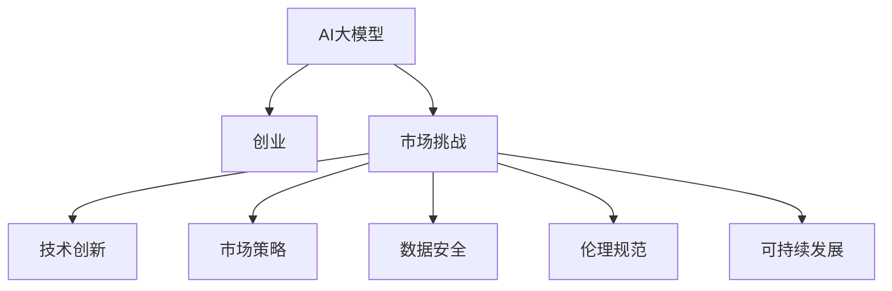

                 

# AI大模型创业：如何应对未来市场挑战？

> 关键词：大模型,创业,市场挑战,技术创新,市场策略,数据安全,伦理规范,可持续发展

## 1. 背景介绍

### 1.1 问题由来
随着人工智能技术的飞速发展，尤其是大模型（如GPT-3、BERT等）的广泛应用，企业纷纷涌入AI大模型创业领域，旨在抢占未来技术高地。但与此同时，AI大模型创业也面临着多重市场挑战，包括技术创新、市场策略、数据安全、伦理规范和可持续发展等方面的问题。

### 1.2 问题核心关键点
AI大模型创业的核心关键点包括：
- **技术创新**：如何利用大模型技术创造新的应用场景和产品。
- **市场策略**：如何通过有效的市场推广和产品定位，获取市场份额。
- **数据安全**：如何保护用户数据隐私，防止数据泄露。
- **伦理规范**：如何制定伦理准则，确保AI系统的公平、公正性。
- **可持续发展**：如何在追求技术领先的同时，实现社会价值和环境责任。

本文将从上述几个关键点出发，深入探讨AI大模型创业面临的市场挑战，并提出应对策略。

## 2. 核心概念与联系

### 2.1 核心概念概述

为更好地理解AI大模型创业，本节将介绍几个核心概念及其相互联系：

- **AI大模型**：基于大规模数据集训练而成的深度学习模型，具备强大的学习和推理能力，如GPT-3、BERT等。
- **创业**：企业或个人基于市场需求，利用技术创新开发新产品或服务的过程。
- **市场挑战**：企业在AI大模型创业过程中，所面临的各种难题和挑战，如技术、市场、法律、伦理等。
- **技术创新**：通过持续的技术研究和开发，推动产品或服务不断升级和优化。
- **市场策略**：企业为达到营销目标，对目标市场进行研究和分析，采取的营销手段和策略。
- **数据安全**：保护用户数据隐私，防止数据被未经授权的访问或使用。
- **伦理规范**：制定并遵守的伦理准则，确保AI系统公平、公正、透明。
- **可持续发展**：追求技术、经济和环境协同发展的策略和方法。

这些核心概念通过以下Mermaid流程图进行展示：



这个流程图展示了AI大模型与创业过程之间的逻辑关系：

1. AI大模型为创业提供技术基础。
2. 在创业过程中，企业会面临各种市场挑战。
3. 通过技术创新，企业可以克服这些挑战。
4. 制定正确的市场策略，可以帮助企业获得市场份额。
5. 保障数据安全和伦理规范，确保企业的可持续发展和用户信任。
6. 实现可持续发展，确保企业在追求技术领先的同时，符合社会和环境要求。

## 3. 核心算法原理 & 具体操作步骤
### 3.1 算法原理概述

AI大模型创业的核心算法原理可以概括为：

1. **数据驱动**：通过大规模数据集训练模型，学习复杂的语言和语义规律。
2. **技术创新**：基于大模型技术，开发新的应用场景和产品。
3. **市场策略**：通过市场分析和用户研究，制定有效的市场推广和销售策略。
4. **数据安全**：采用先进的数据加密和隐私保护技术，确保用户数据的安全性。
5. **伦理规范**：制定并遵守伦理准则，确保AI系统的公平、公正和透明。
6. **可持续发展**：在技术创新和市场发展的同时，关注社会和环境责任。

### 3.2 算法步骤详解

AI大模型创业的一般步骤如下：

**Step 1: 数据准备**
- 收集大规模、高质量的标注数据，用于训练大模型。
- 对数据进行预处理和清洗，确保数据质量和多样性。

**Step 2: 模型训练**
- 选择合适的大模型架构和训练方法，进行预训练和微调。
- 在计算资源充足的情况下，使用GPU或TPU进行高效训练。

**Step 3: 产品开发**
- 基于训练好的模型，开发新的应用场景和产品。
- 设计用户界面和交互方式，提升用户体验。

**Step 4: 市场推广**
- 通过市场调研和用户反馈，确定目标市场和目标用户。
- 制定差异化的市场策略，如价格策略、渠道策略、品牌策略等。

**Step 5: 数据安全**
- 采用先进的加密技术和隐私保护措施，确保用户数据安全。
- 制定数据使用和共享的伦理规范，确保数据合规。

**Step 6: 可持续发展**
- 关注社会和环境责任，采用绿色计算和环保技术。
- 定期评估和改进企业的可持续发展战略。

### 3.3 算法优缺点

AI大模型创业具有以下优点：

- **高效性**：利用大模型技术，可以快速开发新产品和应用。
- **市场潜力**：AI大模型在各个行业都有广泛应用，市场前景广阔。
- **技术领先**：大模型技术具有强大的学习和推理能力，可以带来技术优势。

同时，也存在一些缺点：

- **资源需求高**：大规模数据集和计算资源的需求，增加了创业成本。
- **伦理风险**：大模型的使用可能带来偏见、歧视等问题，需要严格的伦理规范。
- **市场竞争激烈**：众多企业涌入AI大模型领域，市场竞争激烈。

### 3.4 算法应用领域

AI大模型创业可以应用于多个领域，如：

- **自然语言处理**：开发智能客服、语音助手、翻译等产品。
- **图像识别**：开发自动驾驶、安防监控、医学影像分析等应用。
- **推荐系统**：开发个性化推荐、内容推荐等产品。
- **金融科技**：开发智能投顾、风险评估、信用评分等应用。
- **医疗健康**：开发智能诊断、健康管理、药物研发等应用。

## 4. 数学模型和公式 & 详细讲解  
### 4.1 数学模型构建

本节将使用数学语言对AI大模型创业的算法原理进行进一步详细讲解。

假设训练数据集为 $D=\{(x_i,y_i)\}_{i=1}^N$，其中 $x_i$ 为输入样本，$y_i$ 为对应的标签。大模型 $M_{\theta}$ 的损失函数为：

$$
\mathcal{L}(\theta) = \frac{1}{N}\sum_{i=1}^N \ell(M_{\theta}(x_i),y_i)
$$

其中 $\ell$ 为损失函数，用于衡量模型输出和真实标签之间的差异。常见的损失函数包括交叉熵损失、均方误差损失等。

### 4.2 公式推导过程

以交叉熵损失为例，其推导过程如下：

1. 模型预测输出为 $p$，真实标签为 $y$，则交叉熵损失为：

$$
\ell(y,p) = -y\log p - (1-y)\log(1-p)
$$

2. 将损失函数带入经验风险公式：

$$
\mathcal{L}(\theta) = -\frac{1}{N}\sum_{i=1}^N [y_i\log M_{\theta}(x_i)+(1-y_i)\log(1-M_{\theta}(x_i))]
$$

3. 利用反向传播算法求梯度：

$$
\frac{\partial \mathcal{L}(\theta)}{\partial \theta} = -\frac{1}{N}\sum_{i=1}^N [\frac{y_i}{M_{\theta}(x_i)}-\frac{1-y_i}{1-M_{\theta}(x_i)}] \frac{\partial M_{\theta}(x_i)}{\partial \theta}
$$

通过梯度下降等优化算法，不断更新模型参数 $\theta$，最小化损失函数 $\mathcal{L}$，使得模型输出逼近真实标签。

### 4.3 案例分析与讲解

以智能客服为例，其数学模型和算法流程如下：

1. 收集用户的历史对话数据 $D=\{(x_i,y_i)\}_{i=1}^N$，其中 $x_i$ 为用户的输入，$y_i$ 为系统的回复。

2. 使用大模型 $M_{\theta}$ 进行预训练和微调，得到智能客服模型 $M_{\hat{\theta}}$。

3. 将用户输入 $x$ 输入智能客服模型，得到系统回复 $y$。

4. 对回复 $y$ 进行后处理和优化，确保回复质量和用户体验。

## 5. 项目实践：代码实例和详细解释说明
### 5.1 开发环境搭建

在进行AI大模型创业项目实践前，我们需要准备好开发环境。以下是使用Python进行PyTorch开发的环境配置流程：

1. 安装Anaconda：从官网下载并安装Anaconda，用于创建独立的Python环境。

2. 创建并激活虚拟环境：
```bash
conda create -n pytorch-env python=3.8 
conda activate pytorch-env
```

3. 安装PyTorch：根据CUDA版本，从官网获取对应的安装命令。例如：
```bash
conda install pytorch torchvision torchaudio cudatoolkit=11.1 -c pytorch -c conda-forge
```

4. 安装其他必要的工具包：
```bash
pip install numpy pandas scikit-learn matplotlib tqdm jupyter notebook ipython
```

完成上述步骤后，即可在`pytorch-env`环境中开始项目实践。

### 5.2 源代码详细实现

下面以智能客服系统为例，给出使用Transformers库对BERT模型进行微调的PyTorch代码实现。

首先，定义智能客服系统的数据处理函数：

```python
from transformers import BertTokenizer
from torch.utils.data import Dataset
import torch

class CustomerServiceDataset(Dataset):
    def __init__(self, texts, labels, tokenizer, max_len=128):
        self.texts = texts
        self.labels = labels
        self.tokenizer = tokenizer
        self.max_len = max_len
        
    def __len__(self):
        return len(self.texts)
    
    def __getitem__(self, item):
        text = self.texts[item]
        label = self.labels[item]
        
        encoding = self.tokenizer(text, return_tensors='pt', max_length=self.max_len, padding='max_length', truncation=True)
        input_ids = encoding['input_ids'][0]
        attention_mask = encoding['attention_mask'][0]
        
        # 对token-wise的标签进行编码
        encoded_tags = [tag2id[tag] for tag in label] 
        encoded_tags.extend([tag2id['O']] * (self.max_len - len(encoded_tags)))
        labels = torch.tensor(encoded_tags, dtype=torch.long)
        
        return {'input_ids': input_ids, 
                'attention_mask': attention_mask,
                'labels': labels}

# 标签与id的映射
tag2id = {'O': 0, 'ANSWER': 1, 'REST': 2}
id2tag = {v: k for k, v in tag2id.items()}

# 创建dataset
tokenizer = BertTokenizer.from_pretrained('bert-base-cased')

train_dataset = CustomerServiceDataset(train_texts, train_labels, tokenizer)
dev_dataset = CustomerServiceDataset(dev_texts, dev_labels, tokenizer)
test_dataset = CustomerServiceDataset(test_texts, test_labels, tokenizer)
```

然后，定义模型和优化器：

```python
from transformers import BertForTokenClassification, AdamW

model = BertForTokenClassification.from_pretrained('bert-base-cased', num_labels=len(tag2id))

optimizer = AdamW(model.parameters(), lr=2e-5)
```

接着，定义训练和评估函数：

```python
from torch.utils.data import DataLoader
from tqdm import tqdm
from sklearn.metrics import classification_report

device = torch.device('cuda') if torch.cuda.is_available() else torch.device('cpu')
model.to(device)

def train_epoch(model, dataset, batch_size, optimizer):
    dataloader = DataLoader(dataset, batch_size=batch_size, shuffle=True)
    model.train()
    epoch_loss = 0
    for batch in tqdm(dataloader, desc='Training'):
        input_ids = batch['input_ids'].to(device)
        attention_mask = batch['attention_mask'].to(device)
        labels = batch['labels'].to(device)
        model.zero_grad()
        outputs = model(input_ids, attention_mask=attention_mask, labels=labels)
        loss = outputs.loss
        epoch_loss += loss.item()
        loss.backward()
        optimizer.step()
    return epoch_loss / len(dataloader)

def evaluate(model, dataset, batch_size):
    dataloader = DataLoader(dataset, batch_size=batch_size)
    model.eval()
    preds, labels = [], []
    with torch.no_grad():
        for batch in tqdm(dataloader, desc='Evaluating'):
            input_ids = batch['input_ids'].to(device)
            attention_mask = batch['attention_mask'].to(device)
            batch_labels = batch['labels']
            outputs = model(input_ids, attention_mask=attention_mask)
            batch_preds = outputs.logits.argmax(dim=2).to('cpu').tolist()
            batch_labels = batch_labels.to('cpu').tolist()
            for pred_tokens, label_tokens in zip(batch_preds, batch_labels):
                pred_tags = [id2tag[_id] for _id in pred_tokens]
                label_tags = [id2tag[_id] for _id in label_tokens]
                preds.append(pred_tags[:len(label_tags)])
                labels.append(label_tags)
                
    print(classification_report(labels, preds))
```

最后，启动训练流程并在测试集上评估：

```python
epochs = 5
batch_size = 16

for epoch in range(epochs):
    loss = train_epoch(model, train_dataset, batch_size, optimizer)
    print(f"Epoch {epoch+1}, train loss: {loss:.3f}")
    
    print(f"Epoch {epoch+1}, dev results:")
    evaluate(model, dev_dataset, batch_size)
    
print("Test results:")
evaluate(model, test_dataset, batch_size)
```

以上就是使用PyTorch对BERT进行智能客服系统微调的完整代码实现。可以看到，利用Transformers库，我们可以用相对简洁的代码完成模型的加载和微调。

### 5.3 代码解读与分析

让我们再详细解读一下关键代码的实现细节：

**CustomerServiceDataset类**：
- `__init__`方法：初始化文本、标签、分词器等关键组件。
- `__len__`方法：返回数据集的样本数量。
- `__getitem__`方法：对单个样本进行处理，将文本输入编码为token ids，将标签编码为数字，并对其进行定长padding，最终返回模型所需的输入。

**tag2id和id2tag字典**：
- 定义了标签与数字id之间的映射关系，用于将token-wise的预测结果解码回真实的标签。

**训练和评估函数**：
- 使用PyTorch的DataLoader对数据集进行批次化加载，供模型训练和推理使用。
- 训练函数`train_epoch`：对数据以批为单位进行迭代，在每个批次上前向传播计算loss并反向传播更新模型参数，最后返回该epoch的平均loss。
- 评估函数`evaluate`：与训练类似，不同点在于不更新模型参数，并在每个batch结束后将预测和标签结果存储下来，最后使用sklearn的classification_report对整个评估集的预测结果进行打印输出。

**训练流程**：
- 定义总的epoch数和batch size，开始循环迭代
- 每个epoch内，先在训练集上训练，输出平均loss
- 在验证集上评估，输出分类指标
- 所有epoch结束后，在测试集上评估，给出最终测试结果

可以看到，PyTorch配合Transformers库使得BERT微调的代码实现变得简洁高效。开发者可以将更多精力放在数据处理、模型改进等高层逻辑上，而不必过多关注底层的实现细节。

当然，工业级的系统实现还需考虑更多因素，如模型的保存和部署、超参数的自动搜索、更灵活的任务适配层等。但核心的微调范式基本与此类似。

## 6. 实际应用场景
### 6.1 智能客服系统

基于大模型微调的对话技术，可以广泛应用于智能客服系统的构建。传统客服往往需要配备大量人力，高峰期响应缓慢，且一致性和专业性难以保证。而使用微调后的对话模型，可以7x24小时不间断服务，快速响应客户咨询，用自然流畅的语言解答各类常见问题。

在技术实现上，可以收集企业内部的历史客服对话记录，将问题和最佳答复构建成监督数据，在此基础上对预训练对话模型进行微调。微调后的对话模型能够自动理解用户意图，匹配最合适的答案模板进行回复。对于客户提出的新问题，还可以接入检索系统实时搜索相关内容，动态组织生成回答。如此构建的智能客服系统，能大幅提升客户咨询体验和问题解决效率。

### 6.2 金融舆情监测

金融机构需要实时监测市场舆论动向，以便及时应对负面信息传播，规避金融风险。传统的人工监测方式成本高、效率低，难以应对网络时代海量信息爆发的挑战。基于大语言模型微调的文本分类和情感分析技术，为金融舆情监测提供了新的解决方案。

具体而言，可以收集金融领域相关的新闻、报道、评论等文本数据，并对其进行主题标注和情感标注。在此基础上对预训练语言模型进行微调，使其能够自动判断文本属于何种主题，情感倾向是正面、中性还是负面。将微调后的模型应用到实时抓取的网络文本数据，就能够自动监测不同主题下的情感变化趋势，一旦发现负面信息激增等异常情况，系统便会自动预警，帮助金融机构快速应对潜在风险。

### 6.3 个性化推荐系统

当前的推荐系统往往只依赖用户的历史行为数据进行物品推荐，无法深入理解用户的真实兴趣偏好。基于大语言模型微调技术，个性化推荐系统可以更好地挖掘用户行为背后的语义信息，从而提供更精准、多样的推荐内容。

在实践中，可以收集用户浏览、点击、评论、分享等行为数据，提取和用户交互的物品标题、描述、标签等文本内容。将文本内容作为模型输入，用户的后续行为（如是否点击、购买等）作为监督信号，在此基础上微调预训练语言模型。微调后的模型能够从文本内容中准确把握用户的兴趣点。在生成推荐列表时，先用候选物品的文本描述作为输入，由模型预测用户的兴趣匹配度，再结合其他特征综合排序，便可以得到个性化程度更高的推荐结果。

### 6.4 未来应用展望

随着大语言模型和微调方法的不断发展，基于微调范式将在更多领域得到应用，为传统行业带来变革性影响。

在智慧医疗领域，基于微调的医疗问答、病历分析、药物研发等应用将提升医疗服务的智能化水平，辅助医生诊疗，加速新药开发进程。

在智能教育领域，微调技术可应用于作业批改、学情分析、知识推荐等方面，因材施教，促进教育公平，提高教学质量。

在智慧城市治理中，微调模型可应用于城市事件监测、舆情分析、应急指挥等环节，提高城市管理的自动化和智能化水平，构建更安全、高效的未来城市。

此外，在企业生产、社会治理、文娱传媒等众多领域，基于大模型微调的人工智能应用也将不断涌现，为NLP技术带来了全新的突破。随着预训练语言模型和微调方法的持续演进，相信NLP技术将在更广阔的应用领域大放异彩，深刻影响人类的生产生活方式。

## 7. 工具和资源推荐
### 7.1 学习资源推荐

为了帮助开发者系统掌握大语言模型微调的理论基础和实践技巧，这里推荐一些优质的学习资源：

1. 《Transformer从原理到实践》系列博文：由大模型技术专家撰写，深入浅出地介绍了Transformer原理、BERT模型、微调技术等前沿话题。

2. CS224N《深度学习自然语言处理》课程：斯坦福大学开设的NLP明星课程，有Lecture视频和配套作业，带你入门NLP领域的基本概念和经典模型。

3. 《Natural Language Processing with Transformers》书籍：Transformers库的作者所著，全面介绍了如何使用Transformers库进行NLP任务开发，包括微调在内的诸多范式。

4. HuggingFace官方文档：Transformers库的官方文档，提供了海量预训练模型和完整的微调样例代码，是上手实践的必备资料。

5. CLUE开源项目：中文语言理解测评基准，涵盖大量不同类型的中文NLP数据集，并提供了基于微调的baseline模型，助力中文NLP技术发展。

通过对这些资源的学习实践，相信你一定能够快速掌握大语言模型微调的精髓，并用于解决实际的NLP问题。
###  7.2 开发工具推荐

高效的开发离不开优秀的工具支持。以下是几款用于大语言模型微调开发的常用工具：

1. PyTorch：基于Python的开源深度学习框架，灵活动态的计算图，适合快速迭代研究。大部分预训练语言模型都有PyTorch版本的实现。

2. TensorFlow：由Google主导开发的开源深度学习框架，生产部署方便，适合大规模工程应用。同样有丰富的预训练语言模型资源。

3. Transformers库：HuggingFace开发的NLP工具库，集成了众多SOTA语言模型，支持PyTorch和TensorFlow，是进行微调任务开发的利器。

4. Weights & Biases：模型训练的实验跟踪工具，可以记录和可视化模型训练过程中的各项指标，方便对比和调优。与主流深度学习框架无缝集成。

5. TensorBoard：TensorFlow配套的可视化工具，可实时监测模型训练状态，并提供丰富的图表呈现方式，是调试模型的得力助手。

6. Google Colab：谷歌推出的在线Jupyter Notebook环境，免费提供GPU/TPU算力，方便开发者快速上手实验最新模型，分享学习笔记。

合理利用这些工具，可以显著提升大语言模型微调任务的开发效率，加快创新迭代的步伐。

### 7.3 相关论文推荐

大语言模型和微调技术的发展源于学界的持续研究。以下是几篇奠基性的相关论文，推荐阅读：

1. Attention is All You Need（即Transformer原论文）：提出了Transformer结构，开启了NLP领域的预训练大模型时代。

2. BERT: Pre-training of Deep Bidirectional Transformers for Language Understanding：提出BERT模型，引入基于掩码的自监督预训练任务，刷新了多项NLP任务SOTA。

3. Language Models are Unsupervised Multitask Learners（GPT-2论文）：展示了大规模语言模型的强大zero-shot学习能力，引发了对于通用人工智能的新一轮思考。

4. Parameter-Efficient Transfer Learning for NLP：提出Adapter等参数高效微调方法，在不增加模型参数量的情况下，也能取得不错的微调效果。

5. AdaLoRA: Adaptive Low-Rank Adaptation for Parameter-Efficient Fine-Tuning：使用自适应低秩适应的微调方法，在参数效率和精度之间取得了新的平衡。

6. Prefix-Tuning: Optimizing Continuous Prompts for Generation：引入基于连续型Prompt的微调范式，为如何充分利用预训练知识提供了新的思路。

这些论文代表了大语言模型微调技术的发展脉络。通过学习这些前沿成果，可以帮助研究者把握学科前进方向，激发更多的创新灵感。

## 8. 总结：未来发展趋势与挑战
### 8.1 总结

本文对AI大模型创业的算法原理、操作步骤和具体实现进行了全面系统的介绍。首先阐述了AI大模型创业的背景和意义，明确了其核心挑战和应对策略。其次，从技术创新、市场策略、数据安全、伦理规范和可持续发展等方面，详细讲解了AI大模型创业的实际应用场景和未来发展趋势。

通过本文的系统梳理，可以看到，AI大模型创业在技术创新、市场推广和应用落地等方面面临多重挑战。但通过有效的技术优化和策略调整，可以逐步克服这些挑战，实现企业的可持续发展。未来，伴随着大模型技术的不懈追求和市场需求的不断增长，AI大模型创业必将在各行各业中大放异彩，带来更广阔的应用前景和更深刻的社会影响。

### 8.2 未来发展趋势

展望未来，AI大模型创业将呈现以下几个发展趋势：

1. **技术创新持续推进**：大模型技术将不断进步，提供更高效、更精确的模型训练和推理算法。
2. **市场策略多样化**：通过差异化的产品设计和市场定位，满足多样化的市场需求。
3. **数据安全保障加强**：采用更加先进的数据加密和隐私保护技术，确保用户数据的安全性。
4. **伦理规范逐步完善**：制定并遵守严格的伦理准则，确保AI系统的公平、公正和透明。
5. **可持续发展成为常态**：在追求技术领先的同时，注重社会和环境责任，实现绿色发展。

### 8.3 面临的挑战

尽管AI大模型创业已经取得了一些初步成果，但在迈向成熟的过程中，仍面临以下挑战：

1. **技术瓶颈**：在处理大规模数据集和计算资源方面，存在较大的技术瓶颈。
2. **市场竞争激烈**：众多企业涌入AI大模型领域，市场竞争激烈。
3. **数据隐私问题**：用户数据的隐私保护需要不断加强，防止数据泄露和滥用。
4. **伦理道德风险**：大模型使用可能带来偏见、歧视等问题，需要严格伦理规范。
5. **环境责任**：AI系统的绿色计算和环保技术需要进一步发展和普及。

### 8.4 研究展望

面对这些挑战，未来的AI大模型创业需要在以下几个方面寻求新的突破：

1. **技术创新**：开发更加高效、可扩展的技术方案，突破数据和计算瓶颈。
2. **市场策略**：精准定位市场，推出具有差异化竞争力的产品和服务。
3. **数据安全**：采用先进的加密和隐私保护技术，确保用户数据安全。
4. **伦理规范**：制定和遵守严格的伦理准则，确保AI系统的公平、公正和透明。
5. **可持续发展**：注重绿色计算和环保技术，实现技术、经济和环境的协同发展。

## 9. 附录：常见问题与解答

**Q1：AI大模型创业需要哪些关键资源？**

A: AI大模型创业需要以下关键资源：

- **数据资源**：收集大规模、高质量的标注数据，用于训练大模型。
- **计算资源**：使用GPU/TPU等高性能设备，进行大规模模型训练和推理。
- **技术资源**：开发高性能算法和模型，确保系统的高效性和准确性。
- **人才资源**：招募顶尖科研人员和工程师，推动技术创新和产品开发。
- **市场资源**：建立强大的市场推广团队，进行产品营销和用户推广。

**Q2：如何平衡AI大模型的技术创新和市场策略？**

A: 平衡AI大模型的技术创新和市场策略，需要考虑以下几点：

- **技术驱动**：以技术创新为核心，不断优化和提升模型性能。
- **市场需求**：深入理解市场和用户需求，设计符合市场定位的产品。
- **双向迭代**：在技术研发和市场推广之间进行双向迭代，不断优化产品和服务。

**Q3：如何确保AI大模型的数据安全和伦理规范？**

A: 确保AI大模型的数据安全和伦理规范，需要：

- **数据加密**：采用先进的数据加密技术，保护用户数据隐私。
- **隐私保护**：制定严格的隐私保护政策，确保数据合法使用。
- **伦理规范**：制定并遵守伦理准则，确保AI系统的公平、公正和透明。

**Q4：AI大模型创业如何实现可持续发展？**

A: 实现AI大模型创业的可持续发展，需要：

- **绿色计算**：采用环保技术和设备，减少能源消耗和环境污染。
- **社会责任**：注重企业社会责任，推动公益事业和环保项目。
- **技术创新**：不断优化技术方案，提高系统效率和效果。

这些资源的投入和技术的进步，将助力AI大模型创业在激烈的市场竞争中脱颖而出，实现可持续发展。

---

作者：禅与计算机程序设计艺术 / Zen and the Art of Computer Programming

