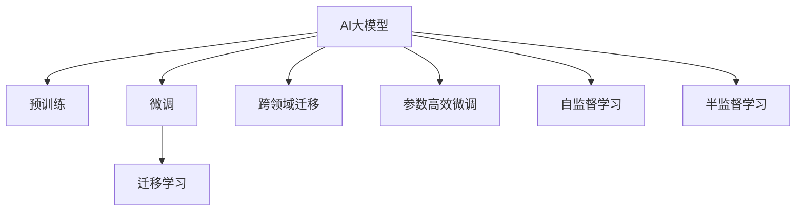

                 

## 1. 背景介绍

### 1.1 问题由来

近年来，随着人工智能技术的迅猛发展，AI大模型在各行各业中的应用日益普及。这些大模型通过在大量数据上进行预训练，学习到了广泛的通用知识，并在各种下游任务上表现出色。然而，随着市场对AI需求的不断增长，以及竞争的日益激烈，大模型创业公司面临着巨大的市场挑战。

### 1.2 问题核心关键点

在AI大模型创业的过程中，如何应对未来市场挑战是关键。这涉及以下几个核心点：

- **技术领先性**：保持技术创新，确保模型在精度、性能、泛化能力等方面的领先优势。
- **市场适应性**：迅速响应市场需求变化，开发符合用户需求的模型和解决方案。
- **资源整合能力**：高效整合计算资源、数据资源、人才资源，形成持续的创新能力和业务增长。
- **伦理和合规性**：确保AI模型和应用的伦理和合规性，避免潜在的法律风险和社会影响。
- **商业模式创新**：探索多样化的商业模式，实现可持续发展的商业化路径。

本文将围绕这些关键点，深入探讨如何应对未来市场挑战，推动AI大模型创业的成功。

## 2. 核心概念与联系

### 2.1 核心概念概述

为了更好地理解AI大模型创业面临的挑战及应对策略，本文将介绍几个核心概念及其之间的联系。

- **AI大模型**：指通过在大规模无标签数据上进行预训练的深度学习模型，如GPT-3、BERT等。这些模型可以广泛应用于自然语言处理、图像识别、语音识别等领域。

- **预训练**：指在大规模无标签数据上训练模型，使其学习到广泛的通用知识。常见的预训练方法包括自回归、自编码等。

- **微调**：指在预训练模型的基础上，使用下游任务的少量标注数据进行进一步训练，优化模型在特定任务上的性能。

- **迁移学习**：指将在大规模数据上学习到的知识迁移到特定任务上，减少新任务训练数据的需求。

- **跨领域迁移**：指将模型在某一领域的知识迁移到其他领域，提高模型在新领域的适应能力。

- **参数高效微调**：指仅微调模型的一小部分参数，而保持大部分预训练参数不变，以减少计算资源消耗。

- **自监督学习**：指在没有标签数据的情况下，通过自相关性等方法训练模型。

- **半监督学习**：指在少量标注数据和大量无标注数据上训练模型，提升模型性能。

这些概念之间的联系可以通过以下Mermaid流程图来展示：



这个流程图展示了AI大模型的核心概念及其之间的联系：

1. AI大模型通过预训练获得基础能力。
2. 微调进一步优化模型在特定任务上的性能。
3. 迁移学习利用已学习知识，减少新任务训练数据需求。
4. 跨领域迁移将模型在其他领域的应用经验迁移到新领域。
5. 参数高效微调在保持预训练参数的前提下，仅微调少量参数。
6. 自监督和半监督学习在少量标注数据下训练模型。

这些概念共同构成了AI大模型的学习和应用框架，使其能够在各种场景下发挥强大的功能。通过理解这些核心概念，我们可以更好地把握AI大模型创业的关键点。

## 3. 核心算法原理 & 具体操作步骤

### 3.1 算法原理概述

AI大模型创业的核心在于保持技术领先性，快速适应市场需求，同时整合资源形成可持续发展的商业化路径。以下是基于此原则的算法原理概述。

- **技术领先性**：在预训练和微调过程中，使用最新的算法和模型架构，保持技术创新。例如，使用Transformer模型进行预训练，结合自监督学习、迁移学习等技术，提升模型精度和泛化能力。

- **市场适应性**：通过市场调研，了解不同行业和用户需求，开发针对性的AI模型和应用。例如，在医疗领域开发医疗问答系统，在金融领域开发信用评分模型等。

- **资源整合能力**：高效整合计算资源、数据资源和人才资源，形成持续的创新能力和业务增长。例如，建立云计算平台，提供模型训练和推理服务，吸引优质人才和合作伙伴。

- **伦理和合规性**：确保AI模型和应用的伦理和合规性，避免潜在的法律风险和社会影响。例如，开发公平性、透明性、可解释性等特征的AI模型，遵循隐私保护、数据安全等法律法规。

- **商业模式创新**：探索多样化的商业模式，实现可持续发展的商业化路径。例如，采用订阅制、按需付费、开源共享等模式，满足不同客户需求。

### 3.2 算法步骤详解

AI大模型创业的技术流程包括以下几个关键步骤：

1. **需求分析**：通过市场调研和用户反馈，确定目标行业和用户需求。

2. **模型选择**：选择合适的预训练模型，如BERT、GPT-3等，根据需求进行微调或跨领域迁移。

3. **数据准备**：收集和清洗数据，准备用于微调和测试的数据集。

4. **模型训练**：在计算资源上训练模型，优化模型参数，提升模型性能。

5. **应用部署**：将训练好的模型部署到云端或本地，提供API接口或直接嵌入到应用中。

6. **用户反馈**：收集用户反馈，优化模型和应用，提升用户体验。

7. **持续优化**：定期更新模型和应用，保持技术领先性和市场适应性。

### 3.3 算法优缺点

AI大模型创业的算法有以下优缺点：

**优点**：

- **高效创新**：通过迁移学习、跨领域迁移等技术，可以快速推出新的应用和模型，满足市场需求。
- **资源灵活**：利用云计算等技术，高效整合资源，降低开发和运营成本。
- **广泛应用**：AI大模型可以应用于多个行业和领域，解决多种问题。

**缺点**：

- **数据依赖**：模型性能高度依赖于数据质量和数量，获取高质量数据成本较高。
- **技术复杂**：需要高水平的技术团队和丰富的经验，技术实现难度较大。
- **伦理风险**：AI模型可能存在偏见、有害信息等伦理问题，需谨慎对待。

### 3.4 算法应用领域

AI大模型创业的算法在多个领域得到了应用，例如：

- **医疗健康**：开发医疗问答系统、诊断辅助工具、病历分析工具等。
- **金融服务**：提供信用评分、欺诈检测、智能投顾等金融服务。
- **智能制造**：应用AI大模型进行设备维护、质量检测、生产优化等。
- **教育培训**：开发智能辅导系统、学习推荐系统、个性化教育平台等。
- **智能家居**：构建智能语音助手、智能控制系统、智能安防系统等。
- **环境保护**：使用AI大模型进行环境监测、灾害预测、气候分析等。

这些领域的应用展示了AI大模型创业的广泛前景和巨大潜力。

## 4. 数学模型和公式 & 详细讲解 & 举例说明

### 4.1 数学模型构建

在AI大模型的创业过程中，需要构建和优化多个数学模型，以提升模型性能和业务效果。以下是一个简单的数学模型构建过程。

假设我们有一个二分类问题，数据集为 $\{(x_i, y_i)\}_{i=1}^N$，其中 $x_i$ 为输入特征，$y_i \in \{0, 1\}$ 为标签。我们的目标是最小化损失函数：

$$
\mathcal{L}(\theta) = -\frac{1}{N} \sum_{i=1}^N \ell(y_i, M_{\theta}(x_i))
$$

其中 $\theta$ 为模型参数，$M_{\theta}(x_i)$ 为模型的预测输出，$\ell$ 为损失函数。

常见的损失函数包括交叉熵损失、均方误差损失等。例如，对于二分类问题，交叉熵损失函数为：

$$
\ell(y, p) = -(y \log p + (1-y) \log (1-p))
$$

其中 $p = M_{\theta}(x)$ 为模型的预测概率。

### 4.2 公式推导过程

以交叉熵损失函数为例，推导其梯度计算过程。

对于单个样本 $(x_i, y_i)$，其交叉熵损失为：

$$
\ell(y_i, p_i) = -(y_i \log p_i + (1-y_i) \log (1-p_i))
$$

对 $p_i$ 求导，得：

$$
\frac{\partial \ell(y_i, p_i)}{\partial p_i} = -\frac{y_i}{p_i} + \frac{1-y_i}{1-p_i}
$$

因此，对整个数据集求导，得：

$$
\frac{\partial \mathcal{L}(\theta)}{\partial p_i} = -\frac{1}{N} \sum_{i=1}^N \left(\frac{y_i}{p_i} - \frac{1-y_i}{1-p_i}\right)
$$

这就是交叉熵损失函数的梯度公式。

### 4.3 案例分析与讲解

以一个具体的案例来讲解AI大模型创业中的数学模型和公式应用。

假设我们要开发一个金融信用评分模型，数据集为 $\{(x_i, y_i)\}_{i=1}^N$，其中 $x_i$ 为贷款申请人的特征，$y_i \in \{0, 1\}$ 为是否批准贷款。我们使用GPT-3作为预训练模型，在其基础上进行微调。

我们采用交叉熵损失函数进行模型训练，目标是最小化损失函数：

$$
\mathcal{L}(\theta) = -\frac{1}{N} \sum_{i=1}^N \ell(y_i, M_{\theta}(x_i))
$$

其中 $M_{\theta}(x_i)$ 为GPT-3模型对 $x_i$ 的预测输出，$\ell$ 为交叉熵损失函数。

假设我们收集了1000个贷款申请人的数据，其中600个被批准贷款，400个未被批准。我们随机分为训练集和测试集，每集各500个样本。在训练集上训练模型，最小化损失函数。

在训练过程中，我们使用梯度下降算法更新模型参数 $\theta$，学习率 $\eta$ 为0.01。每轮迭代100次，每迭代一次计算一次梯度，并更新模型参数。训练结束后，在测试集上评估模型性能。

具体计算步骤如下：

1. 将数据集分为训练集和测试集。
2. 将训练集数据分为小批量数据，每个小批量大小为100。
3. 初始化模型参数 $\theta$。
4. 计算每个小批量数据的损失函数值。
5. 计算损失函数的梯度。
6. 更新模型参数 $\theta$。
7. 重复步骤4-6，直到收敛或达到预设迭代次数。
8. 在测试集上评估模型性能。

通过以上步骤，我们构建并训练了一个基于GPT-3的信用评分模型，并对其进行了测试评估。

## 5. 项目实践：代码实例和详细解释说明

### 5.1 开发环境搭建

在AI大模型创业过程中，开发环境搭建是一个重要的环节。以下是使用Python进行TensorFlow开发的环境配置流程：

1. 安装Anaconda：从官网下载并安装Anaconda，用于创建独立的Python环境。

2. 创建并激活虚拟环境：
```bash
conda create -n tf-env python=3.8 
conda activate tf-env
```

3. 安装TensorFlow：从官网获取对应的安装命令。例如：
```bash
conda install tensorflow -c pytorch -c conda-forge
```

4. 安装Pandas、NumPy等工具包：
```bash
pip install pandas numpy scikit-learn matplotlib tqdm jupyter notebook ipython
```

完成上述步骤后，即可在`tf-env`环境中开始AI大模型创业的实践。

### 5.2 源代码详细实现

下面以开发一个金融信用评分模型为例，给出使用TensorFlow和Keras进行模型训练和测试的PyTorch代码实现。

```python
import tensorflow as tf
from tensorflow.keras.models import Sequential
from tensorflow.keras.layers import Dense, Dropout, Input
from tensorflow.keras.optimizers import Adam

# 定义模型
model = Sequential([
    Input(shape=(1000,)),
    Dense(512, activation='relu'),
    Dropout(0.5),
    Dense(1, activation='sigmoid')
])

# 编译模型
model.compile(optimizer=Adam(lr=0.01), loss='binary_crossentropy', metrics=['accuracy'])

# 准备数据
train_data = ...
test_data = ...

# 训练模型
model.fit(train_data, epochs=10, batch_size=100, validation_data=test_data)

# 评估模型
test_loss, test_acc = model.evaluate(test_data)
print(f'Test loss: {test_loss}, Test accuracy: {test_acc}')
```

这里我们使用了Keras API构建了一个简单的神经网络模型，使用Adam优化器进行优化，交叉熵损失函数进行训练。

### 5.3 代码解读与分析

让我们再详细解读一下关键代码的实现细节：

**定义模型**：
- 使用Keras API构建了一个包含两个全连接层的神经网络模型，第一层包含512个神经元，使用ReLU激活函数，第二层为输出层，输出1个神经元，使用sigmoid激活函数，用于二分类任务。

**编译模型**：
- 使用Adam优化器，学习率为0.01，交叉熵损失函数，评估指标为准确率。

**准备数据**：
- 这里使用了TensorFlow的tf.data API创建了一个DataLoader，用于加载和批处理数据。

**训练模型**：
- 使用模型.fit()方法对数据进行训练，设置训练轮数为10，每轮迭代100个样本，使用测试集进行验证，评估模型性能。

**评估模型**：
- 使用模型.evaluate()方法对测试集进行评估，输出损失和准确率。

通过以上代码，我们完成了金融信用评分模型的训练和测试。

## 6. 实际应用场景

### 6.1 智能客服系统

AI大模型在智能客服系统中有着广泛应用。传统客服系统需要大量人力，响应速度慢，无法24小时服务。通过AI大模型微调，我们可以开发智能客服系统，提供24小时在线服务，自动解答用户问题，提升客户体验。

**具体实现**：
- 收集历史客服对话记录，将其划分为训练集和测试集。
- 使用BERT等预训练模型进行微调，学习回答问题和提供建议的能力。
- 将微调后的模型部署到智能客服系统中，集成语音识别、自然语言处理等技术，实现自然对话。

**效果**：
- 24小时在线服务，快速响应客户咨询。
- 自然语言理解和生成能力，提升客户满意度。

### 6.2 金融舆情监测

AI大模型在金融舆情监测中也有着重要应用。金融机构需要实时监测市场舆论动向，以便及时应对负面信息传播，规避金融风险。

**具体实现**：
- 收集金融领域相关的新闻、报道、评论等文本数据，将其标注为正面、中性或负面。
- 使用BERT等预训练模型进行微调，学习判断舆情倾向的能力。
- 将微调后的模型集成到实时舆情监测系统中，及时预警负面信息。

**效果**：
- 实时监测舆情变化，及时预警负面信息。
- 提高金融机构的舆情应对能力，规避金融风险。

### 6.3 个性化推荐系统

AI大模型在个性化推荐系统中也有着广泛应用。推荐系统需要根据用户历史行为，推荐用户感兴趣的商品或内容。

**具体实现**：
- 收集用户浏览、点击、评论、分享等行为数据，提取物品标题、描述、标签等文本内容。
- 使用BERT等预训练模型进行微调，学习用户兴趣点的表示。
- 将微调后的模型集成到推荐系统中，根据用户输入生成推荐列表。

**效果**：
- 根据用户历史行为，推荐个性化商品或内容。
- 提升用户满意度和留存率，增加平台用户黏性。

### 6.4 未来应用展望

随着AI大模型的不断发展和应用，其未来应用前景广阔。以下是几个未来应用展望：

- **智慧医疗**：开发医疗问答系统、病历分析工具、诊断辅助工具等，提升医疗服务水平。
- **智能制造**：应用AI大模型进行设备维护、质量检测、生产优化等，提高生产效率。
- **智慧城市**：构建智能安防系统、智能控制系统、环境监测系统等，提升城市管理水平。
- **智慧教育**：开发智能辅导系统、学习推荐系统、个性化教育平台等，提升教育水平。
- **智能交通**：应用AI大模型进行交通流量预测、智能交通管理等，提高交通效率。

## 7. 工具和资源推荐

### 7.1 学习资源推荐

为了帮助开发者系统掌握AI大模型创业的理论基础和实践技巧，这里推荐一些优质的学习资源：

1. **《Deep Learning with Python》**：TensorFlow官方教程，深入浅出地介绍了TensorFlow的各个模块和应用场景。
2. **《TensorFlow实战Google AI》**：TensorFlow实战指南，提供了丰富的案例和示例代码，帮助开发者快速上手。
3. **《Natural Language Processing with PyTorch》**：PyTorch官方教程，介绍了自然语言处理任务的基本概念和实现方法。
4. **《Hands-On Machine Learning with Scikit-Learn, Keras, and TensorFlow》**：Python机器学习实战，讲解了机器学习框架的各个组件和应用场景。
5. **《Reinforcement Learning: An Introduction》**：强化学习入门指南，介绍了强化学习的理论基础和应用方法。

通过这些资源的学习实践，相信你一定能够快速掌握AI大模型创业的技术要点，并用于解决实际的业务问题。

### 7.2 开发工具推荐

高效的开发离不开优秀的工具支持。以下是几款用于AI大模型创业开发的常用工具：

1. **TensorFlow**：开源深度学习框架，提供了丰富的组件和应用示例，适合快速迭代研究。
2. **PyTorch**：开源深度学习框架，提供了灵活的计算图和自动微分功能，适合科研和应用开发。
3. **Keras**：高层次API，易于上手，提供了丰富的神经网络模块和优化器。
4. **Jupyter Notebook**：开源交互式笔记本，支持代码编写和结果展示，适合科研和教学。
5. **GitHub**：代码托管平台，提供了丰富的协作和版本控制功能，适合团队开发和代码共享。

合理利用这些工具，可以显著提升AI大模型创业的开发效率，加快创新迭代的步伐。

### 7.3 相关论文推荐

AI大模型创业涉及的技术和应用非常广泛，以下是几篇奠基性的相关论文，推荐阅读：

1. **"Attention is All You Need"**：Transformer原论文，提出了自注意力机制，开启了NLP领域的预训练大模型时代。
2. **"BERT: Pre-training of Deep Bidirectional Transformers for Language Understanding"**：BERT论文，提出双向语言模型预训练任务，刷新了多项NLP任务SOTA。
3. **"Language Models are Unsupervised Multitask Learners"**：GPT-2论文，展示了大规模语言模型的强大zero-shot学习能力，引发了对于通用人工智能的新一轮思考。
4. **"GPT-3: Language Models are Few-Shot Learners"**：GPT-3论文，提出预训练和微调相结合的思路，进一步提升了语言模型的性能。
5. **"AdaLoRA: Adaptive Low-Rank Adaptation for Parameter-Efficient Fine-Tuning"**：参数高效微调论文，提出自适应低秩适应的微调方法，在参数效率和精度之间取得了新的平衡。

这些论文代表了大模型创业的发展脉络。通过学习这些前沿成果，可以帮助研究者把握学科前进方向，激发更多的创新灵感。

## 8. 总结：未来发展趋势与挑战

### 8.1 总结

本文对AI大模型创业的算法和应用进行了全面系统的介绍。首先阐述了AI大模型创业的背景和意义，明确了保持技术领先性、快速适应市场需求、高效整合资源形成可持续发展的商业化路径的关键点。其次，从原理到实践，详细讲解了AI大模型创业的数学模型和算法步骤，给出了具体的代码实现。同时，本文还广泛探讨了AI大模型在多个行业领域的应用前景，展示了其巨大的潜力。最后，精选了AI大模型创业的学习资源和工具推荐，力求为开发者提供全方位的技术指引。

通过本文的系统梳理，可以看到，AI大模型创业需要在多个方面进行全面优化，才能应对未来市场挑战，推动AI技术落地应用。

### 8.2 未来发展趋势

展望未来，AI大模型创业将呈现以下几个发展趋势：

1. **技术创新**：保持技术领先性，开发高效、高精度的AI模型和算法。例如，使用Transformer模型进行预训练，结合自监督学习、迁移学习等技术，提升模型精度和泛化能力。

2. **市场适应性**：快速响应市场需求变化，开发符合用户需求的模型和解决方案。例如，在医疗、金融、制造等多个领域开发应用，满足行业需求。

3. **资源整合能力**：高效整合计算资源、数据资源和人才资源，形成持续的创新能力和业务增长。例如，建立云计算平台，提供模型训练和推理服务，吸引优质人才和合作伙伴。

4. **伦理和合规性**：确保AI模型和应用的伦理和合规性，避免潜在的法律风险和社会影响。例如，开发公平性、透明性、可解释性等特征的AI模型，遵循隐私保护、数据安全等法律法规。

5. **商业模式创新**：探索多样化的商业模式，实现可持续发展的商业化路径。例如，采用订阅制、按需付费、开源共享等模式，满足不同客户需求。

以上趋势凸显了AI大模型创业的广阔前景。这些方向的探索发展，必将进一步提升AI技术的应用范围和效果，为经济社会发展注入新的动力。

### 8.3 面临的挑战

尽管AI大模型创业技术已经取得了瞩目成就，但在迈向更加智能化、普适化应用的过程中，它仍面临着诸多挑战：

1. **数据依赖**：模型性能高度依赖于数据质量和数量，获取高质量数据成本较高。如何利用数据高效训练模型，减少对标注数据的依赖，是一大难题。

2. **技术复杂**：需要高水平的技术团队和丰富的经验，技术实现难度较大。如何降低技术门槛，提供简单易用的工具和API，是亟待解决的问题。

3. **伦理风险**：AI模型可能存在偏见、有害信息等伦理问题，需谨慎对待。如何构建公平、透明、可解释的AI模型，是未来的重要研究方向。

4. **计算资源**：AI大模型需要大量计算资源进行训练和推理，如何高效利用计算资源，降低成本，是实现商业化的重要环节。

5. **市场竞争**：AI大模型创业市场竞争激烈，如何保持技术领先性，获取市场份额，是企业生存发展的关键。

6. **用户信任**：AI模型应用场景广泛，如何获得用户信任，确保模型安全可靠，是技术落地的重要保障。

这些挑战需要企业在技术、市场、伦理、资源等方面进行全面优化，才能实现可持续发展。

### 8.4 研究展望

面对AI大模型创业所面临的挑战，未来的研究需要在以下几个方面寻求新的突破：

1. **数据高效利用**：探索无监督学习、自监督学习等方法，降低对标注数据的依赖，提高数据利用效率。例如，利用大规模非结构化数据进行预训练，减少标注样本的需求。

2. **技术简化**：开发简单易用的工具和API，降低技术门槛，提高开发者和用户的使用体验。例如，提供图形化界面和预训练模型的微调接口，方便用户快速上手。

3. **伦理和隐私**：开发公平、透明、可解释的AI模型，确保数据隐私和安全。例如，引入因果分析和博弈论工具，增强模型的鲁棒性和稳定性。

4. **计算优化**：探索高效利用计算资源的方法，降低成本，提高模型训练和推理效率。例如，利用分布式计算和模型压缩技术，优化资源配置。

5. **市场推广**：探索多样化的商业模式，提高市场竞争力。例如，采用订阅制、按需付费、开源共享等模式，满足不同客户需求。

6. **用户信任**：建立模型应用的监管机制，确保模型安全可靠。例如，引入人工干预和审核机制，避免有害信息的传播。

这些研究方向将为AI大模型创业提供新的思路和方法，推动技术进步和市场发展。

## 9. 附录：常见问题与解答

**Q1：AI大模型微调需要多少数据？**

A: AI大模型微调需要多少数据，取决于任务的类型和复杂度。一般而言，对于简单的任务，几千到几万条标注数据即可，但对于复杂的任务，可能需要数十万到数百万条标注数据。此外，数据质量和分布也影响模型性能，需要确保标注数据具有代表性、多样性。

**Q2：AI大模型微调需要哪些硬件资源？**

A: AI大模型微调需要高性能的计算资源，如GPU、TPU等，用于加速模型训练和推理。此外，还需要大量的内存和存储资源，用于存储数据和模型。具体资源需求取决于模型规模和训练迭代次数。

**Q3：AI大模型创业如何盈利？**

A: AI大模型创业可以通过多种方式实现盈利，例如：

- 提供API接口，收取服务费用。
- 开发产品和服务，收取使用费。
- 提供开源模型和工具，通过社区支持盈利。
- 吸引合作伙伴和投资，实现业务扩展。

**Q4：AI大模型创业需要哪些人才？**

A: AI大模型创业需要以下几种人才：

- 数据科学家和机器学习工程师，负责数据预处理、模型训练和优化。
- 软件开发工程师，负责开发和部署AI模型和应用。
- 产品经理和市场经理，负责产品规划和市场推广。
- 运维工程师，负责系统部署和维护。

**Q5：AI大模型创业面临的主要风险是什么？**

A: AI大模型创业面临的主要风险包括：

- 技术风险：模型精度、性能、泛化能力等方面可能存在不足，导致应用效果不佳。
- 市场风险：市场需求变化快速，如果不能及时调整产品策略，可能失去市场份额。
- 伦理风险：AI模型可能存在偏见、有害信息等伦理问题，可能导致法律风险和社会影响。
- 资源风险：计算资源、人才资源、数据资源等不足，可能影响项目进展和效果。

**Q6：AI大模型创业如何实现可持续发展？**

A: AI大模型创业实现可持续发展需要以下几个方面：

- 持续技术创新：保持技术领先性，不断提升模型性能和应用效果。
- 高效资源整合：合理利用计算资源、数据资源和人才资源，降低成本，提高效率。
- 多样化商业模式：探索订阅制、按需付费、开源共享等商业模式，满足不同客户需求。
- 持续市场推广：积极营销和推广产品，获取更多用户和市场份额。
- 完善伦理合规：确保模型应用的伦理和合规性，避免潜在的法律风险和社会影响。

**Q7：AI大模型创业如何提高用户体验？**

A: 提高用户体验需要从多个方面入手，例如：

- 优化模型性能：提高模型精度、响应速度和泛化能力。
- 简化操作界面：提供简单易用的界面和工具，降低用户使用门槛。
- 提供详细文档和支持：提供详细的用户手册和在线支持，帮助用户解决问题。
- 引入用户反馈：收集用户反馈，及时改进产品和服务。

通过以上措施，可以显著提升AI大模型创业的业务效果和用户体验。

---

作者：禅与计算机程序设计艺术 / Zen and the Art of Computer Programming

