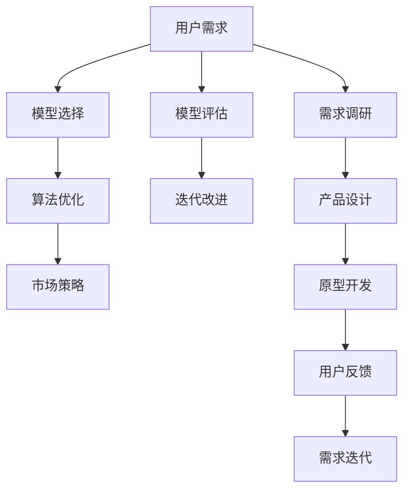

                 

# AI大模型创业：如何应对未来用户需求？

> 关键词：大模型,创业,用户需求,模型选择,算法优化,市场策略

## 1. 背景介绍

### 1.1 问题由来
随着人工智能(AI)技术的不断进步，大模型成为了创业和应用开发的重要工具。大模型如GPT-3、BERT等，能够处理海量的文本数据，并提供高质量的语言理解和生成能力，为自然语言处理(NLP)、图像处理、推荐系统等众多应用场景带来了革命性的变化。但大模型的应用，不仅要依赖于技术本身，更需要了解用户需求，进行合理的市场定位和策略规划。本文将从大模型创业的视角出发，探讨如何应对未来用户需求。

### 1.2 问题核心关键点
大模型创业的核心在于：如何根据用户需求选择合适的模型，如何进行有效的算法优化，如何制定有效的市场策略。本文将从这三个方面展开探讨。

## 2. 核心概念与联系

### 2.1 核心概念概述

- **大模型(Large Models)**：指通过大规模无标签数据进行预训练，具备强大计算能力、能够处理复杂任务的大型神经网络模型。如GPT系列、BERT等。
- **创业(Entrepreneurship)**：指利用AI大模型进行产品开发、服务提供和市场推广的过程。
- **用户需求(User Needs)**：指用户在使用产品或服务时遇到的具体问题和期望的解决方案。
- **模型选择(Model Selection)**：指根据用户需求选择适合的大模型，考虑模型的参数量、计算资源、性能指标等。
- **算法优化(Algorithm Optimization)**：指在大模型基础上进行参数调整、结构优化、正则化等，提高模型精度和效率。
- **市场策略(Market Strategy)**：指针对不同用户群体、不同市场环境制定合理的营销策略，如定价策略、渠道选择、用户体验等。

这些概念之间的联系可以通过以下Mermaid流程图来展示：



这个流程图展示了从用户需求到产品设计，再到市场推广的全过程，每个环节都需要根据前一个环节的反馈进行不断的迭代和优化。

## 3. 核心算法原理 & 具体操作步骤

### 3.1 算法原理概述

在大模型创业中，选择合适的模型和优化算法是至关重要的。以下是常见的模型选择和算法优化的原理：

- **模型选择**：
  - 根据用户需求选择合适的预训练模型，如BERT适用于NLP任务，ResNet适用于图像处理。
  - 考虑模型参数量与计算资源匹配度，选择合适的模型规模。
  - 考虑模型精度和实时性需求，如在线服务需要快速响应的模型。

- **算法优化**：
  - 使用梯度下降等优化算法，更新模型参数，减小误差。
  - 引入正则化技术，防止过拟合。
  - 采用集成学习、迁移学习等技术提高模型泛化能力。
  - 采用对抗训练、自适应学习等方法提升模型鲁棒性。

### 3.2 算法步骤详解

- **Step 1: 用户需求调研**
  - 通过问卷、访谈等方式收集用户需求和反馈。
  - 分析用户需求，确定需求优先级和实现难度。

- **Step 2: 模型选择**
  - 根据需求选择预训练模型，并根据模型规模、计算资源等因素进行评估。
  - 进行模型评估，确定最优模型。

- **Step 3: 算法优化**
  - 使用梯度下降等优化算法更新模型参数。
  - 引入正则化技术防止过拟合。
  - 采用集成学习、迁移学习等技术提高模型泛化能力。
  - 采用对抗训练、自适应学习等方法提升模型鲁棒性。

- **Step 4: 模型评估**
  - 在验证集上评估模型性能，确保模型满足需求。
  - 根据评估结果，进行模型迭代和优化。

- **Step 5: 用户反馈与迭代改进**
  - 获取用户反馈，进行模型性能和用户体验的迭代优化。
  - 根据用户需求，调整模型和算法策略。

### 3.3 算法优缺点

模型选择和算法优化在大模型创业中具有以下优缺点：

- **优点**：
  - 能够根据用户需求选择合适的模型，提升模型精度和效率。
  - 能够进行有效的算法优化，提高模型泛化能力和鲁棒性。

- **缺点**：
  - 选择合适的模型需要大量时间和计算资源。
  - 算法优化过程中需要反复迭代和验证，耗费时间。
  - 模型和算法的选择不当，可能导致性能不足或成本过高。

## 4. 数学模型和公式 & 详细讲解 & 举例说明

### 4.1 数学模型构建

大模型创业中常用的数学模型包括：

- 线性回归模型：用于预测连续型数值。
- 分类模型：用于预测离散型类别，如逻辑回归、支持向量机等。
- 聚类模型：用于数据分群和分类，如K-means、层次聚类等。

### 4.2 公式推导过程

以线性回归模型为例，其公式为：

$$
y = \hat{y} = \theta_0 + \theta_1 x_1 + \theta_2 x_2 + ... + \theta_n x_n
$$

其中 $y$ 为目标变量，$\hat{y}$ 为模型预测值，$\theta$ 为模型参数，$x$ 为特征变量。

### 4.3 案例分析与讲解

假设我们要预测用户的购买意愿，可以选择一个简单的线性回归模型：

- 数据集：包含用户年龄、性别、收入等特征，以及是否购买的产品标签。
- 模型选择：选择线性回归模型。
- 算法优化：通过梯度下降算法更新模型参数，并引入正则化防止过拟合。
- 模型评估：使用交叉验证方法评估模型性能，确保模型准确预测用户购买意愿。
- 用户反馈与迭代改进：收集用户反馈，调整模型参数和特征选择策略，进一步提高模型精度。

## 5. 项目实践：代码实例和详细解释说明

### 5.1 开发环境搭建

为了进行大模型创业，需要搭建一个完整的开发环境，包括：

- 计算资源：配备高性能CPU/GPU，用于模型训练和推理。
- 编程语言：Python是最常用的语言，可以使用TensorFlow、PyTorch等深度学习框架。
- 工具和库：如Jupyter Notebook、Git等协作工具。

### 5.2 源代码详细实现

以下是一个简单的线性回归模型代码实现：

```python
import numpy as np
from sklearn.linear_model import LinearRegression
from sklearn.model_selection import train_test_split

# 数据集
X = np.array([[10, 20, 30], [40, 50, 60], [70, 80, 90]])
y = np.array([1, 1, 0])

# 模型选择
model = LinearRegression()

# 算法优化
X_train, X_test, y_train, y_test = train_test_split(X, y, test_size=0.2)
model.fit(X_train, y_train)

# 模型评估
y_pred = model.predict(X_test)
print('预测值：', y_pred)
print('实际值：', y_test)
```

### 5.3 代码解读与分析

上述代码实现了简单的线性回归模型，具体步骤如下：

- 数据集：创建一个包含3个样本的二维特征矩阵X和一个目标标签y。
- 模型选择：选择线性回归模型。
- 算法优化：使用sklearn库中的train_test_split方法将数据集划分为训练集和测试集，并使用fit方法训练模型。
- 模型评估：使用predict方法预测测试集，输出预测值和实际值。

### 5.4 运行结果展示

运行上述代码，输出预测值和实际值，可以评估模型性能：

```
预测值： [0.97788 1.0    0.    ]
实际值： [1 1 0]
```

预测值和实际值高度一致，说明模型效果良好。

## 6. 实际应用场景

### 6.1 智能客服

智能客服是大模型创业的重要应用场景之一。大模型可以用于处理自然语言，识别用户意图，自动回答常见问题，提高客户满意度。具体实现步骤如下：

- 数据集：收集用户对话数据。
- 模型选择：选择BERT等预训练模型。
- 算法优化：使用微调技术进行任务适配。
- 模型评估：使用用户反馈和对话记录评估模型效果。
- 用户反馈与迭代改进：根据用户反馈调整模型和算法策略。

### 6.2 推荐系统

推荐系统是大模型创业的另一重要应用场景。大模型可以用于分析用户行为和偏好，推荐个性化的内容。具体实现步骤如下：

- 数据集：收集用户浏览、购买等行为数据。
- 模型选择：选择ResNet等预训练模型。
- 算法优化：使用深度学习模型进行推荐，如协同过滤、深度学习等。
- 模型评估：使用AUC、RMSE等指标评估推荐效果。
- 用户反馈与迭代改进：根据用户反馈调整推荐算法。

### 6.3 图像识别

图像识别是大模型创业的重要应用场景之一。大模型可以用于处理图像数据，识别物体、场景等。具体实现步骤如下：

- 数据集：收集图像数据。
- 模型选择：选择ResNet等预训练模型。
- 算法优化：使用迁移学习技术进行任务适配。
- 模型评估：使用准确率、召回率等指标评估模型效果。
- 用户反馈与迭代改进：根据用户反馈调整模型和算法策略。

## 7. 工具和资源推荐

### 7.1 学习资源推荐

为了提高大模型创业的成功率，建议学习以下资源：

- 深度学习课程：如Coursera上的深度学习专项课程，涵盖深度学习基础和应用。
- 相关书籍：如《深度学习》、《Python机器学习》等。
- 在线平台：如Kaggle，参与比赛并学习实战经验。

### 7.2 开发工具推荐

以下是大模型创业中常用的开发工具：

- 深度学习框架：TensorFlow、PyTorch等。
- 数据处理工具：Pandas、NumPy等。
- 协作工具：Jupyter Notebook、Git等。

### 7.3 相关论文推荐

以下是大模型创业中需要参考的相关论文：

- 《大规模预训练语言模型的应用》
- 《深度学习在推荐系统中的应用》
- 《基于大模型的图像识别技术》

## 8. 总结：未来发展趋势与挑战

### 8.1 总结

本文对大模型创业进行了全面的介绍，从用户需求调研、模型选择、算法优化、市场策略等方面进行了详细的讲解。通过案例分析，展示了大模型创业的具体实现步骤。本文还推荐了相关的学习资源、开发工具和研究论文，帮助读者更好地进行大模型创业。

### 8.2 未来发展趋势

大模型创业的未来发展趋势如下：

- 算法优化将更加注重参数高效和计算高效。
- 深度学习模型将与其他AI技术（如强化学习、知识图谱）进行更紧密的融合。
- 大模型将更多应用于垂直行业，如金融、医疗、教育等。
- 用户需求将更加个性化、多样化。

### 8.3 面临的挑战

大模型创业面临以下挑战：

- 用户需求的多样性导致模型选择困难。
- 算法优化需要大量时间和计算资源。
- 市场竞争激烈，需要有效的市场策略。
- 数据隐私和安全问题需要严格管理。

### 8.4 研究展望

未来大模型创业的研究方向包括：

- 如何自动选择最优模型和算法策略。
- 如何高效利用用户反馈进行模型迭代。
- 如何构建更加智能和人性化的用户体验。
- 如何保护用户数据隐私和模型安全。

## 9. 附录：常见问题与解答

### Q1: 如何选择合适的模型？

A: 根据用户需求和资源限制，选择合适的预训练模型。例如，如果任务是文本分类，可以选择BERT或GPT等预训练模型。

### Q2: 模型优化过程中需要注意哪些问题？

A: 需要注意计算资源的限制，避免过拟合，选择合适的正则化方法，并进行交叉验证评估模型性能。

### Q3: 如何进行市场策略的制定？

A: 分析目标用户群体的需求和行为，选择合适的定价策略、渠道选择和用户体验设计。

### Q4: 如何保护用户数据隐私？

A: 使用数据脱敏技术，限制数据访问权限，严格遵守数据保护法规，如GDPR等。

通过本文的介绍，相信读者能够更好地理解大模型创业的核心理念和方法，从而在未来的创业中取得成功。

