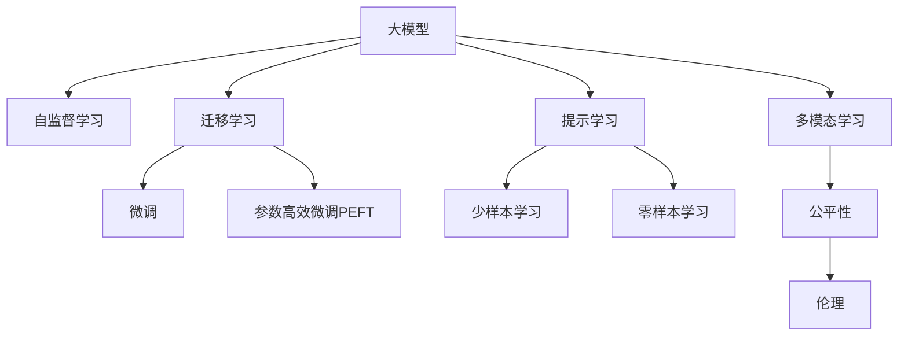

                 

## 1. 背景介绍

### 1.1 问题由来

随着人工智能技术的飞速发展，尤其是大模型的崛起，AI创业公司正处于前所未有的发展机遇期。然而，大模型及其相关的技术壁垒极高，不仅需要庞大的数据、算力支持，还需具备深厚的理论积累和工程经验。与此同时，诸多国际巨头和头部公司已经或正在迅速布局，市场竞争日益白热化。面对如此竞争激烈的市场环境，AI创业公司如何破局突围，是每一个创始人、工程师、CTO必须面对的重大问题。

### 1.2 问题核心关键点

AI大模型创业的核心在于构建具有独特竞争优势的预训练模型，并在具体业务场景中进行微调，从而获得比传统方法更优的性能。然而，模型的构建和微调并非易事，涉及到的核心问题是：

1. **数据获取与标注**：预训练模型需要海量数据，数据获取和标注成本高昂。
2. **模型训练与优化**：大模型训练耗时耗资，且模型优化复杂。
3. **微调与迁移学习**：如何将通用预训练模型适配到特定业务场景，提升模型性能。
4. **部署与集成**：将模型部署到实际应用中，并进行稳定高效的集成。
5. **持续优化与更新**：如何长期维护模型性能，确保其与业务需求同步发展。

本文将重点探讨这些核心问题，并提供详细的解决方案，帮助AI创业公司应对未来的竞争挑战。

## 2. 核心概念与联系

### 2.1 核心概念概述

为更好地理解如何构建和优化AI大模型，本节将介绍几个密切相关的核心概念：

- **大模型（Large Model）**：指以Transformer架构为代表的高参数量预训练模型，通过大规模数据预训练，具备强大的语言理解和生成能力。
- **自监督学习（Self-supervised Learning）**：指在大规模无标签数据上进行预训练，通过自建任务的方式学习语言模型。
- **迁移学习（Transfer Learning）**：指将预训练模型应用于新任务，通过微调或细粒度训练提高模型在新任务上的表现。
- **微调（Fine-Tuning）**：指在特定任务上进行有监督训练，调整模型参数以适应该任务的特性。
- **参数高效微调（Parameter-Efficient Fine-Tuning, PEFT）**：指仅更新模型中一小部分参数，以减少计算资源消耗。
- **提示学习（Prompt Learning）**：通过设计输入文本格式，引导模型按特定方式推理，降低微调参数需求。
- **少样本学习（Few-shot Learning）**：指在少量标注数据下，模型能够快速适应新任务。
- **零样本学习（Zero-shot Learning）**：指模型无需标注数据，仅通过任务描述即可执行新任务。
- **多模态学习（Multimodal Learning）**：指模型同时处理多种模态（如文本、图像、音频等）信息，以提升理解能力。
- **公平性（Fairness）与伦理（Ethics）**：指模型在训练和使用过程中，避免偏见与歧视，保障数据与输出结果的公平性与伦理性。

这些核心概念通过以下Mermaid流程图展示其逻辑联系：



这个流程图展示了各大模型的核心概念及其之间的关系：

1. 大模型通过自监督学习获得初始表示。
2. 迁移学习连接预训练模型与下游任务，可以通过微调或提示学习实现。
3. 微调利用标注数据进行有监督优化，提升模型性能。
4. 参数高效微调仅更新一小部分参数，降低计算成本。
5. 提示学习通过输入格式引导模型推理，实现零样本或少样本学习。
6. 多模态学习同时处理多种信息，提升模型的理解能力。
7. 公平性与伦理性保障模型输出符合道德标准。

这些概念共同构成了大模型从预训练到实际应用的全链路框架，使其能够具备强大的实际应用能力。

## 3. 核心算法原理 & 具体操作步骤
### 3.1 算法原理概述

基于自监督学习和迁移学习的大模型创业，本质上是一个预训练-微调的过程。其核心思想是：

1. **自监督预训练**：通过大规模无标签数据，学习通用的语言表示。
2. **任务适配**：在特定任务上，通过微调或细粒度训练，调整模型以适应任务需求。
3. **参数优化**：通过优化算法和正则化技术，优化模型参数，提升模型性能。
4. **多模态融合**：同时处理多种信息源，提高模型的综合理解能力。

### 3.2 算法步骤详解

AI大模型的创业通常涉及以下关键步骤：

**Step 1: 收集数据与标注**

- 选择适合任务的标注数据集，如自然语言处理中的情感分析、命名实体识别等。
- 使用标注工具和团队进行数据标注，保证标注质量和一致性。

**Step 2: 预训练模型选择与微调**

- 选择适合任务的预训练模型，如BERT、GPT等。
- 通过微调或参数高效微调，在标注数据上训练模型，获得最佳性能。

**Step 3: 模型评估与优化**

- 在验证集上评估模型性能，调整超参数。
- 进行模型压缩和量化，提升推理速度和资源利用率。

**Step 4: 部署与集成**

- 将训练好的模型部署到生产环境，如AWS、Google Cloud等。
- 开发API接口，方便调用和使用。

**Step 5: 持续优化与更新**

- 定期收集新数据，进行模型微调或更新。
- 监控模型性能，及时进行模型迭代和优化。

### 3.3 算法优缺点

基于自监督学习和迁移学习的大模型创业具有以下优点：

1. **通用性强**：适用于各种NLP任务，如情感分析、命名实体识别等。
2. **性能优异**：通过微调可以获得优异的模型性能，提升应用效果。
3. **可解释性**：模型参数训练过程透明，易于理解和调试。
4. **灵活性高**：可通过多模态融合、公平性与伦理性优化，适应不同场景。

然而，该方法也存在一些局限：

1. **数据依赖高**：模型训练和微调依赖标注数据，获取和标注成本高。
2. **计算资源需求大**：预训练和微调需要大量计算资源，硬件成本高。
3. **模型复杂度高**：大模型参数量庞大，推理速度较慢。
4. **公平性与伦理问题**：模型可能存在偏见和歧视，需进行公平性和伦理性的优化。

尽管存在这些局限，但基于自监督学习和迁移学习的大模型创业方法仍具有强大的应用潜力，是当前AI创业的主要范式。

### 3.4 算法应用领域

基于大模型的创业方法在多个领域具有广泛应用：

1. **自然语言处理（NLP）**：情感分析、命名实体识别、机器翻译、问答系统等。
2. **计算机视觉（CV）**：图像分类、目标检测、图像生成等。
3. **语音识别（ASR）**：语音转文本、情感识别等。
4. **医疗健康**：疾病预测、医学影像分析等。
5. **金融科技**：信用评估、情感分析、风险控制等。
6. **智能制造**：质量检测、设备预测性维护等。
7. **智能交通**：交通监控、事故预警等。

## 4. 数学模型和公式 & 详细讲解 & 举例说明
### 4.1 数学模型构建

设大模型为$M_\theta$，其参数为$\theta$。通过自监督预训练，学习通用的语言表示。在特定任务$T$上，使用标注数据集$D=\{(x_i,y_i)\}_{i=1}^N$进行微调。

定义任务适配层，通过前向传播计算损失函数$\mathcal{L}(M_\theta)$，并通过反向传播更新模型参数$\theta$。

$$
\mathcal{L}(M_\theta) = \frac{1}{N}\sum_{i=1}^N \ell(M_\theta(x_i),y_i)
$$

其中$\ell$为损失函数，通常为交叉熵损失。

### 4.2 公式推导过程

以情感分析任务为例，假设输入文本为$x$，标签为$y$，输出为$M_\theta(x)$。

定义交叉熵损失：

$$
\ell(M_\theta(x),y) = -[y\log M_\theta(x) + (1-y)\log(1-M_\theta(x))]
$$

则损失函数为：

$$
\mathcal{L}(M_\theta) = -\frac{1}{N}\sum_{i=1}^N [y_i\log M_\theta(x_i)+(1-y_i)\log(1-M_\theta(x_i))]
$$

通过反向传播计算梯度：

$$
\frac{\partial \mathcal{L}(M_\theta)}{\partial \theta_k} = -\frac{1}{N}\sum_{i=1}^N \left(\frac{y_i}{M_\theta(x_i)} - \frac{1-y_i}{1-M_\theta(x_i)}\right) \frac{\partial M_\theta(x_i)}{\partial \theta_k}
$$

通过优化算法（如AdamW）更新模型参数：

$$
\theta \leftarrow \theta - \eta \nabla_{\theta}\mathcal{L}(\theta) - \eta\lambda\theta
$$

其中$\eta$为学习率，$\lambda$为正则化系数。

### 4.3 案例分析与讲解

以Google的BERT模型为例，分析其在新闻情感分析任务上的微调过程。

**Step 1: 数据准备**

- 使用新闻数据集，进行情感标注，构建标注数据集。
- 使用BERT模型自带的分词器对数据进行分词。

**Step 2: 模型微调**

- 使用BERT模型作为初始化参数，进行微调。
- 通过交叉熵损失函数，更新模型参数。

**Step 3: 模型评估**

- 在验证集上评估模型性能，使用精确度、召回率、F1-score等指标评估模型表现。
- 对超参数进行调参，提升模型性能。

**Step 4: 模型部署**

- 将训练好的模型导出为TensorFlow SavedModel格式。
- 在服务器上部署模型，提供API接口，供外部调用。

## 5. 项目实践：代码实例和详细解释说明
### 5.1 开发环境搭建

1. 安装Python 3.8，安装pip和conda。
2. 安装TensorFlow 2.x，使用pip install tensorflow。
3. 安装Keras，使用pip install keras。
4. 安装PyTorch，使用pip install torch。
5. 安装TensorBoard，使用pip install tensorboard。

### 5.2 源代码详细实现

以下是一个使用Keras框架进行BERT微调的示例代码：

```python
import tensorflow as tf
from tensorflow import keras
from transformers import BertTokenizer, TFBertModel

# 加载BERT模型和分词器
tokenizer = BertTokenizer.from_pretrained('bert-base-uncased')
model = TFBertModel.from_pretrained('bert-base-uncased', use_fast_tokenizer=False)

# 加载数据集
def load_dataset(data_path):
    with open(data_path, 'r') as f:
        lines = f.readlines()
    dataset = tf.data.Dataset.from_tensor_slices(lines)
    dataset = dataset.shuffle(buffer_size=10000).batch(32)
    return dataset

# 加载训练数据集
train_dataset = load_dataset('train.txt')
val_dataset = load_dataset('val.txt')

# 定义损失函数和优化器
def compute_loss(labels, logits):
    return keras.losses.sparse_categorical_crossentropy(labels, logits, from_logits=True)

loss = keras.losses.SparseCategoricalCrossentropy(from_logits=True)
optimizer = keras.optimizers.Adam()

# 定义模型
inputs = keras.layers.Input(shape=(512,), dtype='string')
tokens = tokenizer(inputs)
sequence_output = model(tokens['input_ids'], tokens['token_type_ids'], tokens['attention_mask'])
outputs = keras.layers.Dense(2, activation='softmax')(sequence_output)

model = keras.Model(inputs, outputs)
model.compile(optimizer=optimizer, loss=loss)

# 训练模型
model.fit(train_dataset, epochs=3, validation_data=val_dataset)

# 保存模型
model.save('bert_model.h5')
```

### 5.3 代码解读与分析

**代码解析**：
1. 首先，加载预训练的BERT模型和分词器。
2. 加载训练数据集，并使用Keras数据集API进行批量处理。
3. 定义损失函数和优化器。
4. 定义模型架构，包括输入层、BERT编码器、全连接层等。
5. 使用Keras编译模型，并进行训练。
6. 保存模型到本地。

**分析**：
1. 数据集加载使用`keras`数据集API，可以方便地进行批量处理和shuffle操作。
2. 使用`sparse_categorical_crossentropy`作为损失函数，适用于多分类任务。
3. 使用`Adam`优化器，具有较好的收敛性。
4. 模型保存使用`h5`格式，可以方便地在不同环境中进行加载和使用。

### 5.4 运行结果展示

在训练过程中，可以通过TensorBoard实时监控模型的训练状态和性能。在TensorBoard中，可以观察到训练过程中的损失函数、准确率和参数更新情况。

## 6. 实际应用场景
### 6.1 智能客服系统

智能客服系统利用大模型的自然语言理解能力，能够自动回答客户咨询，提升服务效率。例如，使用微调的BERT模型，可以在收集的历史客服记录上训练，自动理解用户意图并回复问题。

### 6.2 金融舆情监测

金融机构利用大模型进行舆情监测，及时发现和应对市场负面信息，规避金融风险。例如，使用微调的BERT模型，可以自动分析新闻和评论的情感倾向，生成舆情报告。

### 6.3 个性化推荐系统

推荐系统通过微调的BERT模型，可以理解用户兴趣，推荐个性化的内容。例如，使用微调的BERT模型，可以在用户浏览记录上训练，推荐用户可能感兴趣的商品或文章。

### 6.4 未来应用展望

随着大模型的不断发展，其应用场景将更加广泛。未来，大模型将广泛应用于医疗健康、智能制造、智能交通等领域，推动各行业的数字化转型。

## 7. 工具和资源推荐
### 7.1 学习资源推荐

1. **Deep Learning Specialization**：由Andrew Ng教授主讲的深度学习课程，涵盖深度学习的基础理论和实践。
2. **Transformers in NLP**：由Hugging Face提供的Transformer系列教程，涵盖BERT、GPT等预训练模型的构建和微调。
3. **Natural Language Processing with Python**：一本介绍自然语言处理技术的书籍，使用Python语言进行实践。
4. **Keras官方文档**：Keras的官方文档，提供详细的使用指南和示例代码。
5. **TensorFlow官方文档**：TensorFlow的官方文档，提供深度学习框架的详细说明和教程。

### 7.2 开发工具推荐

1. **PyTorch**：用于深度学习的开源框架，灵活性和易用性较高。
2. **TensorFlow**：Google推出的深度学习框架，生产部署方便。
3. **Keras**：高级神经网络API，封装了TensorFlow和Theano，易于上手。
4. **Jupyter Notebook**：交互式编程环境，支持代码编写、数据可视化等。
5. **TensorBoard**：TensorFlow配套的可视化工具，监控模型训练状态。

### 7.3 相关论文推荐

1. **BERT: Pre-training of Deep Bidirectional Transformers for Language Understanding**：BERT论文，提出使用掩码自监督预训练方法，刷新多项NLP任务SOTA。
2. **GPT-3: Language Models are Unsupervised Multitask Learners**：GPT-3论文，展示大模型的零样本学习能力，推动通用人工智能的研究。
3. **AdaLoRA: Adaptive Low-Rank Adaptation for Parameter-Efficient Fine-Tuning**：提出AdaLoRA方法，在参数高效微调方面取得新突破。
4. **Prometheus: An Online Regularization Framework for Learning Efficiently**：提出Prometheus框架，优化微调过程中的正则化和优化算法。

## 8. 总结：未来发展趋势与挑战
### 8.1 研究成果总结

本文详细介绍了基于自监督学习和迁移学习的大模型创业方法和步骤，并通过具体案例和代码实例，展示了如何在实际应用中使用大模型进行微调。

### 8.2 未来发展趋势

未来，基于大模型的创业将继续发展，主要趋势包括：

1. **模型规模增大**：预训练模型参数量将继续增长，提升模型的理解能力。
2. **应用场景扩展**：大模型将应用于更多领域，如医疗、金融等。
3. **微调技术改进**：参数高效微调、零样本学习等技术将进一步优化。
4. **多模态融合**：同时处理文本、图像、音频等多模态信息，提升理解能力。
5. **公平性与伦理优化**：提升模型的公平性和伦理性，避免偏见和歧视。

### 8.3 面临的挑战

1. **数据获取与标注成本高**：获取高质量数据和标注成本高昂。
2. **计算资源需求大**：大模型训练和微调需要大量计算资源。
3. **模型复杂度高**：大模型推理速度较慢，推理效率有待提升。
4. **公平性与伦理问题**：模型可能存在偏见和歧视，需进行优化。

### 8.4 研究展望

未来，基于大模型的创业公司需要在以下几个方面进行深入研究：

1. **无监督学习**：探索无监督和半监督学习，降低数据标注成本。
2. **参数高效微调**：开发更加高效的微调方法，减少计算资源消耗。
3. **多模态融合**：提升多模态信息处理的准确性和效率。
4. **公平性与伦理优化**：提升模型的公平性和伦理性，避免偏见和歧视。

## 9. 附录：常见问题与解答

**Q1：大模型创业是否需要庞大的数据和计算资源？**

A: 是的，大模型创业需要大量数据和计算资源进行预训练和微调。虽然可以通过分布式训练和硬件优化来降低成本，但初期投资依然较大。

**Q2：大模型创业的算法有哪些局限性？**

A: 大模型创业的算法主要局限在于数据依赖高、计算资源需求大、模型复杂度高、公平性与伦理问题等。这些挑战需要综合考虑并克服。

**Q3：大模型创业如何降低数据标注成本？**

A: 可以通过无监督学习和半监督学习等方法，利用数据分布规律，减少对标注数据的依赖。同时，采用对抗样本生成技术，可以自动生成伪标注数据，进一步降低成本。

**Q4：大模型创业如何提升模型推理效率？**

A: 可以通过模型裁剪、量化、混合精度训练等技术，降低推理计算量，提升推理速度。同时，使用多模态信息处理技术，提升模型的综合理解能力。

**Q5：大模型创业如何提升模型的公平性与伦理性？**

A: 可以在模型训练目标中加入公平性评估指标，如平衡误差、平均精度等。同时，进行数据预处理，过滤有偏见和有害信息，提升模型的公平性和伦理性。

---

作者：禅与计算机程序设计艺术 / Zen and the Art of Computer Programming

