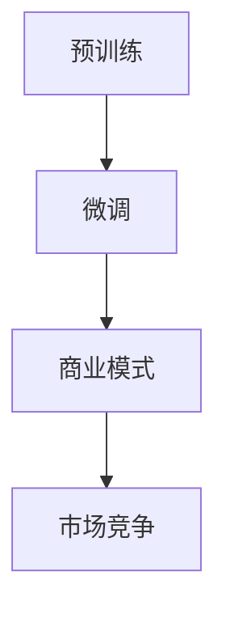

                 

# AI大模型创业：如何应对未来竞争对手？

> 关键词：
    - 人工智能大模型
    - 竞争策略
    - 商业模式创新
    - 数据优势
    - 技术壁垒
    - 可持续增长

## 1. 背景介绍

人工智能(AI)大模型的崛起，已经深刻改变了各行各业的发展格局。从自然语言处理(NLP)、计算机视觉(CV)到推荐系统、语音识别等，大模型在各个领域的卓越性能，使其成为各大科技公司、创业公司争相竞逐的新高地。如何在这个竞争激烈的市场中脱颖而出，成为每个创业者的重要课题。本文将从背景、核心概念和竞争策略等方面，为你提供深度见解。

### 1.1 问题由来

AI大模型的快速发展，离不开大数据、高性能计算以及深度学习算法的不断进步。通过大规模的无标签数据预训练，大模型在特定任务上的微调性能显著提升。然而，这种优势也吸引了众多对手的青睐。如何在市场中保持领先，是AI创业公司必须面对的挑战。

### 1.2 问题核心关键点

大模型创业的核心关键点在于：
- **数据优势**：大规模、高质量的数据集是大模型性能的基石。
- **技术壁垒**：深度学习算法和模型架构的创新，形成技术护城河。
- **商业模式**：如何有效实现产品化和商业变现。
- **用户获取**：吸引并留存用户，形成网络效应。
- **可持续发展**：长期发展的战略规划。

## 2. 核心概念与联系

### 2.1 核心概念概述

在探索大模型创业的竞争策略时，以下几个核心概念是不可或缺的：

- **AI大模型**：指通过大规模无标签数据预训练，然后在特定任务上进行微调，获得高性能的预训练模型。常见的有大规模语言模型BERT、GPT系列、ViT等。
- **预训练-微调**：先在大规模数据上无监督预训练，然后在特定任务上通过有监督的微调获得高性能模型。
- **技术壁垒**：通过技术创新形成难以模仿的竞争优势。
- **商业模式**：基于AI大模型的产品和服务，如何实现商业化。
- **市场竞争**：分析竞争对手的优势和劣势，制定应对策略。

### 2.2 核心概念原理和架构的 Mermaid 流程图



## 3. 核心算法原理 & 具体操作步骤

### 3.1 算法原理概述

大模型创业的核心在于预训练-微调技术的深度应用。通过在特定任务上微调，大模型能够适应具体业务场景，提供高质量的预测结果。

1. **预训练阶段**：在大规模无标签数据上进行自监督学习，学习通用语言表示。
2. **微调阶段**：在特定任务上进行有监督学习，优化模型性能。
3. **商业化应用**：将优化后的模型应用于实际业务场景，实现商业变现。

### 3.2 算法步骤详解

#### 3.2.1 数据准备

- **数据集准备**：收集大规模无标签数据集，进行预训练。
- **任务数据准备**：根据具体应用场景，收集并标注有监督数据集，进行微调。

#### 3.2.2 模型搭建

- **选择模型架构**：根据任务需求选择适合的大模型架构，如BERT、GPT、ViT等。
- **搭建模型结构**：构建包含预训练和微调两个阶段的模型，并设置合适的超参数。

#### 3.2.3 模型训练

- **预训练阶段**：在无标签数据上训练大模型，学习语言表示。
- **微调阶段**：在标注数据上微调模型，优化特定任务的性能。

#### 3.2.4 模型评估与部署

- **评估模型性能**：在验证集上评估模型性能，调整模型参数。
- **部署应用场景**：将模型集成到实际应用中，提供高质量的服务。

### 3.3 算法优缺点

#### 3.3.1 优点

- **高效性能**：通过预训练-微调，大模型在特定任务上表现优异。
- **适用性强**：可以适用于多种NLP任务，如问答、翻译、摘要等。
- **泛化能力强**：在少量标注数据下，也能取得较好效果。

#### 3.3.2 缺点

- **数据依赖**：对标注数据依赖较大，获取高质量标注数据成本高。
- **计算资源需求高**：预训练模型参数量庞大，对计算资源要求高。
- **模型复杂度**：模型结构复杂，开发和维护成本高。

### 3.4 算法应用领域

大模型微调技术广泛应用于以下几个领域：

1. **自然语言处理**：问答系统、机器翻译、情感分析等。
2. **计算机视觉**：图像分类、目标检测、图像生成等。
3. **语音识别**：语音转文本、语音生成等。
4. **推荐系统**：商品推荐、个性化新闻推荐等。
5. **医疗健康**：病历分析、诊断支持等。
6. **金融服务**：信用评分、欺诈检测等。

## 4. 数学模型和公式 & 详细讲解 & 举例说明

### 4.1 数学模型构建

以自然语言处理任务为例，大模型的数学模型可以表示为：

$$
y = M_\theta(x)
$$

其中，$M_\theta$ 为预训练-微调后的模型，$x$ 为输入文本，$y$ 为输出结果。

### 4.2 公式推导过程

在微调阶段，模型的目标是最小化损失函数 $L$：

$$
L = \sum_{i=1}^N \ell(y_i, M_\theta(x_i))
$$

其中，$\ell$ 为损失函数，$x_i, y_i$ 为训练集中的输入和标注样本。

通过反向传播算法，计算损失函数对模型参数 $\theta$ 的梯度，更新参数值。

### 4.3 案例分析与讲解

假设任务为情感分析，输入为一段文本 $x$，输出为情感标签 $y$。模型训练过程如下：

1. 将文本 $x$ 输入模型，得到预测结果 $y' = M_\theta(x)$。
2. 计算损失函数 $L = \ell(y, y')$。
3. 通过反向传播，计算梯度 $\frac{\partial L}{\partial \theta}$。
4. 使用优化算法更新模型参数 $\theta$。

## 5. 项目实践：代码实例和详细解释说明

### 5.1 开发环境搭建

- **环境准备**：安装Python 3.x、PyTorch、TensorFlow等深度学习框架，并配置好GPU资源。
- **数据准备**：收集并预处理情感分析数据集，包括文本和标注。
- **模型搭建**：选择预训练模型如BERT，搭建微调模型结构。

### 5.2 源代码详细实现

以下是使用PyTorch实现情感分析微调的代码：

```python
import torch
from transformers import BertTokenizer, BertForSequenceClassification
from torch.utils.data import DataLoader

# 数据准备
tokenizer = BertTokenizer.from_pretrained('bert-base-uncased')
train_data = ...
train_labels = ...
test_data = ...
test_labels = ...

# 模型搭建
model = BertForSequenceClassification.from_pretrained('bert-base-uncased', num_labels=2)
device = torch.device("cuda" if torch.cuda.is_available() else "cpu")
model.to(device)

# 定义损失函数和优化器
loss_fn = torch.nn.CrossEntropyLoss()
optimizer = torch.optim.Adam(model.parameters(), lr=2e-5)

# 训练过程
for epoch in range(5):
    for batch in DataLoader(train_data, batch_size=32, shuffle=True):
        input_ids = batch['input_ids'].to(device)
        attention_mask = batch['attention_mask'].to(device)
        labels = batch['labels'].to(device)

        # 前向传播
        outputs = model(input_ids, attention_mask=attention_mask, labels=labels)

        # 计算损失
        loss = loss_fn(outputs.logits, labels)

        # 反向传播和优化
        optimizer.zero_grad()
        loss.backward()
        optimizer.step()

# 测试过程
model.eval()
test_loss = 0
correct = 0
with torch.no_grad():
    for batch in DataLoader(test_data, batch_size=32, shuffle=False):
        input_ids = batch['input_ids'].to(device)
        attention_mask = batch['attention_mask'].to(device)
        labels = batch['labels'].to(device)

        # 前向传播
        outputs = model(input_ids, attention_mask=attention_mask)

        # 计算损失和准确率
        test_loss += loss_fn(outputs.logits, labels).item()
        preds = outputs.logits.argmax(dim=1)
        correct += (preds == labels).sum().item()

# 输出结果
print(f"Test loss: {test_loss / len(test_data)}")
print(f"Accuracy: {correct / len(test_data)}")
```

### 5.3 代码解读与分析

代码中，首先加载了BertTokenizer和BertForSequenceClassification，搭建了微调模型。接着定义了损失函数和优化器，并在训练过程中通过前向传播、损失计算、反向传播和优化等步骤更新模型参数。最后，在测试集上计算模型损失和准确率。

## 6. 实际应用场景

### 6.1 智能客服系统

智能客服系统可以应用大模型微调技术，提升客户咨询体验。收集客户历史咨询记录，进行情感分析、意图识别等微调，使系统能够自动理解客户需求并给出智能回复。

### 6.2 金融舆情监测

金融领域需要实时监测舆情变化，预测市场趋势。使用大模型进行文本分类和情感分析，及时发现市场负面新闻，预警潜在风险。

### 6.3 个性化推荐系统

推荐系统可以应用大模型微调技术，提供个性化推荐服务。收集用户行为数据，进行多模态微调，实现商品、新闻、视频等推荐。

### 6.4 未来应用展望

未来，大模型微调技术将在更多领域得到应用，推动产业升级：

1. **智慧医疗**：应用大模型进行医学文献分析、病历分析、诊断支持等。
2. **教育**：进行智能作业批改、个性化学习路径推荐等。
3. **智能城市**：进行城市事件监测、舆情分析、应急指挥等。
4. **企业生产**：进行生产调度、设备故障预测等。

## 7. 工具和资源推荐

### 7.1 学习资源推荐

- **《深度学习》系列书籍**：详细介绍了深度学习的基本概念和经典模型。
- **Coursera《深度学习专项课程》**：来自斯坦福大学，涵盖深度学习理论和实践。
- **Kaggle竞赛平台**：提供大量数据集和竞赛机会，提高实战能力。

### 7.2 开发工具推荐

- **PyTorch**：灵活的动态计算图，适合快速迭代开发。
- **TensorFlow**：生产化部署方便，支持大规模分布式训练。
- **Jupyter Notebook**：交互式编程环境，方便实验和调试。

### 7.3 相关论文推荐

- **Attention is All You Need**：Transformer模型，开创了预训练大模型时代。
- **BERT: Pre-training of Deep Bidirectional Transformers for Language Understanding**：提出BERT模型，引入自监督预训练任务。
- **AdaLoRA: Adaptive Low-Rank Adaptation for Parameter-Efficient Fine-Tuning**：提出AdaLoRA方法，提高参数高效微调效果。

## 8. 总结：未来发展趋势与挑战

### 8.1 研究成果总结

大模型微调技术已经取得显著进展，推动了NLP、CV等领域的应用落地。未来，技术将向以下几个方向发展：

1. **模型规模继续扩大**：预训练模型参数量不断增长，推动更大规模的语言模型出现。
2. **技术不断创新**：引入更多创新算法，提高微调效果和效率。
3. **多模态融合**：结合视觉、语音等多模态信息，提升大模型的泛化能力。
4. **跨领域迁移**：应用在大规模领域的预训练模型，在更多场景下推广应用。

### 8.2 未来发展趋势

未来，大模型微调技术将向以下方向发展：

1. **模型通用性增强**：预训练模型将具备更强的跨领域迁移能力。
2. **参数效率提高**：开发更多参数高效微调方法，提升模型优化效率。
3. **实时性提升**：优化模型推理速度，实现高效实时应用。
4. **可解释性增强**：提高模型输出的可解释性，增强用户信任。

### 8.3 面临的挑战

尽管大模型微调技术取得了进展，但仍面临诸多挑战：

1. **数据获取成本高**：获取高质量标注数据成本高，限制了模型的应用范围。
2. **计算资源需求大**：大模型训练和推理需要高性能计算资源。
3. **模型复杂度高**：模型结构和参数量庞大，开发和维护复杂。
4. **性能不稳定**：微调模型面对新任务时，泛化性能可能下降。

### 8.4 研究展望

未来研究将集中在以下几个方面：

1. **无监督学习**：降低对标注数据的依赖，利用自监督学习提升模型性能。
2. **参数高效微调**：开发更多参数高效方法，减少计算资源消耗。
3. **多模态融合**：结合视觉、语音等模态信息，提升大模型的泛化能力。
4. **可解释性**：增强模型输出的可解释性，提高用户信任。

## 9. 附录：常见问题与解答

**Q1: 大模型微调需要多长时间？**

A: 大模型微调的时间取决于任务复杂度、数据规模和计算资源。通常，在GPU上微调BERT模型需要几个小时至几天不等。

**Q2: 微调过程中如何避免过拟合？**

A: 过拟合可以通过以下方法避免：
- 数据增强：引入对抗样本、生成合成数据等。
- 正则化：使用L2正则、Dropout等。
- 模型压缩：采用剪枝、量化等方法减少模型复杂度。

**Q3: 如何提升大模型的实时性能？**

A: 提升实时性能可以从以下方面入手：
- 模型压缩：使用剪枝、量化等方法减少模型尺寸。
- 分布式训练：使用多机多卡进行分布式训练，提升训练速度。
- 推理优化：使用模型推理加速技术，如GPU加速、异步推理等。

**Q4: 如何选择适合的任务微调模型？**

A: 选择适合的任务微调模型需要考虑以下几个因素：
- 任务类型：选择相应类型的预训练模型，如BERT、GPT等。
- 数据规模：选择参数量与数据规模相匹配的模型。
- 计算资源：选择能够利用现有计算资源的模型。

**Q5: 如何评估微调模型的性能？**

A: 微调模型的性能评估可以从以下几个方面入手：
- 准确率：计算模型在测试集上的准确率。
- 召回率：计算模型在测试集上的召回率。
- F1分数：综合准确率和召回率的评估指标。

总之，大模型微调技术在大模型创业中占据重要地位。通过深入理解技术原理、掌握实际应用、不断探索创新，才能在竞争激烈的AI大模型市场中脱颖而出。

