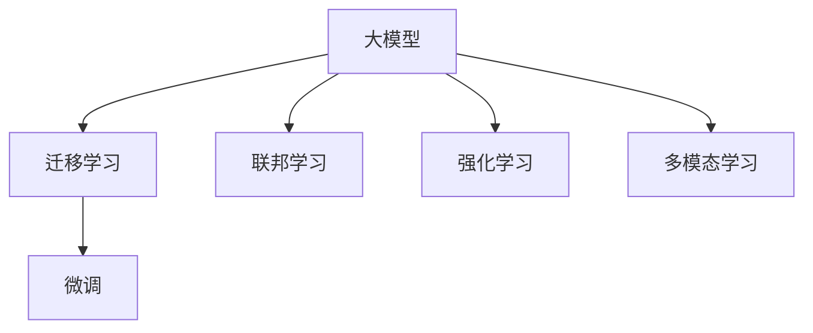

                 

## 1. 背景介绍

随着人工智能技术的飞速发展，尤其是深度学习和大模型（Large Models）的崛起，越来越多的初创企业开始将目光聚焦于AI大模型，探索其应用潜力。但是，要打造一款成功的AI大模型应用，仅仅依靠强大的算法和模型是不够的。文章将从背景介绍、核心概念与联系、核心算法原理、项目实践、应用场景、工具和资源推荐等多个维度，深入剖析AI大模型创业的关键要素，并提供全面系统的指导。

## 2. 核心概念与联系

### 2.1 核心概念概述

AI大模型通常指的是具有大规模参数量（如亿级参数）的深度学习模型，这类模型在处理自然语言、图像、音频等复杂数据时表现出色。核心概念包括：

- **大模型（Large Models）**：如BERT、GPT、ViT等，通常基于Transformer架构，拥有海量参数量。
- **迁移学习（Transfer Learning）**：利用预训练模型（Pretrained Models）在大规模数据上获得的知识，通过微调（Fine-tuning）解决特定问题。
- **微调（Fine-tuning）**：在特定任务上对预训练模型进行有监督训练，以调整模型参数，提升在特定任务上的性能。
- **联邦学习（Federated Learning）**：多边协同学习模式，在保护数据隐私的前提下，利用分布式数据进行模型训练。
- **强化学习（Reinforcement Learning）**：通过奖励机制，使模型在特定环境中不断学习优化，适用于需要长期交互的场景。
- **多模态学习（Multimodal Learning）**：结合文本、图像、声音等多种模态数据进行训练，增强模型的全面理解能力。

这些概念之间的联系可以构建如下Mermaid流程图：



### 2.2 核心概念原理和架构的 Mermaid 流程图


## 3. 核心算法原理 & 具体操作步骤

### 3.1 算法原理概述

AI大模型的核心算法原理主要包括深度学习、自然语言处理（NLP）和强化学习等。以下是对这些原理的概述：

- **深度学习**：通过多层神经网络模拟人脑的学习过程，利用大量数据进行训练，提取数据中的特征。
- **自然语言处理**：使计算机能够理解、处理和生成人类语言，包括分词、词向量表示、序列建模等技术。
- **强化学习**：通过与环境的交互，让模型逐步学习最优策略，广泛应用于游戏、推荐系统等领域。

### 3.2 算法步骤详解

AI大模型的具体步骤包括：

1. **数据收集与预处理**：收集和清洗大规模数据，为模型训练提供数据支撑。
2. **模型选择与初始化**：选择适合任务的模型，并进行参数初始化。
3. **预训练**：在大规模数据集上对模型进行无监督预训练，获得通用的语言表示。
4. **微调**：在特定任务上对预训练模型进行有监督训练，调整模型参数，提升模型性能。
5. **部署与优化**：将训练好的模型部署到实际应用中，并进行优化和调优。

### 3.3 算法优缺点

**优点**：

- **高效性**：大模型能够在短时间内完成训练，适合快速迭代。
- **泛化能力强**：在多种场景下表现优异，具有较强的适应性。
- **可解释性强**：能够解释模型输出的逻辑和决策过程，便于理解和调试。

**缺点**：

- **资源消耗大**：需要大量的计算资源和存储资源，成本较高。
- **模型复杂度高**：模型结构复杂，调试和优化难度大。
- **过拟合风险高**：训练过程中容易过拟合，需要严格的数据处理和模型调整。

### 3.4 算法应用领域

AI大模型在多个领域都有广泛应用，如：

- **自然语言处理（NLP）**：包括文本分类、情感分析、机器翻译、问答系统等。
- **计算机视觉（CV）**：如图像识别、目标检测、图像生成等。
- **语音识别与处理**：如语音合成、语音识别、情感识别等。
- **推荐系统**：如商品推荐、音乐推荐、广告推荐等。
- **游戏与模拟**：如自动博弈、模拟仿真等。

## 4. 数学模型和公式 & 详细讲解 & 举例说明

### 4.1 数学模型构建

AI大模型的数学模型构建主要涉及深度学习模型的构建和训练过程。以Transformer模型为例，构建如下：

- **输入编码器（Input Encoder）**：将输入文本转换为向量表示。
- **位置编码器（Positional Encoder）**：添加位置信息，帮助模型理解句子顺序。
- **输出解码器（Output Decoder）**：对文本进行解码，输出结果。

### 4.2 公式推导过程

以Transformer模型为例，其自注意力机制的公式如下：

$$
\text{Attention}(Q,K,V) = \text{Softmax}(\frac{QK^T}{\sqrt{d_k}})V
$$

其中 $Q$、$K$、$V$ 分别表示查询向量、键向量和值向量，$d_k$ 为键的维度。

### 4.3 案例分析与讲解

假设我们正在构建一个文本分类模型。首先，我们需要准备一个大规模的无标签文本数据集，作为预训练数据。其次，选择适合文本分类的模型，如BERT或GPT。接着，在文本分类任务上进行微调，优化模型参数，使其能够准确分类不同类型的文本。最后，将训练好的模型部署到实际应用中，进行性能评估和优化。

## 5. 项目实践：代码实例和详细解释说明

### 5.1 开发环境搭建

搭建AI大模型的开发环境需要安装以下工具和库：

- **Python**：选择版本为3.8或更高。
- **Anaconda**：用于创建和管理虚拟环境。
- **PyTorch**：深度学习框架，支持GPU加速。
- **TensorFlow**：谷歌深度学习框架，生产部署方便。
- **Jupyter Notebook**：交互式开发环境。
- **BERT或GPT预训练模型**：通过官网或库安装。

### 5.2 源代码详细实现

以构建文本分类模型为例，以下是Python代码实现：

```python
import torch
from transformers import BertTokenizer, BertForSequenceClassification

# 加载BERT模型和分词器
model = BertForSequenceClassification.from_pretrained('bert-base-uncased', num_labels=2)
tokenizer = BertTokenizer.from_pretrained('bert-base-uncased')

# 准备训练数据
inputs = tokenizer.encode_plus("I love deep learning", return_tensors='pt', padding='max_length', max_length=128, truncation=True)
inputs = {k: v.to('cuda') for k, v in inputs.items()}

# 训练模型
model.train()
for _ in range(10):
    outputs = model(**inputs)
    loss = outputs.loss
    loss.backward()
    optimizer.step()
```

### 5.3 代码解读与分析

这段代码首先加载了预训练的BERT模型和分词器。然后，准备了一段文本数据，通过分词器进行编码，并使用GPU进行训练。在每个epoch中，模型前向传播计算损失，反向传播更新参数，优化器进行参数更新。通过多次迭代，模型不断优化，最终在特定任务上达到理想性能。

### 5.4 运行结果展示

训练完成后，可以评估模型的性能：

```python
inputs = tokenizer.encode_plus("This is a new text", return_tensors='pt', padding='max_length', max_length=128, truncation=True)
inputs = {k: v.to('cuda') for k, v in inputs.items()}

model.eval()
with torch.no_grad():
    outputs = model(**inputs)
    logits = outputs.logits
    predicted_label = torch.argmax(logits, dim=1)
```

## 6. 实际应用场景

### 6.1 智能客服

智能客服系统利用AI大模型进行用户意图识别和对话管理。用户输入问题后，系统自动匹配最优答案，并引导对话，提供个性化服务。这种应用场景下，需要模型具备较强的语义理解和逻辑推理能力，以实现复杂的对话管理。

### 6.2 金融风控

在金融领域，AI大模型可以用于客户行为分析、信用评估、欺诈检测等任务。通过分析客户的交易记录、社交媒体数据等，模型可以预测客户的风险水平，及时进行风险预警和控制。

### 6.3 医疗诊断

在医疗领域，AI大模型可以辅助医生进行诊断和推荐。通过分析病历、影像、基因数据等，模型可以提供疾病预测、治疗方案推荐等服务，提高医疗诊断的准确性和效率。

### 6.4 未来应用展望

未来，AI大模型将在更多领域发挥重要作用。例如，在教育领域，可以用于个性化学习推荐、智能辅助教学等；在城市管理领域，可以用于智能交通、环境监测等。随着技术的进步，AI大模型将带来更多创新应用，推动社会进步。

## 7. 工具和资源推荐

### 7.1 学习资源推荐

- **《深度学习》（Goodfellow et al.）**：深度学习领域的经典教材，涵盖深度学习的基本概念和算法。
- **Coursera深度学习课程**：由斯坦福大学教授Andrew Ng主讲的深度学习课程，深入浅出地介绍深度学习基础知识。
- **《Python深度学习》（Goodfellow et al.）**：基于TensorFlow实现深度学习的教程，适合实践操作。
- **Kaggle竞赛**：参与数据科学竞赛，实践和提升AI模型构建和优化能力。

### 7.2 开发工具推荐

- **PyTorch**：深度学习框架，支持GPU加速，灵活性高。
- **TensorFlow**：生产部署方便，适用于大规模工程应用。
- **Jupyter Notebook**：交互式开发环境，支持多种编程语言和库。
- **Weights & Biases**：模型训练跟踪工具，支持可视化评估和调试。
- **TensorBoard**：模型训练监控工具，实时展示训练状态和指标。

### 7.3 相关论文推荐

- **Attention is All You Need**：Transformer论文，提出Transformer架构，开启大模型时代。
- **BERT: Pre-training of Deep Bidirectional Transformers for Language Understanding**：BERT论文，提出预训练语言模型，刷新多项NLP任务SOTA。
- **Language Models are Unsupervised Multitask Learners**：GPT-2论文，展示大模型的零样本学习能力。
- **Parameter-Efficient Transfer Learning for NLP**：介绍参数高效微调方法，优化模型性能。
- **Prefix-Tuning: Optimizing Continuous Prompts for Generation**：提出基于连续型Prompt的微调范式。

## 8. 总结：未来发展趋势与挑战

### 8.1 研究成果总结

AI大模型的研究取得了显著成果，广泛应用于各个领域，提升了数据处理和模型训练的效率，推动了人工智能技术的普及。但同时，也面临数据隐私、模型复杂性、资源消耗等挑战。

### 8.2 未来发展趋势

未来，AI大模型将朝着以下几个方向发展：

- **模型规模更大**：超大规模模型将带来更强的泛化能力和泛化性。
- **模型结构更优**：采用更高效的模型结构和算法，提高计算效率和可解释性。
- **应用场景更广**：在更多领域部署AI大模型，推动各行各业数字化转型。

### 8.3 面临的挑战

AI大模型创业面临以下挑战：

- **数据隐私保护**：如何保护用户隐私，防止数据泄露。
- **模型可解释性**：提高模型的可解释性，增强用户信任。
- **计算资源消耗**：优化模型结构和训练流程，降低计算成本。
- **模型鲁棒性**：提高模型的鲁棒性，应对复杂场景下的挑战。
- **应用场景适配**：在不同场景下适配模型，确保应用效果。

### 8.4 研究展望

未来的研究将聚焦于以下几个方向：

- **多模态学习**：结合文本、图像、声音等多种模态数据，提升模型的全面理解能力。
- **联邦学习**：在保护用户隐私的前提下，利用分布式数据进行模型训练。
- **强化学习**：在复杂场景下，通过奖励机制进行长期优化。
- **跨领域迁移**：提升模型在不同领域之间的迁移能力。
- **模型压缩与优化**：优化模型结构和参数，提高计算效率和模型性能。

## 9. 附录：常见问题与解答

**Q1: 如何选择合适的AI大模型？**

A: 选择合适的AI大模型需要考虑以下几个因素：
- **任务类型**：不同任务适合不同的模型。
- **数据规模**：模型的参数量与数据规模相匹配。
- **性能要求**：根据任务需求，选择性能最佳的模型。

**Q2: AI大模型训练需要哪些资源？**

A: AI大模型训练需要以下资源：
- **计算资源**：GPU/TPU等高性能设备。
- **存储资源**：大模型需要大量的存储空间。
- **网络资源**：高速网络带宽，便于数据传输。

**Q3: 如何优化AI大模型的性能？**

A: 优化AI大模型性能可以从以下几个方面入手：
- **模型压缩**：减少模型参数量，提高计算效率。
- **数据增强**：通过数据增强技术，丰富训练集。
- **超参数调优**：调整学习率、批大小等超参数，提高模型性能。
- **正则化技术**：引入正则化技术，防止过拟合。

**Q4: AI大模型在实际应用中需要注意什么？**

A: AI大模型在实际应用中需要注意以下方面：
- **数据隐私保护**：保护用户隐私，防止数据泄露。
- **模型鲁棒性**：提高模型鲁棒性，应对复杂场景。
- **可解释性**：提高模型可解释性，增强用户信任。
- **应用适配**：根据实际应用场景，优化模型参数。

---

作者：禅与计算机程序设计艺术 / Zen and the Art of Computer Programming

