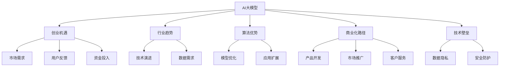

                 

# AI大模型创业：如何抓住未来机遇？

> 关键词：AI大模型,创业机遇,行业趋势,算法优势,商业化路径,技术壁垒

## 1. 背景介绍

### 1.1 问题由来
人工智能（AI）大模型的兴起正在重塑科技和商业格局。从AlphaGo的胜利到OpenAI的GPT系列、Google的BERT等模型的出现，大模型的强大能力已经得到了广泛认可。大模型能够处理和理解复杂的语言和图像信息，显示出惊人的通用性和智能水平。这些大模型的发展，为AI创业提供了广阔的天地，也带来了前所未有的机遇。

然而，大模型也面临着一系列挑战，如高昂的训练成本、模型的可解释性、数据隐私问题等。这些问题要求创业者不仅要有技术实力，还需要具备商业化运营能力。本文将从大模型的核心概念、算法原理、应用场景和未来趋势等方面，探讨如何抓住这一历史机遇，创建成功的AI创业公司。

### 1.2 问题核心关键点
- **核心概念**：大模型、创业、行业趋势、算法优势、商业化路径、技术壁垒。
- **研究意义**：帮助创业者理解AI大模型创业的机遇与挑战，制定科学的商业策略。

## 2. 核心概念与联系

### 2.1 核心概念概述

在AI大模型创业中，需要理解以下几个核心概念：

- **AI大模型**：基于大规模数据和先进算法训练而成的智能模型，能够处理复杂的自然语言、图像和视频数据。

- **创业机遇**：指在大模型发展背景下，新出现的商业模式、产品需求和技术趋势。

- **行业趋势**：包括技术发展趋势、市场需求变化、政策法规要求等，对AI大模型创业具有重要影响。

- **算法优势**：大模型在处理复杂任务时，相比传统算法具有计算效率高、泛化能力强等优势。

- **商业化路径**：将技术转化为实际应用的过程，包括产品开发、市场推广、客户服务等多个环节。

- **技术壁垒**：指在AI大模型领域保持竞争优势所需的关键技术能力，如数据处理、模型训练、应用开发等。

这些概念之间的逻辑关系可以通过以下Mermaid流程图来展示：



这个流程图展示了AI大模型创业的关键环节和要素，以及它们之间的相互作用。

## 3. 核心算法原理 & 具体操作步骤
### 3.1 算法原理概述

AI大模型的核心算法通常基于深度学习，特别是神经网络。其主要原理如下：

1. **数据预处理**：清洗、归一化、标注等步骤，将原始数据转化为机器可处理的形式。
2. **模型训练**：通过大规模数据集的反向传播算法，优化模型参数，使其能够准确预测目标。
3. **模型评估**：在测试集上评估模型性能，如准确率、召回率等指标。
4. **应用部署**：将训练好的模型部署到实际应用场景中，进行推理和决策。

### 3.2 算法步骤详解

AI大模型创业的主要步骤包括：

1. **市场调研**：了解市场需求、用户痛点和竞争环境，确定目标市场和客户群体。
2. **产品规划**：基于调研结果，设计核心产品功能和技术架构。
3. **模型开发**：选择合适的预训练模型，进行微调和优化，以满足特定需求。
4. **商业化策略**：制定定价、推广、销售和客户服务策略。
5. **客户反馈**：收集用户反馈，不断优化产品和服务。
6. **持续迭代**：根据市场和用户反馈，不断改进模型和产品。

### 3.3 算法优缺点

AI大模型的主要优点包括：

- **通用性强**：适用于多种NLP、图像识别、语音识别等任务。
- **计算效率高**：通过并行计算，能够在较短时间内处理大量数据。
- **泛化能力强**：在大规模数据上预训练的模型，能够泛化到新数据集。

缺点则包括：

- **高成本**：需要高性能计算资源和大规模数据集。
- **模型复杂**：模型参数量巨大，不易解释和调试。
- **数据隐私**：处理敏感数据时，需要严格的数据隐私保护措施。

### 3.4 算法应用领域

AI大模型在众多领域都有广泛应用，如自然语言处理（NLP）、计算机视觉（CV）、语音识别（ASR）等。以下是几个典型应用场景：

1. **智能客服**：利用大模型进行自然语言理解，提供自动化客服解决方案。
2. **医疗诊断**：通过大模型分析医疗影像和病历，辅助医生进行诊断和治疗决策。
3. **金融风控**：使用大模型进行风险评估和欺诈检测，提升金融安全水平。
4. **自动驾驶**：利用大模型处理传感器数据，进行环境和对象识别，实现智能驾驶。

## 4. 数学模型和公式 & 详细讲解 & 举例说明

### 4.1 数学模型构建

AI大模型通常基于神经网络构建，其数学模型包括输入、输出、损失函数和优化算法等部分。以NLP为例，假设输入为文本序列$x$，输出为标签序列$y$，则模型的数学模型为：

$$
y = f(x; \theta)
$$

其中$f(\cdot)$为模型函数，$\theta$为模型参数，$\theta$通过反向传播算法优化。

### 4.2 公式推导过程

以线性回归模型为例，推导其优化公式：

假设模型输出为$\hat{y}$，真实标签为$y$，则损失函数为均方误差：

$$
L(\theta) = \frac{1}{N} \sum_{i=1}^N (\hat{y_i} - y_i)^2
$$

通过梯度下降算法，求导得到参数$\theta$的更新公式：

$$
\theta \leftarrow \theta - \eta \nabla_{\theta}L(\theta)
$$

其中$\eta$为学习率。

### 4.3 案例分析与讲解

以BERT模型为例，其在NLP任务上的优化过程如下：

1. 选择BERT模型作为初始参数。
2. 定义任务适配层，如分类层或解码层。
3. 设定训练集、验证集和测试集。
4. 使用AdamW优化器，设置合适的学习率。
5. 进行多轮迭代训练，在验证集上评估性能。
6. 在测试集上评估最终效果。

## 5. 项目实践：代码实例和详细解释说明
### 5.1 开发环境搭建

以下是使用Python和PyTorch搭建AI大模型开发环境的详细步骤：

1. 安装Anaconda：从官网下载并安装Anaconda，用于创建独立的Python环境。
2. 创建并激活虚拟环境：
```bash
conda create -n ai-env python=3.8 
conda activate ai-env
```

3. 安装PyTorch：根据CUDA版本，从官网获取对应的安装命令。例如：
```bash
conda install pytorch torchvision torchaudio cudatoolkit=11.1 -c pytorch -c conda-forge
```

4. 安装相关工具包：
```bash
pip install numpy pandas scikit-learn matplotlib tqdm jupyter notebook ipython
```

完成上述步骤后，即可在`ai-env`环境中开始大模型开发。

### 5.2 源代码详细实现

以下是一个简单的NLP任务示例，使用BERT模型进行情感分析。

```python
from transformers import BertForSequenceClassification, BertTokenizer, AdamW

# 初始化BERT模型和分词器
model = BertForSequenceClassification.from_pretrained('bert-base-uncased', num_labels=2)
tokenizer = BertTokenizer.from_pretrained('bert-base-uncased')

# 准备数据集
train_data = [("I love this product", 1), ("This product is terrible", 0)]
train_labels = [1, 0]
test_data = [("I don't like this product", 0)]
test_labels = [0]

# 编码训练数据
train_encodings = tokenizer(train_data, truncation=True, padding=True)
train_labels = torch.tensor(train_labels)
test_encodings = tokenizer(test_data, truncation=True, padding=True)

# 定义模型和优化器
device = torch.device('cuda' if torch.cuda.is_available() else 'cpu')
model.to(device)
optimizer = AdamW(model.parameters(), lr=2e-5)

# 训练模型
model.train()
for epoch in range(10):
    for batch in train_encodings:
        input_ids = batch['input_ids'].to(device)
        attention_mask = batch['attention_mask'].to(device)
        labels = batch['labels'].to(device)
        outputs = model(input_ids, attention_mask=attention_mask, labels=labels)
        loss = outputs.loss
        loss.backward()
        optimizer.step()
    print(f"Epoch {epoch+1}, loss: {loss.item()}")
```

### 5.3 代码解读与分析

在这个示例中，我们首先加载了预训练的BERT模型和分词器，然后准备训练和测试数据，使用`tokenizer`对文本进行编码。接下来，定义了训练过程，使用`AdamW`优化器进行模型参数更新。

```python
model.train()
for epoch in range(10):
    for batch in train_encodings:
        input_ids = batch['input_ids'].to(device)
        attention_mask = batch['attention_mask'].to(device)
        labels = batch['labels'].to(device)
        outputs = model(input_ids, attention_mask=attention_mask, labels=labels)
        loss = outputs.loss
        loss.backward()
        optimizer.step()
```

这里使用了10轮迭代训练，每轮对数据集中的每个样本进行一次前向传播和反向传播。最终输出每轮的损失值，以评估模型性能。

## 6. 实际应用场景
### 6.4 未来应用展望

AI大模型在多个领域展现出巨大潜力，未来应用前景广阔：

1. **医疗健康**：用于疾病诊断、药物发现、患者管理等。
2. **金融服务**：用于风险评估、客户服务、投资分析等。
3. **自动驾驶**：用于环境感知、路径规划、事故预警等。
4. **智能制造**：用于质量检测、故障预测、生产优化等。
5. **教育培训**：用于个性化学习、作业批改、知识图谱等。

## 7. 工具和资源推荐
### 7.1 学习资源推荐

为了帮助创业者掌握AI大模型的核心技术，推荐以下学习资源：

1. **《深度学习》书籍**：李宏毅等，介绍深度学习的基础理论和技术实现。
2. **DeepLearning.ai在线课程**：由Andrew Ng等教授主讲，涵盖深度学习的各个方面。
3. **Transformers库官方文档**：详细介绍了大模型在NLP任务中的应用。
4. **GitHub开源项目**：如HuggingFace的Transformers库，提供丰富的预训练模型和微调样例。
5. **NIPS、ICML、CVPR等顶级会议论文**：提供最新的AI大模型研究成果。

### 7.2 开发工具推荐

以下是几款常用的AI大模型开发工具：

1. **PyTorch**：基于Python的开源深度学习框架，灵活高效，广泛支持。
2. **TensorFlow**：由Google开发的深度学习框架，生产部署方便，社区活跃。
3. **JAX**：Google开发的加速深度学习的库，支持自动微分和分布式计算。
4. **TensorBoard**：TensorFlow的可视化工具，用于监控和调试模型训练过程。
5. **Weights & Biases**：实验跟踪工具，记录和可视化模型训练指标。

### 7.3 相关论文推荐

以下是几篇关于AI大模型的经典论文，推荐阅读：

1. **Attention is All You Need**：提出Transformer结构，开启了大模型时代。
2. **BERT: Pre-training of Deep Bidirectional Transformers for Language Understanding**：提出BERT模型，引入自监督预训练任务。
3. **GPT-3**：展示了大规模语言模型的零样本学习能力。
4. **LoRA: Language Representations are Linear**：提出LoRA模型，提高了参数高效微调的效率。
5. **Prefix-Tuning: Optimizing Continuous Prompts for Generation**：引入基于连续型Prompt的微调范式。

## 8. 总结：未来发展趋势与挑战

### 8.1 总结

本文详细介绍了AI大模型创业的背景、核心概念和实际应用，揭示了其在多个领域中的潜力。AI大模型通过深度学习算法，结合大规模数据训练，能够实现复杂任务的智能处理。创业者需要充分理解这些核心概念，制定科学的商业策略，才能在竞争激烈的市场中脱颖而出。

### 8.2 未来发展趋势

未来AI大模型的发展趋势如下：

1. **模型规模不断扩大**：随着计算资源和数据量的增加，大模型的规模将继续扩大，性能不断提升。
2. **应用领域更加广泛**：AI大模型将在更多行业和场景中得到应用，推动智能化转型。
3. **算法不断进步**：深度学习算法和优化方法将不断改进，提高模型的泛化能力和效率。
4. **技术融合加速**：与其他AI技术如增强学习、知识图谱等融合，提升系统的综合能力。
5. **数据隐私和安全**：随着数据敏感性的增加，数据隐私和安全问题将受到更多关注。

### 8.3 面临的挑战

AI大模型创业仍面临诸多挑战：

1. **高昂成本**：大模型的训练和部署需要大量的计算资源和存储资源。
2. **模型复杂度**：大模型参数量巨大，难以解释和调试。
3. **数据隐私**：处理敏感数据时，需要严格的数据隐私保护措施。
4. **技术壁垒**：进入门槛高，需要强大的技术实力和资源支持。
5. **市场竞争**：AI大模型市场竞争激烈，需要独特的商业模式和创新能力。

### 8.4 研究展望

未来，AI大模型创业需要从以下几个方面进行研究：

1. **低成本训练**：探索更高效、更经济的训练方法，降低进入门槛。
2. **模型可解释性**：提高模型的可解释性，增强用户信任。
3. **数据隐私保护**：设计隐私保护算法，确保数据安全。
4. **跨领域应用**：探索AI大模型在更多领域的应用，推动行业智能化转型。
5. **开放生态**：构建开源社区，推动AI大模型的普及和应用。

## 9. 附录：常见问题与解答

**Q1：AI大模型创业的核心竞争力是什么？**

A: AI大模型的核心竞争力在于其强大的计算能力和广泛的应用潜力。通过深度学习算法和大规模数据训练，大模型能够实现复杂任务的智能处理，适用于多种NLP、CV、ASR等任务。同时，大模型能够通过微调和优化，满足特定需求，提高产品的竞争力。

**Q2：如何降低AI大模型创业的成本？**

A: 降低AI大模型创业的成本，可以从以下几个方面入手：

1. **采用云平台**：利用云平台提供的计算和存储资源，降低本地硬件的投入成本。
2. **优化模型结构**：通过剪枝、量化等技术，减小模型的参数量和计算量，提高资源利用效率。
3. **共享开源模型**：利用开源社区提供的预训练模型，减少从头训练的需求。
4. **采用分布式计算**：通过多机并行计算，加速模型训练和推理过程。

**Q3：如何提高AI大模型的可解释性？**

A: 提高AI大模型的可解释性，可以从以下几个方面入手：

1. **增加中间层可视化**：通过中间层的可视化，展示模型的计算过程和关键参数，帮助用户理解模型决策。
2. **使用可解释的模型架构**：如线性模型、树模型等，这些模型易于解释和调试。
3. **引入知识图谱**：将符号化的先验知识融入模型，提高模型的可解释性。

**Q4：如何确保AI大模型的数据隐私？**

A: 确保AI大模型的数据隐私，可以从以下几个方面入手：

1. **数据匿名化**：对敏感数据进行匿名化处理，防止数据泄露。
2. **差分隐私**：采用差分隐私技术，限制对个体数据的访问。
3. **安全计算**：在模型训练和推理过程中，采用安全计算技术，保护数据隐私。

**Q5：AI大模型创业应该如何选择技术栈？**

A: AI大模型创业在选择技术栈时，需要考虑以下几个方面：

1. **开源社区支持**：选择广泛使用的技术栈，如TensorFlow、PyTorch等，可以获得丰富的资源和工具支持。
2. **计算资源需求**：根据模型的计算需求，选择高性能计算平台，如GPU、TPU等。
3. **开发效率**：选择高效、易用的开发工具，如Jupyter Notebook、TensorBoard等。

总之，AI大模型创业需要在技术实力和商业策略上双管齐下，才能抓住市场机遇，实现成功。

