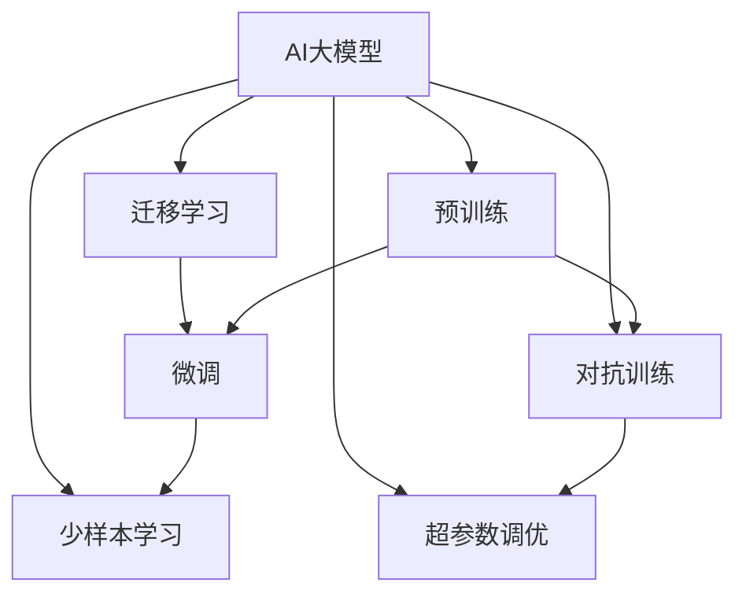

                 

# AI大模型创业：如何构建未来可持续的商业模式？

## 1. 背景介绍

随着人工智能(AI)技术的发展，大模型(AI大模型)在医疗、金融、教育、能源等多个领域展现了巨大的应用潜力，成为新一轮产业升级和数字化转型的关键引擎。AI大模型在处理海量数据、解决复杂问题上具备显著优势，成为新一代商业基础设施的核心。然而，对于AI大模型的创业者而言，如何构建未来可持续的商业模式，推动技术落地应用，仍是摆在面前的一大挑战。本文将详细分析AI大模型创业中需考虑的关键因素，探讨构建可持续发展商业模式的方法，以期为AI大模型的开发者和创业者提供有价值的参考。

## 2. 核心概念与联系

### 2.1 核心概念概述

为更好地理解构建AI大模型可持续商业模式的复杂性，本节将介绍几个密切相关的核心概念：

- AI大模型(AI Large Model)：指参数量达到亿级以上的预训练神经网络模型，能够处理复杂多变的NLP、图像识别、语音识别等任务，具有强大的泛化能力和迁移学习能力。
- 预训练(Pre-training)：指在无标签数据集上，通过自监督学习任务进行大规模无监督训练，学习通用的语言或图像表示。
- 迁移学习(Transfer Learning)：指在大规模预训练的基础上，使用少量标注数据进行微调，提升模型在特定任务上的性能。
- 微调(Fine-tuning)：指在预训练模型的基础上，使用下游任务的数据集进行有监督训练，进一步优化模型。
- 少样本学习(Few-shot Learning)：指在训练数据量极小的情况下，模型仍能对新数据进行有效预测。
- 对抗训练(Adversarial Training)：指通过引入对抗样本，提高模型鲁棒性和泛化能力。
- 超参数调优(Hyperparameter Tuning)：指通过调整模型的超参数，如学习率、批大小等，以达到最优性能。

这些核心概念通过相互关联，共同构建了AI大模型创业的宏观架构，影响着模型的训练、推理和应用全过程，需要创业者综合考虑。

### 2.2 核心概念原理和架构的 Mermaid 流程图



以上流程图示意图，展示了AI大模型从预训练到微调、对抗训练、超参数调优等各个环节的相互关联，以及各环节中核心概念的应用。

## 3. 核心算法原理 & 具体操作步骤

### 3.1 算法原理概述

AI大模型的商业化需要涵盖数据准备、模型训练、模型微调、推理部署等多个环节。该过程不仅涉及算法和技术的实现，还需要商业模式设计和市场推广的支持。AI大模型创业的算法原理和技术步骤主要包括：

1. 数据收集与预处理：通过爬虫、API接口等手段，收集大量的原始数据，并进行去重、清洗、标注等预处理工作，为模型训练和微调提供数据支持。
2. 模型预训练：使用大规模无监督学习任务，如语言建模、图像分类等，对模型进行预训练，学习通用的语言和图像表示。
3. 模型迁移学习与微调：在大规模预训练的基础上，使用少量标注数据进行微调，优化模型在特定任务上的性能。
4. 模型部署与推理：将训练好的模型部署到服务器或云平台，进行推理预测，并提供API接口供外部应用调用。
5. 对抗训练与超参数调优：对模型进行对抗样本训练，提高鲁棒性；通过调整超参数，提升模型性能。

### 3.2 算法步骤详解

基于以上原理，AI大模型创业的具体操作步骤如下：

**步骤1：数据收集与预处理**

- 收集与任务相关的数据集，并清洗、标注。
- 对数据进行增量式收集，保持数据集的时效性和丰富性。
- 对数据进行预处理，如去重、分词、归一化等。
- 对文本数据进行向量化处理，使用词向量、BERT等表示方式。

**步骤2：模型预训练**

- 选择合适的预训练框架，如BERT、GPT等。
- 使用大规模无标签数据，对模型进行预训练，如语言建模、掩码预测等。
- 对预训练模型进行保存，供后续微调使用。

**步骤3：模型迁移学习与微调**

- 选择合适的下游任务，收集少量标注数据。
- 在预训练模型的基础上，使用下游任务的数据集进行微调。
- 对模型进行微调，调整顶层结构，以适应新任务。
- 对微调过程进行监控，确保模型性能稳定。

**步骤4：模型部署与推理**

- 选择合适的云平台，如AWS、阿里云等。
- 将训练好的模型部署到云平台，并进行优化。
- 提供API接口，供外部应用调用，实现模型推理。

**步骤5：对抗训练与超参数调优**

- 引入对抗样本，对模型进行对抗训练，提升鲁棒性。
- 对模型的超参数进行调优，如学习率、批大小等，提高模型性能。

### 3.3 算法优缺点

AI大模型的算法存在以下优缺点：

**优点：**
1. 强大的泛化能力：AI大模型具备强大的泛化能力，能够在多种任务上取得优异表现。
2. 高效的推理速度：在大规模硬件的支持下，AI大模型的推理速度非常快。
3. 适应性强：AI大模型能够适应不同领域、不同规模的数据集。

**缺点：**
1. 数据依赖性强：AI大模型的训练和微调对数据质量有高要求，数据标注成本高。
2. 资源消耗大：AI大模型的训练和推理需要大量计算资源，成本较高。
3. 模型复杂度高：AI大模型的结构复杂，难以理解和管理。

### 3.4 算法应用领域

AI大模型在多个领域都有广泛应用，包括：

1. 医疗健康：AI大模型在疾病预测、诊断、治疗推荐等方面有显著应用。
2. 金融保险：AI大模型用于风险评估、欺诈检测、市场预测等。
3. 电子商务：AI大模型用于商品推荐、用户行为分析、广告投放等。
4. 智能制造：AI大模型用于生产调度、质量控制、设备维护等。
5. 教育培训：AI大模型用于个性化学习推荐、智能评估等。
6. 环境保护：AI大模型用于环境监测、灾害预测、资源评估等。

这些应用领域展示了AI大模型的强大潜力和广泛应用前景。

## 4. 数学模型和公式 & 详细讲解 & 举例说明

### 4.1 数学模型构建

AI大模型的数学模型构建涉及以下几个步骤：

1. 数据表示：将原始数据转换为模型可处理的形式，如词向量、图像特征等。
2. 模型结构：设计适合特定任务的模型结构，如Transformer、卷积神经网络(CNN)等。
3. 损失函数：定义模型训练的目标函数，如交叉熵损失、均方误差等。
4. 优化器：选择合适的优化算法，如Adam、SGD等。

### 4.2 公式推导过程

以二分类任务为例，展示AI大模型的数学模型构建和公式推导过程。

假设模型输入为 $x$，输出为 $y$，目标函数为 $f(x, \theta)$，损失函数为 $L(y, \hat{y})$，优化器为 $Opt$。

目标函数 $f(x, \theta)$ 的表达式为：
$$
f(x, \theta) = \sum_{i=1}^n w_i f_i(x, \theta)
$$

其中 $f_i(x, \theta)$ 为模型的预测输出，$w_i$ 为权重。

目标函数 $L(y, \hat{y})$ 的表达式为：
$$
L(y, \hat{y}) = \frac{1}{N}\sum_{i=1}^N L_i(y_i, \hat{y}_i)
$$

其中 $L_i(y_i, \hat{y}_i)$ 为样本 $i$ 的损失函数，如交叉熵损失。

优化器 $Opt$ 的更新公式为：
$$
\theta \leftarrow Opt(\theta, \nabla_{\theta} L(y, \hat{y}))
$$

其中 $\nabla_{\theta} L(y, \hat{y})$ 为目标函数对参数 $\theta$ 的梯度。

### 4.3 案例分析与讲解

假设某公司希望构建一个基于AI大模型的金融风险评估系统。

**数据准备：**
- 收集历史贷款数据，包括贷款金额、期限、申请时间、申请人信用记录等。
- 标注数据，分为正常还款和逾期还款两类。
- 对数据进行预处理，如去重、归一化等。

**模型构建：**
- 使用BERT作为基础模型，设计合适的模型结构。
- 设计损失函数和优化器，如交叉熵损失和Adam优化器。
- 在数据集上进行预训练和微调，学习贷款风险的泛化表示。

**部署与推理：**
- 将训练好的模型部署到云平台，如AWS、阿里云等。
- 提供API接口，供银行等金融机构调用，进行贷款风险评估。
- 对评估结果进行监控和分析，优化模型性能。

**对抗训练与超参数调优：**
- 引入对抗样本，对模型进行对抗训练，提高鲁棒性。
- 对模型的超参数进行调优，如学习率、批大小等，提高模型性能。

## 5. 项目实践：代码实例和详细解释说明

### 5.1 开发环境搭建

在构建AI大模型之前，需要搭建合适的开发环境。以下是搭建开发环境的具体步骤：

1. 安装Python：选择Python 3.8或更高版本，安装pip包管理器。
2. 安装TensorFlow和PyTorch：这两个深度学习框架是最常用的AI大模型训练工具。
3. 安装HuggingFace库：该库提供了多种预训练模型，方便模型的选择和微调。
4. 安装Jupyter Notebook：用于编写和调试代码。
5. 安装Docker：方便模型的部署和管理。

### 5.2 源代码详细实现

以构建一个基于BERT的金融风险评估模型为例，展示AI大模型的具体实现。

**代码实现：**

```python
import tensorflow as tf
from transformers import BertTokenizer, BertForSequenceClassification
import numpy as np
import pandas as pd

# 加载数据集
df = pd.read_csv('loan_data.csv')
# 标注数据
labels = np.array(df['status'])
# 文本数据
texts = df['text'].tolist()

# 加载BERT模型和分词器
tokenizer = BertTokenizer.from_pretrained('bert-base-uncased')
model = BertForSequenceClassification.from_pretrained('bert-base-uncased', num_labels=2)

# 将文本数据进行分词
inputs = tokenizer(texts, padding=True, truncation=True, return_tensors='tf')
input_ids = inputs['input_ids']
attention_mask = inputs['attention_mask']
labels = tf.constant(labels)

# 构建模型
model.compile(optimizer=tf.keras.optimizers.Adam(learning_rate=1e-5), loss=tf.keras.losses.BinaryCrossentropy(), metrics=['accuracy'])
model.fit(input_ids, labels, epochs=10, batch_size=32)

# 模型评估
evaluation = model.evaluate(input_ids, labels)
print(f'Accuracy: {evaluation[1] * 100:.2f}%')
```

### 5.3 代码解读与分析

以上代码展示了AI大模型在金融风险评估中的应用。

**数据准备：**
- 使用Pandas库读取CSV格式的数据集。
- 将标注数据和文本数据分别保存为标签数组和文本列表。

**模型加载：**
- 使用HuggingFace库加载BERT模型和分词器。

**数据预处理：**
- 使用分词器对文本数据进行分词，并处理padding和truncation。
- 将标签和输入数据转换为模型可接受的形式。

**模型训练：**
- 使用TensorFlow框架构建模型。
- 使用Adam优化器和二分类交叉熵损失函数。
- 对模型进行训练，设置10个epoch和32个batch size。

**模型评估：**
- 使用模型评估函数，输出模型的准确率。

## 6. 实际应用场景

### 6.1 医疗健康

AI大模型在医疗健康领域的应用非常广泛。以疾病预测和诊断为例：

- 数据准备：收集患者的病历数据，包括病情描述、实验室检查结果等。
- 模型构建：使用BERT等大模型，设计合适的模型结构。
- 模型训练与微调：使用标注数据对模型进行微调，学习疾病预测和诊断的泛化表示。
- 模型部署与推理：将训练好的模型部署到云平台，供医院使用。
- 对抗训练与超参数调优：对模型进行对抗训练，提高鲁棒性，调整超参数，提高模型性能。

### 6.2 金融保险

AI大模型在金融保险领域也有广泛应用，如欺诈检测：

- 数据准备：收集历史交易数据，标注正常交易和欺诈交易两类。
- 模型构建：使用BERT等大模型，设计合适的模型结构。
- 模型训练与微调：使用标注数据对模型进行微调，学习欺诈检测的泛化表示。
- 模型部署与推理：将训练好的模型部署到云平台，供银行和保险公司使用。
- 对抗训练与超参数调优：对模型进行对抗训练，提高鲁棒性，调整超参数，提高模型性能。

### 6.3 电子商务

AI大模型在电子商务领域也有广泛应用，如商品推荐：

- 数据准备：收集用户的购买记录、浏览行为等数据。
- 模型构建：使用BERT等大模型，设计合适的模型结构。
- 模型训练与微调：使用标注数据对模型进行微调，学习商品推荐的泛化表示。
- 模型部署与推理：将训练好的模型部署到云平台，供电商平台使用。
- 对抗训练与超参数调优：对模型进行对抗训练，提高鲁棒性，调整超参数，提高模型性能。

## 7. 工具和资源推荐

### 7.1 学习资源推荐

为了帮助开发者系统掌握AI大模型的构建和应用，这里推荐一些优质的学习资源：

1. TensorFlow官方文档：详细介绍了TensorFlow框架的使用方法，包括深度学习模型的构建、训练和部署。
2. PyTorch官方文档：详细介绍了PyTorch框架的使用方法，包括深度学习模型的构建、训练和部署。
3. HuggingFace官方文档：详细介绍了HuggingFace库的使用方法，包括预训练模型和微调。
4. Coursera深度学习课程：由斯坦福大学开设，系统介绍了深度学习的基本概念和前沿技术。
5. 《深度学习》书籍：由Goodfellow等人编写，全面介绍了深度学习的基本概念和实践。

通过对这些资源的学习，相信你一定能够快速掌握AI大模型的构建和应用，并将其应用于实际场景中。

### 7.2 开发工具推荐

高效的开发离不开优秀的工具支持。以下是几款用于AI大模型构建和应用开发的常用工具：

1. TensorFlow：基于Python的开源深度学习框架，灵活动态的计算图，适合快速迭代研究。
2. PyTorch：基于Python的开源深度学习框架，动态计算图，支持动态神经网络结构。
3. Jupyter Notebook：支持代码和文档的交互式展示，方便开发者调试和分享。
4. Docker：方便模型的部署和管理，支持多种容器编排工具。
5. Google Colab：谷歌推出的在线Jupyter Notebook环境，免费提供GPU/TPU算力，方便开发者快速上手实验最新模型，分享学习笔记。

合理利用这些工具，可以显著提升AI大模型构建和应用开发的效率，加快创新迭代的步伐。

### 7.3 相关论文推荐

AI大模型的研究源于学界的持续研究。以下是几篇奠基性的相关论文，推荐阅读：

1. Attention is All You Need：提出了Transformer结构，开启了NLP领域的预训练大模型时代。
2. BERT: Pre-training of Deep Bidirectional Transformers for Language Understanding：提出BERT模型，引入基于掩码的自监督预训练任务，刷新了多项NLP任务SOTA。
3. ImageNet Classification with Deep Convolutional Neural Networks：提出了深度卷积神经网络在图像分类中的应用，为计算机视觉大模型提供了理论基础。
4. Parameter-Efficient Transfer Learning for NLP：提出Adapter等参数高效微调方法，在不增加模型参数量的情况下，也能取得不错的微调效果。
5. Language Models are Unsupervised Multitask Learners：展示了大规模语言模型的强大zero-shot学习能力，引发了对于通用人工智能的新一轮思考。

这些论文代表了大模型构建和应用的发展脉络。通过学习这些前沿成果，可以帮助研究者把握学科前进方向，激发更多的创新灵感。

## 8. 总结：未来发展趋势与挑战

### 8.1 研究成果总结

本文详细介绍了AI大模型的构建和应用，主要关注其商业化和落地应用的前景。通过分析数据准备、模型构建、模型微调、模型部署等多个环节，展示了AI大模型在多个领域的应用前景和实现方法。同时，本文还讨论了AI大模型在构建商业化过程中需要考虑的核心概念和关键技术，为AI大模型的开发者和创业者提供了有价值的参考。

### 8.2 未来发展趋势

展望未来，AI大模型构建和应用的发展趋势将呈现以下几个方向：

1. 数据治理：随着数据量的增长，数据的治理和质量控制将变得更加重要。需要建立标准化的数据标注和清洗流程，保障数据的质量和安全性。
2. 模型优化：AI大模型需要不断优化，提高模型的推理速度和效率，降低计算资源消耗。需要引入优化技术，如量化加速、模型压缩等。
3. 融合跨领域知识：AI大模型需要融合跨领域知识，提升模型的泛化能力和应用范围。需要引入知识图谱、逻辑规则等专家知识，构建更加全面、准确的知识模型。
4. 社会化参与：AI大模型需要更多社会化参与，引入用户反馈和参与机制，提升模型的适应性和普适性。
5. 伦理和隐私保护：AI大模型需要考虑伦理和隐私保护问题，确保模型的输出符合人类价值观和伦理道德。需要引入伦理评估机制，建立用户隐私保护体系。

### 8.3 面临的挑战

尽管AI大模型构建和应用在许多领域取得了显著进展，但在迈向更加智能化、普适化应用的过程中，仍面临着诸多挑战：

1. 数据获取困难：高质量的数据获取成本较高，需要投入大量人力和物力。
2. 模型复杂度高：AI大模型的结构和参数量较大，难以理解和维护。
3. 计算资源消耗大：AI大模型的训练和推理需要大量计算资源，成本较高。
4. 模型鲁棒性不足：模型面对新数据和新场景时，泛化能力较弱。
5. 模型安全性不足：AI大模型可能存在数据泄露、偏见等问题，需要加强模型安全性的保障。

### 8.4 研究展望

面对AI大模型构建和应用中面临的诸多挑战，未来的研究需要在以下几个方面寻求新的突破：

1. 构建数据标注平台：建立标准化的数据标注和清洗流程，降低数据获取成本。
2. 优化模型结构：引入更高效的模型结构和压缩技术，降低模型复杂度，提升模型推理速度和效率。
3. 融合跨领域知识：引入知识图谱、逻辑规则等专家知识，构建更加全面、准确的知识模型。
4. 引入伦理和隐私保护机制：建立伦理评估机制，保障用户隐私和数据安全。

这些研究方向的探索，必将引领AI大模型构建和应用技术的不断进步，推动AI大模型在更广阔的应用领域中实现规模化落地。只有不断创新和突破，才能构建未来可持续的商业模式，推动AI大模型的深入应用和发展。

## 9. 附录：常见问题与解答

**Q1：如何评估AI大模型的性能？**

A: 评估AI大模型的性能通常使用以下指标：
1. 准确率（Accuracy）：模型正确预测的比例。
2. 精确率（Precision）：模型预测为正类的样本中，实际为正类的比例。
3. 召回率（Recall）：实际为正类的样本中，被模型预测为正类的比例。
4. F1分数（F1 Score）：精确率和召回率的调和平均。
5. AUC值（AUC）：ROC曲线下的面积，衡量模型对正负样本的区分能力。
6. 混淆矩阵（Confusion Matrix）：展示模型预测结果的分类情况。

**Q2：如何降低AI大模型的计算成本？**

A: 降低AI大模型的计算成本可以从以下几个方面入手：
1. 使用GPU和TPU等高性能硬件，提高计算效率。
2. 使用混合精度训练和模型量化技术，降低计算精度。
3. 引入分布式训练和模型并行技术，提高训练速度。
4. 使用模型裁剪和剪枝技术，减少模型参数量。
5. 使用高效的数据压缩和存储技术，减小数据传输和存储开销。

**Q3：如何确保AI大模型的安全性？**

A: 确保AI大模型的安全性可以从以下几个方面入手：
1. 引入数据脱敏和加密技术，保护用户隐私。
2. 建立模型审计和监控机制，及时发现异常行为。
3. 引入对抗训练和鲁棒性测试，提高模型的鲁棒性。
4. 引入公平性和偏见检测机制，避免模型偏见和歧视。
5. 引入法规合规和伦理评估机制，保障模型的合法性和伦理性。

**Q4：如何提高AI大模型的泛化能力？**

A: 提高AI大模型的泛化能力可以从以下几个方面入手：
1. 引入更多的数据样本，增加模型的多样性。
2. 引入更多的特征和维度，提高模型的表征能力。
3. 引入对抗训练和鲁棒性测试，提高模型的鲁棒性。
4. 引入知识图谱和逻辑规则，提高模型的泛化能力。
5. 引入迁移学习和多模态学习，提高模型的适应性和泛化能力。

**Q5：如何构建AI大模型的商业化平台？**

A: 构建AI大模型的商业化平台可以从以下几个方面入手：
1. 引入API接口，方便外部应用调用。
2. 引入可视化工具，方便用户理解模型输出。
3. 引入用户反馈和参与机制，提升模型的适应性。
4. 引入支付和定价机制，保障商业化收益。
5. 引入数据治理和隐私保护机制，保障数据安全和用户隐私。

这些常见问题的解答，展示了AI大模型构建和应用的多个环节，帮助开发者和创业者更好地理解和应用AI大模型技术。

---

作者：禅与计算机程序设计艺术 / Zen and the Art of Computer Programming

